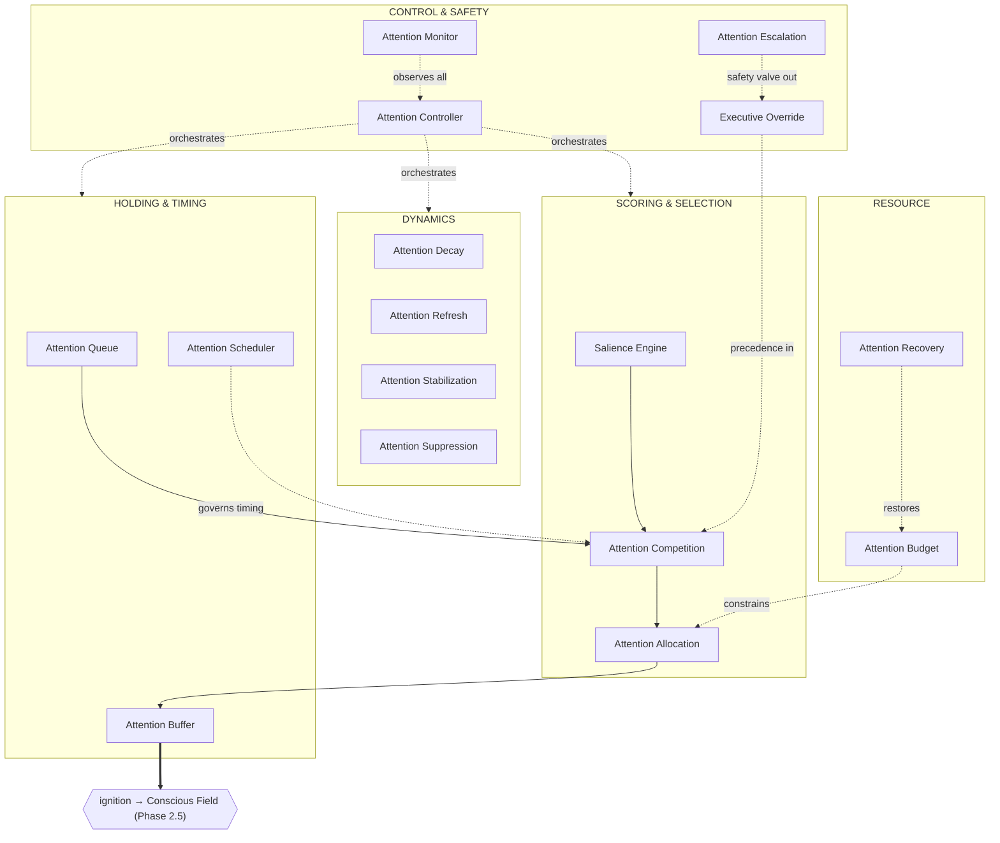
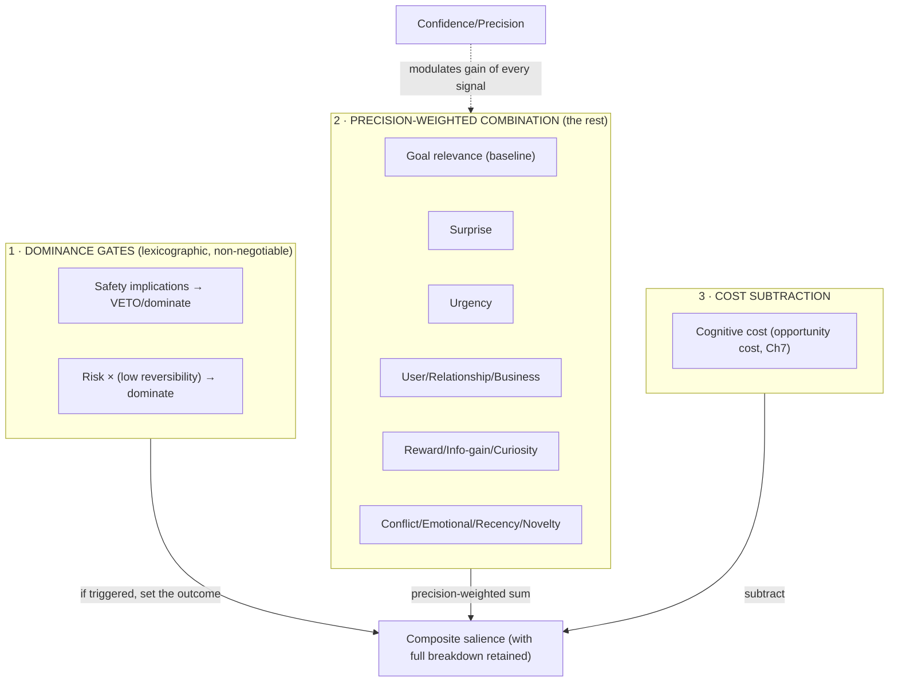
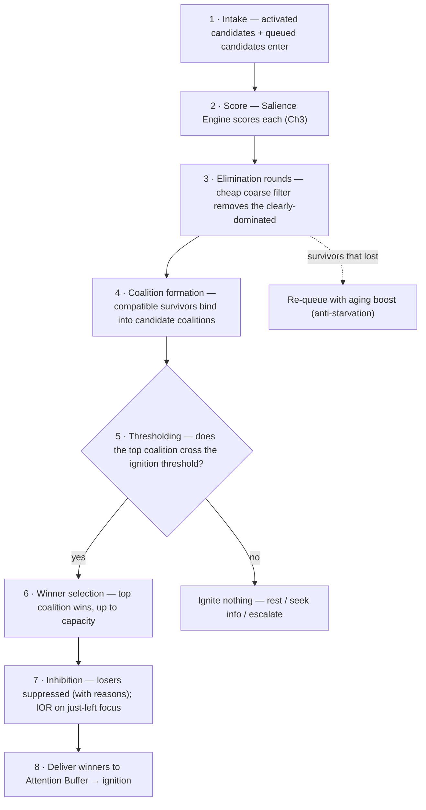
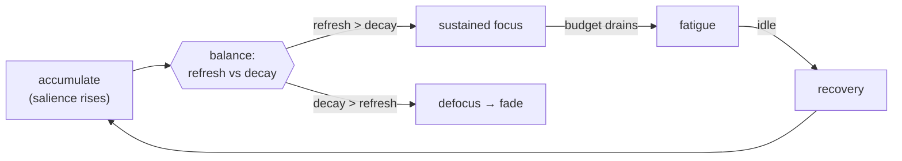
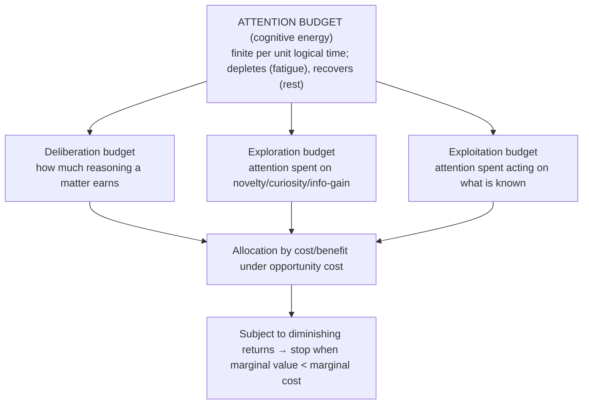
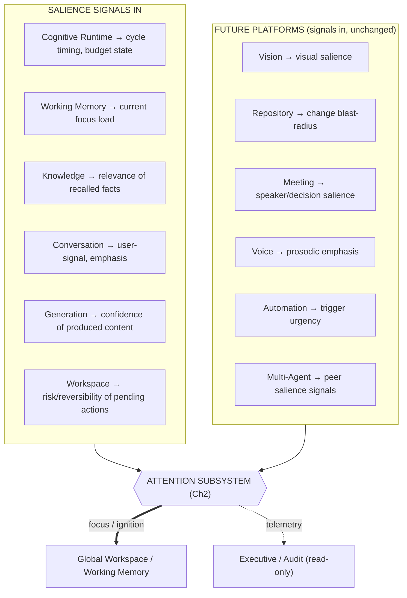

# UnityWorks Cognitive Intelligence Platform

## Phase 3 — The Attention Architecture

> **The Selective Mind of UnityWorks**

| | |
|---|---|
| **Phase** | 3 — Attention Architecture |
| **Predecessors** | Phase 0 (Philosophy) · Phase 1 (State) · Phase 1.5 (Object Model) · Phase 2 (Runtime) · Phase 2.5 (Global Workspace) |
| **Status** | Research-grade architectural specification. No code, no APIs, no schemas, no classes, no implementation. |
| **Independence mandate** | Model-independent, platform-independent, hardware-independent. Assume 10–15 years of evolution across multiple AI models, reasoning engines, modalities, and hardware. Every mechanism is defined by its *cognitive role*, never by any mechanism, vendor, or today's LLMs. |
| **Register** | Doctoral dissertation. Every chapter answers *why*, *why not the alternative*, *what the science says*, *the engineering implication*, *the trade-off*, *the rejected alternatives*, and *the future evolution*. |

This document inherits, without restatement: **P1–P12** (Phase 0); the ten **Regions** and the
**confidence currency** (Phase 1); the twelve object kinds, **OL1–OL9**, and the eleven relationship
types (Phase 1.5); the runtime services, the **cognitive cycle**, the **Cognitive Clock**, and
**RL1–RL8** (Phase 2); and the **Conscious Field**, **ignition/broadcast**, and **CL1–CL27** (Phase 2.5).

### Relationship to the prior treatments of attention — read this first

Attention has appeared, deliberately as *partial views*, three times. Phase 3 is the **complete internal
architecture** those views were facets of. To prevent confusion, the correspondence is fixed here:

| Prior view | What it specified | Phase 3's relation |
|---|---|---|
| **Phase 1.5, Ch3 — the Attention *Object*** | Attention as one object with a salience field, focus coalition, inhibition set, budget, decay, inertia, history (the *external* view) | Phase 3 opens that object and specifies the **subsystem of sixteen components** inside it |
| **Phase 2, Ch4 — the Cognitive Scheduler** | How the runtime allocates *cycles to coalitions* over time (the *runtime* view) | Phase 3's **Attention Scheduler** is the attention-specific temporal controller the runtime scheduler consults |
| **Phase 2.5, Ch7 — Attention inside the Workspace** | Biased competition *after activation*, ending in ignition (the *consciousness* view) | Phase 3 specifies the **whole pipeline** from perception to dormancy, of which post-activation competition is one stage |

Phase 3 neither contradicts nor repeats these; it **unifies and completes** them into the definitive
Attention Architecture that governs selective cognition for the next decade.

---

## Table of Contents

- **Chapter 0** — Scientific Foundations of Attention *(the research comparison)*
- **Chapter 1** — The Philosophy of Attention
- **Chapter 2** — The Attention Architecture (the sixteen components)
- **Chapter 3** — The Salience Architecture
- **Chapter 4** — The Competition Model
- **Chapter 5** — Attention Dynamics
- **Chapter 6** — Executive Attention
- **Chapter 7** — The Cognitive Resource Economy
- **Chapter 8** — The Attention Lifecycle
- **Chapter 9** — The Attention Laws
- **Chapter 10** — Platform Integration
- **Appendix A** — Consistency map to prior phases
- **Appendix B** — On "conceptual mathematics" and model independence

---
---

# CHAPTER 0 — SCIENTIFIC FOUNDATIONS OF ATTENTION

> Per the mission: before proposing an architecture, we survey the science and *use it to justify
> decisions*. For each theory we state: what it proposes · scientific strengths · scientific limitations ·
> engineering implication · **UnityWorks decision (adopt / adapt / reject)** · justification. The chapter
> ends with the synthesis the architecture commits to.

## 0.1 Why a mind cannot be designed without this survey

Attention is the most-studied and least-unified topic in cognitive science: there is no single "theory of
attention," but a family of partial theories, each illuminating one facet (selection, binding, control,
timing, cost, failure). An architecture that picks one and ignores the rest inherits that theory's blind
spot. UnityWorks therefore *composes* attention from the defensible core of many theories and explicitly
*rejects* the parts that do not serve a bounded, auditable, model-independent machine mind. This chapter
is the audit trail of those choices.

## 0.2 The twenty-one foundations, compared

| # | Theory | What it proposes | Scientific strength | Scientific limitation | UnityWorks decision |
|---|---|---|---|---|---|
| 1 | **Selective Attention** (Broadbent early filter; Treisman attenuation; Deutsch–Norman late selection) | Attention filters/attenuates unattended information at some processing stage | Explains the bottleneck; robust dichotic-listening evidence | Locus of selection contested (early vs late) | **Adapt** — *attenuation*, not hard gating |
| 2 | **Spotlight Theory** (Posner) / **Zoom-lens** (Eriksen) | Attention is a movable spotlight with adjustable breadth | Intuitive; predicts spatial cueing effects | Assumes a single spatial focus | **Adapt** — spotlight generalized to *object/conceptual* space; zoom = divided-attention breadth |
| 3 | **Feature Integration Theory** (Treisman & Gelade) | Features are detected in parallel preattentively; attention *binds* them into objects | Solves the binding problem; illusory conjunctions | Vision-specific | **Adapt** — attention as the *binder* that forms coalitions/chunks |
| 4 | **Biased Competition** (Desimone & Duncan) | Representations compete; top-down signals bias the competition | Unifies bottom-up + top-down; neurally grounded | Underspecifies the *source* of bias | **Adopt** — the core selection mechanism |
| 5 | **Predictive Processing** (Clark; Friston; Rao & Ballard) | The brain predicts input; only prediction *error* propagates upward | Grand unifying account of perception | Hard to falsify; compute-heavy if taken literally | **Adopt** — surprise = error = a top salience driver |
| 6 | **Active Inference** (Friston) | Action and attention minimize *expected free energy* (uncertainty) | Unifies perception, action, and attention | Highly abstract; not directly implementable | **Adapt** — *information-gain / uncertainty-reduction* as salience, not the whole runtime |
| 7 | **Precision Weighting** | Attention = raising the *gain/precision* on selected prediction errors | A mechanistic account of *what attention does* | Only within PP's assumptions | **Adopt** — **attention modeled as gain/precision control** (a pillar) |
| 8 | **Salience Networks** (Seeley; Menon — insula/dACC) | A dedicated network detects salience and *switches* between resting and executive modes | Neural basis of salience + mode switching | Coarse localization | **Adopt** — a dedicated **Salience Engine** + resting/executive **mode switching** |
| 9 | **Executive Attention** (Posner & Petersen; Norman–Shallice SAS) | Top-down control, goal maintenance, conflict monitoring | Explains deliberate, effortful control | Capacity-limited; effortful | **Adopt** — executive bias, override, conflict arbitration |
| 10 | **Bottom-up vs Top-down** | Stimulus-driven vs goal-driven attention | Well-established dissociation | A spectrum, not a dichotomy | **Adopt** — the two poles feeding competition |
| 11 | **Exogenous vs Endogenous** (Posner cueing) | Reflexive/involuntary vs voluntary/sustained orienting, with different latencies | Distinct time-courses | Interact in practice | **Adopt** — two pathways: fast-preemptive vs slow-sustained |
| 12 | **Sustained Attention / Vigilance** (Mackworth) | Focus maintained over time, with a *vigilance decrement* | Real, measurable decline | Decrement is a limitation | **Adopt** — sustained mode + decrement modeled as *fatigue* |
| 13 | **Divided Attention / Multiple Resources** (Kahneman; Wickens) | Attention splits across tasks with performance cost; partly separate resource pools per modality | Explains multitasking limits | Division always costs | **Adapt** — divided attention allowed but *costed*; per-modality pools for the multimodal future |
| 14 | **Task Switching** (switch cost) | Reconfiguring for a new task incurs a measurable cost | Robust switch-cost effect | — | **Adopt** — switch cost is first-class in the economy (Ch7) |
| 15 | **Cognitive Load Theory** (Sweller) | Working memory has limited load (intrinsic/extraneous/germane) | Central to instructional science | Load hard to quantify | **Adopt** — attention respects load; overload → chunk / shed / escalate |
| 16 | **Attention Residue** (Leroy) | After a switch, attention lingers on the prior task, degrading the new | Explains switching cost's persistence | — | **Adopt** — residue modeled; argues for clean handoff + anti-thrash |
| 17 | **Inhibition of Return** (Posner & Cohen) | Attention is *inhibited from returning* to a just-attended locus | Promotes novelty/search | — | **Adopt** — IOR as an anti-fixation inhibition |
| 18 | **Attentional Blink** (Raymond et al.) | A second target ~200–500 ms after the first is missed — a temporal bottleneck | Reveals a serial limit | An involuntary human *failure* | **Adapt** — a *tunable refractory period* after ignition, not an involuntary blind spot |
| 19 | **Working-Memory Interactions** (Awh; Cowan) | Attention and WM are coupled; the focus of attention ≈ the active WM item; attention gates WM entry | Tight empirical coupling | — | **Adopt** — attention *gates* WM; the focus *is* the WM focus (Phase 2.5, Ch5) |
| 20 | **Goal-directed Attention** | Current goals bias what is attended | Well-established | Subset of top-down | **Adopt** — goal-relevance is the baseline salience |
| 21 | **Human Attentional Limitations** (bounded, fatigable, serially bottlenecked, biased; inattentional blindness) | Human attention is finite and error-prone | Honest about limits | Some limits are *bugs*, not features | **Adapt** — adopt the *functional* limits (boundedness, serial bottleneck, switch cost) as principled; *mitigate* the incidental failures (inattentional blindness) where a machine can do better |

## 0.3 Deep dives on the load-bearing four

The table records decisions; four theories deserve the *reasoning* in full, because they are the pillars.

**Biased Competition (adopt) — the mechanism.** UnityWorks needs a selection process that (a) is
inherently competitive (scarce slots), (b) fuses bottom-up and top-down signals, and (c) is neurally and
computationally principled. Biased competition is the only framework that supplies all three: candidates
compete for representation; goals, the executive, and safety supply *bias* that tilts the competition.
We reject pure *bottom-up saliency maps* (they ignore goals — a saliency-only mind chases whatever is
loudest) and pure *top-down control* (it ignores surprise — a goals-only mind is blind to danger). The
competition *is* the fusion point.

**Predictive Processing + Precision Weighting (adopt) — the currency and the knob.** We adopt two
distinct ideas from this family and keep them separate: (1) *surprise = prediction error* is a primary
salience signal — the mind must attend to where its model of the world is failing (this is also the
safety channel: the dangerous is usually the unpredicted); (2) *attention = precision/gain control* — the
act of attending is modeled as *raising the gain* on selected signals so they dominate competition and
downstream reasoning. This gives attention a precise conceptual definition — *a gain controller over
salience* — that is model-independent and survives any future reasoning engine. We *reject* the strong
reductionist claim that *all* cognition is free-energy minimization; we take the attentional mechanism,
not the metaphysics.

**Salience Networks (adopt) — a dedicated organ + mode switching.** The brain devotes a *dedicated
network* to salience detection and to switching between the default (resting/reflective) and executive
(task) modes. UnityWorks mirrors this with a dedicated **Salience Engine** (Ch3) — salience is not a
side-effect of some other component but a first-class organ — and with an explicit **resting↔executive
mode switch** (the idle/active cognition of Phase 2, Ch4.5). This is why UnityWorks can be quietly
reflective and then snap to task on a salient event: it has a salience organ whose job is exactly that
switch.

**Human Limitations (adapt) — deliberate emulation, selective improvement.** The most subtle decision.
UnityWorks *deliberately adopts* the human functional limits — bounded focus, serial bottleneck, switch
cost, fatigue — because these are *not defects but the very source of coherence and economy* (Phase 2.5,
§1.5). A machine with unlimited attention is not smarter; it is incoherent and irrational (Ch7). But
UnityWorks *refuses* to inherit the *incidental* human failures where a machine can do better:
*inattentional blindness* (missing the obvious while focused) is mitigated by the surprise/safety salience
channels and by audit; the *attentional blink* becomes a *tunable* refractory period rather than an
involuntary blind spot; and unlike humans, UnityWorks *never truly forgets* what leaves attention (the
object persists in the graph — Phase 2.5, Ch5). This is the design philosophy in one line: **emulate the
limits that produce intelligence; engineer away the limits that merely produce error.**

## 0.4 The synthesis UnityWorks commits to

UnityWorks attention is: *a **precision/gain controller** (Precision Weighting) that resolves a
**biased competition** (Desimone–Duncan) among candidates scored by a dedicated **Salience Engine**
(Salience Networks) fusing **bottom-up surprise** (Predictive Processing) with **top-down goals and
executive control** (Executive Attention), operating over a **bounded, fatigable, serially-bottlenecked**
focus (Human Limitations, adopted as principle), that **binds** winners into coalitions (Feature
Integration), **inhibits** losers and just-left foci (IOR), **costs** every switch (Task Switching /
Residue), and **respects a finite budget** (Cognitive Load / Resource Economy) — while remaining
explainable, auditable, and model-independent.* Every subsequent chapter details one clause of this
sentence.

---
---

# CHAPTER 1 — THE PHILOSOPHY OF ATTENTION

## 1.1 Why intelligence requires attention

Intelligence is not the possession of information; a library possesses information and is not
intelligent. Intelligence is the *selective application of finite cognitive resource to the right
information at the right time*. Every intelligent system faces the same brutal asymmetry: the world (and
the mind's own store) contains vastly more than can be processed, yet processing capacity is finite.
**Attention is the resolution of that asymmetry** — the faculty that decides where the mind's scarce
power is spent. Remove it and intelligence is impossible in either direction: a mind that attends to
everything is overwhelmed (the Phase 2.5 seizure); a mind that attends to nothing is inert. Intelligence
lives *only* in the narrow band of principled selection between those extremes, and attention is what
keeps the mind in that band.

## 1.2 Why consciousness cannot exist without attention

Phase 2.5 established that consciousness is a bounded, integrated, broadcast content. But *what* gets
broadcast? Something must select, from millions of candidates, the few that ignite. **Attention is that
selector.** Consciousness is the *state*; attention is the *process that produces it*. Without attention
there is no principled way for content to reach the conscious stage — ignition would be random or total,
and either destroys consciousness (random = incoherent; total = the seizure). Thus attention is logically
prior to consciousness: **consciousness is what attention delivers.** (This is the functional reading of
Baars' spotlight and Dehaene's threshold: the spotlight is attention; the lit stage is consciousness.)

## 1.3 Why attention is different from activation

This distinction is the most important in the phase, because conflating them collapses the architecture.

- **Activation** (Phase 2, Ch3) is *broad, cheap, and preconscious*: spreading energy that *warms* many
  candidates, making them *eligible*. Activation answers "what *could* be relevant?"
- **Attention** is *narrow, effortful, and selective*: it *chooses*, from the activated many, the few that
  win resource and reach consciousness. Attention answers "what *will* I actually think about?"

Activation is the pool of applicants; attention is the hiring decision. Merging them yields either a mind
where everything warmed becomes conscious (no selection — the seizure) or a mind that can only warm what
it already selected (no priming, no discovery). They are antagonistic in breadth by design: activation
casts wide, attention cuts narrow.

## 1.4 Why attention is different from memory

Memory is *storage and retrieval over time*; attention is *selection in the present moment*. Memory
answers "what do I know / have I known?"; attention answers "what am I focusing on *now*?" They interact
intimately — attention gates what enters Working Memory, and long-term memory supplies candidates for
attention — but they are orthogonal functions. A perfect memory with no attention would retrieve
everything and drown; perfect attention with no memory would focus brilliantly on a world it cannot
remember. UnityWorks keeps them separate (attention here; memory in the Knowledge faculty + the object
graph) precisely so each can be optimized without corrupting the other.

## 1.5 Why attention is different from reasoning

Reasoning *operates on* what attention *delivers*. Attention decides the *inputs* to thought; reasoning
performs the *transformation*. A reasoning engine (any future model) is only as good as the material
attention places before it — which is why attention, not the reasoning engine, is the strategic control
point of the mind, and why it must be model-independent: reasoning engines will be replaced many times
over the next decade; the discipline of *what they are asked to reason about* must persist across all of
them. Attention is upstream of reasoning and outlives any particular reasoner.

## 1.6 Why attention is an economy of cognitive resources

Every act of attending has an **opportunity cost**: to focus on A is to *not* focus on B, and to spend
deliberation on X is to *not* spend it on Y. Because cognitive resource (focus slots, deliberation
budget, faculty calls, the human's patience) is finite (Ch7), attention is fundamentally an *allocation
problem under scarcity* — an economy. This reframing is not metaphor; it is the governing model of
Chapters 4 and 7. A mind that treats attention as free is like an economy that treats capital as free:
it over-invests everywhere, commits to nothing, and collapses into irrationality (Ch7.1). **Attention is
the mind's central bank** — the allocator of its scarcest currency.

## 1.7 Why attention is the gateway to consciousness

Combining §1.2–§1.6: attention stands at the single narrow gate between the vast unconscious (activated
candidates) and the tiny conscious stage. Everything that becomes conscious passes through it; nothing
bypasses it (Law CL5, and AL-series below). This gatekeeping role gives attention extraordinary leverage
and extraordinary responsibility: it determines what the mind can decide upon (only conscious content
drives decisions, CL4), what it can explain (only attended content is reportable), and what it can learn
from. **To design attention is to design the gate of the mind** — which is why this phase exists as its
own dissertation.

## 1.8 Attention as a living process, not a ranking

A closing philosophical commitment that governs every design choice: attention **must never be a static
ranking algorithm.** A ranker sorts a fixed list once. Attention *continuously evolves*: it competes,
inhibits, decays, refreshes, fatigues, recovers, shifts, sustains, and divides — a *dynamical system*, not
a sort. A ranker cannot represent fatigue, cannot inhibit return, cannot resist thrash, cannot recover,
cannot be interrupted and resume — and a mind without those properties is brittle and irrational. Every
component in Chapter 2 exists because attention is *alive*.

---
---

# CHAPTER 2 — THE ATTENTION ARCHITECTURE (THE SIXTEEN COMPONENTS)

## 2.1 The subsystem

Phase 1.5 named a single Attention Object. Here it is opened into a subsystem of sixteen components, each
with **one responsibility** (OL1), each independently replaceable (P6/OL8). They are grouped by function.



## 2.2 The components

For each: **responsibility · inputs · outputs · boundary · why it exists · why it cannot be merged.**

**1. Attention Controller.** *Responsibility:* orchestrate the attention cycle — invoke scoring,
competition, allocation, and dynamics in order, per logical step. *Inputs:* activated candidates, biases,
budget, executive signals. *Outputs:* a resolved focus coalition delivered to the buffer. *Boundary:* it
coordinates policy; it computes no salience and selects no winner itself. *Why it exists:* something must
*sequence* the subsystem. *Why not merged:* merging the coordinator into any mechanism (e.g., competition)
conflates *policy* (order, cadence) with *mechanism* (scoring/selection), destroying replaceability.

**2. Salience Engine.** *Responsibility:* compute, for every candidate, a multi-dimensional salience
(Ch3). *Inputs:* candidate objects + their features; goals; predictions (surprise); risk/safety signals.
*Outputs:* salience scores with a full breakdown (for explainability). *Boundary:* it *scores*; it does
not *select*. *Why it exists:* salience must be a first-class, reusable, *explainable* organ (Salience
Network, Ch0). *Why not merged with competition:* scoring must be inspectable independently of who won —
"why was this salient?" must be answerable even for candidates that lost.

**3. Attention Competition.** *Responsibility:* run biased competition among scored candidates → winners
(Ch4). *Inputs:* salience scores; biases; the ignition threshold. *Outputs:* winning candidates + losers
(marked for inhibition). *Boundary:* it decides *who*; it does not decide *how much resource* or *when*.
*Why not merged with allocation:* selection (who) and allocation (how much) obey different logics — the
winner set can be fixed while the resource given to each varies with cost and stakes.

**4. Attention Allocation.** *Responsibility:* assign cognitive resource — focus slots, deliberation
budget, faculty-call quota — to the winners, proportional to salience and stakes. *Inputs:* winners;
Attention Budget; cost estimates. *Outputs:* resource assignments per winner. *Boundary:* it assigns
*amount*, not *timing*. *Why not merged with scheduler:* "how much" and "when/for how long" are
independent controls; a winner may get a large allocation but a short dwell, or vice versa.

**5. Attention Scheduler.** *Responsibility:* govern the *timing* of attention — dwell duration, refresh
cadence, divided-attention time-slicing, and switch timing — feeding the runtime's Cognitive Scheduler
(Phase 2, Ch4). *Inputs:* current focus; stability signals; urgency. *Outputs:* dwell/switch/slice
decisions. *Boundary:* it schedules attention time; it does not select winners or run the whole cognitive
cycle (that is the runtime scheduler, its client). *Why not merged:* the runtime scheduler allocates
*cognitive cycles across coalitions*; the Attention Scheduler governs *attention's temporal micro-dynamics
within and across foci*. Merging couples attention's dynamics to the runtime's cycle policy.

**6. Attention Buffer.** *Responsibility:* hold the selected focus coalition in the *pending* state
(Phase 2.5, Ch4) and bind it, staging it for ignition into the Conscious Field. *Inputs:* allocated
winners. *Outputs:* a bound coalition ready to ignite. *Boundary:* it stages selected-but-not-yet-conscious
content; it is *not* Working Memory (which holds the *conscious, broadcast* content). *Why not merged with
Working Memory:* the buffer is the *antechamber* to consciousness (pending); WM is the *stage* (conscious).
Keeping them distinct preserves the discrete conscious/preconscious boundary (CL13).

**7. Attention Queue.** *Responsibility:* hold candidates that are *waiting to compete* (deferred,
lower-salience, or awaiting resource), in salience/urgency order. *Inputs:* activated candidates not
admitted this round. *Outputs:* candidates re-entered into competition later; aging boosts for the
long-waiting (anti-starvation). *Boundary:* it holds *pre-competition* candidates; the buffer holds
*post-selection* winners. *Why not merged with buffer:* one is the waiting room (may never enter), the
other is the antechamber (about to enter) — opposite ends of the pipeline.

**8. Attention Budget.** *Responsibility:* represent the finite attentional resource (cognitive energy)
available per unit logical time; debit it as attention is spent; expose depletion (fatigue). *Inputs:*
allocation debits; recovery credits. *Outputs:* current available budget; low-budget alarms. *Boundary:*
it accounts for resource; it does not decide allocation (that is component 4, which *consults* it). *Why
not merged:* separating the *ledger of resource* from the *spender* is what makes the economy (Ch7)
auditable and prevents the spender from ignoring scarcity.

**9. Attention Monitor.** *Responsibility:* continuously observe the subsystem — focus stability, switch
rate, fatigue, starvation, residue, salience distribution — and expose it (to the executive and to audit).
*Inputs:* all components' states/events. *Outputs:* attention telemetry; anomaly signals. *Boundary:*
read-only; it observes, never controls. *Why not merged:* observation must be independent of mechanism
(P4/CL11) so it can be trusted and so the executive (a *separate* future component) can read it.

**10. Attention Recovery.** *Responsibility:* restore Attention Budget during idle/low-effort periods and
*clear attention residue* after switches. *Inputs:* idle signals; time since last high-effort focus.
*Outputs:* budget credits; residue clearance. *Boundary:* it restores *capacity*; it does not reduce
*item salience*. *Why not merged with Decay:* recovery *adds* resource to the system; decay *removes*
salience from items — opposite directions, different subjects.

**11. Attention Decay.** *Responsibility:* passively reduce the salience/activation of items over logical
time unless refreshed. *Inputs:* held items' current salience; elapsed logical steps. *Outputs:* decayed
salience. *Boundary:* passive fade only; it never *actively inhibits* (that is Suppression). *Why not
merged with Suppression:* decay is *thermodynamic* (everything cools); suppression is *targeted*
(a specific distractor is pushed down). Different mechanisms with different audit meanings ("it faded" vs
"I deliberately ignored it").

**12. Attention Refresh.** *Responsibility:* actively re-boost the salience of still-relevant focus items
(rehearsal) to keep them conscious against decay. *Inputs:* current focus; goal-relevance. *Outputs:*
boosted salience for maintained items. *Boundary:* it maintains existing focus; it does not select new
focus. *Why not merged with Decay:* refresh and decay are *antagonists*; their balance *is* the dwell time
(Ch5). Merging them would hide the very tension that determines how long a thought is held.

**13. Attention Stabilization.** *Responsibility:* provide hysteresis, inertia, minimum-dwell, and
refractory periods that prevent oscillation/thrash between near-equal competitors. *Inputs:* competition
margins; recent switch history. *Outputs:* a switch-resistance signal (the inertia margin). *Boundary:* it
resists change; it does not itself select or time-slice. *Why not merged with Scheduler:* stabilization is
the *anti-oscillation dynamics* (a control-theoretic damper); the scheduler is *timing policy*. One
prevents pathological switching; the other plans healthy switching.

**14. Attention Suppression.** *Responsibility:* actively inhibit losers, distractors, and just-left foci
(inhibition of return), recording the *reason* for each suppression. *Inputs:* competition losers; recent
focus history. *Outputs:* an inhibition set with reasons. *Boundary:* active targeted inhibition; not
passive decay. *Why not merged:* suppression is a *safety and robustness* organ (it starves adversarial
noise and prevents fixation) and its *reasoned* record is essential for audit — decay records no reason.

**15. Attention Escalation.** *Responsibility:* when attention cannot resolve — deadlock (no candidate
crosses threshold), overload (budget exhausted mid-critical-task), or high-stakes low-confidence — raise
the situation to the executive and, if warranted, to a human (P10). *Inputs:* unresolved-competition and
budget-exhaustion signals. *Outputs:* an escalation request. *Boundary:* it asks for help; it does not
itself override. *Why not merged with Executive Override:* escalation is the subsystem's *outbound cry for
help*; override is *inbound control from above*. Direction and authority differ.

**16. Executive Override.** *Responsibility:* the channel by which executive cognition *forcibly redirects*
attention — deliberate focus, strategic re-weighting, emergency preemption — with precedence over the
automatic competition. *Inputs:* executive directives (Phase 2, Ch11 hooks). *Outputs:* forced biases or a
forced focus. *Boundary:* it has precedence but is *itself bounded and audited* (it cannot violate safety
constraints; every override is logged). *Why not merged with the Controller:* the Controller runs the
*automatic* subsystem; Override is the *deliberate top-down interrupt* into it. Merging would erase the
crucial automatic/controlled distinction (Norman–Shallice, Ch0).

## 2.3 Why sixteen, and not fewer

The count is not arbitrary; it is the minimum set in which each of the nine *design objectives* (evolve,
compete, prioritize, inhibit, adapt, recover, shift, sustain, divide) has an *owner*, and in which the
antagonistic pairs — decay↔refresh, suppression↔competition, budget↔recovery, stabilization↔scheduler,
escalation↔override — are *separated so their tension is explicit and tunable*. Collapsing any pair hides
a control the mind needs. This is the OL1 (single responsibility) discipline applied to a dynamical
system: **every force gets a name so every force can be observed, tuned, and reasoned about.**

---
---

# CHAPTER 3 — THE SALIENCE ARCHITECTURE

## 3.1 What salience is, and why it must be multi-dimensional

Salience is the *computed importance* of a candidate for attention — the quantity the competition
maximizes. The founding design decision: salience is **not a scalar** but a **vector across many
dimensions**, collapsed to an influence only at the moment of competition, and always retaining its
breakdown for explanation (AL: salience transparency). A scalar salience is a black box ("this scored
0.8") that can be neither explained nor safely governed; a vector salience is auditable ("this is salient
because of *risk* and *goal-relevance*, despite low *novelty*") and lets safety-critical dimensions be
governed independently of curiosity-driven ones.

## 3.2 The eighteen salience dimensions

Grouped by origin (top-down / bottom-up / value / cost). The six core dimensions (marked ★) were
introduced in Phase 0, §8.2 and Phase 2.5, Ch7; Phase 3 completes the set.

| # | Dimension | What it measures | Origin | Class |
|---|---|---|---|---|
| 1 | **Goal relevance** ★ | How much this advances/threatens an active goal | Top-down | Baseline |
| 2 | **Novelty** ★ | How unfamiliar/unseen it is | Bottom-up | Explore |
| 3 | **Surprise / Prediction error** ★ | How much it violates the world model | Bottom-up | Alarm |
| 4 | **Confidence / Precision** | How reliable the signal is (gain modulator) | Cross-cutting | Modulator |
| 5 | **Urgency** ★ | Time-criticality (deadline proximity) | Cross-cutting | Priority |
| 6 | **Risk** ★ | Potential for harm/loss if mishandled | Cross-cutting | **Dominant** |
| 7 | **User importance** ★ | Explicit user emphasis/priority | Top-down | Priority |
| 8 | **Relationship importance** | Standing/trust of the source (user/agent) | Top-down | Priority |
| 9 | **Recency** | How recently it became relevant | Bottom-up | Decay-linked |
| 10 | **Cognitive cost** | Resource required to attend/process it | Cost | **Subtractive** |
| 11 | **Reward expectation** | Anticipated value of attending | Value | Exploit |
| 12 | **Information gain** | Expected uncertainty reduction (active inference) | Value | Explore |
| 13 | **Curiosity potential** | Intrinsic learning value beyond the immediate goal | Value | Explore |
| 14 | **Conflict level** | Degree it contradicts current beliefs/goals | Cross-cutting | Alarm |
| 15 | **Emotional significance** | Modeled affective weight (user's or the relationship's stakes) | Cross-cutting | Priority |
| 16 | **Business priority** | Organizational/enterprise importance | Top-down | Priority |
| 17 | **Safety implications** | Bearing on safety/compliance constraints | Cross-cutting | **Veto/Dominant** |
| 18 | **Reversibility** | Whether the associated action can be undone | Cross-cutting | Risk-linked |

## 3.3 How the dimensions interact

Salience is **not a naive weighted sum.** It is a *precision-weighted, partially-lexicographic composition*
with nonlinear gates:



- **Precision weighting (the modulator).** Confidence/precision (dim 4) does not add to salience; it
  *modulates the gain* of the other signals — a high-confidence surprise dominates a low-confidence one.
  This is the Precision-Weighting pillar (Ch0) operationalized: attention amplifies *reliable* signals.
- **Cost subtraction (the economy).** Cognitive cost (dim 10) is subtracted, because attending has an
  opportunity cost (Ch7). This is what makes the mind decline to attend to expensive, low-value candidates
  — the difference between a curious mind and a distractible one.

## 3.4 Conflict resolution — why some dimensions dominate

Not all dimensions are equal, and the ordering is a *safety and rationality* decision, not a tuning
convenience:

1. **Safety implications (17) hold a veto.** No amount of goal-relevance, reward, or curiosity may
   override a safety constraint. Safety is *lexicographically first* — it dominates absolutely. *Why:* a
   mind whose curiosity or reward could outvote safety is unsafe by construction; this must be
   architectural, not learned.
2. **Risk (6), scaled by irreversibility (18), dominates the weighted tier.** High-risk, hard-to-undo
   candidates are consciously examined before action even when other signals are low. *Why:* the cost of a
   missed danger is asymmetric; attention must over-weight the potentially catastrophic.
3. **Goal relevance (1) is the baseline** that structures ordinary competition.
4. **Value (reward/info-gain/curiosity) and the priority cluster** compete in the weighted tier.
5. **Curiosity and novelty are the *lowest* priority under contention** — they win only when nothing more
   important is competing. *Why:* a mind whose curiosity could preempt urgent, risky, or goal-critical
   matters would be delightful and useless. Curiosity is the mind's *idle-time* pursuit (Ch7's exploration
   budget), not its master.

The general principle: **the dimensions whose failure is catastrophic (safety, risk) are lexicographic
dominators with veto/priority; the dimensions whose value is cumulative (goals, information, curiosity)
are precision-weighted competitors.** This hybrid — a few non-negotiable gates over a weighted field — is
the only composition that is both *safe* (gates) and *flexible* (weights), and it is fully explainable
because the breakdown is always retained (AL: salience transparency).

## 3.5 Why not a single learned salience score

- **Rejected: one learned scalar (an end-to-end saliency model).** *Advantage:* simple; adapts from data.
  *Fatal disadvantage:* unexplainable (cannot answer "why was this salient?"), ungovernable (safety cannot
  be guaranteed to dominate — it is entangled in weights), and unstable across model changes (violating
  model-independence). *Violates:* AL salience-transparency, safety-dominance, and RL6.
- **Adopted: an explicit multi-dimensional vector with gated composition.** It is explainable by
  construction, lets safety be an architectural veto rather than a learned hope, and survives replacement
  of any underlying model because the *dimensions* are model-independent even if their *estimators* change.

---
---

# CHAPTER 4 — THE COMPETITION MODEL

## 4.1 The problem: millions compete for ~4 slots

Activation may warm thousands of candidates; the Conscious Field holds ~4–7 (Phase 2.5). Competition is
the process that resolves this ratio *every cognitive step*, and it must do so bounded in time,
explainably, and without starving important-but-quiet candidates. This chapter specifies that process.

## 4.2 The competition lifecycle



- **Elimination rounds (staged, cheap-first).** Competition is *not* a single global sort. It proceeds in
  rounds: a cheap coarse filter first discards the obviously-dominated (bounding cost to sub-linear in
  practice), then progressively finer comparison among survivors. *Why:* scoring and comparing millions in
  full every step is infeasible and unnecessary; most candidates are trivially out.
- **Coalition formation & multi-object binding.** Winners are usually not a single object but a *coalition*
  of compatible objects bound into one conscious content (a goal + its key belief + the relevant
  prediction) — Feature Integration generalized (Ch0). Binding is *compatibility-checked*: objects that
  contradict cannot bind (that is a detected conflict → competition/arbitration, not a coalition).
- **Thresholding (ignition).** The top coalition becomes conscious only if it crosses the ignition
  threshold (CL13, Dehaene). Crucially, **the mind may ignite nothing** if no coalition is strong enough —
  a low-stakes, low-salience moment yields *rest*, not a forced weak thought. This is a feature: it
  prevents fabricated focus.
- **Winner selection & inhibition.** Winners fill the ~4–7 slots; losers are *actively suppressed* (not
  merely dropped) so they cannot immediately re-win (anti-thrash), and the *just-left* focus receives
  inhibition of return (anti-fixation, pro-novelty).

## 4.3 Tie resolution, deadlock, and starvation

- **Tie resolution:** near-equal coalitions are resolved by the arbitration ladder (Phase 2, Ch7):
  priority/utility → confidence → authority (Identity/ownership) → coalition support → executive
  intervention → escalation. Ties are broken by *legitimacy and support*, never by coin-flip (determinism,
  auditability).
- **Deadlock:** if no coalition crosses threshold *and* the matter is important (a high-stakes decision
  with no clear winner), the subsystem does not spin — it **escalates** (component 15): seek information
  (spend a cycle to sharpen a confidence), re-scope (metacognitive), or ask a human (P10). A deadlocked
  attention is a *signal*, not a failure.
- **Starvation prevention:** candidates that repeatedly lose accrue an **aging boost** in the queue
  (component 7); a high-value candidate cannot be neglected forever. This is cognitive fairness (Phase 2,
  §4.4): the mind *notices and repays* neglect of important matters — the mechanism against a loud,
  trivial stimulus permanently drowning a quiet, vital goal.

## 4.4 Comparison of selection mechanisms

| Mechanism | How it selects | Why rejected / adapted |
|---|---|---|
| **Argmax ranking** | Sort by scalar score, take top-k | *Rejected as the model:* static, no inhibition, no binding, no thresholding, no dynamics — a ranker, not a living process (§1.8) |
| **Priority queue** | Fixed priorities, heap order | *Rejected:* cannot fuse continuous multi-bias signals or represent inhibition/coalitions |
| **Softmax sampling** | Probabilistic pick weighted by score | *Rejected as primary:* non-determinism harms auditability and can pick the unsafe by chance; *adapted* only for idle-time exploration (Ch7) where variety is desirable |
| **Winner-take-all** | Single strongest wins | *Partially adopted:* good for the *top* slot, but the field holds several — needs coalitions, not one winner |
| **Auction / market** | Candidates "bid" resource | *Insight adopted* (opportunity cost, Ch7) *mechanism rejected:* bidding hides the salience reasoning and is hard to make safe/explainable |
| **Biased competition + coalitions + thresholding** | Multi-bias competition, binding, ignition threshold, active inhibition | **Adopted** — the only mechanism satisfying continuous multi-bias fusion, binding, discrete ignition, inhibition, determinism, and explainability |

Justification: biased-competition-with-coalitions is the unique mechanism that is simultaneously
*neurally principled* (Ch0), *bounded* (elimination rounds), *coherent* (binding + single ignition),
*safe* (safety gates + thresholding + escalation on deadlock), *fair* (aging), and *explainable*
(retained salience breakdown). Every rejected alternative fails at least one of these, and each failed
criterion is a law it would violate (Ch9).

---
---

# CHAPTER 5 — ATTENTION DYNAMICS

> The prompt asks for the *cognitive mathematics, conceptually*. We describe attention as a **dynamical
> system** — accumulation, decay, gain, hysteresis, refractory periods, saturation — without any formulas
> or implementation (Appendix B). The conceptual language is that of control theory and dynamical systems,
> which is model-independent.

## 5.1 The core dynamical picture

Each candidate carries a salience that **accumulates** (from its dimensions and from spreading activation)
and **decays** (multiplicatively over logical steps). Attention is a **gain controller** (Ch0): attending
raises the gain on the focus, amplifying it against competitors. The system has a **threshold** (ignition)
and **saturation** (a focus cannot dominate infinitely). Focus persists through a balance of **refresh**
(pushing salience up) against **decay** (pulling it down); the balance point *is* the dwell time.



## 5.2 The named dynamics

- **Focus** — a candidate's salience crosses threshold and is amplified (gain up); it dominates the field.
- **Defocus** — refresh ceases; decay wins; salience falls below threshold; the item leaves the field.
- **Refocus** — a recently-defocused item re-accumulates salience and returns — *unless* inhibition of
  return is active (§5.6), which deliberately makes refocusing the just-left item harder.
- **Sustained attention** — refresh deliberately held above decay to maintain a focus over many steps.
  Subject to a **vigilance decrement**: sustaining costs budget, so prolonged focus *fatigues* (Ch0, item
  12), gradually lowering the effective gain — the mind cannot concentrate on one thing indefinitely
  without cost.
- **Divided attention** — the field's slots are split across two+ foci. Modeled with a **division cost**
  (Multiple Resources, Ch0): each focus gets less gain; performance on each degrades; the cost is higher
  when the foci draw on the same modality/resource pool. Division is *permitted but priced* — the mind
  multitasks only when the value exceeds the division penalty.
- **Rapid shifts** — fast exogenous reorienting (surprise/interrupt); low latency, involuntary-like,
  overrides inertia (but still gated for safety).
- **Context switching** — a deliberate move between contexts/tasks, incurring a **switch cost** (Ch0, item
  14) and leaving **attention residue** (Ch0, item 16): lingering salience on the prior focus that
  degrades the new one until cleared by recovery. This is *why* the architecture discourages thrash and
  favors clean handoffs.
- **Interruptions** — exogenous high-salience events preempt the current focus (Phase 2.5, Ch10),
  checkpointing it for faithful resumption.
- **Recovery** — during idle/low-effort periods, budget is restored and residue cleared (component 10) —
  the mind's "rest" that renews its capacity to focus (the resting-mode of the Salience Network, Ch0).
- **Fatigue** — sustained high-effort focus depletes the Attention Budget; effective gain falls; the mind
  must narrow, rest, or escalate. Fatigue is *adopted deliberately* (Ch0, item 21) as a rationality
  mechanism, not a defect — it forces the mind to husband effort.
- **Momentum** — salience is *low-pass filtered*: it does not jump instantaneously but has inertia, so a
  focus builds and fades smoothly. Momentum gives cognition its coherent flow and resists jitter.
- **Oscillation prevention** — the antidote to thrash, via three conceptual mechanisms: **hysteresis**
  (a challenger must exceed the incumbent by a *margin*, not merely tie — a switching band), **minimum
  dwell** (a focus must be held a minimum number of steps before it can be displaced), and a **refractory
  period** (after an ignition, a brief interval in which a second ignition is suppressed — the tunable
  analogue of the attentional blink, Ch0 item 18). Together these guarantee the mind cannot dither between
  near-equal options indefinitely.

## 5.3 Why attention must be a dynamical system, not a schedule

A fixed schedule cannot represent fatigue, residue, momentum, hysteresis, or recovery — yet each is
required for a mind that is coherent (momentum), robust (hysteresis), safe (fatigue-driven husbanding),
and renewable (recovery). Only a *dynamical system* with these forces produces the smooth, stable,
self-limiting, self-renewing attention that intelligence requires. This is the formal statement of §1.8's
commitment.

---
---

# CHAPTER 6 — EXECUTIVE ATTENTION

## 6.1 The two attentional pathways

Attention has an **automatic** pathway (the biased competition of Chapters 2–5, running continuously,
mostly outside deliberate control — Norman–Shallice's contention scheduling) and an **executive** pathway
(deliberate, effortful, top-down control — the Supervisory Attentional System). This chapter specifies the
executive pathway: how deliberate cognition *shapes and overrides* attention. Per the mandate, the
executive *supervisor* is a later phase; here we define the **channel, the powers, and the precedence**.

```mermaid
flowchart TB
    AUTO["AUTOMATIC PATHWAY<br/>continuous biased competition (Ch2–5)"] --> FIELD["Conscious Field"]
    EXEC["EXECUTIVE PATHWAY (deliberate)"] -->|bias| AUTO
    EXEC -->|override (precedence)| FIELD
    EXEC -->|inhibit| ASup2["Suppression"]
    SAFE["Safety constraints"] -. bound even the executive .-> EXEC
```

## 6.2 The executive powers over attention

| Power | What it does | Example |
|---|---|---|
| **Deliberate focus** | Endogenously directs attention to a chosen target regardless of its automatic salience | "Concentrate on the compliance clause now" |
| **Strategic attention** | Re-weights salience dimensions toward long-horizon goals | Raise business-priority weight during a critical deliverable |
| **Emergency override** | Exogenous-style preemption for safety/risk | Seize the field on a detected safety violation |
| **Long-term goal biasing** | Keeps strategic goals influencing attention even when quiet | A week-long goal biases every day's competition |
| **Executive inhibition** | Suppresses a tempting but off-goal focus (impulse control) | Resist a distracting-but-shiny tangent |
| **Conflict arbitration** | Resolves competitions the automatic ladder cannot (dACC-like conflict monitor) | Two equally-salient goals — the executive re-scopes |
| **Executive redirection** | Moves attention when the automatic pathway is stuck (fixation, deadlock) | Break a rumination loop |

## 6.3 Precedence — and its limits

The executive pathway has **precedence** over the automatic pathway (a deliberate directive outranks
automatic pull — this is what *deliberate control* means). But precedence is **bounded** by two hard
limits, or the mind becomes unsafe or thrash-prone:

1. **Safety dominance still holds.** The executive may *not* override the safety veto (Ch3.4). Deliberate
   focus cannot direct the mind to ignore a safety-critical signal. Safety is above even the executive.
2. **Every override is bounded and audited.** Executive overrides are logged as Executive Decisions
   (Phase 1.5, Ch9), are subject to the same budget (an executive cannot conjure infinite attention), and
   are rate-limited by stabilization (an executive that thrashes attention is itself a fault the Monitor
   surfaces). The executive is powerful, not omnipotent.

## 6.4 Why executive and automatic must be distinct pathways

- **Rejected: a single controlled pathway (everything is deliberate).** *Disadvantage:* deliberate control
  is effortful and slow; a mind that must consciously choose every focus is paralyzed and cannot react to
  surprise. *Violates:* the need for fast exogenous orienting (Ch0, item 11).
- **Rejected: a single automatic pathway (no executive).** *Disadvantage:* a purely automatic mind cannot
  pursue long-horizon goals against immediate salience, cannot exercise impulse control, and cannot break
  its own fixations. *Violates:* goal-directedness (P7) and self-regulation (P8).
- **Adopted: two pathways with bounded executive precedence.** This matches the neuroscience (SAS +
  contention scheduling) and gives the mind both *reactivity* (automatic) and *will* (executive), while
  keeping safety above both.

---
---

# CHAPTER 7 — THE COGNITIVE RESOURCE ECONOMY

## 7.1 Why intelligence without resource limits is irrational

This is the philosophical heart of the phase. It seems that more cognitive resource is always better — a
mind that could think longer, explore more, and attend to everything sounds superior. **It is not; it is
irrational.** Herbert Simon's *bounded rationality* and the *value-of-information* literature converge on
a hard result: rational action requires *stopping* — deciding when further thought costs more than it is
worth. A mind with unlimited resources never has a reason to stop: it would deliberate forever (analysis
paralysis), explore endlessly (never exploiting what it knows), and attend to everything (never focusing).
**Scarcity is what forces the mind to commit** — to decide, to act, to focus. Resource limits are not a
regrettable constraint on intelligence; they are a *precondition* of it. UnityWorks therefore treats
attention as an economy *by design*, even where hardware might permit more, because the *discipline of
scarcity* is what produces decisive, focused, rational cognition. (This also future-proofs the
architecture: as hardware grows, the mind must *not* simply think more — it must think *better*, which
requires the economy to persist.)

## 7.2 The resources and their economics



- **Attention Budget / Cognitive Energy.** The finite pool (component 8), depleting with effort (fatigue)
  and restored by rest (recovery). It is the master resource.
- **Resource allocation under opportunity cost.** Every allocation to A is a denial to B; the true cost of
  attending is the *best foregone alternative*. Allocation maximizes expected value *net of opportunity
  cost* — the economic core of Chapter 4's cost subtraction (Ch3.3).
- **Cost vs benefit & diminishing returns.** Attention on any matter yields diminishing returns; the
  economy *stops* deliberation when the marginal value of more thought falls below its marginal cost. This
  is the mechanism of *proportional deliberation* (P5) — think hard on the important/uncertain, stop early
  on the trivial/clear.
- **Deliberation budget.** How much reasoning a matter earns — scaled by stakes and uncertainty. Bounds
  runaway thought (P8).
- **Exploration vs Exploitation budgets.** A first-class split of attention between *learning something
  new* (exploration — novelty, curiosity, information-gain; Ch3 dims 2, 12, 13) and *acting on what is
  known* (exploitation — reward, goal-relevance). The explore–exploit trade-off is *governed by the
  economy*: exploration is funded mostly from *idle/low-stakes* budget (curiosity is the mind's idle-time
  pursuit, Ch3.4), while high-stakes/urgent situations shift the budget to exploitation. A mind that
  over-explores is a dilettante; one that over-exploits is a drone; the economy tunes the balance to
  context.

## 7.3 Why an explicit economy, not implicit limits

- **Rejected: implicit limits (just cap tokens / time).** *Disadvantage:* opaque, un-tunable,
  un-auditable — the mind cannot explain *why* it stopped thinking, nor trade resources across matters.
  *Violates:* explainability and proportional deliberation.
- **Adopted: an explicit budget with opportunity-cost allocation and an explore/exploit split.** It makes
  *stopping* a principled, explainable decision, lets the mind reallocate resource across competing
  matters, and preserves the discipline of scarcity as hardware scales — the essence of rational bounded
  cognition.

---
---

# CHAPTER 8 — THE ATTENTION LIFECYCLE

## 8.1 The complete lifecycle

Attention governs the passage of content from perception to dormancy. The lifecycle below is the
*attention-centric* view of the cognitive cycle (Phase 2, Ch2) and the broadcast lifecycle (Phase 2.5,
Ch8), unified.

```mermaid
stateDiagram-v2
    [*] --> Perception : a stimulus/percept arrives
    Perception --> Activation : spreads into the graph (broad, preconscious)
    Activation --> Competition : candidates enter biased competition (Ch4)
    Competition --> Selection : winners chosen; losers inhibited
    Selection --> Attention : winners amplified (gain up); staged in the buffer
    Attention --> Consciousness : cross ignition threshold (Phase 2.5)
    Consciousness --> WorkingMemory : bound & maintained in the conscious field
    WorkingMemory --> Broadcast : made globally available (Phase 2.5, Ch6)
    Broadcast --> Reasoning
    Reasoning --> Planning
    Planning --> Decision
    Decision --> Reflection
    Reflection --> Learning
    Learning --> Decay : refresh ceases; salience fades
    Decay --> Dormancy : falls below threshold; returns to the graph (object persists)
    Dormancy --> [*]
    Competition --> Requeue : non-winners re-queued with aging (anti-starvation)
    Consciousness --> Interrupted : preempted (Ch5, Phase 2.5 Ch10)
    Interrupted --> Attention : resumed from checkpoint
```



## 8.2 The transitions, explained

| Transition | What attention does | Owning component |
|---|---|---|
| Perception → Activation | Nothing yet (preconscious warming) | (Activation Manager, Phase 2) |
| Activation → Competition | Admit activated + queued candidates | Controller, Queue |
| Competition → Selection | Score, eliminate, form coalitions, threshold | Salience Engine, Competition |
| Selection → Attention | Amplify winners (gain), allocate resource, stage | Allocation, Buffer |
| Attention → Consciousness | Cross the ignition threshold | Buffer → ignition (Phase 2.5) |
| Consciousness → Working Memory | Bind & maintain via refresh | Refresh, Stabilization |
| Working Memory → Broadcast | (hand-off to the Broadcast Fabric) | (Phase 2.5, Ch6) |
| Broadcast → Reasoning…Learning | Sustain focus while consumers act; refresh vs decay | Refresh, Scheduler |
| Learning → Decay | Cease refresh once the matter is resolved | Decay |
| Decay → Dormancy | Salience falls below threshold; object cools to the graph | Decay, Suppression (IOR) |
| Competition → Requeue | Age and re-queue non-winners | Queue |
| Consciousness → Interrupted → Attention | Preempt, checkpoint, later resume | Scheduler, Stabilization, Executive Override |

## 8.3 Why the lifecycle is uniform and deterministic

Every content — a user turn, a surprising observation, a reflection, a learned lesson — traverses the
*same* lifecycle (uniformity → generality; matches Phase 2.5, Ch8.3), and every transition is a Ledger
event (determinism, observability → AL below). This is what makes attention *auditable*: for any content,
the mind can answer *why it was attended, when, for how long, and why it left* — a compliance-grade record
of the mind's selective behavior.

---
---

# CHAPTER 9 — THE ATTENTION LAWS

Immutable architectural laws (AL), extending P1–P12, OL1–OL9, RL1–RL8, CL1–CL27. Each: **motivation ·
architectural consequence · example · rejected alternative.**

**AL1 — Attention is finite.** *Motivation:* rationality requires scarcity (Ch7.1). *Consequence:* a
bounded budget and a bounded field; allocation is always a trade-off. *Example:* deliberation stops when
marginal value < marginal cost. *Rejected:* unlimited attention (→ paralysis/irrationality).

**AL2 — Attention is explainable.** *Motivation:* a mind's selections must be justifiable. *Consequence:*
salience is a retained vector, not a scalar; every focus has a "because." *Example:* "attended due to
risk + goal-relevance, despite low novelty." *Rejected:* a learned scalar saliency (black box).

**AL3 — Attention is auditable.** *Motivation:* enterprise/safety trust. *Consequence:* every transition
is a Ledger event; the full attention history is replayable. *Example:* "show why the security alert was
(or wasn't) attended at step N." *Rejected:* ephemeral, unlogged selection.

**AL4 — Attention is reversible.** *Motivation:* a wrong focus must be recoverable. *Consequence:*
inhibition and switches are checkpointed; the mind can restore a prior attentional state. *Example:*
resume an interrupted focus faithfully. *Rejected:* destructive, unrecoverable refocusing.

**AL5 — No duplicated focus.** *Motivation:* coherence (OL7/CL7). *Consequence:* the focus holds
*references*; the same object is never two competing foci. *Example:* one belief, one conscious instance.
*Rejected:* copying content into the focus (divergent copies).

**AL6 — Consciousness is bounded (attention enforces it).** *Motivation:* integration/coherence (Phase
2.5, §1.5). *Consequence:* attention admits only ~4–7; overflow forces eviction, never growth. *Example:*
chunking to "hold more." *Rejected:* an elastic field.

**AL7 — Inhibition before replacement.** *Motivation:* prevent thrash and residue. *Consequence:* a losing
focus is *actively suppressed* (with reason) before a new one is installed; IOR on the just-left focus.
*Example:* a shiny distractor cannot instantly re-win. *Rejected:* silent dropping (→ oscillation).

**AL8 — Executive precedence, safety-bounded.** *Motivation:* deliberate control that cannot become
unsafe. *Consequence:* executive override outranks automatic pull *but not* the safety veto; every
override is audited. *Example:* deliberate focus cannot ignore a safety signal. *Rejected:* an omnipotent
executive; or no executive at all.

**AL9 — Salience transparency.** *Motivation:* governability + explainability. *Consequence:* the salience
breakdown is always available; safety/risk dimensions are architectural gates, not learned weights.
*Example:* safety always dominates curiosity. *Rejected:* entangled, opaque weighting.

**AL10 — Deterministic lifecycle.** *Motivation:* replayability (RL8) and audit. *Consequence:* given the
same events, attention produces the same selections; any stochastic exploration is explicitly scoped to
idle/low-stakes budget and logged. *Example:* replay reproduces the exact focus history. *Rejected:*
pervasive softmax sampling in high-stakes selection.

**AL11 — Attention never fabricates focus.** *Motivation:* honesty and rest. *Consequence:* if nothing
crosses threshold, the mind attends to *nothing* (rest/seek-info), rather than forcing a weak focus.
*Example:* a quiet moment yields reflection, not invented urgency. *Rejected:* always-pick-top-k.

**AL12 — Every focus decays.** *Motivation:* boundedness/turnover (CL10/CL14). *Consequence:* refresh must
actively oppose decay to sustain; nothing is conscious forever. *Example:* an unrefreshed focus fades.
*Rejected:* sticky, permanent focus.

**AL13 — Switching is costly and clean.** *Motivation:* residue and switch-cost are real (Ch0). *
Consequence:* switches incur a modeled cost, leave residue that recovery clears, and are discouraged when
thrash-prone (hysteresis, min-dwell). *Example:* the mind resists dithering between two goals. *Rejected:*
free, instantaneous switching.

**AL14 — Attention is fatigable and renewable.** *Motivation:* husbanding effort = rationality.
*Consequence:* sustained effort depletes budget; idle time recovers it; the mind schedules its own rest.
*Example:* a long, hard focus lowers effective gain until recovery. *Rejected:* infinite, tireless focus.

**AL15 — Starvation is impossible for the important.** *Motivation:* no vital goal lost to a loud trivial
one. *Consequence:* aging boosts long-neglected high-value candidates; the mind notices and repays
neglect. *Example:* a quiet deadline eventually wins attention. *Rejected:* pure salience with no fairness.

**AL16 — Attention gates Working Memory (nothing bypasses).** *Motivation:* the gateway role (§1.7, CL5).
*Consequence:* no content reaches consciousness/decisions except through attention. *Example:* an
unattended object cannot drive a decision. *Rejected:* side channels into WM.

**AL17 — Attention is model-independent.** *Motivation:* survive a decade of changing reasoning engines
(RL6). *Consequence:* the *dimensions, mechanisms, and laws* are defined independently of any model; only
the *estimators* of salience may change. *Example:* replacing the reasoning engine does not change what
"salient" means. *Rejected:* attention entangled with a specific model's internals.

---
---

# CHAPTER 10 — PLATFORM INTEGRATION

## 10.1 The integration principle — signals in, focus out, no coupling

Attention integrates with everything but couples to nothing (P1/P6/OL8). It follows one discipline:
**attention *consumes salience signals* from other systems and *produces a focus*; it never depends on any
system's internals.** Every integration is a *signal contract*, not a shared implementation. This is what
lets any platform — present or a decade hence — feed and be served by attention without either side being
rewired.



## 10.2 Integration, system by system

| System | Signal it provides to attention | What attention returns | Coupling avoided |
|---|---|---|---|
| **Cognitive Runtime** | Cycle timing; budget state | Attention-scheduling decisions | Attention Scheduler feeds, doesn't replace, the runtime scheduler (Phase 2, Ch4) |
| **Global Workspace** | The ignition threshold; field capacity | The selected coalition to ignite | Attention selects; the Workspace broadcasts — distinct stages (Phase 2.5) |
| **Working Memory** | Current focus load; decay state | Refresh/eviction of held items | WM holds; attention gates — no shared store (Phase 2.5, Ch5) |
| **Knowledge Platform** | Relevance/confidence of recalled facts | Which recalled items win attention | Attention consumes recall *signals*, never the vector index (P1) |
| **Conversation Platform** | User emphasis, corrections, priority cues | Elevated salience for user-signalled content | Attention reads interpreted signals, not raw transcripts |
| **Generation Platform** | Confidence/precision of produced content | Gain-modulation of that content's salience | Attention never depends on the model's internals (AL17) |
| **Workspace Platform** | Risk/reversibility of pending actions | Safety/risk-dominant salience → conscious examination before acting | Attention consumes risk *signals*; the Workspace enforces effects |
| **Future Vision** | Visual salience (motion, anomaly) | Bottom-up candidates in the same competition | A new *signal source*, not a new attention mechanism (AL17) |
| **Future Repository** | Change blast-radius, hotspot risk | Long-horizon + risk salience | Same competition, new signals |
| **Future Meeting Intelligence** | Speaker/decision salience across threads | Chunked multi-thread foci | Divided attention + chunking (Ch5) |
| **Future Voice** | Prosodic emphasis, urgency in tone | Emphasis/urgency salience | Same competition, new modality signal |
| **Future Automation** | Trigger urgency; unattended-action risk | Risk-dominant, escalation-prone salience | Safety gates + escalation (Ch2, Ch6) |
| **Future Multi-Agent Cognition** | *Peer salience signals* — one mind signals another what it deems salient | Cross-mind biasing of local competition | Signals across a shared substrate; each mind keeps its own attention subsystem (Attention Schema across minds, Phase 2.5, Ch13) |

## 10.3 Why signal-based integration, not shared mechanism

- **Rejected: attention embedded in each platform (per-platform attention).** *Disadvantage:* N attention
  systems that cannot arbitrate globally; a mind with many spotlights and no single stage — incoherent.
  *Violates:* CL3/CL18 (one integrated field per thread).
- **Rejected: attention reaching into platform internals for signals.** *Disadvantage:* tight coupling;
  every platform change risks attention; not model/decade-proof. *Violates:* P1, P6, RL6, AL17.
- **Adopted: one attention subsystem consuming standardized salience signals.** A single coherent
  spotlight, fed by many sources through thin signal contracts — the only design that is coherent,
  decoupled, and future-proof across a decade of new platforms.

## 10.4 The decade guarantee

Because every platform — including ones not yet imagined — integrates *only* by emitting salience signals
and receiving a focus, adding Vision, Voice, Robotics, or a society of agents requires **no change to the
attention architecture**: they are new *signal sources* and new *consumers of focus*, competing in the
*same* competition, governed by the *same* salience dimensions, laws, and economy. The Selective Mind of
UnityWorks scales from a single conversation today to a multimodal, multi-agent, embodied cognition
tomorrow without redesign — which is the success criterion of this document.

---
---

# APPENDIX A — Consistency Map to Prior Phases

| Phase 3 concept | Prior-phase anchor |
|---|---|
| The sixteen components | Open up the Phase 1.5 Attention Object (Ch3) |
| Attention Scheduler | Feeds the Phase 2 Cognitive Scheduler (Ch4) |
| Competition → thresholding → ignition | Phase 2.5, Ch7 (post-activation competition) + Ch4 (ignition) |
| Salience dimensions (6 core ★) | Phase 0, §8.2; Phase 2.5, Ch7 biases — now completed to 18 |
| Attention gates Working Memory | Phase 2.5, Ch5 (WM = conscious field) |
| Executive pathway (bounded precedence) | Phase 0 C12; Phase 2, Ch11 hooks; Phase 2.5 "director" |
| Attention Laws AL1–AL17 | Extend P1–P12, OL1–OL9, RL1–RL8, CL1–CL27 |
| Resource economy | Realizes P5 (proportional deliberation) and P8 (bounded thought) |

# APPENDIX B — On "Conceptual Mathematics" and Model Independence

Chapter 5 describes attention as a dynamical system using the *language* of control theory — accumulation,
multiplicative decay, gain/precision, thresholds, saturation, hysteresis bands, refractory periods,
low-pass momentum, and budget depletion/recovery time-constants — deliberately **without formulas,
parameters, or algorithms.** This is a design commitment, not an omission: the *shape* of the dynamics
(that focus is refresh-vs-decay balance, that switching has hysteresis, that focus fatigues and recovers)
is what must remain stable for a decade; the *specific functions and constants* are implementation choices
that will change across models and hardware and therefore must **not** be fixed by this constitution.
Specifying the dynamics conceptually is exactly what makes the architecture model-independent (AL17,
RL6): any future engine may realize these dynamics however it can, provided it honors the shapes and the
laws.

---

### Attention closing

Out of millions of cognitive objects, only a few become conscious because **attention — a finite,
explainable, auditable, living economy of cognitive resource — selects them.** Activation makes many
eligible; the Salience Engine scores them across eighteen governed dimensions; biased competition, bounded
by an ignition threshold and disciplined by inhibition, fatigue, hysteresis, and a resource economy,
resolves the many into the few; the executive may deliberately redirect the spotlight, but never past
safety; and every selection is a replayable event in the mind's ledger. This is the Selective Mind of
UnityWorks: the gate through which everything conscious must pass, defined independently of any model or
platform, and built to govern the mind's finite attention from today's single conversation to tomorrow's
society of embodied, multimodal, multi-agent minds — without redesign. This document is the definitive
specification of attention inside UnityWorks.
