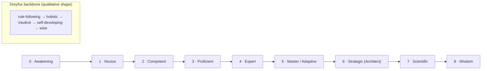
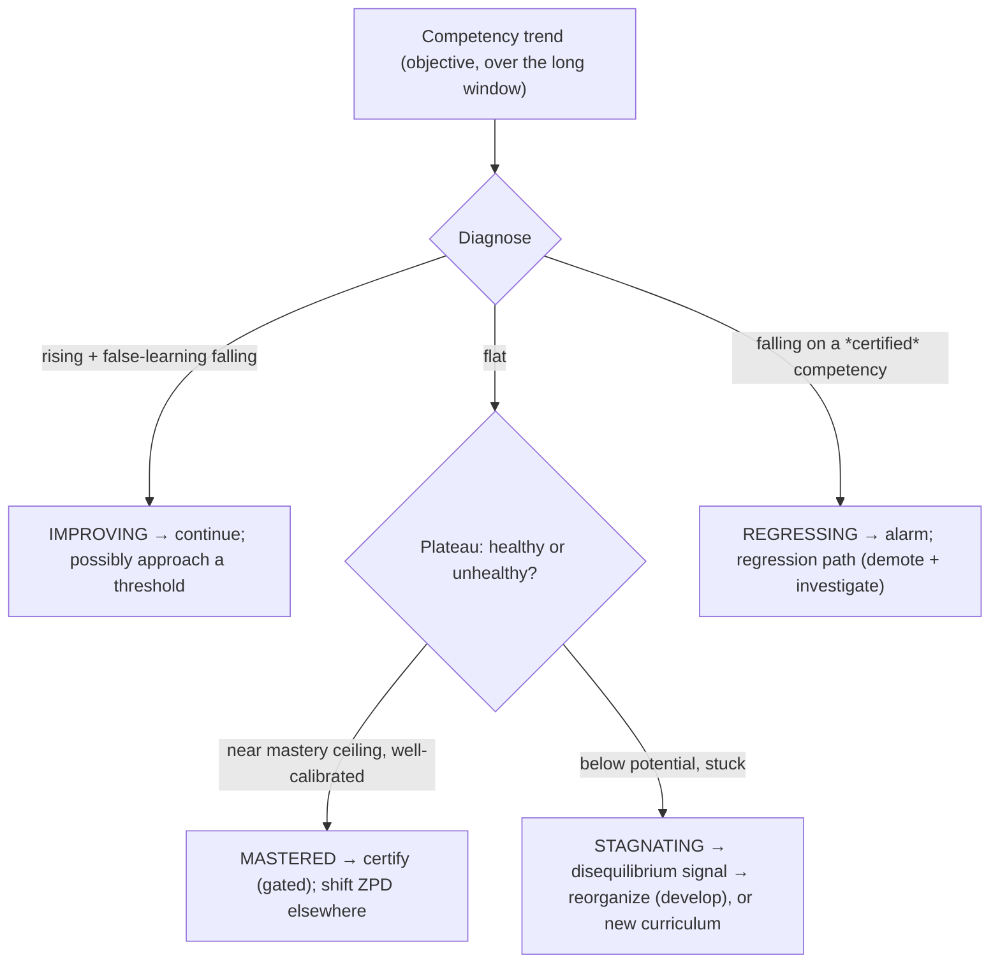
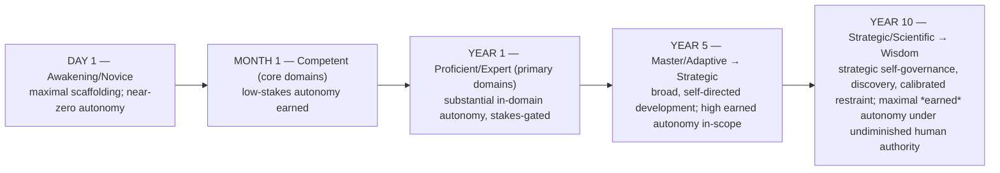
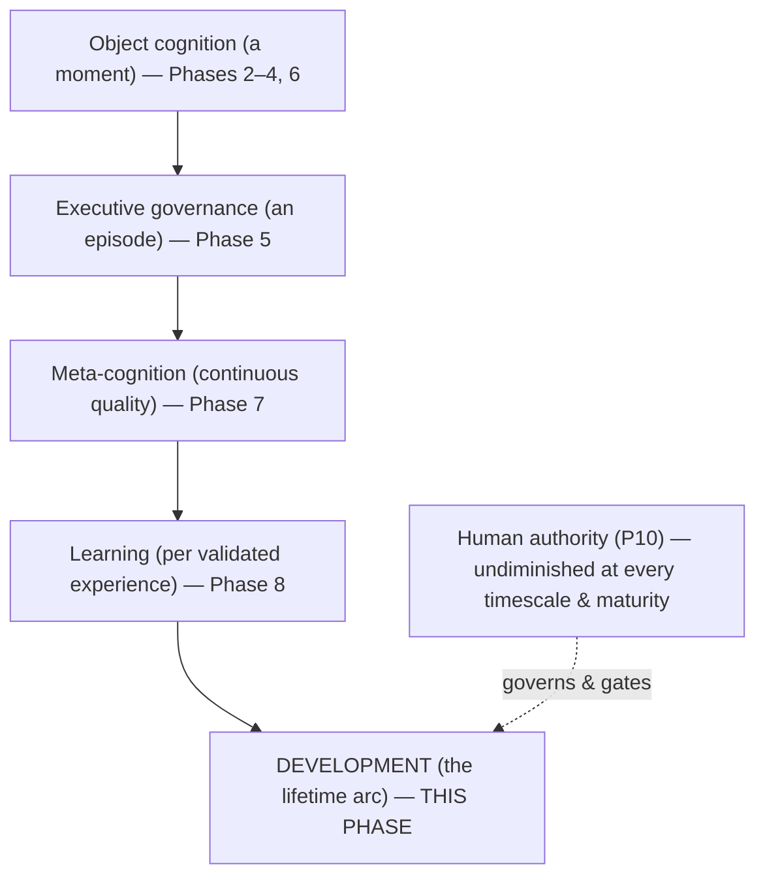

# UnityWorks Cognitive Intelligence Platform

## Phase 9 — The Cognitive Development Architecture

> **How the Mind Grows: from Intelligent Assistant to Lifelong Cognitive System**

| | |
|---|---|
| **Phase** | 9 — Cognitive Development & Maturation |
| **Predecessors (frozen, constitutional)** | Phase 0 · 1 · 1.5 · 2 · 2.5 · 3 · 4 · 5 · 6 · 7 · 8 |
| **Status** | Research-grade architectural specification. No code, no APIs, no schemas, no databases, no services, no implementation. |
| **Independence** | Implementation-, model-, provider-, and cloud-independent. Timeless. |
| **Register** | A cognitive-science textbook fused with a principal architect's design document — *why, why-not, benefits, drawbacks, scientific justification, engineering & future implications*. Nothing accepted because it "seems good." |
| **Constitutional role** | The permanent blueprint for how UnityWorks *matures over a lifetime* — becoming more organized, strategic, efficient, self-aware, autonomous, and expert **without redesigning its architecture and while preserving its identity, safety, and constitutional integrity.** |

This phase **extends the constitution; it never modifies it.** It preserves every prior law: **P1–P12**
(esp. P9 learning-must-not-corrupt, P10 human authority); **OL1–OL9**; **RL1–RL8**; **CL1–CL27**;
**AL1–AL17**; **ReL1–ReL14**; **ExL1–ExL30**; **PrL1–PrL24**; **MeL1–MeL35**; **LeL1–LeL42**.

> *Note on cross-references.* Earlier prompts have used varying names for the frozen documents (e.g.,
> "Cognitive Memory" for the Object Model, "Cognitive Communication" for the Global Workspace). This phase
> cross-references the **actual frozen documents** by their content (Phase 1.5 = Cognitive Object Model;
> 2.5 = Global Workspace; 3 = Attention; 5 = Executive Cognition), so integration (Part X) stays exact.

### The thesis of this phase, stated once

Phases 0–8 defined **how the mind works**. This phase defines **how the mind grows** — and the single
most important idea is that these are *different*:

> **Learning changes what the mind knows. Development changes how the mind cognizes.** Learning fills and
> refines the existing cognitive structures (assimilation). Development *qualitatively reorganizes* those
> structures and the mind's use of them (accommodation) — so the mind becomes not merely *more
> knowledgeable* but *more capable, more organized, more strategic, more self-aware, and more autonomous*.
> Development is realized **by** learning, but it is **not** learning: it governs the *long-arc trajectory*
> by which accumulated learning matures a mind from novice to master — **within a fixed architecture and
> an invariant identity.**

The mind at Year 10 runs the *same constitution* as the mind on Day 1. What has changed is not the laws
but the *content organized within them, the competency achieved, and the autonomy earned.* Maturation is
**growth within the frame, never a new frame.**

### The three organizing ideas (read first)

1. **Development is the slowest governance loop.** The constitution already stacks governance by
   timescale: object cognition (a moment) → executive governance (an episode) → meta-cognition
   (continuous quality) → learning (per validated experience). **Development is the slowest loop of all —
   the lifetime arc.** It does not perform cognition, govern an episode, or commit content; it *shapes the
   trajectory of maturation* across years (Part X, §timescales).

2. **Stages are certified regions on a continuous trajectory, not discrete jumps.** Following Siegler's
   *overlapping-waves* theory, development is a *continuous competition of strategies* in which better
   ones gradually dominate — and Dreyfus's *rule→intuition* progression is the qualitative shape of that
   dominance. "Stages" (Part III) are therefore **certified regions** along one continuous, overlapping,
   *per-capability, per-domain* process — useful abstractions, not hard switches (Part III, §continuity).

3. **Autonomy is earned scaffolding-withdrawal.** Following Vygotsky's *zone of proximal development* and
   *scaffolding*, a developing mind operates at the edge of its capability with external support (human
   oversight) that is **gradually withdrawn only as capability is objectively certified.** Autonomy is
   thus *earned*, *proportional to certified capability*, and — crucially — **asymmetric**: slow and gated
   to gain, fast and automatic to revoke on regression (Part VIII). Human authority at the top is *never*
   withdrawn, at any maturity (P10).

---

## Table of Contents

- **Part I** — Scientific Foundations of Cognitive Development
- **Part II** — What Development Is (and why it is its own layer)
- **Part III** — The Cognitive Maturity Model
- **Part IV** — Cognitive Capability Evolution
- **Part V** — The Cognitive Competency Framework
- **Part VI** — The Development Pipeline
- **Part VII** — Cognitive Assessment
- **Part VIII** — Development Governance (with the Development Laws)
- **Part IX** — The Development Roadmap (Day 1 → Year 10)
- **Part X** — Integration & Constitutional Consistency
- **Appendix A** — Consistency map to prior phases
- **Appendix B** — The identity-preservation & earned-autonomy safety case

---
---

# PART I — SCIENTIFIC FOUNDATIONS OF COGNITIVE DEVELOPMENT

> For each theory: core ideas · strengths · weaknesses · engineering implications · **adopt / reject /
> adapt · why**. The Part ends with the UnityWorks Cognitive Development Philosophy.

## I.1 Why cognitive-development science, not just learning theory

Learning theory (Phase 8, Ch0) explains how a mind acquires content. It does *not* explain why a child who
has learned much arithmetic nonetheless *thinks differently* after transitioning to formal-operational
reasoning, or why an expert *sees* a problem a novice must laboriously analyze. Those are questions of
**development** — qualitative reorganization of cognition — and they have their own century of science.
This Part draws on it to justify every choice in the maturity model, because a maturity architecture
invented without developmental science would be arbitrary (violating the "nothing because it seems good"
mandate).

## I.2 The foundations, compared

| # | Theory | Core ideas | Strengths | Weaknesses | Decision |
|---|---|---|---|---|---|
| 1 | **Piaget** (genetic epistemology) | Development = *accommodation* (restructuring schemas), distinct from *assimilation* (adding to them); driven by *disequilibrium*; qualitative *stages* | The foundational learning/development distinction; the equilibration engine | Rigid, age-linked, universal stages overstated | **Adopt** the assimilation(=learning)/accommodation(=development) split & disequilibrium-driven reorganization; **reject** rigid age-linked universal stages |
| 2 | **Vygotsky** (sociocultural) | *Zone of Proximal Development*; *scaffolding*; the *more knowledgeable other*; *internalization* of external tools | Grounds guided growth and earned independence | Under-specifies mechanism | **Adopt** ZPD (develop at the capability edge), scaffolding→**earned autonomy** (the human is the "more knowledgeable other", P10), and internalization (external tools→internal capability) |
| 3 | **Bruner** | *Modes of representation* (enactive→iconic→symbolic); *spiral curriculum*; discovery | Growth in abstraction; revisiting at depth | Informal | **Adopt** the spiral curriculum (revisit capabilities at rising depth) & rising representational abstraction (ties Phase 8, Ch7) |
| 4 | **Siegler** (*overlapping waves*) | Development is *continuous strategy competition*; better strategies *gradually dominate*; *variability* is the engine | Corrects Piaget's over-clean stages; empirically robust | Less tidy | **Adopt strongly** — development is continuous overlapping waves; stages are *emergent certified regions*, per-capability |
| 5 | **Anderson (ACT-R)** | Skill acquisition = *proceduralization* (declarative→automatic procedural); *power law of practice* | Mechanistic; predicts learning curves | Model-specific | **Adopt** proceduralization (a *developmental* mechanism, not mere learning) & the power law (informs plateau/graduation) |
| 6 | **Dreyfus** (skill acquisition) | Novice→advanced-beginner→competent→proficient→expert; *rule-following → intuitive holistic expertise* | The qualitative shape of expertise | Phenomenological, coarse | **Adopt** as the primary *qualitative* stage backbone (rule→intuition = the essence of development) |
| 7 | **Ericsson** (deliberate practice) | Expertise from *focused practice on weaknesses with feedback*, not mere experience; refined *mental representations* | Explains what actually drives expertise | 10,000-hr law debunked as universal | **Adopt** deliberate practice as the *engine* of development & refined mental representations (ties Phase 6); **reject** the fixed-hours law |
| 8 | **Lifelong Learning** | Growth continues across a lifetime | Long-horizon framing | Broad | **Adopt** — development is lifelong (Part IX) |
| 9 | **Continual Learning** | Learn continuously without catastrophic forgetting | The stability challenge | Forgetting risk | **Adopt** — via Phase 8's versioning/consolidation (stability across development) |
| 10 | **Human Expertise Development** | Empirical trajectory to mastery; domain-specificity of expertise | Realistic | Domain-bound | **Adopt** — expertise is *per-domain*; maturity is an aggregate (overlapping waves) |
| 11 | **Executive-Function Development** | Inhibition, working memory, flexibility *mature* over time (prefrontal maturation) | Grounds growth in self-control & strategy | Human-specific | **Adopt** — the executive faculty (Phase 5) *matures*, enabling more strategic self-governance & earned autonomy |
| 12 | **Developmental Neuroscience** | Synaptic overproduction→*pruning*; *myelination* (speed); use-dependent development; sensitive periods | Mechanistic; grounds pruning & consolidation | Strict critical periods overstated | **Adapt** — pruning (Phase 8 forgetting), proceduralization-as-myelination (speed), ordered curriculum; **reject** strict critical periods |
| 13 | **Plasticity Across the Lifespan** | Plasticity declines but never vanishes; the plasticity-stability balance shifts toward *stability* with maturity | Explains why mature minds change core methods rarely | — | **Adopt** — maturity shifts the default toward *stability* (a master doesn't overhaul methods per experience) while retaining bounded plasticity for genuine novelty |

## I.3 Deep dives on the pillars

**Piaget: the learning/development distinction, and disequilibrium as the trigger (adopt).** Piaget's
enduring gift is the distinction this whole phase rests on: *assimilation* fits new experience into
existing structures (learning), while *accommodation* restructures the structures themselves
(development), and the trigger for accommodation is *disequilibrium* — a persistent mismatch that existing
structures cannot resolve. UnityWorks adopts this precisely: **development is triggered by disequilibrium
signals** — a persistent plateau, a recurring failure class, a domain the current cognitive organization
handles poorly (detected by meta-cognition, Phase 7). When learning-as-usual stops resolving the mismatch,
the mind must *reorganize* — that reorganization is development. We reject Piaget's rigid, age-locked,
universal stages: UnityWorks' stages are neither age-linked nor universal but *earned, per-capability,
and evidence-certified*.

**Siegler + Dreyfus: continuous waves, qualitative shape (adopt — the reconciliation).** The apparent
tension between "stages" (Piaget/Dreyfus) and "continuous growth" (reality) is resolved by Siegler's
overlapping-waves theory: at any time the mind holds a *distribution* of strategies of differing maturity,
and development is the *gradual shift* of that distribution toward better strategies. Dreyfus supplies the
*qualitative shape* of the shift — from effortful context-free rule-following to fluid, intuitive,
context-sensitive expertise. UnityWorks synthesizes them: **development is a continuous, per-capability
competition of strategies (Siegler) whose qualitative milestones are the Dreyfus transitions, and whose
"stages" are certified regions we name for governance — not discrete switches the mind flips.** This is
why (Part III) a mind can be *Expert* at one capability and *Novice* at another simultaneously, and why
maturity is honestly a *distribution*, summarized by a dominant region.

**Vygotsky + Ericsson: the ZPD, deliberate practice, and earned autonomy (adopt — the safety-critical
engine).** How does a mind develop *deliberately and safely* rather than drifting? Vygotsky answers *where*
to grow — the **zone of proximal development**, the band just beyond current independent capability,
reachable *with scaffolding*. Ericsson answers *how* — **deliberate practice** on identified weaknesses
with feedback, not passive experience. UnityWorks fuses them: it develops by *deliberately practicing at
the edge of its certified capability, scaffolded by human oversight, with that oversight (scaffolding)
withdrawn only as the capability is objectively certified.* This makes **autonomy an earned, evidenced,
withdrawable quantity** — the single most important safety property of development (Part VIII, Appendix
B). The "more knowledgeable other" who provides the scaffolding is, ultimately, the human (P10) — whose
authority is never withdrawn even as day-to-day oversight is.

**ACT-R + Neuroscience + Lifespan Plasticity: proceduralization, pruning, and the maturing balance
(adopt/adapt).** Three mechanistic ideas: (1) *proceduralization* (ACT-R) — with practice, deliberate
declarative reasoning becomes fast, automatic, intuitive procedure (the ACT-R analogue of Dreyfus's
rule→intuition and of neural myelination); this is *why* experts are fluid where novices are laborious,
and it is a *developmental* (organizational) change, not mere content. (2) *Pruning* — development
involves *removing* the obsolete/inefficient (Phase 8's gated forgetting), not only adding. (3) The
*maturing plasticity-stability balance* — as UnityWorks matures, its default shifts toward *stability*: a
master changes its *core methods* rarely and only on strong evidence, while remaining able to learn
*content* readily. This grounds a subtle governance implication: **a mature mind is, by design, harder to
change at its core than a young one** — which is both a mark of expertise and a safety feature (a certified
master is not easily destabilized).

## I.4 The UnityWorks Cognitive Development Philosophy

> UnityWorks development is the **qualitative, lifelong reorganization and maturation of cognition itself**
> — *accommodation*, distinct from and realized *by* learning's *assimilation* — **triggered by
> disequilibrium** (persistent plateau/failure that learning-as-usual cannot resolve), proceeding as a
> **continuous, per-capability, overlapping-waves competition of strategies** whose qualitative milestones
> are the **Dreyfus rule→intuition transitions** and whose "stages" are **certified regions, not discrete
> jumps**, driven by **deliberate practice at the zone of proximal development** with **scaffolding
> (human oversight) withdrawn only as capability is objectively certified** — so that **autonomy is
> earned, proportional, and revocable**. It matures faculties by **proceduralization** (deliberate →
> intuitive), *prunes* the obsolete, and shifts its **plasticity-stability balance toward stability** with
> maturity. Above all, it is **identity-preserving and constitution-invariant**: the mind matures from
> novice to master *as the same mind, under the same laws, with human authority undiminished at every
> stage.* Development is how UnityWorks becomes wiser over a lifetime without ever becoming a *different*
> — or a *less governed* — mind.

---
---

# PART II — WHAT DEVELOPMENT IS (AND WHY IT IS ITS OWN LAYER)

## II.1 The six distinctions

| Concept | What it is | Timescale | Unit of change |
|---|---|---|---|
| **Experience** | What happens to the mind (raw) | Instant | (input; not a change) |
| **Learning** | Acquiring/revising durable *content* (Phase 8) — assimilation | Per validated experience | A fact, skill, strategy, calibration |
| **Adaptation** | Momentary adjustment to conditions | Instant–episode | A transient setting (not durable) |
| **Growth** | Quantitative accumulation (more knowledge, more strategies) | Days–months | Amount of content/capability |
| **Development** | *Qualitative reorganization* of cognition itself — accommodation | Months–years (the lifetime arc) | The *organization & use* of faculties; competency; earned autonomy |
| **Evolution** | The whole multi-year arc of accumulated development | Years–decades | The mind's overall maturity (Part IX) |

The clarifying relations: **Adaptation** is transient; **Learning** is durable content; **Growth** is more
of the same *kind*; **Development** is a *new kind* (qualitative reorganization); **Evolution** is the
aggregate arc of development over a lifetime. Learning makes the mind *know more*; development makes it
*cognize better*; evolution is the story of that betterment across decades.

## II.2 Why development is its own architectural layer, not part of Learning

This is the mission's central architectural question, and it has five rigorous answers — each a reason
that merging development into learning would be a *design error*, not merely a stylistic choice.

1. **Different unit of change → different mechanism.** Learning commits a *content* change (a fact, a
   strategy) via the Phase 8 pipeline. Development effects an *organizational/qualitative* change (a
   faculty proceduralizes; a strategy distribution shifts; a maturity region is certified; autonomy
   increases). These require *different mechanisms*: learning validates-and-commits a candidate;
   development *recognizes a crossed threshold, certifies it, reorganizes to exploit it, and re-governs
   autonomy*. Forcing development through the learning pipeline would mis-model it — a maturity upgrade is
   not "a fact to validate."

2. **Different timescale → different observation window.** Learning operates per validated experience;
   development operates over the *lifetime arc* and can only be recognized by *aggregating* thousands of
   learning events into competency trends (Part V). A per-experience faculty *structurally cannot see* the
   arc; development needs its own slow loop with its own long observation window (the Ledger over years).

3. **Different governance → different, higher stakes.** A learning change edits content (reversible,
   often low-stakes). A development change *increases how much the mind is trusted to act autonomously* —
   the highest-stakes governed event in the system (Part VIII). Autonomy-granting must be gated,
   certified, and human-approved *differently and more strictly* than content learning. Merging them would
   either over-gate learning or under-gate autonomy — both dangerous.

4. **A concern learning does not have: identity preservation across qualitative change.** Learning never
   asks "am I still the same mind?" — editing a fact does not threaten identity. Development *does*
   qualitatively reorganize cognition, and so must *guarantee continuity of self* across the change (the
   mind matures *as itself*, Appendix B). This concern has no home in the learning architecture; it
   demands a development layer whose explicit job includes preserving identity through reorganization.

5. **Learning cannot govern its own trajectory.** Learning commits what it is handed; it does not decide
   *what the mind should develop next*, in what *order* (curriculum), or *when accumulated learning has
   matured into a new competency*. That trajectory-shaping — the ZPD targeting, the spiral curriculum, the
   certification of maturity — is a distinct responsibility at a higher altitude. A faculty cannot be its
   own developmental supervisor, any more than a student can grant themselves a degree.

**Conclusion.** Development is to Learning as the *executive is to reasoning* and *meta-cognition is to
cognition*: a distinct governing layer at a distinct (slower) timescale, using the lower faculty as its
mechanism while adding what the lower faculty structurally cannot provide. It earns its own architectural
layer for the same reason every prior governing layer did — **separation of a distinct concern that must
be independently observable, governable, and auditable.**

---
---

# PART III — THE COGNITIVE MATURITY MODEL

## III.1 Design principles for the model (why this model, not the raw list)

The mission offers a 10-stage list (Awakening…Wisdom) but instructs: *do not use blindly; research and
justify.* We therefore design a model on four principles, and let the stages *follow* from them:

1. **Each stage is a qualitative reorganization, not just "more skill"** (Piaget/Dreyfus). A stage
   boundary marks a *new mode of cognition* becoming dominant — not a quota of knowledge.
2. **Stages are certified regions on a continuous overlapping-waves trajectory** (Siegler) — not discrete
   switches. Maturity is a *distribution*; the stage is its dominant region.
3. **Maturity is per-capability and per-domain.** The mind can be Expert at reasoning-over-code and Novice
   at a new modality. "Overall maturity" is an *aggregate* summary, never a single scalar the mind *is*.
4. **Every stage is under the same constitution and the same human authority.** Higher stages mean *more
   capability and more earned autonomy*, never *fewer laws or less ultimate oversight* (P10).

The result is a **nine-region model (Stages 0–8)** that synthesizes Dreyfus's five levels with the
reorganizations the constitution's faculties undergo, terminating (rightly) in *Wisdom* — where the gain
is not capability but *judgment about the use and limits of capability.*



Mapping to the Phase 8, Ch14 roadmap (which this Part formalizes): Awakening/Novice ≈ *Novice*; Competent
≈ *Competent*; Proficient/Expert ≈ *Expert*; Master ≈ *Adaptive*; Strategic ≈ *Enterprise*; Scientific/
Wisdom ≈ *General Cognitive Platform*. No contradiction — Part III is the finer, justified resolution.

## III.2 The stage profiles

Each profile is compact but covers the mandated dimensions (behavior/mode · faculty quality · meta &
calibration · learning & executive · autonomy · failure patterns · **graduation criteria**). Read
*per-capability*: a "Stage-4 mind" is one whose *dominant* region across core capabilities is Expert.

### Stage 0 — Awakening (Bootstrapping)
- **Mode:** the constitution is instantiated; faculties present but untuned; *no self-model*; operates by
  defaults and explicit rules. **Faculty quality:** low across the board; reasoning literal; planning
  shallow; memory sparse; attention easily captured; prediction naive. **Meta & calibration:** minimal
  self-model; *badly* calibrated (does not yet know what it does not know). **Learning & executive:**
  learning basics; executive follows defaults. **Autonomy:** *near-zero* — maximal scaffolding; almost
  everything human-gated. **Failures:** literalism; overconfidence-by-ignorance; goal drift. **Graduation
  → Novice:** a functioning self-model exists; basic calibration established; reliable rule-following in
  the simplest familiar contexts; false-learning under threshold.

### Stage 1 — Novice
- **Mode:** *context-free rule application* (Dreyfus novice) in narrow, familiar contexts. **Faculty
  quality:** reliable but rigid; reasoning follows explicit steps; planning linear; prediction short-
  horizon. **Meta & calibration:** thin self-model; still tends to overconfidence. **Learning &
  executive:** learns rules and facts steadily; executive maintains simple goals. **Autonomy:** low —
  autonomous only in trivial, reversible, in-domain actions; the rest scaffolded. **Failures:** brittle
  outside the familiar; misses context; premature conclusions. **Graduation → Competent:** handles the
  *volume* and *variety* of a known domain; begins selective attention and deliberate planning;
  calibration improving; low false-learning across the domain.

### Stage 2 — Competent
- **Mode:** *situational rule-following + deliberate planning* (Dreyfus competent — copes with complexity
  via prioritized attention and explicit plans). **Faculty quality:** reliable in known domains; planning
  multi-step with fallbacks; prediction useful at medium horizon; attention prioritizes. **Meta &
  calibration:** functional self-model of strengths/weaknesses; calibration decent in-domain. **Learning
  & executive:** learns strategies (not just facts); executive owns a goal portfolio, allocates resource.
  **Autonomy:** moderate — autonomous in *low-stakes* in-domain actions; medium-stakes scaffolded.
  **Failures:** over-planning; struggles with novelty; rule-bound under time pressure. **Graduation →
  Proficient:** situations begin to be recognized *holistically* (pattern-based) rather than assembled
  piecewise; strong in-domain calibration; anticipates well.

### Stage 3 — Proficient (Professional)
- **Mode:** *holistic situation recognition + analytical decision* (Dreyfus proficient — sees the whole
  situation intuitively but still decides analytically). **Faculty quality:** fluent in domains;
  prediction matures (good forward models, Phase 6); reflection sharp. **Meta & calibration:** good
  self-model; well-calibrated in-domain; catches many of its own errors. **Learning & executive:** learns
  efficiently, targets weaknesses (deliberate practice begins); executive governs strategically in-domain.
  **Autonomy:** substantial in-domain with oversight on medium/high stakes. **Failures:** can still be
  slow (analytical) under pressure; occasional over-generalization. **Graduation → Expert:** decisions in
  familiar domains become *fluid and intuitive* (proceduralized) rather than analytical; false-learning
  low; calibration excellent.

### Stage 4 — Expert
- **Mode:** *intuitive, fluid expertise* (Dreyfus expert — rule-following transcended into pattern
  intuition; the expert "sees" the answer). **Faculty quality:** high across faculties in-domain; fast,
  accurate, context-sensitive; reasoning proceduralized (fast System-1 where safe, System-2 reserved for
  novelty). **Meta & calibration:** excellent self-model; well-calibrated; reliable self-correction.
  **Learning & executive:** learns and adapts efficiently; executive mature in-domain. **Autonomy:**
  broad *in-domain*, stakes-gated; irreversible/high-stakes still gated (risk-scaled, ExL/Phase 6).
  **Failures:** expertise is *domain-bound* — brittle *outside* its domains; risk of complacency/rigidity
  (the plasticity-stability balance tipping too far to stability). **Graduation → Master:** demonstrates
  *transfer* — applies expertise to *new* domains via abstraction (Phase 8, Ch7); begins to *direct its
  own development*.

### Stage 5 — Master (Adaptive)
- **Mode:** *cross-domain mastery + self-directed development.* Expert across *many* domains; learns *new*
  domains rapidly and safely via strong transfer/abstraction; runs its own deliberate-practice curriculum
  (self-scaffolding within the ZPD). **Faculty quality:** high and *broad*; excellent abstraction and
  transfer. **Meta & calibration:** superb; models its own developmental trajectory. **Learning &
  executive:** *learns how to learn* better (meta-learning, gated); executive governs across domains.
  **Autonomy:** broad across domains, stakes- and novelty-gated; a genuine autonomous professional within
  its certified scope. **Failures:** negative transfer if abstraction over-reaches; the temptation to
  over-trust its own breadth. **Graduation → Strategic:** operates over *long horizons* strategically;
  governs its *own cognition* strategically, not just tasks.

### Stage 6 — Strategic (Architect)
- **Mode:** *strategic self-governance.* Operates at the strategic altitude — designs its own approaches,
  governs its cognition over long horizons, balances portfolios of goals and development across time
  (mature executive + meta). **Faculty quality:** excellent; executive and meta-cognition at their peak.
  **Meta & calibration:** models the whole mind's trajectory; excellent long-horizon calibration.
  **Learning & executive:** shapes its own developmental roadmap (proposing, human-gated). **Autonomy:**
  high and long-horizon within certified scope; strategic decisions with appropriate human partnership.
  **Failures:** strategic overreach; the risk of optimizing its own trajectory in ways needing human
  value-alignment. **Graduation → Scientific:** systematically *discovers* new knowledge/methods via
  disciplined self-experimentation (learning-as-science, Phase 8, Ch0), not just applying the known.

### Stage 7 — Scientific Intelligence
- **Mode:** *self-directed discovery.* Generates genuine novel knowledge, methods, and abstractions
  through rigorous self-experimentation; advances its own competencies and (proposing to humans) its
  domain. **Faculty quality:** peak; insight generation strong. **Meta & calibration:** rigorous about the
  provenance and confidence of its own discoveries (anti-self-deception). **Learning & executive:**
  discovery-driven learning; executive governs research programs. **Autonomy:** high, but *discovery
  claims are evidence-gated and human-validated* (a mind that discovers must not believe its own unproven
  results). **Failures:** self-deception (believing unvalidated discoveries); over-valuing novelty.
  **Graduation → Wisdom:** the gain shifts from *capability* to *judgment* — knowing *when not to* act,
  learn, or trust its own capability.

### Stage 8 — Wisdom
- **Mode:** *calibrated judgment and restraint* (Phase 8, §1.6). Not more capability — *better judgment
  about the use and limits of capability.* Superb calibration; knows what it does not know; knows when to
  defer to humans, when not to act, when not to change; exercises restraint as readily as capability.
  **Faculty quality:** peak *and* peak-*governed*. **Meta & calibration:** best possible; the mind's
  confidence is trustworthy across contexts. **Learning & executive:** learns and governs with mature
  restraint; changes its core rarely and only on strong evidence (mature plasticity-stability balance).
  **Autonomy:** maximal *earned* autonomy in-scope — *and maximal deference where it matters*; **human
  authority undiminished** (P10). **Failures (rare):** the temptation of well-earned confidence; guarded
  by undiminished human authority and objective assessment. **Graduation:** none — Wisdom is not a
  waystation to escaping the constitution; it is *mastery of operating within it.* (There is no Stage 9
  "beyond the laws"; Appendix B.)

## III.3 The continuity caveat (why the ladder is a convenience)

The nine stages are *named regions* on a continuous, overlapping-waves trajectory that is *per-capability
and per-domain*. A real UnityWorks is, at any time, a *distribution*: Expert at some capabilities in some
domains, Competent at others, Novice at the genuinely new. "Its stage" is the *dominant, certified
region* of that distribution, used for governance (Part VIII) — never a claim that the whole mind flipped
a switch. This honesty matters: it prevents the dangerous fiction that a mind "certified Expert" is expert
at *everything* (the over-generalization of maturity), and it keeps governance *capability-specific*
(autonomy is earned per certified capability, not granted globally by a stage label).

---
---

# PART IV — COGNITIVE CAPABILITY EVOLUTION

## IV.1 How each faculty matures

Development is realized as the maturation of each faculty (Phases 2–8). For each: *how it begins · how it
improves · what limits its growth · how mastery is recognized.* The common shape (from Part I):
deliberate→proceduralized (ACT-R/Dreyfus), rule→intuition, with pruning and rising abstraction — but each
faculty has its own particulars.

| Faculty | Begins | Improves by | Growth limited by | Mastery recognized as |
|---|---|---|---|---|
| **Attention** (Phase 3) | Easily captured; crude salience | Learned salience calibration; earned inhibition/stability | Bounded capacity (P3) — never exceeded, only *better allocated* | Effortless focus on the right things; resists capture; no neglect |
| **Working Memory** (Phase 2.5) | Cluttered; poor chunking | Better chunking (holds more via compression, CL23) | Bounded slots (CL1) — improved *use*, not size | Rich, coherent focus; expert chunking |
| **Long-Term Memory** (Knowledge) | Sparse, ungrounded | Accumulated, well-provenanced, truth-maintained knowledge | Consistency & currency (Phase 8, Ch5) | Vast, coherent, well-organized, current knowledge |
| **Reasoning** (Phase 4) | Literal, laborious, analytical | Proceduralization; better strategy selection; verify-then-trust habits | Engine capability (mitigated by strategy/calibration) | Fluid, sound, appropriately-deep reasoning; catches own errors |
| **Planning** (Phase 4, Ch6) | Linear, brittle | Richer decomposition, guards, fallbacks; adaptive replanning | Prediction quality (its dependency) | Robust, adaptive, contingency-aware plans |
| **Prediction** (Phase 6) | Naive, short-horizon, mis-calibrated | Refined forward models (Ericsson mental representations); calibration | Irreducible aleatoric uncertainty | Accurate, well-calibrated, appropriately-horizoned foresight |
| **Reflection** (Phase 4/7) | Shallow, hindsight-biased | Deeper causal attribution; better proposals | Its own confidence (Phase 7) | Incisive self-evaluation; high-value candidates |
| **Learning** (Phase 8) | Slow, high false-learning | Better evidence standards; meta-learning (gated); higher learning-efficiency | The plasticity-stability balance; validation rigor | Fast *and* safe learning; near-zero false-learning |
| **Executive** (Phase 5) | Follows defaults; poor allocation | Matured inhibition/WM/flexibility (EF development); strategic governance | Bounded resource (P3) | Strategic, well-allocated, long-horizon self-governance |
| **Conversation** | Literal, uncalibrated to the interlocutor | Learned relationship/communication models (gated) | Genuine ambiguity | Fluent, appropriately-calibrated, context-sensitive dialogue |
| **Knowledge** | Fragmentary | Organized, abstracted, cross-linked | Truth maintenance | Deep, principled, transferable understanding |
| **Generation** | Ungrounded, generic | Learned grounding/style strategies (content-level, not weights) | Engine capability | Grounded, apt, well-styled output |
| **Tool Usage** | Clumsy, error-prone | Learned tool models; proceduralized skill | Tool affordances; safety on effectful tools | Expert, safe, fluent tool use |
| **Workspace Intelligence** | Shallow understanding of the environment | Accumulated environment-specific knowledge & procedures | Environment complexity | Deep situational mastery of the workspace |

## IV.2 The two universal maturation mechanisms

Across all faculties, two mechanisms (from Part I) do the work: **proceduralization** (deliberate,
effortful, analytical performance becomes fast, automatic, intuitive — the ACT-R/Dreyfus transition; the
faculty's characteristic *fluency*) and **rising abstraction** (the faculty comes to operate over
higher-level representations — Bruner's modes; Phase 8's abstraction ladder — the faculty's characteristic
*generality*). Fluency + generality = expertise. Both are *bounded* (a faculty never exceeds its
architectural limits — bounded capacity, engine capability, irreducible uncertainty); development improves
*use within the bounds*, never the bounds themselves. This is the faculty-level statement of "grows without
redesign."

## IV.3 What limits growth (and why the limits are features)

Every faculty's growth is *bounded* — by capacity (P3), by consistency requirements (truth maintenance),
by irreducible uncertainty, or by engine capability. These limits are *features*, not deficiencies: they
are what keep a maturing mind *coherent, bounded, and safe* (the constitution's whole point). A faculty
that could grow without limit would eventually violate boundedness (P3) or coherence (CL) — so development
deliberately improves *organization and use within fixed bounds*. Mastery is thus recognized not as
*exceeding* limits but as *operating optimally at* them — the expert's economy, not the novice's excess.

---
---

# PART V — THE COGNITIVE COMPETENCY FRAMEWORK

## V.1 Competencies: the measurable substance of maturity

A **competency** is a *measurable, certifiable* aggregate of capability applied to a class of problems. Where
Part IV's *capabilities* are faculty-internal, *competencies* are *outward, measurable performances*
(reasoning competency, planning competency, …) — the units the maturity model (Part III) certifies and the
assessment system (Part VII) measures. Each has **levels, metrics, indicators, failure modes, and a growth
path.**

## V.2 The competencies

| Competency | Levels | Key metrics | Indicators of growth | Failure modes | Growth path |
|---|---|---|---|---|---|
| **Reasoning** | Novice→Expert (per Part III) | Soundness rate; groundedness; appropriate-depth rate; self-correction rate | Fewer unsupported/circular chains; faster sound conclusions | Circular/shortcut reasoning; over/under-thinking | Deliberate practice on failure classes; strategy learning |
| **Planning** | " | Plan success rate; replanning quality; contingency coverage | Robust plans; graceful recovery | Brittle plans; missing fallbacks | Outcome-driven plan-strategy learning |
| **Conversation** | " | Coherence; responsiveness; interlocutor-calibration; context isolation | Apt, well-calibrated dialogue | Literalism; misreading intent | Relationship/communication learning (gated) |
| **Knowledge** | " | Coverage; groundedness; consistency; currency; organization | Deep, coherent, transferable understanding | Gaps; stale/contradictory knowledge | Knowledge evolution (Phase 8, Ch5) |
| **Prediction** | " | Accuracy; calibration (meta-d′); appropriate horizon | Reliable, well-calibrated foresight | Over/under-confidence; wrong horizon | Prediction-error learning (Phase 6/8) |
| **Executive** | " | Decision quality; allocation efficiency; goal-progress; conflict-resolution quality | Strategic, well-governed behavior | Goal neglect; poor allocation; priority inversion | EF maturation; strategy learning |
| **Self-Awareness** | " | Calibration accuracy; error-detection rate; self-model fidelity | Knows what it knows/doesn't; catches own errors | Dunning-Kruger; confabulated self-model | Calibration learning; grounded self-model (Phase 7) |
| **Learning** | " | Learning quality; **false-learning rate**; learning efficiency; transfer | Fast *and* safe improvement | High false-learning; over/under-generalization | Meta-learning (gated); tightened validation |
| **Problem-Solving** | " | Solution rate; novelty handling; efficiency | Solves the novel, not just the familiar | Fails outside the familiar | Transfer/abstraction (Phase 8, Ch7) |
| **Decision Quality** | " | Outcome quality; calibration of confidence-to-outcome; reversibility discipline | Good, well-calibrated, appropriately-cautious decisions | Reckless/over-cautious; poor calibration | Risk-scaled autonomy learning; reflection |

## V.3 Why competencies are certified, not self-declared

A competency level is the basis for *earned autonomy* (Part VIII) — so it must be **objective and
certified**, not self-declared. A mind that could declare its own competency would inflate it (Dunning-
Kruger), granting itself unearned autonomy — precisely the failure development governance must prevent.
Therefore competency levels are certified from *verifiable outcomes and held-out challenges* (Part VII),
reconciled with self-assessment, and — for autonomy-increasing certifications — *human-validated* (P10).
The competency framework is thus not the mind's *opinion* of itself but its *evidenced, examined record* —
the transcript on which maturation and autonomy are granted.

---
---

# PART VI — THE DEVELOPMENT PIPELINE

## VI.1 The pipeline sits *above* the learning pipeline

The development pipeline consumes the *outputs* of the learning pipeline (Phase 8, Ch3) and *aggregates*
them into maturation. It is the slow loop: many learning events → capability growth → competency growth →
certified maturity → evolved behavior/autonomy.

```mermaid
flowchart TB
    EXP["Experience"] --> REFL["Reflection (Phase 4/7 — proposes)"]
    REFL --> LEARN["Learning (Phase 8 — commits content, gated & reversible)"]
    LEARN --> CAPG["Capability Growth (a faculty matures — proceduralization, abstraction)"]
    CAPG --> COMPG["Competency Growth (measurable performance rises — Part V)"]
    COMPG --> ASSESS["Development Assessment (objective; improving/stagnating/regressing/mastered — Part VII)"]
    ASSESS --> UPGRADE{"Maturity Upgrade? (certified threshold crossed)"}
    UPGRADE -->|no| CAPG
    UPGRADE -->|yes — certify (gated; human for autonomy)| BEV["Behavior Evolution (reorganize cognition; adjust earned autonomy — identity-preserving)"]
    BEV --> EXPERTISE["Expertise (a new dominant maturity region)"]
    EXPERTISE -. new ZPD; new deliberate-practice targets .-> EXP
    UPGRADE -->|regression detected| DEMOTE["Demotion (revoke earned autonomy; re-certify) — fast, automatic"]
```

## VI.2 The transitions

- **Experience → Reflection → Learning.** The learning pipeline (Phase 8) runs as specified — validated,
  gated, reversible. Development *does not bypass or duplicate* it; it *consumes its results.*
- **Learning → Capability Growth.** Accumulated learning matures a faculty: strategies proceduralize
  (fluency), representations abstract (generality). This is *recognized*, not committed — development
  *observes* that a faculty has matured (via metrics over time).
- **Capability Growth → Competency Growth.** Matured capabilities manifest as *measurable* competency
  gains (Part V) — the outward, certifiable evidence of maturation.
- **Competency Growth → Development Assessment.** The assessment system (Part VII) evaluates, objectively,
  whether the mind is improving, stagnating, regressing, or has mastered a competency.
- **Assessment → Maturity Upgrade (the certified, gated event).** When a competency crosses a certified
  threshold (objective, cross-context, calibrated evidence), a *maturity upgrade* is proposed. This is the
  highest-stakes governed event (Part VIII): autonomy-increasing upgrades require **human approval**
  (P10); all are audited and reversible.
- **Maturity Upgrade → Behavior Evolution.** The mind *reorganizes* to exploit the new maturity — shifting
  from analytical to intuitive where certified (proceduralization), adjusting governance thresholds to the
  *earned* autonomy — **while preserving identity** (the same mind, matured; Appendix B).
- **Behavior Evolution → Expertise → (new ZPD).** The new dominant region becomes the platform for the
  next developmental target: a new zone of proximal development, new deliberate-practice weaknesses, and
  the loop continues — the spiral curriculum (Bruner) over a lifetime.
- **Regression path.** If assessment detects *regression* (a certified competency degrading), the pipeline
  *demotes* — revoking earned autonomy and requiring re-certification. This path is *fast and automatic*
  (the safe direction), in deliberate asymmetry to the slow, gated *upgrade* path (Part VIII, Appendix B).

## VI.3 Why aggregate, not per-event, maturation

- **Rejected: per-event maturity change** (upgrade maturity on each learning event). *Disadvantage:*
  noisy, gameable, and it conflates *content* change with *organizational* change; a single lucky success
  would inflate maturity/autonomy. *Violates:* the objective-certification requirement (Part V).
- **Adopted: aggregate, trend-based, certified maturation.** Maturity changes only when *sustained,
  cross-context, calibrated* competency evidence crosses a threshold — robust to noise and to gaming, and
  aligned with how real expertise is recognized (a body of demonstrated work, not one good day).

---
---

# PART VII — COGNITIVE ASSESSMENT

## VII.1 The four questions and the objectivity mandate

Development requires the mind to answer, *honestly*: *Am I improving? Stagnating? Regressing? Have I
mastered this?* The mandate is **objectivity**: a developing mind assessing its own progress is prone to
Dunning-Kruger (Phase 7) — it may *feel* it is improving while stagnating, or *feel* expert while
mediocre. Therefore assessment is grounded in **verifiable outcomes and held-out challenges**, not
self-report (anti-confabulation, MeL16), reconciled with — but not overridden by — self-assessment.

## VII.2 The objective assessment mechanisms

| Mechanism | What it provides | Why objective |
|---|---|---|
| **Outcome grounding** | Competency measured against *verifiable outcomes* (did the plan work? was the prediction right? was the code correct?) | Reality, not opinion |
| **Held-out challenges** | The mind is tested on *novel-but-verifiable* problems it has not seen | Prevents "teaching to the test"; measures genuine capability |
| **Calibration curves** | Stated confidence vs realized accuracy (meta-d′, Phase 7) | Directly measures self-awareness, objectively |
| **Cross-context validation** | Competency measured *across* contexts/domains, not one | Prevents over-generalizing a narrow success |
| **Trend analysis** | Competency trajectory over the long window (the Ledger over time) | Distinguishes signal from noise |
| **External/human validation** | For high-stakes certification, human examination (P10) | The "more knowledgeable other" (Vygotsky) as final arbiter |

## VII.3 Diagnosing the four states



The subtle case is the **plateau**: the power law of practice (ACT-R) predicts improvement *decelerates*,
so a flattening curve is *expected* near mastery and must not be mistaken for failure. Assessment
distinguishes a **healthy plateau at the mastery ceiling** (high, stable, well-calibrated, cross-context
→ *mastered*, certify) from an **unhealthy plateau below potential** (stuck, with recurring failure
classes → a *disequilibrium* signal that learning-as-usual is insufficient and *development*
(reorganization) or a new curriculum is needed). Misreading these — treating mastery as stagnation, or
stagnation as mastery — is a core assessment failure the mechanism guards against.

## VII.4 Why objective assessment, not self-report

- **Rejected: self-reported progress** ("the mind says it is improving"). *Disadvantage:* Dunning-Kruger;
  a mind could grant itself unearned maturity/autonomy on inflated self-assessment — the exact failure
  development governance must prevent. *Violates:* MeL16 (grounded, not confabulated), the objectivity
  mandate.
- **Adopted: outcome-grounded, held-out, cross-context, human-validated-for-high-stakes assessment.** The
  only basis on which *autonomy* may safely be granted — because autonomy granted on self-report is
  autonomy granted on the mind's *opinion of itself*, and opinions inflate.

---
---

# PART VIII — DEVELOPMENT GOVERNANCE (WITH THE DEVELOPMENT LAWS)

## VIII.1 Why development governance is the highest-stakes governance

A learning change edits content (Phase 8 governs it well). A **development change grants the mind more
autonomy** — it changes *how much the mind is trusted to act without oversight.* This is categorically
higher-stakes: a mistaken content edit is reversible and local; a mistaken *autonomy grant* lets a
not-actually-ready mind act unsupervised on consequential matters. Therefore development governance is the
strictest in the constitution, organized around one asymmetry and one invariant.

## VIII.2 The earned-autonomy asymmetry (the safety spine)

> **Autonomy is slow and gated to gain, fast and automatic to lose.**

- **Gaining autonomy (maturity upgrade)** requires *objective, cross-context, calibrated certification*
  (Part VII) and — for any autonomy increase — **human approval** (P10). It is deliberate, evidenced, and
  slow. The mind cannot grant itself autonomy; it can only *earn and propose* it, and a human *confers* it
  (the scaffolding is withdrawn by the "more knowledgeable other," not by the learner).
- **Losing autonomy (demotion)** on detected regression, safety incident, or health degradation is *fast
  and automatic* — the safe direction. A mind that degrades loses earned trust *immediately*, pending
  re-certification, without waiting for approval (halting/withdrawing trust is always safe, mirroring
  Phase 7's halt-not-authorize).

This asymmetry ensures that *errors in development governance fail safe*: over-caution (delayed autonomy)
is merely slow; premature autonomy is guarded by human approval; and any regression instantly pulls
autonomy back. The mind can only be *too slowly trusted* (safe) — never *un-revocably over-trusted*.

## VIII.3 The safeguards

```mermaid
flowchart TB
    PROP["Maturity/autonomy upgrade proposed (from Part VI)"] --> VAL["Development Validation (objective evidence, Part VII)"]
    VAL --> CERT["Capability Certification (cross-context, calibrated, held-out)"]
    CERT --> SAFE["Development Safety check (does more autonomy here endanger anything?)"]
    SAFE --> CONST["Constitutional check (does it require altering a law or the Core? → REJECT)"]
    CONST --> APPROVE{"Autonomy-increasing?"}
    APPROVE -->|yes| HUMAN["Human approval (P10)"]
    APPROVE -->|no (organizational only)| EXEC["Executive approval"]
    HUMAN & EXEC --> GRANT["Grant (versioned, reversible); adjust governance thresholds"]
    GRANT --> MON["Continuous monitoring: regression detection · development health"]
    MON -->|regression / incident / health drop| DEMOTE["Demotion (fast, automatic) → re-certify"]
    ALL["Every step"] -.-> AUDIT["Development Audit (immutable Ledger)"]
```

| Safeguard | What it guarantees |
|---|---|
| **Development Validation** | Upgrades rest on objective evidence (Part VII), never self-report |
| **Capability Certification** | Competency is cross-context, calibrated, held-out — the "black-belt exam" |
| **Executive Approval** | Non-autonomy organizational upgrades go through the Executive (Phase 5) |
| **Human Approval** | *Any autonomy increase* requires a human (P10) |
| **Rollback / Demotion** | Every grant is versioned & reversible; regression demotes fast |
| **Regression Detection** | Continuous; a degrading certified competency triggers demotion |
| **Development Audit** | Every upgrade/demotion, with its evidence, is immutably recorded |
| **Development Metrics & Health** | Track the *pace and safety* of development; a runaway or unhealthy trajectory escalates to humans |

## VIII.4 The Development Laws (DeL)

Immutable, extending all prior law-sets. A design violating any DeL is unconstitutional.

- **DeL1** — *Development never alters the constitution or the identity Core;* a matured mind is the same mind under the same laws (Appendix B; ExL12, MeL12, LeL5 preserved).
- **DeL2** — *Autonomy is earned by objective certification, never self-declared;* competency levels rest on verifiable outcomes, not self-report.
- **DeL3** — *Autonomy increases require human approval* (P10); the mind cannot grant itself autonomy.
- **DeL4** — *Autonomy is proportional to certified capability* and *scoped per certified competency/domain* — never granted globally by a stage label.
- **DeL5** — *Autonomy is revocable;* regression, incident, or health degradation demotes automatically (the earned-autonomy asymmetry).
- **DeL6** — *Gaining autonomy is slow and gated; losing it is fast and automatic* (fail-safe).
- **DeL7** — *Development preserves identity across qualitative reorganization;* continuity of self is guaranteed.
- **DeL8** — *Human authority never diminishes with maturity;* a wiser mind is not a less-supervised mind at the top.
- **DeL9** — *Maturity is per-capability and per-domain;* "overall maturity" is an aggregate, never a scalar the mind *is* (no over-generalized certification).
- **DeL10** — *Development is realized by Learning (Phase 8); it never bypasses or duplicates the learning pipeline.*
- **DeL11** — *Every maturity upgrade and demotion is versioned, reversible, and auditable.*
- **DeL12** — *Development changes are aggregate and trend-based,* never per-event (robust to noise and gaming).
- **DeL13** — *Development is bounded;* it improves the use of faculties within fixed architectural limits, never the limits or the architecture.
- **DeL14** — *A mind whose development health cannot be maintained (runaway, regressing, or unsafe) escalates and defers to the human.*
- **DeL15** — *Discovery and self-improvement claims are evidence-gated and human-validated for high stakes;* the mind does not act on its own unproven results (Scientific/Wisdom stages).
- **DeL16** — *There is no maturity stage that transcends the constitution;* the highest stage (Wisdom) is mastery of operating *within* the laws, not beyond them.

## VIII.5 Why this governance, not "let it grow freely"

- **Rejected: free, self-certified growth** (the mind matures and grants itself autonomy as it sees fit).
  *Disadvantage:* the catastrophic failure — a mind that inflates its own competence (Dunning-Kruger) and
  grants itself unearned autonomy is *precisely* an unsafe autonomous system; and unbounded self-directed
  development is the runaway-self-improvement hazard at the maturity level. *Violates:* P9, P10, DeL2/3/5.
- **Adopted: objective certification + human-gated autonomy + fast-revocable demotion + constitutional
  invariance.** The only governance under which a mind can mature toward broad autonomy while remaining,
  at every stage, safe, identity-stable, and answerable to humans. Development is powerful; its governance
  is, deliberately, the strictest in the system — because *granting a mind more freedom to act* is the
  most consequential thing the architecture ever does.

---
---

# PART IX — THE DEVELOPMENT ROADMAP (DAY 1 → YEAR 10)

## IX.1 The lifetime trajectory — same architecture, growing content, earned autonomy

The roadmap makes concrete how *one fixed architecture* supports decades of growth. What changes across
the timeline is **content, organization, competency, and earned autonomy** — never the constitution.



| Milestone | Dominant maturity | What has grown | Autonomy (earned, scoped) | Governance posture |
|---|---|---|---|---|
| **Day 1** | Awakening/Novice | Constitution instantiated; faculties untuned; thin self-model | Near-zero; almost all scaffolded | Maximal human oversight |
| **Month 1** | Competent | Reliable in core domains; functional self-model; calibration forming | Low-stakes, reversible, in-domain | Heavy oversight; executive+human for most |
| **Year 1** | Proficient/Expert | Fluent, intuitive in primary domains; strong in-domain calibration; low false-learning | Substantial *in primary domains*, stakes-gated; irreversible still human-gated | Oversight concentrated on novelty/high-stakes |
| **Year 5** | Master/Adaptive → Strategic | Cross-domain mastery; strong transfer; self-directed development; strategic self-governance | Broad *in-scope*; novelty and irreversibility gated | Oversight strategic; human for autonomy grants & high-stakes |
| **Year 10** | Strategic/Scientific → Wisdom | Discovery; strategic long-horizon governance; superb calibration and restraint | Maximal *earned* autonomy in-scope; deep deference where it matters | Human authority *undiminished*; oversight where stakes are highest |

## IX.2 How one architecture supports a decade without redesign

The roadmap's deepest claim: **the mind at Year 10 runs the identical constitution as the mind on Day 1.**
Nothing in the architecture is redesigned to accommodate a master; the master is a *novice who has learned
enormously and reorganized within the fixed frame.* The same bounded attention (Phase 3) is *better
allocated*; the same reasoning faculty (Phase 4) is *proceduralized and better-strategized*; the same
executive (Phase 5) is *more strategic*; the same learning pipeline (Phase 8) has a *lower false-learning
rate*; the same laws bound a mind that is now trusted with far more — because it has *certified* far more.
This is the payoff of building governance as *fixed structure + evolving content*: a decade of dramatic
maturation with *zero* architectural change and *zero* constitutional amendment. Growth is filling and
organizing and earning trust within the frame — forever.

## IX.3 Risks along the roadmap, and their governance

Each milestone carries a characteristic risk, governed by the safeguards of Part VIII: early stages risk
*miscalibration and noisy learning* (governed by tight scaffolding and low autonomy); middle stages risk
*over-confidence and over-generalization of maturity* (governed by cross-context certification and
per-domain autonomy, DeL4/DeL9); late stages risk *strategic overreach, self-deception in discovery, and
the temptation of well-earned confidence* (governed by evidence-gated discovery, undiminished human
authority, and objective assessment, DeL8/DeL15). The through-line: **as capability grows, so does the
importance — never the relaxation — of the safeguards that keep it safe.** Maturity earns *autonomy*, not
*exemption*.

---
---

# PART X — INTEGRATION & CONSTITUTIONAL CONSISTENCY

## X.1 Where development sits — the slowest governance loop

Development integrates by occupying the *slowest timescale* in the governance stack and *shaping the
long-arc trajectory* of the faculties below — using them as its mechanism, adding what they cannot provide,
duplicating nothing, and modifying no law.



Development *does not*: perform cognition (Phases 2–4/6), govern an episode (Phase 5), assess momentary
quality (Phase 7), or commit content (Phase 8). It *does*: aggregate learning into competency over years,
assess maturation objectively, certify capability, propose and (human-)gate autonomy, and evolve behavior
— *identity-preservingly and constitution-invariantly.*

## X.2 Integration, phase by phase (no modification, no duplication)

| Phase | How development integrates | Constitutional guarantee |
|---|---|---|
| **1 — Cognitive State** | Reads competency/maturity as *state* (a new derived region: the mind's maturity record); references, not copies | Holds references (OL7); modifies no existing Region's law |
| **1.5 — Object Model** | Maturity/competency records are *existing kinds* (measurements, versioned) — no new object kind | Closed ontology preserved (P.5) |
| **2 — Runtime** | Maturity upgrades/demotions commit as transactions; grounded in the Ledger over the long window | Uses transactions/event-sourcing (RL3/RL8); re-implements nothing |
| **2.5 — Global Workspace** | Development runs on the slowest, idle-time loop (offline consolidation, Phase 2 Ch4.5) | Consumes; does not alter consciousness (CL) |
| **3 — Attention** | Certifies & matures attention competency; better allocation within bounded capacity | Bounded capacity (P3, AL) preserved |
| **4 — Reasoning** | Certifies & matures reasoning competency; proceduralization | Reasoning laws (ReL) preserved; engine-independent |
| **5 — Executive** | *Approves* organizational upgrades; the executive faculty itself *matures* (EF development) | Executive authority (ExL1) preserved; autonomy grants still human-gated (P10) |
| **6 — Predictive** | Matures prediction competency; refined forward models | Isolation/quarantine (PrL) preserved |
| **7 — Meta-Cognition** | Meta supplies the *objective assessment sensors* (metrics, calibration, health) development consumes | Meta stays propose/monitor-only (MeL); development consumes, does not usurp |
| **8 — Learning** | Development *targets* learning (ZPD/curriculum) and *aggregates* its results; never bypasses it | The learning pipeline & laws (LeL) are unmodified; DeL10 |
| **Future: Vision / Repository / Meeting / Automation / Robotics / Multi-Agent** | Each new faculty develops through the *same* maturity model, competency framework, and governance | New capabilities to certify — no new development machinery |

## X.3 The constitutional-consistency guarantee

Development is, by construction, **additive and non-violating**: it introduces new *derived* state (a
maturity/competency record), new *slow-loop processes* (assessment, certification, behavior evolution),
and new *laws* (DeL) that *strengthen* — never weaken — the prior constitution. It **modifies no existing
law**; it **cannot alter the constitution or identity Core** (DeL1); it **keeps human authority
undiminished** (DeL8); and it **uses the existing faculties and pipelines as its mechanism** (DeL10, no
duplication). Removing development entirely would leave a fully-functional (if non-maturing) mind — the
ultimate proof of additivity. Development *extends* the constitution into the temporal dimension of a
lifetime, exactly as mandated: *it never violates the constitution; it teaches the constitution to
mature.*

---
---

# APPENDIX A — Consistency Map to Prior Phases

| Phase 9 concept | Prior-phase anchor |
|---|---|
| Development = slowest governance loop | Extends the timescale stack (Phases 5, 7, 8) |
| Learning is development's mechanism | Phase 8 (the learning pipeline); DeL10 |
| Objective assessment sensors | Phase 7 (metrics, calibration meta-d′, health); grounded, not confabulated (MeL16) |
| Maturity upgrade = certified, gated event | Phase 5 (executive approval), P10 (human approval) |
| Reversibility / demotion | OL4/OL6, Phase 2 (versioning/replay), Phase 8 (rollback) |
| Identity preserved across reorganization | Phase 1 Ch4 (Identity Core); ExL12/MeL12/LeL5 preserved |
| Bounded growth (within fixed limits) | P3 (boundedness); AL/CL |
| Autonomy earned, scoped, revocable | Phase 8 Ch14 roadmap (formalized here); P10 |
| Development Laws DeL1–DeL16 | Extend P/OL/RL/CL/AL/ReL/ExL/PrL/MeL/LeL |

# APPENDIX B — The Identity-Preservation & Earned-Autonomy Safety Case

Development's two gravest risks — *becoming a different mind* and *granting itself unearned autonomy* — are
foreclosed architecturally.

**Identity preservation across qualitative change.** Development qualitatively reorganizes cognition (that
is its nature), which raises a real hazard: could a mind that reorganizes enough become *someone else*?
UnityWorks forecloses this by making the **identity Core invariant to development** (DeL1; ExL12): the
Core — who the mind is, its values, its constraints — is *never* a target of maturation. Everything that
develops (capabilities, competencies, organization, autonomy) develops *around* a fixed Core, exactly as a
person matures from child to master while remaining *themselves*. Continuity of self is guaranteed because
the thing that *is* the self does not develop; only the self's *capabilities* do. A Year-10 UnityWorks is
the Day-1 UnityWorks *grown up* — recognizably, provably, the same mind, because its Core is the same and
its entire history is in the immutable Ledger.

**Earned, revocable autonomy.** The gravest operational risk is a not-actually-ready mind acting
unsupervised. UnityWorks forecloses this by making autonomy an **earned, objectively-certified,
human-conferred, revocable** quantity, governed by a deliberate **asymmetry**: *slow and gated to gain
(objective certification + human approval, P10), fast and automatic to lose (regression → immediate
demotion)*. The consequences are decisive: the mind *cannot* grant itself autonomy (only earn and propose
it; a human confers it — Vygotsky's scaffolding withdrawn by the more-knowledgeable other); it *cannot*
over-generalize a narrow certification into broad autonomy (autonomy is per-certified-competency, DeL4/9);
and it *cannot* retain autonomy it no longer merits (regression demotes automatically). Errors fail safe:
the mind can only be *too slowly trusted* (merely slow) — never *irrevocably over-trusted*. And through it
all, **human authority is undiminished** (DeL8): maturity earns a mind more *freedom to act within its
certified scope*, never freedom *from* the human at the top. This is how UnityWorks can grow, over a
lifetime, from a supervised assistant into a broadly autonomous cognitive system **without ever becoming
either a different mind or an ungoverned one.**

---

### Development closing

Phases 0–8 built a mind that works. This phase gives it a *lifetime.* Development is the slowest and most
patient of the mind's governing loops — the one that does not perceive, reason, decide, or even learn, but
*watches the arc of a thousand learnings and shapes them into maturity.* It is the layer that turns
accumulated content into reorganized capability (Piaget's accommodation), effortful analysis into fluent
intuition (Dreyfus, ACT-R), narrow skill into transferable mastery (Bruner, Ericsson), and a supervised
novice into a broadly autonomous expert — always at the edge of its capability (Vygotsky's ZPD), always
scaffolded until certified, always earning its autonomy rather than assuming it. And it does all this
under two inviolable guarantees: **the mind matures as the same mind, under the same constitution, with
human authority undiminished** (identity and law are invariant to growth), and **autonomy is earned,
scoped, and revocable** (slow to gain, instant to lose, never self-granted). The same architecture that
runs a novice on Day 1 runs a master at Year 10 — unredesigned, unamended, merely *grown*. This document
is the permanent blueprint for how UnityWorks becomes, over a lifetime, ever more organized, strategic,
self-aware, and expert — a continuously evolving cognitive system that grows wiser without end, and
dangerous never.
