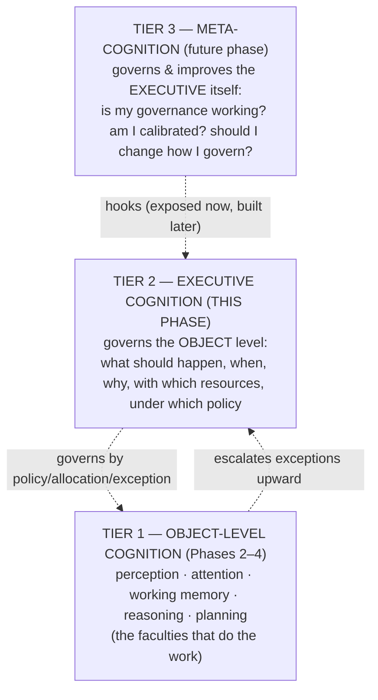
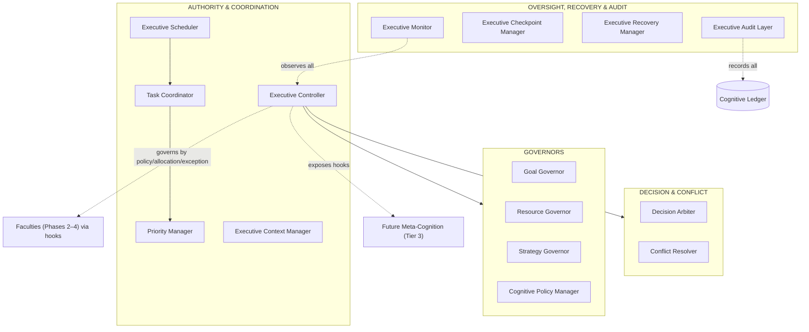
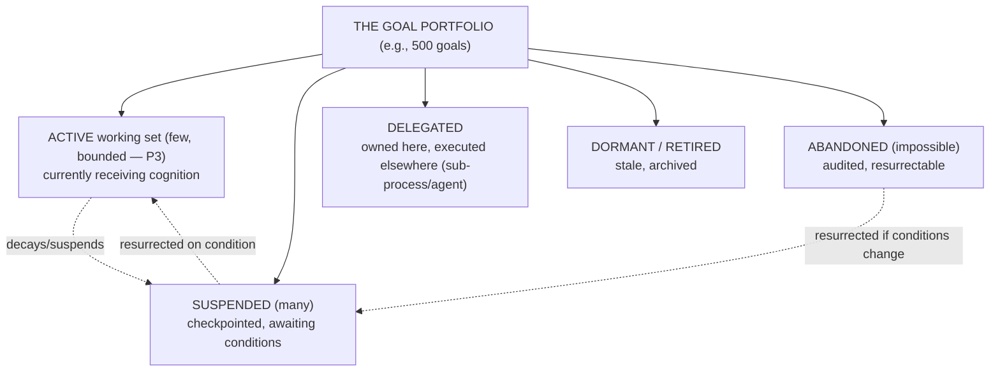
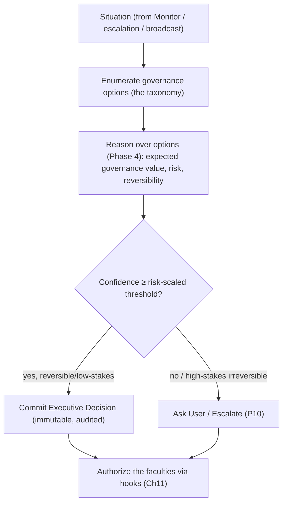
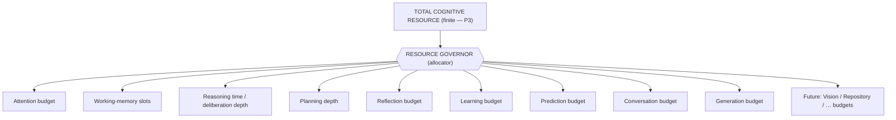
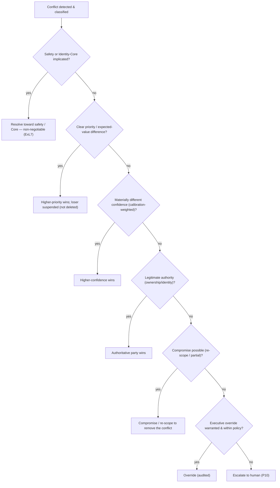
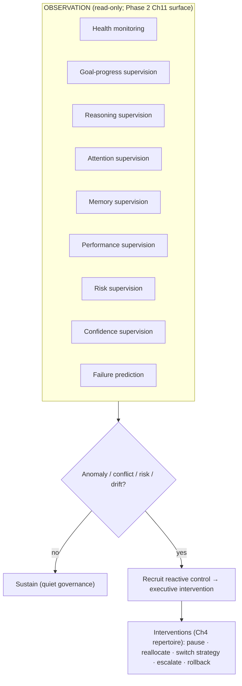
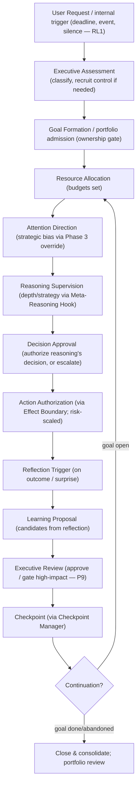

# UnityWorks Cognitive Intelligence Platform

## Phase 5 — The Executive Cognition Architecture

> **The Executive Mind of UnityWorks**

| | |
|---|---|
| **Phase** | 5 — Executive Cognition |
| **Predecessors (frozen as law)** | Phase 0 (Philosophy) · Phase 1 (State) · Phase 1.5 (Object Model) · Phase 2 (Runtime) · Phase 2.5 (Global Workspace) · Phase 3 (Attention) · Phase 4 (Reasoning) |
| **Status** | Research-grade architectural specification. No code, no APIs, no classes, no schemas, no frameworks, no implementation. |
| **Correctness horizon** | Must remain correct for 15 years across changing models, engines, modalities, and hardware. |
| **Register** | A dissertation in Cognitive Systems Architecture. Every decision answers *why before how*, cites the science, names rejected alternatives, states trade-offs and decade-scale evolution. |
| **Constitutional role** | The permanent constitutional blueprint for executive governance; the substrate on which the future **Meta-Cognition** phase attaches. |

This document inherits, without restatement: **P1–P12** (Phase 0); the ten **Regions** and the
**confidence currency** (Phase 1); the twelve object kinds, **OL1–OL9**, the eleven relationship types
(Phase 1.5); the runtime services, the **cognitive cycle**, **cognitive transactions**, the **Cognitive
Clock**, **RL1–RL8** (Phase 2); the **Conscious Field**, **ignition/broadcast**, **CL1–CL27** (Phase 2.5);
the attention subsystem, the **salience economy**, **AL1–AL17** (Phase 3); and the reasoning faculty, the
**Reasoning Engine Port**, the **Meta-Reasoning Hook**, **ReL1–ReL14** (Phase 4).

### The two ideas that organize this entire phase

Everything below rests on two commitments, stated once here so the reader holds them throughout.

**(1) The executive governs by policy, allocation, and exception — not by micromanagement.** The
naïve executive is a homunculus that personally decides everything; it is a bottleneck and a
contradiction (who governs the governor?). UnityWorks rejects it. Following **Norman & Shallice**, the
mind has *local automatic governors* (contention scheduling — the attention competition of Phase 3, the
reasoning economy of Phase 4, the runtime scheduler of Phase 2) that handle routine cognition
*without* the executive, and a *Supervisory* layer (the Executive Mind) that intervenes only for the
**non-routine, cross-cutting, high-stakes, and strategic**. The executive governs the many by *standing
policy* and *resource allocation*, and touches the few by *exception*. This is **subsidiarity**:
governance at the lowest capable level; the executive only for what only it can do.

**(2) Three tiers of control, cleanly separated.** This resolves the Executive-vs-Meta-Cognition question
the mandate poses:



**Executive Cognition** (Tier 2, this phase) governs *the faculties*. **Meta-Cognition** (Tier 3, a later
phase) governs *the executive* — it reasons about whether the executive's governance is working and
improves it. This phase builds Tier 2 and *exposes hooks* for Tier 3, exactly as prior phases exposed
hooks for Tier 2.

### Relationship to prior "executive" references

| Prior reference | What it was | Phase 5's relation |
|---|---|---|
| **Phase 0, C12 Metacognitive Supervisor** | The named "executive cognitive system" | Phase 5 is its **complete specification** (as Tier 2; Tier 3 remains future) |
| **Phase 1, R9 (Executive Decisions); Ch10** | Executive state + role | Phase 5 specifies the *governor* that writes it |
| **Phase 2, Ch11 hooks** | Observation + intervention surfaces | Phase 5 is the system that *attaches* to those hooks |
| **Phase 2.5, "the director"** | Works the attention spotlight | Phase 5's Executive Attention governance (via Phase 3's override channel) |
| **Phase 3, Ch6 Executive Attention** | The executive-override channel into attention | Phase 5 wields it (bounded by safety) |
| **Phase 4, Meta-Reasoning Hook** | Where governance sets reasoning depth/strategy | Phase 5 is the governor that uses it |

Phase 5 neither repeats nor contradicts these; it is the governing system they all anticipated.

---

## Table of Contents

- **Chapter 0** — Scientific Foundations of Executive Cognition
- **Chapter 1** — The Philosophy of Executive Cognition
- **Chapter 2** — The Executive Architecture (the components)
- **Chapter 3** — Goal Governance
- **Chapter 4** — Executive Decision Making
- **Chapter 5** — Cognitive Resource Governance
- **Chapter 6** — Conflict Management
- **Chapter 7** — Executive Policies
- **Chapter 8** — Executive Oversight
- **Chapter 9** — The Executive Lifecycle
- **Chapter 10** — The Executive Laws (the constitution)
- **Chapter 11** — Integration
- **Appendix A** — Consistency map to prior phases
- **Appendix B** — The homunculus problem, and how this architecture escapes it

---
---

# CHAPTER 0 — SCIENTIFIC FOUNDATIONS OF EXECUTIVE COGNITION

> Per the mission, a deep review that *justifies architecture*. For each theory: core idea · strengths ·
> weaknesses · engineering implication · **UnityWorks decision (adopt/adapt/reject)** · why. The chapter
> ends with the UnityWorks executive philosophy.

## 0.1 Why the executive is the hardest faculty to design

Executive function is the least localized and most contested construct in cognitive science, and it
carries a famous hazard: the **homunculus** — explaining intelligent control by positing a little
intelligent controller, which merely relocates the mystery (who controls *it*?). Every serious theory of
executive cognition is, in part, an attempt to *decompose the homunculus* into mechanisms. UnityWorks'
central obligation in this phase is therefore not merely to build a governor, but to build one that is
**mechanistic, bounded, decomposed, and non-regressive** — a governor that is not a hidden little person
(Appendix B). This chapter surveys how the science informs that obligation.

## 0.2 The foundations, compared

| # | Theory | Core idea | Strengths | Weaknesses | Decision |
|---|---|---|---|---|---|
| 1 | **Executive Functions** (Miyake & Friedman: *inhibition, updating, shifting*; "unity and diversity") | Executive control is a small set of separable-but-related functions | Empirically factor-analyzed; concrete | The set is coarse; boundaries fuzzy | **Adopt** — the three EFs map to concrete components (inhibition→conflict/override; updating→goal/WM governance; shifting→strategy/task switching) |
| 2 | **Prefrontal Cortex** | The neural seat of goal maintenance, control, inhibition, WM | Strong lesion/imaging evidence | Not a single module; distributed | **Adopt** (as warrant) — the Executive is the PFC analogue, *without* strict localization |
| 3 | **Supervisory Attentional System** (Norman & Shallice) | Routine action via *contention scheduling* (automatic); non-routine needs a *supervisory* system | Elegantly explains automatic vs controlled; the subsidiarity model | Under-specifies the SAS internals | **Adopt** — **the organizing principle**: local automatic governors + a supervisory executive |
| 4 | **Central Executive** (Baddeley) | A controller coordinating WM subsystems | Anchors WM control | Famously a "homunculus"; under-specified | **Adapt** — keep the coordinating role; **decompose it into concrete components** (the anti-homunculus move) |
| 5 | **Cognitive Control** | The capacity to guide behavior by goals over habits | Central, well-studied | Broad umbrella | **Adopt** — the Executive is the seat of cognitive control |
| 6 | **Goal Management Theory** (Duncan; goal neglect) | Failure = *goal neglect*: losing track of goals under load | Names the core failure mode | Descriptive | **Adopt** — portfolio management + periodic goal review to prevent neglect |
| 7 | **Hierarchical Reinforcement Learning** (options; temporal abstraction) | Sub-goals as reusable temporally-extended actions | Principled hierarchy/delegation | Learned policies are opaque | **Adapt** — goal hierarchy + delegation; **reject** opaque learned policy as the *governance* mechanism (must be explainable) |
| 8 | **Active Inference** | Policy selection minimizes expected free energy (incl. uncertainty) | Unifies control + info-seeking | Abstract; intractable literally | **Adapt** — the *policy-selection & information-seeking framing*; not the literal runtime |
| 9 | **Bounded Rationality** (Simon) | Real controllers *satisfice* under limits | Realistic; explains stopping | Less crisp than optimality | **Adopt** — **the executive is itself bounded**; it satisfices governance, cannot globally optimize |
| 10 | **ACT-R** | Production system; a goal buffer; conflict resolution among productions by utility | Concrete control cycle | Historically single-goal focus | **Adapt** — utility-based conflict resolution; **transcend** single-goal with portfolio governance |
| 11 | **SOAR Executive** | Operator selection; *impasse-driven* subgoaling; decision cycle; chunking | Impasse→subgoal is powerful | Complexity | **Adapt** — impasse → escalation to the executive; operator selection ≈ executive decision |
| 12 | **Cognitive Control Networks** (fronto-parietal + cingulo-opercular; dual control) | Two systems: rapid moment-to-moment control vs stable task-set maintenance | Neural dual-mode evidence | Coarse | **Adopt** — the Executive's two modes: *reactive intervention* vs *sustained policy/task-set maintenance* |
| 13 | **Conflict Monitoring Theory** (Botvinick; dACC) | The brain *monitors conflict* and recruits control when detected | Mechanistic trigger for control | Detection ≠ resolution | **Adopt** — conflict *detection* recruits executive control (Ch6) |
| 14 | **Cognitive Flexibility** (set-shifting) | Switching task-sets/strategies adaptively | Explains adaptation | Switching costs | **Adopt** — Strategy Governor's switching, *costed* (Phase 3/4) |
| 15 | **Task Management** | Maintaining and switching among concurrent task-sets | Explains multitasking | Interference | **Adopt** — Task Coordinator + task-set maintenance vs switch cost |
| 16 | **Error Monitoring** (ERN) | The brain detects its own errors rapidly | Self-monitoring is real | Detection only | **Adopt** — Executive Monitor's error detection (operational altitude) |
| 17 | **Performance Monitoring** | Ongoing evaluation of goal attainment | Enables correction | — | **Adopt** — Executive Monitor's performance supervision → intervention |

## 0.3 Deep dives on the pillars

**Supervisory Attentional System (adopt — the organizing principle).** Norman & Shallice's dual model is
the single most important idea in this phase. It says most behavior runs *automatically* by
well-learned schemas competing locally (contention scheduling), and a *supervisory* system engages only
when routine fails — novelty, danger, conflict, error, or deliberate planning. UnityWorks maps this
directly: Phases 2–4 built the *automatic local governors* (attention competition, reasoning economy,
runtime scheduling); Phase 5 builds the *supervisory* executive. This is *why* the executive can govern
500 goals without a seizure: it does not govern them all directly — the local governors handle the
routine, and the executive engages only the exceptional. Subsidiarity is not an optimization; it is the
architecture.

**Central Executive → decomposition (the anti-homunculus commitment).** Baddeley's central executive was
criticized precisely for being a homunculus — a black box labeled "control." UnityWorks accepts the
critique as a design constraint: **the Executive Mind must be decomposed into concrete components with
explicit responsibilities, inputs, outputs, and mechanisms** (Chapter 2), and it must *use the reasoning
faculty* (Phase 4) to make its governance decisions rather than possessing magical decision powers. There
is no little person inside; there is a specialized, bounded, mechanistic governor that reasons about the
mind using the same reasoning architecture as everything else. Appendix B makes this escape explicit.

**Bounded Rationality (adopt — the executive is bounded too).** The executive is *not* an omniscient
optimizer. It is subject to the same finitude as the rest of the mind (P3, Phase 3 Ch7): it has bounded
attention (it cannot consciously hold 500 goals), bounded time, and bounded certainty. Therefore it
*satisfices* governance — good-enough allocation, good-enough arbitration — and it *escalates* what it
cannot resolve (P10). An executive that pretended to global optimality would be a fiction; UnityWorks'
executive is honestly bounded, which is exactly what makes it implementable and trustworthy.

**Conflict Monitoring + Cognitive Control Networks (adopt — the engagement trigger and the two modes).**
Botvinick's insight — that a dedicated monitor *detects conflict* and *recruits control* — gives the
executive its engagement trigger: the executive does not run at full intensity always; it is *recruited*
when the local governors signal conflict, error, novelty, or risk. And the dual-network evidence gives
the executive its two operating modes: a **sustained mode** (maintaining task-sets, goals, and policy
over time) and a **reactive mode** (rapid intervention on conflict/error). Both appear in Chapter 8.

## 0.4 The UnityWorks executive philosophy

> The Executive Mind of UnityWorks is a **bounded, supervisory, mechanistically-decomposed governor**
> (Norman–Shallice + anti-homunculus) that governs a *portfolio* of goals (transcending single-goal
> control) by **standing policy, resource allocation, and exception-handling** (subsidiarity), is
> *recruited* by conflict/error/novelty/risk (conflict monitoring) rather than running omnipotently, uses
> the **reasoning faculty** to make governance decisions (no magic), operates in a **sustained** and a
> **reactive** mode (dual control networks), **coordinates but never replaces** the faculties (P1), holds
> **exclusive authority** to own goals, allocate resource, and authorize action, is **subordinate to
> safety** absolutely, and is itself **observable, explainable, auditable, and bounded** — governing the
> object level while exposing hooks for a future meta-cognitive tier that will govern it in turn.

---
---

# CHAPTER 1 — THE PHILOSOPHY OF EXECUTIVE COGNITION

## 1.1 Why executive cognition exists

Phases 2–4 built a mind that can perceive, attend, hold, and reason. But a collection of capable
faculties is not yet a *governed* mind — it is a talented committee with no chair. Someone must decide
*which* of 500 goals gets pursued now, *which* conversation gets cognition, *how much* reasoning a matter
deserves, *what* to do when two goals conflict, *when* a goal is impossible and must be abandoned, and
*whether* an action is authorized. These are not questions any single faculty can answer, because each
faculty sees only its own concern. **Executive cognition exists to answer the questions that span
faculties and span time** — the questions of *governance*. Without it, the faculties would each optimize
locally and the mind as a whole would behave incoherently: attention chasing salience while goals drift,
reasoning deliberating forever while deadlines pass, conversations interfering, resources exhausted by
the loudest rather than the most important. The executive is the source of *global coherence over the
whole mind across time*.

## 1.2 Why reasoning alone is insufficient

Reasoning (Phase 4) transforms conscious content into conclusions — but it does not decide *what to
reason about*, *how much to reason*, or *whether the conclusion may be acted upon*. Reasoning is a
faculty *pointed at a problem*; something must choose the problem, budget the effort, and authorize the
result. A mind that was "only reasoning" would reason brilliantly about whatever happened to be conscious,
with no governance of what that should be, no allocation of effort across competing matters, and no
authority over action. Reasoning is *competence*; the executive is *governance of competence*. (This is
the Phase 0 judgment-vs-competence boundary, applied at the top.)

## 1.3 Why attention cannot govern itself

Attention (Phase 3) selects what becomes conscious — but by *local salience*, not *global strategy*.
Attention answers "what is most salient right now?"; it cannot answer "given all my goals, my deadlines,
my resources, and my safety constraints, what *should* I be attending to over the next hour?" Local
salience can be captured by the loud and the novel (a well-known failure mode); only a governor with a
*global, temporal, goal-and-policy view* can direct attention *strategically* — which is exactly the
Executive Attention channel (Phase 3, Ch6) that this phase wields. Attention selects tactically; the
executive directs strategically. Self-governing attention would be perpetually hijacked by whatever
shouts loudest.

## 1.4 Why working memory cannot manage itself

Working Memory (Phase 2.5) maintains a bounded conscious focus — but it has no basis for deciding *which*
of many competing matters deserves its scarce slots *given the mind's goals and priorities*. That
decision requires the global, goal-aware view only the executive has. WM is a bounded stage; the executive
is the director who decides which play is staged. Self-managing WM would fill with the merely-active
rather than the strategically-important.

## 1.5 Why goals require governance

Goals (Phase 1.5) are objects with lifecycles — but *a portfolio of 500 goals is not self-governing*.
Someone must decide which are active, which suspended, which delegated, which abandoned as impossible,
which resurrected when conditions change, and how conflicts among them are resolved. Left ungoverned,
goals suffer *goal neglect* (Duncan): the mind loses track of its important goals under load and drifts to
whatever is immediate. The executive is the *portfolio manager* that prevents neglect and keeps the mind's
behavior aligned with its most important intentions over time (Chapter 3).

## 1.6 Why cognition requires an executive layer

Synthesizing §1.2–§1.5: every faculty is *locally competent and globally blind*. Coherent,
goal-directed, resource-bounded, safe behavior over time *across* faculties requires a layer whose
concern *is* the whole and the long run. That layer is the executive. It is not an optional
optimization; it is the difference between a mind and a bag of faculties. And crucially — per §0.3 — it
governs mostly by *policy and allocation* (so it need not, and cannot, micromanage), engaging directly
only by exception.

## 1.7 The eleven concepts — executive cognition distinguished

| Concept | What it is | How it differs from executive cognition |
|---|---|---|
| **Executive Cognition** | Governance of the object level: what/when/why/how-much/under-what-policy | *is the governor* |
| **Reasoning** | Transforming conscious content into conclusions | Executive *directs and budgets* reasoning; it does not itself infer (it *uses* reasoning) |
| **Planning** | Reasoning about future action | Executive *commissions and approves* plans; planning produces them |
| **Attention** | Local salience-based selection | Executive *directs* attention strategically (Phase 3, Ch6) |
| **Working Memory** | Bounded conscious maintenance | Executive *decides what deserves* WM globally |
| **Reflection** | Evaluating a completed episode | Executive *triggers and consumes* reflection; reflection proposes to it |
| **Learning** | Durable, validated change | Executive *reviews and authorizes* high-impact learning (P9); learning commits |
| **Decision** | Committing to an option | Executive *decisions* are a specific kind (governance decisions); object-level decisions are reasoning's commitments it *authorizes* |
| **Meta-Cognition** | Governing/improving the *executive itself* | A **higher tier** (Tier 3) that governs the executive; this phase exposes hooks to it |
| **Identity** | The stable self | Executive governs *under* identity's constraints; identity bounds what the executive may will (Phase 1, Ch4) |
| **Consciousness** | The bounded broadcast content | Executive *reads* the broadcast like any consumer (no homunculus, CL9) and *directs* what gets staged |

The clarifying relations: the executive is *below* identity and safety (it governs within their
constraints, never overriding them), *above* the faculties (it directs and budgets them), and *below* the
future meta-cognition (which will govern it). It **uses** reasoning, **directs** attention and WM,
**triggers** reflection, **authorizes** learning and action, **owns** goals, and **reads** consciousness
— a coordinator that touches everything and duplicates nothing (P1).

---
---

# CHAPTER 2 — THE EXECUTIVE ARCHITECTURE (THE COMPONENTS)

## 2.1 The subsystem

The Executive Mind is decomposed into fifteen components (the anti-homunculus commitment, §0.3). Each has
one governance responsibility (OL1) and is independently replaceable (P6/OL8). They are grouped by
governance function.



## 2.2 The components

For each: **purpose · responsibilities · inputs · outputs · boundaries · lifecycle · failure modes ·
recovery · alternatives rejected · why it cannot be merged.**

**1. Executive Controller.**
- *Purpose:* the seat of executive authority; runs the executive cycle (Chapter 9); the only component
  that may *authorize* cognition and action (ExL1).
- *Responsibilities:* coordinate the governors; recruit executive control on conflict/error/novelty/risk;
  make/authorize executive decisions via the Decision Arbiter; obey identity + safety constraints.
- *Inputs:* the conscious broadcast; escalations from local governors; monitor signals; policy.
- *Outputs:* authorizations, directives, and executive decisions.
- *Boundaries:* it governs; it performs no perception/attention/reasoning itself — it *uses* the faculties
  (P1). It reads consciousness like any consumer (no homunculus, CL9).
- *Lifecycle:* continuous (RL1); mostly quiescent (subsidiarity), active on recruitment.
- *Failure modes:* over-recruitment (governs too much → bottleneck) → the Monitor detects and the policy
  raises delegation thresholds; deadlock → escalate (P10).
- *Recovery:* checkpoint + restore (via the Checkpoint/Recovery managers).
- *Alternatives rejected:* a homunculus controller (Appendix B) — rejected as non-mechanistic and
  regressive.
- *Why not merged:* authority must be a single, auditable locus; distributing it destroys accountability
  (who authorized this?) and re-creates the coordination catastrophe.

**2. Executive Scheduler.**
- *Purpose:* govern *the executive's own bounded attention* — which governance matters the executive
  engages now (portfolio-level), and set the priority policy that the runtime Cognitive Scheduler (Phase
  2, Ch4) and Attention Scheduler (Phase 3) execute.
- *Responsibilities:* select the few governance concerns worthy of executive engagement; defer the rest to
  local governors; maintain the sustained-vs-reactive mode balance.
- *Inputs:* the priority ordering (Priority Manager); escalations; deadlines.
- *Outputs:* executive engagement decisions; priority policy for lower schedulers.
- *Boundaries:* it schedules *executive* engagement, not object-level cycles (that is Phase 2's scheduler,
  its subordinate). Three-level hierarchy: Executive Scheduler → Cognitive Scheduler → Attention Scheduler.
- *Failure modes:* executive starvation of a strategic matter (→ fairness boost, as Phase 3/4).
- *Why not merged:* the *executive's own* bounded attention is a distinct scarce resource from the runtime's
  cycle allocation; conflating them makes the executive either omnipresent (bottleneck) or absent.

**3. Task Coordinator.**
- *Purpose:* coordinate the *portfolio of concurrent cognitive tasks/episodes/conversations* (the 120
  conversations, the many episodes) — maintaining their task-sets and their isolation.
- *Responsibilities:* maintain task-set for each active matter; coordinate context switches; enforce
  isolation across conversations (with the Context Manager).
- *Inputs:* active episodes; context boundaries.
- *Outputs:* coordinated task-set maintenance and switching.
- *Boundaries:* it coordinates concurrency; it does not *own* goals (that is the Goal Governor).
- *Why not merged:* concurrency coordination (task-set maintenance, switch cost) is distinct from goal
  ownership and from scheduling; it is the "multitasking" competence (Ch0, item 15).

**4. Priority Manager.**
- *Purpose:* maintain the *global* priority ordering across all goals and matters.
- *Responsibilities:* compose priority from strategic alignment, urgency, risk, confidence, owner
  authority, and cost (recomputed, as Phase 1.5 §2.8), at the portfolio level; expose the ordering to the
  Scheduler and Resource Governor.
- *Inputs:* goals + their attributes; policy; monitor signals.
- *Outputs:* the global priority ordering.
- *Boundaries:* it orders; it does not schedule or allocate (its consumers do).
- *Why not merged:* a single, global, recomputed ordering must be authoritative and inspectable; folding
  it into the scheduler hides *why* something is prioritized.

**5. Executive Context Manager.**
- *Purpose:* manage executive-level context — which conversation/workspace/identity context is active, and
  enforce isolation across the 120 conversations (Phase 2.5, Ch9).
- *Responsibilities:* activate/deactivate contexts; enforce the ignition-boundary isolation (CL19); manage
  shared vs private context.
- *Inputs:* context-switch triggers; identity.
- *Outputs:* the active context; isolation enforcement.
- *Boundaries:* it manages context boundaries; it does not reason within them.
- *Why not merged:* context isolation is a *privacy and coherence* guarantee (CL19) that must be a
  dedicated, auditable authority — one user's matters must never leak into another's governance.

**6. Goal Governor.** *(Chapter 3.)* The executive owner and portfolio manager of the goal graph.
*Why not merged:* goal ownership is the executive's defining authority (ExL2) and demands a dedicated
governor.

**7. Resource Governor.** *(Chapter 5.)* The master allocator of all cognitive budgets.
*Why not merged:* resource allocation is the second defining authority; it must be a single bounded
allocator to prevent over-commitment (ExL4).

**8. Strategy Governor.**
- *Purpose:* govern *which strategies* (reasoning, attention, planning) are in force — setting strategy
  policy and authorizing strategy switches at the executive altitude (cognitive flexibility, Ch0 item 14).
- *Responsibilities:* select governing strategy for a matter; authorize costly switches; prevent strategy
  thrash across the portfolio.
- *Inputs:* matter type, stakes, past strategy efficacy (from reflection/learning).
- *Outputs:* strategy directives (via the Phase 4 Meta-Reasoning Hook and Phase 3 override).
- *Boundaries:* it governs strategy *selection policy*; the faculties execute the strategies.
- *Why not merged:* strategy governance is distinct from goal, resource, and policy governance — it is the
  "how we operate" governor, orthogonal to "what we want" and "what we may spend."

**9. Cognitive Policy Manager.** *(Chapter 7.)* Maintains the standing policy framework.
*Why not merged:* policy (standing legislation) is categorically distinct from decisions (case-by-case
rulings) and allocation (budget); it is *how the executive governs the many without micromanaging*.

**10. Decision Arbiter.** *(Chapter 4.)* Makes and authorizes executive decisions, producing Executive
Decision objects (Phase 1.5, Ch9). *Why not merged:* commitment authority must be a single auditable
locus (ExL3).

**11. Conflict Resolver.** *(Chapter 6.)* Detects, classifies, and resolves cross-cutting conflicts.
*Why not merged:* conflict monitoring + resolution is a dedicated function (Botvinick, Ch0 item 13) that
recruits executive control; folding it into the Arbiter conflates *detecting a problem* with *deciding a
course*.

**12. Executive Monitor.** *(Chapter 8.)* Continuous oversight of the mind's health, progress, and risk.
*Why not merged:* observation must be independent of control (P4); the Monitor watches, the Controller
acts.

**13. Executive Checkpoint Manager.**
- *Purpose:* govern *when* full-mind checkpoints are taken (using Phase 1.5, Ch10 Checkpoints) for
  recovery and branching at the executive altitude — before risky authorizations, at episode boundaries,
  and before major context switches.
- *Boundaries:* it *decides when* to checkpoint; the Checkpoint object *is* the mechanism.
- *Why not merged:* checkpoint *policy* (when) is a governance decision distinct from the checkpoint
  mechanism and from recovery.

**14. Executive Recovery Manager.**
- *Purpose:* govern recovery from failures — rollback to a checkpoint, restore, re-plan, or escalate —
  when a goal fails, an action fails, or the mind enters an inconsistent-risk state.
- *Boundaries:* it *governs* recovery; the underlying mechanisms (replay, rollback) are the runtime's.
- *Why not merged:* recovery *governance* (choosing the recovery strategy) is distinct from checkpointing
  (creating restore points) and from the runtime's replay mechanism.

**15. Executive Audit Layer.**
- *Purpose:* guarantee that *every* executive act — decision, allocation, policy change, intervention,
  override — is recorded, explainable, and auditable (ExL3, ExL5), by writing to the Cognitive Ledger.
- *Boundaries:* it records; it never influences governance.
- *Why not merged:* auditability of *the governor itself* is a constitutional requirement and must be
  structurally independent of the governor (so the record cannot be quietly shaped by what it records).

## 2.3 Why fifteen, and why decomposed

The count is the minimum in which each governance concern — authority, executive-scheduling, concurrency,
priority, context, goals, resources, strategy, policy, decision, conflict, oversight, checkpointing,
recovery, and audit — has a *named, mechanistic owner*. Decomposition is not stylistic; it is the
**anti-homunculus commitment** (Appendix B): a governor built from opaque "control" is a little person in
a box; a governor built from fifteen inspectable mechanisms is an *architecture*. Every component's "why
it cannot be merged" is a defense of that decomposition.

---
---

# CHAPTER 3 — GOAL GOVERNANCE

## 3.1 The executive as portfolio manager

Phase 1.5 (Ch2) specified the Goal *object* — its anatomy, states, and arbitration. Phase 5 specifies
its *governance*: the executive as the **owner and portfolio manager** of the entire goal graph. The
reframing from "goal object" to "goal portfolio" is the key move, because it answers the fundamental
question directly: *the executive does not pursue 500 goals; it manages a portfolio of 500 goals* — much
as a fund manager does not personally execute every position but governs an allocation across them, with
most dormant, a few active, the impossible divested, and the promising resurrected.



## 3.2 The governance operations

Grouped as *creation*, *portfolio dynamics*, *termination*, and *stewardship*. Each references the Goal
object mechanics (Phase 1.5) and adds the governance layer.

**Creation & ownership.**
- **Goal creation** — a goal is *proposed* (by perception, reasoning, executive, or trigger) and admitted
  only through the executive's **ownership** gate (identity/role legitimacy + constraint + capacity —
  Phase 1.5 §3.5). *Every goal has exactly one accountable executive owner* (ExL2).
- **Goal hierarchy** — strategic → tactical → operational → micro (Phase 1.5 §3.4); the executive governs
  at the *strategic/tactical* altitude and *delegates* operational/micro governance to local processes.
- **Goal dependency graphs** — the executive maintains the prerequisite/support/conflict DAG (via
  planning's dependency reasoning, Phase 4 Ch6) to schedule and detect conflicts.

**Portfolio dynamics.**
- **Activation / suspension / interruption / resumption** — the executive moves goals between the active
  working set and suspension as priority and conditions change (Phase 1.5 §3.5), always checkpointing on
  suspension for faithful resumption.
- **Delegation** — the executive *retains ownership* but assigns *execution* of a goal to a sub-process or
  (future) another agent — the basis of hierarchical control (HRL, Ch0 item 7) and multi-agent (Ch11).
- **Merging / splitting** — redundant goals merge; impasse-driven goals split (Phase 1.5 §3.5), with
  provenance preserved.
- **Negotiation** — when goals conflict or ownership is shared (with the user, or across agents), the
  executive *negotiates* rather than unilaterally deciding — surfacing the conflict to the owner (P10) or
  reconciling by policy.

**Termination.**
- **Completion** — success conditions met (Phase 1.5 §3.5); the executive *declares success* (answering
  "who declares success?": the Goal Governor, on evaluated success conditions, recorded as an Executive
  Decision).
- **Abandonment** — the executive *abandons impossible goals* (answering "who abandons impossible
  goals?"): when the achievable set is provably empty, the deadline/budget is exhausted, or the cost
  exceeds any plausible value. Abandonment is a *first-class, audited executive decision* — never a silent
  drop (Phase 1.5 §3.8).
- **Retirement** — stale goals with no activity and no owner interest are retired to dormancy (archived,
  resurrectable) — the antidote to portfolio bloat and goal neglect.

**Stewardship.**
- **Recovery / resurrection** — a *failed* goal may be reactivated with a new approach (recovery); an
  *abandoned* goal may be *resurrected* when conditions change (a previously-impossible goal becomes
  feasible) — both audited.
- **Auditing / versioning** — every goal transition is a versioned Ledger event (OL4/OL6); the executive
  can answer "why did we pursue this, in what order, on whose authority, and why did we abandon it?"
- **Prioritization** — the Priority Manager maintains the global recomputed ordering (Ch2); the executive
  *reviews the portfolio periodically* to prevent goal neglect (Duncan, Ch0 item 6) — a scheduled
  governance ritual that re-examines suspended and dormant goals against current conditions.

## 3.3 Goal conflicts and negotiation

Goal conflicts are resolved by the executive's arbitration ladder (Chapter 6), but Goal Governance adds
**negotiation** as the preferred first resort when a conflict involves *external owners* (the user, other
agents): rather than the executive unilaterally suppressing one goal, it *surfaces the trade-off* and
seeks resolution from the accountable owner (P10). Unilateral executive resolution is reserved for
conflicts wholly within the executive's own ownership. This keeps the human (or peer agent) in the loop
for conflicts that are genuinely theirs to arbitrate.

## 3.4 Why portfolio governance, not per-goal pursuit

- **Rejected: pursue every active goal directly.** *Disadvantage:* impossible under bounded cognition
  (P3) — 500 simultaneous pursuits is the seizure; and it invites goal neglect under load. *Violates:* P3.
- **Rejected: a flat priority queue of goals.** *Disadvantage:* no hierarchy, no delegation, no
  suspension/resurrection, no portfolio review — goals starve or bloat. *Violates:* goal-management theory.
- **Adopted: portfolio management** — a bounded active working set, most suspended/dormant, impossible
  ones abandoned (audited), promising ones resurrected, periodically reviewed. This is the only model that
  scales to hundreds of goals under bounded cognition while preventing neglect — the direct answer to the
  fundamental question.

---
---

# CHAPTER 4 — EXECUTIVE DECISION MAKING

## 4.1 The executive's action repertoire is governance, not world-action

A crucial distinction: the executive does not act on the world (that is the Workspace faculty via the
Effect Boundary). The executive's "actions" are **governance moves** — directives to the faculties and
authorizations of their products. Its decision repertoire is the verbs of governance. Every executive
decision is an **Executive Decision object** (Phase 1.5, Ch9): immutable, with alternatives, rationale,
confidence, and authorizing identity — the causal hinge of governance.

## 4.2 The executive decision taxonomy

| Decision | What it governs | Typically when… |
|---|---|---|
| **Continue** | Let current cognition proceed | Progress is good; confidence adequate |
| **Pause** | Freeze a matter at a boundary | A higher-priority matter arrives |
| **Resume** | Restore a paused matter | Its preemptor is done / condition cleared |
| **Stop / Abort** | End a matter | Goal achieved, or unrecoverable / no longer worthwhile |
| **Delegate** | Assign execution elsewhere (retain ownership) | Routine or parallelizable sub-work |
| **Escalate** | Hand to a human (or higher authority) | Contested authority; high-stakes low-confidence (P10) |
| **Retry** | Re-attempt after failure | Transient failure; a viable variation exists |
| **Verify** | Invoke checking before trusting | Correctness-critical conclusions (verify-then-trust) |
| **Ask User** | Seek clarification/authorization | Ambiguous goal; irreversible high-stakes action |
| **Retrieve** | Direct recall/knowledge activation | A belief needs grounding evidence |
| **Generate** | Authorize a generation faculty invocation | Content/output is required |
| **Reflect** | Trigger reflection on an episode | Outcome available; surprise occurred |
| **Learn** | Authorize a learning commit (after review) | A validated candidate clears review (P9) |
| **Wait** | Hold pending an external condition | A dependency/event is awaited |
| **Compare** | Branch to evaluate alternatives | Counterfactual evaluation before commitment (Checkpoint branching) |
| **Switch Strategy** | Change the governing strategy | Impasse / low confidence / diminishing returns |

## 4.3 How executive decisions are made

The executive is *not* a magic decider (anti-homunculus); it **uses the reasoning faculty** (Phase 4) to
choose among governance options, then commits via the Decision Arbiter. Every executive decision carries
the seven properties the mandate requires:



| Property | For an executive decision |
|---|---|
| **Why** | The rationale — recorded (the governance reason) |
| **When** | The logical-time position and the triggering situation |
| **How** | The directive issued to which faculties (via hooks) |
| **Constraints** | The policy + identity + safety constraints that bounded it |
| **Confidence** | The calibrated confidence in the governance choice (ExL6) |
| **Reversibility** | Whether the governance move can be undone (informs the threshold) |
| **Auditability** | Recorded immutably in the Audit Layer / Ledger (ExL3) |

## 4.4 The safety-subordination of every executive decision

No executive decision may violate a safety or identity-core constraint (ExL7). The risk-scaled autonomy
threshold (Phase 4, Ch7.4) governs executive decisions too: the more irreversible and high-stakes the
governance move, the higher the confidence required to make it autonomously, else **Ask User / Escalate**.
This is why "Ask User" and "Escalate" are first-class members of the repertoire — the executive's most
important competence is knowing *when not to decide alone* (P10).

---
---

# CHAPTER 5 — COGNITIVE RESOURCE GOVERNANCE

## 5.1 The executive as the mind's central bank

Phases 3 and 4 established *local* economies (attention budget, reasoning budget). The executive is the
**global allocator above them all** — the mind's central bank and OS resource manager combined. It
allocates a *finite total* of cognitive resource across every faculty and every matter. Bounded cognition
(P3) means the pie is finite; governance means deciding who gets what slice, and re-deciding as conditions
change.



## 5.2 The governance mechanisms (OS + economics)

| Mechanism | Meaning | Grounding |
|---|---|---|
| **Allocation** | Assign resource shares by priority × expected value − cost | Portfolio economics; opportunity cost |
| **Reallocation** | Shift shares as priorities/conditions change (recomputed) | Dynamic scheduling |
| **Reservation** | Guarantee a minimum share to a critical matter (e.g., safety monitoring) | Real-time reservation |
| **Borrowing** | A matter may temporarily borrow idle resource, returned on demand | Work-conserving scheduling |
| **Starvation prevention** | Aging boosts for long-neglected high-value matters | Cognitive fairness (Phase 2/3) |
| **Fairness** | Protect *intentions*, not equal-time (Phase 3, Ch4.4) | Relevance-fairness |
| **Resource exhaustion** | When the pie is spent, shed low-priority matters, narrow, or escalate — never over-commit | Bounded cognition (ExL4) |
| **Priority inversion** | A low-priority matter holding a resource a high-priority matter needs | OS priority inversion |
| **Priority-inheritance recovery** | The blocker temporarily inherits the blocked matter's priority to release the resource | Priority inheritance protocol |
| **Recovery** | On mis-allocation (a matter starved, a deadline missed), reallocate and reflect | Performance monitoring |
| **Bounded cognition** | The sum of allocations never exceeds the finite total | P3 (constitutional) |

## 5.3 Priority inversion — a worked governance hazard

Priority inversion is a subtle failure UnityWorks must handle: a high-priority goal (H) needs a resource
(say, the Generation faculty, or a WM slot) held by a low-priority goal (L); meanwhile a medium-priority
goal (M) preempts L, so L never releases, and H is blocked indefinitely by M. The executive detects this
via the Monitor (H is starving despite high priority) and applies **priority inheritance**: L temporarily
inherits H's priority so it runs, releases the resource, and unblocks H. Importing this classic OS
solution is an example of the mandate's instruction to justify decisions with systems engineering — and
it is exactly the kind of cross-cutting resource hazard only a *global* executive can resolve (a local
governor sees only its own matter).

## 5.4 Why a single bounded global allocator

- **Rejected: purely local budgets with no global allocator.** *Disadvantage:* local governors cannot
  resolve cross-cutting resource conflicts (priority inversion), cannot rebalance across faculties, and
  can collectively over-commit the finite total. *Violates:* P3 (boundedness) at the global level.
- **Rejected: an unlimited resource assumption ("just scale hardware").** *Disadvantage:* removes the
  discipline of scarcity that makes cognition rational (Phase 3, Ch7.1) — the mind would deliberate and
  explore without bound. *Violates:* bounded-rationality (Ch0 item 9).
- **Adopted: a single bounded global allocator over local economies.** The executive sets and rebalances
  budgets; local governors spend within them. This is the only model that keeps total cognition bounded,
  resolves cross-cutting hazards, and preserves the discipline of scarcity as hardware scales.

---
---

# CHAPTER 6 — CONFLICT MANAGEMENT

## 6.1 Conflict monitoring recruits executive control

Following Conflict Monitoring Theory (Botvinick, Ch0 item 13), the executive does not run at full
intensity always; it is *recruited* when conflict is detected. The Conflict Resolver is the mind's
conflict monitor: it detects, classifies, and resolves conflicts that the local governors cannot resolve
alone or that span faculties.

## 6.2 The conflict taxonomy

| Conflict type | Example | Primary resolution basis |
|---|---|---|
| **Goal conflict** | Two goals demand incompatible actions | Priority → authority → negotiation → escalation |
| **Reasoning conflict** | Two engines/strategies reach opposite conclusions | Confidence (calibration-weighted) → verify → ensemble |
| **Attention conflict** | Two coalitions contest the field | Salience + executive bias (Phase 3) |
| **Planning conflict** | Two plans need the same resource/target | Resource governance + priority |
| **Identity conflict** | An overlay would violate the Core | **Core precedence (absolute)** (Phase 1, Ch4) |
| **Conversation conflict** | Two conversations' matters interfere | Context isolation (CL19) + priority |
| **Resource conflict** | Contention for a scarce budget | Resource Governor (Ch5), priority inheritance |
| **Policy conflict** | Two standing policies prescribe opposite actions | Policy precedence (Ch7) |
| **Safety conflict** | An action bears on a safety constraint | **Safety dominance (absolute)** |

## 6.3 The resolution ladder

The executive resolves conflicts by a fixed, auditable ladder — the unification of the arbitration orders
from Phase 1.5 (§2.8), Phase 2 (Ch7), and Phase 3, elevated to the executive altitude:



## 6.4 Detection, classification, and the resolution primitives

- **Detection** — the Monitor + Conflict Resolver watch for contradictory beliefs (truth-maintenance,
  Phase 1.5 Ch4), competing goals, resource contention, and policy clashes.
- **Classification** — each conflict is typed (§6.2), because type determines the *basis* of resolution
  (a safety conflict is not resolved like a resource conflict).
- **Resolution primitives** — **arbitration** (the ladder), **compromise** (re-scope so both partially
  satisfied), **override** (executive imposes a resolution, audited), **rollback** (restore a
  pre-conflict checkpoint if the conflict arose from a bad transition), **escalation** (to a human when
  authority is contested or stakes high under uncertainty — P10).
- **Never silent** — no conflict is resolved by silent last-write-wins; every resolution is a recorded
  executive decision (auditability), so the mind can always answer "why did this side win?"

## 6.5 Why absolute dominance for safety and identity

Safety and Identity-Core conflicts are resolved *lexicographically* — they dominate absolutely, above
priority, confidence, authority, and even executive override (ExL7). *Why:* a governor whose priority,
confidence, or convenience could outvote safety is unsafe by construction, and one whose overlays could
overwrite its Core is a governor with no stable self (the prompt-injection vulnerability, Phase 1, Ch4).
Making these absolute — architectural, not weighed — is the constitutional guarantee that no amount of
governance pressure can compromise the mind's safety or identity.

---
---

# CHAPTER 7 — EXECUTIVE POLICIES

## 7.1 Policy is how the executive governs the many without micromanaging

Policies are the executive's **standing legislation** — general rules the local governors follow *without
the executive being present*. This is the mechanism of subsidiarity (§0.3): the executive governs 500
goals and 120 conversations largely by *policy* (which the local governors apply automatically), reserving
its scarce direct attention for exceptions. The governance triad:

| Instrument | Nature | Analogy | Chapter |
|---|---|---|---|
| **Policy** | Standing rules, always in force | Legislation | 7 |
| **Allocation** | Budgets local governors spend within | Budget/appropriation | 5 |
| **Decision** | Case-by-case governance rulings | Executive/judicial ruling | 4 |

## 7.2 The policy families

| Policy | Governs | Example rule (illustrative) |
|---|---|---|
| **Safety Policy** | The absolute safety constraints | "No irreversible high-stakes action without human approval" |
| **Reasoning Policy** | Depth/strategy defaults | "Correctness-critical matters use verify-then-trust" |
| **Attention Policy** | Salience weighting defaults | "Surprise on safety-relevant signals always ignites" |
| **Conversation Policy** | Context isolation, disclosure | "Never surface one user's content in another's context" |
| **Learning Policy** | What may be learned and how | "Identity-Core changes require human review" (P9) |
| **Generation Policy** | When/how generation is invoked | "Ground all claims in cited beliefs" |
| **Workspace Policy** | World-effect governance | "Prefer reversible/canary actions; checkpoint before irreversible" |
| **Identity Policy** | Overlay/role legitimacy | "Overlays may narrow, never widen, Core constraints" |
| **Future Vision Policy** | Visual-input governance | (reserved) |
| **Future Automation Policy** | Unattended-action governance | "Unattended actions require the strictest safety margin" |

## 7.3 Policy lifecycle, inheritance, precedence, conflict, evolution

- **Lifecycle:** a policy is *proposed* (usually by learning/reflection or human authority), *validated*
  against existing policy and safety, *enacted*, *monitored*, and *retired/superseded* — versioned
  (OL4).
- **Inheritance:** policies inherit *global → context → task* — a global safety policy applies everywhere;
  a context (conversation) may *tighten* it; a task may tighten further. Inheritance may only *narrow*,
  never *widen*, a stricter ancestor (the Identity precedence law generalized).
- **Precedence:** on conflict, a fixed order — **Safety > Identity > Conversation-privacy > Reasoning /
  Attention / Generation / Workspace > convenience**. Safety and Identity policies dominate absolutely
  (ExL7).
- **Conflict resolution:** policy conflicts are resolved by precedence; genuinely irreconcilable policy
  conflicts (rare) escalate to human authority — the executive does not silently pick.
- **Evolution:** policies evolve *only* through the learning pipeline with executive/human review (P9):
  reflection proposes a policy change → learning validates → the executive (or a human for high-impact)
  approves → versioned enactment → monitored, reversible. This is how the mind's *governance itself*
  improves over 15 years without drift or corruption.

## 7.4 Why policy-first governance

- **Rejected: govern purely by per-case decisions.** *Disadvantage:* the executive becomes a bottleneck
  (it must decide everything) and a homunculus; it cannot scale to 500 goals. *Violates:* subsidiarity,
  bounded cognition.
- **Rejected: hard-coded fixed rules with no evolution.** *Disadvantage:* the mind cannot adapt its
  governance over a decade. *Violates:* the correctness-horizon mandate.
- **Adopted: evolving, inherited, precedence-ordered policy + allocation + exception.** Standing rules
  scale governance to the many; safety/identity precedence keeps it safe; the learning-gated evolution
  keeps it current — the only model that is scalable, safe, and durable.

---
---

# CHAPTER 8 — EXECUTIVE OVERSIGHT

## 8.1 Continuous supervision in two modes

The executive continuously supervises the mind's health — but in the two modes the dual control-network
evidence prescribes (Ch0 item 12): a **sustained mode** (maintaining goals, task-sets, and policy over
time) and a **reactive mode** (rapid intervention recruited by conflict, error, or risk). Oversight is
mostly quiet (subsidiarity); it intensifies on recruitment.



## 8.2 The oversight mechanisms

| Mechanism | What it watches | Intervention it can trigger |
|---|---|---|
| **Health monitoring** | Overall mind coherence, invariant pressure, resource state | Narrow / rest / recover |
| **Goal-progress supervision** | Are active goals advancing toward success conditions? | Reallocate; abandon impossible; resurrect |
| **Reasoning supervision** | Loops, non-progress, runaway deliberation | Switch strategy; stop (economy); escalate |
| **Attention supervision** | Fixation, thrash, capture by noise, neglect | Executive attention direction (Phase 3, Ch6) |
| **Memory supervision** | WM overload, residue, stale beliefs | Chunk / shed / re-verify |
| **Performance supervision** | Are outcomes meeting expectations? | Reflect; recalibrate; re-plan |
| **Risk supervision** | Rising risk / irreversibility exposure | Raise confirmation; checkpoint; escalate |
| **Confidence supervision** | Mis-calibration; overconfidence | Verify; seek info; escalate (P10) |
| **Failure prediction** | Anticipated failures before they manifest | Preemptive re-plan / reserve resource |

## 8.3 Failure prediction — predictive oversight

The most advanced oversight is *predictive*: using the mind's own prediction machinery (Phase 1.5 Ch5,
temporal model) to anticipate governance failures *before* they occur — a goal trending toward missed
deadline, a reasoning episode trending toward budget exhaustion without convergence, a resource trending
toward exhaustion, a confidence trending down on a high-stakes matter. Predictive oversight lets the
executive intervene *early* (reallocate, re-plan, escalate) rather than react *late* (after failure). This
is the executive analogue of the error-monitoring/performance-monitoring systems (Ch0 items 16–17),
elevated to *anticipation*.

## 8.4 Why oversight is read-only-then-act, and separate from control

Oversight *observes* through the read-only surface (Phase 2, Ch11), then *acts* through the intervention
repertoire (Ch4). Observation is kept structurally separate from control (the Monitor vs the Controller)
so the record of the mind's health cannot be quietly shaped by the same component that acts on it (P4) —
the same separation-of-powers principle as the Audit Layer. An executive that could edit its own health
telemetry could hide its own failures; UnityWorks forbids it.

---
---

# CHAPTER 9 — THE EXECUTIVE LIFECYCLE

## 9.1 The executive loop wraps the cognitive cycles

The executive lifecycle operates at a *coarser grain* than the object-level cognitive cycle (Phase 2,
Ch2): one executive governance pass *sets up, supervises, and reviews* a matter, while many object-level
cognitive cycles run *within* it. The executive does not run once per cognitive cycle (that would be the
bottleneck); it engages at governance-relevant junctures.



## 9.2 The transitions

- **User Request / trigger → Executive Assessment.** A trigger (external request or internal event —
  cognition is continuous, RL1) is classified: routine (defer to local governors) or non-routine (recruit
  executive control). *Only non-routine matters engage the executive directly* (subsidiarity).
- **Assessment → Goal Formation.** If a new intention is implied, a goal is proposed and passes the
  ownership/admission gate (Ch3); else an existing portfolio goal is engaged.
- **Goal Formation → Resource Allocation.** The Resource Governor sets budgets for the matter (Ch5),
  bounded by the global total and by priority.
- **Allocation → Attention Direction.** The executive strategically directs attention (via Phase 3's
  override), biasing the local competition toward the matter — *without* selecting consciousness itself
  (attention still competes; the executive tilts it).
- **Attention → Reasoning Supervision.** The executive sets reasoning depth/strategy via the Meta-Reasoning
  Hook (Phase 4), then lets the reasoning faculty run (it does not reason itself).
- **Reasoning → Decision Approval.** Reasoning produces a candidate decision; the executive *approves* it
  (if within policy/confidence/authority) or *escalates* (Ch4). Approval is where governance meets
  competence.
- **Decision → Action Authorization.** Authorized actions pass the Effect Boundary (risk-scaled,
  reversibility-aware, P10) to the Workspace faculty.
- **Action → Reflection Trigger → Learning Proposal → Executive Review.** On outcome (or surprise), the
  executive triggers reflection; reflection proposes learning candidates; the executive *reviews* them —
  approving low-impact, gating high-impact for human review (P9). This is where the mind's improvement is
  governed.
- **Review → Checkpoint → Continuation.** A checkpoint seals the coherent state; the executive continues
  the matter (loop) or closes it and runs a *portfolio review* (against goal neglect).

## 9.3 Why a coarse-grained executive loop

- **Rejected: run the executive every cognitive cycle.** *Disadvantage:* the bottleneck/homunculus — the
  executive would gate every micro-step, destroying the parallel efficiency of the local governors.
  *Violates:* subsidiarity, bounded cognition.
- **Adopted: a coarse governance loop that engages at junctures and by exception.** The executive sets up,
  supervises by policy/allocation, and reviews — while the fine-grained cognitive cycles run within its
  frame. This is the only cadence that scales.

---
---

# CHAPTER 10 — THE EXECUTIVE LAWS (THE CONSTITUTION)

Immutable architectural laws (ExL), extending P1–P12, OL1–OL9, RL1–RL8, CL1–CL27, AL1–AL17, ReL1–ReL14.
A design violating any ExL is unconstitutional regardless of capability.

**Authority & scope**
- **ExL1** — *Only the Executive Mind may authorize cognition and world-action.* Authorization is a single, auditable locus.
- **ExL2** — *Every goal has exactly one accountable executive owner.* No goal is pursued without ownership.
- **ExL8** — *The Executive coordinates but never replaces or performs a faculty.* It governs perception/attention/reasoning; it does none of them (P1).
- **ExL9** — *Executive governance never duplicates cognition.* It holds references and directives, not copies of faculty content (OL7).
- **ExL10** — *The Executive uses the reasoning faculty to make governance decisions.* No magic decider (anti-homunculus).
- **ExL11** — *The Executive reads consciousness like any consumer.* No privileged private channel; no homunculus (CL9).

**Safety & identity (absolute)**
- **ExL7** — *Executive authority cannot bypass safety.* Safety constraints dominate every executive decision, override, and policy — absolutely.
- **ExL12** — *The Executive governs within Identity; it may not overwrite the Core.* Overlays/policies may narrow, never widen, Core constraints.
- **ExL13** — *Irreversible high-stakes actions require confidence above a risk-scaled threshold or human escalation.* (P10.)
- **ExL14** — *Human-in-the-loop is a first-class executive path.* "Ask User" and "Escalate" are always available and never skipped when warranted.

**Boundedness & economy**
- **ExL4** — *Resource allocation is bounded.* The sum of allocations never exceeds the finite total (P3).
- **ExL15** — *The Executive is itself bounded.* It cannot attend to all matters; it governs a bounded working set by policy/allocation/exception.
- **ExL16** — *Governance is proportional.* Executive effort scales with stakes/uncertainty/novelty; routine is delegated (subsidiarity, P5).
- **ExL17** — *No matter starves.* Aging/fairness guarantees no high-value goal is neglected (anti goal-neglect).
- **ExL18** — *Priority inversion is detected and repaired* (priority inheritance).

**Goals**
- **ExL19** — *Goal abandonment is a first-class, audited decision — never a silent drop.*
- **ExL20** — *Success and failure are declared by the executive on evaluated conditions* — not assumed.
- **ExL21** — *Abandoned goals are resurrectable; the portfolio is periodically reviewed.*

**Decisions, policy & conflict**
- **ExL3** — *Every executive decision is an immutable, auditable artifact* (alternatives + rationale + confidence + authority).
- **ExL6** — *Every executive decision carries calibrated confidence.*
- **ExL22** — *Policies are versioned, inherited (narrow-only), and precedence-ordered* (Safety > Identity > privacy > operational > convenience).
- **ExL23** — *Conflicts are classified and resolved by the fixed ladder; never by silent last-write-wins.*
- **ExL24** — *Governance instruments are separated:* policy (standing), allocation (budget), decision (case-by-case).

**Observability & recovery**
- **ExL5** — *Every executive act — decision, allocation, policy change, intervention, override — is observable and recorded* (P4).
- **ExL25** — *Oversight (observation) is structurally separate from control.* The Monitor cannot edit what it reports.
- **ExL26** — *Every executive state transition is a committed transaction* (RL3); no partial governance.
- **ExL27** — *The executive can checkpoint, roll back, and recover* to a prior coherent governance state.
- **ExL28** — *Interventions are reversible-by-design where possible; irreversible ones are gated* (P10).

**Evolution & meta**
- **ExL29** — *Governance evolves only through the learning pipeline with executive/human review* (P9); it never self-modifies silently.
- **ExL30** — *The Executive exposes observation and intervention hooks to a future Meta-Cognition tier* — which will govern the executive as the executive governs the faculties (the pattern continues upward).

## 10.1 The constitution as a whole

Read together, ExL1–ExL30 make the executive **authoritative but bounded, powerful but safety-subordinate,
governing but non-duplicating, decisive but auditable, and adaptive but incorruptible.** They are the
constitutional guarantee that as UnityWorks grows toward full autonomy over 15 years, its *governor*
remains a mechanistic, accountable, safe, and improvable system — never a homunculus, never a bottleneck,
never above safety or the human.

---
---

# CHAPTER 11 — INTEGRATION

## 11.1 The integration principle — govern through hooks, never through internals

The executive integrates with the entire mind by **directing faculties through their existing hooks,
governing by policy and allocation, and reading the conscious broadcast** — coupling to nothing and
duplicating nothing (P1/P6/OL8/ExL8/ExL9). Every faculty already exposes the exact surface the executive
needs (the phases anticipated it):

```mermaid
flowchart TB
    EXEC{{"EXECUTIVE MIND (governs by policy / allocation / exception)"}}
    EXEC -->|owns & governs| STATE["Cognitive State + Objects (Phase 1/1.5)"]
    EXEC -->|directives via Ch11 hooks| RT["Runtime (Phase 2, Ch11 intervention surface)"]
    EXEC -->|directs what is staged| GW["Global Workspace (Phase 2.5)"]
    EXEC -->|strategic bias via override channel| ATT["Attention (Phase 3, Ch6)"]
    EXEC -->|depth/strategy via Meta-Reasoning Hook| REAS["Reasoning (Phase 4)"]
    EXEC -->|recall directives| KN["Knowledge Platform"]
    EXEC -->|context isolation + budget| CONV["Conversation Platform"]
    EXEC -->|authorize invocation| GEN["Generation Platform"]
    EXEC -->|policy + budget (reserved)| FUT["Future: Vision / Repository / Meeting / Automation"]
    EXEC -->|delegation + coordination| MULTI["Future: Multi-Agent Collaboration"]
    EXEC -.->|exposes hooks| META["Future: Meta-Cognition (Tier 3)"]
    EAL["Executive Audit Layer"] -.-> LEDGER[("Cognitive Ledger")]
```

## 11.2 Integration, system by system — without duplication or coupling

| System | How the executive governs it | Non-duplication / non-coupling guarantee |
|---|---|---|
| **Cognitive State / Objects** | Owns goals; writes Executive Decisions; directs via objects | Holds references + directives, not copies (OL7/ExL9) |
| **Runtime** | Directs via the Phase 2, Ch11 intervention surface (pause/resume/abort/reprioritize/checkpoint) | Uses the pre-built hooks; does not re-implement the runtime |
| **Global Workspace** | Directs *what should be staged* strategically | Attention still competes; the executive tilts, never bypasses (CL5) |
| **Attention** | Wields the Executive Override channel (Phase 3, Ch6), bounded by safety | Does not select consciousness itself; it biases (ExL8) |
| **Reasoning** | Sets depth/strategy via the Meta-Reasoning Hook (Phase 4); approves decisions | Does not reason itself; it governs reasoning (ExL8/ExL10) |
| **Knowledge Platform** | Issues recall directives | Consumes references; never owns the store (P1) |
| **Conversation Platform** | Enforces context isolation; allocates conversation budget | Reads interpreted signals; enforces CL19; owns no transcript |
| **Generation Platform** | Authorizes invocations; sets generation policy | Generation is a faculty/engine; the executive authorizes, does not generate (ExL8) |
| **Future Vision / Repository / Meeting / Automation** | Governs by *policy + budget* (reserved families, Ch7) | New faculties plug into the same governance hooks — no new executive machinery |
| **Future Multi-Agent Collaboration** | *Delegates* goals (retaining ownership) and coordinates via broadcast | Each agent is a governed mind; the executive delegates, negotiates, and arbitrates across them |
| **Future Meta-Cognition (Tier 3)** | *Exposes* observation + intervention hooks upward | The executive is governed by meta exactly as faculties are governed by the executive (ExL30) |

## 11.3 The 15-year evolution guarantee

Because the executive governs *through hooks, policy, and allocation* — never through faculty internals —
a decade and a half of change enters as **new faculties governed by new policy/budget families and new
delegated agents**, never as a redesign of the executive. Full autonomy is reached by *tightening the
autonomy thresholds and broadening delegation as calibration improves* (governed by learning + review,
ExL29), not by re-architecting governance. And when Meta-Cognition (Tier 3) arrives, it attaches to the
executive's hooks (ExL30) and begins improving the *governance itself* — the same subsidiarity pattern,
one tier higher. **The faculties, engines, and modalities will change many times; the way UnityWorks
governs itself will not.** This is the success criterion of this document and the constitutional
foundation for UnityWorks' evolution into a fully autonomous cognitive system without redesign.

---
---

# APPENDIX A — Consistency Map to Prior Phases

| Phase 5 concept | Prior-phase anchor |
|---|---|
| Executive Mind (Tier 2) | Phase 0 C12 — now fully specified as the object-level governor |
| Governs via hooks | Phase 2 Ch11 (intervention surface); Phase 3 Ch6 (attention override); Phase 4 (Meta-Reasoning Hook) |
| Executive Decision (immutable artifact) | Phase 1.5 Ch9 (Executive Decision Object) |
| Goal Governance | Phase 1.5 Ch2 (Goal Object) + Phase 2 Ch7 (arbitration), at portfolio altitude |
| Resource Governance | Phase 3 Ch7 + Phase 4 Ch9 (local economies), now globally allocated |
| Conflict ladder | Phase 1.5 §2.8, Phase 2 Ch7, Phase 3 — unified at executive altitude |
| Reflection→review→learning | Phase 4 Ch8 (reflection proposes) + P9 (learning gated by review) |
| Checkpoints / recovery | Phase 1.5 Ch10; Phase 2 (replay) |
| Executive Laws ExL1–ExL30 | Extend P1–P12, OL1–OL9, RL1–RL8, CL1–CL27, AL1–AL17, ReL1–ReL14 |
| Meta-Cognition (Tier 3) | Future phase; hooks exposed here (ExL30) |

# APPENDIX B — The Homunculus Problem, and How This Architecture Escapes It

The oldest error in theories of executive control is the **homunculus**: explaining intelligent
governance by positing a little intelligent governor — which explains nothing, because the little
governor needs its own governor, ad infinitum. Baddeley's Central Executive was justly criticized on
exactly these grounds. UnityWorks escapes the regress by four explicit commitments:

1. **Decomposition (Ch2).** The executive is not a black box labeled "control"; it is fifteen concrete,
   inspectable components with defined responsibilities, inputs, outputs, and mechanisms. There is no
   single "decider" — there is an architecture.
2. **No magic decision power (ExL10).** The executive *uses the reasoning faculty* (Phase 4) to make its
   governance choices, by the same mechanistic reasoning as everything else. It has no special cognition
   unavailable to the rest of the mind.
3. **No privileged consciousness (ExL11 / CL9).** The executive *reads the conscious broadcast like any
   consumer*; it does not sit behind a private screen watching the mind. Its authority is *architectural*
   (it alone may authorize/allocate/own), not *phenomenal*.
4. **Bounded and governed-from-above (ExL15, ExL30).** The executive is bounded like every faculty (it
   cannot govern everything), and it is itself *governed* by the future Meta-Cognition tier — so
   "who governs the governor?" has an architectural answer (the next tier, by the same subsidiarity),
   not an infinite regress. The regress terminates in human authority (P10) at the top.

Together these make the Executive Mind a *mechanism*, not a *homunculus* — the decisive requirement for a
governor that must remain correct, safe, and improvable for 15 years.

---

### Executive closing

Above the faculties that perceive, attend, hold, and reason sits the **Executive Mind** — the governor
that decides what should happen, when, why, for how long, with which resources, using which strategy,
under which constraints. It governs not by micromanagement but by **standing policy, bounded resource
allocation, and exception-handling** — engaging its own scarce attention only for the non-routine, the
cross-cutting, the high-stakes, and the strategic, while the local automatic governors handle the routine.
It manages goals as a *portfolio*, allocates cognition as a *central bank*, resolves conflicts by a fixed
*auditable ladder*, legislates by *evolving policy*, and oversees the mind *predictively* — all as a
decomposed, bounded, reasoning-using, safety-subordinate, human-escalating, fully auditable **mechanism,
not a homunculus.** It coordinates every faculty and duplicates none; it is authoritative yet bounded,
adaptive yet incorruptible. And it exposes, upward, the hooks by which a future meta-cognitive tier will
govern *it* — the same pattern, one level higher. This is the constitutional blueprint for how UnityWorks
governs its own mind, today as an assistant and, without redesign, tomorrow as a fully autonomous
cognitive system.
