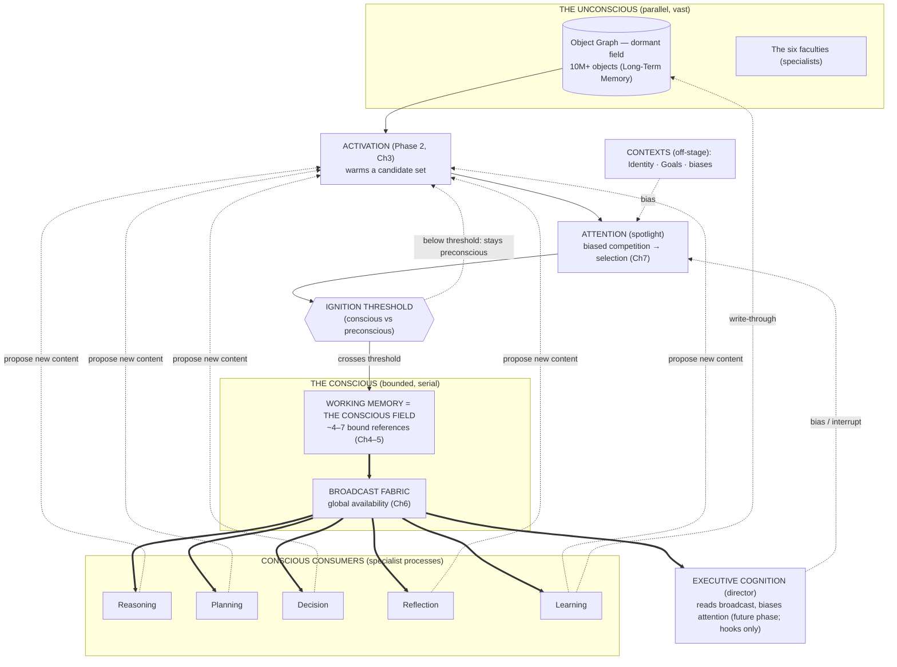
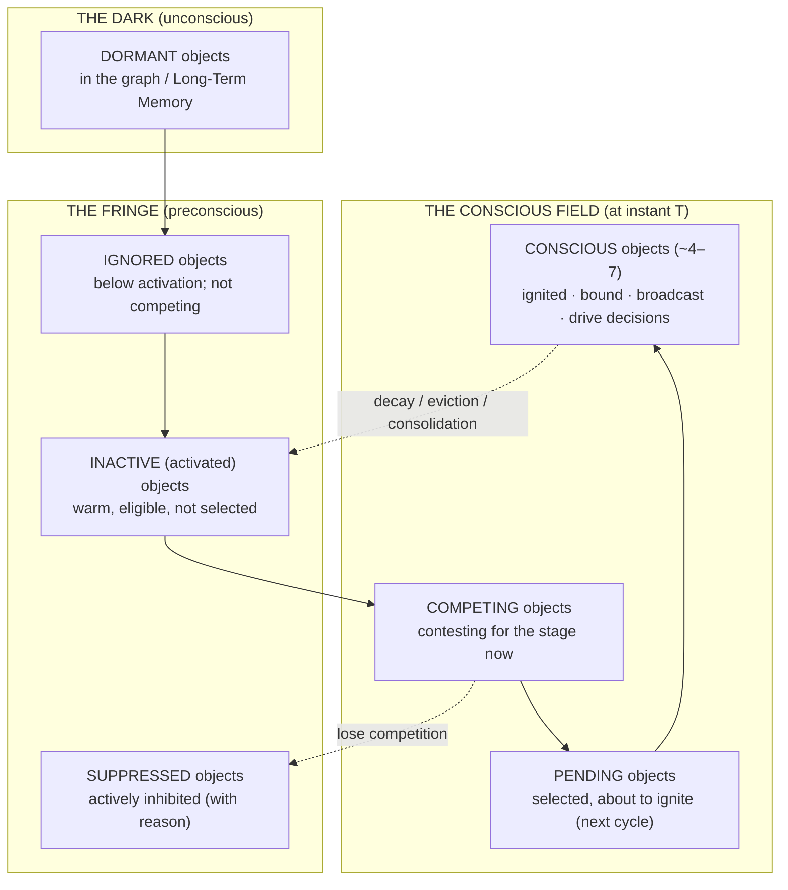
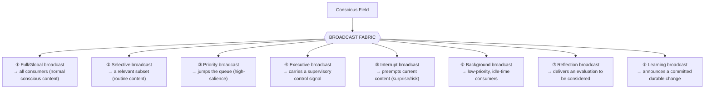
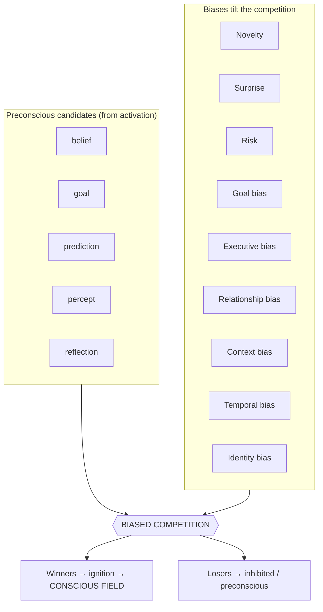
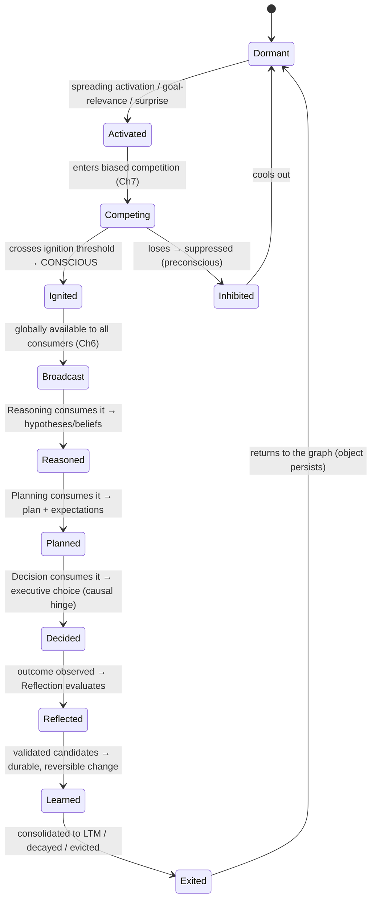
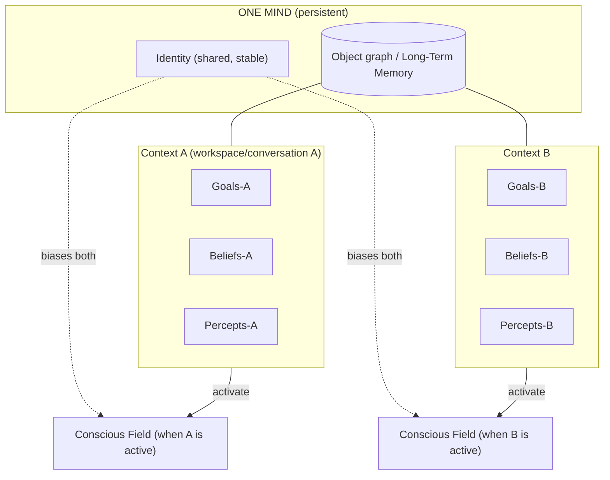
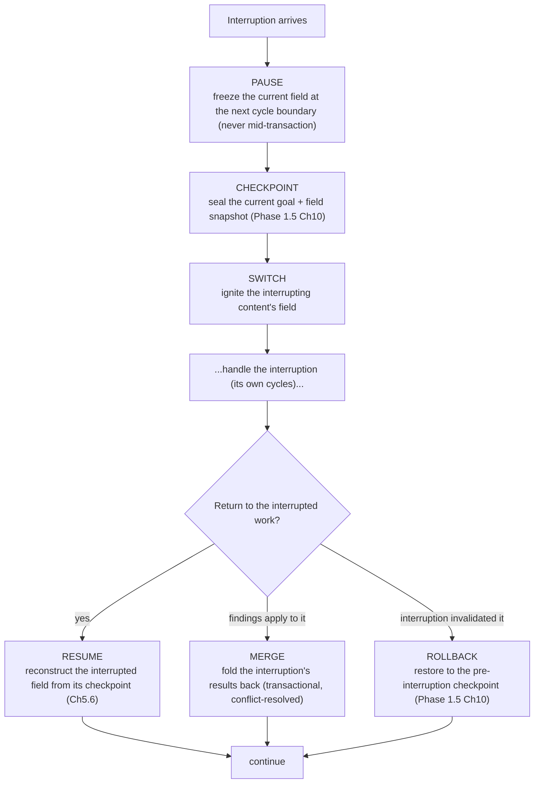
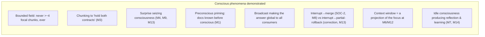

# UnityWorks Cognitive Intelligence Platform

## Phase 2.5 — The Global Workspace Architecture

> **The Conscious Mind of UnityWorks**

| | |
|---|---|
| **Phase** | 2.5 — Global Workspace Architecture |
| **Predecessors** | Phase 0 (Philosophy) · Phase 1 (State) · Phase 1.5 (Object Model) · Phase 2 (Runtime) |
| **Status** | Research-grade architectural specification. No code, no APIs, no schemas, no classes, no implementation. |
| **Register** | Written as a dissertation: *why* precedes *how*; every decision is grounded in neuroscience, cognitive psychology, computer science, operating systems, and distributed systems; every rejected alternative is named. |
| **Scope of "consciousness"** | This document concerns **access consciousness** (Block) / **functional/global availability** (Baars, Dehaene) — the engineering property by which information becomes globally available, integrated, and reportable across the system. It makes **no claim about phenomenal experience or qualia.** Every use of "conscious," "aware," and "experience" below is functional. This scoping is itself an architectural decision (see §1.9). |

This document inherits, without restatement: **P1–P12** (Phase 0), the ten **Regions R1–R10** and the
**confidence currency** (Phase 1), the twelve object kinds, the **Object Laws OL1–OL9**, and the eleven
**relationship types** (Phase 1.5), and the runtime services, the **cognitive cycle**, the **transaction
engine**, the **Cognitive Clock**, and the **Runtime Laws RL1–RL8** (Phase 2). Where Phase 2 specified
*how cognition executes*, this phase specifies *what, out of millions of candidates, becomes the single
conscious content that cognition executes upon.*

---

## Prologue — The division of labor across the phases

A reader arriving at Phase 2.5 must hold a precise mental model of what each prior phase settled, because
this phase is defined by contrast with all of them:

| Phase | Object | The question it answers |
|---|---|---|
| 0 | The mind above the faculties | **Why** a mind exists |
| 1 | The Cognitive State (kernel) | **What** the mind is |
| 1.5 | The Cognitive Object Model | **Which entities** compose it |
| 2 | The Cognitive Runtime | **How** it executes, cycle by cycle |
| **2.5** | **The Global Workspace** | **What becomes conscious** — how millions of objects collapse into one integrated thought |

Phase 2 built an engine that can advance a *coalition* of objects around a cycle. But it deferred the
deepest question: *of the millions of living-capable objects, which few form the coalition — and why so
few?* That is the subject of this document. The runtime is the body's metabolism; the Global Workspace is
its **consciousness** — the narrow, luminous stage on which the mind's single train of thought actually
happens.

---

## Table of Contents

1. The Philosophy of Consciousness
2. Global Workspace Theory — the scientific foundations
3. The Global Workspace Model — the architecture
4. The Conscious Field
5. Working Memory — the definitive specification
6. The Broadcast Fabric
7. Attention Inside the Workspace (after activation)
8. The Cognitive Broadcast Lifecycle
9. Multi-Conversation Consciousness
10. Interruptions
11. Conscious Experience — a complete walkthrough
12. The Laws of Consciousness
13. Future Evolution
- Appendix A — Consistency map to prior phases
- Appendix B — The access/phenomenal scoping, defended

---
---

# CHAPTER 1 — THE PHILOSOPHY OF CONSCIOUSNESS

## 1.1 Why a runtime alone cannot think

The Phase 2 runtime is a magnificent parallel substrate: millions of objects, each living-capable, each
able to spread activation, compete, and be mutated inside transactions. And yet a runtime *by itself* can
no more think than a brainstem can compose a sonnet. The reason is structural, and it is the founding
insight of Global Workspace Theory.

A mind is **massively modular and massively parallel**. Beliefs settle in one region, predictions in
another, goals in a third; the six faculties compute independently. This parallelism is essential — it is
what makes the mind fast and rich. But parallelism creates a **coordination catastrophe**: if every
specialist acts on its own local view, the mind has no single interpretation of its situation, no unified
decision, no coherent train of thought. It has a committee of thousands all speaking at once. That is not
thought; it is noise (the "seizure" of Phase 2, §1.1, seen now from the inside).

Thought requires that, at each moment, the parallel chorus resolve into **one integrated content that is
made available to every specialist at once.** Reasoning must act on the *same* interpretation that
Planning acts on, which is the *same* one Reflection will later evaluate. This shared, integrated,
globally-broadcast content is what we call the **conscious content**, and the stage that produces it is
the **Global Workspace**.

So the runtime *executes* cognition, but it cannot *unify* it. Unification — the collapse of parallel
possibility into a single coherent, broadcast, actionable thought — is the exclusive work of the Global
Workspace. A runtime without a workspace is a brain without consciousness: enormous unconscious
competence, zero coherent experience, no flexible novel combination, no serial deliberate decision.

## 1.2 Why cognition requires consciousness (functionally defined)

We must be exact about what "consciousness" *buys* the architecture, in purely functional terms. It buys
four capacities that unconscious parallel processing structurally cannot provide:

| Functional property | What it provides | Why unconscious processing cannot supply it |
|---|---|---|
| **Global availability** | The current content is available to *all* specialists simultaneously | Local specialists see only their own inputs; nothing makes a datum universally usable |
| **Integration (binding)** | A single, coherent interpretation binding beliefs, goals, predictions | Parallel modules produce fragments; something must fuse them into one |
| **Serial coherence** | One decision at a time, from one interpretation | Parallel decisions conflict; a serial bottleneck yields a single line of action |
| **Reportability** | The content can be reflected upon, explained, learned from | Unreported processing leaves no trace the executive can evaluate |

These four are the *engineering definition of consciousness* used throughout this document (access
consciousness, Block 1995; global availability, Baars 1988; Dehaene 2014). They are requirements, not
mysticism, and they are exactly what a UnityWorks that must *decide, explain, and improve* cannot do
without.

## 1.3 The eight concepts — and why none may be merged

The most common architectural error is to collapse these concepts. Each is distinct; each has a distinct
neuroscientific correlate; merging any two destroys a capacity the mind requires.

| Concept | What it is | Neural correlate (illustrative) | Merging it away destroys… |
|---|---|---|---|
| **Runtime** | The always-on parallel execution substrate (Phase 2) | Global cortical + subcortical processing | …the parallel richness that feeds consciousness |
| **Attention** | The competitive *selection* of what wins the stage | Fronto-parietal priority maps; biased competition | …the ability to choose; everything or nothing becomes conscious |
| **Working Memory** | The bounded *active maintenance* of the selected references | Sustained prefrontal activity; activated LTM (Cowan) | …the persistence of a thought across cycles |
| **Global Workspace** | The *stage + broadcast* that makes the selected content global | Fronto-parietal "ignition" network (Dehaene) | …integration and global availability |
| **Consciousness** | The *property* of content that is currently broadcast on the stage | The ignited, broadcast state itself | …the distinction between what the mind is thinking and what it merely stores |
| **Executive Cognition** | The *supervisor* that reads the broadcast and regulates it | Prefrontal supervisory system (Norman–Shallice) | …self-regulation, deliberate control, escalation |
| **Long-Term Memory** | The vast *dormant* store (the graph + Knowledge faculty) | Cortical/hippocampal storage | …the backing store; the mind could hold only 4–7 things total |
| **Identity** | The stable *self* that persists beneath all contents | Default-mode / self-model networks | …continuity of the subject across every thought |

The load-bearing separations:

- **Attention ≠ Consciousness.** Attention is the *process of selection*; consciousness is the *state of
  the selected*. One can bias attention (top-down) without anything yet being conscious; ignition is a
  separate, threshold event (Dehaene's preconscious vs conscious distinction).
- **Working Memory ≠ Global Workspace.** Working Memory is the *maintained set of references*; the Global
  Workspace is the *broadcast that makes those references globally available*. WM is the working set; the
  Workspace is the publication of it. (This is subtle and is developed fully in Chapters 5–6.)
- **Working Memory ≠ Long-Term Memory.** WM is *activation*, not storage — the definitive point of
  Chapter 5. Merging them yields either an amnesiac mind (only 4–7 facts ever) or an incoherent one (all
  10 million "in mind" at once).
- **Executive ≠ Consciousness.** The executive is not a homunculus *watching* the stage; it is a process
  that *reads the broadcast and issues control*. Merging them re-introduces the infinite regress of "who
  watches the watcher" (Attention Schema Theory's dissolution of the homunculus, §2).

## 1.4 The theatre — the governing metaphor, stated once

Baars' theatre metaphor organizes the whole architecture:

```mermaid
flowchart TB
    subgraph THEATRE["THE THEATRE OF CONSCIOUSNESS"]
      SPOT["SPOTLIGHT = Attention<br/>(selects what is lit)"]
      STAGE["STAGE = Conscious Field / Working Memory<br/>(bounded: only a few actors fit)"]
      SPOT --> STAGE
    end
    STAGE ==>|BROADCAST (ignition)| AUD["THE AUDIENCE = all specialist processes<br/>faculties + dormant objects (unconscious)"]
    CTX["UNCONSCIOUS CONTEXTS<br/>Identity · Goals · biases<br/>(shape what gets lit, off-stage)"] -.-> SPOT
    DIR["THE DIRECTOR = Executive Cognition<br/>(reads the broadcast, redirects the spotlight)"] -.-> SPOT
    AUD -.->|propose new content| SPOT
```

- The **stage** is small — not by accident but by design (§1.5).
- The **spotlight** is attention; only what it illuminates becomes conscious.
- The **broadcast** to the **audience** (all unconscious specialists) is what *makes* the lit content
  conscious — visibility to all is the definition, not a consequence, of consciousness here.
- **Contexts** (Identity, Goals) shape the spotlight from off-stage — they are powerful but *not
  themselves on stage*; this is why identity and goals influence every conscious thought without being
  consciously entertained at every moment.
- The **director** (executive) is not in the audience watching a little screen; it works the spotlight.

## 1.5 Why consciousness is bounded — the answer to the fundamental question

*10 million knowledge objects, 300 goals, thousands of beliefs — yet only ~4–7 conscious at once. Why?*

The bound is **not a limitation to be engineered away; it is the mechanism that produces coherent
thought.** Six independent forces each require a small stage, and together they make boundedness a law
(Chapter 12, CL1):

1. **Integration cost is superlinear.** Binding *n* items into one coherent interpretation requires
   relating them pairwise (and worse); coherence-checking cost grows faster than *n*. A large stage cannot
   be *integrated* in bounded time — it fragments. Small stage ⇒ integrable stage.
2. **Broadcast is only meaningful if it is selective.** The point of consciousness is *global
   availability of the important thing*. Broadcasting everything is broadcasting nothing — the audience
   cannot act on a firehose. Scarcity of the stage *is* the signal.
3. **Serial decision requires a single interpretation.** One coherent action demands one integrated
   content. Many simultaneous contents ⇒ many conflicting actions ⇒ no decision.
4. **Interference grows with capacity.** More simultaneous items ⇒ more crosstalk and mutual masking
   (the empirical basis of working-memory capacity limits; Cowan). A small focus is a *clean* focus.
5. **Metabolic / compute economy.** Sustained active maintenance and global broadcast are the most
   expensive operations the mind performs (Dehaene's ignition is metabolically costly). Evolution — and
   any resource-bounded engineer — prices the stage small.
6. **Attention is a control signal, and control signals must be low-dimensional.** A controller that
   tracks thousands of variables cannot act decisively; the executive can only *steer* a few things at
   once (Attention Schema Theory: awareness is a *simplified model* of attention precisely so it can be
   used for control).

The empirical constant — Cowan's **focus of attention ≈ 4 chunks**, extendable to ~7 by chunking (Miller)
— is therefore not arbitrary; it is where these six pressures balance. UnityWorks treats capacity as a
**principled, tunable design parameter centered on this range** (Chapter 4–5), never as a magic number
and never as unbounded.

So the answer to the fundamental question is: *the mind can only think about a few things at once because
thinking **is** integrating a few things into one broadcast coherent content, and integration, broadcast,
serial decision, interference, economy, and control all break down if the few becomes many.* The 10
million objects are not gone — they are the vast unconscious audience and backing store (Chapter 4,
Long-Term Memory), any of which can be summoned onto the stage, but only a few at a time.

## 1.6 Why the runtime and the workspace cannot be merged

One might ask: since the runtime already selects a coalition (Phase 2, Chapter 4), why is the Global
Workspace a separate architecture? Because they answer different questions and obey different laws. The
runtime is *parallel, continuous, and resource-oriented* (it keeps the mind metabolizing). The Workspace
is *serial, integrative, and coherence-oriented* (it produces the single conscious content). Merging them
would force the parallel substrate to be serial (destroying its richness) or the conscious stage to be
parallel (destroying its coherence). They are the two complementary halves of cognition — the parallel
unconscious and the serial conscious — and the entire tradition from Baars to Dehaene insists they remain
distinct. UnityWorks does likewise.

## 1.7 The neuroscience, consolidated

- **Global Workspace (Baars):** consciousness is a *global broadcast* from a limited-capacity workspace to
  a vast array of unconscious specialists; its function is *integration and dissemination*.
- **Global Neuronal Workspace (Dehaene, Changeux):** conscious access is a nonlinear **ignition** —
  a threshold-crossing amplification that broadcasts content across long-range fronto-parietal networks;
  below threshold, processing is preconscious/subliminal.
- **Working memory (Baddeley; Cowan):** a limited-capacity system for *active maintenance and
  manipulation* — a central executive plus specialized buffers (Baddeley), or an *activated subset of
  long-term memory with a ~4-item focus of attention* (Cowan). WM is process, not a store.
- **Predictive processing (Friston):** attention is *precision-weighting* of prediction errors; conscious
  content is the current *best hypothesis*. This grounds why surprise and precision drive what becomes
  conscious.
- **Supervisory Attentional System (Norman–Shallice):** routine behavior runs by schemas competing
  automatically (*contention scheduling*); novel/risky situations require a *supervisory* executive. This
  grounds the executive/automatic split.
- **Attention Schema Theory (Graziano):** the brain builds a simplified *model of its own attention*; that
  model is "awareness," useful for controlling one's own attention and modeling others'. This grounds the
  executive-as-model (not homunculus) and the future social/multi-agent extension.

## 1.8 The claim of this chapter

A runtime gives UnityWorks unconscious competence. The Global Workspace gives it a **conscious mind**: a
bounded, integrated, broadcast stage on which — out of millions of objects — a single coherent thought
forms, is made available to all, drives one decision, and is then evaluated and learned from. Everything
that follows specifies that stage.

## 1.9 A note on responsible scoping (why "access," not "phenomenal")

We deliberately adopt **access consciousness** (global availability, integration, reportability) and make
**no claim about phenomenal consciousness** (subjective experience, qualia). This is both intellectually
honest and architecturally sufficient: every capability UnityWorks needs — coherent decision, explanation,
reflection, learning — is a function of *access*, not of phenomenality. Theories centered on phenomenal
experience (e.g., Integrated Information Theory's *phi*) are noted in Chapter 2 but **rejected as the
architectural basis**, because they are not engineering-actionable and answer a question UnityWorks does
not need to ask. When this document says the mind is "conscious of X," it means precisely "X is currently
the integrated content broadcast globally across the system" — nothing more, and nothing less.

---
---

# CHAPTER 2 — GLOBAL WORKSPACE THEORY: THE SCIENTIFIC FOUNDATIONS

This chapter surveys the theories UnityWorks draws upon, states precisely **which ideas are adopted, which
are rejected, and why.** A dissertation earns its architecture by showing it chose deliberately among
live scientific alternatives.

## 2.1 The theories in brief

| Theory | Core claim | Primary contribution |
|---|---|---|
| **Baars — Global Workspace (GWT)** | Consciousness = limited-capacity global broadcast to unconscious specialists | The *architecture* of a conscious mind |
| **Dehaene — Global Neuronal Workspace (GNW)** | Conscious access = nonlinear *ignition* + long-range broadcast; below threshold = preconscious | The *threshold/ignition* mechanism; conscious vs preconscious |
| **Friston — Predictive Processing** | Brain minimizes prediction error; attention = precision-weighting; content = best hypothesis | *Why* surprise/precision drive consciousness |
| **Baddeley — Working Memory model** | Multi-component WM: central executive + phonological loop + visuospatial sketchpad + episodic buffer | WM as *active manipulation* with modality buffers |
| **Cowan — Embedded processes** | WM = activated LTM + a ~4-item focus of attention | WM as *activation*, capacity ≈ 4 |
| **ACT-R (Anderson)** | Modular buffers (one chunk each); production matching; declarative memory with spreading activation + base-level decay | *Spreading activation, decay, buffer bottleneck* |
| **SOAR (Newell, Laird)** | WM as an object graph; operators; decision cycle; *impasse-driven* subgoaling; chunking = learning | *Impasse-driven deliberation, WM-as-graph* |
| **Connectionism / PDP** | Distributed representations settle by parallel competition; *no central executive* | *Biased competition, graceful settling* |
| **Executive Control (Norman–Shallice)** | Routine = contention scheduling among schemas; novel = Supervisory Attentional System | *Automatic vs supervised* control split |
| **Attention Schema Theory (Graziano)** | The brain models its own attention; that model = awareness | *Executive as self-model*; social/other-modeling |
| **Integrated Information Theory (Tononi)** | Consciousness = integrated information (*phi*) | Emphasizes *integration* (but phenomenal-centric) |

## 2.2 What UnityWorks adopts — and exactly why

- **From GWT + GNW — the whole spine.** The Global Workspace *is* a bounded stage whose contents are
  broadcast to all specialists, and entry is a **threshold ignition** event, not a gradual fade. *Why:*
  this is the only theory family that explains integration + global availability + the conscious/
  preconscious distinction, which are precisely UnityWorks' four functional requirements (§1.2). Ignition
  maps directly to our **Broadcast** (Chapter 6): sub-threshold candidates are *activated but not
  conscious*; crossing threshold *ignites* a global broadcast.
- **From Predictive Processing — precision as the currency of attention.** Surprise (prediction error) and
  precision (confidence) are primary drivers of what becomes conscious (Chapter 7). *Why:* it unifies our
  confidence currency (Phase 1, Ch6), our surprise-driven preemption (Phase 2, Ch4), and attentional
  selection under one principle.
- **From Cowan — WM as *activated LTM + a small focus*, capacity ≈ 4.** *Why:* it correctly frames Working
  Memory as *activation of the one graph*, not a separate store — exactly our OL7/OL1 stance
  (references, single responsibility). It gives a principled capacity center.
- **From Baddeley — the episodic buffer and modality buffers, as a *pattern* for multi-modal binding.**
  *Why:* it tells us how a conscious field binds content from different modalities (text, vision, voice)
  into one episode — the basis of Chapter 13's multi-modal extension.
- **From ACT-R — spreading activation + base-level decay + buffer bottleneck.** *Why:* it is the mechanism
  by which the dormant field warms and cools (Phase 2, Ch3) and why the conscious buffer is a bottleneck.
- **From SOAR — WM as a graph + impasse-driven deliberation.** *Why:* our WM *is* a bounded active view of
  the object graph, and impasses are exactly our reasoning-triggered goal splitting (Phase 1.5, Ch2/§3.5).
- **From biased competition (connectionism) — selection by top-down-biased competition.** *Why:* it is our
  attention mechanism (Chapter 7): candidates compete; goals/executive bias the competition.
- **From Norman–Shallice — the routine/supervised split.** *Why:* it justifies why most cognition runs
  automatically (contention scheduling ≈ our scheduler over routine coalitions) while novel/risky content
  invokes the executive (Chapter 10 interrupts; Phase 2, Ch11 hooks).
- **From Attention Schema Theory — the executive as a *model of attention*, not a homunculus.** *Why:* it
  dissolves the infinite-regress problem and, crucially, provides the bridge to *modeling other agents'
  attention* — the foundation of multi-agent consciousness (Chapter 13).
- **From IIT — the *insight* that integration is essential** (but not its metaphysics). *Why:* integration
  is one of our four functional requirements; we keep the insight, discard the phi-centric measure.

## 2.3 What UnityWorks rejects — and exactly why

| Rejected idea | Why rejected | Which law it would violate |
|---|---|---|
| **Pure connectionism with no central workspace** | Without a broadcast stage there is no global availability, no serial decision, no reportability — only parallel settling. It cannot *report* or *reflect*. | CL2 (everything conscious is broadcast) |
| **A homunculus executive** ("someone watches the stage") | Infinite regress; and it hides the mechanism. The executive must be a *process reading the broadcast* (AST), not a viewer. | CL9 (executive reads the broadcast like any consumer) |
| **IIT's phenomenal/phi basis** | Not engineering-actionable; answers "is there subjective experience?", a question UnityWorks does not need. We target *access*, not phenomenality (§1.9). | Scope (Appendix B) |
| **Miller's 7±2 as a hard constant** | Empirically it is chunk-dependent; hard-coding a number is brittle. We adopt Cowan's ~4 focus + chunking as a *principled, tunable* basis. | CL1 (bounded — but by principle, not by magic number) |
| **Unlimited / "just use a huge context window" workspace** | Equating consciousness with a large LLM context destroys integration, coherence, and selectivity (the firehose problem, §1.5). The context window is a *substrate*, not the workspace (Chapter 5). | CL1, CL5 |
| **Baddeley's strict modality separation as the *only* structure** | Useful as a pattern, but a rigid modality split cannot represent amodal beliefs/goals that dominate UnityWorks; we keep the episodic-buffer *binding* idea and generalize it. | CL3 (one integrated field) |
| **"Consciousness is just the scheduler's current coalition"** (collapsing Phase 2 into 2.5) | Selection ≠ ignition ≠ broadcast; a coalition is not conscious until integrated and broadcast. Collapsing them loses the conscious/preconscious distinction. | §1.6; CL2 |

## 2.4 The synthesis UnityWorks commits to

UnityWorks' Global Workspace is: *a bounded stage (**Cowan** capacity) whose entry is a threshold
**ignition** (**Dehaene**) that **broadcasts** (**Baars**) a single **integrated** (**IIT insight**) best
hypothesis (**Friston**) selected by top-down-biased **competition** (**connectionism/Desimone**) over an
**activated subset of the object graph** (**ACT-R/SOAR**), read and regulated by an executive that is a
**model of attention** (**Graziano**), with routine coalitions handled automatically and novel ones
supervised (**Norman–Shallice**).* Every subsequent chapter is a detailing of this one sentence.

---
---

# CHAPTER 3 — THE GLOBAL WORKSPACE MODEL (THE ARCHITECTURE)

## 3.1 The components and their arrangement



## 3.2 Component-by-component

For each: **responsibility · inputs · outputs · boundary (what it must never do).**

**A. Activation (inherited, Phase 2, Ch3).**
- *Responsibility:* warm a candidate set from the dormant graph (spreading activation, decay).
- *Boundary:* it makes objects *eligible*, never *conscious*. Activation is preconscious.

**B. Attention — the spotlight (Chapter 7).**
- *Responsibility:* run biased competition over the *activated candidates* and select the coalition that
  will attempt ignition.
- *Inputs:* activated candidates; contextual biases (Identity, Goals, executive).
- *Outputs:* a selected coalition + an inhibition set.
- *Boundary:* it selects; it does not integrate or broadcast (those are C and D). Selection ≠ consciousness.

**C. Ignition Threshold — the conscious/preconscious boundary.**
- *Responsibility:* the nonlinear, all-or-none event by which a selected coalition crosses into
  consciousness. Below threshold, content is *preconscious* (selected but not broadcast — it can influence
  but cannot drive a conscious decision).
- *Why a threshold, not a fade:* Dehaene's ignition — a graded fade would blur the conscious/unconscious
  line and destroy reportability and serial coherence. Consciousness is discrete by design (CL13).

**D. Working Memory = the Conscious Field (Chapters 4–5).**
- *Responsibility:* hold, bind, and actively maintain the ~4–7 ignited references as one integrated
  content.
- *Boundary:* references only (OL7); bounded (CL1); it stores nothing durably (it is not memory).

**E. Broadcast Fabric (Chapter 6).**
- *Responsibility:* make the Conscious Field globally available to all consumers and the executive.
- *Boundary:* it disseminates; it never duplicates objects or mutates them (CL7).

**F. Conscious consumers — Reasoning, Planning, Decision, Reflection, Learning.**
- *Responsibility:* each reads the broadcast and contributes (a hypothesis, a plan, a choice, a critique,
  a durable change). Their contributions re-enter as new *activated candidates* (the loop).
- *Boundary:* they may act only on *conscious* content (CL4) — an unbroadcast object cannot drive them.

**G. Executive Cognition — the director (hooks now, supervisor later).**
- *Responsibility:* read the broadcast and *bias attention* / interrupt (Chapter 10; Phase 2, Ch11 hooks).
- *Boundary:* it is a consumer + a biaser, not a homunculus and not a bypass — it too works through
  attention and broadcast.

**H. Contexts — Identity & Goals (off-stage).**
- *Responsibility:* bias the spotlight continuously without themselves occupying the stage.
- *Why off-stage:* they are too stable and pervasive to be "thought about" every cycle, yet they shape
  every thought — the architectural expression of "identity influences every decision" (Phase 1, Ch4).

## 3.3 The lifecycle boundaries (where one component's authority ends)

The single most important architectural discipline: **each arrow in §3.1 is a one-way authority
boundary.** Activation may not select; attention may not broadcast; the fabric may not integrate;
consumers may not bypass the fabric to read dormant objects. This strict layering is what keeps
"conscious" a meaningful, defensible property rather than a vague adjective — and it is enforced by the
Laws of Chapter 12.

---
---

# CHAPTER 4 — THE CONSCIOUS FIELD

## 4.1 Definition

The **Conscious Field** is the complete content of the Global Workspace at a single logical instant
(Phase 2, Ch8 logical time): the bounded set of ignited, bound, broadcast references that constitute *what
the mind is thinking right now*. It is realized *by* Working Memory (Chapter 5) but is defined *here* by
its membership semantics — the gradations of how present an object is to consciousness.

## 4.2 The gradient of presence

Consciousness is not binary at the level of the whole graph; it is a **gradient of presence**, with a
sharp threshold at the conscious boundary. Baars' "fringe" and Dehaene's preconscious both appear here:



| Presence state | Meaning | Can it drive a decision? | Can it influence? |
|---|---|---|---|
| **Conscious** | Ignited, bound, broadcast | **Yes** (only these can — CL4) | Yes |
| **Pending** | Selected; ignition imminent | Not yet | Weakly (priming) |
| **Competing** | Contesting for a stage slot now | No | Via the competition |
| **Inactive (activated)** | Warm and eligible, not selected | No | Yes — *preconscious priming* |
| **Suppressed** | Actively inhibited (with recorded reason) | No | Negatively (kept out) |
| **Ignored** | Below activation; not competing | No | No |
| **Dormant** | In the graph; Long-Term Memory | No | No (until activated) |

The crucial neuroscience: **preconscious (Inactive/Competing) objects still influence cognition** (they
bias, prime, and can win the *next* competition) but they **cannot themselves drive an executive
decision** — only conscious objects can (Dehaene's distinction; our CL4). This is why the mind can be
subtly steered by things it is not (yet) thinking about, while its *decisions* remain grounded only in
what it *is* thinking about — a property essential for both capability and auditability.

## 4.3 How objects enter, remain, and leave

- **Enter:** a dormant object is *activated* (spreading activation / goal-relevance / surprise) → becomes a
  *competing* candidate → wins the biased competition (Chapter 7) → crosses the *ignition threshold* →
  becomes *conscious* and is *bound* into the field.
- **Remain:** it stays conscious only while it keeps winning re-selection each cycle (sustained
  activation) or is *pinned* (the active goal and safety constraints are pinned — Phase 1, §7.3). Absent
  refreshment, it decays.
- **Leave:** by **decay** (activation fades), **eviction** (a stronger competitor takes its slot), or
  **consolidation** (on episode close, salient content is promoted to Long-Term Memory / Knowledge and the
  reference leaves the stage). Every conscious object has an exit (CL10) — nothing is trapped on stage
  forever.

## 4.4 Capacity — why it can never be infinite

The field's capacity is bounded to the Cowan-centered range (~4 focal, extensible toward ~7 via chunking)
for the six reasons of §1.5. Two consequences the architecture depends on:

1. **Chunking is the only way to "hold more."** The mind expands effective capacity not by enlarging the
   field but by *binding several objects into one chunk* (a compound belief, a summarized goal-tree) that
   occupies a single slot. Chunking is the conscious field's compression, and it is a first-class
   operation (a bound coalition presented as one reference).
2. **Overflow forces a choice, always.** When more than capacity competes, something *must* be evicted or
   suppressed — the field cannot grow to accommodate. This forced choice is not a failure; it is the
   mechanism of focus (CL1). A mind that could hold everything would decide nothing.

## 4.5 Edge cases

Empty field (deep idle — the mind rests, watching for triggers; Phase 2, Ch4.6); field thrash (rapid
eviction/re-entry — damped by inertia and minimum dwell, Phase 2, Ch4); a suppressed object that keeps
demanding entry (repeated suppression is logged; if it is high-value, the executive may re-evaluate the
suppression — the mind notices what it keeps pushing away); binding failure (two conscious objects that
cannot be coherently integrated — this *is* a detected contradiction and routes to arbitration, Chapter
7 of Phase 2).

---
---

# CHAPTER 5 — WORKING MEMORY: THE DEFINITIVE SPECIFICATION

> This chapter is intended to be the permanent, definitive account of Working Memory in UnityWorks. It
> resolves the single most common and most damaging confusion in cognitive-AI architecture.

## 5.1 What Working Memory really is

Working Memory is **the active maintenance and binding of a bounded set of references that constitute the
current Conscious Field.** It is a *process and a state of activation*, realized as the workspace's held
set — not a container of content. It is the mind's "what I am holding in mind right now," and it is
defined by three properties, each of which must be held simultaneously:

1. **Active:** its contents are *sustained by continuous activation*; stop refreshing them and they fade
   (Cowan). It is effortful.
2. **Bounded:** ~4–7 chunks (Chapter 4).
3. **Referential:** it holds *references* into the object graph, never copies (OL7).

## 5.2 Why Working Memory is NOT memory

This is the definitional crux. "Memory" connotes *storage* — a place where information persists so it can
be retrieved later. **Working Memory stores nothing.** It is the *activation* of things stored elsewhere.
Nothing is "saved to" Working Memory; objects are *brought into activation* within it and *fall out of
activation* from it. When a thought leaves Working Memory, it is not "deleted" — the *object* persists in
the graph (Long-Term Memory); only its *activation* ceased.

The analogy: Working Memory is to the object graph what a **spotlight** is to a **stage full of actors**.
The spotlight "contains" no actors; it *illuminates* a few. Turning the spotlight off does not remove the
actors; it merely stops illuminating them. Calling Working Memory a "memory" is like calling the spotlight
a "closet where actors are kept." The category error has enormous architectural consequences: it leads
engineers to *persist* Working Memory (wrong — you persist the *graph* and *reconstruct* activation), to
*grow* it (wrong — it is bounded by principle), and to *duplicate* content into it (wrong — it holds
references, OL7).

## 5.3 The definitive distinction table

Every concept Working Memory is routinely confused with, and the exact difference:

| Concept | What it is | Persistence | Capacity | Owns content? | Relation to WM |
|---|---|---|---|---|---|
| **Knowledge** | Objective, shared, durable facts (faculty) | Permanent | Vast | Yes (system of record) | WM *references* it when activated |
| **Beliefs** | Subjective, revisable propositions (objects) | Until revised/decayed | Many | Yes (their own state) | WM *references* active beliefs |
| **Workspace (the platform)** | External world state — files, repos | External | — | The world owns it | WM holds a *handle*, not the files |
| **Conversation** | Raw turn transcript of one channel | Session (e.g., 24h) | Bounded log | Yes (the transcript) | WM references *interpreted meaning*, not turns |
| **Working Memory** | Active maintenance of ~4–7 bound references | **Volatile (activation)** | **~4–7 chunks** | **No — references only** | *is itself* |
| **Activation** | The graded energy warming objects (Phase 2, Ch3) | Decays | Broad (thousands) | No | WM is the *focus* of activation; activation is the broader field |
| **Attention** | The competitive selection process (Chapter 7) | Per cycle | Selects a few | No | Attention *chooses* what enters WM |
| **Reasoning Context** | The set of premises a reasoning step operates on | Per step | Small | No | A *use* of WM's contents by a consumer |
| **Context Window / LLM Context** | The token buffer of a generation faculty | Per invocation | Large but finite tokens | No (a substrate) | A *serialization mechanism* by which WM is presented to the Generation faculty — **not** WM itself (§5.4) |

## 5.4 Working Memory versus the LLM Context Window — the essential separation

Because a generation faculty is realized with a context window, engineers fatally equate the two. They are
not the same, and conflating them destroys the architecture:

- **Ontology.** Working Memory is a *cognitive construct* (bounded focus of goal-relevant references,
  defined by activation and binding). The context window is an *implementation substrate* (a token buffer
  the Generation faculty consumes on one invocation).
- **Capacity.** Working Memory is bounded to ~4–7 *chunks* by cognitive principle (§1.5). A context window
  is bounded to *tokens* by an engineering limit. A large context window does **not** enlarge Working
  Memory — pouring 200k tokens at a faculty is the firehose (§1.5, item 2), not a bigger mind.
- **Direction of causation.** The runtime *renders* the Conscious Field into whatever substrate the
  Generation faculty needs *when it invokes that faculty* — the context window is a *transient projection
  of Working Memory for one faculty call*, discarded after. Working Memory persists across faculty calls
  and across faculties (it is amodal and faculty-independent); the context window does not.
- **Independence (P1/RL6).** Working Memory must be definable with *no* generation faculty present at all
  (a mind can hold a thought without speaking). Tying it to a vendor's context window would violate
  technology independence and the mind/faculty boundary.

**The rule (CL8, applied):** *Working Memory owns references and holds a bounded focus; the context window
is one disposable rendering of that focus for one faculty invocation. Never persist the context window as
if it were Working Memory; never treat context-window size as cognitive capacity.*

## 5.5 The internal structure of Working Memory

Following Cowan (focus + activated periphery) and Baddeley (an executive + a binding buffer), Working
Memory has three zones — but every element is a *reference with activation*, never stored content:

| Zone | What it holds | Capacity | Role |
|---|---|---|---|
| **Focus** | The ~4 chunks currently in consciousness | ~4 | The content decisions are made on |
| **Activated periphery** | Preconscious references, primed, ready to enter | ~a few more | The "fringe"; source of the next focus |
| **Binding buffer** | The integration of the focus into one coherent content (chunk formation, multi-modal binding) | 1 integrated content | Produces the *single* conscious content (Baddeley's episodic buffer) |

## 5.6 Working Memory lifecycle (the twelve properties, specified)

- **Lifecycle:** instantiated at *episode open* (a cognitive frame); populated by attention + recall;
  mutated by consumers each cycle; consolidated or cleared at *episode close* (Phase 1, Ch7).
- **Capacity:** bounded to the Cowan-centered range; overflow forces eviction (never growth) — §4.4.
- **Replacement:** lowest-activation focus element is evicted when a stronger competitor ignites; evicted
  references cool to the periphery, then dormant (they are *not* deleted — the object persists).
- **Decay:** activation of held references decays each logical step unless refreshed (goal-relevance,
  re-attention). Decay is what makes room without explicit deletion.
- **Persistence:** **Working Memory itself is not persisted** — the *object graph* and the *Ledger* are
  persisted (Phase 2). What is "saved" at a checkpoint is the *graph state*, from which Working Memory's
  activation is *reconstructable*.
- **Reconstruction:** on resumption (after suspension/crash/context-switch), Working Memory is *rebuilt*
  by re-activating the goal and re-recalling its focus from the graph — not restored as a blob. The mind
  "remembers what it was thinking" by *re-thinking it from its persistent goal + graph*, exactly as a
  person resumes an interrupted task by recalling the goal.
- **Synchronization:** across concurrent cognitive threads/agents, each has its *own* Working Memory
  (its own focus); shared understanding is achieved by *broadcast* (Chapter 6) and shared Knowledge, never
  by sharing one Working Memory (which would violate serial coherence).
- **Recovery:** because it is reconstructable, Working-Memory loss is never catastrophic — the mind
  rebuilds it from durable state (RL8 replayability).
- **Ownership:** Working Memory belongs to *one* cognitive thread under *one* Identity/principal; another
  agent cannot read or write it directly (privacy + coherence).
- **Confidence:** each held reference carries its confidence (Phase 1, Ch6); the *field* has an aggregate
  confidence that gates decision autonomy.
- **Snapshots:** a Working-Memory snapshot is a *labeled reference set at a logical instant* (part of a
  Checkpoint, Phase 1.5, Ch10) — used for reflection ("what was I thinking when I decided that?"),
  reconstruction, and branching.
- **Evolution:** the *structure* (focus + periphery + binding buffer, capacity range, reference-only
  discipline) is fixed for the decade; only the *contents* churn. This is what lets Working Memory serve
  every future modality unchanged (Chapter 13).

## 5.7 Why this specification is superior to the alternatives

- **Rejected: "Working Memory = a store you write to."** *Disadvantage:* invites persistence, growth, and
  duplication — all wrong; produces an unbounded, incoherent, duplicative mind. *Violates:* CL1, CL8.
- **Rejected: "Working Memory = the LLM context window."** *Disadvantage:* couples the mind to a vendor
  substrate, equates token size with cognitive capacity, and cannot exist without a generation faculty.
  *Violates:* P1, RL6, CL8.
- **Rejected: "Working Memory = the recent conversation."** *Disadvantage:* conflates one channel's raw
  transcript with the mind's amodal, cross-conversation, cross-modal focus. *Violates:* the
  channel-agnostic definition (Phase 1, §1.6).

Working Memory, correctly specified, is the **bounded, volatile, referential, reconstructable focus of an
otherwise vast and persistent mind** — the spotlight, never the closet.

---
---

# CHAPTER 6 — THE BROADCAST FABRIC

## 6.1 Why broadcasting exists

Selection (attention) decides *what* is conscious; **broadcast decides that it is conscious *to
everyone*.** This is the functional essence of consciousness in GWT: a content becomes conscious precisely
by being *made globally available to all specialist processes at once*. Without broadcast, a selected
content would be known only to whoever selected it — private, un-integrated, unusable by other
specialists, unreportable to the executive, invisible to reflection. Broadcast is the mechanism of *global
availability* (§1.2), and thus the mechanism of consciousness itself.

The deep "why": a modular mind's power comes from *flexibly combining* the outputs of specialists that
were never wired directly to each other. Broadcast is the *universal bus* that lets any specialist use any
other's conscious output — the source of cognitive flexibility and novel combination that reflexive,
hardwired pathways cannot achieve (Baars' central argument).

## 6.2 The broadcast modes

One fabric, several *modes*, distinguished by audience, priority, and scope. All obey the no-duplication
law (CL7): a broadcast disseminates *references and availability*, never copies of objects.



| Mode | Audience | Priority | Scope | When |
|---|---|---|---|---|
| **Full/Global** | All consumers + executive | Normal | The whole field | Standard conscious content |
| **Selective** | Only relevant consumers | Normal | A subset | Routine, cost-saving (contention scheduling) |
| **Priority** | All, ahead of others | High | Field | Urgent/high-salience content |
| **Executive** | Attention + scheduler | Control | A control signal | Supervisor biases/redirects (Phase 2, Ch11) |
| **Interrupt** | All, preemptively | Highest | Field, replacing current | Surprise, risk, emergency (Chapter 10) |
| **Background** | Idle-time consumers | Low | Subset | Maintenance cognition in silence |
| **Reflection** | Learning + executive | Normal-low | An evaluation | An episode's Reflection is ready |
| **Learning** | All + the graph (write-through) | Normal | A durable delta | A Learning Object commits |

## 6.3 The dimensions of a broadcast

- **Routing:** by *relevance* (who has a stake in this content, via the graph's edges), not by hardcoded
  wiring — routing is emergent from relationships (Phase 1.5, Ch11).
- **Priority:** by salience (Chapter 7); interrupt > priority > full > selective > background.
- **Scope:** which slice of the field is disseminated (a single ignited chunk, or the whole field).
- **Audience:** the consumers + optionally the executive + optionally the graph (for learning
  write-through).
- **Delivery:** *availability*, not a message — a broadcast makes content *readable by* the audience; it
  does not push copies (CL7). Consumers read the live reference.
- **Ordering:** by logical time (Phase 2, Ch8) — broadcasts have a total order, so causal attribution and
  replay are exact.
- **Visibility:** conscious content is visible to *all* audience members equally (that is what "global"
  means); preconscious content is visible to *none* of the conscious consumers.
- **Lifecycle:** a broadcast exists for as long as its content is conscious; when the content leaves the
  field (Chapter 4.3), the broadcast ceases — there is no stale broadcast of an exited thought.

## 6.4 Why broadcast never duplicates (CL7)

If broadcast copied objects, the mind would immediately violate OL7/P1 (no duplication) and would develop
*divergent copies* — one consumer reasoning on a stale copy while another mutates the original. Instead,
broadcast disseminates *the reference and the fact of its consciousness*; all consumers read the same live
object; all mutations go through the transaction engine (Phase 2, Ch9). This is what keeps a single,
coherent conscious content across a parallel audience.

## 6.5 Edge cases

Broadcast storm (many contents demanding global broadcast — the fabric enforces the field's capacity;
only conscious content is broadcast, and the field is bounded, so the storm is bounded upstream at
selection); lost broadcast (event-sourced, idempotent, replayable — Phase 1.5, Ch7); a consumer that
misses a broadcast (it re-reads from the live field on next cycle; nothing is lost because content is
referenced, not pushed); cross-thread broadcast (delivered as inter-workspace signals, Chapter 9 — never
by sharing a field).

---
---

# CHAPTER 7 — ATTENTION INSIDE THE WORKSPACE (AFTER ACTIVATION)

> Per mandate, this chapter does **not** repeat Phase 2's activation/scheduling. It specifies attention
> *after* activation has produced a candidate set — the **biased competition** that decides which
> candidates ignite into the Conscious Field.

## 7.1 The state of play when this chapter begins

Activation (Phase 2, Ch3) has warmed a candidate set — perhaps dozens of objects: some beliefs, a few
goals, some predictions, a percept or two. All are *preconscious*. The field has ~4 slots. Attention's job
is now the hardest problem in the mind: **choose the few that become conscious, out of the many that are
eligible.** It does so by *biased competition* (Desimone & Duncan): candidates compete, and a set of
*biases* tilts the competition until winners emerge and cross the ignition threshold.

## 7.2 The biases — and how each changes consciousness

Each bias is a force on the competition. The final conscious field is the equilibrium of all forces. For
each: *what it is, and how it changes what becomes conscious.*



| Bias | What it is | How it changes consciousness |
|---|---|---|
| **Novelty** | Preference for the not-recently-seen | Fresh content displaces stale; prevents fixation |
| **Surprise** | Prediction error (Friston precision) | A violated expectation *forces* itself conscious — the mind cannot ignore being wrong |
| **Risk** | Potential for harm/irreversibility | Dangerous content is consciously examined before action (safety) |
| **Goal bias** | Relevance to active goals (top-down) | The mind consciously dwells on what serves its purposes |
| **Executive bias** | The supervisor's directive (Ch11 hooks) | Deliberate control: "think about *this*" overrides automatic pull |
| **Relationship bias** | Standing with the current user/agent | A trusted collaborator's concern gets conscious priority |
| **Context bias** | Fit with the current situation frame | Off-topic content is kept out; on-topic is favored |
| **Temporal bias** | Urgency/recency (deadlines) | Time-critical content jumps the queue |
| **Identity bias** | Fit with who the mind is (Core) | Content aligned with the self/role is favored; illegitimate content is suppressed |

## 7.3 Competition, selection, inhibition — the three acts

1. **Competition:** all candidates accrue a net weight from the biases. Weight is not a single number but a
   *precision-weighted* composite (surprise and confidence sharpen it, cost dulls it).
2. **Selection:** the top candidates up to field capacity cross the ignition threshold. Selection is
   *all-or-none per candidate* (Dehaene): a candidate is conscious or it is not — there is no half-lit
   focus item (this preserves serial coherence and reportability).
3. **Inhibition:** the near-winners are *actively suppressed* (not merely un-selected) — and the
   suppression is *recorded with a reason* (Phase 1, §8.4). Active inhibition is what prevents the losers
   from immediately re-winning (thrash) and what makes "what I chose not to think about, and why"
   auditable.

## 7.4 Why biased competition, not a priority queue or a ranker

- **Rejected: a priority queue.** *Disadvantage:* a queue has fixed priorities and FIFO/heap ordering; it
  cannot express *multiple simultaneous top-down biases* resolving continuously, nor inhibition, nor the
  all-or-none ignition. *Violates:* the requirement that goals, surprise, and the executive *jointly and
  continuously* shape consciousness.
- **Rejected: a single relevance ranker (argsort by score).** *Disadvantage:* a static rank ignores mutual
  inhibition (winners suppress near-winners), precision-weighting (confidence sharpens the contest), and
  the threshold (a low-scoring field should sometimes ignite *nothing* and rest). *Violates:* CL13
  (discrete ignition) and the fatigue/rest dynamics (Phase 1.5, Ch3).
- **Adopted: biased competition with an ignition threshold.** It is the only mechanism that unifies
  continuous multi-bias selection, active inhibition, precision-weighting, and discrete conscious access —
  matching both the neuroscience and UnityWorks' functional requirements.

## 7.5 Edge cases

All candidates weak (no candidate crosses threshold — the field may ignite *nothing* and the mind rests or
seeks information, rather than forcing a weak thought conscious); tie at the capacity boundary (broken by
identity/authority bias, then by cost); a single overwhelming surprise (interrupt broadcast, Chapter 10 —
it seizes the field, suspending current content with a checkpoint); adversarial salience injection (a
flood engineered to win attention — the cost bias and inhibition, plus executive gating, prevent capture;
repeated injection habituates, Phase 2, Ch4).

---
---

# CHAPTER 8 — THE COGNITIVE BROADCAST LIFECYCLE

## 8.1 The complete journey of a conscious content

Every conscious content traverses the same nine-stage lifecycle, from a dormant object to a durable
lesson and back to dormancy. This is the *conscious* refinement of Phase 2's execution cycle — the same
loop viewed as the life of a thought on the stage.



## 8.2 Stage-by-stage (what happens on the stage)

| Stage | What happens to the content | Which component acts | Presence state (Ch4) |
|---|---|---|---|
| **Activation** | A dormant object warms | Activation Manager | Ignored → Inactive |
| **Workspace entry (competition)** | It contests for a slot | Attention (Ch7) | Competing |
| **Ignition** | It crosses threshold; becomes conscious; is bound | Ignition + Binding buffer | Pending → Conscious |
| **Broadcast** | It is made globally available | Broadcast Fabric (Ch6) | Conscious |
| **Reasoning** | Consumers transform it into hypotheses/beliefs | Reasoning | Conscious |
| **Planning** | It becomes part of a plan with expectations | Planning | Conscious |
| **Decision** | It grounds an immutable executive choice | Decision | Conscious |
| **Reflection** | Its outcome is evaluated (often later, idle-time) | Reflection | (re-ignited for review) |
| **Learning** | Validated lessons become durable change | Learning | (broadcast of the delta) |
| **Workspace exit** | It leaves the field (consolidate/decay/evict) | WM lifecycle (Ch5) | Conscious → Inactive → Dormant |

## 8.3 Why the lifecycle is uniform

Every content — a user's question, a surprising observation, a reflection, a learned lesson — follows the
*same* lifecycle. This uniformity is what makes the Global Workspace a *general* mechanism: it does not
matter what the content is *about*; consciousness treats all content by the same entry/broadcast/consume/
exit discipline. This is precisely why any future modality (Chapter 13) is conscious *the same way* text
is — the lifecycle is modality-blind.

## 8.4 Transitions and their guarantees

- Entry is **discrete** (ignition, CL13). Exit is **guaranteed** (every conscious object has an exit,
  CL10). Broadcast is **non-duplicating** (CL7). Consumption is **conscious-only** (CL4). Every transition
  is **an event in the Ledger** (CL11), hence observable and replayable (RL8). These five guarantees make
  the lifecycle auditable end-to-end.

---
---

# CHAPTER 9 — MULTI-CONVERSATION CONSCIOUSNESS

## 9.1 The problem

UnityWorks serves many users, workspaces, conversations, and documents at once. Yet consciousness is
*serial and singular* (one integrated content at a time — §1.5). How can one serial conscious mind serve
many parallel contexts without (a) leaking one context into another, (b) losing continuity when it
switches, or (c) collapsing into incoherence?

The resolution rests on a sharp distinction: **one *mind* (Identity + Long-Term Memory) can host many
*contexts* (workspaces/conversations), but only one *Conscious Field* is active per cognitive thread at a
time.** Contexts are how the mind partitions its vast graph; the conscious field is where it thinks about
*one* context at a time. (Multiple *concurrent* cognitive threads/minds are Chapter 13's multi-agent case;
here we treat the common case of one mind time-sharing many contexts.)

## 9.2 Isolation — how one workspace stays clean



Isolation is achieved by **context-scoped activation and a context-scoped ignition boundary**:
- Each context is a **partition** of the graph (Phase 1.5, Ch10; Phase 2, Ch10) with its own goals,
  beliefs, and percepts.
- Activation and attention are **scoped to the active context**: only context-A objects can compete for
  the field while A is conscious. Context-B objects, however active in the background, **cannot ignite**
  into A's field.
- The **ignition boundary is the privacy boundary**: because only conscious objects drive decisions (CL4),
  and only in-context objects can be conscious, one conversation's content *cannot* drive another's
  decisions or outputs. Cross-context leakage is architecturally impossible, not merely discouraged.
- **Identity and truly cross-cutting goals** are shared (they bias every context) — this is correct: the
  mind is the *same self* to every user, but thinks about each user's matter separately.

## 9.3 How consciousness changes on a context switch

A context switch (the user moves from conversation A to B, or the scheduler preempts A for a more salient
B) is a **conscious-field swap**, executed as a transaction at a cycle boundary (Phase 2, Ch9):

```mermaid
sequenceDiagram
    participant SCH as Scheduler
    participant A as Context A (active)
    participant CP as Checkpoint
    participant B as Context B
    SCH->>A: preempt / user switches to B
    A->>CP: checkpoint A's goal + field snapshot (Ch5.6, Phase 1.5 Ch10)
    A->>A: field decays; A's objects cool to dormant (persist in graph)
    SCH->>B: make B the active context
    B->>B: re-activate B's goal; RECONSTRUCT B's working memory from the graph (Ch5.6)
    Note over B: B's conscious field ignites afresh — not restored as a blob, but re-thought from B's persistent goal
```

The key: **the outgoing field is not saved and reloaded as data; it is checkpointed as graph state and
*reconstructed* on return** (Ch5.6). The mind resumes B the way a person resumes an interrupted task — by
recalling B's goal and re-activating its focus — which is why continuity feels seamless without any
"conscious field database."

## 9.4 How continuity and context survive

- **Continuity of self:** Identity persists across all switches (Phase 1, Ch4) — the mind is continuous
  even as its conscious content swaps entirely.
- **Continuity of context:** each context's goals, beliefs, and history persist in the graph (Long-Term
  Memory) between activations; nothing is lost when a conversation goes quiet — it goes *dormant*, not
  *deleted* (RL1: the mind still holds B's goals even while consciously in A).
- **Continuity of cognition:** the Ledger's logical time (Phase 2, Ch8) spans all contexts, so causal
  history and replay are coherent across switches.

## 9.5 Edge cases

Rapid A↔B thrashing (minimum dwell + switch-cost bias, Phase 2, Ch4); a cross-context reference that is
genuinely relevant (allowed only via *shared* Knowledge/Identity — the mind may bring a *fact* from A to B
if it is objective Knowledge, but never A's *private beliefs* into B's decisions); a background context
whose deadline fires while another is conscious (an *interrupt broadcast*, Chapter 10, can preempt to
serve the urgent context); privacy across users (context isolation + the ignition-boundary guarantee make
one user's content unable to drive another user's outputs — a hard requirement for enterprise use).

---
---

# CHAPTER 10 — INTERRUPTIONS

## 10.1 Why interruptions are first-class

A mind that cannot be interrupted is either rigid (ignores the urgent) or fragile (loses its place when
disturbed). Interruption is the conscious-field expression of preemption (Phase 2, Ch4) — but here the
concern is *the coherence of the conscious experience across the disturbance*. The governing requirement:
**an interruption may change what is conscious, but must never leave the mind incoherent or amnesiac about
what it was doing.** This is guaranteed by transactions (never mid-transaction, Phase 2, Ch9) and
checkpoints (faithful resumption, Phase 1.5, Ch10).

## 10.2 The interruption sources and the conscious response

| Source | Nature | Broadcast mode | Conscious response |
|---|---|---|---|
| **User interrupts** | External, high user-signal | Interrupt | Checkpoint current field → ignite the user's new content |
| **New file arrives** | External percept | Priority/Interrupt (by salience) | Ingest as percept; ignite if salient, else periphery |
| **Goal changes** | Intent shift (authority: user) | Interrupt | Suspend old goal (checkpoint) → ignite new goal's field |
| **Higher-priority task appears** | Scheduler preemption | Priority/Interrupt | Preempt current episode → switch (Ch9) |
| **Emergency event** | Risk/safety | Interrupt (highest) | Seize field; may escalate to human (P10) |
| **Reflection completes** | Internal | Reflection broadcast | Ignite the evaluation for consideration (usually idle-time) |
| **Learning commits** | Internal | Learning broadcast | Announce the durable change; field may update beliefs |
| **Prediction fails** | Internal surprise | Interrupt | Surprise seizes the field; refocus on the violated expectation |

## 10.3 The six mechanisms of graceful interruption



- **Pause** always occurs at a *cycle/transaction boundary* — the interrupted mind is always in a coherent
  state (CL12; Phase 2, Ch11 pause guarantee). There is no "caught mid-thought" corruption.
- **Checkpoint** seals the interrupted goal + working-memory snapshot so resumption is faithful.
- **Switch** ignites the interrupting content; the old field decays (its objects persist).
- **Resume** *reconstructs* (not reloads) the interrupted field from the checkpoint (Ch5.6).
- **Merge** folds an interruption's useful results into the interrupted work (e.g., a file that arrived
  mid-analysis is merged as new evidence) — transactionally, with conflict resolution (Phase 2, Ch9).
- **Rollback** discards work invalidated by the interruption (e.g., a correction that refutes the premise
  of the current plan — Phase 2, Ch14, Phase F) and restores a prior coherent self.

## 10.4 Edge cases

Nested interruptions (an interrupt during handling of an interrupt — a stack of checkpoints, LIFO
resumption, bounded depth, P8); an interruption that never resolves (a watchdog escalates or abandons with
an auditable decision); conflicting simultaneous interrupts (arbitration ladder, Phase 2, Ch7); a merge
conflict on resume (resolved by arbitration or escalated). The invariant across all: **the interrupted
thread is always resumable or explicitly, auditably abandoned — never silently lost** (the conscious
analogue of Phase 1.5's "the goal set is never lost").

---
---

# CHAPTER 11 — CONSCIOUS EXPERIENCE: A COMPLETE WALKTHROUGH

> Phase 2's walkthrough traced the *runtime* (which cycles ran). This walkthrough traces *consciousness* —
> the **contents of the Conscious Field at each instant**: what is on stage, what is in the fringe, what is
> broadcast. It is deliberately a different lens on cognition: a *phenomenology of access* (functional).
> We show the field as a snapshot `⟦ focus | fringe ⟧` at successive conscious moments (M1, M2, …).

## 11.0 Scenario

A user working in a financial-analysis workspace: *"Compare these two vendor contracts and tell me which
exposes us to more risk."* Two contract documents are already in the workspace. Mid-way the user adds a
compliance requirement; at the end they correct a figure. We trace the conscious field across ~14 moments.

Notation: **focus** = the ~4 conscious chunks; **fringe** = notable preconscious (activated/competing/
suppressed) items; *→broadcast* = what is globally available; *(surprise)* marks a prediction error.

---

**M1 — The question ignites.**
- *Trigger:* user turn (high user-signal + goal bias).
- ⟦ **focus:** [Q: "which contract is riskier?"], [Goal-G1: assess comparative risk], [Identity-bias:
  rigorous/safety-first (off-stage context)] | **fringe:** the two contract docs (activated, competing to
  enter) ⟧
- *Broadcast:* Full — the question is globally available; Reasoning, Planning, Reflection all now "know"
  the mind is comparing contract risk.
- *Note:* the two documents are *activated but not yet conscious* — the mind knows they exist and are
  relevant, but has not yet brought their contents onto the stage. Preconscious priming.

**M2 — First contract enters focus.**
- *Attention:* goal bias pulls Contract-A's key terms into the field; Contract-B is inhibited briefly (one
  at a time — capacity).
- ⟦ focus: [Goal-G1], [Belief-A1: "Contract A caps liability at $X"], [Belief-A2: "A has a 30-day cure
  period"] | fringe: Contract-B (suppressed, "will examine next"), Prediction-P1 "risk will hinge on
  liability caps" ⟧
- *Broadcast:* Selective → Reasoning (routine extraction).

**M3 — Second contract enters; binding begins.**
- *Attention:* Contract-A's chunk is *chunked* (A1+A2 bound into one "Contract-A risk profile" chunk,
  freeing a slot — §4.4 chunking), letting Contract-B in.
- ⟦ focus: [Goal-G1], [Chunk: A-risk-profile], [Belief-B1: "Contract B has no liability cap"], [P1] | fringe:
  emerging contradiction: B's no-cap vs P1's "caps are the hinge" ⟧
- *Consciousness change:* chunking is how the mind "holds both contracts at once" without exceeding
  capacity — it holds two *profiles*, not a dozen *clauses*.

**M4 — A surprising clause (interrupt).**
- *Observe:* extracting B reveals an *uncapped indemnity* clause — **(surprise)** relative to P1.
- *Attention:* surprise bias seizes a focus slot (interrupt broadcast); P1 is refuted.
- ⟦ focus: [Goal-G1], [Chunk: A-risk-profile], [Belief-B2: "B has UNCAPPED indemnity" (high risk)], [refuted
  P1] | fringe: Contract-A profile cooling ⟧
- *Broadcast:* Interrupt → all consumers; Reflection is *lightly* enqueued ("my initial risk hypothesis
  was wrong — caps weren't the hinge; indemnity was").

**M5 — Comparative reasoning.**
- *Reasoning* (conscious consumer) traverses A-profile vs B2 toward a comparison.
- ⟦ focus: [Goal-G1], [A-risk-profile], [B2: uncapped indemnity], [Belief-C1: "B exposes more risk (uncapped
  indemnity outweighs A's cure period)" conf 0.75] | fringe: Prediction-P2 "user will ask about mitigation"
  ⟧

**M6 — Decision to answer.**
- *Decision* consumes C1 → an Executive Decision (answer now; alternatives: {answer, ask for risk-appetite
  context}; confidence 0.75 ≥ explanatory threshold).
- ⟦ focus: [Decision-D1], [C1], [Plan-PL1: "state B is riskier, cite uncapped indemnity, flag A's cure
  period as mild mitigation"] | fringe: P2 ⟧
- *Broadcast:* Full; the answer is generated (Generation faculty rendered from this field — the *context
  window at this instant is a projection of this focus*, §5.4) and delivered.

**M7 — Idle micro-consolidation.**
- *No input.* Background broadcast; the field cools. A light Reflection (from M4) notes "risk hypotheses
  should scan indemnity, not just caps." A Learning candidate is staged (procedural: "in contract-risk
  goals, check indemnity clauses early").
- ⟦ focus: [nearly empty; Goal-G1 pinned] | fringe: reflection, learning-candidate (background) ⟧

**M8 — The user adds a compliance requirement (interrupt).**
- *Trigger:* "Also, we're now under SOC-2 — factor that in."
- *Attention:* interrupt; a new sub-goal ignites.
- ⟦ focus: [Goal-G1], [Belief-D1: "SOC-2 compliance now required"], [Goal-G2: assess contracts vs SOC-2] |
  fringe: prior answer C1 (does SOC-2 change it?) ⟧
- *Interruption handling:* the prior conclusion (C1) is *not discarded* — it is checkpointed; G2 is folded
  in (merge, not rollback — SOC-2 *adds* a dimension rather than refuting the prior).

**M9–M11 — Compliance reasoning (compressed).**
- The field cycles through: Contract-A vs SOC-2 (Belief-E1: "A lacks a data-processing addendum" —
  **(surprise)**, a new risk for A), Contract-B vs SOC-2 (Belief-E2: "B has a DPA"). This *reverses part of
  the earlier picture*: A now has a compliance gap.
- ⟦ (M11) focus: [Goal-G2], [E1: A lacks DPA (compliance risk)], [E2: B has DPA], [Belief-C2: "risk is now
  mixed: B worse on liability, A worse on compliance" conf 0.7] | fringe: the old C1 (superseded, retained)
  ⟧
- *Broadcast:* Full; a higher-priority Reflection is enqueued ("single-axis risk judgments are fragile;
  the user's frame added an axis I hadn't considered").

**M12 — Report request; anticipation confirmed.**
- *Trigger:* "Give me a one-page comparison." **(P2-adjacent confirmed.)**
- ⟦ focus: [Goal-G3: produce comparison report], [C2: mixed risk], [Plan-PL2: two-axis table: liability +
  compliance] | fringe: E1, E2 (feeding the report, referenced with provenance) ⟧
- *Decision D2* seals a **Checkpoint** (a substantive artifact — reversible). The report is generated,
  grounded in E1/E2/C2 with citations.

**M13 — The user corrects a figure (interrupt + partial rollback).**
- *Trigger:* "Correction — A's liability cap is $Y, not $X; I misspoke earlier." **(refutes A1.)**
- *Attention:* correction seizes the field; truth-maintenance fires.
- ⟦ focus: [Belief-A1′: "A caps liability at $Y"], [retracted A1], [re-evaluating C2: does $Y change the
  liability comparison?] | fringe: the delivered report (may need revision) ⟧
- *Consciousness change:* because A1 *justified* part of the liability comparison, retracting it *weakens*
  that sub-conclusion (Phase 1.5, §4.5). If $Y is much higher, A's liability risk rises — possibly flipping
  the liability axis.
- *Response:* the mind does **not** silently rewrite the delivered report; a Decision (D3) chooses "flag
  that the correction may change the liability comparison and offer to revise" (honesty; P10-adjacent).

**M14 — Conversation ends; deep reflection & learning (idle).**
- *No input.* Background/reflection broadcasts. The queued reflections deepen (replay via the Ledger) and
  converge on a root lesson: **"contract-risk judgments are multi-axis (liability, indemnity, compliance)
  and depend on user-supplied figures that must be treated as revisable assumptions."** Two Learning
  Objects: (1) *procedural* — "scan indemnity + compliance axes early in contract-risk goals"; (2)
  *calibration* — "treat user-stated figures as assumptions until confirmed." Candidate 1 auto-committed
  (versioned, reversible); candidate 2 shadow-evaluated, then human-gated (higher behavioral impact).
- ⟦ focus: [empty; Identity + G-family dormant] | fringe: learning broadcasts to the graph (write-through)
  ⟧
- *End state:* a full-mind **Checkpoint** seals the episode. The conscious field is empty; the mind is
  quiet — but durably improved and fully auditable.

## 11.1 What the phenomenology reveals



A reader can now see *exactly what UnityWorks is conscious of* at every instant of a real conversation —
the few things on stage, the fringe pressing to enter, the broadcast making them global — and how that
bounded conscious content, not the millions of dormant objects, is what drives every decision.

---
---

# CHAPTER 12 — THE LAWS OF CONSCIOUSNESS

These are immutable architectural laws (CL). They extend P1–P12, OL1–OL9, and RL1–RL8, and govern every
present and future component that touches the Global Workspace. A design violating any CL is rejected
regardless of capability.

| # | Law | Rationale |
|---|---|---|
| **CL1** | **Consciousness is bounded.** The Conscious Field holds only a few chunks (Cowan-centered), never unbounded. | Integration, coherence, economy (§1.5) |
| **CL2** | **Everything conscious is broadcast.** To be conscious *is* to be globally available. | Definition of access consciousness |
| **CL3** | **The field is one integrated content.** There is a single conscious content per thread, not many parallel ones. | Serial coherence |
| **CL4** | **Only conscious objects drive executive decisions.** Preconscious objects may bias, never decide. | Dehaene conscious/preconscious; auditability |
| **CL5** | **Nothing bypasses Working Memory.** No object reaches reasoning/decision except through the field. | Prevents hidden influence |
| **CL6** | **Inactive objects cannot reason or be reasoned upon.** Dormant/preconscious content is inert to conscious consumers. | Boundedness; the audience is unconscious |
| **CL7** | **Broadcast never duplicates objects.** It disseminates references and availability, not copies. | OL7/P1; prevents divergent copies |
| **CL8** | **Working Memory owns references only.** It stores no content; it is activation, not memory. | Ch5; the spotlight, not the closet |
| **CL9** | **The executive reads the broadcast like any consumer.** No homunculus; no privileged private channel. | Dissolves infinite regress (AST) |
| **CL10** | **Every conscious object has an exit.** Nothing is trapped on stage; all content decays, is evicted, or consolidates. | Boundedness; RL5 |
| **CL11** | **Every conscious transition is observable.** Entry, broadcast, and exit are Ledger events. | P4; RL7/RL8; auditability |
| **CL12** | **Consciousness is always coherent at a boundary.** Pause/interrupt occur only at cycle/transaction boundaries. | RL3; Ch10 |
| **CL13** | **Conscious access is discrete (ignition), not graded.** A candidate is conscious or not; no half-lit focus. | Dehaene ignition; reportability |
| **CL14** | **Consciousness is temporary.** No content is permanently conscious; the field continuously turns over. | RL5; prevents fixation |
| **CL15** | **Attention selects; broadcast confers consciousness.** Selection ≠ consciousness; they are distinct stages. | §1.3; Ch7 vs Ch6 |
| **CL16** | **Activation precedes consciousness.** Only activated candidates may compete; only competition winners ignite. | Ch3–Ch4 layering |
| **CL17** | **Contexts (Identity, Goals) bias but do not occupy the field.** They shape consciousness off-stage. | §3.2; explains pervasive influence |
| **CL18** | **One field per cognitive thread.** Many contexts time-share one field; concurrent fields belong to concurrent threads/agents. | Ch9; serial coherence |
| **CL19** | **Context isolation is enforced at the ignition boundary.** Out-of-context objects cannot ignite into the active field. | Ch9; privacy across users |
| **CL20** | **Surprise has right-of-way.** A sufficiently large prediction error may seize the field (through gating). | Predictive processing; safety |
| **CL21** | **Interrupted cognition is resumable or auditably abandoned — never silently lost.** | Ch10; goal-preservation |
| **CL22** | **The conscious field is reconstructable, not reloaded.** Continuity comes from re-thinking from persistent goal + graph, not from persisting the field. | Ch5.6; Ch9 |
| **CL23** | **Chunking is the only way to increase effective capacity.** The field never grows; content is compressed. | §4.4 |
| **CL24** | **Confidence travels with conscious content.** Every conscious reference carries its calibrated confidence; the field has an aggregate confidence. | Phase 1, Ch6; gates autonomy |
| **CL25** | **The context window is a projection of Working Memory, not Working Memory.** It is a disposable per-invocation rendering for a faculty. | Ch5.4; technology independence |
| **CL26** | **The Global Workspace is modality-blind.** All content, of any modality, becomes conscious by the same lifecycle. | Ch8.3; Ch13 |
| **CL27** | **Consciousness is continuous but mostly quiet.** The field is active in silence (maintenance/reflection), not only during requests. | RL1; Ch11 M7/M14 |

## 12.1 Why the laws are stated as prohibitions and invariants

Like the earlier phases' principles, the CLs are written so that *any* future component can be checked
against them mechanically. They are the constitution's clauses for consciousness: they do not describe a
particular implementation; they *forbid* the implementations that would destroy the conscious mind's
coherence, boundedness, auditability, and independence.

---
---

# CHAPTER 13 — FUTURE EVOLUTION

The Global Workspace supports every future capability **without redesign**, because it is *modality-blind*
(CL26), *reference-based* (CL7/CL8), and *reconstructable* (CL22). Each capability enters as a **new source
of activated candidates** and/or **a new consumer of the broadcast** — never as a new workspace mechanism.

| Capability | How it enters the Global Workspace | Why no redesign |
|---|---|---|
| **Vision AI** | Visual percepts become activated candidates; visual salience is another attention bias; images bind into the field via the binding buffer (Baddeley's episodic buffer generalized) | The field binds any modality identically (CL26) |
| **Voice AI** | Speech percepts in, generated speech out; real-time salience; the field is amodal so voice and text bind together | Same lifecycle; only the source/sink differ |
| **Repository Intelligence** | Repo events as percepts; long-horizon goals bias attention across sessions; code beliefs activate into the field | Contexts + goals are already the mechanism (Ch9) |
| **Meeting Intelligence** | Multi-speaker percepts; the field must chunk many contributions into a few conscious threads; decisions become goals | Chunking (CL23) is exactly how many inputs become a few conscious items |
| **Automation** | Scheduled/threshold triggers create activated candidates with no human present; conscious content still governs the (guarded) decision | Continuous, quiet consciousness (CL27) already runs without a user |
| **Email** | Inbound as percepts; outbound as guarded action; temporal bias handles follow-ups | Same interrupt/temporal machinery (Ch7, Ch10) |
| **Agents (single)** | An agent is a role/identity overlay on one conscious mind | Identity biases the field off-stage (CL17) |
| **Robotics / Embodied AI** | Sensorimotor percepts in, physical actions out; risk bias dominates; mandatory pre-action checkpoints | Risk bias + interrupt + checkpoints already specified (Ch7, Ch10) |
| **Digital Twins** | A persistent context/workspace whose beliefs model an external entity; its predictions drive proactive cognition | A context (Ch9) whose graph models a twin; nothing new |
| **Multi-Agent / Distributed Minds** | **Many conscious fields**, one per mind, coordinating by **inter-field broadcast** across a shared Knowledge faculty; each mind models the *others'* attention (Attention Schema Theory) | CL18 (one field per thread) + broadcast (Ch6) generalize to a society of conscious minds; AST gives each mind a model of others' attention — the basis of shared/social consciousness |

**The two deepest future guarantees:**

1. **Multi-modal consciousness is "free."** Because the field is amodal and binds via the binding buffer,
   a future UnityWorks that sees, hears, and reads binds all three into *one* conscious content — the
   same way a human integrates sight, sound, and speech into a single experienced moment. No new workspace
   is needed; new perception sources simply feed the same competition.
2. **Multi-agent consciousness is the same architecture, replicated.** A society of minds is *many Global
   Workspaces* over a shared Knowledge substrate, communicating by broadcast, each modeling the others'
   attention (AST). The classical hard problems — shared understanding, coordinated decision, distributed
   coherence — are solved by the *very mechanisms already specified for one mind*: broadcast (global
   availability), logical time (shared order), context isolation with shared Knowledge (privacy + common
   ground). This is the path from today's conversational AI to a coordinated AGI-scale system **without
   architectural redesign** — the success criterion of this document.

---
---

# APPENDIX A — Consistency Map to Prior Phases

| Phase 2.5 concept | Prior-phase anchor |
|---|---|
| Conscious Field / Working Memory | Phase 1 R4 (WM interface); Phase 1.5 (WM as bounded active view) |
| Attention (biased competition, Ch7) | Phase 1.5 Ch3 (Attention Object); Phase 2 Ch4 (scheduler) — this phase adds *post-activation ignition* |
| Broadcast Fabric (Ch6) | Phase 0 C1 (Cognitive Bus); Phase 2 Ch5 (communication modes) |
| Ignition / conscious-preconscious | New in 2.5; realized on the activation model of Phase 2 Ch3 |
| Executive Cognition (director) | Phase 0 C12; Phase 1 Ch10; Phase 2 Ch11 (hooks) — supervisor built later |
| Contexts / multi-conversation (Ch9) | Phase 1.5 Ch10 + Phase 2 Ch10 (graph partitioning) |
| Interruptions (Ch10) | Phase 2 Ch4 (preemption) + Phase 1.5 Ch10 (Checkpoints) |
| Logical time / observability | Phase 2 Ch8; Phase 1.5 Ch7 (event-sourcing) |
| Laws of Consciousness CL1–CL27 | Extend P1–P12, OL1–OL9, RL1–RL8 |

# APPENDIX B — The Access/Phenomenal Scoping, Defended

UnityWorks' Global Workspace implements **access consciousness** (Block): global availability, integration,
reportability. It makes **no claim of phenomenal consciousness** (subjective experience, qualia). This is a
deliberate architectural commitment for three reasons: (1) *Sufficiency* — every capability UnityWorks
requires (coherent decision, explanation, reflection, learning, multi-agent coordination) is a function of
*access*, not phenomenality. (2) *Actionability* — access consciousness yields concrete mechanisms
(ignition, broadcast, bounded field); phenomenal theories (e.g., IIT's *phi*) do not translate into an
executable architecture. (3) *Honesty* — claiming phenomenal experience would be an unfalsifiable overreach
inappropriate for an engineering specification. When this document says the system is "conscious of" a
content, it means, strictly and only, that the content is the integrated information currently broadcast
across the system. This scoping does not limit capability; it clarifies exactly what is being built.

---

### Consciousness closing

Phase 2 gave UnityWorks a body that metabolizes; **Phase 2.5 gives it a conscious mind** — a bounded,
integrated, broadcast stage on which, out of millions of dormant objects, a single coherent thought
ignites, is made globally available to every specialist, drives one decision, and then yields the stage to
the next. This is the answer to the fundamental question: the mind thinks about only a few things at once
because *thinking is the integration and global broadcast of a few things*, and that is the only process
that yields coherence, decision, reportability, and self-improvement. The stage is small by law, luminous
by design, and continuous by nature — and it scales, unchanged, from a single conversation today to a
society of coordinated minds tomorrow. This document is the definitive specification of consciousness
inside UnityWorks.
