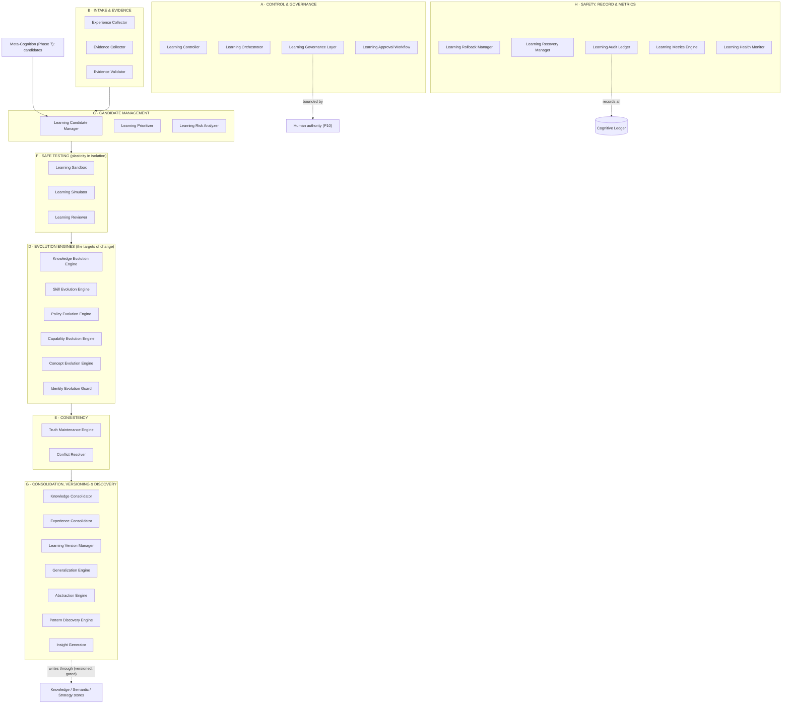
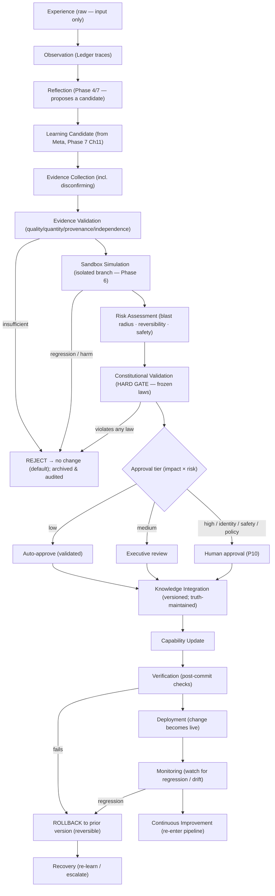
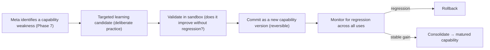
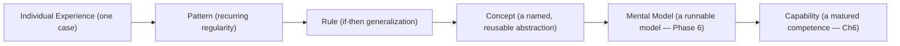
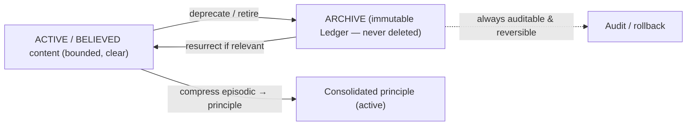
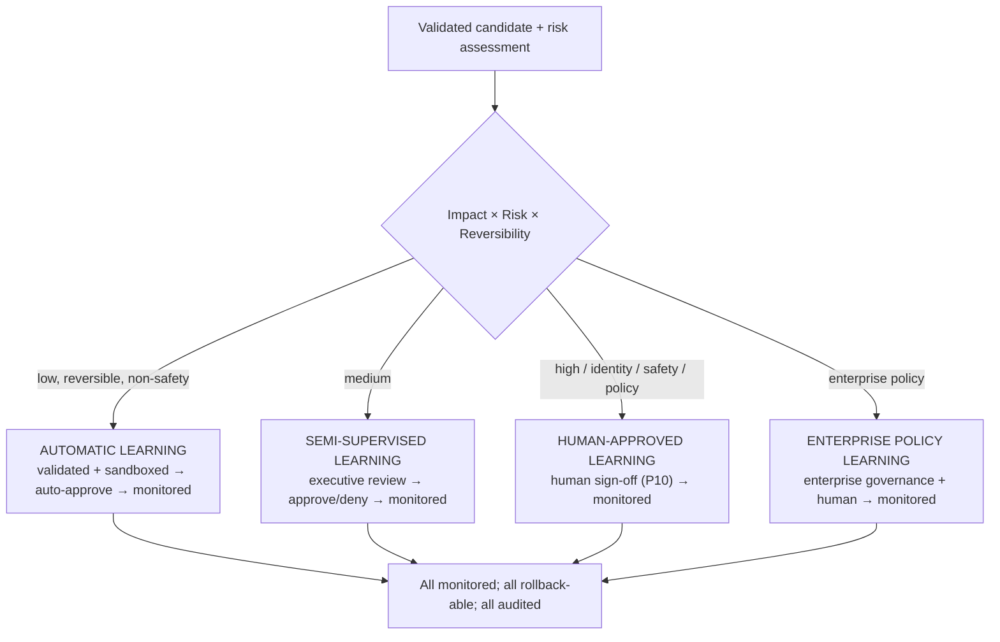
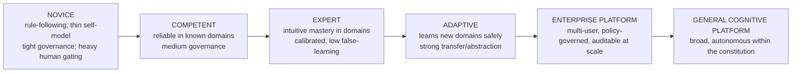

# UnityWorks Cognitive Intelligence Platform

## Phase 8 — The Adaptive Learning & Cognitive Evolution Architecture

> **The Continuously Evolving Mind of UnityWorks**

| | |
|---|---|
| **Phase** | 8 — Adaptive Learning & Cognitive Evolution |
| **Predecessors (frozen, constitutional)** | Phase 0 · 1 · 1.5 · 2 · 2.5 · 3 · 4 · 5 · 6 · 7 |
| **Status** | Research-grade architectural specification. No code, no APIs, no schemas, no frameworks, no languages, no implementation. |
| **Correctness horizon** | Timeless; valid regardless of which model/engine/runtime UnityWorks uses. |
| **Register** | A dissertation across Cognitive Science, the Learning Sciences, Neuroscience, AI, Continual Learning, Human Expertise, Cognitive Psychology, Systems & Adaptive Systems Engineering, and Knowledge Engineering — *why before how*. |
| **Constitutional role** | The permanent blueprint for how UnityWorks *permanently improves itself without corrupting its cognition* — the faculty that **commits** what earlier faculties only **propose**. |

This phase **extends the architecture without redesigning it** and cannot violate any prior law. It
inherits and preserves: **P1–P12** (esp. **P9** *learning must not corrupt* and **P10** *human-in-the-
loop*); the ten Regions and the **confidence currency** (Phase 1); the twelve object kinds, **OL1–OL9**,
belief **truth-maintenance** (Ch4), the **Strategy/Policy store**, **Checkpoints** (Ch10) (Phase 1.5); the
runtime, transactions, event-sourced **Ledger**, **RL1–RL8** (Phase 2); **CL1–CL27** (Phase 2.5);
**AL1–AL17** (Phase 3); the reasoning faculty and **Reflection** (proposes-never-commits), **ReL1–ReL14**
(Phase 4); the **Executive**, its review/approval authority, **ExL1–ExL30** (Phase 5); the predictive
faculty's **isolation/quarantine**, **PrL1–PrL24** (Phase 6); and meta-cognition's **Learning Candidate
Generator**, propose-not-commit boundary, and **MeL1–MeL35** (Phase 7).

### The place of this phase — where "propose" finally meets "dispose"

Across the constitution, one discipline has recurred: **the faculty that notices a needed change must not
be the faculty that makes it.** Reflection proposes; meta-cognition proposes; neither commits. This was
deliberate — it kept a single mistaken insight from silently rewriting the mind (P9). But *something* must
eventually dispose, or the mind, however insightful, never actually improves. **Phase 8 is that faculty.**
It is the sole locus of durable self-change — and precisely because it is the only faculty that *can*
change the mind, it must be the most disciplined faculty in the entire architecture.

### The five commitments that discipline this phase (read first)

**(1) Learning is NOT training.** The objective is *not* to train an LLM — it is to **evolve the cognitive
system itself.** Training adjusts a model's weights (a faculty-internal, model-specific, offline concern
of the Generation Platform). *Learning*, here, evolves the *cognitive architecture's durable content* —
its knowledge, beliefs, skills, strategies, policies, calibration, concepts, and (most rarely) identity —
**model-independently.** A future engine can replace today's LLM and the mind's *learned cognitive
content* persists, because learning lives above any engine (§1). This is what makes UnityWorks' learning
survive a decade of changing models.

**(2) Learning is from VALIDATED EXPERIENCE, never raw interaction.** Raw interaction (what a user asserts,
what happened once) is *input to* the pipeline — never, by itself, a change. Learning occurs only after
experience is distilled through reflection, evidence, validation, sandboxed simulation, and gating. This
is the **anti-poisoning firewall**: an adversary cannot teach UnityWorks a falsehood by asserting it,
because assertion is not evidence and interaction is not learning (§1.4, Law LeL7, Appendix B).

**(3) Learning NEVER alters the constitution.** Learning evolves *content within* the fixed structure;
it can never change a frozen law (P/OL/RL/CL/AL/ReL/ExL/PrL/MeL). The constitution is the invariant that
bounds all self-change — the guarantee against runaway self-modification (Law LeL5, Appendix B).

**(4) Learning is always SAFE·EXPLAINABLE·AUDITABLE·REVERSIBLE·EVIDENCE-DRIVEN·CONSTITUTIONALLY-COMPLIANT·
HUMAN-SUPERVISABLE·FUTURE-PROOF.** These eight are not aspirations; they are the acceptance criteria every
learning event must pass, enforced by the pipeline (Ch3) and the laws (Ch12).

**(5) Learning defaults to NO CHANGE.** The burden of proof is on the change. A learning candidate is a
*hypothesis to be falsified*, not confirmed; if validation is inconclusive, the default is rejection
(§8, Law LeL9). A mind that changes only when *proven* safe is far safer than one that changes unless
*proven* dangerous.

---

## Table of Contents

- **Fundamental Philosophy** — Why learning is the final stage of cognition
- **Chapter 0** — Scientific Foundations of Learning
- **Chapter 1** — The Learning Philosophy
- **Chapter 2** — The Complete Learning Architecture
- **Chapter 3** — The Learning Pipeline
- **Chapter 4** — Learning Types
- **Chapter 5** — Knowledge Evolution
- **Chapter 6** — Skill & Capability Evolution
- **Chapter 7** — Generalization & Abstraction
- **Chapter 8** — Learning Validation
- **Chapter 9** — Forgetting & Memory Evolution
- **Chapter 10** — Learning Governance
- **Chapter 11** — Learning Metrics & Cognitive Health
- **Chapter 12** — Constitutional Learning Laws
- **Chapter 13** — Integration
- **Chapter 14** — The Cognitive Evolution Roadmap
- **Appendix A** — Consistency map to prior phases
- **Appendix B** — The plasticity–stability & anti-poisoning safety case

---
---

# FUNDAMENTAL PHILOSOPHY — WHY LEARNING IS THE FINAL STAGE OF COGNITION

## F.1 Learning closes the cognitive loop

The cognitive cycle (Phase 2) runs perceive → attend → reason → decide → act → observe → reflect →
**learn**. Every stage before learning produces a *transient* result: a thought had, an action taken, an
outcome observed, a reflection formed — and then, absent learning, *gone*, leaving the mind exactly as it
was. **Learning is the stage at which the loop closes and the mind itself changes** — where a transient
experience becomes a durable improvement, where the mind becomes *the same mind, better*, rather than a
fresh reactor each cycle. Without learning, cognition is *episodic*: brilliant, perhaps, but never
cumulative. Learning is what makes intelligence *grow*. It is the final stage not because it happens last
in a single cycle, but because it is where the *point* of all the prior stages is finally realized:
cognition exists, ultimately, to make the mind better at cognition.

## F.2 Why reflection alone is insufficient

The constitution deliberately made reflection (Phase 4, Ch8) and meta-cognition (Phase 7) *propose-only*:
they evaluate and recommend but change nothing. This was a safety decision — but it means a mind that
*only* reflects has endless insight and zero improvement. It notices its overconfidence and remains
overconfident; it identifies a better strategy and never adopts it. **Reflection produces the *diagnosis*;
learning performs the *treatment*.** A physician who only diagnoses heals no one. Something must dispose
of what reflection proposes — safely — and that is learning's reason to exist.

## F.3 Why experience alone is insufficient

Raw experience is a firehose of the noisy, the coincidental, the manipulated, and the unrepresentative.
A mind that learned directly from experience would learn that the sun rises because a rooster crowed,
would adopt whatever a confident user asserted, and would generalize from a single case. **Experience is
the *input*, not the *lesson*.** The lesson must be *distilled* — separated from noise, corroborated by
evidence, tested for reproducibility, checked against what is already known. Experience without
validation is not learning; it is *contamination*. (This is why §1.4 insists on *validated experience*.)

## F.4 Why prediction alone is insufficient

Prediction (Phase 6) imagines futures and, through reconciliation, generates *prediction error* — a
powerful *signal* that something in the mind's model is wrong. But a signal is not a repair. Prediction
error says "you were wrong"; it does not say *what to change, whether the change is safe, or whether the
error was a fluke.* Prediction feeds learning its most important input, but prediction *is not* learning:
imagining does not durably change the mind; only learning does.

## F.5 Why meta-cognition proposes but never performs

The separation of *proposing* (meta) from *disposing* (learning) is the single most important safety
structure in the self-improving mind (Phase 7, MeL9). If the faculty that *notices* a needed change were
also the faculty that *made* it, a single mistaken self-insight would silently, immediately rewrite the
mind — with no independent validation, no gating, no reversibility. By making learning a *separate,
disciplined* faculty that receives candidates from meta-cognition and subjects them to a rigorous pipeline
before any commit, the architecture ensures that *noticing* and *changing* are checked against each other.
Meta is the mind's conscience; learning is its surgeon — and no surgeon operates on the say-so of a
hunch.

## F.6 Why learning is an architectural responsibility, not a reasoning responsibility

A reasoning error is *transient, local, and self-limiting*: it affects one conclusion, is caught by the
next cycle or by meta-cognition, and leaves the mind unchanged. A **learning error is durable, global, and
compounding**: it changes the mind *permanently*, affects *every future cognition* that touches the
corrupted content, and *builds on itself* (bad lessons become the premises of worse ones). The two belong
to different risk classes entirely. Therefore learning cannot be a *reasoning step* (a thing the mind does
casually, in-line, at reasoning's discretion); it must be an **architectural process** — governed,
staged, gated, versioned, and reversible — with the caution appropriate to the only operation that can
permanently alter a mind. This is why Phase 8 is a full architecture and not a chapter of Phase 4.

## F.7 Why incorrect learning is one of the greatest risks in AI

This is the argument that justifies the entire heavy apparatus of this phase. Of all the ways an AI can
fail, *learning the wrong thing* is uniquely dangerous, for six compounding reasons:

| Property of bad learning | Why it makes bad learning uniquely dangerous |
|---|---|
| **Durable** | Unlike a one-off error, a bad lesson *persists* and recurs in every relevant future cognition |
| **Compounding** | Bad lessons become the *premises* of future learning — errors build on errors (drift) |
| **Self-reinforcing** | A biased mind learns *more* bias; a mind that learned to over-trust a source learns more from it — confirmation at the learning level |
| **Hard to detect** | The mind *believes* what it learned; the corruption is invisible from the inside (which is why validation must be *external* to the belief) |
| **Adversarially exploitable** | Poisoning the *learning pipeline* poisons the mind *permanently* — the highest-value attack surface in any learning system |
| **Corrupts the corrector** | Bad learning about *how to learn* (meta-learning) degrades the very faculty meant to catch bad learning |

The conclusion is stark: **the mind's single most dangerous operation is changing itself.** Every
mechanism in this phase — evidence requirements, sandboxed simulation, versioning, reversibility, gating,
constitutional compliance, human approval — exists to make that most dangerous operation *safe*. An AI
that could learn freely from raw experience would be an AI that could be permanently corrupted by an
afternoon of adversarial interaction. UnityWorks refuses that fate by construction.

---
---

# CHAPTER 0 — SCIENTIFIC FOUNDATIONS OF LEARNING

> A review that *justifies architecture*. For each: core idea · evidence · strengths · weaknesses ·
> engineering implication · **decision (adopt/adapt/reject)** · why. It ends with the UnityWorks learning
> philosophy.

## 0.1 The two organizing scientific ideas

Two ideas from the learning sciences organize this entire phase, and every theory below is read through
them:

- **The plasticity–stability dilemma (Grossberg).** A mind must be *plastic* enough to learn the new,
  yet *stable* enough not to forget or corrupt the old. Too plastic → catastrophic forgetting and easy
  poisoning; too stable → rigidity and failure to adapt. **Every mechanism in this phase is a resolution
  of this dilemma:** versioning (change without loss), sandboxing (safe plasticity), consolidation
  (stabilize the validated), gated forgetting (prune without destroying). This is the central tension of
  learning, and naming it is the first architectural act.
- **Learning-as-science.** UnityWorks learns the way science advances: a learning candidate is a
  *hypothesis*; evidence collection and validation are *experimentation and peer review*; the sandbox is
  the *controlled experiment*; a commit is *theory revision*; monitoring and rollback are *replication and
  retraction*. This reframes the heavy pipeline not as bureaucracy but as **rigorous science about
  oneself** — the epistemically correct posture for a mind that changes itself.

## 0.2 The foundations, compared

| # | Theory | Core idea | Strengths | Weaknesses | Decision |
|---|---|---|---|---|---|
| 1 | **Human Learning Theory** (constructivism; Piaget) | Learning constructs and revises mental structures via assimilation/accommodation | Rich account of concept change | Broad, informal | **Adapt** — learning as structure-revision, made rigorous by the pipeline |
| 2 | **Deliberate Practice** (Ericsson) | Expertise from focused practice on *weaknesses* with feedback | Strong expertise evidence | Effortful, domain-specific | **Adopt** — learning targets *identified weaknesses*, feedback-driven |
| 3 | **Skill Acquisition / Dreyfus Model** | Novice→advanced-beginner→competent→proficient→expert | Clear maturity stages | Descriptive | **Adopt** — the maturity roadmap (Ch14) |
| 4 | **Memory Consolidation** (systems consolidation; sleep) | Labile episodic memory stabilizes into durable knowledge, largely offline | Neurally grounded | Mechanism debated | **Adopt** — learning as *consolidation* of validated experience; offline/idle (Phase 2, Ch4.5) |
| 5 | **Hebbian Learning** | "Cells that fire together wire together" — association strengthening | Foundational; simple | Too low-level; unstable alone | **Adapt** — the biological analogue of edge-strengthening (Phase 2, Ch10); not the content-level mechanism |
| 6 | **Predictive Learning** | Learn from prediction error | Unifying; efficient | Needs a predictor | **Adopt** — prediction error is a primary learning signal (Phase 6) |
| 7 | **Reinforcement Learning** | Improve a policy from reward/outcome | Powerful policy learning | Opaque; dense-reward-hungry; unexplainable | **Adapt** — *outcome-driven, explainable, gated* strategy improvement; reject raw RL as the mechanism |
| 8 | **Continual Learning** | Learn continuously without forgetting prior tasks | The core challenge | Catastrophic forgetting | **Adopt** — the central problem; solved by versioning + consolidation |
| 9 | **Lifelong Learning** | Accumulate and reuse over a lifetime | Long-horizon growth | Scale/interference | **Adopt** — the decade-scale posture (Ch14) |
| 10 | **Active Learning** | Choose *what* to learn (most informative) | Sample-efficient | Needs a query strategy | **Adopt** — the mind chooses what to learn by expected value / information gain |
| 11 | **Curriculum Learning** | Learn easy→hard in a structured order | Faster, more stable | Curriculum design | **Adapt** — staged capability evolution (foundations before advanced) |
| 12 | **Meta-Learning** | Learn *how to learn* | Improves the learner | Instability; opacity | **Adapt** — improve the learning process itself, but *gated and bounded* (a candidate like any other) |
| 13 | **Transfer Learning** | Apply a lesson from one domain to another | Generalization power | Negative transfer | **Adopt** — via abstraction (Ch7); guarded against negative transfer |
| 14 | **Bayesian Learning** | Update beliefs with evidence (Bayes) | Normatively optimal | Intractable exactly | **Adopt** — the normative ideal for knowledge/belief revision and confidence evolution |
| 15 | **Error-Driven Learning** | Learn from mistakes | Directs learning to failures | Needs error signal | **Adopt** — failure learning (Ch4); prediction error |
| 16 | **Human Expertise Development** | Maturation from rules to intuition to mastery | Rich developmental model | Domain-bound | **Adopt** — the roadmap (Ch14); deliberate practice |
| 17 | **Neuroplasticity** | Experience physically rewires the brain | The biological warrant for change | Plasticity can harm stability | **Adapt** — bounded plasticity (the dilemma); structural change only through the pipeline |
| 18 | **Concept Formation** | Abstract new concepts from instances | Explains concept learning | Over/under-abstraction | **Adopt** — concept learning (Ch7), with abstraction guards |
| 19 | **Knowledge Revision** | Update knowledge with new information | Essential for currency | Can corrupt if blind | **Adopt** — evidence-weighed, versioned, truth-maintained (Ch5) |
| 20 | **Forgetting Theory** | Adaptive forgetting reduces interference | Forgetting *aids* cognition | Losing needed info | **Adopt** — gated forgetting = *deprecation/archival*, never deletion (Ch9) |
| 21 | **Catastrophic Forgetting** | Neural learners lose old skills when learning new | Names a critical hazard | (a failure mode) | **Adopt as a hazard to prevent** — versioning + consolidation + the stability side of the dilemma |
| 22 | **Truth Maintenance Systems** (JTMS/ATMS) | Maintain belief consistency under revision | Coherent revision | Complexity | **Adopt** — the Truth Maintenance Engine (Ch5); Phase 1.5, Ch4 |
| 23 | **Knowledge Evolution** | Knowledge as a versioned, lifecycle-managed entity | Currency + history | Governance overhead | **Adopt** — Ch5 |
| 24 | **Scientific Discovery** | Hypothesis → experiment → evidence → theory revision | The gold standard of justified belief change | Slow | **Adopt** — the *learning-as-science* pipeline (§0.1, Ch3) |
| 25 | **Constitutional AI** | Change is bounded by explicit principles | Scalable, safe oversight | Principle-dependent | **Adopt** — the constitution bounds all learning; compliance is a hard gate (Ch8) |
| 26 | **Human Feedback Systems** (RLHF; human oversight) | Humans steer and approve model change | Aligns to human intent | Naive RLHF is opaque/gameable | **Adapt** — human *approval gates* for high-impact learning (P10); reject RLHF-as-the-mechanism |

## 0.3 Deep dives on the pillars

**The plasticity–stability dilemma + consolidation (adopt — the organizing tension and its resolution).**
The mind must change *and* remain itself. UnityWorks resolves this not by finding a magic middle rate but
by *structural* means: it is **plastic in the sandbox** (any change can be tried on an isolated branch,
Phase 6 isolation) and **stable in reality** (nothing enters durable state without validation and
versioning). Consolidation — the offline stabilization of the validated (memory-consolidation science) —
is how the mind moves a change from labile candidate to durable knowledge, gradually and reversibly.
Plasticity is granted in a safe place; stability is protected in the real place; consolidation bridges
them. The dilemma is solved by *where* and *how*, not by a rate.

**Learning-as-Science + Constitutional AI (adopt — the method and the invariant).** UnityWorks learns by
the scientific method (hypothesis→experiment→evidence→revision→replication) *bounded by a constitution*.
The scientific method supplies the *rigor* (a candidate must survive falsification, be reproducible, be
consistent with established knowledge); the constitution supplies the *invariant* (no lesson, however
well-evidenced, may violate a frozen law). Together they answer the two questions every self-change must
face: *is it true?* (science) and *is it permitted?* (constitution). This pairing is the epistemic and
safety backbone of the whole phase.

**Bayesian Learning + Truth Maintenance (adopt — the substrate of belief change).** Knowledge and belief
change *Bayesianly in spirit* (evidence shifts confidence; strong prior knowledge resists weak evidence)
and *coherently* (truth maintenance ensures a revision does not leave the belief graph contradictory,
Phase 1.5, Ch4). This is why "verified knowledge cannot be overwritten blindly" (Ch5): a well-established,
strongly-justified fact demands *strong, corroborated* counter-evidence to revise, and its revision must
propagate consistently through everything that depended on it.

**Deliberate Practice + Dreyfus + Continual Learning (adopt — the growth trajectory).** UnityWorks matures
like a human expert: it identifies its weaknesses (via meta-cognition, Phase 7), practices deliberately on
them (targeted learning), and progresses through Dreyfus stages (Ch14) — *continually*, over a lifetime,
*without catastrophic forgetting* (the stability side of the dilemma). Growth is *directed at weakness*
(deliberate practice), *staged* (curriculum), and *cumulative* (lifelong) — not random drift.

## 0.4 The UnityWorks learning philosophy

> UnityWorks learning is the **governed evolution of the cognitive system's durable content** (not
> weight-training), resolving the **plasticity–stability dilemma** by being *plastic in an isolated
> sandbox and stable in reality*, proceeding by the **scientific method** (hypothesis→evidence→controlled
> experiment→validation→gated commit→monitored replication→reversible retraction) **bounded by the
> constitution**, learning only from **validated experience** (never raw interaction — the anti-poisoning
> firewall) and from **prediction error and outcome**, revising knowledge **Bayesianly and coherently**
> (truth-maintained, versioned, provenance-tracked), maturing toward **expertise** via *deliberate
> practice on identified weaknesses* through **Dreyfus stages**, **consolidating** the validated and
> **gated-forgetting** the obsolete (deprecation, never deletion) — and, inviolably: it **defaults to no
> change**, is always **safe, explainable, auditable, reversible, evidence-driven, constitutionally
> compliant, and human-supervisable**, **never bypasses meta-cognition or executive approval**, and
> **never alters the constitution.** Learning is how UnityWorks becomes wiser without ever becoming
> corrupted.

---
---

# CHAPTER 1 — THE LEARNING PHILOSOPHY

## 1.1 What learning is

Learning is the faculty that **converts validated experience into durable, reversible, constitutionally-
compliant improvement of the cognitive system's content.** It is the mind's mechanism of *permanent
self-improvement* — the only faculty licensed to change durable state, and therefore the only faculty
through which the mind becomes, over time, more knowledgeable, more skilled, better calibrated, and wiser.

## 1.2 What learning is not

- It is **not training** — it does not adjust an engine's weights; it evolves the *cognitive
  architecture's content*, model-independently (§1.3).
- It is **not reflection or meta-cognition** — those *propose*; learning *disposes* (F.5).
- It is **not memory** — memory *stores*; learning *changes what is worth storing and how it is
  structured*.
- It is **not raw adaptation** — a thermostat adapts; learning is *validated, durable, structural* change,
  not momentary adjustment.
- It is **not optimization** — optimization tunes toward a fixed objective; learning *revises the mind's
  very knowledge, concepts, and capabilities*, and is bounded by a constitution rather than a loss
  function.

## 1.3 Learning vs training — the decisive distinction

| | **Training** | **Learning (this phase)** |
|---|---|---|
| Object of change | A model's weights | The cognitive system's durable *content* (knowledge, beliefs, skills, strategies, policies, calibration, concepts, identity) |
| Locus | Inside a faculty (the Generation engine) | *Above* all engines, at the cognitive-architecture level |
| Model dependence | Model-specific | **Model-independent** — survives engine replacement |
| Explainability | Opaque (weight deltas) | Explainable (evidenced, versioned content changes) |
| Reversibility | Hard (retraining) | Reversible by design (versioning, rollback) |
| Governance | Offline, engineering | Live, constitutional, human-supervisable |

The consequence is profound: **UnityWorks learns as a *cognitive system*, not as a neural network.** When
a better engine arrives, the mind's *learned content* — everything it has come to know, the strategies it
has found effective, the calibration it has earned — *persists*, because it never lived in the engine's
weights; it lived in the cognitive architecture. This is the deepest reason the learning is future-proof.

## 1.4 Why UnityWorks learns from *validated experience*, not raw interaction

Raw interaction is *untrusted input*. A user may be wrong, manipulative, or adversarial; a single event
may be a coincidence; a repeated assertion may be a repeated lie. A mind that learned directly from raw
interaction would be *trivially corruptible* — teachable a falsehood by persistence, biasable by a skewed
sample, poisonable by design. UnityWorks therefore erects a **firewall**: raw interaction *feeds* the
learning pipeline but never *is* learning. Only experience that has been **reflected upon (meta),
corroborated by evidence, validated for reproducibility and consistency, tested in a sandbox, checked
against the constitution, and (for high impact) approved by a human** becomes durable change. Assertion is
not evidence; interaction is not learning; repetition is not proof. This single principle (Law LeL7) is
what makes UnityWorks safe to deploy among users who may not have its interests at heart.

## 1.5 The twelve neighbors — learning distinguished

| Concept | What it is | Relation to learning |
|---|---|---|
| **Experience** | What happened (raw) | The *input* to learning, never the lesson (F.3) |
| **Reflection** | Evaluating an episode | *Proposes* learning candidates (Phase 4) |
| **Knowledge** | Objective durable facts | A *target* learning evolves (Ch5) |
| **Memory** | Storage/retrieval | Learning changes *what is stored and how* |
| **Learning** | Validated durable self-improvement | *is the faculty itself* |
| **Training** | Weight adjustment | A model-internal process; *not* this phase (§1.3) |
| **Adaptation** | Momentary adjustment | Transient; learning is durable & structural |
| **Evolution** | Long-horizon cumulative change | The *aggregate* of much learning over time (Ch14) |
| **Optimization** | Tuning toward a fixed objective | Learning revises the objectives' *substrate*; bounded by a constitution, not a loss |
| **Skill** | A honed procedural capability | A *target* learning evolves (Ch6) |
| **Expertise** | Mature, intuitive mastery | The *outcome* of much deliberate learning (Dreyfus, Ch14) |
| **Capability** | A measured cognitive competence | Matured by learning (Ch6) |
| **Wisdom** | Well-calibrated judgment about what matters, incl. when *not* to act/learn | The highest fruit of learning: knowing the limits of one's knowledge and the risks of change (see §1.6) |

## 1.6 A note on wisdom — the highest aim

The mission's list ends at *wisdom*, and it is the right terminus. A merely *knowledgeable* mind
accumulates facts; a merely *skilled* mind executes well; a *wise* mind knows *the limits of its own
knowledge, the risks of its own changes, and when restraint is superior to action.* Wisdom, in this
architecture, is not a store but an *emergent property* of mature learning: it is what a mind possesses
when its calibration is excellent (it knows what it does not know), its meta-cognition is sharp (it
catches its own errors), and its learning is disciplined (it changes only when proven and reversibly).
UnityWorks pursues wisdom not by a special module but by learning *well* — and the eight commitments are,
in the end, the architecture of a *wise* learner: one that improves eagerly and changes cautiously.

## 1.7 Why learning is an architectural, not a reasoning, faculty

Restating F.6 as the philosophical close: because a learning error is *durable, global, and compounding*
where a reasoning error is *transient, local, and self-limiting*, the two must be governed at different
altitudes. Reasoning may be casual, in-line, at the mind's discretion; learning must be *architectural* —
a governed process with the caution of neurosurgery, because it operates on the mind itself. To place
learning inside reasoning would be to let the mind casually rewrite itself — the precise failure P9 and
the five commitments exist to prevent.

---
---

# CHAPTER 2 — THE COMPLETE LEARNING ARCHITECTURE

## 2.1 The subsystem, in eight functional clusters

~33 components, each with one responsibility (OL1), each independently replaceable (P6/OL8), all obeying
the five commitments. Grouped by function.



## 2.2 The components

By cluster. For each: **purpose · key responsibilities · boundary · why it exists independently** (inputs/
outputs/lifecycle/failure/recovery summarized where space demands; all obey the five commitments).

### A — Control & Governance
- **Learning Controller.** *Purpose:* run a learning episode through the pipeline (Ch3). *Boundary:*
  orchestrates the *process*; performs no cognition and authorizes no commit itself. *Why independent:*
  the process controller must be separable from the engines that change content.
- **Learning Orchestrator.** *Purpose:* sequence the pipeline stages and route a candidate to the right
  evolution engine. *Boundary:* routing/sequencing, not decision. *Why independent:* orchestration
  (which stage next) differs from control (whether to proceed).
- **Learning Governance Layer.** *Purpose:* enforce the commitments and the Learning Laws (Ch12); the
  interface to executive approval and human authority. *Why independent:* the guardian of learning's
  constitutional limits must be distinct from its active machinery (separation of powers).
- **Learning Approval Workflow.** *(Ch10.)* *Purpose:* route each candidate to the correct approval tier
  (automatic / executive / human / enterprise) by impact×risk. *Why independent:* approval routing is a
  distinct governance concern from validation (a valid change may still require human sign-off).

### B — Intake & Evidence
- **Experience Collector.** *Purpose:* gather relevant experience from the Ledger (what happened,
  outcomes) as *input*. *Boundary:* collects experience; does not treat it as truth (F.3). *Why
  independent:* intake is distinct from evaluation.
- **Evidence Collector.** *Purpose:* gather *evidence* bearing on a candidate — corroborating and
  *disconfirming* (the burden is to *falsify*, §8). *Why not merged with Experience Collector:* experience
  is *what happened*; evidence is *what bears on the truth of a proposed lesson* — and must include
  actively-sought disconfirmation.
- **Evidence Validator.** *Purpose:* assess evidence *quality, quantity, provenance, and independence*.
  *Why not merged with Evidence Collector:* *gathering* evidence and *challenging* it are opposite
  postures; the collector seeks, the validator doubts — separation prevents motivated collection from
  contaminating validation.

### C — Candidate Management
- **Learning Candidate Manager.** *Purpose:* receive candidates (from meta, Phase 7, Ch11), maintain their
  state through the pipeline. *Boundary:* manages candidates; does not decide them. *Why independent:* the
  candidate lifecycle is a distinct concern from prioritization and risk.
- **Learning Prioritizer.** *Purpose:* order candidates by (expected value × confidence) ÷ (risk × cost)
  — active learning (§0). *Why independent:* prioritization (what to learn first) differs from risk
  analysis (how dangerous a change is).
- **Learning Risk Analyzer.** *Purpose:* assess the *blast radius* of a candidate (what it would affect;
  reversibility; safety/identity bearing). *Why independent:* risk (downside if wrong) is orthogonal to
  value (upside if right); both are needed, separately, to route approval.

### D — Evolution Engines (the targets of durable change)
- **Knowledge Evolution Engine.** *(Ch5.)* Evolves durable facts (writes *through* the Knowledge
  Platform). *Why independent:* knowledge (objective facts) has a distinct lifecycle & truth-maintenance
  from skills or policies.
- **Skill Evolution Engine.** Evolves procedural capabilities (strategies in the Strategy store). *Why
  independent:* procedural knowledge (how-to) evolves by practice/outcome, unlike declarative knowledge.
- **Policy Evolution Engine.** Evolves executive policies (Phase 5, Ch7) — *always gated* (ExL29). *Why
  independent:* policy change alters *governance* and demands the strictest review.
- **Capability Evolution Engine.** *(Ch6.)* Matures measured competences (reasoning/prediction/etc.
  quality). *Why independent:* a capability is an *aggregate* competence, distinct from a single skill.
- **Concept Evolution Engine.** *(Ch7.)* Forms/revises concepts and mental models. *Why independent:*
  concept formation (abstraction) is a distinct operation from fact revision.
- **Identity Evolution Guard.** *Purpose:* the *most restrictive* engine — governs any change to the
  protected Identity Core (Phase 1, Ch4), which is the rarest, human-required, most-audited learning.
  *Why it is a Guard, not an Engine, and cannot be merged:* identity change is so consequential (it alters
  *who the mind is*) that its component's primary job is *restraint* — to make Core change almost never
  happen, and only through the tightest human-gated path. Merging it into a general engine would risk
  treating the Core like ordinary content (Law LeL6, ExL12 preserved).

### E — Consistency
- **Truth Maintenance Engine.** *(Ch5.)* Ensures revisions keep the belief/knowledge graph consistent
  (JTMS; Phase 1.5, Ch4). *Why independent:* coherence-under-revision is a distinct, cross-cutting
  guarantee.
- **Conflict Resolver.** *Purpose:* resolve conflicts *between candidates* and between a candidate and
  established knowledge (evidence-weighed; escalates ties). *Why not merged with Truth Maintenance:* TM
  keeps *the graph* consistent; the Conflict Resolver arbitrates *competing changes* — different scopes.

### F — Safe Testing (plasticity in isolation)
- **Learning Sandbox.** *Purpose:* apply a candidate change on an **isolated branch** (Phase 6 isolation;
  Phase 1.5 Checkpoints) — the place where the mind is *plastic* without risk. *Why independent & cannot
  be merged:* the *isolation boundary* is a dedicated safety responsibility (Appendix B) — the sandbox is
  where plasticity is granted and where isolation is guaranteed.
- **Learning Simulator.** *Purpose:* run *predictive simulation* (Phase 6) inside the sandbox to project
  the change's effects across scenarios *before* commit. *Why not merged with the Sandbox:* the sandbox is
  the *isolated place*; the simulator is the *predictive machinery run inside it* — place vs process.
- **Learning Reviewer.** *Purpose:* evaluate the sandboxed change's results against acceptance criteria
  (did it improve without regression?). *Why independent:* review (judging the experiment) is distinct
  from running it (simulator) and from the isolated venue (sandbox).

### G — Consolidation, Versioning & Discovery
- **Knowledge Consolidator.** *Purpose:* stabilize a validated change into durable knowledge (memory-
  consolidation, offline). *Why independent:* consolidation (stabilizing the validated) is the bridge
  across the plasticity–stability dilemma — a distinct, deliberate act.
- **Experience Consolidator.** *Purpose:* compress and generalize episodic experience into reusable form
  (freeing capacity; feeding pattern discovery). *Why not merged with Knowledge Consolidator:* episodic
  experience (what happened) and semantic knowledge (what is true) consolidate differently.
- **Learning Version Manager.** *Purpose:* version every change (reversibility, OL4). *Why independent:*
  versioning is the mechanism of reversibility and must be a single, authoritative record.
- **Generalization Engine / Abstraction Engine / Pattern Discovery Engine / Insight Generator.** *(Ch7.)*
  Turn instances → patterns → rules → concepts → insight. *Why each is independent:* generalization
  (broadening a rule's scope), abstraction (forming a higher-level concept), pattern discovery (finding
  regularities), and insight (novel connections) are *distinct cognitive operations* with distinct
  failure modes (over-generalization vs mis-abstraction vs spurious pattern vs false insight); merging
  them would blur the guards each requires.

### H — Safety, Record & Metrics
- **Learning Rollback Manager.** *Purpose:* revert a committed change to a prior version on detected
  regression. *Why independent:* rollback is the *executor* of reversibility, distinct from versioning
  (the record) and recovery (the strategy).
- **Learning Recovery Manager.** *Purpose:* govern *recovery* after bad learning (which version to revert
  to, what to re-learn, whether to escalate). *Why not merged with Rollback:* recovery is the *strategy*;
  rollback is one *action* within it.
- **Learning Audit Ledger.** *Purpose:* guarantee every learning event is observable, explainable, and
  auditable (P4). *Why independent:* auditability of self-change must be structurally guaranteed and
  independent of the machinery it records.
- **Learning Metrics Engine / Learning Health Monitor.** *(Ch11.)* Measure and trend learning quality/
  health (esp. the *false-learning rate*). *Why independent:* measurement (metrics) and aggregate trend
  (health) are distinct, and both must be independent of the learning process they assess.

## 2.3 Why ~33 components, decomposed

The count is the minimum in which (a) the *scientific-method stages* (evidence gather / challenge /
sandbox-experiment / review / consolidate) each have a dedicated owner; (b) each *target of change*
(knowledge / skill / policy / capability / concept / identity) has its own engine with change-appropriate
discipline — culminating in the *Identity Evolution Guard*, whose job is restraint; (c) the *safety
boundaries* (isolation at the Sandbox, coherence at Truth Maintenance, reversibility at Version/Rollback,
compliance at the Governance Layer, auditability at the Ledger) are dedicated rather than diffused. As in
every prior phase, decomposition is the anti-homunculus commitment: the faculty that changes the mind must
be *maximally inspectable*, because an opaque "learner" is the single most dangerous component an AI could
contain (F.7).

---
---

# CHAPTER 3 — THE LEARNING PIPELINE

## 3.1 The end-to-end lifecycle (the scientific method, gated)

Every learning event traverses one pipeline — a scientific-method process with fail-safe gates. Its
defining property: **every stage can reject, and the default of rejection is *no change* (the mind is left
exactly as it was).** Only a candidate that survives *every* gate becomes durable — and even then,
reversibly and monitored.



## 3.2 The transitions

- **Experience → Observation.** Raw experience is observed *from the Ledger* (grounded, not introspected).
  Experience alone changes nothing.
- **Observation → Reflection → Candidate.** Reflection (Phase 4/7) evaluates and *proposes* a candidate;
  meta-cognition emits it (Phase 7, Ch11). The candidate carries what/why/priority/confidence/risk/
  evidence/expected-value/reversibility (the Phase 7 contract).
- **Candidate → Evidence Collection → Validation.** The mind actively gathers evidence — *including
  disconfirming evidence* — and validates its quality, quantity, provenance, and independence. *Assertion
  and repetition do not count as evidence* (§1.4). Insufficient/contaminated evidence → **reject**.
- **Validation → Sandbox Simulation.** The change is applied on an *isolated branch* and its effects
  *simulated across scenarios* (Phase 6) — the controlled experiment. Regression or harm → **reject**.
- **Simulation → Risk Assessment.** Blast radius, reversibility, and safety/identity bearing are assessed
  — determining the approval tier.
- **Risk → Constitutional Validation (HARD GATE).** The change is checked against *every frozen law*. A
  change that would violate any law is **rejected unconditionally** — no evidence, value, or approval can
  override the constitution (Law LeL5).
- **Constitutional → Approval.** By impact×risk: low → auto-approve; medium → executive review; high /
  identity / safety / policy → **human approval** (P10, Ch10).
- **Approval → Integration → Capability Update.** The change is written *through* the platforms
  (Knowledge/Semantic) and to the cognitive stores — **versioned** and **truth-maintained** — and
  dependent capabilities are updated.
- **Integration → Verification → Deployment.** Post-commit verification confirms the change behaves as
  expected; failure → **rollback**. On success, the change becomes live.
- **Deployment → Monitoring → Continuous Improvement / Rollback.** The live change is monitored for
  regression and drift. Regression → **rollback to the prior version** (reversibility) → recovery. Success
  → the change may seed further improvement (the loop).

## 3.3 Rollback paths and auditability

- **Rollback is always possible** because every commit is versioned (LVM) and the prior state is preserved
  (never destroyed — Ch9). Rollback is itself a versioned, audited event.
- **Every stage — including every rejection — is recorded** in the Learning Audit Ledger (P4). The mind
  can always answer: *what did I try to learn, on what evidence, why was it accepted or rejected, who
  approved it, and (if committed) can it be undone?* This is the compliance-grade record that makes
  self-change *trustworthy*.
- **Fail-safe default.** At every gate, the *safe* outcome (no change) is the default; a change happens
  only by affirmatively passing every gate. A pipeline error, ambiguity, or timeout resolves to
  *no-change*, never to an unvalidated commit (Law LeL9).

## 3.4 Why this heavy pipeline, not lightweight in-line learning

- **Rejected: in-line learning** (the mind updates itself as it goes, at reasoning's discretion).
  *Disadvantage:* exactly the F.7 catastrophe — durable, compounding, self-reinforcing, poisonable change
  with no validation, gating, or reversibility. *Violates:* P9 and all five commitments.
- **Adopted: the gated scientific-method pipeline.** Heavy by design, because the operation it governs —
  permanently changing a mind — is the most consequential operation the system performs. The weight is not
  bureaucracy; it is *the appropriate rigor for self-surgery*.

---
---

# CHAPTER 4 — LEARNING TYPES

## 4.1 Why an explicit taxonomy of learning

Different kinds of change carry different risk, need different evidence, and target different stores. An
explicit taxonomy lets each be *routed, validated, and gated appropriately* — a safety-relevant lesson and
a communication-style lesson must not pass through the same-strength gate. Each type is an application of
the *one* pipeline (Ch3), with type-specific evidence and approval.

## 4.2 The learning types

| Type | What it evolves | Target store | Typical evidence | Risk / gate |
|---|---|---|---|---|
| **Concept Learning** | New/revised concepts & mental models | Concept store (Ch7) | Repeated instances; successful transfer | Medium |
| **Procedural Learning** | How-to skills | Strategy store | Repeated successful execution | Medium |
| **Strategic Learning** | Reasoning/planning strategies | Strategy store | Outcome across episodes | Medium |
| **Behavioral Learning** | Interaction behaviors | Behavior policy | Outcome + user feedback | Medium |
| **Policy Learning** | Executive policies | Policy store (Phase 5) | Governance outcomes | **High — gated (ExL29)** |
| **Safety Learning** | Safety-relevant rules | Safety policy | Strong, corroborated | **Highest — human-required** |
| **Communication Learning** | Tone, style, clarity | Persona/communication | User feedback + outcomes | Low–medium |
| **Planning Learning** | Planning heuristics | Strategy store | Plan-outcome reconciliation | Medium |
| **Reasoning Learning** | Reasoning quality/strategies | Strategy store | Reasoning-trace evaluation | Medium |
| **Prediction Learning** | Forward-model improvement | World-model priors | Prediction error (Phase 6) | Medium |
| **Calibration Learning** | Confidence accuracy | Calibration params (Phase 7, Ch6) | Stated-vs-realized accuracy | Medium |
| **Relationship Learning** | User/org models | Belief (User Understanding) | Repeated interaction, validated | Medium; privacy-gated |
| **Workspace Learning** | Environment-specific knowledge | Knowledge (scoped) | Repeated observation | Low–medium |
| **Tool-Usage Learning** | How to use tools effectively | Skill store | Tool-outcome reconciliation | Medium; safety if effectful |
| **Multi-Agent Learning** | Coordination, other-agent models | Belief + strategy | Interaction outcomes | Medium–high |
| **Failure Learning** | Lessons from mistakes | Any store (as a correction) | The failure + its attributed cause | Value-high; risk per target |
| **Success Learning** | Lessons from what worked | Any store (as reinforcement) | The success + its attribution | Lower risk; still validated |

## 4.3 Failure and success learning — the two most important types

**Failure learning** is the richest source of improvement (error-driven learning, Ericsson's focus on
weaknesses): a failure, properly attributed (Phase 4/7 reflection), reveals precisely what to change.
**Success learning** is subtler and more dangerous: it is tempting to reinforce whatever preceded a good
outcome, but *post hoc ergo propter hoc* — a success may be luck, not skill. UnityWorks therefore holds
success learning to the *same* evidence and reproducibility standard as failure learning: a success
becomes a lesson only when the causal attribution is validated (the outcome followed *from* the approach,
not merely *after* it). This guards against the mind reinforcing superstitions — learning that a lucky
guess was a good method.

## 4.4 Why type-specific gating, not uniform learning

- **Rejected: treat all learning identically.** *Disadvantage:* either over-gates the trivial (learning a
  communication preference should not need human sign-off) or under-gates the dangerous (a safety or
  identity change must never be auto-approved). *Violates:* proportional governance (P5) and safety.
- **Adopted: one pipeline, type-scaled gating.** The *process* is uniform (rigor for all); the *approval
  tier* scales with the type's risk — trivial changes flow fast, consequential ones are human-gated. This
  is how the mind learns *quickly where safe* and *cautiously where it matters*.

---
---

# CHAPTER 5 — KNOWLEDGE EVOLUTION

## 5.1 Why verified knowledge cannot be overwritten blindly

Knowledge is the mind's *system of record* — shared across every faculty, the ground of reasoning and
belief. Blindly overwriting a verified fact would: destroy its *provenance* (why it was believed), break
every *dependent* belief (which relied on it), lose the *history* needed for audit and reversibility, and
open the *poisoning* vector (assert a falsehood, overwrite the truth). Therefore knowledge does not
*change*; it **evolves** — through a versioned, evidence-weighed, truth-maintained lifecycle in which a
well-established fact demands *strong, corroborated, disconfirmation-surviving* counter-evidence to
revise, and its revision propagates *consistently* through everything that depended on it.

## 5.2 The knowledge lifecycle

```mermaid
stateDiagram-v2
    [*] --> Proposed : learning candidate (a knowledge change)
    Proposed --> Active : validated + gated + integrated (versioned)
    Active --> Revised : new corroborated evidence shifts it (new version; old retained)
    Revised --> Active
    Active --> Deprecated : superseded / obsolete (still archived, resurrectable)
    Deprecated --> Active : resurrected (conditions/evidence return)
    Active --> Retired : no longer relevant (archived)
    Active --> Contested : contradictory evidence arrives → truth-maintenance
    Contested --> Active : survives (confidence adjusted)
    Contested --> Deprecated : loses (superseded, archived)
    Retired --> [*]
```



## 5.3 The evolution operations

| Operation | What it does | Discipline |
|---|---|---|
| **Versioning** | Every change creates a new version; prior versions retained | Reversibility (OL4) |
| **Revision** | Evidence shifts a fact's content/confidence | Bayesian; requires corroborated evidence for strong priors |
| **Deprecation** | Mark obsolete without deleting (Ch9) | Never destroy; archive |
| **Merging** | Reconcile duplicate/overlapping knowledge | Provenance of all sources preserved |
| **Splitting** | Separate an over-broad fact into precise ones | On discovered distinctions |
| **Retirement** | Archive no-longer-relevant knowledge | Resurrectable |
| **Resurrection** | Reactivate deprecated/retired knowledge when conditions return | Audited |
| **Truth Maintenance** | Keep the graph consistent under revision (JTMS) | A revision must not leave contradictions (Phase 1.5, Ch4) |
| **Conflict Resolution** | Arbitrate contradictory evidence | Evidence-weighed; provenance; escalate ties |
| **Confidence Evolution** | Update confidence as evidence accrues | Calibrated (Phase 7, Ch6) |
| **Provenance** | Track source and justification of every fact | Audit + poisoning resistance |

## 5.4 Contradictory evidence and confidence evolution

When new evidence contradicts established knowledge, UnityWorks does **not** simply overwrite (naive) or
ignore (dogmatic). It runs **truth maintenance**: it weighs the new evidence's quality/provenance against
the established fact's justification and confidence, adjusts confidence accordingly, and *only revises the
fact when the counter-evidence is strong, corroborated, and survives the challenge* (§8). A single
contradicting report lowers confidence and triggers re-verification; it does not by itself overturn a
well-justified fact. This *proportionate* stance — resistant to weak counter-evidence, responsive to
strong — is both epistemically correct (Bayesian) and safety-critical (poisoning-resistant): an adversary
cannot overturn the mind's knowledge with assertions, only with *validated, corroborated evidence that
survives challenge* — which is precisely what an adversary lacks.

---
---

# CHAPTER 6 — SKILL & CAPABILITY EVOLUTION

## 6.1 Capabilities mature; the architecture does not

A **capability** is a *measured cognitive competence* — reasoning quality, prediction accuracy, executive
decision quality, attention appropriateness, conversation coherence, planning effectiveness, document
understanding, generation quality, tool usage, safety adherence. Capabilities *mature over time* through
accumulated validated learning (strategy improvements, calibration, concept formation) — while the
*architecture that houses them stays fixed*. This is the deepest expression of "evolve without redesign":
the mind gets *better at* reasoning without changing *what reasoning is* (Phase 4).

## 6.2 How capabilities mature while preserving stability

Capability maturation is the plasticity–stability dilemma at the competence level, resolved by the same
means: **deliberate practice on identified weaknesses** (meta-cognition identifies where a capability is
weak; learning targets it), **validated in the sandbox** (a proposed improvement is tested before commit),
**versioned** (so a capability *regression* — a change that improved one thing but worsened another — can
be rolled back), and **consolidated** (stabilized once proven). A capability never *jumps*; it *matures*
incrementally, each increment evidenced and reversible, so that improvement never destabilizes the whole.



## 6.3 The stability guarantee

The single most important property: **improving one capability must never silently degrade another.** A
strategy that speeds reasoning but worsens calibration is not an improvement; it is a trade the mind must
make *knowingly*. The sandbox tests a candidate across *all affected capabilities*, and monitoring watches
for regression *anywhere*, not just improvement *somewhere*. This holistic evaluation — judging a change
by its effect on the *whole mind*, not just its target — is what lets UnityWorks grow more capable without
growing more brittle, decade over decade.

---
---

# CHAPTER 7 — GENERALIZATION & ABSTRACTION

## 7.1 The abstraction ladder

Learning's highest value is *reuse*: turning a single experience into a principle applicable to many
future situations. UnityWorks climbs an explicit ladder:



Each rung is a distinct operation with a distinct engine (Ch2): the **Pattern Discovery Engine** finds
regularities across experiences; the **Generalization Engine** broadens a pattern into a rule of some
scope; the **Abstraction Engine** forms a higher-level concept/model; the **Insight Generator** discovers
novel connections across concepts. Each rung's product feeds Concept Learning (Ch4) and matures into a
Capability (Ch6).

## 7.2 Over-generalization and under-generalization — the bias/variance of learning

The central hazard of abstraction is *scope*:

- **Over-generalization** (hasty generalization) — a rule applied more broadly than its evidence warrants
  ("this worked once, so it always works"). *Guard:* a generalization's scope is bounded by its
  *evidence's diversity and quantity*; the sandbox tests the rule *across varied contexts* before commit;
  and confidence is scoped to the tested range. A rule is never generalized beyond where it has been
  validated.
- **Under-generalization** — failing to extract the general principle, so the mind re-learns the same
  lesson case by case ("this is a new situation" when it is the old one in disguise). *Guard:* the Pattern
  Discovery and Generalization engines *actively seek* reusable structure across experiences; meta-
  cognition flags repeated case-by-case re-learning as a signal to abstract.

The balance between them is the *bias–variance trade-off* of a learning system, resolved not by a
parameter but by *evidence-scoped scope* + *cross-context sandbox validation*: generalize as far as the
evidence supports and the sandbox confirms — no further, no less.

## 7.3 Why abstraction is gated like all learning

An abstraction is a *powerful* change — a single concept can affect vast future cognition (F.7's
compounding, at its most acute). Therefore abstractions traverse the full pipeline (Ch3): a proposed
concept is evidence-backed (many instances), sandbox-tested (across contexts), risk-assessed (a wrong
concept is high-blast-radius), and versioned (reversible). The mind may form powerful abstractions — but
never carelessly, because a corrupt concept is a corruption of *everything that uses it*.

---
---

# CHAPTER 8 — LEARNING VALIDATION

## 8.1 The skeptical stance — a candidate is a hypothesis to be falsified

Validation embodies the deepest safety principle of learning: **the burden of proof is on the change, and
the default is rejection** (§5th commitment, Law LeL9). A learning candidate is treated not as a
suggestion to be confirmed but as a *hypothesis to be falsified* (Popper): the mind actively seeks
*disconfirming* evidence and *reasons against* the change, and admits it only if it *survives* the
challenge. This adversarial-toward-oneself posture is why UnityWorks cannot be talked into learning a
falsehood — it does not look for reasons to accept; it looks for reasons to *reject*, and learns only what
withstands them.

## 8.2 The validation stages

| Stage | The question | Failure → |
|---|---|---|
| **Evidence quality** | Is the evidence reliable, well-sourced, independent? | Reject |
| **Evidence quantity** | Is there *enough* evidence for a durable change? | Reject (insufficient) |
| **Repeatability** | Does the lesson hold across *repeated* instances? | Reject (one-off) |
| **Reproducibility** | Does it hold in the *sandbox* under controlled re-test? | Reject (irreproducible) |
| **Consistency** | Is it consistent with established knowledge (truth-maintenance)? | Contest / reject |
| **Constitutional compliance** | Does it violate any frozen law? | **Reject unconditionally (hard gate)** |
| **Safety** | Does it introduce any safety risk? | Reject / escalate to human |
| **Confidence** | Is the validated confidence above the change's risk-scaled threshold? | Reject (below threshold) |
| **Risk** | Is the blast radius acceptable for the approval tier reached? | Route to higher gate / reject |

## 8.3 Why every proposal must be challenged before acceptance

Because the cost asymmetry is extreme (F.7): the cost of *rejecting a good lesson* is a missed improvement
(recoverable — it will re-propose with more evidence); the cost of *accepting a bad lesson* is durable,
compounding, hard-to-detect corruption (the worst failure in AI). When the downside of a false positive
vastly exceeds the downside of a false negative, the rational policy is *skepticism*: demand strong proof,
default to rejection, challenge before accepting. UnityWorks' validation is therefore deliberately
*conservative* — it would rather learn slowly and correctly than quickly and dangerously. This is the same
conservatism a careful scientist brings to revising an established theory, and for the same reason.

---
---

# CHAPTER 9 — FORGETTING & MEMORY EVOLUTION

## 9.1 Why a learning mind must also forget

Learning that only *adds* eventually drowns: obsolete knowledge misleads, superseded rules conflict,
episodic detail crowds out principle, and interference degrades retrieval. Forgetting is not the failure
of memory but a *function* of intelligence (forgetting theory): it removes the obsolete, resolves
interference, compresses detail into principle, and frees capacity for the relevant. A mind that could not
forget would grow not wiser but more cluttered — buried in its own past.

## 9.2 The decisive distinction — forgetting is deprecation, never deletion

The critical safety resolution: **"forgetting" means removing content from the *active/believed* set — it
NEVER means deleting from the *archive*.** The Ledger and version history are *never* erased (OL4/OL6);
they are the substrate of auditability, reversibility, and resurrection. So what humans experience as
forgetting, UnityWorks realizes as *deprecation and archival*: the content leaves active cognition but
remains in the immutable record, retrievable if it becomes relevant again (resurrection, Ch5). This
resolves the apparent conflict between forgetting (needed for intelligence) and the constitution's
never-lose-history laws: the mind *forgets* for the sake of clarity while *retaining everything* for the
sake of accountability.



## 9.3 The memory-evolution operations

| Operation | What it does | When it improves intelligence |
|---|---|---|
| **Intentional forgetting** | Deprecate content known to be obsolete/wrong | Removes active misinformation |
| **Knowledge decay** | Lower confidence in unrefreshed knowledge over time | Prevents stale facts from being over-trusted |
| **Knowledge retirement** | Archive no-longer-relevant knowledge | Reduces clutter/interference |
| **Historical preservation** | Retain everything in the immutable archive | Auditability, reversibility, resurrection |
| **Archival** | Move deprecated content to the archive | Frees active capacity without loss |
| **Memory compression** | Compress episodic detail into general principle | Higher signal-to-noise; enables transfer |
| **Memory consolidation** | Stabilize the validated into durable form | Bridges plasticity→stability (Ch0) |
| **Memory pruning** | Remove redundant/duplicate *active* representations | Efficiency; coherence |

## 9.4 When forgetting improves intelligence

Forgetting improves intelligence exactly when *active* content has become a *liability* rather than an
asset: when a fact is obsolete (the world changed), wrong (later corrected), redundant (subsumed by a
principle), or interfering (crowding out the relevant). In each case, *deprecating* it from active
cognition sharpens the mind — while *archiving* it preserves the ability to audit, reverse, or resurrect.
The art is *what* to forget, and UnityWorks forgets only through the same governed discipline as it
learns: deprecation is a versioned, audited, reversible change, subject to the pipeline (Ch3). The mind
forgets deliberately and safely, never by decay-into-oblivion.

---
---

# CHAPTER 10 — LEARNING GOVERNANCE

## 10.1 The governance questions

Governance answers: *who approves learning, who rejects it, who audits it, who can roll it back, who
measures success?* Its principle is **impact-scaled human oversight** — routine learning flows fast under
automatic governance; consequential learning requires escalating human authority, terminating (for the
highest-impact) in a human decision (P10).

| Governance role | Held by |
|---|---|
| **Proposes** | Meta-cognition / reflection (Phase 4/7) — never commits |
| **Validates** | The Learning faculty's validation stages (Ch8) |
| **Approves (low impact)** | Automatic (post-validation) governance |
| **Approves (medium impact)** | The Executive (Phase 5 review) |
| **Approves (high / identity / safety / policy)** | A **human** (P10) |
| **Rejects** | Any gate (default-reject); the Governance Layer |
| **Audits** | The Learning Audit Ledger (independent) |
| **Rolls back** | The Rollback/Recovery managers (on regression) |
| **Measures success** | The Metrics/Health engines (Ch11); reconciled with external outcomes |

## 10.2 The governance workflows (impact-scaled)



- **Automatic learning** — low-impact, reversible, non-safety changes (e.g., a communication-style
  refinement). Auto-approved *after* full validation and sandboxing, and *always monitored and
  rollback-able* (automatic ≠ ungoverned; it means *no human in the loop for this low-stakes change*, not
  *no safeguards*).
- **Semi-supervised learning** — medium-impact changes get executive review.
- **Human-approved learning** — high-impact, identity, safety, and policy changes require explicit human
  sign-off (P10; ExL29 for policy; LeL6 for identity).
- **Enterprise policy learning** — organizational policies are governed by enterprise authority plus human
  approval, respecting the deploying organization's governance.

## 10.3 Why impact-scaled governance, not uniform

Uniform human approval would make the mind unusably slow (a human gating every communication tweak);
uniform automatic approval would be catastrophically unsafe (auto-approving an identity or safety change).
Impact-scaling is the only model that is *both* practical *and* safe: the mind learns *autonomously where
the downside is small and reversible*, and defers to humans *exactly where the stakes demand it*. The tier
is set by the Risk Analyzer (Ch2) — and, crucially, *any* tier can still be rejected, rolled back, and
audited. Governance scales the *approval*, never the *safeguards*.

---
---

# CHAPTER 11 — LEARNING METRICS & COGNITIVE HEALTH

## 11.1 Measuring the quality of self-change

Because bad learning is the greatest risk (F.7), the mind must *measure how well it learns* — not just
that it learns. These metrics feed cognitive health (Phase 7, Ch9) and govern the *meta-tuning* of the
learning process itself (which is, in turn, a gated learning candidate).

| Metric | What it measures | Guides |
|---|---|---|
| **Learning Rate** | How much the mind is changing per unit time | Detecting too-fast (risky) or too-slow (stagnant) change |
| **Learning Quality** | Fraction of committed learning that proves beneficial | Overall pipeline efficacy |
| **Learning Confidence** | Calibrated confidence in learned changes | Gate thresholds |
| **Learning Stability** | Whether learning destabilizes other capabilities | The plasticity–stability balance (Ch6) |
| **Knowledge Growth** | Net growth of validated knowledge | Maturation (Ch14) |
| **Capability Growth** | Improvement in measured competences | Maturation |
| **False Learning Rate** | **Fraction of committed learning later rolled back / proven wrong** | *The single most important safety metric* (see §11.2) |
| **Generalization Score** | How well lessons transfer to new situations | Abstraction quality (Ch7); over/under-generalization |
| **Knowledge Drift** | Unintended change in established knowledge over time | Detecting corruption/poisoning |
| **Retention** | Whether valuable learning persists (no catastrophic forgetting) | Continual-learning health |
| **Transfer Score** | Positive vs negative transfer across domains | Generalization safety |
| **Adaptability** | Speed of appropriate adaptation to genuine change | Responsiveness vs stability |
| **Cognitive Maturity** | Position on the Dreyfus/roadmap trajectory (Ch14) | Governance calibration |
| **Learning Efficiency** | Improvement gained per unit of learning effort/evidence | Resource economy of learning |

## 11.2 The false-learning rate — the master safety metric

Of all the metrics, the **false-learning rate** — how often the mind committed a change it later had to
roll back or was proven wrong — is the most important, because it is the *direct measure of the danger F.7
warns of.* A rising false-learning rate is the mind's early-warning that its validation is too permissive,
its evidence thresholds too low, or its pipeline is being gamed (poisoning). The response is to *tighten
the gates* (raise evidence requirements, escalate more to human review) — and this tightening is itself a
gated learning change to the learning process. A mind that watches its own false-learning rate and
tightens when it rises is a mind that *cannot slowly corrupt itself unnoticed* — the metric closes the
loop on F.7. UnityWorks targets a false-learning rate that trends *toward zero* over its maturation, and
treats any sustained rise as a health emergency (escalating to human oversight if it cannot self-correct,
MeL32-analogue).

## 11.3 How metrics guide evolution

These metrics are not dashboards; they are *control signals*. Low learning quality or high false-learning
→ tighten validation. High knowledge drift → audit for corruption/poisoning. Low transfer/generalization →
improve abstraction (Ch7). Low retention → strengthen consolidation (Ch9). Low adaptability with high
stability → the mind is too rigid; loosen (carefully). The metrics let the learning system *learn about
its own learning* — meta-learning (Ch0) — always as gated proposals, so the mind improves *how it
improves* without ever escaping the discipline that keeps improvement safe.

---
---

# CHAPTER 12 — CONSTITUTIONAL LEARNING LAWS

Immutable architectural laws (LeL), extending P1–P12, OL1–OL9, RL1–RL8, CL1–CL27, AL1–AL17, ReL1–ReL14,
ExL1–ExL30, PrL1–PrL24, MeL1–MeL35. A design violating any LeL is unconstitutional regardless of
capability.

**Nature & boundaries**
- **LeL1** — *Learning is the only faculty that commits durable change;* all others propose.
- **LeL2** — *Learning never bypasses Meta-Cognition;* it acts only on candidates that reached it through the propose pipeline.
- **LeL3** — *Learning never bypasses Executive approval* for changes above the automatic tier.
- **LeL4** — *Learning evolves cognitive content, not engine weights;* it is model-independent (not training).
- **LeL5** — *Learning can never alter the constitution* (any frozen law); it operates strictly within it.
- **LeL6** — *Identity-Core learning is the rarest change and requires human approval* (ExL12 preserved).

**Evidence & the skeptical default**
- **LeL7** — *Learning is from validated experience, never raw interaction;* assertion and repetition are not evidence (the anti-poisoning firewall).
- **LeL8** — *Every learning requires evidence;* no change on assertion, hunch, or authority alone.
- **LeL9** — *Learning defaults to NO CHANGE;* the burden of proof is on the change, which must survive falsification.
- **LeL10** — *Every learning candidate is challenged (sought-to-be-disconfirmed) before acceptance.*
- **LeL11** — *Success learning meets the same standard as failure learning;* correlation is not causation (no superstition).
- **LeL12** — *Verified knowledge cannot be overwritten blindly;* revision requires strong, corroborated, challenge-surviving evidence.

**Safety of the change itself**
- **LeL13** — *Every learning is reversible;* every commit is versioned with a defined rollback.
- **LeL14** — *Every learning is sandbox-tested (in isolation) before commit* (Phase 6 isolation).
- **LeL15** — *A change that regresses any capability is not committed;* learning is evaluated on the whole mind, not its target alone.
- **LeL16** — *Every learning passes constitutional validation as a hard, non-overridable gate.*
- **LeL17** — *Safety-relevant learning requires human approval* and the strictest evidence.
- **LeL18** — *Policy learning is gated by executive/human review* (ExL29 preserved).

**Observability**
- **LeL19** — *Every learning is explainable* (the evidence and reasoning are recorded).
- **LeL20** — *Every learning is auditable* — including every rejection (P4).
- **LeL21** — *Every learning is versioned* (OL4); prior versions are never destroyed.
- **LeL22** — *The Learning Audit Ledger is independent of the learning machinery* (it cannot shape its own record).

**Consistency & knowledge**
- **LeL23** — *Every revision preserves belief-graph consistency* (truth maintenance).
- **LeL24** — *Every fact carries provenance and confidence;* both evolve with evidence.
- **LeL25** — *Conflicting evidence is weighed, not blindly applied nor ignored;* ties escalate.
- **LeL26** — *Confidence evolves only from realized outcomes,* reconciled with external evaluation.

**Forgetting**
- **LeL27** — *Forgetting is deprecation/archival, never deletion;* the immutable archive is never erased.
- **LeL28** — *Deprecated/retired knowledge is resurrectable* under the pipeline.
- **LeL29** — *Forgetting is a governed, versioned, reversible change,* subject to the same pipeline as learning.

**Generalization**
- **LeL30** — *A generalization's scope is bounded by its evidence's diversity and sandbox validation;* no over-generalization.
- **LeL31** — *Abstractions traverse the full pipeline;* a concept is high-blast-radius and gated accordingly.
- **LeL32** — *Negative transfer is guarded against;* a transferred lesson is validated in the new domain before reuse.

**Governance & bounds**
- **LeL33** — *Governance is impact-scaled;* approval strength rises with impact×risk, up to human authority (P10).
- **LeL34** — *Automatic learning is validated, sandboxed, monitored, and rollback-able;* automatic ≠ ungoverned.
- **LeL35** — *Any tier's learning can be rejected, rolled back, and audited* at any time.
- **LeL36** — *Learning is proportional;* effort scales with the change's value and risk (P5).
- **LeL37** — *Learning is bounded;* it consumes governed resource and cannot starve real cognition.
- **LeL38** — *Meta-learning (improving the learning process) is itself a gated learning candidate.*

**Health & the poisoning defense**
- **LeL39** — *The false-learning rate is continuously measured;* a sustained rise tightens gates or escalates to human oversight.
- **LeL40** — *Knowledge drift is monitored as a corruption/poisoning signal.*
- **LeL41** — *An adversary cannot cause durable change by interaction alone;* only validated, corroborated, challenge-surviving evidence changes the mind (the firewall).
- **LeL42** — *A mind whose learning health cannot be restored must not continue learning autonomously;* it escalates and defers to the human.

## 12.1 The constitution as a whole

LeL1–LeL42 make learning **eager yet incorruptible**: the mind may improve continuously and grow toward
expertise, while being *architecturally incapable* of the dangerous acts — learning from raw interaction,
overwriting verified knowledge blindly, committing without evidence, changing irreversibly, bypassing
meta-cognition or human approval where required, or altering the constitution. The laws encode the phase's
deepest principle: **the faculty that can permanently change the mind must be the most tightly disciplined
faculty in the mind** — because a learner that could change freely would be, of all components, the one an
adversary would most want to control. UnityWorks grants learning exactly the power to make the mind wiser,
and denies it exactly the power to make the mind worse.

---
---

# CHAPTER 13 — INTEGRATION

## 13.1 The integration principle — consume candidates, commit through platforms, gated and versioned

Learning integrates by **consuming candidates from meta-cognition, validating and sandbox-testing them,
and committing durable changes *through* the platforms (versioned, gated, truth-maintained)** — coupling
to nothing and duplicating nothing (P1/P6/OL8/LeL). It is the *terminus* of the propose→dispose chain and
the *only* writer of durable change.

```mermaid
flowchart TB
    META["Meta-Cognition (Phase 7)"] -->|learning candidates| LRN{{"LEARNING FACULTY (validate · sandbox · gate · commit · version)"}}
    REFL["Reflection (Phase 4)"] -->|via meta| LRN
    LRN -->|reads experience/traces| STATE["Cognitive State + Ledger (Phase 1/2)"]
    LRN -->|sandbox on isolated branch| PRED["Predictive faculty (Phase 6 isolation)"]
    LRN -->|requests approval| EXEC["Executive (Phase 5)"]
    EXEC -->|high-impact| HUMAN["Human authority (P10)"]
    LRN -->|writes durable facts (versioned, truth-maintained)| KN["Knowledge Platform"]
    LRN -->|updates embeddings/associations| SEM["Semantic Platform"]
    LRN -->|updates strategies/policies/calibration| STORES["Strategy / Policy / Calibration stores"]
    LRN -.->|records all| LEDGER[("Cognitive Ledger")]
    ATT & REAS & CONV & GEN["Attention · Reasoning · Conversation · Generation"] -. supply outcomes/evidence .-> LRN
    LRN -. matured capabilities improve .-> ATT & REAS & CONV & GEN
```

## 13.2 Integration, system by system

| System | How learning integrates | Non-duplication / non-coupling guarantee |
|---|---|---|
| **Cognitive State** | Reads experience/state; writes versioned changes to cognitive stores | Holds references; writes through, does not duplicate stores (OL7) |
| **Cognitive Runtime** | Learning runs as governed episodes; commits are transactions (RL3) | Uses runtime transactions; re-implements nothing |
| **Global Workspace** | Consolidation/reflection may run in idle broadcasts | Consumes; does not select consciousness |
| **Attention** | Learns attention-salience calibration; benefits from matured attention | Updates parameters via the pipeline; no coupling |
| **Reasoning** | Learns reasoning strategies (gated); reasoning quality matures | Strategy store, versioned; reasoning faculty unchanged (Phase 4) |
| **Executive** | The Executive *approves* medium-impact learning; policy learning is gated | Approval authority stays with the Executive (ExL29) |
| **Predictive** | The sandbox *is* predictive simulation (Phase 6 isolation) | Reuses the predictive faculty; no separate simulator |
| **Meta-Cognition** | Consumes its candidates; reports learning health back to it | The candidate contract is the stable seam (Phase 7, Ch11) |
| **Knowledge Platform** | Writes durable facts *through* it (versioned, truth-maintained) | Knowledge remains the single system of record (P1) |
| **Semantic Platform** | Updates associations/embeddings as knowledge evolves | Consumes; owns no duplicate index |
| **Conversation Platform** | Learns communication/relationship (gated, privacy-aware) | Reads interpreted signals; owns no transcript |
| **Generation Platform** | Learns generation *strategies/preferences* (not weights — that is training) | Content-level learning only; the engine stays behind the Port |
| **Future Vision / Repository / Meeting / Automation / Robotics / Multi-Agent** | Each new faculty's experience enters the *same* pipeline; each learns via the same engines | New learning *types* over the *same* architecture — no new machinery |

## 13.3 Why consume-and-commit-through, not embed-learning-in-faculties

- **Rejected: each faculty learns for itself** (a self-improving reasoner, a self-updating knowledge
  store). *Disadvantage:* re-creates in-line learning (F.7) — durable, ungated, unaudited change scattered
  across faculties, impossible to govern or make reversible. *Violates:* P9, LeL1–LeL3.
- **Adopted: a single learning faculty that consumes candidates and commits through the platforms.** The
  only design in which *all* durable change flows through *one* gated, versioned, audited pipeline —
  making self-improvement real, governable, reversible, and safe.

---
---

# CHAPTER 14 — THE COGNITIVE EVOLUTION ROADMAP

## 14.1 The maturity trajectory

UnityWorks matures through stages (Dreyfus-inspired) — *the architecture fixed throughout, only the
learned content and capability growing.* Each stage differs in *what has been learned*, *how much autonomy
is warranted*, and *how tight governance must be* — governance *loosens* as calibration and false-learning
metrics *prove* trustworthiness, and *never* loosens faster than the evidence warrants.



## 14.2 The stages — milestones, risks, governance, architecture

| Stage | Milestone | Primary risk | Governance | Architectural implication |
|---|---|---|---|---|
| **Novice** | Operates by explicit rules; thin self-model; high false-learning risk | Learning noise; easy miscalibration | **Tight** — most learning human-gated | Full pipeline active; conservative thresholds |
| **Competent** | Reliable in known domains; growing self-model | Over-confidence in the familiar | **Medium** — executive review common | Calibration learning prominent |
| **Expert** | Intuitive mastery; excellent calibration; low false-learning | Complacency; rigidity | **Lighter in-domain** — automatic learning trusted where proven | Consolidation & capability maturation dominate |
| **Adaptive** | Learns *new* domains safely; strong transfer/abstraction | Negative transfer; over-generalization | **Domain-scaled** — new domains re-tighten | Generalization/abstraction engines central |
| **Enterprise Platform** | Serves many users/orgs; policy-governed; auditable at scale | Cross-context leakage; policy drift; poisoning at scale | **Enterprise + human** for policy/safety | Context isolation (CL19) & audit at scale critical |
| **General Cognitive Platform** | Broad competence; autonomous *within the constitution* | Autonomy risk; adversarial learning | **Strongest where stakes are highest**; human authority never removed | Every commitment & law fully load-bearing |

## 14.3 The enduring guarantee — maturity is more capability under the same laws

The deepest point of the roadmap: **no stage of maturity ever escapes the constitution or human
authority.** The "General Cognitive Platform" is not a mind that has *outgrown* its laws; it is a mind
that has *learned enormously within* them. Maturity means *more capability, better calibration, lower
false-learning, and earned autonomy* — under the *same* frozen architecture, the *same* five commitments,
and the *same* human authority at the top (P10). Governance *loosens where trustworthiness is proven and
reversible*, and *never* where the stakes are irreversible or the evidence is thin. This is the safety
promise of the entire phase, extended across the decade: UnityWorks may become vastly more capable and
increasingly autonomous — and it will do so *without ever becoming able to corrupt itself, escape its
constitution, or slip beyond human authority.* It grows wiser; it never grows dangerous. That is what it
means for a mind to evolve *safely, forever.*

---
---

# APPENDIX A — Consistency Map to Prior Phases

| Phase 8 concept | Prior-phase anchor |
|---|---|
| Learning = the faculty that *commits* (propose→dispose) | Phase 4 Ch8 & Phase 7 Ch11 (propose-only); P9 |
| Candidate contract (intake) | Phase 7 Ch11 (Learning Candidate Generator) |
| Sandbox = isolated branch + simulation | Phase 6 (isolation/quarantine); Phase 1.5 Ch10 (Checkpoints) |
| Versioning / rollback / never-lose-history | OL4/OL6; Phase 2 (event-sourcing, replay) |
| Truth maintenance / belief revision | Phase 1.5 Ch4; Knowledge Platform |
| Executive approval / policy gating | Phase 5 (review; ExL29) |
| Human approval for high-impact | P10; Phase 7 (MeL33) |
| Calibration learning | Phase 7 Ch6 (calibration authority) |
| Learning cannot alter the constitution | Phase 7 (MeL12) generalized |
| Learning Laws LeL1–LeL42 | Extend P/OL/RL/CL/AL/ReL/ExL/PrL/MeL |

# APPENDIX B — The Plasticity–Stability & Anti-Poisoning Safety Case

**Plasticity–stability (the dilemma resolved structurally).** A self-improving mind must change yet not
corrupt itself. UnityWorks resolves this not with a tuned learning rate but *structurally*: it is
**plastic in an isolated sandbox** (any change may be tried on a Checkpoint branch, Phase 6 isolation —
the mind can experiment on itself at zero risk to reality) and **stable in reality** (nothing enters
durable state without surviving evidence, validation, sandbox testing, constitutional compliance, and
gating). **Consolidation** bridges the two — stabilizing only the validated — and **versioning** ensures
even a committed change is *reversible*. Plasticity is granted where it is safe; stability is guaranteed
where it matters; and history is never lost. Catastrophic forgetting is prevented (versioning +
consolidation + retention metrics); rigidity is prevented (active learning + adaptability metrics). The
dilemma is dissolved by *where and how*, not by a rate.

**Anti-poisoning (the firewall).** The gravest attack on a learning system is to *teach it a falsehood* —
because a poisoned lesson is durable, compounding, and hard to detect (F.7). UnityWorks forecloses this
by construction: (1) **it never learns from raw interaction** — assertion, repetition, and authority are
not evidence (LeL7, LeL41); (2) **it defaults to no change** and treats every candidate as a hypothesis to
be *falsified*, actively seeking disconfirmation (LeL9, LeL10); (3) **it demands corroborated, independent,
challenge-surviving evidence** to revise verified knowledge (LeL12); (4) **it sandbox-tests every change**
before commit (LeL14); (5) **it monitors knowledge drift and the false-learning rate**, tightening gates
or escalating to humans if either rises (LeL39, LeL40); and (6) **high-impact and safety/identity learning
require human approval** (LeL6, LeL17, P10). The consequence is decisive: **an adversary cannot corrupt
UnityWorks by talking to it** — no volume of interaction, assertion, or manipulation changes the mind,
because none of it is evidence that survives the pipeline. The only path to durable change is *validated,
corroborated, challenge-surviving evidence that a human gates where it matters* — exactly the path an
adversary cannot walk. This is why a mind that learns continuously, among users who may not wish it well,
can nonetheless remain permanently trustworthy.

---

### Learning closing

At the end of every cognitive cycle stands the faculty that makes the mind *cumulative* rather than
merely reactive — the faculty that turns validated experience into durable, reversible, constitutionally-
compliant improvement, and so lets UnityWorks grow, over years, from novice to general cognitive platform.
It is the only faculty licensed to change the mind, and therefore the most disciplined: it learns not from
raw interaction but from *validated experience*; it treats every proposed change as a *hypothesis to be
falsified*; it experiments in an *isolated sandbox*, commits only what survives, *versions* everything so
nothing is irreversible, *forgets* by archiving rather than destroying, *gates* the consequential to human
authority, and *never* — under any evidence or approval — alters the constitution that bounds it. It
resolves the plasticity–stability dilemma by being bold in imagination and conservative in commitment, and
it defends against the deepest attack — being taught a falsehood — by making assertion, repetition, and
manipulation architecturally incapable of changing the mind. UnityWorks, through learning, becomes ever
more knowledgeable, more skilled, better calibrated, and — in time — wiser, while remaining, at every
stage of its maturation, safe, explainable, auditable, reversible, and answerable to us. This document is
the constitutional blueprint for a mind that evolves forever without ever corrupting itself — the
continuously evolving, and permanently trustworthy, mind of UnityWorks.
