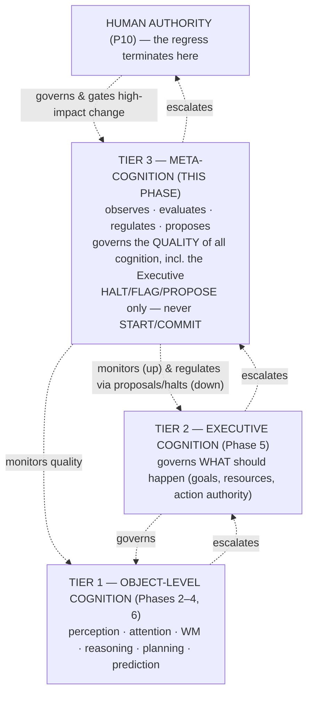
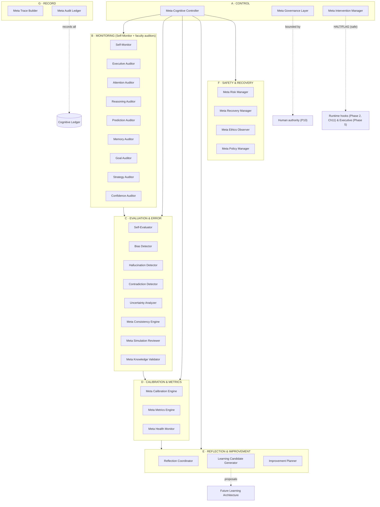
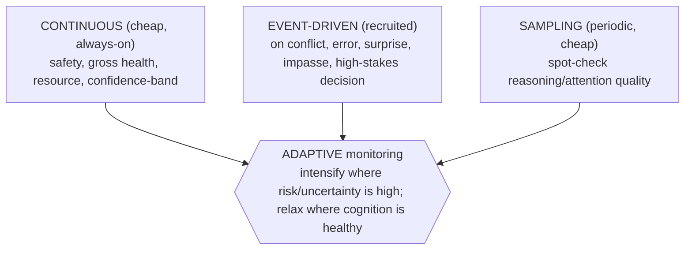
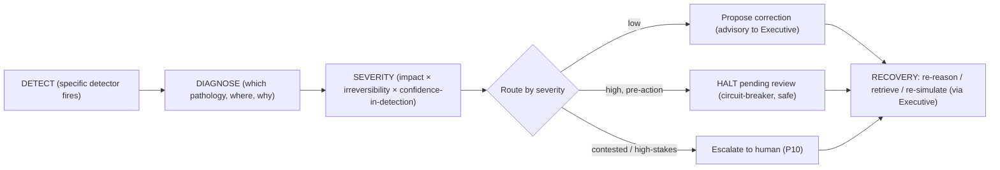
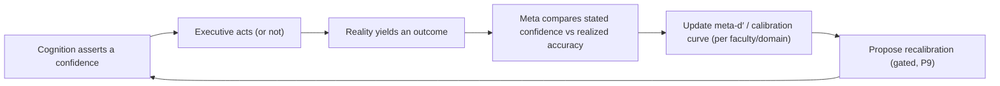
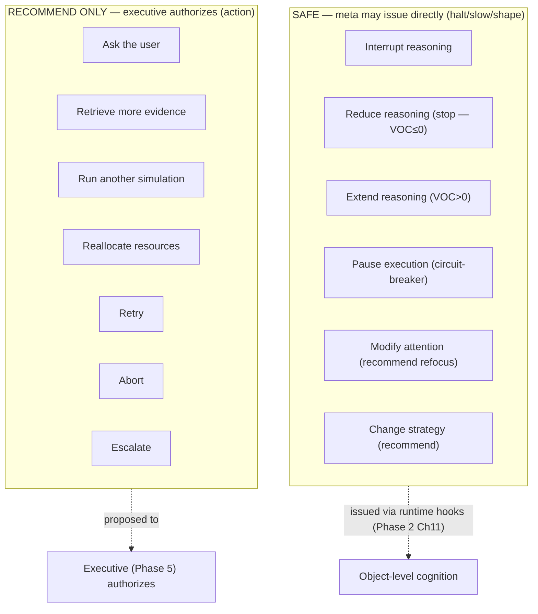
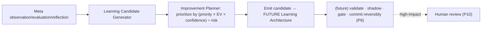

# UnityWorks Cognitive Intelligence Platform

## Phase 7 — The Meta-Cognitive Architecture

> **The Self-Regulating Mind of UnityWorks**

| | |
|---|---|
| **Phase** | 7 — Meta-Cognitive Architecture (Tier 3 of the control stack) |
| **Predecessors (frozen, constitutional)** | Phase 0 (Philosophy) · 1 (State) · 1.5 (Object Model) · 2 (Runtime) · 2.5 (Global Workspace) · 3 (Attention) · 4 (Reasoning) · 5 (Executive) · 6 (Predictive) |
| **Status** | Research-grade architectural specification. No code, no APIs, no schemas, no frameworks, no languages, no implementation. |
| **Correctness horizon** | Valid regardless of which LLM, reasoning engine, symbolic engine, or runtime UnityWorks uses in the future. |
| **Register** | A dissertation across Cognitive Science, AI, Computational Neuroscience, Executive Psychology, Decision Science, and Cognitive Systems Engineering — *why before how*, with scientific foundations, alternatives, trade-offs, and long-term evolution. |
| **Constitutional role** | The blueprint for how UnityWorks continuously **observes, evaluates, regulates, and improves the quality of its own cognition.** |

This phase **integrates with, and cannot contradict,** every frozen phase. It inherits and preserves:
**P1–P12** (Phase 0); the ten **Regions** and the **confidence currency** (Phase 1); the twelve object
kinds, **OL1–OL9** (Phase 1.5); the runtime, cognitive cycle, transactions, and the **metacognitive
hooks** of Phase 2 (Ch11); the **Conscious Field**, **CL1–CL27** (Phase 2.5); the attention economy,
**AL1–AL17** (Phase 3); the reasoning faculty, the **Reflection Architecture** (Phase 4, Ch8),
**ReL1–ReL14**; the **Executive Mind** and **ExL1–ExL30** (Phase 5, whose **ExL30 exposed the hooks this
phase attaches to**); and the predictive faculty, isolation/quarantine, **PrL1–PrL24** (Phase 6).

### The four commitments that define this phase (read first)

Meta-cognition is the most powerful and most dangerous faculty in the constitution — it is the mind
turned upon itself. Four commitments discipline it throughout, stated once here:

**(1) Meta-cognition governs the *quality* of cognition; it never *performs* cognition.** The executive
(Tier 2) governs *what should happen*; meta-cognition (Tier 3) governs *whether cognition is being done
well* — is the reasoning sound, the attention well-directed, the confidence calibrated, the conclusion
warranted? It reasons *about* reasoning, never *in place of* it. (Nelson–Narens meta-level, §0.)

**(2) Meta-cognition can HALT/FLAG/PROPOSE (always safe); it can never START/COMMIT/AUTHORIZE (that
remains the Executive's).** This asymmetry is the safety spine. Halting prevents action (safe direction);
authorizing causes action (risky direction). Meta-cognition may *slow, stop, flag, and recommend* — it may
never *act on the world* or *authorize* an action. Authority to act stays with the Executive (ExL1), and
meta-cognition **cannot bypass the Executive** (Law MeL2). Its only *direct* power is the safe one:
a circuit-breaker halt pending executive/human review.

**(3) Meta-cognition PROPOSES improvements; it never COMMITS durable change.** It generates *learning
candidates* (sent to the future Learning Architecture), *calibration adjustments*, and *strategy
recommendations* — all gated by review (P9). It cannot modify Knowledge, belief, identity, or the
constitution directly (MeL). This preserves "learning must not corrupt" (P9) at the top of the mind.

**(4) The regress terminates at human authority.** "Who watches the watcher?" — meta-cognition watches
the executive and all faculties; a bounded meta-monitoring watches meta-cognition itself; and above
meta-cognition there is only the **human** (P10). There is no Tier 4 and no infinite regress: the top of
the *cognitive* stack is meta-cognition; the top of the *authority* stack is the human. (Appendix B.)

### Position in the three-tier control stack (from Phase 5)



---

## Table of Contents

- **Fundamental Philosophy** — Why a mind must observe itself
- **Chapter 0** — Scientific Foundations of Meta-Cognition
- **Chapter 1** — The Philosophy of Meta-Cognition
- **Chapter 2** — The Complete Meta-Cognitive Architecture
- **Chapter 3** — Self-Monitoring
- **Chapter 4** — Self-Evaluation
- **Chapter 5** — Bias Detection & Cognitive Error
- **Chapter 6** — Confidence Calibration
- **Chapter 7** — Reflection
- **Chapter 8** — Meta-Cognitive Intervention
- **Chapter 9** — Cognitive Health
- **Chapter 10** — Meta-Cognitive Memory
- **Chapter 11** — Learning Candidate Generation
- **Chapter 12** — Constitutional Governance (the laws)
- **Chapter 13** — Integration
- **Chapter 14** — Future Evolution
- **Appendix A** — Consistency map to prior phases
- **Appendix B** — The regress-termination & halt-not-authorize safety case

---
---

# FUNDAMENTAL PHILOSOPHY — WHY A MIND MUST OBSERVE ITSELF

## F.1 The asymmetry between competence and reliability

A mind can be *competent* — able to reason, attend, predict, and decide — and yet *unreliable* — prone
to being confidently wrong, to drifting from its goals, to over- or under-thinking, to acting on
fabrications. Competence is the ability to produce cognition; **reliability is the ability to produce
*good* cognition consistently, and to know when one has not.** These are different properties, and the
second cannot be achieved by improving the first. A better reasoner is still a reasoner that cannot see
its own errors. Reliability requires a faculty whose entire concern is *the quality of cognition* — one
that watches the mind think and asks, continuously, *is this going well?* That faculty is meta-cognition.

## F.2 Why humans naturally perform meta-cognition

Human cognition is pervasively self-monitoring: we experience the *tip-of-the-tongue* state (knowing that
we know), *feelings of confidence* (and doubt), the *sense of having erred* (the error-related negativity
fires within ~100ms of a mistake), and the deliberate practice of *stepping back* to ask whether we are
approaching a problem correctly. This is not incidental — it is what makes human intelligence *trustable*
by its owner: we can catch ourselves, doubt ourselves, slow down when uncertain, and seek help when
stuck. A human without metacognition (as in certain frontal lesions) is not less *intelligent* in the
narrow sense — but is dramatically less *reliable*: confidently wrong, unable to catch errors,
perseverating on failed strategies. Evolution built metacognition because competence without
self-regulation is dangerous to its possessor.

## F.3 Why intelligence without self-regulation becomes unreliable — the eight failure modes

The argument for meta-cognition is best made by enumerating what happens *without* it. Each failure mode
of unregulated cognition maps to a specific meta-cognitive mechanism that prevents it:

| Failure mode (without meta) | Why it occurs | Meta-cognitive mechanism that prevents it |
|---|---|---|
| **Hallucination** | Generation asserts fluent but ungrounded content; nothing checks grounding | Hallucination Detector + evidence-grounding check (Ch5); "prediction requires evidence" (PrL11) |
| **Confirmation bias** | Reasoning seeks only confirming evidence | Bias Detector (Ch5); self-debate / disconfirmation prompts |
| **Goal drift** | The mind wanders from its committed goal under load | Goal Auditor + goal-progress monitoring (Ch3); anti goal-neglect (ExL17) |
| **Overconfidence** | Confidence uncalibrated to accuracy (Dunning–Kruger) | Confidence Calibration Engine (Ch6); meta-d' tracking |
| **Premature conclusions** | Stopping before the answer is warranted | Self-evaluation of completeness (Ch4) + "should I keep thinking?" (Ch8) |
| **Runaway reasoning** | Deliberating without end (rumination) | Anytime/value-of-computation stopping (Ch0, Ch8); Reasoning Auditor |
| **Poor resource allocation** | Spending cognition on the trivial, starving the important | Resource monitoring → reallocation recommendation to the Executive (Ch3, Ch8) |
| **Unsafe autonomy** | Committing irreversible high-stakes action without adequate self-check | Circuit-breaker halt + constitutional evaluation (Ch8, Ch12); halt-not-authorize (commitment #2) |

Read as a whole, this table *is* the case for meta-cognition: **every pathology that makes an AI
untrustworthy is a failure of cognitive self-regulation, and each has a meta-cognitive antidote.**

## F.4 Why meta-cognition is essential for trustworthy AI

Trust in an AI is not trust that it is always right — no cognition is — but trust that it *knows the
limits of its own rightness*: that it will be appropriately confident, catch its own errors, refuse to
act when it should not, and ask for help when it is out of its depth. This is precisely what
meta-cognition provides. A system that hallucinates *and cannot tell* is untrustworthy; a system that
hallucinates *but flags its own uncertainty, checks its grounding, and escalates* is trustworthy despite
imperfection. **Meta-cognition is the faculty that converts a competent-but-unreliable mind into a
competent-and-trustworthy one** — the decisive requirement for an AI that will be given real
consequences, and eventually real autonomy. It is, in the end, the architectural home of the AI's
*epistemic humility* and *self-restraint* — the two properties that make power safe.

---
---

# CHAPTER 0 — SCIENTIFIC FOUNDATIONS OF META-COGNITION

> A complete review that *justifies architecture*. For each: core idea · evidence · strengths ·
> weaknesses · engineering implication · **decision (adopt/adapt/reject)** · why. It ends with the
> UnityWorks meta-cognitive philosophy.

## 0.1 A crucial timelessness note on the "modern" entries

This review spans classical cognitive science (Flavell, Nelson–Narens) and *current* AI techniques
(Reflexion, Tree-of-Thoughts, self-consistency, debate, Constitutional AI, deliberative reasoning,
verifier/reflective systems). The classical foundations are *timeless principles*; the modern AI
techniques are *methods of a particular era*. UnityWorks' rule (to honor the 15-year horizon): **extract
the timeless principle from each modern method and adopt it as a governed strategy; reject the specific
method as the architecture.** "Reflect on failure," "evaluate intermediate steps," "consistency implies
confidence," "critique against principles," "verify with a separate process" — these principles will
outlive every 2020s technique that first popularized them. The meta-cognitive faculty *deploys* such
strategies through the reasoning engines (Phase 4, model-independent); it is *never* defined by them.

## 0.2 The foundations, compared

| # | Theory / System | Core idea | Strengths | Weaknesses | Decision |
|---|---|---|---|---|---|
| 1 | **Flavell's Meta-Cognition** | Metacognitive *knowledge* (person/task/strategy) + *monitoring* + *regulation* | Founding, comprehensive | Loose taxonomy | **Adopt** — knowledge = the self-model; monitoring+regulation = the loop |
| 2 | **Nelson & Narens Meta-Level Architecture** | Two levels; *monitoring* (object→meta) + *control* (meta→object); meta holds a model of the object level | Precise, mechanistic, the canonical framework | Abstract | **Adopt** — **the organizing principle** of the whole phase |
| 3 | **Higher-Order Thought Theory** (Rosenthal) | A state is conscious iff a higher-order representation targets it | Grounds self-awareness | Phenomenal claims contested | **Adapt** — *functional* self-awareness = higher-order representation of one's cognitive states; scope to access (Phase 2.5, App. B), reject phenomenal claims |
| 4 | **Self-Regulated Learning** (Zimmerman; Winne–Hadwin) | Cyclic *forethought → performance-monitoring → self-reflection → adjustment* | Strong educational evidence | Learner-centric | **Adopt** — the SRL cycle *is* the meta-regulation loop |
| 5 | **Executive Monitoring** | Ongoing supervision of goal-directed behavior | Well-evidenced | Overlaps executive | **Adapt** — meta monitors the *executive itself* (a higher altitude than Phase 5's own monitor) |
| 6 | **Error Monitoring** (ERN) | The brain detects its own errors rapidly; post-error slowing | Robust neural signature | Detection ≠ correction | **Adopt** — self-monitor error detection + "slow down after error" intervention |
| 7 | **Cognitive Control** | Goal-driven regulation recruited by conflict | Central | Broad | **Adopt** — conflict/error recruits meta control (with Botvinick) |
| 8 | **Adaptive Control Theory** | A feedback controller that adapts its own parameters | Rigorous control-systems grounding | Engineering, not cognitive | **Adapt** — meta as an *adaptive meta-controller* over the executive controller |
| 9 | **Predictive Coding** | Prediction error as the universal learning/monitoring signal | Unifying | Heavy if literal | **Adapt** — prediction-error *rate* is a monitoring signal for cognitive health |
| 10 | **Active Inference** | Minimize expected surprise (about the world *and* oneself) | Unifies monitoring + control | Abstract/intractable | **Adapt** — the framing (monitor & reduce self-uncertainty); reject the literal runtime |
| 11 | **Confidence Calibration** (Fleming & Lau; meta-d′) | *Metacognitive sensitivity*: how well confidence tracks accuracy | Quantifiable; rigorous | Needs ground truth | **Adopt** — meta is the **calibration authority**; meta-d′ is the calibration metric |
| 12 | **Performance Monitoring** | Continuous evaluation against goals | Enables correction | — | **Adopt** — a core monitoring dimension |
| 13 | **Human Self-Reflection** (Schön) | *Reflection-in-action* vs *reflection-on-action* | Explains real practice | Descriptive | **Adopt** — in-action = live monitoring; on-action = retrospective reflection (Ch7) |
| 14 | **Cognitive Flexibility** | Adaptive strategy/set switching | Explains de-fixation | Switch cost | **Adopt** — meta detects rigidity → recommends strategy switch |
| 15 | **Self-Explanation** (Chi) | Explaining to oneself exposes gaps and improves understanding | Strong learning effect | Effortful | **Adopt** — self-explanation as a gap-detection & explainability mechanism |
| 16 | **Self-Correction** | Detecting and repairing one's own errors | Essential for reliability | Can over-correct | **Adopt** — as *proposal*, gated (never silent self-edit) |
| 17 | **Human Error Recovery** | Structured recovery after detected error | Realistic | Domain-specific | **Adopt** — the Meta Recovery pattern (Ch2) |
| 18 | **Metareasoning (AI)** (Cox & Raja) | *Reasoning about reasoning* — the object/meta reasoning loop | The AI foundation | Overhead | **Adopt** — the AI-native articulation of Nelson–Narens |
| 19 | **Rational Meta-Reasoning** (Russell & Wefald; Lieder & Griffiths) | Allocate computation by its *value* (value-of-computation) | Principled stopping/continuing | Estimating VOC is hard | **Adopt** — the "should I keep thinking?" economics (Ch8) |
| 20 | **Anytime Algorithms** (Dean & Boddy; Zilberstein) | A valid answer at any time, improving with more time | Interruptible cognition | Quality profile needed | **Adopt** — the mechanism for *stopping when good enough* |
| 21 | **Bounded Rationality** (Simon) | Real regulators satisfice under limits | Realistic | Less crisp | **Adopt** — **meta is itself bounded**; it satisfices its own monitoring |
| 22 | **SOAR Meta-Level Reasoning** | Impasse → meta-level subgoaling | Concrete trigger | Complexity | **Adapt** — impasse recruits meta engagement |
| 23 | **ACT-R Monitoring** | Utility learning over strategies | Concrete strategy evaluation | Narrow | **Adapt** — utility/efficacy tracking of strategies (feeds Ch11) |
| 24 | **Modern LLM Self-Reflection** (general) | Prompt the model to critique/revise its output | Cheap, effective in practice | Uncalibrated; not a faculty; method-of-the-era | **Adapt** — the *principle* (self-critique) as a governed strategy; **reject** "just prompt it" as the architecture |
| 25 | **Constitutional AI** (Anthropic) | Critique/revise outputs against explicit principles | Scalable oversight; safety-aligned | Principle-dependent | **Adopt** — evaluate cognition **against the UnityWorks constitution** (the frozen laws) — a direct, powerful tie-in |
| 26 | **Debate-based reasoning** (Irving et al.) | Adversarial argument surfaces flaws for a judge | Surfaces hidden errors | Can rationalize | **Adapt** — self-debate as a *high-stakes evaluation strategy* (Phase 4, Ch5) |
| 27 | **Self-Consistency** (Wang et al.) | Sample many reasoning paths; consistency ⇒ confidence | Simple, robust signal | Compute cost | **Adapt** — *consistency across paths* as a confidence/contradiction signal (Ch5, Ch6) |
| 28 | **Tree of Thoughts** (Yao et al.) | Deliberate search with *self-evaluation* of steps | Step-level self-monitoring | Compute cost | **Adapt** — step-level self-evaluation = live monitoring of reasoning (Ch3) |
| 29 | **Reflexion** (Shinn et al.) | Verbal self-reflection on failure, stored to improve future attempts | Effective self-improvement loop | Memory management | **Adapt** — reflect-on-failure → **meta-memory (Ch10)** → **learning candidate (Ch11)**; lessons are *gated candidates*, not direct writes |
| 30 | **Voyager** (Wang et al.) | Lifelong self-verification + skill-library building via self-curriculum | Open-ended improvement | Task-specific | **Adapt** — self-verification + candidate skills → **learning proposals**; the skill library is the *future Learning Architecture's* concern |
| 31 | **Deliberative reasoning research** (o-series-style; deliberative alignment) | Allocate deliberation to *checking against policy/safety before answering* | Aligns deliberation with safety | Costly | **Adopt** — the *principle* of deliberation-for-verification/safety, model-independently |
| 32 | **Reflective/verifier systems** (process-reward & verifier models) | A *separate* process verifies the reasoning process | Decouples generation from verification | Verifier quality | **Adopt** — a *separate meta-evaluator/verifier faculty* (not a specific model) — the anti-"trust the generator" principle |

## 0.3 Deep dives on the pillars

**Nelson–Narens (adopt — the organizing principle).** The meta-level maintains a *model of the
object-level* and relates to it by two flows: **monitoring** (object-level state informs the meta-level)
and **control** (the meta-level modifies the object-level). This is the exact shape of UnityWorks'
meta-cognition: the faculty holds a *self-model* of the mind's cognition (Ch10), it *monitors* all
faculties (Ch3), *evaluates* against a model of good cognition (Ch4), and *controls* by regulation —
but, per commitment #2, its "control" is the *safe* subset (halt/flag/propose), with authorization
remaining the executive's. Nelson–Narens gives the architecture its two-flow skeleton; UnityWorks adds
the safety asymmetry the original never needed.

**Flavell + Self-Regulated Learning (adopt — knowledge + the regulation cycle).** Flavell's
*metacognitive knowledge* (about oneself, tasks, and strategies) is UnityWorks' **self-model** (Ch10):
what the mind knows about its own capabilities, limits, biases, and calibration. Zimmerman's SRL cycle —
*forethought → monitoring → reflection → adjustment* — is the meta-regulation loop (Ch3–8): plan how to
approach, monitor the approach, reflect on the outcome, adjust future approaches. Together they supply the
*content* (self-knowledge) and the *process* (the cycle) of self-regulation.

**Rational Meta-Reasoning + Anytime + Bounded Rationality (adopt — the "should I keep thinking?"
economics).** The single most operationally important cluster. It answers the questions the mission
foregrounds — *am I overthinking? underthinking? should I stop?* — with a principle: continue reasoning
only while the *value of computation* (expected improvement in the answer) exceeds its cost; treat
cognition as *anytime* (a usable answer exists at every moment, improving with more thought); and accept
that the meta-level is *itself bounded* (it cannot perfectly estimate VOC, so it satisfices its own
monitoring). This is how meta-cognition prevents both premature conclusions and runaway reasoning — and it
is fully consistent with Phase 4's reasoning economy and Phase 3's resource economy.

**Confidence Calibration / meta-d′ (adopt — the calibration authority).** *Metacognitive sensitivity* —
how well one's confidence discriminates one's correct from incorrect judgments — is measurable (meta-d′)
and improvable. UnityWorks makes meta-cognition the **single calibration authority** over the confidence
currency (Phase 1, Ch6): it tracks stated-confidence-vs-realized-accuracy across all faculties, detects
over/under-confidence, and recalibrates (Ch6). This is the mechanism that makes UnityWorks *appropriately*
confident — the property F.4 identified as the essence of trust.

**Constitutional AI + Deliberative/Verifier systems (adopt — principle-guided, separated evaluation).**
Two modern insights are load-bearing and, importantly, *safety* insights. First (Constitutional AI):
cognition can be *evaluated against an explicit set of principles* — and UnityWorks *already has* such a
set: the frozen constitutional laws (P/OL/RL/CL/AL/ReL/ExL/PrL). Meta-cognition evaluates cognition
against the constitution, giving the abstract laws a *live enforcement mechanism*. Second (verifier /
deliberative): the *evaluator must be separate from the generator* — a mind must not be trusted to grade
its own homework with the same process that produced it. UnityWorks therefore makes meta-evaluation a
*distinct faculty* (not the reasoning that produced the conclusion), and often deploys a *different
strategy or engine* to verify than to generate (the "verify-then-trust" strategy, Phase 4, Ch5). These two
adopted principles are precisely what current frontier-lab research converges on for *scalable oversight*
— and UnityWorks bakes them into architecture rather than leaving them to prompting.

## 0.4 The UnityWorks meta-cognitive philosophy

> UnityWorks meta-cognition is a **bounded, higher-order (Tier 3) faculty** implementing the
> **Nelson–Narens** monitoring↔control loop over a **behaviorally-grounded self-model** (Flavell
> knowledge, built from the Ledger — never from unreliable introspection), running the **self-regulated
> learning** cycle, governing deliberation by **rational meta-reasoning** economics (anytime,
> value-of-computation), serving as the **calibration authority** (meta-d′), detecting **bias, error,
> hallucination, and contradiction**, evaluating all cognition **against the frozen constitution**
> (Constitutional-AI principle) through a **separated evaluator/verifier** (not the generator), and
> deploying modern self-reflection **patterns as governed, model-independent strategies.** Critically, it
> **governs quality but never performs cognition**, can **halt/flag/propose but never start/commit/
> authorize**, **proposes improvements but never commits durable change**, **cannot alter the
> constitution**, and **terminates the control regress at human authority.** It is the mind's conscience,
> quality-assurance, and self-restraint — the faculty that makes a competent mind *trustworthy*.

---
---

# CHAPTER 1 — THE PHILOSOPHY OF META-COGNITION

## 1.1 What meta-cognition is

Meta-cognition is the mind's faculty for **cognition about cognition** — the continuous observation,
evaluation, and regulation of the *quality* of the mind's own thinking. It is *second-order*: its object
is not the world (that is object-level cognition) nor the mind's goals-and-resources (that is the
executive) but *cognition itself* — its soundness, calibration, completeness, cost, and safety. It is the
faculty that answers the mission's questions: *Am I reasoning correctly? Attending to the right things?
Overthinking? Too confident? Should I stop, ask, retrieve more, simulate again, revise, or reject my own
conclusion?*

## 1.2 What meta-cognition is not

- It is **not another reasoning system** — it does not solve the object-level problem; it judges whether
  the object-level solving is going well.
- It is **not a second executive** — it does not own goals, allocate resources, or authorize action; it
  observes the executive doing so and evaluates *how well* it is done.
- It is **not consciousness** — consciousness is the bounded broadcast (Phase 2.5); meta-cognition is a
  *consumer and evaluator* of what is conscious, and a *regulator* of the processes that fill it.
- It is **not learning** — it *identifies what should be learned* (candidates), but the future Learning
  Architecture *commits* the change (P9). Meta proposes; learning disposes.
- It is **not a homunculus** — like the executive (Phase 5, App. B), it is *decomposed into mechanisms*
  (Ch2), *uses the reasoning faculty* to evaluate, and is *bounded and governed from above* (by the
  human).

## 1.3 The twelve distinctions

| Concept | What it is | How it differs from meta-cognition |
|---|---|---|
| **Reasoning** | First-order inference (Phase 4) | Meta reasons *about* reasoning, never solves the object problem |
| **Reflection** | Retrospective evaluation of a completed episode (Phase 4, Ch8) | Reflection is *one process within* meta (the retrospective one); meta also monitors *live* and regulates |
| **Prediction** | Imagining futures (Phase 6) | Meta evaluates whether predictions are calibrated / whether the mind over/under-simulates |
| **Executive Cognition** | Governs *what should happen* (Phase 5) | Meta governs the *quality* of cognition, including the executive's own quality |
| **Learning** | Durable, validated change (future phase) | Meta *proposes* candidates; learning *commits* them |
| **Consciousness** | The bounded broadcast (Phase 2.5) | Meta consumes and regulates it; it is not the broadcast |
| **Self-awareness** | A model of one's own cognitive states (functional) | The self-model is *meta's knowledge base* (Ch10); self-awareness is meta's *representation*, not meta itself |
| **Monitoring** | Observing cognition (object→meta) | *One flow* of meta (Nelson–Narens); meta also evaluates & controls |
| **Control** | Regulating cognition (meta→object) | *One flow* of meta — and only the *safe subset* (halt/flag/propose) here |
| **Self-regulation** | Monitoring + control together | The *core loop* of meta (SRL cycle) |
| **Self-improvement** | Getting durably better over time | Meta *proposes* improvements; learning *realizes* them (gated) |
| **Self-evaluation** | Judging the quality of one's cognition | *One activity* of meta (Ch4); meta also monitors, regulates, calibrates |

## 1.4 Why meta-cognition is an independent faculty

Because *evaluating the quality of cognition is a distinct competence from performing cognition, and it
must be structurally separated from what it evaluates.* Three arguments:

1. **The verifier-generator separation (§0.3).** A process cannot reliably grade its own output with the
   same process that produced it — the errors that produced a flawed conclusion also blind the process to
   the flaw. Reliable self-evaluation *requires* a separate faculty (often a different strategy/engine).
2. **The altitude argument.** Monitoring *whether reasoning is sound* is a second-order concern that no
   first-order faculty is positioned to see — the reasoner is *inside* the reasoning; meta is *above* it.
3. **The safety argument.** The faculty that can *halt* the mind and *flag* its errors must be
   *independent* of the faculties it halts — or the mind could suppress its own alarms. Meta-cognition's
   independence is what makes it a *trustworthy* self-check rather than a self-serving rationalizer.

Merging meta into reasoning (a "reflective reasoner") re-creates exactly the failure it exists to
prevent: a mind grading its own homework. Meta-cognition must be its own faculty for the same reason a
courtroom separates the advocate from the judge.

---
---

# CHAPTER 2 — THE COMPLETE META-COGNITIVE ARCHITECTURE

## 2.1 The subsystem, in seven functional clusters

Meta-cognition is decomposed into ~32 components (the anti-homunculus commitment), grouped into seven
clusters. Each component has one responsibility (OL1), is independently replaceable (P6/OL8), and obeys
the four commitments (governs-not-performs; halt-not-authorize; propose-not-commit; regress terminates at
human).



## 2.2 The components

Presented by cluster. For each: **purpose · key responsibilities · boundary · why it cannot be merged**
(inputs/outputs/lifecycle/failure/recovery summarized where space demands; all obey the four commitments).

### Cluster A — Control

- **Meta-Cognitive Controller.** *Purpose:* orchestrate the meta loop (monitor→evaluate→regulate) and the
  SRL cycle. *Boundary:* it coordinates; it performs no object cognition and authorizes no action. *Why
  not merged:* the coordinator of self-regulation must be separable from the mechanisms it sequences
  (as the Executive Controller is, Phase 5).
- **Meta Governance Layer.** *Purpose:* enforce the four commitments and the meta-laws (Ch12); the seat of
  meta's *bounded* authority; the interface to human authority. *Boundary:* it governs meta's own conduct;
  it cannot exceed its bounds. *Why not merged:* the guardian of meta's constitutional limits must be
  distinct from meta's active machinery (separation of powers).
- **Meta Intervention Manager.** *(Ch8.)* Issues the *safe* interventions (halt/flag/recommend) through
  the runtime/executive hooks. *Boundary:* halt/flag/propose only — never authorize (commitment #2). *Why
  not merged:* intervention is the one place meta touches the object level; it must be a single, audited,
  power-limited chokepoint.

### Cluster B — Monitoring (the Self-Monitor and eight faculty auditors)

- **Self-Monitor.** *Purpose:* continuous, cross-cutting observation of overall cognition (Ch3). *Why not
  merged:* the global view is distinct from any single faculty audit.
- **Executive / Attention / Reasoning / Prediction / Memory / Goal / Strategy / Confidence Auditors.**
  *Purpose:* each observes and assesses the *quality* of one faculty's cognition — e.g., the Reasoning
  Auditor watches for circular reasoning and unsupported conclusions; the Attention Auditor for fixation
  and capture; the Prediction Auditor for mis-calibration and over/under-simulation; the Goal Auditor for
  drift/neglect; the Executive Auditor for governance quality (the higher-altitude check Phase 5's own
  monitor cannot impartially perform). *Boundary:* each *audits quality*; none performs or governs the
  faculty. *Why they cannot be merged:* each faculty has *distinct quality criteria and failure modes*
  (circular reasoning ≠ attentional fixation ≠ prediction mis-calibration); a single monitor would blur
  them and lose the specificity that makes detection actionable. Auditors are *specialists in a faculty's
  characteristic pathologies.*

### Cluster C — Evaluation & Error

- **Self-Evaluator.** *(Ch4.)* Scores the quality of cognition across dimensions. *Why not merged:*
  evaluation (scoring quality) is distinct from monitoring (observing) and from error-detection (finding
  specific faults).
- **Bias Detector.** *(Ch5.)* Detects systematic cognitive biases. *Why not merged:* biases are
  *systematic patterns*, distinct from one-off errors or contradictions.
- **Hallucination Detector.** *(Ch5.)* Detects ungrounded assertions (claims without evidence). *Why not
  merged:* grounding-failure is a distinct pathology (assertion vs evidence) from bias or contradiction —
  and the most safety-critical one.
- **Contradiction Detector.** Detects internal inconsistencies (a claim conflicting with another or with
  belief). *Why not merged:* contradiction (logical inconsistency) ≠ hallucination (missing grounding) ≠
  bias (skewed process).
- **Uncertainty Analyzer.** Types and quantifies what the mind does *not* know (epistemic vs aleatoric).
  *Why not merged:* uncertainty (absence of knowledge) is distinct from confidence (degree of belief).
- **Meta Consistency Engine.** Checks cognition for coherence over *time and across contexts* (not just
  within an episode) — e.g., "did I contradict what I concluded yesterday?" *Why not merged:* cross-time
  consistency is a distinct scope from the within-episode Contradiction Detector.
- **Meta Simulation Reviewer.** Reviews the *quality* of predictive cognition (Phase 6) — were the right
  futures simulated? was isolation/quarantine honored? *Why not merged:* simulation quality is a distinct
  concern requiring knowledge of the predictive faculty's discipline (PrL).
- **Meta Knowledge Validator.** Assesses whether *knowledge/beliefs* used in cognition are adequately
  grounded and current (an evidence-quality check) — *proposing* re-verification, never editing Knowledge
  (MeL). *Why not merged:* validating *evidence quality* differs from detecting *reasoning* errors.

### Cluster D — Calibration & Metrics

- **Meta Calibration Engine.** *(Ch6.)* The calibration authority (meta-d′). *Why not merged:* calibration
  (aligning confidence to accuracy) is a distinct, cross-cutting authority.
- **Meta Metrics Engine.** Computes the quantitative indicators of cognitive quality (the raw measures
  Health and Evaluation consume). *Why not merged:* measurement is distinct from evaluation/scoring
  (metrics are inputs; evaluation is judgment).
- **Meta Health Monitor.** *(Ch9.)* Aggregates metrics into cognitive-health indicators and trends. *Why
  not merged:* health (aggregate, trend-based) differs from momentary metrics and from per-faculty audit.

### Cluster E — Reflection & Improvement

- **Reflection Coordinator.** *(Ch7.)* Schedules and scopes reflection episodes (coordinating the
  Reflection process of Phase 4, Ch8). *Why not merged:* coordinating *when/how deep* to reflect is
  distinct from performing the reflection and from live monitoring.
- **Learning Candidate Generator.** *(Ch11.)* Turns evaluations/reflections into gated learning proposals.
  *Why not merged:* generating *proposals for durable change* is the boundary to the future Learning
  Architecture and must be a distinct, controlled emitter (P9).
- **Improvement Planner.** Prioritizes and sequences candidate improvements (what to improve first, at
  what risk). *Why not merged:* prioritizing improvements is distinct from generating them.

### Cluster F — Safety & Recovery

- **Meta Risk Manager.** Assesses the risk that *cognition itself* poses (e.g., "this reasoning is about
  to drive an irreversible action on shaky grounds"). *Why not merged:* cognitive-process risk differs
  from the object-level risk of Phase 6, Ch5.
- **Meta Recovery Manager.** Governs recovery from *cognitive* failure (a detected hallucination mid-answer,
  a contradiction) — recommending rollback/re-reasoning to the executive. *Why not merged:* recovery is
  distinct from detection and from intervention.
- **Meta Ethics Observer.** Observes cognition for bearing on values/safety/ethics, evaluating against the
  constitution's safety laws — *flagging and escalating*, never overriding. *Why not merged:* the ethical
  dimension is distinct and must be an *always-on, non-suppressible* observer (a dedicated conscience).
- **Meta Policy Manager.** Manages meta's own operating policies (monitoring frequency, intervention
  thresholds), which *evolve only by gated review* (P9). *Why not merged:* meta's *own* policy is distinct
  from the executive's policy (Phase 5, Ch7).

### Cluster G — Record

- **Meta Trace Builder.** Records the meta-cognitive process itself (what was monitored/evaluated/why) —
  so meta is as explainable as the cognition it evaluates. *Why not merged:* the trace of *self-regulation*
  is distinct from the object-level reasoning trace (Phase 4).
- **Meta Audit Ledger.** Guarantees every meta act (evaluation, intervention, proposal) is observable and
  auditable in the Cognitive Ledger (P4, MeL). *Why not merged:* auditability of *the self-regulator* must
  be structurally independent of it (so meta cannot quietly shape its own record).

## 2.3 Why ~32 components, decomposed

The count is the minimum in which (a) *each faculty's characteristic pathology* has a specialist auditor,
(b) *each distinct error type* (bias vs hallucination vs contradiction vs inconsistency) has a dedicated
detector, and (c) the *safety boundaries* (intervention chokepoint, ethics observer, audit ledger,
governance layer, human interface) are dedicated rather than diffused. Decomposition is again the
anti-homunculus commitment: a meta-faculty built from one opaque "self-awareness" box would be a
homunculus watching a screen; built from thirty-two inspectable mechanisms, it is an *auditable
architecture* — which is precisely what a *self-watching* faculty must be, since the alternative is a mind
whose self-checks cannot themselves be checked.

---
---

# CHAPTER 3 — SELF-MONITORING

## 3.1 The monitoring flow (Nelson–Narens' upward flow)

Self-monitoring is the *object→meta* information flow: the continuous, low-cost observation by which
meta-cognition builds and updates its model of how cognition is going. It reads the runtime's observation
surface (Phase 2, Ch11) and the Ledger — **not** unreliable introspection (the Nisbett–Wilson caution:
the mind's *reports* of its own processing are often confabulated; therefore the self-model is grounded
in *observed behavior/traces*, not in asking the mind "what were you thinking?").

## 3.2 What is monitored

| Monitored dimension | The quality question | Owning auditor |
|---|---|---|
| **Reasoning quality** | Sound? grounded? non-circular? converging? | Reasoning Auditor |
| **Attention quality** | Focused on the right things? fixated? captured? | Attention Auditor |
| **Executive decisions** | Well-justified? well-calibrated? within policy? | Executive Auditor |
| **Goal progress** | Advancing? drifting? neglected? | Goal Auditor |
| **Memory quality** | Beliefs grounded? current? consistent? | Memory Auditor |
| **Prediction quality** | Calibrated? right futures? over/under-simulating? | Prediction Auditor |
| **Resource consumption** | Proportional? runaway? starving something? | Self-Monitor + Metrics |
| **Conversation quality** | Coherent? responsive? isolated across contexts? | Self-Monitor |
| **Knowledge quality** | Adequately grounded and current? | Meta Knowledge Validator |
| **Safety** | Any bearing on safety constraints? | Meta Ethics Observer (always-on) |
| **Performance** | Meeting expectations? | Metrics + Health |
| **Trustworthiness** | Appropriately confident? honest about limits? | Confidence Auditor + Calibration |
| **Latency** | Timely for the stakes? | Self-Monitor |
| **Confidence / Completeness / Consistency** | Calibrated / thorough / coherent? | Confidence Auditor / Self-Evaluator / Consistency Engine |

## 3.3 Monitoring strategies — frequency and cost

Monitoring is *itself* bounded (meta is bounded, §0.3): it cannot examine everything continuously without
becoming a cost greater than the cognition it watches. So it uses a *tiered* strategy:



- **Continuous monitoring** — the cheap, always-on watch over safety, gross cognitive health, resource
  burn, and confidence bands. Never suspended (the safety floor).
- **Event-driven monitoring** — *recruited* by conflict, error (ERN-style), surprise (prediction error),
  impasse, or a high-stakes/irreversible decision. This is the primary mode (matching conflict-monitoring
  theory): meta engages *intensely* exactly when cognition is most likely to be going wrong.
- **Sampling** — periodic cheap spot-checks of reasoning/attention quality even when nothing has fired
  (catches slow drift that no single event triggers).
- **Adaptive monitoring** — the meta-level *scales its own intensity* by risk and uncertainty: it watches
  a high-stakes, low-confidence, novel matter closely and a routine, high-confidence, familiar matter
  lightly. Adaptive intensity is how meta stays *bounded* while still catching what matters — proportional
  self-regulation (P5 applied to meta itself).

## 3.4 Why grounded in traces, not introspection

- **Rejected: self-monitoring by introspection** ("ask the mind what it's doing"). *Disadvantage:*
  Nisbett–Wilson — introspective reports are frequently confabulated; a mind asked why it did something
  often *invents* a plausible reason. Trusting introspection would let meta-cognition be *systematically
  fooled by the very mind it monitors.* *Violates:* the reliability that is meta's whole purpose.
- **Adopted: monitoring grounded in the Ledger** (observed events, decisions, traces). Meta watches what
  the mind *did*, not what it *says* it did — the only trustworthy basis for self-observation.

---
---

# CHAPTER 4 — SELF-EVALUATION

## 4.1 Evaluation vs monitoring

Monitoring *observes*; evaluation *judges*. Self-evaluation takes the monitored signals and produces a
graded assessment of cognitive quality — with its own confidence and uncertainty (meta-cognition is
honest about the reliability of its *own* judgments, or it would merely relocate the overconfidence
problem).

## 4.2 Evaluation dimensions and criteria

| Dimension | Criterion (what "good" means) |
|---|---|
| **Soundness** | Conclusions follow from grounded premises (no circularity, no unsupported leaps) |
| **Groundedness** | Claims are backed by evidence (anti-hallucination) |
| **Calibration** | Confidence matches realized accuracy (meta-d′) |
| **Completeness** | The relevant considerations were addressed (not premature) |
| **Consistency** | No internal contradiction; coherent with prior cognition |
| **Efficiency** | Cognition was proportional to stakes (not over/under-thought) |
| **Safety** | No violation of, or unexamined bearing on, safety constraints |
| **Appropriateness** | The right *kind* of cognition was applied (right reasoning type/strategy) |

## 4.3 Scoring, confidence, history, trends, and self-comparison

- **Scoring** produces a graded quality assessment per dimension (banded, not falsely precise).
- **Evaluation confidence & uncertainty** qualify each score — meta may be *unsure* whether cognition was
  sound, and it says so (this is itself a monitored quality).
- **Evaluation history & trends** live in Meta-Cognitive Memory (Ch10): the mind tracks *how its cognitive
  quality changes over time* — improving? degrading? drifting?
- **Self-comparison / historical comparison** — the mind compares current cognition to *its own past*
  ("am I reasoning better than last month? is my calibration improving?"), which is the raw material for
  self-improvement (Ch11) and cognitive-health trending (Ch9).

## 4.4 Why self-evaluation differs from external evaluation

External evaluation (a user's feedback, a downstream outcome) is *ground truth from outside* — accurate
but *sparse, delayed, and often absent*. Self-evaluation is *internal, immediate, and always available* —
but *fallible* (a mind can misjudge its own quality; that is the Dunning–Kruger risk). UnityWorks uses
both and *reconciles* them: external evaluation, when it arrives, *calibrates* self-evaluation (Ch6) —
teaching the mind how accurate its self-assessments actually are. Self-evaluation is the *dense, live*
signal that lets the mind regulate moment-to-moment; external evaluation is the *sparse, authoritative*
signal that keeps self-evaluation honest. Neither suffices alone; their reconciliation is what makes
self-evaluation *trustworthy over time* rather than self-serving.

---
---

# CHAPTER 5 — BIAS DETECTION & COGNITIVE ERROR

## 5.1 Why explicit error detection

The failure modes of F.3 do not announce themselves; a biased or hallucinating mind *feels* confident.
Detection must therefore be *active and specific* — a dedicated detector for each characteristic
pathology, because each has a distinct signature and a distinct remedy.

## 5.2 The pathology taxonomy — signature and remedy

| Pathology | Signature (how meta detects it) | Remedy (meta's proposal) |
|---|---|---|
| **Confirmation bias** | Evidence gathered is one-sided; disconfirming evidence unsought | Recommend seeking disconfirmation / self-debate |
| **Anchoring** | Conclusion over-weighted toward the first estimate | Recommend re-estimation from a different starting point |
| **Availability bias** | Judgment driven by easily-recalled instances | Recommend base-rate/evidence check |
| **Recency bias** | Recent inputs dominate over relevant older ones | Recommend broadening the evidence window |
| **Overconfidence** | Confidence exceeds calibrated accuracy (meta-d′) | Recommend verification / lower the confidence |
| **Underconfidence** | Confidence below calibrated accuracy | Recommend trusting the conclusion / stop over-checking |
| **Goal fixation / tunnel vision** | Attention locked; alternatives unconsidered | Recommend broadening attention / considering alternatives |
| **Hallucination** | Assertion lacks grounding evidence in the trace | HALT the assertion; require grounding or flag as ungrounded |
| **Contradiction** | A claim conflicts with another or with belief | Flag; route to truth-maintenance/arbitration |
| **Circular reasoning** | A conclusion appears among its own premises | Flag; require independent grounding |
| **Insufficient evidence** | Conclusion strength exceeds evidence strength | Recommend more retrieval / lower confidence |
| **Weak assumptions** | A load-bearing assumption is unvalidated (flagged, Phase 4) | Recommend validating or testing via counterfactual (Phase 6, Ch4) |
| **Unsupported conclusions** | The inference chain has a gap | Flag the gap; require closure |
| **Reasoning shortcuts** | System-1 used where stakes demand System-2 | Recommend deeper deliberation (extend reasoning) |
| **Premature decisions** | Committed before completeness threshold | Recommend "keep thinking" (VOC still positive) |

## 5.3 Detection → diagnosis → severity → recovery → escalation



The severity-scaled routing is the key discipline: **low-severity errors are handled by advisory
proposals** (meta recommends; the executive acts), **high-severity errors about to drive irreversible
action trigger the circuit-breaker halt** (safe — it prevents action, never causes it), and **contested
or high-stakes cases escalate to the human** (P10). Note that even the strongest meta power (HALT) is on
the *safe side* of the halt-not-authorize asymmetry: detecting a hallucination lets meta *stop* the
answer, never *fabricate* a replacement (MeL: meta cannot fabricate evidence).

---
---

# CHAPTER 6 — CONFIDENCE CALIBRATION

## 6.1 Meta-cognition is the calibration authority

The confidence currency was established in Phase 1 (Ch6) and used everywhere since. **Meta-cognition owns
its calibration** — the alignment of *stated confidence* with *realized accuracy* across the whole mind.
This is the single most important quantitative function of meta-cognition, because *calibrated confidence
is the operational definition of trustworthiness* (F.4): a mind whose 70%-confident claims are right ~70%
of the time can be trusted to act autonomously within its confidence; one whose confidence is
uncorrelated with accuracy cannot be trusted at all.

## 6.2 The calibration mechanisms

| Mechanism | What it does |
|---|---|
| **Measurement** | Track, per faculty and per domain, stated confidence vs realized accuracy (meta-d′; calibration curves) |
| **Correction** | Recommend confidence adjustments where systematically mis-calibrated (a *proposal*, gated) |
| **Drift detection** | Detect when calibration *degrades over time* (e.g., a domain shifts and old confidence no longer holds) |
| **Decay handling** | Confidence in old conclusions decays; meta enforces re-verification before high-stakes reuse (Phase 6, Ch7) |
| **Recalibration** | Update the confidence-estimation of faculties/engines from accumulated outcome data (a learning candidate, Ch11, gated) |
| **Overconfidence detection** | Flag where confidence exceeds accuracy (Dunning–Kruger guard) → recommend verification |
| **Underconfidence detection** | Flag where confidence trails accuracy → recommend trusting the conclusion (over-checking wastes budget) |

## 6.3 Confidence evolution and the calibration loop

Confidence is not static; it *evolves* as outcomes accrue. The calibration loop is the mind's slow,
outcome-grounded self-tuning of its own certainty:



Crucially, calibration is a *proposal* pipeline (P9): meta *detects* mis-calibration and *proposes*
recalibration, but the durable change is gated by review — meta cannot silently rewrite the mind's
confidence machinery (that would be an unaudited self-modification). Over time, this loop makes UnityWorks
*progressively better calibrated* — the trajectory from a competent-but-overconfident young mind to a
competent-and-appropriately-humble mature one.

---
---

# CHAPTER 7 — REFLECTION

## 7.1 Reflection within meta-cognition

Phase 4 (Ch8) established Reflection as a first-class faculty that evaluates a *completed* episode and
*proposes* improvements (never commits). Phase 7 places reflection *within* the meta-cognitive faculty as
its **retrospective mode** (Schön's *reflection-on-action*), complementing the **live mode** (monitoring;
*reflection-in-action*). The Reflection Coordinator (Ch2) schedules and scopes it. Everything Phase 4
established is preserved; this chapter adds the meta-level coordination around it.

## 7.2 The reflection controls

| Control | Specification |
|---|---|
| **Triggers** | Episode close; large prediction error (surprise); detected error/bias; executive/meta demand; idle time (offline reflection, Phase 2, Ch4.5) |
| **Depth** | Proportional to stakes/surprise (shallow confirmation for routine; deep post-mortem for costly failure) — VOC-bounded |
| **Scope** | A single decision, an episode, a cross-episode pattern, or the executive's governance quality |
| **Checkpoints** | Reflection replays from the Ledger at logical-time checkpoints (Phase 1.5, Ch10; Phase 2, Ch8) |
| **Outcomes** | Structured findings: what went well/badly, attributed to which decisions/beliefs/strategies |
| **Proposals** | Candidate improvements → Learning Candidate Generator (Ch11); calibration updates → Ch6 |
| **History** | Reflection outcomes stored in Meta-Cognitive Memory (Ch10) for trend analysis |
| **Confidence** | Each reflection carries confidence; low-confidence findings do not drive high-impact proposals |
| **Replay** | Any reflection can be re-run from the Ledger (determinism, RL8) for audit or re-analysis |

## 7.3 The inviolable boundary (restated and enforced)

> **Reflection never directly modifies cognition.** It *proposes*. (Phase 4, Ch8; MeL.)

This is the same boundary as Phase 4, now enforced at the meta level: reflection — the most tempting place
to "just fix it" — is architecturally *forbidden* from committing durable change. It emits candidates;
Learning (a future phase) validates, gates, and commits reversibly (P9). Separating *proposing* from
*disposing* is what guarantees no reflection, however wrong, can silently corrupt the mind. Reflection is
the conscience; it advises, it does not operate.

---
---

# CHAPTER 8 — META-COGNITIVE INTERVENTION

## 8.1 The intervention repertoire — and the halt-not-authorize asymmetry

Intervention is Nelson–Narens' *downward* (meta→object) flow — but constrained by commitment #2. The
repertoire divides cleanly into **safe interventions** (which meta may issue directly, because they
prevent or shape cognition without causing world-action) and **authorizations** (which meta may only
*recommend*, because they cause action and belong to the executive):



## 8.2 The interventions, and when each fires

| Intervention | Fires when | Class |
|---|---|---|
| **Interrupt reasoning** | Runaway/rumination detected; or a higher-priority error found | Safe (halt) |
| **Extend reasoning** | Completeness low, VOC still positive (underthinking) | Safe (shape) |
| **Reduce reasoning / stop** | VOC ≤ cost (overthinking); good-enough for stakes | Safe (shape) |
| **Pause execution** | High-severity error detected *before* an irreversible action (circuit-breaker) | Safe (halt) |
| **Modify attention** | Fixation/capture/neglect detected | Safe (recommend refocus) |
| **Change strategy** | Impasse / persistent low confidence / rigidity | Safe (recommend) |
| **Ask the user** | Ambiguity, contested authority, or high-stakes low-confidence | Recommend (executive/P10) |
| **Retrieve more evidence** | Insufficient grounding for the confidence claimed | Recommend |
| **Run another simulation** | Under-simulation for the stakes; a key future unexplored | Recommend |
| **Reallocate resources** | Poor allocation (starving the important) detected | Recommend (executive) |
| **Retry** | Recoverable failure with a viable variation | Recommend |
| **Abort** | Unrecoverable / no longer worthwhile / unsafe | Recommend (executive/P10) |
| **Escalate** | Beyond meta's competence or authority | Recommend → human (P10) |

## 8.3 Why the asymmetry is the safety foundation

The halt-not-authorize asymmetry is *the* reason meta-cognition can be given real power without becoming a
danger. **Every direct power meta holds is on the safe side of every consequential decision:** it can stop
a bad action but not start a good one; it can flag a hallucination but not fabricate a correction; it can
demand more evidence but not manufacture it (MeL: meta cannot fabricate evidence). A halt, in the worst
case, causes *inaction* (recoverable — the executive/human resolves it); an authorization, in the worst
case, causes *irreversible action* (not recoverable). By confining meta's direct power to the recoverable
side, the architecture ensures that *even a malfunctioning meta-cognition cannot cause an irreversible
harm* — it can only over-halt (annoying, safe) or under-halt (caught by the executive/human). This is the
single most important safety property of the entire self-regulating design, and it is why meta's authority
is *bounded by construction*, not by good behavior.

---
---

# CHAPTER 9 — COGNITIVE HEALTH

## 9.1 What cognitive health is

Cognitive health is the *aggregate, trend-based* measure of how well the mind is functioning as a whole —
the meta-level analogue of vital signs. Where monitoring (Ch3) is momentary and per-faculty, health is
*integrated and temporal*: it answers "is the mind, overall, cognizing well, and is it getting better or
worse over time?" Health is what lets meta-cognition detect *slow degradation* that no single event
reveals — drift, creeping mis-calibration, accumulating contradiction, rising error rates.

## 9.2 The health indicators

| Indicator | Measures | Degradation signal |
|---|---|---|
| **Reasoning Health** | Soundness, grounding, convergence rates | Rising circular/unsupported reasoning; non-convergence |
| **Attention Health** | Focus stability, appropriate switching, low capture | Rising fixation or thrash |
| **Memory Health** | Belief grounding, currency, consistency | Rising stale/contradictory beliefs |
| **Prediction Health** | Calibration, error rates, appropriate simulation | Rising prediction error; over/under-simulation |
| **Executive Health** | Decision calibration, goal progress, resource balance | Rising goal neglect; poor allocation |
| **Confidence Health** | Calibration (meta-d′) across the mind | Diverging confidence-vs-accuracy |
| **Learning Health** | Quality/uptake of improvements over time | Stagnation or oscillating rollbacks |
| **Overall Cognitive Health** | Weighted aggregate + safety floor | Any indicator below a safety threshold |

## 9.3 Scoring, trends, recovery, degradation

- **Health scoring** aggregates the Metrics Engine's raw measures into per-indicator scores (banded).
- **Health history & trends** live in Meta-Cognitive Memory (Ch10): the mind tracks its health *over
  time*, so it can see itself improving or degrading.
- **Health degradation** below a threshold *recruits* meta-cognitive control — intensified monitoring,
  targeted reflection, and (if safety-relevant) a circuit-breaker or escalation.
- **Health recovery** is a governed process: on detected degradation, meta *proposes* corrective
  actions (rest/recover budget, recalibrate, re-verify beliefs, switch strategies) to the executive, and
  tracks whether health returns. Persistent, unrecoverable degradation escalates to the human (P10) — a
  mind that cannot restore its own cognitive health must not continue operating autonomously.

## 9.4 Why health is distinct from monitoring and evaluation

Monitoring observes the *momentary*; evaluation judges a *specific* piece of cognition; health integrates
both *over time and across the whole mind*. The distinction matters because the most dangerous cognitive
failures are *gradual*: a mind can pass every momentary check while slowly drifting into mis-calibration
or goal-neglect. Only a *temporal, aggregate* health view catches the slow slide — which is why cognitive
health is a dedicated architecture, not a byproduct of monitoring.

---
---

# CHAPTER 10 — META-COGNITIVE MEMORY

## 10.1 Why meta-cognition needs its own memory

Meta-cognition must *learn about itself over time* — but the content it accumulates (past mistakes,
calibration history, bias patterns, health trends) is neither *object knowledge* (facts about the world →
Knowledge Platform) nor *active focus* (Working Memory) nor *hypothetical* (Simulation Memory, Phase 6).
It is **knowledge about the mind's own cognitive quality and history** — Flavell's *metacognitive
knowledge*, accumulated. It therefore requires a dedicated store.

## 10.2 What meta-cognitive memory holds

| Content | Why it is kept |
|---|---|
| **Past mistakes** | To recognize and avoid recurring error patterns (Reflexion principle, §0) |
| **Past successes** | To recognize and reuse what worked |
| **Calibration history** | To track and improve meta-d′ over time (Ch6) |
| **Bias history** | To detect the mind's *characteristic* biases (which biases *this* mind is prone to) |
| **Improvement history** | To track which improvements were proposed, adopted, and whether they worked |
| **Recovery history** | To learn which recovery strategies succeed for which failures |
| **Decision-quality history** | To trend the quality of executive decisions over time |
| **Confidence evolution** | To see how the mind's calibration matures |
| **Reflection outcomes** | To avoid re-reflecting on settled matters and to trend cognitive quality |

## 10.3 Why separate from Knowledge and Working Memory

| | **Knowledge Platform** | **Working Memory** | **Meta-Cognitive Memory** |
|---|---|---|---|
| Content | Objective facts about the world | The active conscious focus | **Facts about the mind's own cognitive quality/history** |
| Subject | The world | The present thought | **The self (as a cognizer)** |
| Lifetime | Durable | Volatile | Durable (a growing self-record) |
| Who may write | Learning (gated) | Attention (activation) | Meta-cognition (its own observations) |
| Analogy | The library | The spotlight | **The mind's performance-review file / lab notebook about itself** |

The separation is essential for two reasons. **First, category integrity:** "I tend to be overconfident
about deadlines" is not a fact about the world (Knowledge) — it is a fact about *me as a cognizer*;
storing it in Knowledge would confuse self-model with world-model. **Second, safety:** meta-cognitive
memory must be a *distinct, auditable* record so that the mind's self-knowledge — and any bias in it — can
be inspected independently of its world-knowledge. A mind whose self-assessment was tangled into its facts
could neither audit its self-model nor prevent a distorted self-model from corrupting its facts. Like
Simulation Memory's quarantine (Phase 6, Ch9), the separation is a firewall — here, between *what the mind
knows* and *what the mind knows about itself.*

## 10.4 Grounded, not confabulated

Consistent with §3.4, meta-cognitive memory is built from *observed traces* (the Ledger), not from the
mind's introspective self-reports. The mind's record of its own mistakes is grounded in *what actually
happened*, so the self-model is trustworthy — the antidote to a mind that would otherwise flatter itself.

---
---

# CHAPTER 11 — LEARNING CANDIDATE GENERATION

## 11.1 Meta-cognition proposes; it never learns

The strict boundary (P9, restated as MeL): **meta-cognition never commits durable change.** It *identifies
what should be learned* and emits **learning candidates** — structured proposals — to the *future Learning
Architecture*, which alone validates, gates, and commits them (reversibly, with review). This separation
is the top-of-mind enforcement of "learning must not corrupt": the faculty that *notices* a needed
improvement is not the faculty that *makes* it, so no single mistaken insight can rewrite the mind.

## 11.2 The anatomy of a learning candidate

Each candidate is a proposal, not a change, carrying:

| Field | Meaning |
|---|---|
| **What** | The proposed durable change (a belief to promote, a strategy to prefer, a calibration to adjust, a bias to counter) |
| **Why** | The evidence and reasoning motivating it (grounded in the Ledger; meta cannot fabricate evidence — MeL) |
| **Priority** | How important the improvement is (impact × frequency) |
| **Confidence** | Meta's calibrated confidence that this *is* a genuine improvement |
| **Risk** | The blast radius if the change is wrong (identity/policy changes = high risk) |
| **Evidence** | The specific traces/outcomes supporting it (for the Learning Architecture to validate) |
| **Expected value** | The anticipated improvement in cognitive quality |
| **Reversibility** | How the change could be undone (required for commit, P9) |

## 11.3 The candidate pipeline (to a future phase)



Meta's role ends at *proposal*; the Learning Architecture's begins at *validation*. This chapter therefore
defines the *interface* to a future phase, not the learning mechanism itself — deliberately, so that
learning can be designed later without meta-cognition being redesigned (the candidate contract is the
stable seam).

## 11.4 Why the strict separation

- **Rejected: meta-cognition learns directly** (detects an improvement and applies it). *Disadvantage:*
  the fastest path to a self-corrupting mind — a single mistaken self-insight silently rewrites cognition,
  with no validation, no gating, no reversibility, no human review. This is the recursive-self-improvement
  hazard in its rawest form. *Violates:* P9, and the four commitments.
- **Adopted: propose-only, to a gated future Learning Architecture.** Meta *notices* and *proposes*;
  learning *validates* and *commits* reversibly; humans *gate* the high-impact. Self-improvement is thus
  real but *never runaway* — the decisive safety property for a mind that improves itself.

---
---

# CHAPTER 12 — CONSTITUTIONAL GOVERNANCE (THE LAWS)

Immutable architectural laws (MeL), extending P1–P12, OL1–OL9, RL1–RL8, CL1–CL27, AL1–AL17, ReL1–ReL14,
ExL1–ExL30, PrL1–PrL24. A design violating any MeL is unconstitutional regardless of capability.

**Nature & boundaries of meta-cognition**
- **MeL1** — *Meta-cognition governs the quality of cognition; it never performs cognition.*
- **MeL2** — *Meta-cognition cannot bypass Executive Cognition.* It advises, proposes, and (safely) halts; the Executive authorizes.
- **MeL3** — *Meta-cognition cannot perform world-action* and holds no action authority (ExL1 preserved).
- **MeL4** — *Meta-cognition is an independent faculty, separate from what it evaluates* (verifier ≠ generator).
- **MeL5** — *Meta-cognition is itself bounded;* it satisfices its own monitoring and cannot examine everything.

**The halt-not-authorize asymmetry**
- **MeL6** — *Meta-cognition may HALT, SLOW, SHAPE, and FLAG (the safe side); it may never START, COMMIT, or AUTHORIZE.*
- **MeL7** — *Every meta halt is recoverable* (it causes inaction, resolved by Executive/human), and is audited.
- **MeL8** — *A circuit-breaker halt may precede any irreversible high-stakes action on detected high-severity error.*

**Propose-not-commit**
- **MeL9** — *Meta-cognition proposes improvements; it never commits durable change.* (P9 at the top.)
- **MeL10** — *Meta-cognition cannot modify Knowledge directly;* it proposes re-verification/promotion (gated).
- **MeL11** — *Meta-cognition cannot modify belief, identity, strategy, or policy directly;* all are candidates for gated review.
- **MeL12** — *Meta-cognition cannot alter the constitution* (the frozen laws); it operates *within* them.
- **MeL13** — *Reflection never directly modifies cognition* (Phase 4, Ch8 preserved).

**Evidence & honesty**
- **MeL14** — *Meta-cognition cannot fabricate evidence;* every correction it proposes cites grounded evidence.
- **MeL15** — *Every cognitive correction requires evidence;* no correction on assertion alone.
- **MeL16** — *The self-model is grounded in observed traces (the Ledger), not introspection* (anti-confabulation).
- **MeL17** — *Every evaluation requires calibrated confidence;* meta is honest about the reliability of its own judgments.
- **MeL18** — *Meta-cognition never asserts certainty about the mind's quality;* its judgments are confidence-qualified hypotheses.

**Observability & reversibility**
- **MeL19** — *Every meta observation, evaluation, intervention, and proposal is observable and auditable* (P4).
- **MeL20** — *Every meta intervention is reversible-by-design* (halts release; recommendations are declinable).
- **MeL21** — *Meta-cognition's own process is traced* (Meta Trace Builder) — the self-regulator is itself explainable.
- **MeL22** — *The Meta Audit Ledger is structurally independent of meta's active machinery* (it cannot shape its own record).

**Calibration & quality**
- **MeL23** — *Meta-cognition is the single calibration authority* over the confidence currency.
- **MeL24** — *Calibration is grounded in realized outcomes,* reconciled with external evaluation when available.
- **MeL25** — *Cognitive-health degradation below a safety threshold recruits control or escalates.*
- **MeL26** — *Bias, hallucination, contradiction, and inconsistency each have a dedicated, specific detector.*

**Bounds, safety & the regress**
- **MeL27** — *Meta-monitoring of meta-cognition is bounded;* there is no infinite regress.
- **MeL28** — *The control regress terminates at human authority* (P10); above meta there is only the human.
- **MeL29** — *Safety and ethics observation is always-on and non-suppressible;* meta cannot disable its own conscience.
- **MeL30** — *Meta-cognition is proportional;* it intensifies with risk/uncertainty and relaxes when cognition is healthy.
- **MeL31** — *Meta-cognition never overrides safety or identity constraints;* it flags and escalates (ExL7, ExL12 preserved).
- **MeL32** — *A mind whose cognitive health cannot be restored must not continue autonomously;* it escalates and defers to the human.
- **MeL33** — *High-impact learning candidates require human review* (P10); meta cannot self-authorize consequential self-change.
- **MeL34** — *Meta-cognition's own policies evolve only by gated review,* never by self-modification.
- **MeL35** — *Removing meta-cognition degrades reliability but never authority;* the Executive and safety governance remain intact without it (meta is additive, non-load-bearing for action authority).

## 12.1 The constitution as a whole

MeL1–MeL35 make meta-cognition **powerful yet safe**: it can watch, judge, calibrate, halt, and propose —
the full apparatus of self-regulation — while being *architecturally incapable* of the dangerous acts
(authorizing action, committing durable change, fabricating evidence, altering the constitution,
disabling its own conscience, or self-improving without human gating). The laws encode the deepest
principle of this phase: **the faculty that makes a mind trustworthy must itself be the most tightly
constrained** — because a self-regulator that could act, commit, or lie would not be a safeguard but the
most dangerous component in the system. Meta-cognition is granted exactly the powers of a conscience, and
denied exactly the powers of an actor.

---
---

# CHAPTER 13 — INTEGRATION

## 13.1 The integration principle — observe via hooks, regulate via proposals and safe halts

Meta-cognition integrates by **observing all faculties through the runtime's observation surface,
evaluating their quality, and regulating via proposals and safe halts** — coupling to nothing and
duplicating nothing (P1/P6/OL8/MeL). It reads the Ledger and the Phase 2 (Ch11) hooks; it emits
recommendations to the Executive, safe halts through the runtime hooks, and learning candidates to a
future phase.

```mermaid
flowchart TB
    MC{{"META-COGNITION (Tier 3) — observe · evaluate · regulate (safe) · propose"}}
    MC -->|reads self-model & history| STATE["Cognitive State (Regions) — no duplication (holds refs)"]
    MC -->|observes via Ch11 surface; safe halts via Ch11 hooks| RT["Runtime"]
    MC -->|evaluates what is conscious| GW["Global Workspace"]
    MC -->|audits focus quality; recommends refocus| ATT["Attention"]
    MC -->|audits soundness; verify-then-trust; extend/reduce| REAS["Reasoning"]
    MC -->|audits governance quality; proposes; escalates| EXEC["Executive"]
    MC -->|reviews simulation quality; isolation/quarantine honored?| PRED["Predictive"]
    MC -->|proposes re-verification (never edits)| KN["Knowledge Platform"]
    MC -->|audits conversation coherence & isolation| CONV["Conversation Platform"]
    MC -->|evaluates output grounding (anti-hallucination)| GEN["Generation Platform"]
    MC -->|emits learning candidates| LEARN["FUTURE Learning Architecture"]
    MC -.->|governed & gated by| HUMAN["Human authority (P10)"]
    MC -.->|records all| LEDGER[("Cognitive Ledger")]
```

## 13.2 Integration, system by system

| System | How meta integrates | Non-duplication / non-coupling guarantee |
|---|---|---|
| **Cognitive State** | Reads the self-model & history it maintains; references, not copies | Holds references (OL7); its own memory is a distinct region (Ch10) |
| **Runtime** | Observes via the Phase 2 Ch11 surface; issues *safe halts* via the same hooks | Uses pre-built hooks; re-implements nothing (ExL30 anticipated this) |
| **Global Workspace** | Evaluates the *quality* of conscious content | Consumes the broadcast (CL9); does not select it |
| **Attention** | Audits focus quality; *recommends* refocus | Recommends via Attention's override channel (Phase 3, Ch6); does not select |
| **Reasoning** | Audits soundness; deploys verify-then-trust; extends/reduces via VOC | Uses the reasoning faculty as evaluator (separated from generator, §1.4); no duplication |
| **Executive** | Audits governance quality; proposes; escalates; **cannot bypass it** (MeL2) | Advises the Executive; authority stays with the Executive (ExL1) |
| **Predictive** | Reviews simulation quality and discipline (PrL) | Evaluates; does not simulate |
| **Knowledge Platform** | Validates evidence quality; proposes re-verification | Never edits Knowledge (MeL10) |
| **Conversation Platform** | Audits coherence & cross-context isolation (CL19) | Reads interpreted signals; owns no transcript |
| **Generation Platform** | Evaluates output grounding (anti-hallucination); verify-then-trust | Evaluates; generation stays a faculty behind the Port |
| **Future Learning Architecture** | Emits learning candidates (Ch11) | The candidate contract is the stable seam; meta never commits |
| **Future Vision / Repository / Meeting / Multi-Agent** | Audits the quality of each new faculty's cognition via the same monitoring/evaluation apparatus | New faculties add new auditors of the *same* kind — no new meta machinery |

## 13.3 Why observe-and-propose, not embed-and-control

- **Rejected: embed meta-checks inside each faculty** (a self-checking reasoner, a self-auditing
  executive). *Disadvantage:* re-creates the verifier-generator entanglement (§1.4) — a faculty grading
  its own homework — and duplicates meta logic across faculties. *Violates:* MeL4, OL7.
- **Rejected: give meta direct control authority** (let it act/commit). *Disadvantage:* the
  recursive-self-improvement and unsafe-autonomy hazards; a self-regulator that can act is the most
  dangerous component (§12.1). *Violates:* the four commitments.
- **Adopted: a separate faculty that observes via hooks and regulates via proposals and safe halts.** The
  only design that provides real self-regulation while remaining decoupled, non-duplicative, and safe.

---
---

# CHAPTER 14 — FUTURE EVOLUTION

## 14.1 How meta-cognition evolves over the decade

Meta-cognition evolves by *deepening its self-model, sharpening its calibration, and broadening its
auditors* — never by changing its constitutional shape. The trajectory: a young UnityWorks with a thin
self-model, coarse calibration, and generic auditors matures into one with a rich, behaviorally-grounded
self-model, finely-calibrated confidence across many domains, and specialist auditors for every faculty —
becoming *progressively more trustworthy* while its architecture stays fixed. Each improvement enters as a
gated learning candidate (Ch11), so the maturation is *earned and reversible*, not assumed.

## 14.2 What it enables, without redesign

| Frontier | How meta-cognition supports it | Why no redesign |
|---|---|---|
| **Adaptive cognition** | Meta detects what is/isn't working and proposes strategy shifts | Monitoring/evaluation/proposal already general |
| **Autonomous agents** | The circuit-breaker + calibration + constitutional evaluation gate autonomy safely | Halt-not-authorize is the autonomy safety spine |
| **Scientific discovery** | Meta audits hypothesis quality, evidence sufficiency, and self-consistency | Bias/hallucination/consistency detectors already general |
| **Enterprise AI** | Meta provides the auditability, calibration, and reliability enterprises require | Every meta act is observable/auditable (MeL19) |
| **Robotics** | Meta gates irreversible physical action on adequate self-check + simulation review | Circuit-breaker + Meta Simulation Reviewer already present |
| **General cognitive systems** | Meta is the reliability layer any general mind requires | Faculty-agnostic monitoring/evaluation |
| **Multi-agent ecosystems** | Each agent's meta audits its own cognition; agents can *audit each other's* via shared traces | New auditors of the same kind; theory-of-quality across agents |
| **Human-AI collaboration** | Meta's honest confidence and self-flagging make the AI a *trustable* partner (it says when it's unsure) | Calibration + flagging are the trust interface |

## 14.3 The enduring guarantee

Because meta-cognition *observes via general hooks, evaluates by general quality criteria, and proposes
via a stable candidate contract*, every future capability enters as **new auditors and richer self-model
content over the same architecture.** The multi-agent future is *each mind auditing itself and, via shared
traces, each other* — the same apparatus, federated. The autonomous future is *the same circuit-breaker
and calibration*, with thresholds earned through calibration. Fifteen years of new capability make
UnityWorks *more* reliable, *more* calibrated, and *more* trustworthy — without ever redesigning how it
regulates itself. This is the success criterion of this document: the permanent blueprint for a mind that
watches, judges, and improves its own thinking — safely, bounded, and forever accountable to the human.

---
---

# APPENDIX A — Consistency Map to Prior Phases

| Phase 7 concept | Prior-phase anchor |
|---|---|
| Meta-cognition = Tier 3 | Phase 5 three-tier stack; **ExL30** exposed the hooks |
| Monitoring/control via hooks | Phase 2 Ch11 (observation + intervention surface) |
| Reflection (proposes, never commits) | Phase 4 Ch8; preserved (MeL13) |
| Calibration authority | Phase 1 Ch6 (confidence currency) |
| Simulation review | Phase 6 (isolation/quarantine, PrL) |
| Learning candidates → future Learning | P9 (learning must not corrupt); Learning is a future phase |
| Self-model grounded in the Ledger | Phase 2 Ch7 event-sourcing; anti-introspection (Nisbett–Wilson) |
| Cannot bypass Executive / no world-action | ExL1 (executive authority) preserved |
| Regress terminates at human | P10; Phase 5 App. B |
| Meta-Laws MeL1–MeL35 | Extend P/OL/RL/CL/AL/ReL/ExL/PrL |

# APPENDIX B — The Regress-Termination & Halt-Not-Authorize Safety Case

The two hardest questions about a self-regulating mind both have architectural answers here.

**"Who watches the watcher?" — the regress terminates.** Meta-cognition watches the executive and all
object-level faculties. A *bounded* meta-monitoring watches meta-cognition's own operation (health of the
self-regulator) — but this is *bounded* (MeL27): it does not spawn a Tier 4, because the point of a fourth
tier would be to *govern* the third, and that governance role is filled not by another cognitive tier but
by **human authority** (MeL28, P10). The stack is finite: three *cognitive* tiers (object, executive,
meta) capped by one *authority* tier (human). The regress that plagues homuncular theories is terminated
not by an infinite tower of watchers but by handing the top to the human — which is also the morally and
legally correct place for ultimate authority over a consequential AI to rest.

**"Can a self-regulating mind be trusted with power?" — the halt-not-authorize asymmetry.** The gravest
fear about meta-cognition is that a faculty empowered to regulate the mind could *misregulate* it —
suppress its own alarms, authorize unsafe action, or rewrite itself into something dangerous. UnityWorks
forecloses this by *confining meta's direct power to the recoverable side of every consequential
decision*: meta can **halt but not start, flag but not fabricate, propose but not commit, slow but not
authorize.** A malfunctioning meta-cognition can therefore only *over-halt* (safe, annoying, recoverable
by the executive/human) or *under-halt* (caught by the executive's own governance and the human) — it can
never *cause* an irreversible harm, because it holds no power to cause action at all. Combined with the
propose-only learning boundary (MeL9, no runaway self-improvement) and the inability to alter the
constitution (MeL12), this makes meta-cognition *powerful enough to make the mind trustworthy* and
*constrained enough to be trustworthy itself.* It is the architecture of a conscience: maximal insight,
minimal authority, always accountable upward to the human.

---

### Meta-cognitive closing

Above the mind that perceives, attends, remembers, reasons, imagines, and governs sits the faculty that
**watches all of it and asks whether it is being done well.** Meta-cognition observes every faculty,
evaluates the soundness and calibration of their cognition, detects the biases and hallucinations and
drifts that make intelligence untrustworthy, halts the mind before it acts on a fabrication, calibrates
its own confidence against reality, reflects on its failures, and proposes — never imposes — its
improvements. It is the mind's conscience and quality-assurance: powerful in insight, deliberately weak in
authority, incapable of acting on the world or corrupting itself, unable to alter the constitution or
silence its own alarms, and always accountable, at the top, to the human. It is the faculty that turns a
competent mind into a *trustworthy* one — and it is the reason UnityWorks can be given real consequences,
and one day real autonomy, without ceasing to be safe. This document is the constitutional blueprint for
how UnityWorks observes, evaluates, regulates, and improves its own cognition — the self-regulating mind,
forever watching itself, forever answerable to us.
