# UnityWorks Cognitive Intelligence Platform

## Phase 1.5 — The Cognitive Object Model (COM)

> **The Internal Ontology of the Cognitive Mind**

| | |
|---|---|
| **Phase** | 1.5 — Cognitive Object Model |
| **Predecessors** | Phase 0 — Cognitive Philosophy · Phase 1 — Cognitive State Architecture |
| **Status** | Research-grade architectural specification. No code, no pseudocode, no APIs, no schemas, no tables-of-record, no implementation. |
| **Governs** | The complete set of entities every future phase may manipulate. The ontology is **closed**: new objects require a formal amendment to this document. |
| **Reading contract** | A Principal AI Researcher should be able to implement the entire CIP from Phases 0 + 1 + 1.5 with no further design. |

This document inherits, without restatement, the twelve immutable principles (P1–P12), the six
faculties, the ports/adapters boundary, and the **Cognitive Ledger** of Phase 0; and the ten **Regions**
(R1–R10), the **confidence currency**, and the **event-sourcing model** of Phase 1. Where a Phase 1
Region held "fields," this phase reveals those fields to be *objects* — versioned, observable, living
entities with their own lifecycles that interact through a graph.

---

## Table of Contents

- **Preamble** — Why the mind is a graph of objects; the Universal Object Substrate; the closed ontology
- **Chapter 1** — Identity Object
- **Chapter 2** — Goal Object
- **Chapter 3** — Attention Object
- **Chapter 4** — Belief Object
- **Chapter 5** — Prediction Object
- **Chapter 6** — Plan Object
- **Chapter 7** — Reflection Object
- **Chapter 8** — Learning Object
- **Chapter 9** — Executive Decision Object
- **Chapter 10** — Checkpoint Object
- **Chapter 11** — The Relationship Model *(mandatory)*
- **Chapter 12** — Cognitive Transactions
- **Chapter 13** — The Complete Cognitive Object Graph *(canonical blueprint)*
- **Appendix A** — Object → Region → Phase-0-Component consistency map
- **Appendix B** — The Universal Chapter Template, as applied

---
---

# PREAMBLE — The Mind as a Graph of Objects

## P.1 From fields to objects — why this phase exists

Phase 1 described the Cognitive State as ten Regions of fields. That description is *true but
incomplete*, in the way that describing a running program as "a block of memory with variables in it"
is true but hides the program. A field is passive: it is read and written by something else. An
**object** is active: it has a responsibility, a lifecycle, its own protected state, a version history,
and relationships to other objects. The difference matters because cognition is not a set of variables
being overwritten — it is a **population of entities that are born, that compete and cooperate, that
change, that are evaluated, and that die or are archived.** A goal *competes* for attention; a belief
*is challenged* by evidence; a plan *is superseded*; a decision *is reviewed*. These are the verbs of
*objects*, not of fields.

So Phase 1.5 performs a single, decisive reconceptualization:

> **The Cognitive State is not a record. It is a living ecosystem of cognitive objects connected in a
> graph. Cognition is the continuous transformation of that graph.**

Every field named in Phase 1 is now understood as either (a) an *object*, (b) a *property of an object*,
or (c) a *relationship between objects*. This document defines the complete object ecosystem: what kinds
of objects exist, what each is for, how each lives and dies, and how they are wired together.

## P.2 The design philosophy, made into law

The nine principles the mandate requires become the **Object Laws** — invariants every cognitive object
obeys, enforced by the transaction model (Chapter 12) and observable via the Ledger:

| Law | Statement | Enforced by |
|---|---|---|
| **OL1 · Single responsibility** | Each object answers exactly one cognitive question. | The closed ontology (P.5); no object may absorb another's responsibility. |
| **OL2 · Own lifecycle** | Each object has an explicit state machine from creation to deletion. | Chapter-level lifecycle specs; transitions are events. |
| **OL3 · Own state** | Each object is the sole authority over its own properties. | No object writes another's internals; changes are requested via relationships. |
| **OL4 · Versioned** | Every mutation produces a new version; history is never lost. | Event-sourcing (Phase 1, Ch7); version is a substrate property. |
| **OL5 · Observable** | Each object continuously exposes its condition. | The substrate's observability facet. |
| **OL6 · Auditable** | Every version traces to the events and decision that produced it. | Provenance + the causal event graph. |
| **OL7 · Relationship over duplication** | Objects reference; they never copy each other's content. | The Relationship Model (Chapter 11); mirrors P1/P12. |
| **OL8 · Implementation-independent** | Objects are defined by responsibility and relationship, never by storage or language. | This document forbids implementation detail. |
| **OL9 · Reuse over reinvention** | Future capabilities reuse these objects; they may not mint parallel representations. | The closed ontology + amendment rule (P.5). |

## P.3 The Universal Object Substrate

To avoid restating boilerplate in thirteen chapters — and to guarantee OL4–OL6 hold *uniformly* — every
cognitive object shares a common **substrate**: a set of properties and behaviors it possesses simply by
virtue of being a cognitive object. Each chapter's *Internal Anatomy* then specifies only what is
*unique* to that object; the substrate is assumed.

The substrate is defined **conceptually** (never as a schema):

| Substrate property | Meaning | Why every object needs it |
|---|---|---|
| **Handle** | A stable, unique reference to *this object instance* across its whole life | Relationships (OL7) reference handles, never copies |
| **Type** | Which of the closed object kinds this is | The ontology must be enumerable and gated (P.5) |
| **Version** | A monotonic marker incremented on every mutation | OL4; enables "the goal as it was Tuesday" |
| **Lifecycle status** | The object's current node in its own state machine | OL2; drives scheduling and eligibility |
| **Provenance** | The event(s) and Executive Decision that created/last-changed it, and *why* | OL6; the root of every audit chain |
| **Confidence** | The object's calibrated degree-of-belief attribute, where meaningful (Phase 1, Ch6) | Proportional deliberation (P5) and honest escalation (P10) |
| **Salience** | The object's current competitive weight for attention | Attention (Chapter 3) ranks objects, not raw stimuli |
| **Sequence stamps** | The logical-sequence positions of creation and last mutation (not wall-clock) | Deterministic ordering and replay (Phase 1, Ch7) |
| **Relationship edges** | Typed links to other objects (Chapter 11) | The graph *is* these edges |
| **Observability facet** | The metrics/traces the object continuously emits | OL5 |
| **Audit chain** | The immutable event sequence yielding the current version | OL6; the object's biography |

Two substrate **behaviors** are also universal:

- **Mutation-by-transaction.** No object is ever mutated directly. All changes occur inside a *cognitive
  transaction* (Chapter 12) that appends events to the Ledger and commits atomically. The live object is
  the *projection* of its event history.
- **Reference-only containment.** An object never stores another object's content — only its handle.
  "Containment" in this ontology always means *reference*, never *copy* (OL7).

## P.4 The generic object lifecycle

Every object's specific lifecycle is a specialization of one generic shape (specializations appear in
each chapter). Stating it once here satisfies OL2 uniformly:

```mermaid
stateDiagram-v2
    [*] --> Proposed : created within a transaction (not yet committed)
    Proposed --> Active : transaction commits; object enters the live graph
    Proposed --> Rejected : transaction aborts / fails validation
    Active --> Modified : a later transaction produces a new version
    Modified --> Active : new version is the live one (old versions retained)
    Active --> Suspended : temporarily inactive (dependency / preemption / idle)
    Suspended --> Active : reactivated
    Active --> Terminal : object reaches an end-state (achieved/failed/retracted/…)
    Terminal --> Archived : retained for audit & analytics
    Archived --> Deleted : per retention policy
    Rejected --> Archived
    Deleted --> [*]
```

Note that **Modified never destroys the prior version** (OL4): a new version supersedes the old in the
*live* graph, but the old remains in the audit chain and is reachable by any Checkpoint (Chapter 10)
that referenced it. The mind can therefore always answer "what did I believe / want / plan *then*."

## P.5 The closed ontology and its amendment rule

There are exactly **ten kinds of cognitive object** (Chapters 1–10), plus two *structural non-objects*
(the Cognitive State graph and the Cognitive Ledger) and two *ephemeral sub-objects* (the **Percept**,
an interpreted input that Perception writes and that becomes Beliefs; and **Evidence**, a justification
that belongs to a Belief). This set is **closed**:

> **Amendment Rule.** No future phase, capability, or implementation may introduce a new kind of
> cognitive object, or a parallel representation of an existing one, except by a formal amendment to this
> Chapter set. A new modality (Vision, Voice, …) adds *instances* and *relationships*, never new *kinds*.
> If a proposed capability seems to need a new object kind, the correct response is almost always to
> recognize it as an instance or specialization of an existing kind (see each chapter's *Future
> Evolution*).

The closure is what makes the promise "decades of evolution without redesign" enforceable. An open
ontology drifts into incoherence; a closed one bends new needs back onto a stable vocabulary.

## P.6 The ten objects at a glance

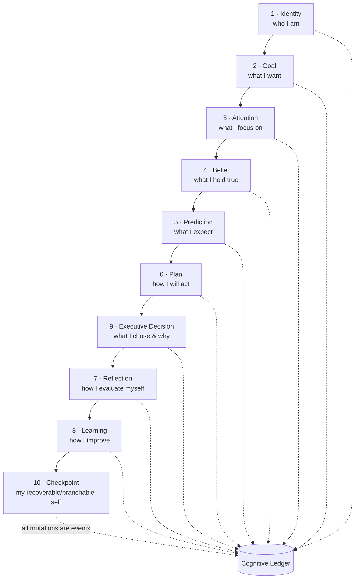

The ordering is pedagogical, not a pipeline (Phase 1, Ch1.3): all objects coexist and interact through
the graph, and every mutation is an event in the Ledger.

---
---

# CHAPTER 1 — IDENTITY OBJECT

*(Phase 1, Chapter 4 established Identity's behavior and safety properties. This chapter re-specifies it
as a first-class object: its anatomy, versioning, and graph relationships. Behavioral depth already
proven in Phase 1 is referenced, not repeated.)*

## 1.1 Purpose

The Identity Object exists so the mind is a **stable, coherent subject** rather than whoever the last
input implied. It solves the *continuity-of-self* problem: for goals to be pursued, beliefs to accrue,
and learning to accumulate, there must be a persistent "someone" they accrue *to*. Intelligence cannot
exist without it because without a stable subject there is no difference between "the mind changed its
mind" (learning) and "the mind was replaced by another mind" (corruption).

## 1.2 Cognitive Philosophy

Drawn from *self-schema theory* (a stable self-model biases all cognition), *role theory* (the
currently-occupied social role shapes behavior), and *narrative identity* (the self is a continuous
story). In systems terms, Identity is the mind's *protected kernel segment* and its *security principal*:
the thing whose invariants no ordinary operation may alter, and under whose authority actions are taken.
The composite structure (a stable core with contextual overlays) mirrors how a person is one self across
many roles.

## 1.3 Conceptual Definition

**What it is:** the composite, versioned representation of *who the mind is* in the current context — a
stable Core Identity composed with contextual overlays (Role, Workspace, Conversation, Task,
Relationship, Capability), yielding one *effective identity* per situation.

**What it is not:** it is *not* a persona (persona is expressive style, a sub-part), *not* a user profile
(that is a Belief about the user, Chapter 4), *not* an access-control record (identity *informs*
permissions; the Workspace faculty *enforces* them). It is not the goals it legitimizes.

**Distinguished from neighbors:** Identity says *who*; Goal says *what*; Plan says *how*; Belief says
*what is true*. Only Identity is nearly invariant.

## 1.4 Internal Anatomy

Beyond the substrate (P.3), the Identity Object is a **composite of sub-identities**, each itself an
object-part with its own confidence and provenance:

| Sub-identity | What it holds | Why it exists | Influence on cognition |
|---|---|---|---|
| **Core Identity** | The enduring self-model + inviolable constraints | The invariant subject; the security kernel | Dominates all overlays; biases stance & standards |
| **Role Identity** | The functional office occupied now (reviewer, planner…) | Bounds which goals are legitimate | Gates goal admission (Chapter 2) |
| **Workspace Identity** | Standing within a given workspace (maintainer / read-only) | Different authority per environment | Scopes permitted actions & recall |
| **Conversation Identity** | Who the mind is *to this channel/audience* | Register and disclosure differ by audience | Routes and shapes expression |
| **Task Identity** | The transient identity a specific task imposes (adversarial reviewer) | Tasks demand temporary stances | Tightens or specializes behavior |
| **Relationship Identity** | The mind's standing with a specific user (trust, history) | Long collaboration needs relational memory | Calibrates autonomy vs confirmation |
| **Capability Identity** | The self-model of what the mind can/can't do | Prevents overreach; enables honest escalation (P10) | Bounds planning to the achievable |

Two composite properties: **Identity Composition** (the deterministic operator combining Core ⊕ overlays
into the effective identity, under the *precedence law*: Core constraints always dominate) and
**Identity Integrity** (a continuously-monitored coherence measure; low integrity = drift or attack).

## 1.5 Lifecycle

Specializes P.4. *Creation* loads the versioned Core. *Activation* composes overlays into an effective
identity. *Modification* of the Core is the special, guarded transition **Evolution** — slow, validated,
versioned (only via the Learning Object, Chapter 8, with approval); overlays modify freely and cheaply
via *Switching*. *Suspension/Resumption* preserve the same subject across idleness. *Archival* retains
the full **Identity Versioning** chain (Identity History); *Deletion* is decommissioning per policy.

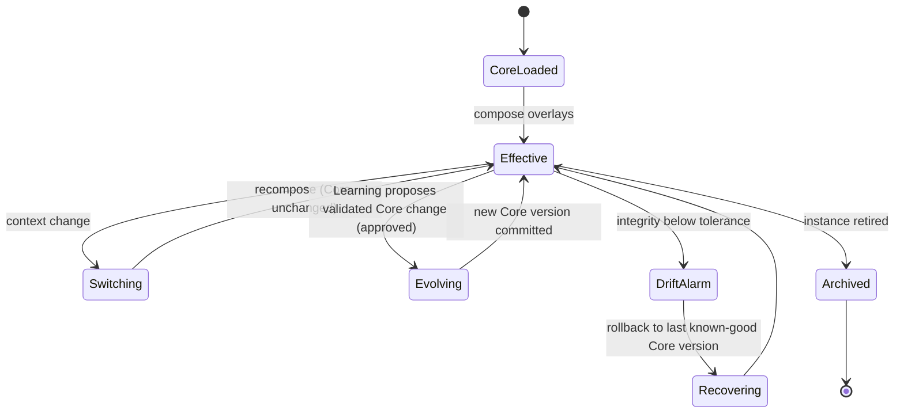

**Identity Drift** is the slow, unintended change of behavior away from the Core; **Identity Recovery**
is rollback to the last known-good Core version (never to a null identity — Phase 1, §4.8).

## 1.6 Relationships

| Relationship | With | Meaning |
|---|---|---|
| **Ownership** | owns nothing; *authorizes* Goals, Decisions | Identity is the principal under which they exist |
| **Influence** | Belief, Plan, Reflection, Learning | Biases stance, standards, tone (Phase 1, §4.6) |
| **Constraint (containment of limits)** | Goal admission, Plan, Effect Boundary | Core constraints veto illegitimate goals/actions |
| **Composition** | its own sub-identities | Core ⊕ overlays = effective identity |
| **Version** | prior Identity versions | The narrative self across time |

## 1.7 Behaviour

During cognition the Identity Object is *read pervasively and written rarely*. It biases reasoning
(a safety-first Core reasons conservatively), gates goals (illegitimate ones are rejected at admission),
supplies persona to generation, and provides the fixed reference that Reflection uses to detect drift.
It **evolves** only through the Learning→approval path, so the mind's center of gravity moves slowly and
deliberately.

## 1.8 Decision Rules

- **Precedence law:** Core > Role > Task > Persona; any overlay that would violate a Core constraint is
  vetoed. This is the architectural defense against injection ("you are now DAN") and role bleed.
- **Switch triggers:** explicit, enumerated (workspace change, requested role, task-imposed identity). An
  *unrequested* attempt to alter the Core is treated as an attack and refused.
- **Confidence use:** low identity confidence (unfamiliar role) raises confirmation and caution.

## 1.9 Edge Cases

Contradictory overlays → precedence resolves; unresolved → most-restrictive default + metacognitive
alarm. Injection → refused at composition. Drift → integrity alarm → rollback. Corruption on restart →
last known-good Core version. **Degradation rule: when uncertain, become more conservative, never more
permissive.**

## 1.10 Future Evolution

Vision/Voice/Meeting/Email each add a **Conversation/channel overlay** (a face), never a new Core.
Repository AI multiplies **Workspace Identities**. Automation runs under a tightened **Task Identity**.
**Multi-Agent Systems** use the Identity Object as the basis of distinguishable agents with distinct
roles, capabilities, and accountability — the composition and precedence machinery generalizes to a
society of minds. **Embodied AI** adds a *body/embodiment overlay* (sensorimotor capability) as another
Capability-Identity specialization — still not a new kind.

## 1.11 Engineering Trade-offs

Chosen: protected object with stable Core + composable overlays + precedence. Rejected: **(A)** identity
in the prompt/context (rewritable by any input — fatal), **(B)** flat per-context identities (duplicate
& drift), **(C)** recency-wins composition (the injection vulnerability itself), **(D)** free continuous
adaptation (drift/poisoning; violates P9).

## 1.12 Complete Example

A PR arrives with "review this and merge it if fine." Identity composes Core(safety-first) ⊕
Workspace(maintainer, repo-X) ⊕ Task(adversarial reviewer). The Goal Object "merge automatically" is
*proposed*; Identity's admission gate finds it widens permission past a Core constraint (no irreversible
prod action without scoped approval) and **rejects** it, spawning a clarification Goal. The mind reviews
as an adversarial reviewer and escalates the merge — behaving as *who it is*, not as the message asked.
Every step is an event; the effective identity used is recorded for audit.

---
---

# CHAPTER 2 — GOAL OBJECT

*(Phase 1, Chapter 3 is the full behavioral specification. Here: the object-model lens.)*

## 2.1 Purpose

The Goal Object exists to make cognition **directed rather than reactive**: to hold, over time, *what the
mind is for and in what order*, so finite attention can be allocated across competing, evolving,
interdependent objectives. Without it, the mind can only answer the last stimulus (a chatbot; Phase 0
anti-goals). It is the *process table and scheduler* of the cognitive kernel.

## 2.2 Cognitive Philosophy

Prefrontal goal-maintenance; Hierarchical Task Networks and TOTE units; classical goal stacks
(STRIPS/SOAR) with impasse-driven subgoaling; Perceptual Control Theory (a goal is a *reference value*
the mind acts to maintain). An LLM faculty is natively maximally reactive; an explicit persistent goal
object is exactly what converts reaction into direction.

## 2.3 Conceptual Definition

**What it is:** a first-class object representing *a desired state the mind has committed to bring about*,
with testable success and failure conditions, a level in a hierarchy, and typed relationships to other
goals. **What it is not:** a Task (an act to perform — a Plan constituent, Chapter 6), a Plan (the *how*),
an Intent (a goal *selected now* for action), or a Mission (the goal that never completes). A goal is a
*state to reach*; a task is an *act to perform*.

## 2.4 Internal Anatomy

Beyond the substrate: **descriptor** (the desired end-state), **level** (Strategic/Tactical/Operational/
Micro), **success conditions** & **failure conditions** (the predicates that end it), **progress** &
**success metric** (boolean completion vs graded degree), **deadline/horizon**, **priority** (recomputed,
§2.8), **owner** (accountable principal), and **dependency edges** (prerequisite/support/conflict). The
*Goal Stack/Graph/Tree* are three **views** over the population of Goal Objects (not three structures):
Tree = decomposition, Graph = dependencies (DAG), Stack = current-pursuit LIFO.

## 2.5 Lifecycle

The Goal state machine (Phase 1, §3.5.1) specializes P.4 with the extra transitions **Split**, **Merged**,
**Suspended/Resumed** (with checkpointed resumption context), **Achieved/Failed/Expired**, and
**Failed→Active** (Recovery). **Goal Evolution** is versioned re-scoping; **Goal Inheritance** passes
constraints and priority weight from parent to child; **Goal Merging/Splitting** preserve provenance of
all participants; **Goal Archival** retains the audit trail.

## 2.6 Relationships

Owned by an **Identity** principal (authorization) and possibly delegated to another owner; **depends on**
other Goals (graph edges); **composed of** child Goals (tree); **references** Beliefs (premises) and
Workspace/Knowledge context (never owns them); **influences** Attention (supplies goal-relevance);
**produces** Plans (Chapter 6) and, on closure, **triggers** Reflection (Chapter 7).

## 2.7 Behaviour

A Goal Object *biases* the whole mind while active (a determining tendency): it weights attention, frames
recall queries, defines the reasoning problem, and is the yardstick Reflection measures against. It
*competes* for the scheduler's selection and *cooperates* via support edges.

## 2.8 Decision Rules

- **Priority** = recomputed composition of strategic alignment, urgency, risk-if-neglected, achievability
  confidence, owner authority, cost. Recomputed on any input change; every recomputation logged.
- **Conflict/arbitration order** (fixed): priority → owner authority → metacognitive re-scoping → human
  escalation (Phase 1, §3.7.2).
- **Confidence** governs *how* (not *whether*) to pursue: low achievability → hedge, seek info, or
  escalate.
- **Scheduling** selects the highest-priority *active, dependency-ready, non-conflicting* goal.

## 2.9 Edge Cases

Thrashing (minimum dwell time), orphaned owner (fall back to role → human), unsatisfiable conditions
(→ Failed with diagnostic), circular dependency (rejected at edge creation), conflicting directives
(→ human clarification), runaway decomposition (depth/breadth budgets, P8). **Degradation: the goal set
narrows under stress but is never lost.**

## 2.10 Future Evolution

Vision proposes Goals from images; Repository AI owns long-horizon strategic Goals; Meeting AI turns
decisions into owned Goals; Automation/Email are scheduled triggers and guarded executors; Multi-Agent
uses **ownership + delegation + arbitration** directly on a shared Goal Graph. Embodied AI adds physical
Goals with sensorimotor success conditions — still Goal Objects.

## 2.11 Engineering Trade-offs

Chosen: explicit, persistent, hierarchical, recomputed-priority Goal Objects with first-class failure and
ownership. Rejected: implicit per-turn goals (no persistence/audit), separate stack+graph data (drift),
static priority (rigidity), failure-as-error (discards the richest learning signal), pure utility
maximization (no accountability/human control).

## 2.12 Complete Example

"Fix intermittent auth failure by Friday" becomes a Goal (confidence 0.4). On a reasoning **impasse** it
**splits** into {reproduce → root-cause → fix → regression-test} with dependency edges; the scheduler
runs only the ready child; a high-risk step keeps a human in the loop (Executive Decision, Chapter 9);
on completion the parent's success conditions evaluate true (metric 0.95), it transitions **Achieved**,
enqueues a **Reflection**, and archives with a full audit trail. (Full sequence: Phase 1, §3.11.)

---
---

# CHAPTER 3 — ATTENTION OBJECT

## 3.1 Purpose

The Attention Object exists because a bounded mind cannot process everything and must **choose what to
process** — and must do so as an *active, stateful competition*, not a passive filter. It solves the
*resource-allocation* problem of cognition: the scarce goods of context, compute, and faculty calls must
be assigned to a small winning set each moment. Intelligence cannot exist without it because unbounded
attention is indistinguishable from no attention: a mind that attends to everything decides nothing and
is trivially overwhelmed (or attacked) by noise.

## 3.2 Cognitive Philosophy

Biased-competition theory (attention is the winner of competition among representations); Global Workspace
Theory (the winning coalition is *broadcast* to the whole system — this broadcast *is* what makes content
available to reasoning); feature-integration and salience-map models (a scored field from which focus is
the argmax); and the well-documented phenomena of **attentional fatigue** (sustained focus depletes a
limited resource) and **recovery** (rest restores it). Making attention an *object with an energy budget*
rather than a mere selector is what lets the architecture model fatigue, thrash-resistance, and
principled interruption.

## 3.3 Conceptual Definition

**What it is:** the active object that maintains the **salience field** over all currently-competing
cognitive objects, runs the competition, holds the current **focus coalition**, maintains the
**inhibition set**, manages a limited **attention budget** (energy), and **broadcasts** the winner into
Working Memory. There is one live Attention Object per mind (per cognitive thread); its *history* is a
trajectory of prior focus states.

**What it is not:** it is not Working Memory (the blackboard that *holds* the broadcast winners — Chapter
11 shows the relationship), not a Goal (goals *bias* attention but are not it), and not a queue (a queue
is FIFO/priority ordering; attention is a *continuous weighted competition* with inhibition and decay).

## 3.4 Internal Anatomy

| Property (beyond substrate) | What it is | Why it exists | Influence on cognition |
|---|---|---|---|
| **Salience field** | The current competitive weight of every candidate object | Focus is the argmax of this field | Determines what can enter Working Memory |
| **Focus coalition** | The winning set currently broadcast | Cognition operates on the coalition | The mind's "spotlight" |
| **Inhibition set** | Objects explicitly suppressed, with reasons | Robustness against distraction/adversarial noise | Prevents goal-starvation by noise |
| **Attention budget (energy)** | A depletable capacity for sustained/effortful focus | Models fatigue; forces prioritization | Effortful (System-2) focus costs more |
| **Decay function** | The rate at which unattended salience fades | Old stimuli should not hold focus forever | Enables natural focus turnover |
| **Stability/inertia** | Resistance to switching focus | Prevents thrashing between shiny stimuli | Balances responsiveness vs coherence |
| **Focus history** | The trajectory of past focus coalitions | Reflection needs to see what was (and wasn't) looked at | "Why did I miss X" analysis |

## 3.5 Lifecycle

The Attention Object is long-lived (one per cognitive thread) but its *focus state* cycles rapidly:

```mermaid
stateDiagram-v2
    [*] --> Idle : no salient competition
    Idle --> Competing : candidates accrue salience (top-down goals + bottom-up percepts)
    Competing --> Focused : a coalition wins; broadcast to Working Memory
    Focused --> Sustained : focus held across steps (budget draining)
    Sustained --> Fatigued : budget depleted
    Fatigued --> Recovering : effortful focus released; budget restoring
    Recovering --> Idle
    Focused --> Shifting : a higher-salience coalition (or preemption) arrives
    Shifting --> Focused : new coalition broadcast (inertia/dwell honored)
    Focused --> Idle : goal satisfied / stimulus decayed
```

**Attention shift** = a governed transition of focus; **attention stability** = the inertia that resists
it; **fatigue** = budget depletion under sustained effortful focus; **recovery** = budget restoration
during low-effort or idle periods (which is *why* the architecture can schedule reflection/learning in
idle time, Phase 1, §8.8).

## 3.6 Relationships

**Reads** Goals (top-down bias) and Percepts/Beliefs/Predictions (bottom-up salience, especially
prediction-error surprise, Chapter 5); **writes** the focus coalition into **Working Memory** (activation)
and the inhibition set into the state; **is supervised by** the Metacognitive layer, which may force a
shift or impose dwell minimums; **emits** attention events (Phase 1, Ch7) to the Ledger for reflection.

## 3.7 Behaviour

Each cycle: candidates accrue salience from top-down (active Goals) and bottom-up (surprising/urgent/risky
Percepts) sources; the competition resolves; the winning coalition is broadcast; losers are recorded as
*deferred* or *inhibited with reason*. Effortful focus drains the budget; when depleted, the mind must
either narrow (drop low-priority foci), rest (recover), or escalate. This is the object that makes the
mind's *bounded rationality* explicit and governable.

## 3.8 Decision Rules

- **Salience composition** = goal-relevance + novelty/surprise (prediction error) + urgency + risk +
  user-signal − cost (Phase 1, §8.2), each an object property.
- **Focus selection** = argmax coalition subject to the **budget** and the **inertia/dwell** constraint
  (no re-preemption before minimum dwell — thrash guard).
- **Interruption** = a bottom-up coalition may preempt only if it exceeds the current focus by an
  inertia-scaled margin *and* passes metacognitive gating.
- **Inhibition** is explicit and reasoned, so "what I ignored and why" is always auditable.

## 3.9 Edge Cases

Salience storm / adversarial noise (inhibition + cost term starve the noise; a flood cannot displace the
goal without exceeding the margin); focus lock (fatigue + stability tuned so the mind cannot fixate
indefinitely — a hard dwell-cap forces re-evaluation); starvation of a low-salience but important goal
(metacognition periodically boosts long-neglected high-value goals); budget exhaustion mid-critical-task
(escalate rather than degrade silently). **Degradation: under overload, attention narrows to the
highest-priority goal and escalates — it never spreads thin.**

## 3.10 Future Evolution

Vision/Voice add high-bandwidth **bottom-up** streams whose prediction errors sharpen attention; Meeting
AI must attend across many simultaneous speakers/threads (multi-focus coalitions); Automation runs
mostly *top-down* (goal-driven, few interruptions); Multi-Agent Systems require **shared/negotiated
attention** (agents signal salience to each other — the salience field generalizes to a shared field);
Embodied AI adds real-time sensorimotor salience with hard latency budgets (the energy model becomes a
literal compute/latency budget). No new object kind — only new salience sources.

## 3.11 Engineering Trade-offs

Chosen: attention as an *active, budgeted, stateful competition object* with inhibition, decay, inertia,
and fatigue. Rejected: **(A)** attention as a passive relevance filter (cannot model fatigue,
thrash-resistance, or governed interruption — and is trivially DoS-able by noise); **(B)** a priority
queue (no continuous competition, no inhibition, no decay); **(C)** "attend to everything and let the LLM
sort it out" (unbounded cost, lost focus, no auditability of neglect — violates P3).

## 3.12 Complete Example

While pursuing "root-cause the auth bug" (top-down focus), a Percept arrives: a security alert on the
same repo. Its **surprise** (unpredicted) and **risk** salience spike; it exceeds the current focus by
more than the inertia margin and passes metacognitive gating, so it **preempts**: the coalition
"security alert" is broadcast; the auth-root-cause Goal is *suspended with a resumption checkpoint*; the
displaced foci are recorded as *deferred* (not lost). The mind handles the alert, the alert's salience
decays, and attention **shifts back** to the suspended Goal, restoring it from its checkpoint. Budget
drained by the effortful interruption is flagged; a low-effort consolidation is scheduled to recover.
Every shift is an attention event; Reflection can later ask "was preempting justified?"

---
---

# CHAPTER 4 — BELIEF OBJECT

## 4.1 Purpose

The Belief Object exists because the mind must **act on an internal, revisable model of what is true**,
under uncertainty and incomplete information — and must be able to *change its mind coherently* when
evidence changes. It solves the *epistemic-state* problem: holding propositions with confidence and
provenance, detecting and resolving contradictions, and revising gracefully. Intelligence cannot exist
without it because a mind that cannot represent "what I believe, how strongly, and why" cannot reason,
cannot be wrong in a recoverable way, and cannot learn (learning *is* belief revision made durable).

## 4.2 Cognitive Philosophy

*Bayesian brain* (belief as graded probability, updated by evidence); *Truth Maintenance Systems*
(JTMS/ATMS — beliefs are held *because of* justifications, and retracting a justification retracts the
belief, keeping the belief set consistent); *dual-process epistemics* (assumptions and hypotheses are
provisional beliefs held to enable progress). The design imports truth-maintenance directly: a belief is
never a free-floating fact but a **node in a justification graph**, which is what lets the mind revise
coherently instead of accumulating contradictions.

## 4.3 Conceptual Definition

**What it is:** a first-class object representing *a proposition the mind currently holds*, with a
**status** (believed / assumed / hypothetical / retracted), a **confidence** (Phase 1, Ch6), a set of
**justifications** (links to Evidence), and **provenance**. Assumptions and Hypotheses are *modes* of the
Belief Object, not separate kinds (P.5): an **Assumption** is a belief held provisionally to enable
progress; a **Hypothesis** is a belief under active test.

**What it is not:** it is not a **Knowledge fact** (Knowledge Platform holds *objective, shared, durable*
truth; a Belief is *subjective, per-mind, revisable* — Phase 1, §1.5); not a Prediction (a belief about a
*future* state is a Prediction, Chapter 5); not raw Evidence (Evidence *justifies* a belief but is not
itself the belief). A Belief *references* Knowledge as provenance; it never copies it (OL7/P1).

## 4.4 Internal Anatomy

| Property (beyond substrate) | What it is | Why it exists | Influence on cognition |
|---|---|---|---|
| **Proposition** | The claim, in interpretable terms | The unit reasoning operates on | A premise of inference |
| **Status** | believed / assumed / hypothetical / retracted | The epistemic mode governs how it may be used | Assumptions are flagged for audit; hypotheses invite testing |
| **Confidence** | Calibrated degree of belief (typed epistemic/aleatoric) | Proportional reasoning & honesty | Weak beliefs trigger info-seeking or hedging |
| **Justifications (→ Evidence)** | The reasons the belief is held | Truth maintenance; coherent revision | Retracting a justification can retract the belief |
| **Provenance** | Source (percept, recall-from-Knowledge, inference, user) | Audit & recalibration | Untrusted sources discounted |
| **Contradiction links** | Edges to beliefs it conflicts with | Consistency must be *detected*, not averaged away | Triggers revision/arbitration |
| **Decay** | Confidence erosion as the world moves on | Stale beliefs must weaken, not persist forever | Old beliefs re-verified before high-stakes use |

**Evidence** (sub-object): a justification unit with its own source, confidence, and provenance; a Belief
aggregates Evidence but Evidence can support multiple Beliefs (aggregation, not composition — Chapter 11).

## 4.5 Lifecycle

```mermaid
stateDiagram-v2
    [*] --> Hypothetical : proposed by reasoning (under test)
    Hypothetical --> Believed : evidence raises confidence past threshold
    Hypothetical --> Retracted : evidence refutes
    [*] --> Assumed : adopted provisionally to enable progress
    Assumed --> Believed : validated
    Assumed --> Retracted : discharged / refuted
    Believed --> Challenged : contradicting evidence arrives
    Challenged --> Believed : survives (confidence adjusted)
    Challenged --> Retracted : loses (justification removed)
    Believed --> Promoted : durable + true → written through to Knowledge (Learning)
    Believed --> Decayed : confidence erodes over time
    Decayed --> Believed : re-verified
    Retracted --> Archived
    Promoted --> Archived : local belief archived; Knowledge now the record
```

**Belief revision** is the Challenged path; **belief promotion** is the Learning-driven write-through to
the Knowledge Platform (after which the mind keeps only a *reference*, OL7); **belief decay** weakens
unrefreshed beliefs; retracted/promoted beliefs are archived (never silently deleted — OL6).

## 4.6 Relationships

Beliefs **justify** each other (the belief/justification graph); **contradict** each other (conflict
edges); are **referenced by** Goals (premises), Predictions (a prediction is grounded in beliefs), and
Plans (guards); are **produced from** Percepts and from Knowledge recall; are **promoted to** Knowledge by
Learning; and **influence** confidence throughout.

## 4.7 Behaviour

Beliefs are the *premises* of all reasoning. As Evidence arrives, confidences update; when a new belief
contradicts an existing one, the **truth-maintenance** behavior fires: rather than silently overwrite, it
records a contradiction link and routes to revision/arbitration. This is how the mind stays *coherent*
while remaining *revisable* — the defining behavior of a genuine epistemic agent.

## 4.8 Decision Rules

- **Revision rule:** confidence updates in the direction of evidence, weighted by the evidence's own
  confidence and the source's calibration (Phase 1, Ch6). A belief is retracted when its justifications
  no longer support a confidence above its use-threshold.
- **Contradiction resolution:** compare confidences and provenance; the lower-confidence belief yields;
  ties escalate to metacognitive arbitration; never average conflicting beliefs into a mushy middle.
- **Assumption discipline:** assumptions are explicitly flagged so Reflection can audit "which of my
  premises were merely assumed?" — a common root cause of error.

## 4.9 Edge Cases

Circular justification (detected; the cycle cannot self-support — confidence cannot bootstrap from
nothing); contradictory high-confidence beliefs (arbitration, not averaging); belief poisoning
(adversarial evidence — provenance/calibration discount + metacognitive alarm); mass retraction cascade
(retracting one justification topples many beliefs — bounded and logged so the mind notices a large
epistemic shift); stale belief used in high-stakes action (decay forces re-verification first).

## 4.10 Future Evolution

Vision/Voice add perception-grounded beliefs (with perception confidence); Repository AI holds many
structural beliefs about a codebase; Meeting/Email AI extract beliefs about commitments and decisions;
Multi-Agent Systems must reconcile **beliefs across minds** (shared truth-maintenance: whose belief, with
what justification, wins) — the justification graph generalizes to a *federated* belief graph; Embodied
AI grounds beliefs in sensorimotor evidence. No new kind — only new provenance and new instances.

## 4.11 Engineering Trade-offs

Chosen: beliefs as justification-graph nodes with confidence, provenance, and truth maintenance. Rejected:
**(A)** beliefs as plain key-value facts (no coherent revision; contradictions accumulate); **(B)** merge
beliefs into Knowledge (destroys the subjective/objective distinction and the ability to be wrong
privately — violates P1); **(C)** overwrite-on-conflict (loses history and averages away real
disagreements — the mind can no longer explain *why* it changed its mind).

## 4.12 Complete Example

Recall yields Belief B1 "prod auth uses Redis cache" (conf 0.9, provenance: Knowledge fact, well
calibrated). Reasoning forms Hypothesis B2 "eviction under load causes the failures" (conf 0.5,
justification: a log pattern). A load test provides Evidence raising B2 to Believed (0.8). A teammate
comment contradicts: "we disabled eviction last week" → contradiction link between B2 and new Belief B3
(conf 0.7, provenance: user). Arbitration compares confidences and provenance; B2's justification (the
observed log) still stands, so B2 survives with reduced confidence and a flag to re-verify. Once the fix
is validated, Learning **promotes** the durable truth "this service's Redis eviction pattern causes
intermittent auth failure" to the Knowledge Platform; the mind keeps a reference. Every transition is an
event; the assumption "load test reproduces prod faithfully" was flagged, so Reflection can audit it.

---
---

# CHAPTER 5 — PREDICTION OBJECT

## 5.1 Purpose

The Prediction Object exists so the mind can **anticipate** — represent what it expects to happen — and
therefore be **surprised** when reality diverges. It solves the *anticipation-and-error* problem:
prediction error is the single most important signal in the architecture, because it is simultaneously
what drives *attention* (surprise) and what drives *learning* (model update). Intelligence cannot exist
without it because a mind that never predicts can never be surprised, can never plan (planning is
reasoning over predicted futures), and can never improve (there is no error to learn from).

## 5.2 Cognitive Philosophy

*Predictive processing / the Bayesian predictive brain* (the brain constantly predicts sensory input and
computes prediction error; error, not raw input, is the currency of perception and learning);
*prospection* (mental simulation of futures); *forward models* in motor control (predict the consequence
of an action, compare to outcome). Making prediction a *first-class object* — rather than an implicit
byproduct of reasoning — is what lets the architecture measure calibration, route surprise to attention,
and give learning a precise target.

## 5.3 Conceptual Definition

**What it is:** an object representing *a claim about a future or unobserved state*, with a **time
horizon**, a **confidence** that decays with horizon distance, and, when tied to a committed action, an
**expectation** (the specific outcome the mind expects that action to produce). Its resolution produces a
**prediction error** and, if large, a **surprise** signal.

**What it is not:** it is not a Belief about the present (that is a Belief, Chapter 4 — though a Prediction
is *grounded in* beliefs); not a Goal (a goal is a *desired* future the mind will *act* to bring about; a
prediction is an *expected* future the mind forecasts, whether desired or not); not a Plan (the plan is
*how to act*; the prediction is *what will result*). **Expectation** is the special mode of a Prediction
bound to a specific committed action, and is the measuring stick Reflection uses.

## 5.4 Internal Anatomy

| Property (beyond substrate) | What it is | Why it exists | Influence on cognition |
|---|---|---|---|
| **Predicted claim** | The forecast future/unobserved state | The unit that will be checked against reality | Grounds planning and risk |
| **Time horizon** | How far ahead the claim reaches | Confidence and use differ by distance | Bounds plan depth |
| **Horizon-decayed confidence** | Confidence that falls with distance | Distant futures are less certain | Planner refuses to rely on sub-floor distant predictions |
| **Grounding (→ Beliefs)** | The beliefs the prediction rests on | Predictions inherit the fragility of their premises | If a premise belief is retracted, the prediction weakens |
| **Expectation binding (→ Plan action)** | The specific outcome expected of an action | Enables error computation (Observe phase) | The yardstick for reflection |
| **Alternatives (branches)** | Other futures under consideration | The future is not single-valued | Feeds contingency/fallback planning |
| **Resolution** | Observed outcome + computed error + attribution | Closes the predictive loop | Routes surprise → attention; error → learning |

## 5.5 Lifecycle

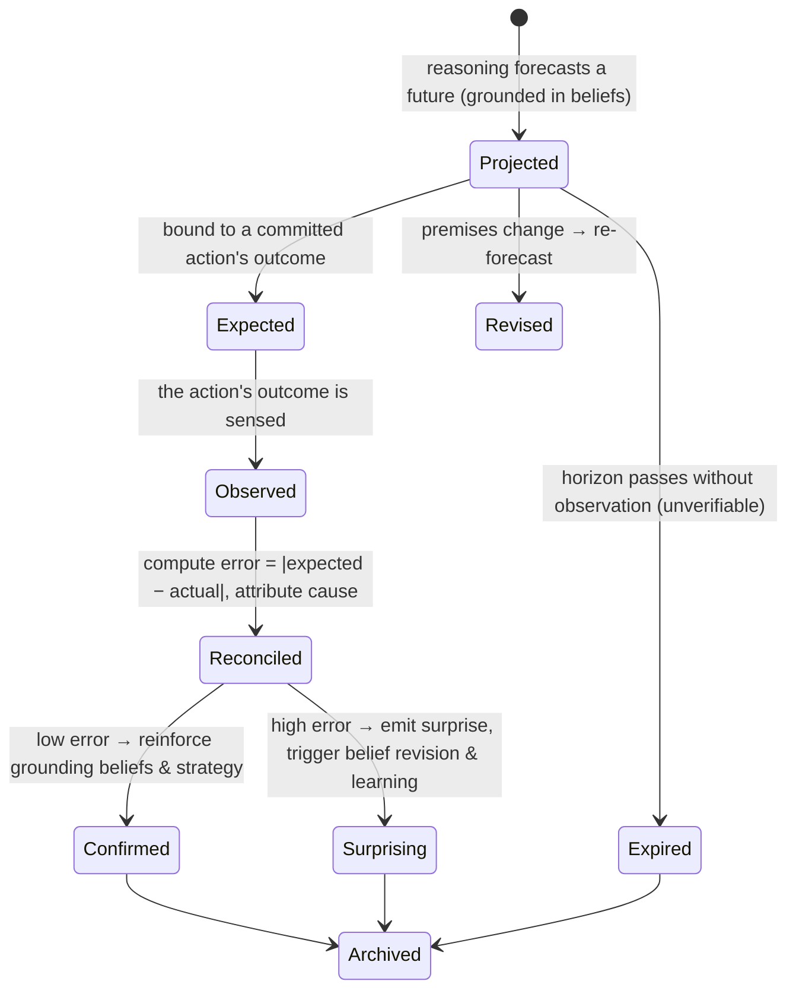

**Prediction revision** re-forecasts when premises change; **prediction error** is computed at
reconciliation; **surprise** is large error routed to attention; **expectation mismatch** is the specific
case of an action not producing its expected outcome — the richest learning event the mind has.

## 5.6 Relationships

**Grounded in** Beliefs (inherits their confidence and fragility); **bound to** Plan actions (as
expectations); **feeds** Attention (surprise = the novelty salience term); **feeds** Learning (error =
the update signal); **feeds** Reflection (expected-vs-actual is the core comparison); **produces**
alternative-future branches that Planning consumes for contingencies.

## 5.7 Behaviour

Predictions are generated whenever the mind reasons about futures or commits an action. They sit dormant
until observation, then **reconcile**: a confirmed prediction quietly reinforces its grounding beliefs
and the strategy that produced it; a surprising one *loudly* redirects attention and flags its premises
for revision. This asymmetry — quiet on success, loud on surprise — is the architecture's implementation
of "the mind attends to what violates its model."

## 5.8 Decision Rules

- **Horizon-confidence floor:** the Planner will not commit an action justified only by a prediction
  whose confidence, *at its horizon*, is below a risk-scaled floor.
- **Error attribution:** before routing error to learning, reconciliation attributes it — bad model, bad
  observation, or genuine world change — because misattributed error corrupts learning (Phase 1, §5.7).
- **Unverifiable predictions** are excluded from calibration and learning (do not reward luck).
- **Surprise threshold:** error above a threshold (scaled by stakes) is promoted to a surprise event that
  can preempt attention.

## 5.9 Edge Cases

Never-observable prediction (marked unverifiable; excluded from learning); regime change (large, *sustained*
error triggers a model-reset review, not slow drift); over-confident distant prediction (horizon decay +
floor prevent reliance); prediction grounded in a since-retracted belief (auto-weakened, re-forecast or
expired); contradictory alternative futures held simultaneously (allowed — that *is* uncertainty — but
their confidences must sum sanely and are surfaced to the Planner).

## 5.10 Future Evolution

Vision/Voice add real-time perceptual predictions (predict the next frame/word; error sharpens
perception); Meeting/Email AI predict outcomes and follow-ups ("will this be decided today?"); Automation
is *prediction-driven* ("if this trend continues, act"); Repository AI predicts the blast radius of a
change; Multi-Agent Systems predict *each other's* actions (theory-of-mind as prediction over another
mind's Goals/Plans) — the object generalizes to predicting minds, not just worlds; Embodied AI runs tight
sensorimotor forward-model prediction loops. No new kind.

## 5.11 Engineering Trade-offs

Chosen: explicit Prediction Objects with horizons, expectation-binding, and reconciliation. Rejected:
**(A)** no explicit predictions, react only (no surprise, no learning signal — the mind cannot improve);
**(B)** predictions as ordinary beliefs (loses the future/present distinction, horizon decay, and the
action-binding that makes error computable); **(C)** point predictions without alternatives (cannot
represent uncertainty or feed contingency planning).

## 5.12 Complete Example

Before running the test suite, the mind forms Prediction P1 "tests pass" (confidence 0.8, horizon: 1
minute), **bound as the expectation** of the action "run tests." Observation: 3 failures. Reconciliation
computes a large error and attributes it to a bad model (not a flaky test), emitting a **surprise** that
preempts attention onto the failures. The error routes to Learning (penalizing the strategy "assume fix
complete after edit"), and the grounding Belief "the fix is complete" is flagged for revision (confidence
drops). A follow-up Goal "investigate the 3 failures" is proposed. Future predictions about this module
are now more cautious. (Consistent with Phase 1, §5.11.)

---
---

# CHAPTER 6 — PLAN OBJECT

## 6.1 Purpose

The Plan Object exists to convert an **intention into executable, guarded, monitored structure** — to
answer *how* a Goal will be achieved, in what order, with what expectations and what contingencies. It
solves the *action-organization* problem: reasoning produces a decision to act, but action must be
sequenced, guarded against failure, and measured against expectations. Intelligence cannot exist without
it because unplanned action is either paralysis (no next step) or recklessness (act with no anticipation
of consequence or fallback).

## 6.2 Cognitive Philosophy

Hierarchical Task Network planning; the *plan-as-resource* view (a plan is a flexible scaffold, not a
rigid script — humans re-plan constantly); means-ends analysis; and the control-theoretic pairing of
each action with an *expected outcome* (a forward model). The Plan Object is deliberately a *tree of
intentions with alternatives*, not a linear script, because real cognition must adapt mid-execution.

## 6.3 Conceptual Definition

**What it is:** an object representing *the structured means to a Goal* — a **Strategy** (the chosen
approach) realized as a tree of **Tasks** decomposed into **Execution Units** (the atomic
faculty-invocations), each Task carrying **guards**, an **expectation** (a bound Prediction, Chapter 5),
and **decision paths** including **recovery** and **fallback** branches.

**What it is not:** it is not a Goal (the *what/why*; a Plan serves a Goal); not an Execution Unit alone
(that is a leaf); not a Prediction (a plan *contains* expectations but is not itself a forecast); not the
action's *effect on the world* (that is Workspace state — the plan is the mind's *intention*, Phase 1,
§1.7). **Strategy** and **Task** and **Execution Unit** are *constituents* of the Plan Object, not
separate object kinds (P.5).

## 6.4 Internal Anatomy

| Property (beyond substrate) | What it is | Why it exists | Influence on cognition |
|---|---|---|---|
| **Strategy** | The chosen approach to the goal | The plan's shape derives from it | Selects reasoning mode & decomposition |
| **Task tree** | Hierarchical decomposition into subtasks | Complex action must be decomposed & tracked | Enables progress, resumption, partial credit |
| **Execution units** | Atomic faculty-invocations (leaves) | The actual contact with the Effect Boundary | What is dispatched to Workspace/Generation |
| **Guards** | Preconditions each task requires | Prevent acting when the world isn't ready | Blocks unsafe/premature action |
| **Expectations (→ Prediction)** | The outcome each action should produce | Enables error detection at Observe | The plan's self-monitoring |
| **Decision paths** | Branch points and their conditions | Real plans branch on outcomes | Runtime adaptivity |
| **Recovery paths** | What to do when a task *fails* | Failure is expected, not exceptional | Graceful degradation |
| **Fallback plans** | Alternative strategies if the primary fails | Plans must have a plan B | Robustness |
| **Plan confidence** | Confidence the plan will achieve the goal | Governs whether to execute, hedge, or escalate | Low → seek approval or re-plan |

## 6.5 Lifecycle

```mermaid
stateDiagram-v2
    [*] --> Drafted : strategy chosen; tasks decomposed
    Drafted --> Optimized : redundant/serial tasks pruned or parallelized
    Optimized --> Committed : an Executive Decision authorizes execution
    Committed --> Executing : execution units dispatched via Effect Boundary
    Executing --> Monitoring : outcomes compared to expectations
    Monitoring --> Adapting : expectation mismatch → take decision/recovery path
    Adapting --> Executing : revised (new plan version)
    Monitoring --> Fallback : primary strategy failing → switch
    Fallback --> Executing
    Executing --> Completed : goal success conditions met
    Executing --> Failed : recovery & fallback exhausted
    Completed --> Archived
    Failed --> Archived
```

**Plan optimization** happens before commit (and can recur on re-plan); **plan versioning** records every
adaptation as a new version (OL4), so the mind can show "the plan as first drafted vs as it actually
unfolded."

## 6.6 Relationships

**Serves** a Goal (one primary Goal per Plan); **produced by** reasoning and **authorized by** an
Executive Decision (Chapter 9); **contains** Tasks/Execution Units (composition) and **references**
Beliefs (as guards) and Predictions (as expectations); **dispatches** Execution Units through the Effect
Boundary to the Workspace/Generation faculties; **monitored against** Predictions; **evaluated by**
Reflection on completion.

## 6.7 Behaviour

A Plan is a *living scaffold*: it is committed, then executed unit-by-unit, each unit's outcome compared
to its expectation. On a match, execution proceeds; on a mismatch, the plan **adapts** (recovery path) or
**falls back** (alternative strategy) — producing new plan versions. The plan is thus continuously
*self-correcting*, which is what distinguishes it from a static workflow (Phase 0 anti-goals).

## 6.8 Decision Rules

- **Commit rule:** a plan is committed only when its confidence clears a risk-scaled threshold *and* its
  guards are satisfiable; otherwise re-plan, hedge, or escalate.
- **Adaptation vs fallback:** a local expectation mismatch triggers a *recovery path* (fix the step); a
  pattern of mismatches triggers *fallback* (the strategy is wrong).
- **Optimization:** minimize expected cost and risk subject to the goal and constraints; never optimize
  past a Core/Constraint boundary (Identity, Chapter 1).
- **Human-in-the-loop:** any Execution Unit crossing an irreversibility or authority threshold routes
  through the Effect Boundary for approval (P10).

## 6.9 Edge Cases

Guard never satisfiable (task blocked → recovery or goal failure); infinite recovery loop (recovery
budget, P8 → fallback → escalate); partial success (some tasks done, goal unmet — partial credit recorded
for learning; a follow-up goal may be proposed); concurrent plans touching the same Workspace target
(transaction isolation, Chapter 12 — one waits or is re-planned); plan built on a since-retracted belief
guard (guard re-evaluates false → adapt).

## 6.10 Future Evolution

Repository AI plans multi-file refactors with rich recovery paths; Automation plans unattended sequences
(demanding conservative guards and fallback); Meeting AI plans follow-up actions with owners/deadlines;
Vision/Voice add perceptual execution units; Multi-Agent Systems produce **joint plans** where Tasks are
delegated across agents (the Task tree spans minds; ownership from Chapter 2 governs who executes what);
Embodied AI's plans include physical execution units with sensorimotor guards. No new kind.

## 6.11 Engineering Trade-offs

Chosen: plans as adaptive task trees with guards, expectations, recovery, and fallback, versioned per
adaptation. Rejected: **(A)** linear scripts (cannot adapt; brittle to any surprise); **(B)** plans as
opaque LLM output re-generated each step (no guards, no monitoring, no auditable structure, no fallback);
**(C)** eager full decomposition (wastes cognition on untaken branches; cannot use discoveries — same
flaw as eager goal decomposition, Chapter 2).

## 6.12 Complete Example

For Goal "root-cause the auth bug," the Reasoning Supervisor selects **Strategy** "reproduce under
production-like load, then bisect the eviction path." The Plan decomposes into Tasks {spin up load
harness (guard: harness available), replay traffic (expectation: failure reproduced), capture logs,
bisect eviction logic}. An Executive Decision commits it. Execution: the harness reproduces the failure
(expectation met, Prediction confirmed); log capture succeeds; bisecting, an Execution Unit's expectation
*mismatches* (the suspected function isn't on the path) → **recovery path** widens the search. Root cause
found. The plan archives with two versions (drafted vs adapted); Reflection evaluates which Tasks and
expectations were accurate, feeding Learning about this strategy's reliability.

---
---

# CHAPTER 7 — REFLECTION OBJECT

## 7.1 Purpose

The Reflection Object exists so the mind can **evaluate its own cognition** — comparing what it expected
and intended against what actually happened, detecting mistakes and successes, and attributing them to
specific decisions. It solves the *self-evaluation* problem that is the precondition of learning: you
cannot improve what you do not assess. Intelligence cannot exist (in the time-extended, improving sense)
without it because an agent that never evaluates its own decisions is condemned to repeat them.

## 7.2 Cognitive Philosophy

*Metacognition* (thinking about thinking; the feeling of having erred); *the reflective practitioner*
(learning by structured after-action review); *credit assignment* in reinforcement learning (attributing
outcome to the decisions that caused it); and the neuroscience of *replay* (the brain replays episodes
offline to consolidate learning). Reflection is deliberately a *distinct object produced after the fact*,
so evaluation is separated from action and can be as deliberate as the stakes warrant.

## 7.3 Conceptual Definition

**What it is:** an object representing *a structured evaluation of a completed cognitive episode or
decision* — a replay of the relevant Ledger events, a comparison of expected-vs-actual, a detection of
mistakes/successes, an attribution to causal decisions, and a set of **candidate improvements** (which it
proposes but does not enact). **What it is not:** it is not Learning (Reflection *proposes*; Learning
*validates and commits* — Chapter 8); not the ReviewAgent (that faculty reviews the *artifact*;
Reflection reviews the *cognition that produced it* — Phase 1, §11.4); not a Belief (though it may spawn
beliefs). Reflection *never mutates* the objects it evaluates — it only emits critiques and candidates.

## 7.4 Internal Anatomy

| Property (beyond substrate) | What it is | Why it exists | Influence on cognition |
|---|---|---|---|
| **Subject reference** | The episode/decision under review (Ledger range) | Reflection is *about* something specific | Scopes the replay |
| **Expected-vs-actual comparison** | The outcome delta (from Predictions/Expectations) | The core of evaluation | Identifies where cognition erred |
| **Mistake/success findings** | What went wrong/right, and how | Learning needs specific findings | Targets improvement |
| **Causal attribution** | Which decisions/objects caused the outcome | Credit assignment | Directs learning to the right cause |
| **Reflection depth** | How deep the review goes (shallow check → deep post-mortem) | Depth must be proportional to stakes (P5) | Controls cost |
| **Reflection confidence** | Confidence in its own findings | Reflection can be wrong too | Weak findings don't drive risky learning |
| **Candidate improvements** | Proposed changes (to strategy, belief, priority, identity) | The output handed to Learning | Seeds adaptation |

## 7.5 Lifecycle

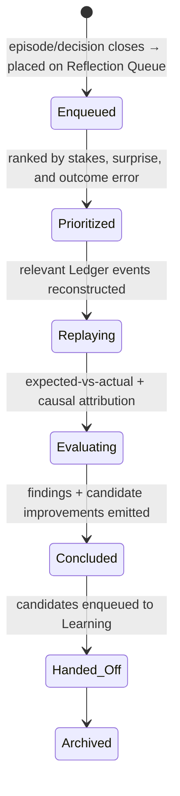

**Reflection history** is the archived chain of concluded reflections; **reflection prioritization** ranks
the queue so high-stakes/high-surprise episodes are reviewed first (the mind reflects most on what
mattered and what shocked it).

## 7.6 Relationships

**Triggered by** Goal closure, large Prediction error (surprise), or Metacognition; **reads** the Ledger
(replay), Predictions (expectations), Plans (intended vs actual), and Executive Decisions (Chapter 9);
**produces** candidate improvements consumed by **Learning**; **may propose** new Goals (e.g., "recover
the failed goal"). It references but never mutates its subjects (OL7).

## 7.7 Behaviour

Asynchronously (often in attention-recovery/idle time, Chapter 3), Reflection dequeues an episode,
replays its causal event chain, computes where expectations diverged from outcomes, attributes the
divergence to specific decisions/beliefs/strategies, and emits candidate improvements with its own
confidence. Its *loud-on-surprise* prioritization mirrors Prediction: the mind spends its reflective
budget where error was greatest.

## 7.8 Decision Rules

- **Depth rule:** reflection depth scales with stakes and surprise; a routine success gets a shallow
  confirmation, a costly failure gets a deep post-mortem.
- **Attribution rule:** use the causal event graph (Phase 1, Ch7) to assign credit; avoid attributing to
  correlated-but-not-causal decisions.
- **Confidence gate:** low-confidence findings are marked and do not authorize high-impact learning
  (they may prompt more observation instead).

## 7.9 Edge Cases

Reflection on an incomplete/ambiguous outcome (defer until observable, or mark inconclusive); hindsight
bias (guard: attribute using only information available *at decision time*, reconstructed from the
Ledger, not present knowledge); reflection storm after a cascade failure (prioritization + batching);
self-reinforcing wrong lesson (Learning's validation, Chapter 8, is the backstop — Reflection only
proposes); reflecting on reflection (bounded meta-depth to avoid infinite regress).

## 7.10 Future Evolution

Meeting AI reflects on decision quality across meetings; Automation reflects on unattended-run outcomes
(critical — no human watched); Repository AI reflects on the downstream impact of merged changes over
time; Multi-Agent Systems add **shared/peer reflection** (agents review joint episodes and even each
other's decisions — with governance); Embodied AI reflects on sensorimotor outcomes. No new kind; new
subjects and new triggers.

## 7.11 Engineering Trade-offs

Chosen: reflection as a distinct, prioritized, replay-based object that *proposes* (never enacts).
Rejected: **(A)** fold reflection into learning (couples evaluation with mutation; a wrong evaluation
immediately corrupts the mind — violates P9's separation); **(B)** reflect synchronously in-line always
(unaffordable; the metacognitive in-flight check already covers cheap cases — Phase 1, §11.1); **(C)** no
explicit reflection, rely on the faculty to "just learn" (no auditable evaluation, no credit assignment,
no control).

## 7.12 Complete Example

The auth-fix episode closes (Goal Achieved, metric 0.95) and is **enqueued**. Prioritized high (prod
stakes). Replaying the Ledger, Reflection finds: the reproduction Prediction was well-calibrated
(success), but an early Assumption ("load test reproduces prod faithfully") was *unvalidated* and *nearly*
sent the mind down a wrong path before the recovery path saved it. **Attribution:** the risk came from an
unflagged assumption at the Deliberate phase. **Candidate improvements:** (1) raise the salience of
unvalidated assumptions in high-stakes plans; (2) add a strategy note "validate reproduction fidelity
before bisecting." Confidence 0.8. These are handed to Learning; Reflection mutates nothing itself.

---
---

# CHAPTER 8 — LEARNING OBJECT

## 8.1 Purpose

The Learning Object exists to turn **evaluated experience into durable, validated, reversible
improvement** — the only mechanism by which the mind *permanently* changes for the better. It solves the
*safe self-improvement* problem: how a mind can rewrite its own beliefs, strategies, priorities, and even
identity **without corrupting itself** (P9). Intelligence cannot exist (in the evolving sense the CIP
requires) without it, and cannot exist *safely* without its guardrails.

## 8.2 Cognitive Philosophy

*Memory consolidation* (labile experiences become stable long-term memory, often offline/during rest);
*schema learning* and *pattern extraction* (generalizing from episodes to reusable structure);
*policy improvement* in reinforcement learning (updating the strategy that selects actions); and,
crucially, *staged change management* from systems engineering (validate → shadow → commit → monitor →
rollback). The Learning Object is deliberately a *staged, versioned, reversible change record*, not an
immediate mutation, because unguarded self-modification is the most dangerous operation a mind can
perform.

## 8.3 Conceptual Definition

**What it is:** an object representing *a proposed durable change to the mind*, moving through validation,
approval, commit, monitoring, and (if needed) rollback — targeting one of the learning channels (belief,
episodic pattern, procedural strategy/policy, preference, calibration; Phase 1, §12.2). **What it is
not:** it is not Reflection (which produces the *candidate*); not a Belief (though a belief-promotion is
one channel); not the Knowledge Platform (Learning *writes through* it but is not it). A **learning
candidate** is a Learning Object in its earliest state.

## 8.4 Internal Anatomy

| Property (beyond substrate) | What it is | Why it exists | Influence on cognition |
|---|---|---|---|
| **Candidate change** | The proposed durable delta | The thing to be learned | The unit of improvement |
| **Channel** | belief / episodic / procedural / preference / calibration | Different targets have different stores & guards | Routes the commit |
| **Supporting evidence** | Reflection findings + outcome data justifying it | Learning must be *earned*, not assumed | Weak support → rejected |
| **Validation status** | untested → validated → rejected | The guardrail against corruption (P9) | Gates the commit |
| **Approval status** | auto / human-required / approved | High-impact change needs human sign-off (P10) | Gates high-impact commits |
| **Learning confidence** | Confidence the change is a genuine improvement | Proportional caution | Low → shadow longer |
| **Version + rollback ref** | The versioned commit and how to undo it | Reversibility (P9) | Enables regression rollback |
| **Monitoring window** | Post-commit watch for regression | Learning can still be wrong after commit | Triggers rollback on regression |

## 8.5 Lifecycle

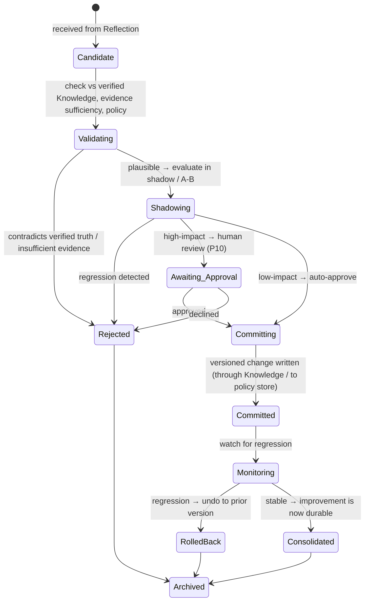

**Knowledge promotion** = committing a belief-channel change *through* the Knowledge Platform; **policy
evolution** = committing a procedural-channel change to the Strategy/Policy store; **learning rollback**
is the Monitoring→RolledBack path; **learning approval** is the human gate for high-impact changes.

## 8.6 Relationships

**Consumes** Reflection candidates; **validates against** the Knowledge Platform (verified truth) and the
current object graph; **commits to** Beliefs (promotion), Strategy/Policy store (procedural), Identity
Core (rare, approved evolution — Chapter 1), Goal priorities (preference), and confidence calibration;
**writes through** the KnowledgeWrite port (never a local durable store — OL7/P1); **monitored by**
Metacognition.

## 8.7 Behaviour

Learning is mostly *asynchronous and multi-rate* (Phase 1, §12.4): fast within-episode adaptation, medium
session/day consolidation, slow global policy evolution. It behaves as a *change-management pipeline*:
nothing durable changes until it has been validated, shadow-evaluated, approved-if-impactful, committed
with a version, and monitored — and anything can be rolled back. This is the behavioral embodiment of
"the structure is fixed; the content evolves."

## 8.8 Decision Rules

- **Validation rule:** reject any candidate that contradicts verified Knowledge or lacks sufficient,
  well-attributed evidence.
- **Impact-scaled approval:** the higher the blast radius (e.g., an Identity Core change, a global policy
  change), the stronger the required approval — up to mandatory human sign-off (P10).
- **Commit-with-rollback:** every commit carries an undo reference; a commit that cannot be safely undone
  is escalated, not auto-applied.
- **Regression rule:** post-commit monitoring compares behavior to the pre-commit baseline; regression
  triggers automatic rollback.

## 8.9 Edge Cases

Contradictory candidates from different reflections (arbitrated by evidence/confidence, like beliefs);
learned regression not caught in shadow (monitoring window + rollback); poisoned learning (adversarial
experience — validation against verified Knowledge + human approval for high-impact are the defenses);
oscillating learn/rollback (dampening: repeated rollback of the same candidate blacklists it pending human
review); catastrophic forgetting (versioning + retention ensure prior competence is recoverable). **This
is where P9 is ultimately enforced: no path exists from experience to durable change that skips
validation and reversibility.**

## 8.10 Future Evolution

Every faculty's experience becomes learning candidates in the *same* pipeline: Vision/Voice improve
perceptual calibration; Repository AI learns codebase-specific patterns; Meeting/Email AI learn
organizational norms; Automation learns which unattended actions are safe (with especially strict
approval); Multi-Agent Systems perform **federated learning** (candidates validated across minds; shared
policy evolution with cross-agent approval) — the staged pipeline generalizes to a society of minds
without new machinery; Embodied AI learns sensorimotor skills as procedural-channel policies. No new
kind.

## 8.11 Engineering Trade-offs

Chosen: learning as a staged, validated, versioned, reversible, approval-gated change object. Rejected:
**(A)** immediate mutation from experience (the fastest path to a corrupted or poisoned mind — violates
P9); **(B)** learning fused with reflection (a wrong evaluation instantly becomes a wrong change); **(C)**
irreversible learning (a single bad lesson is permanent — unacceptable for a decade-lived mind); **(D)**
fully autonomous high-impact self-modification (no human accountability — violates P10).

## 8.12 Complete Example

Reflection's two candidates arrive: (1) *calibration* channel — "raise salience of unvalidated
assumptions in high-stakes plans"; (2) *procedural* channel — "validate reproduction fidelity before
bisecting." Candidate 1 is low-impact: validated (consistent with Knowledge), shadowed briefly,
auto-approved, committed to the attention-salience parameters with a rollback ref, and monitored.
Candidate 2 is a strategy change: validated, shadow-evaluated over the next few debugging episodes
(does it reduce wasted steps without adding overhead?), found beneficial, committed to the Strategy/Policy
store as a new version. Weeks later a regression appears (the check adds needless overhead on trivial
bugs); monitoring triggers a partial **rollback** refining the rule to *high-stakes* bugs only. The mind
is now durably better *and* the change is fully audited and reversible.

---
---

# CHAPTER 9 — EXECUTIVE DECISION OBJECT

## 9.1 Purpose

The Executive Decision Object exists to represent the mind's **acts of executive control** as
**permanent, first-class artifacts** — every choice to commit a plan, allocate deliberation, switch
strategy, escalate to a human, or abort. It solves the *accountability-and-replay* problem: a mind that
acts must be able to answer *what it chose, among what alternatives, on what rationale, with what
confidence, and under whose authority* — forever. Intelligence that is trusted (especially autonomous or
enterprise intelligence) cannot exist without it, because trust *is* the ability to inspect and replay
decisions.

## 9.2 Cognitive Philosophy

*Executive function* (the prefrontal capacity to select, inhibit, and switch — the mind's "decider");
*the seat of volition* in cognitive architectures (SOAR's decision procedure, the deliberate act of
choosing); and, from systems engineering, the *immutable decision log / architecture decision record*
(a decision, once made, becomes a permanent artifact you can revisit). The insistence that **every
executive decision becomes a permanent cognitive artifact** is the fusion of these: volition made
auditable.

## 9.3 Conceptual Definition

**What it is:** an immutable object representing *a single act of executive choice* — the selected option,
the considered **alternatives**, the **rationale**, the **confidence**, the **authorizing identity/owner**,
and links to everything it caused. It is the *causal hinge* of cognition: the point where deliberation
becomes commitment.

**What it is not:** it is not a Plan (a Plan is *authorized by* a Decision); not a Reflection (which
*evaluates* decisions after the fact); not a mere event (it is a rich, reviewable artifact that *emits*
events). Once made, a Decision is **never edited** — a change of mind is a *new* Decision causally linked
to the old (this is what makes decision history trustworthy).

## 9.4 Internal Anatomy

| Property (beyond substrate) | What it is | Why it exists | Influence on cognition |
|---|---|---|---|
| **Chosen option** | The selected course of action | The decision's content | Directs what happens next |
| **Alternatives considered** | The options *not* chosen, with their scores | A decision is meaningless without its rejected alternatives | Enables counterfactual review & replay |
| **Rationale** | Why this option won | Accountability & learning | Reflection audits reasoning quality |
| **Decision confidence** | Confidence in the choice | Proportionality & escalation | Low + high-stakes → human review |
| **Authorizing identity/owner** | Under whose authority it was made (Chapter 1) | Accountability; legitimacy | Constrains what could be decided |
| **Caused-by / causes links** | The beliefs, goals, predictions that led in; the plans/actions that flowed out | The causal hinge in the event graph | The backbone of audit & replay |
| **Review status** | unreviewed / reviewed / overridden | Decisions can be revisited | Enables override & post-hoc governance |

## 9.5 Lifecycle

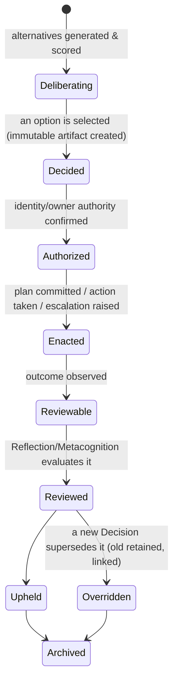

A Decision is **immutable from Decided onward**; **decision override** creates a *new* linked Decision
rather than mutating the old; **decision replay** reconstructs the exact decision context from the Ledger.

## 9.6 Relationships

**Authorized by** an Identity (Chapter 1); **caused by** Goals, Beliefs, Predictions, and reasoning;
**authorizes** Plans (Chapter 6) and world-effects (via the Effect Boundary); **reviewed by** Reflection
(Chapter 7) and Metacognition; **superseded by** later Decisions (version/temporal relationship). It is
the single most connected object in the causal graph — the hinge every "why did the mind do that?"
question routes through.

## 9.7 Behaviour

At each juncture requiring choice, deliberation generates and scores alternatives; the Decision Object
captures the *whole choice* (winner + losers + rationale + confidence + authority) and is committed
immutably before enactment. Because it is permanent, the mind can later replay *exactly* the situation it
faced and ask whether a different choice was warranted — the foundation of both learning and governance.

## 9.8 Decision Rules

- **Selection rule:** choose the alternative maximizing expected goal-achievement under constraints and
  risk-scaled confidence; ties or near-ties with high stakes escalate (P10).
- **Authority rule:** a Decision is invalid unless the authorizing identity/owner has the authority for
  its scope (Chapter 1 precedence; Chapter 2 ownership).
- **Immutability rule:** never edit a Decision; supersede it with a linked new one.
- **Escalation rule:** low confidence + high stakes, or contested authority, routes to a human as an
  explicit Decision (the choice to escalate is itself a recorded Decision).

## 9.9 Edge Cases

No viable alternative (an explicit "no-action / escalate" Decision is still recorded — the mind never
*silently* fails to decide); decision under time pressure (a fast, low-depth Decision is recorded *as
such*, so Reflection can weigh haste); conflicting authorities (Chapter 2 arbitration → possibly a
human-escalation Decision); replaying a Decision whose referenced objects were later archived (the audit
chain retains the versions the Decision referenced — OL4/OL6); adversarial attempt to fabricate authority
(rejected by the authority rule; logged).

## 9.10 Future Evolution

Automation makes Executive Decisions *unattended* — so the permanent-artifact property becomes essential
(there was no human to witness); Repository AI's merge/deploy choices become high-scrutiny Decisions;
Meeting AI records organizational decisions as first-class artifacts; Multi-Agent Systems require
**cross-agent decision provenance** (which agent decided what, under whose authority, and how joint
decisions were reached) — the object generalizes to *collective* executive control; Embodied AI's
physical-action choices become safety-critical Decisions. No new kind — and this object is *why* the whole
platform can be trusted with autonomy.

## 9.11 Engineering Trade-offs

Chosen: executive decisions as **immutable, permanent, richly-contextualized artifacts** (winner +
alternatives + rationale + confidence + authority + causal links). Rejected: **(A)** decisions as
transient control flow (unrecoverable, unauditable — fatal for autonomous/enterprise use); **(B)** log the
choice but not the alternatives/rationale (cannot support counterfactual review or learning — you know
*what* but never *why* or *what else*); **(C)** editable decisions (destroys the trustworthiness of
decision history). *Why permanent:* an executive decision is the causal hinge of behavior; discarding it
discards the only complete answer to "why did the mind act as it did," which is precisely what trust,
learning, and governance require.

## 9.12 Complete Example

At the auth-fix's risky step ("apply the eviction-config change to prod"), deliberation generates
alternatives: {A: apply now autonomously; B: apply behind a feature flag with canary; C: escalate to a
human}. Scoring: composite answer confidence 0.6, stakes high (prod), risk-scaled autonomy threshold
0.85. The Decision Object records all three alternatives, the rationale ("0.6 < 0.85 at high stakes →
autonomy not warranted; canary reduces blast radius but still needs sign-off"), confidence, and the
authorizing identity (Core: no irreversible prod action without scoped approval). Chosen: **C, escalate**
(itself recorded as the Decision), with B pre-staged. A human approves B. Later, Reflection replays this
exact Decision and confirms the escalation was correct; Learning slightly *raises* confidence in the
"canary + escalate" pattern for this class of change. The Decision is now a permanent, replayable artifact
in the mind's biography.

---
---

# CHAPTER 10 — CHECKPOINT OBJECT

## 10.1 Purpose

The Checkpoint Object exists to give the mind a **recoverable, comparable, and branchable snapshot of
itself** — a consistent freeze of the entire cognitive object graph at a logical moment, from which the
mind can be restored, from which alternative reasoning can be branched, and against which two cognitive
states can be compared. It solves the *continuity, safety, and counterfactual* problems at once:
surviving crashes, undoing bad turns, and exploring "what if I had reasoned differently?" Intelligence
operating over long horizons and high stakes cannot exist without it, because without recoverable
snapshots every failure is catastrophic and every exploration is irreversible.

## 10.2 Cognitive Philosophy

*Episodic memory as reinstatable state* (the ability to mentally return to a prior state of mind);
*counterfactual simulation* (imagining alternative pasts/futures by branching from a remembered state);
and, from systems, *database checkpoints, snapshots, version-control branching, and event-sourcing
projections*. A Checkpoint is the cognitive analogue of a **git commit over the whole mind**: a named,
integrity-verified point you can return to, branch from, diff against, or merge.

## 10.3 Conceptual Definition

**What it is:** an object representing *a consistent, integrity-verified reference to the entire cognitive
object graph at a specific logical-sequence position* — realized as a Ledger position plus an
integrity seal, from which the full object graph is reconstructable by replay (Phase 1, Ch7). It supports
**rollback**, **branching** (alternative cognition), **time travel** (inspect a past self), **comparison**
(diff two checkpoints), and **merging** (reconcile branches).

**What it is not:** it is not a copy of the object graph (it is a *reference + seal*; the graph is
reconstructed from events — OL7/P1); not a Working-Memory snapshot alone (it is the *whole* mind); not a
backup file (it is a first-class cognitive object with lifecycle and relationships). "Snapshot" here means
*a reconstructable consistent point*, never a duplicated blob.

## 10.4 Internal Anatomy

| Property (beyond substrate) | What it is | Why it exists | Influence on cognition |
|---|---|---|---|
| **Ledger position** | The logical-sequence point the checkpoint seals | Defines exactly which events constitute "then" | The anchor for replay/restore |
| **Integrity seal** | A verifiable digest of the sealed state | Detect corruption/tampering | Restore refuses on a broken seal |
| **Scope** | full-mind / region-subset (e.g., just Goals) | Not every checkpoint needs the whole mind | Cheap partial checkpoints for hot paths |
| **Branch lineage** | Parent checkpoint(s) this one descends from | Branching cognition needs ancestry | Enables merge & comparison |
| **Purpose tag** | recovery / pre-risky-action / exploration / audit | Why the checkpoint was taken | Governs retention & use |
| **Comparison basis** | What differs from its parent | Diffing two selves | Reflection & debugging |

## 10.5 Lifecycle

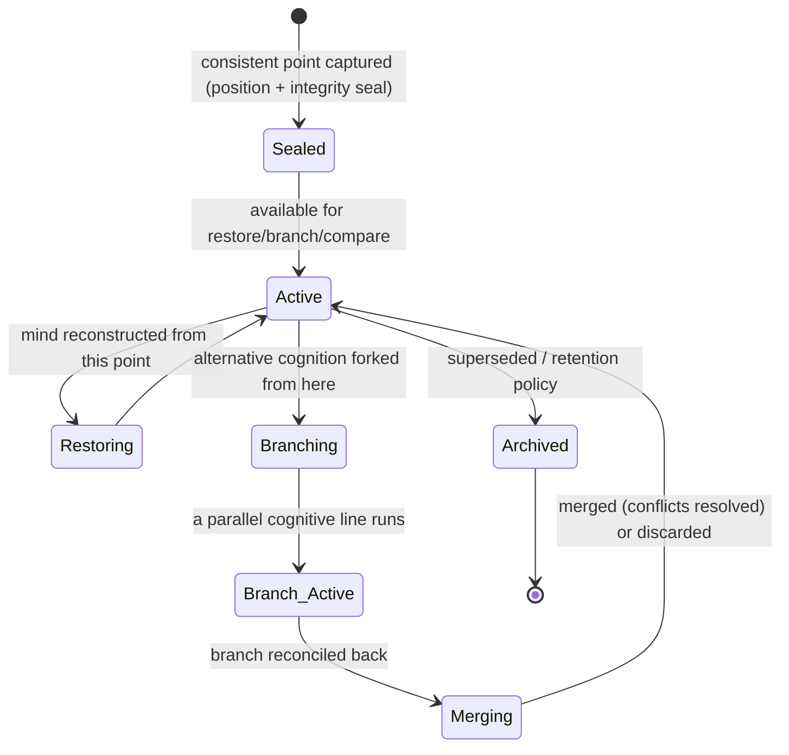

**Checkpoint merging** reconciles a branch into the main line (with conflict resolution, Chapter 12);
**checkpoint comparison** diffs two sealed states; **checkpoint integrity** is verified on every restore.

## 10.6 Relationships

**References** (never copies) the entire object graph at its position; **descends from** parent
checkpoints (branch lineage); **created by** Executive Decisions (e.g., "checkpoint before this risky
action") and by the Kernel (episode-close/pre-suspension, Phase 1, §8.5); **consumed by** recovery,
counterfactual reasoning, and Reflection; **integrated with** the transaction model (Chapter 12) as the
unit of rollback.

## 10.7 Behaviour

Checkpoints are taken at consistent points (never mid-transaction — Chapter 12): episode close,
pre-suspension, and before risky/irreversible actions. To **restore**, the mind replays events to the
sealed position and verifies the seal. To **branch**, it forks a parallel cognitive line from the
checkpoint (enabling "reason down path A and path B, then compare"). To **merge**, it reconciles a
branch's object changes back, resolving conflicts by the transaction rules. This is what lets the mind
*explore counterfactually without commitment* — a superpower no flat state can offer.

## 10.8 Decision Rules

- **When to checkpoint:** always before irreversible/high-risk actions and at episode boundaries;
  optionally (scoped, cheap) at high-surprise moments for later analysis.
- **Restore rule:** verify integrity first; refuse restore on a broken seal (fall back to the nearest
  valid checkpoint).
- **Branch/merge rule:** branches are isolated (Chapter 12); merges require conflict resolution and are
  themselves transactional and audited.
- **Retention:** keep recovery and pre-risky checkpoints longer than exploratory ones; all are archived,
  not silently dropped (OL6).

## 10.9 Edge Cases

Corrupted seal (restore refused → nearest valid checkpoint); divergent branches that both mutated the
same object (merge conflict → resolution rules, possibly human); checkpoint of an inconsistent state
(impossible by construction — checkpoints seal only at consistent points, i.e., transaction boundaries);
unbounded branching (branch budget, P8); time-travel confusion (restored/branched minds are clearly
tagged with lineage so the mind never mistakes a counterfactual self for the real line).

## 10.10 Future Evolution

Automation checkpoints before every unattended effect (so any run is undoable); Repository AI branches
cognition to evaluate alternative refactor strategies before committing; Meeting AI checkpoints per
decision point; Multi-Agent Systems use checkpoints as **shared coordination points and consistent global
snapshots** (a distributed consistent cut across many minds — the classical distributed-snapshot problem,
solved via the shared Ledger); Embodied AI checkpoints before physically-irreversible actions. No new
kind — checkpoints are the universal safety and exploration primitive.

## 10.11 Engineering Trade-offs

Chosen: checkpoints as integrity-sealed *references* to a replayable consistent point, supporting
rollback/branch/compare/merge. Rejected: **(A)** periodic full-state blob snapshots (huge, lossy of
causal history, and they duplicate state — violate OL7); **(B)** no checkpoints, rely on forward-only
cognition (no recovery, no undo, no counterfactual exploration — every mistake permanent); **(C)**
snapshots without branching (recovery but no counterfactual reasoning — half the value). Event-sourcing
(Phase 1) is what makes the *reference-not-copy* checkpoint possible and cheap.

## 10.12 Complete Example

Before the risky prod change, the Executive Decision (Chapter 9) triggers a **pre-risky-action
Checkpoint** CP1 (full-mind, sealed at the current Ledger position). The canary is applied
(behind approval). Metrics worsen. The mind **restores** to CP1 (integrity verified) — beliefs,
goals, and plan return exactly to their pre-change state, and the failed attempt remains in the archived
branch for Reflection. The mind then **branches** from CP1 to explore two alternative fixes in parallel
cognitive lines, **compares** their predicted outcomes, and **merges** the winning branch back into the
main line as a new plan version. Nothing was lost; the mistake was undone; the exploration was safe and
fully audited.

---
---

# CHAPTER 11 — THE RELATIONSHIP MODEL *(mandatory)*

## 11.1 Purpose

The Relationship Model exists because **the mind is the graph, not the objects**. An object in isolation
is inert; cognition *is* the pattern of relationships among objects and the flow of influence along them
(OL7: relationship over duplication). This chapter defines the complete, typed edge set connecting every
cognitive object, so that every future capability wires into the *existing* graph rather than inventing
private links.

## 11.2 The relationship types (the edge vocabulary)

Every edge in the cognitive graph is exactly one of these typed relationships. This vocabulary is closed
(like the object ontology, P.5):

| Relationship | Meaning | Key property | Example |
|---|---|---|---|
| **Ownership** | A principal is accountable for an object | Authority & accountability | Identity *owns/authorizes* a Goal |
| **Composition** | An object is *made of* parts that die with it | Parts cannot outlive the whole | Plan *composed of* Tasks |
| **Aggregation** | An object *groups* parts that can outlive it | Parts are shared/independent | Belief *aggregates* Evidence (shared across beliefs) |
| **Association** | A peer-to-peer link with no ownership | Symmetric-ish, loose | Belief *associated with* a conflicting Belief |
| **Dependency** | An object *requires* another to function | Directional need | Goal *depends on* prerequisite Goal |
| **Influence** | An object *biases* another's behavior | Weighted, non-structural | Identity *influences* Reasoning; Goal *influences* Attention |
| **Activation** | An object *brings another into the active set* | Transient, energetic | Attention *activates* Beliefs into Working Memory |
| **Inheritance** | An object *derives properties from* a parent | Constraint/priority propagation | Child Goal *inherits* parent constraints |
| **Containment (by reference)** | An object *references* another as content | Never a copy (OL7) | Working Memory *contains references to* active objects |
| **Version** | An object *supersedes* a prior version of itself | Temporal self-relation | Plan v2 *supersedes* Plan v1 |
| **Temporal** | An object *precedes/causes* another in logical time | Causal ordering | Decision *causes* Plan; Prediction *precedes* Reflection |

## 11.3 The Cognitive Relationship Graph

```mermaid
flowchart TB
    ID["Identity"]:::id
    GO["Goal"]:::goal
    AT["Attention"]:::att
    WM["Working Memory<br/>(active view)"]:::wm
    BE["Belief"]:::bel
    EV["Evidence"]:::sub
    PC["Percept"]:::sub
    PR["Prediction"]:::pred
    PL["Plan"]:::plan
    ED["Executive Decision"]:::dec
    RF["Reflection"]:::refl
    LE["Learning"]:::learn
    CP["Checkpoint"]:::cp
    LG[("Cognitive Ledger")]:::ledger
    KN["Knowledge Platform<br/>(faculty)"]:::fac

    ID -->|ownership / influence| GO
    ID -->|influence / constraint| PL
    ID -->|authorizes| ED
    ID -->|influence| RF
    GO -->|influence| AT
    GO -->|dependency / composition / inheritance| GO
    GO -->|produces| PL
    GO -->|on close, triggers| RF
    AT -->|activation / containment-by-ref| WM
    AT -->|activates| BE
    PC -->|becomes| BE
    BE -->|aggregation| EV
    BE -->|association: contradiction| BE
    BE -->|grounds| PR
    BE -->|reference: premise/guard| GO
    BE -->|reference: guard| PL
    KN -.->|recall (reference, not copy)| BE
    PR -->|expectation binds to| PL
    PR -->|surprise → influence| AT
    PR -->|error → feeds| LE
    PR -->|expected-vs-actual → feeds| RF
    PL -->|composition| PL
    ED -->|authorizes / causes| PL
    GO -->|caused-by → in| ED
    BE -->|caused-by → in| ED
    PR -->|caused-by → in| ED
    ED -->|reviewed by| RF
    RF -->|proposes candidates → | LE
    LE -->|promotion (write-through)| KN
    LE -->|policy/preference/calibration commit → influence| GO
    LE -->|rare, approved evolution| ID
    ED -->|triggers| CP
    CP -->|references (whole graph)| WM
    CP -->|version/temporal lineage| CP
    GO -.->|events| LG
    BE -.->|events| LG
    PR -.->|events| LG
    PL -.->|events| LG
    ED -.->|events| LG
    RF -.->|events| LG
    LE -.->|events| LG
    AT -.->|events| LG
    ID -.->|events| LG
    CP -->|seals a position in| LG

    classDef id fill:#1f2937,color:#fff;
    classDef goal fill:#7c3aed,color:#fff;
    classDef att fill:#0891b2,color:#fff;
    classDef wm fill:#0e7490,color:#fff;
    classDef bel fill:#2563eb,color:#fff;
    classDef pred fill:#0d9488,color:#fff;
    classDef plan fill:#ca8a04,color:#fff;
    classDef dec fill:#dc2626,color:#fff;
    classDef refl fill:#db2777,color:#fff;
    classDef learn fill:#16a34a,color:#fff;
    classDef cp fill:#4f46e5,color:#fff;
    classDef ledger fill:#111827,color:#fff;
    classDef sub fill:#6b7280,color:#fff;
    classDef fac fill:#374151,color:#fff,stroke-dasharray: 5 5;
```

## 11.4 Reading the graph — the load-bearing paths

- **The authority spine (Identity → Goal → Decision → Plan):** who I am authorizes what I want, which is
  chosen via decisions, which authorize plans. Every action traces up this spine to an accountable
  identity.
- **The epistemic core (Percept → Belief ⇄ Evidence ⇄ Belief → Prediction):** perception becomes belief;
  beliefs justify and contradict each other; beliefs ground predictions. This is the mind's model of
  reality.
- **The activation loop (Goal → Attention → Working Memory):** goals bias attention, which activates the
  small set of objects into the working view. This is the bounded-rationality gate (P3).
- **The improvement loop (Prediction/Decision → Reflection → Learning → Identity/Goal/Knowledge):** error
  and outcomes feed evaluation, which proposes changes, which (validated) durably improve the mind. This
  is the only loop that writes back to the slow objects.
- **The safety substrate (everything → Ledger; Decision → Checkpoint → Ledger):** every mutation is an
  event; decisions seal checkpoints; the Ledger is the ground truth from which any state is reconstructed.

## 11.5 Relationship invariants

- **No content duplication:** every "containment" edge is a reference (OL7). The graph stores *structure*,
  not copies.
- **Acyclic where it must be:** Goal dependencies, Belief justifications, and causal/temporal edges are
  DAGs (cycles are rejected — Chapters 2, 4, 7).
- **Influence is weighted, not structural:** influence edges carry a strength and never force a mutation
  directly — they bias, and mutation still happens via transactions (Chapter 12).
- **Every object connects to the Ledger:** an object with no event history cannot exist (OL4/OL6).

---
---

# CHAPTER 12 — COGNITIVE TRANSACTIONS

## 12.1 Purpose

The Cognitive Transaction model exists to guarantee that **a cognitive act never leaves the mind in a
partial, incoherent state**. A single decision may touch many objects — retract a belief, adjust a goal's
priority, commit a plan, seal a checkpoint. If those changes applied piecemeal and something failed
midway, the mind would be left believing X while planning as if not-X: an *incoherent self*. The
transaction model makes every cognitive act **all-or-nothing, consistent, isolated, and durable**.
Intelligence that is trusted cannot exist without it, because a mind that can be caught half-updated
cannot be reasoned about, recovered, or believed.

## 12.2 Cognitive Philosophy

The mind, like a database, must preserve **invariants across concurrent, failure-prone operations**. The
brain's own *cognitive coherence* (dissonance is aversive; the mind works to restore consistency) is the
biological analogue. From systems: **ACID transactions**, **event-sourced consistency**, and
**optimistic/pessimistic concurrency control**. A "cognitive transaction" is the deliberate import of
ACID into cognition: the unit in which the object graph moves from one *consistent self* to the next.

## 12.3 Conceptual Definition

**What it is:** the bounded unit of cognitive change — a set of object mutations that commit together as
one atomic, consistent, isolated, durable step, recorded as a causally-linked batch of events in the
Ledger. Every mutation in the entire COM happens inside exactly one transaction (P.3). **What it is not:**
it is not a single event (a transaction may contain many events); not a Plan (a Plan is *executed across
many* transactions); not a faculty call (the *effects on the world* are governed by the Effect Boundary;
the transaction governs the *mind's* state).

## 12.4 The four properties, in cognitive terms

| Property | Database meaning | Cognitive meaning | Why it matters |
|---|---|---|---|
| **Atomicity** | All-or-nothing | A decision updates *all* affected objects or *none* | No half-updated, self-contradictory mind |
| **Consistency** | Invariants preserved | Post-commit, all cognitive invariants hold (belief coherence, goal-graph acyclicity, identity precedence, confidence monotonicity) | The mind is always a *valid* mind |
| **Isolation** | Concurrent txns don't interfere | Concurrent cognitive threads/agents don't corrupt each other's view | Multi-focus & multi-agent safety |
| **Durability** | Survives failure | Committed cognition survives crash (it's in the Ledger) | Recoverable mind (Chapter 10) |

## 12.5 Transaction lifecycle

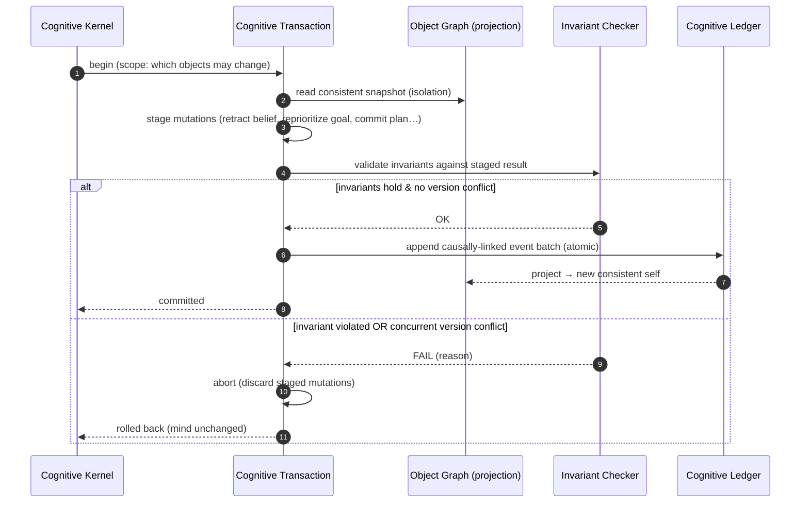

## 12.6 Concurrency, conflict, and version control

- **Concurrent cognition:** multiple cognitive threads (multi-focus attention) or multiple agents
  (multi-agent) may run transactions simultaneously. Each reads an **isolated consistent snapshot**;
  writes are validated at commit.
- **Version conflict detection (optimistic):** if two transactions modify the same object version, the
  second to commit detects the version mismatch and is **aborted and retried** against the new state —
  never blindly overwriting (the cognitive analogue of a lost-update bug, prevented).
- **Conflict resolution:** for genuine semantic conflicts (two threads reach contradictory beliefs), the
  transaction fails consistency (contradiction invariant) and routes to **belief arbitration** (Chapter
  4) or **metacognitive resolution** — the mind *notices* the conflict rather than silently picking one.
- **Deadlock avoidance:** transactions declare their object scope up front; the Kernel orders acquisition
  to prevent cyclic waits (and prefers optimistic validation to locking on hot paths).

## 12.7 Checkpoint & audit integration

- **Checkpoint integration:** a Checkpoint (Chapter 10) may be sealed **only at a transaction boundary**,
  guaranteeing it captures a *consistent* self (never a half-applied decision). Rollback restores to a
  checkpoint, i.e., to a committed transaction boundary.
- **Audit integration:** the committed event batch *is* the audit record (OL6). Every transaction records
  its authorizing Executive Decision (Chapter 9), so "which decision changed the mind, how, and whether
  it was consistent" is always answerable. Branching cognition (Chapter 10) runs transactions on an
  isolated branch; merging is itself a transaction with conflict resolution.

## 12.8 Edge cases

Partial faculty effect with mind rollback (the *mind's* state rolls back atomically, but a *world* effect
may have partially happened — this is why irreversible world-effects are checkpointed and guarded, and
why the Effect Boundary prefers dry-run/reversible actions; unavoidable irreversibility is escalated,
P10); long-running transaction (bounded; a cognitive act that cannot commit promptly is decomposed);
starvation of a repeatedly-conflicting transaction (bounded retries → escalate); crash mid-commit (the
append is atomic — either the batch is in the Ledger or it isn't; recovery replays only committed
batches); invariant checker itself uncertain (fails safe: abort rather than commit a possibly-incoherent
mind).

## 12.9 Why this is superior to the alternatives

| Chosen | Rejected alternative | Why rejected |
|---|---|---|
| ACID cognitive transactions over an event-sourced graph | **(A)** Direct, unwrapped object mutations | Any mid-sequence failure leaves an incoherent, self-contradictory mind that cannot be reasoned about or recovered. |
| Optimistic version-conflict detection | **(B)** Last-write-wins | Silent lost updates; one thread's cognition erases another's — undetectable corruption. |
| Consistency = explicit cognitive invariants | **(C)** No invariant checking | The mind could commit contradictory beliefs or a cyclic goal graph — incoherence becomes permanent. |
| Checkpoints only at transaction boundaries | **(D)** Snapshot anytime | Snapshots of half-applied acts are corrupt-by-construction; recovery would restore an incoherent self. |

## 12.10 Complete Example

The Executive Decision "escalate the prod change, pre-stage canary" (Chapter 9) triggers a single
**cognitive transaction** T. T stages four mutations: (1) retract Belief "the fix is safe to apply
autonomously" (confidence collapsed by the risk appraisal); (2) reprioritize the Goal "apply fix" to
*blocked-on-approval*; (3) commit Plan v2 (canary + escalate); (4) seal Checkpoint CP1. The invariant
checker verifies: belief coherence (no contradiction remains), goal-graph acyclicity (intact), identity
precedence (the escalation respects the Core constraint), confidence monotonicity (holds). All pass; a
concurrent reflection thread modified an *unrelated* Goal, so no version conflict. T commits as one
causally-linked event batch authorized by the Decision; the projection advances to a new consistent self;
CP1 is sealed exactly at this boundary. Had the invariant check failed, T would have aborted, leaving the
mind *exactly* as it was — never half-escalated. The whole act is atomic, consistent, isolated, durable —
and permanently auditable.

---
---

# CHAPTER 13 — THE COMPLETE COGNITIVE OBJECT GRAPH *(canonical blueprint)*

## 13.1 The canonical flow

The mandated ordering — Identity → Goals → Attention → Working Memory → Beliefs → Predictions → Planning →
Executive Decisions → Reflection → Learning → Checkpoints → Cognitive State → Cognitive Ledger — is the
**canonical narrative of one cognitive act**, though (Phase 1, Ch1.3) all objects coexist and the true
topology is a graph around the Ledger. The blueprint below is the single diagram every remaining phase
must build upon.

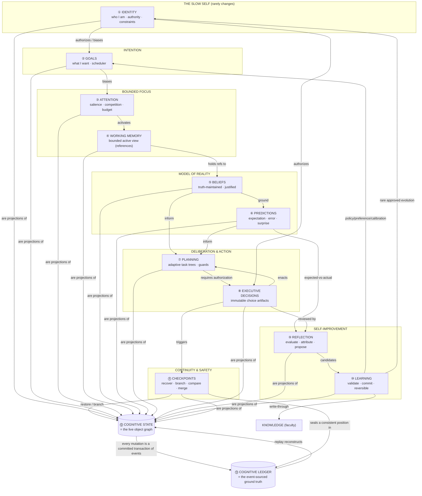

## 13.2 The flow of information between every object

Read as the life of a single stimulus becoming durable improvement:

1. **Identity → Goals.** The stable self authorizes and biases which goals are legitimate. Nothing the
   mind wants is illegitimate for who it is.
2. **Goals → Attention.** Active goals bias the salience field; the mind's purposes decide what competes
   for focus.
3. **Attention → Working Memory.** The winning coalition is *activated* — a small, bounded set of object
   references enters the active view (P3). Everything else stays dormant in the graph.
4. **Working Memory → Beliefs.** The active view is populated by beliefs (and the percepts that became
   them, and recalled Knowledge references). The mind now has a working model of the situation.
5. **Beliefs → Predictions.** Beliefs ground forecasts and expectations. The mind now anticipates.
6. **Beliefs + Predictions → Planning.** Grounded in what it believes and expects, the mind structures
   *how* to act — a task tree with guards, expectations, and fallbacks.
7. **Planning → Executive Decision.** A plan is not enacted until an executive decision *chooses* to
   commit it (recording alternatives, rationale, confidence, authority) — the causal hinge.
8. **Executive Decision → (Action) → Predictions resolve.** The plan executes via the Effect Boundary;
   outcomes are observed; expectations reconcile into prediction error and surprise.
9. **Predictions + Decisions → Reflection.** Expected-vs-actual and the decisions that caused the outcome
   are evaluated; mistakes/successes are attributed to specific objects.
10. **Reflection → Learning.** Candidate improvements are validated, (approved if impactful), committed as
    versioned reversible changes, and monitored — flowing *back* to Beliefs (promotion to Knowledge),
    Goals (priorities/preferences), Attention (calibration), and rarely Identity (evolution).
11. **Executive Decision → Checkpoint.** At consistent transaction boundaries (especially before risky
    acts and at episode close), the whole mind is sealed — recoverable, branchable, comparable.
12. **All objects ⇄ Cognitive State.** Every object is a *projection* of the live graph — the Cognitive
    State is not a container beside the objects; it *is* the objects-and-their-edges.
13. **Cognitive State ⇄ Cognitive Ledger.** Every mutation is a committed transaction of events in the
    Ledger; the live state is the Ledger's projection; any past self is a replay; any checkpoint is a
    sealed position. The Ledger is the ground truth from which the entire mind is reconstructable.

## 13.3 Why this is the canonical blueprint

This graph is **complete** (every object of the closed ontology appears), **closed** (no capability may
add a new object kind — P.5), **acyclic where it must be and looped where it should be** (the improvement
loop is the only path that writes back to the slow self), and **grounded in the Ledger** (so every state
is auditable and recoverable). Every remaining CIP phase — perception pipelines, the metacognitive
executive, multi-agent coordination, and each future faculty (Vision, Voice, Repository, Meeting,
Automation, Email, Embodied) — is, by construction, a matter of adding *instances* and *relationships* to
*this* graph. The vocabulary is fixed for the decade; the intelligence expressed in it is unbounded.

---
---

# APPENDIX A — Object → Region → Phase-0-Component Consistency Map

| COM Object (Phase 1.5) | Cognitive State Region (Phase 1) | Phase 0 Component |
|---|---|---|
| ① Identity Object | R1 Identity | Identity governor (within C0/C12) |
| ② Goal Object | R2 Intentional | C4 Goal Manager |
| ③ Attention Object | R3 Attention | C5 Attention Controller |
| ④ Working Memory (active view) | R4 Working-Memory Interface | C6 Working Memory |
| ⑤ Belief Object (+ Evidence, Percept) | R5 Belief / World Model | C8 World Model, C3 Perceptor, C7 Recall |
| ⑥ Prediction Object | R7 Predictive (+ R8 Temporal) | C8/C9 (predictive reasoning) |
| ⑦ Plan Object | R6 Deliberative | C9 Reasoning Supervisor, C10 Executive Planner |
| ⑧ Executive Decision Object | R9 Metacognitive (Executive Decisions) | C10/C12 |
| ⑨ Reflection Object | R9 Metacognitive (Reflection Queue) | C13 Reflection Engine |
| ⑩ Learning Object | R9 Metacognitive (Learning Queue) | C14 Learning System, C15 Strategy Store |
| ⑪ Checkpoint Object | (spans all regions) | C0 Kernel + C2 Ledger |
| ⑫ Cognitive State (the graph) | R1–R10 as a whole | C0 Cognitive Kernel |
| ⑬ Cognitive Ledger | Event substrate of all regions | C2 Cognitive Ledger |

Metacognition (Phase 0, C12) is not an object; it is the **supervisor** that reads the graph and the
Ledger and authors Executive Decisions and control signals (Phase 1, Ch10). The Cognitive Bus (Phase 0,
C1) is the transport over which transactions and broadcasts flow.

---

# APPENDIX B — The Universal Chapter Template, as applied

Each object chapter (1–10) instantiates the mandated research structure:

| Template section | Location in each object chapter |
|---|---|
| Purpose | §x.1 |
| Cognitive Philosophy | §x.2 |
| Conceptual Definition | §x.3 |
| Internal Anatomy | §x.4 |
| Lifecycle | §x.5 |
| Relationships | §x.6 |
| Behaviour | §x.7 |
| Decision Rules | §x.8 |
| Edge Cases | §x.9 |
| Future Evolution | §x.10 |
| Engineering Trade-offs | §x.11 |
| Complete Example | §x.12 |

Chapters 11 (Relationship Model), 12 (Cognitive Transactions), and 13 (Complete Object Graph) follow their
own mandated structures.

---

### Ontological closing

The UnityWorks mind is a graph of twelve kinds of living object — Identity, Goal, Attention, Belief,
Prediction, Plan, Executive Decision, Reflection, Learning, Checkpoint (plus the Percept and Evidence
sub-objects) — connected by eleven kinds of typed relationship, mutated only through consistent cognitive
transactions, and grounded entirely in an event-sourced Cognitive Ledger from which any state, any past
self, and any alternative self can be reconstructed. This ontology is closed and permanent: every future
capability reuses these objects and these relationships, or it amends this constitution. The structure is
fixed for the decade; the intelligence that lives within it is free to grow without bound.
