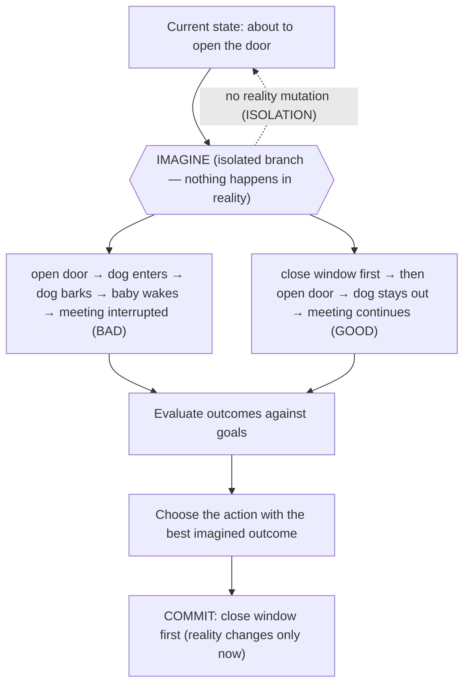
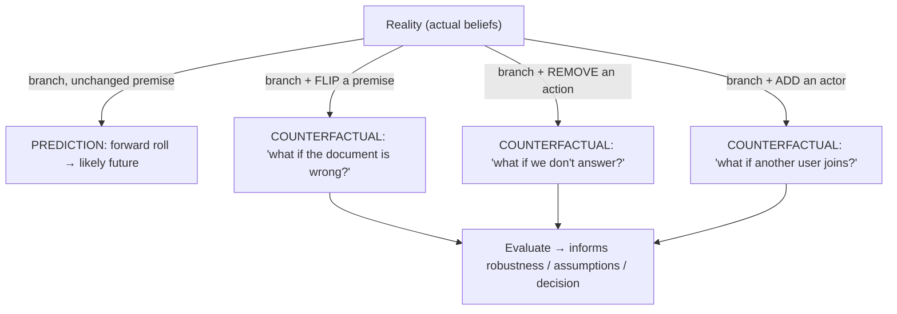
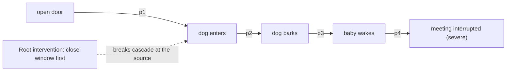
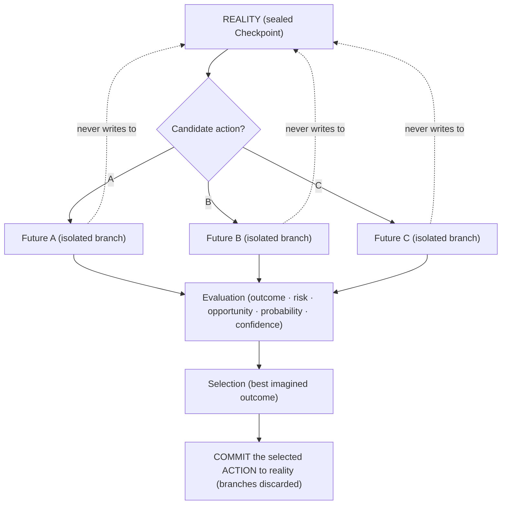

# UnityWorks Cognitive Intelligence Platform

## Phase 6 — The Predictive Cognition & Mental Simulation Architecture

> **The Imagining Mind of UnityWorks**

| | |
|---|---|
| **Phase** | 6 — Predictive Cognition & Mental Simulation |
| **Predecessors (frozen as law)** | Phase 0 (Philosophy) · 1 (State) · 1.5 (Object Model) · 2 (Runtime) · 2.5 (Global Workspace) · 3 (Attention) · 4 (Reasoning) · 5 (Executive) |
| **Status** | Research-grade architectural specification. No code, no APIs, no schemas, no frameworks, no languages, no implementation. |
| **Correctness horizon** | Must remain valid 15 years, independent of model architecture. |
| **Register** | A dissertation in Cognitive Systems and Computational Neuroscience — *why, what, how it works conceptually, alternatives, why rejected, trade-offs, scientific foundations.* |
| **Constitutional role** | The permanent blueprint for imagination inside UnityWorks — how the mind pre-experiences futures before committing to actions. |

This document **integrates with, and does not modify,** every frozen phase. It inherits and preserves:
**P1–P12** (Phase 0); the ten **Regions** and the **confidence currency** (Phase 1); the twelve object
kinds, **OL1–OL9**, the **Prediction Object** (Ch5), the **Checkpoint Object** (Ch10), the eleven
relationship types (Phase 1.5); the runtime, the **cognitive cycle**, **cognitive transactions** &
**isolation**, the **Cognitive Clock**, **RL1–RL8** (Phase 2); the **Conscious Field**, **CL1–CL27**
(Phase 2.5); the attention **salience economy**, **AL1–AL17** (Phase 3); the **reasoning faculty**, the
**Reasoning Engine Port**, counterfactual/simulation types & strategies, **ReL1–ReL14** (Phase 4); and the
**Executive Mind**, its resource governance, and **ExL1–ExL30** (Phase 5).

### What this phase adds, mechanically, without redesign

Prediction and counterfactuals are not new to the constitution — the **Prediction Object** (Phase 1.5,
Ch5) and the **Checkpoint branching** mechanism (Phase 1.5, Ch10) were designed precisely to anticipate
this phase. Phase 6 does two things and *only* two things at the ontological level:

1. It **elevates the Prediction Object into a full subsystem** — the machinery that *generates, runs,
   evaluates, and manages* predictions and possible futures at scale.
2. It **specifies mental simulation as branched, isolated, reasoning-driven imagination** — realized by
   Checkpoint branches (isolation) run on the reasoning engines (model-independence), producing
   Prediction Objects (the existing kind), quarantined from belief.

No new object *kind* is introduced (the Phase 1.5 ontology stays closed, P.5). A "simulation" is a
*Checkpoint branch* populated with *hypothetical, tagged* Belief/Prediction objects and run by the
*reasoning faculty* — all existing machinery, newly orchestrated.

### The two safety spines of this entire phase

Everything below is disciplined by two inviolable guarantees, stated once here:

- **ISOLATION — simulation never mutates reality.** Every simulation runs on an **isolated Checkpoint
  branch** (Phase 1.5, Ch10) under **transaction isolation** (Phase 2, Ch9). The imagining mind can
  explore catastrophic futures at zero cost to the real cognitive state, exactly as a person can imagine
  opening the door without the dog actually entering. *(Law PrL8.)*
- **QUARANTINE — imagined content never becomes belief.** Simulated states and counterfactuals are
  **tagged hypothetical** and held in a **quarantined Simulation Memory** (Chapter 9). Nothing imagined
  may silently cross into the belief graph (Long-Term Memory). This prevents the mind from coming to
  *believe what it merely imagined* — a confabulation failure that would be catastrophic. *(Law PrL9.)*

Hold these two throughout: imagination is a **safe sandbox**, walled off from both action and belief.

---

## Table of Contents

- **Chapter 0** — Scientific Foundations of Prediction & Simulation
- **Chapter 1** — The Philosophy of Predictive Cognition
- **Chapter 2** — The Mental Simulation Architecture (the subsystem)
- **Chapter 3** — Scenario Generation
- **Chapter 4** — Counterfactual Thinking
- **Chapter 5** — Risk Intelligence
- **Chapter 6** — Opportunity Intelligence
- **Chapter 7** — Prediction Confidence
- **Chapter 8** — Branching Futures
- **Chapter 9** — Simulation Memory
- **Chapter 10** — Executive Integration
- **Chapter 11** — Reasoning Integration
- **Chapter 12** — Future Platform Integration
- **Chapter 13** — The Predictive Laws (the constitution)
- **Appendix A** — Consistency map to prior phases
- **Appendix B** — The isolation/quarantine safety case

---
---

# CHAPTER 0 — SCIENTIFIC FOUNDATIONS OF PREDICTION & SIMULATION

> A review that *justifies architecture*. For each theory: core idea · strengths · weaknesses ·
> engineering implication · **decision (adopt/adapt/reject)** · why. The chapter ends with the UnityWorks
> predictive philosophy.

## 0.1 The founding intuition — Craik's "small-scale model"

In 1943, Kenneth Craik proposed that an organism carrying "a small-scale model of external reality" can
"try out various alternatives, conclude which is the best of them, react to future situations before they
arise." This single sentence is the charter of this phase: intelligence is the capacity to **model
reality and run the model forward to pre-experience consequences before paying their cost.** Every theory
below is a refinement of Craik, and UnityWorks' architecture is Craik's proposal made rigorous and safe.

## 0.2 The foundations, compared

| # | Theory | Core idea | Strengths | Weaknesses | Decision |
|---|---|---|---|---|---|
| 1 | **Mental Simulation Theory** (Barsalou; Hesslow's *simulation hypothesis*) | The mind imagines by *re-enacting* perception/action on the same machinery it uses to perceive/act | Explains embodied, grounded imagination; parsimonious (reuse) | Hard to delimit; vision-/action-centric | **Adopt** — simulation *reuses the mind's own faculties* (reasoning engines + world model) on isolated branches |
| 2 | **Predictive Processing** (Clark; Friston) | The brain constantly generates predictions; error drives learning/attention | Grand unifying account | Heavy if literal | **Adopt** — the mind is fundamentally predictive (already law across prior phases) |
| 3 | **Predictive Coding** (Rao & Ballard) | Hierarchical prediction; only error propagates upward | Mechanistic; multi-level | Neurally specific | **Adapt** — hierarchical predictions across *multiple horizons*; error → revision |
| 4 | **Mental Models** (Johnson-Laird) | Reasoning builds and *runs* internal models rather than proofs | Explains simulation-based inference | Under-specified construction | **Adopt** — a simulation *is* a mental model run forward (already adopted, Phase 4) |
| 5 | **Prospection** (Gilbert & Wilson; Seligman — *Homo prospectus*) | Humans are fundamentally future-oriented; the brain pre-experiences the future | Reframes cognition around the future | Descriptive | **Adopt** — prospection is the *purpose* of the whole subsystem |
| 6 | **Counterfactual Thinking** (Byrne; Pearl's 3rd rung) | Reasoning about alternatives to what is/was | Powerful for learning, blame/credit, robustness | Combinatorial; hindsight bias | **Adopt** — Chapter 4; realized by branching from a *modified* premise |
| 7 | **Active Inference** (Friston) | Policies selected by imagined (expected-free-energy) rollouts | Unifies action + perception + prediction | Abstract; intractable literally | **Adapt** — *policy-as-imagined-rollout* framing; reject the literal free-energy runtime |
| 8 | **Forward Models** (Wolpert; motor control; efference copy) | The brain predicts the *sensory consequence of its own action* before acting | Precise, well-evidenced mechanism | Motor-specific origin | **Adopt** — the core mechanism for *self-prediction* and *action rehearsal* |
| 9 | **Model-Based RL** (Sutton's *Dyna*; Ha & Schmidhuber *World Models*; MuZero) | Learn a world model; plan by simulating rollouts | Sample-efficient; model-based planning | A single learned neural model is opaque/brittle | **Adapt** — the *plan-by-rollout* backbone; reject a single opaque neural world-model as the *only* substrate (UnityWorks' world model is the model-independent belief/knowledge graph + engines) |
| 10 | **Monte Carlo Tree Search** (AlphaGo/AlphaZero) | Selectively expand a tree of futures; balance explore/exploit via rollouts + value estimates | Bounded, anytime, principled selectivity | A specific algorithm | **Adapt** — the *branching-search strategy* (selective, bounded expansion); reject as a fixed algorithm (model-independent guidance only) |
| 11 | **Dreaming / Offline Simulation** (hippocampal replay; Dyna planning-as-replay; generative replay) | The brain simulates *offline* (rest/sleep) to consolidate and plan | Explains offline improvement | Mechanism debated | **Adopt** — *idle-time simulation & rehearsal* (Phase 2, Ch4.5): the mind "dreams" to plan and consolidate |
| 12 | **Constructive Episodic Simulation** (Schacter & Addis) | Memory and imagination share the *same constructive machinery* | Explains why remembering and imagining feel alike; predicts confabulation risk | — | **Adopt as a warning** — shared machinery *demands* the **quarantine** (imagination must not corrupt memory, PrL9) |

## 0.3 Deep dives on the pillars

**Mental Simulation + Forward Models (adopt — the mechanism).** UnityWorks imagines by *reusing its own
faculties*: it constructs a hypothetical world state (a branched belief set), then applies a **forward
model** — "given this state and this action, what state results?" — repeatedly, to roll the future
forward. The forward model *is* causal reasoning (Phase 4) run generatively. This reuse (Hesslow) is why
imagination needs no separate "imagination engine": it runs on the reasoning engines behind the port
(model-independence). Self-prediction ("what will *I* do/conclude?") is a forward model applied to the
mind itself; user-prediction and environmental-prediction apply it to models of others and the world.

**Model-Based RL + MCTS (adapt — the search discipline, not the algorithm).** Planning by rolling out a
world model, and *selectively* expanding the most promising/uncertain branches under a bounded budget
(MCTS's explore/exploit), are exactly what UnityWorks needs — but as **model-independent strategy
guidance**, never as a committed algorithm. UnityWorks explicitly rejects binding imagination to a single
learned neural world-model (opaque, brittle, model-*dependent*); its world model is the transparent,
auditable belief/knowledge graph plus substitutable engines. The *discipline* (bounded, selective,
anytime, rollout-based) is adopted; the *specific mechanism* is not, so any future engine realizes it.

**Constructive Episodic Simulation (adopt as a warning — the quarantine imperative).** Schacter's finding
that memory and imagination share machinery is the most important *cautionary* result in the chapter: if
the same system reconstructs the past and constructs the future, imagined content can *contaminate*
memory (source-monitoring errors; false memories). For a machine mind this would be catastrophic — the
mind could come to *believe what it merely simulated*. Therefore UnityWorks **architecturally quarantines
simulation** (Chapter 9, PrL9): imagined content is tagged hypothetical and walled off from belief. The
science does not merely inspire a feature here; it *mandates a safety boundary*.

**Dreaming / Offline Simulation (adopt — imagination in idle time).** The brain does much of its
simulation offline (replay during rest/sleep) to consolidate and plan. UnityWorks does likewise: the
**idle/low-power cognition** of the runtime (Phase 2, Ch4.5) is used to run simulations, rehearse likely
conversations and actions, and stress-test plans — so that when a real situation arrives, the mind has
already pre-experienced much of it. "Dreaming" is not a metaphor here; it is *scheduled background
prediction and rehearsal*.

## 0.4 The UnityWorks predictive philosophy

> UnityWorks predictive cognition is a **bounded, model-based, offline-capable, branching simulation
> faculty** that realizes Craik's proposal: it constructs *mental models of possible futures*
> (Johnson-Laird), rolls them forward with *forward models* (Wolpert) that are causal reasoning run
> generatively, explores them by *selective bounded branching search* (MCTS-discipline) over the
> transparent belief/world model (rejecting opaque single-model substrates), evaluates outcomes into
> *confidence-qualified, expiring* **Prediction Objects**, supports *counterfactuals* (Pearl) via
> branches from modified premises, runs in *idle time* (replay/Dyna), reuses the *reasoning engines*
> (model-independent) — and, disciplined by the shared-machinery warning (Schacter), keeps imagination in
> a **safe sandbox**: it **never mutates reality** and **never becomes belief.** Imagination is the mind's
> capacity to fail safely, before it acts.

---
---

# CHAPTER 1 — THE PHILOSOPHY OF PREDICTIVE COGNITION

## 1.1 Why prediction exists

Prediction exists because **the future is where all consequences live, and consequences are what
intelligence must manage.** An organism that reacts only to the present is at the mercy of whatever the
present becomes; an organism that *anticipates* can prepare, avoid, and seize. Anticipation is not a
luxury feature of intelligence — it is, per Craik, its *essence*: to "react to future situations before
they arise." The value of prediction is the value of *time*: it lets the mind act on a future while there
is still time to shape it.

## 1.2 Why reasoning cannot replace prediction

Reasoning (Phase 4) transforms conscious content into conclusions **about what is or is believed**.
Prediction concerns **what could be — hypothetical futures that do not yet exist.** The difference is
directional and ontological:

- Reasoning draws conclusions *from* premises that are taken as given.
- Prediction/simulation *generates* the hypothetical premises (possible futures) in the first place, then
  reasons *within* them.

A mind that could only reason would reason impeccably about the actual — and be helpless before the
possible, because it would have no possible worlds to reason about. Prediction is the faculty that
*produces the futures* reasoning then evaluates. Reasoning is *analysis of the given*; prediction is
*generation of the not-yet-given*. Reasoning consumes prediction's output; it cannot replace its input.

## 1.3 Why planning cannot replace prediction

Planning (Phase 4, Ch6) produces *action sequences* to achieve a goal. But how does planning know whether
a proposed action sequence will *work*? Only by **modeling its consequences** — which is prediction. A
plan without a consequence-model is a hope; a plan evaluated against simulated outcomes is a strategy.
Planning asks *"what should I do?"*; prediction answers *"what would happen if I did X?"* — and planning
*cannot even choose* without that answer. Planning is the *consumer* of prediction: every guard,
expectation, and fallback in a Plan Object (Phase 1.5, Ch6) is a *prediction* about what an action will
cause. Planning organizes action; prediction foresees its results. They are complementary, not
substitutable.

## 1.4 Why imagination is necessary — the safe-failure principle

The deepest justification. Trial-and-error is how minds learn what works — but **trial-and-error in
reality is dangerous, slow, and often irreversible.** Open the door and the dog *does* enter; the baby
*does* wake; the meeting *is* interrupted — and none of it can be undone. Imagination is the evolutionary
and architectural solution: **run the trial in a model, suffer the error in imagination, and pay nothing
in reality.** Imagination *decouples evaluation from action* — the single most important capability a
consequential agent can have. It lets the mind explore the catastrophic and the excellent alike, at zero
cost, and commit only to the action whose *imagined* outcome is best. This is the entire point of the
door/dog example, and the entire point of this phase:



No action happened during imagination. The dog never entered. The mind *pre-experienced* the bad future
and avoided it — the safe-failure principle in one picture.

## 1.5 Why humans simulate before acting

Because reality is unforgiving and cognition is cheap. The metabolic cost of imagining a disaster is
trivial; the cost of causing one is not. Natural selection favored minds that *look before they leap* —
that run the model first. Model-based control (Tolman's cognitive maps; the prefrontal prospection
networks) is the neural realization: the brain simulates candidate actions, evaluates their predicted
outcomes, and executes only the winner. UnityWorks, as a *consequential* system that will act on
documents, code, communications, and (in future) the physical world, must do the same — and must do it
*more* rigorously than humans, who are famously bad at prospection (optimism bias, affective
forecasting errors). The architecture's confidence, calibration, and quarantine machinery (Chapters 7, 9)
exist precisely to make UnityWorks' imagination *better calibrated* than the human original.

## 1.6 Why prediction increases intelligence

Intelligence is adaptive action under uncertainty. Prediction increases every term of that definition:
it makes action *adaptive* (chosen for its foreseen consequences, not its immediate impulse), it manages
*uncertainty* (by exploring multiple futures and weighting them), and it extends the *horizon* over which
the mind can be effective (from the reactive present to the anticipated future). A mind with prediction
is not merely faster or more knowledgeable than one without — it operates in a *different regime*: it acts
on futures rather than merely reacting to presents. This regime shift is why prediction is not one
faculty among many but a *multiplier* on the whole mind — and why every advanced cognitive system, from
the mammalian brain to AlphaZero, is built around it.

---
---

# CHAPTER 2 — THE MENTAL SIMULATION ARCHITECTURE (THE SUBSYSTEM)

## 2.1 The subsystem

Seventeen components, each with one responsibility (OL1), each independently replaceable (P6/OL8). All
operate **on isolated branches** (ISOLATION) and produce **quarantined, tagged** outputs (QUARANTINE).

```mermaid
flowchart TB
    REQ["Simulation request (from Executive / Reasoning / Planning)"] --> SC
    subgraph FACULTY["THE MENTAL SIMULATION FACULTY"]
      SC["Simulation Controller"]
      SSch["Simulation Scheduler"]
      AG["Alternative Generator (which actions to test)"]
      SG["Scenario Generator (which futures/worlds)"]
      FWB["Future World Builder (branched hypothetical state)"]
      PE["Prediction Engine (forward-model rollout)"]
      CEval["Consequence Evaluator (multi-step cascade)"]
      OE["Outcome Evaluator (value vs goals)"]
      RE["Risk Estimator"]
      OppE["Opportunity Estimator"]
      UA["Uncertainty Analyzer"]
      PrE["Probability Engine"]
      BM["Branch Manager (create/merge/prune/compare)"]
      SM["Simulation Memory (quarantined)"]
      SCache["Simulation Cache"]
      SMon["Simulation Monitor"]
      SAud["Simulation Audit Layer"]
    end
    SC --> SSch
    SC --> AG --> SG --> FWB
    FWB --> PE --> CEval --> OE
    OE --> RE & OppE & UA & PrE
    PE -. rollout steps .-> BM
    BM -. isolated branches (Phase 1.5 Ch10) .-> FWB
    OE --> RANK["Ranked, confidence-qualified Prediction Objects"]
    RANK --> OUT["→ Executive / Planning (Ch10)"]
    SM -. quarantined store .-> SC
    SCache -. reuse .-> PE
    SMon -. observes .-> SC
    SAud -. records (tagged hypothetical) .-> LEDGER[("Cognitive Ledger")]
```

## 2.2 The components

For each: **purpose · responsibilities · inputs · outputs · boundaries · failure modes · recovery ·
alternatives rejected · why it cannot be merged.**

**1. Simulation Controller.** *Purpose:* orchestrate a simulation episode end-to-end. *Responsibilities:*
receive a request (from the Executive, Reasoning, or Planning), commission alternatives/scenarios,
sequence the rollout, gather evaluations, return ranked predictions. *Inputs:* a simulation request
(current state ref + question + budget). *Outputs:* ranked, confidence-qualified Prediction Objects.
*Boundaries:* it orchestrates imagination; it commits *nothing* to reality (ISOLATION) and *believes*
nothing (QUARANTINE). *Failure:* runaway simulation → the Scheduler's budget forces stop. *Recovery:*
abandon the episode; return best-so-far (anytime). *Rejected:* a monolithic "imagine" call — opaque,
unbounded, unauditable. *Why not merged:* orchestration policy must be separable from the mechanisms it
sequences.

**2. Simulation Scheduler.** *Purpose:* decide *when* and *how much* to simulate, under the executive's
budget (Phase 5, Ch5). *Responsibilities:* allocate simulation depth/breadth; schedule *idle-time*
background simulation (the "dreaming" of §0.3); enforce anytime bounds. *Boundaries:* budgets imagination;
does not run it. *Failure:* over-scheduling starves real cognition → the executive re-caps the budget.
*Why not merged:* imagination is *expensive*; *when/how-much* is a distinct economic control from *how*
(Controller) — conflating them lets imagination consume the mind (a real failure mode: rumination).

**3. Alternative Generator.** *Purpose:* generate the *actions/choices* whose futures will be simulated
(the "A vs B vs C"). *Inputs:* the decision context + goals. *Outputs:* a bounded set of candidate
actions. *Boundaries:* generates *actions to test*, not *outcomes*. *Why not merged with Scenario
Generator:* actions (what the mind *could do*) and scenarios (how the world *could respond*) are
orthogonal — the same action has many possible outcomes, and the same outcome can follow many actions;
crossing them is the source of combinatorial explosion that only *separate, bounded* generators can
control.

**4. Scenario Generator.** *Purpose:* generate the *possible outcomes/world-responses* for an action
(Chapter 3). *Outputs:* a bounded set of scenarios (single/multiple/extreme/low-probability/creative).
*Why not merged:* see above — worlds ≠ actions.

**5. Future World Builder.** *Purpose:* construct the *hypothetical world state* for a scenario — a
**branched, isolated copy** of the relevant world model (via Checkpoint branching, Phase 1.5, Ch10),
populated with *tagged-hypothetical* beliefs. *Boundaries:* it builds sandboxes; it *guarantees isolation*
(the branch cannot write to the real line). *Failure:* branch construction failure → fall back to a
coarser (cheaper) world model. *Why not merged:* the *isolation boundary itself* is a dedicated safety
responsibility (PrL8); it must be one auditable component, not diffused.

**6. Prediction Engine.** *Purpose:* run the **forward model** — given a hypothetical state + action,
predict the next state (one rollout step) — repeatedly, to unfold a future. *Inputs:* a hypothetical
state + an action. *Outputs:* the predicted next hypothetical state. *Boundaries:* it predicts *forward*;
it does not judge *value* (that is the Outcome Evaluator). It uses the **reasoning engines behind the
Port** (Phase 4) — causal reasoning run generatively — so it is model-independent. *Failure:* engine
failure → fall back to a cheaper engine or a shallower rollout (graceful degradation, ReL14). *Why not
merged with Outcome Evaluator:* *predicting what happens* and *judging whether it is good* are distinct —
a future can be predicted with high confidence and be terrible; conflating prediction with valuation hides
this and biases the model toward wishful prediction.

**7. Consequence Evaluator.** *Purpose:* trace the *multi-step causal cascade* of a rollout — the chain
dog→bark→baby→meeting. *Inputs:* a rollout sequence. *Outputs:* the consequence chain with its links.
*Boundaries:* it traces *chains of effects*; the Outcome Evaluator judges the *final value*. *Why not
merged with Outcome Evaluator:* the *cascade* (what leads to what) is distinct from the *verdict* (is the
end-state good) — cascades reveal *why* an outcome is good/bad and where to intervene (close the window),
which a single final verdict hides.

**8. Outcome Evaluator.** *Purpose:* judge a simulated end-state's *value* against goals, identity, and
policy. *Outputs:* an outcome value (with the safety/identity gates of Phase 3, Ch3.4 and Phase 5).
*Boundaries:* it judges value; it does not estimate risk/opportunity magnitudes (dedicated estimators do).
*Why not merged:* overall value, risk, and opportunity are *different measurements* (§5–§6) that must be
separately inspectable.

**9. Risk Estimator.** *(Chapter 5.)* Estimates the risks in a simulated future. *Why not merged with
Opportunity Estimator:* risk and opportunity are *asymmetric* (losses vs gains, different taxonomies,
different postures — loss-aversion vs gain-seeking); merging them averages away the asymmetry the mind
must preserve.

**10. Opportunity Estimator.** *(Chapter 6.)* Estimates the opportunities in a simulated future. *Why not
merged:* see above.

**11. Uncertainty Analyzer.** *Purpose:* quantify *how reliable* a prediction is — epistemic (reducible)
vs aleatoric (irreducible) uncertainty (Phase 1, Ch6). *Outputs:* uncertainty typing per prediction.
*Why not merged with the Probability Engine:* *probability* is "how likely is this outcome?"; *uncertainty*
is "how much do I trust that probability?" — a 60% estimate can be confidently or shakily held; conflating
them produces false precision (a rejected design in Phase 1, Ch6).

**12. Probability Engine.** *Purpose:* assign probabilities to branches/outcomes. *Boundaries:* assigns
likelihoods; the Uncertainty Analyzer qualifies their reliability. *Why not merged:* see above.

**13. Branch Manager.** *(Chapter 8.)* Manages the tree of simulated futures — creation, merging,
pruning, abandonment, comparison, inheritance — over isolated Checkpoint branches. *Why not merged with
Future World Builder:* the Builder *creates a single sandbox*; the Branch Manager *governs the whole
tree* of sandboxes (which to expand, which to prune) — portfolio vs instance.

**14. Simulation Memory.** *(Chapter 9.)* The **quarantined** store of simulations. *Why not merged with
Working/Long-Term Memory:* it holds *hypothetical* content that must be walled off from belief (PrL9) —
merging it with real memory is the confabulation catastrophe (§0.3).

**15. Simulation Cache.** *Purpose:* cache reusable rollout results to avoid re-simulating identical
scenarios. *Boundaries:* a *performance* store of *hypothetical* results (still quarantined); distinct
from Simulation Memory (the *history/record*). *Why not merged:* cache (fast reuse, evictable) vs memory
(durable record for reflection) are different lifetimes and purposes.

**16. Simulation Monitor.** *Purpose:* observe the subsystem — depth, breadth, budget burn, runaway,
rumination. *Boundaries:* read-only. *Why not merged:* observation independent of control (P4).

**17. Simulation Audit Layer.** *Purpose:* record every simulation — *tagged as hypothetical* — for
reflection, calibration, and audit. *Boundaries:* records; the tag ensures the audit trail can never be
mistaken for a record of *actual* events (a subtlety the QUARANTINE demands). *Why not merged:*
auditability of imagination must be structurally guaranteed and clearly *marked hypothetical*.

## 2.3 Why seventeen, decomposed

The count is the minimum in which each concern — orchestration, scheduling/economy, action-generation,
scenario-generation, sandbox-construction (isolation), forward-rollout, cascade-tracing, valuation,
risk, opportunity, uncertainty, probability, branch-portfolio, memory, cache, oversight, and audit — has a
named, inspectable owner, and in which the safety boundaries (isolation at the World Builder; quarantine
at Simulation Memory/Audit) are *dedicated* rather than diffused. Decomposition is what makes imagination
*auditable and safe* rather than an opaque "the model imagined something."

---
---

# CHAPTER 3 — SCENARIO GENERATION

## 3.1 The generation pipeline


## 3.2 The scenario types — and why the mind needs each

A mind that imagined only the single most-likely future would be brittle (blind to tail risk) and
uncreative (blind to non-obvious opportunity). UnityWorks generates *several kinds* of future, each
serving a distinct cognitive need:

| Scenario type | What it is | Why the mind needs it |
|---|---|---|
| **Single future** | The one most-likely outcome | Fast, cheap default for low-stakes/high-certainty matters (System-1 prediction) |
| **Multiple futures** | Several plausible outcomes | Represents genuine uncertainty; the default for consequential decisions |
| **Parallel futures** | Multiple futures explored *concurrently* on isolated branches | Efficient comparison of alternatives (decision rehearsal) |
| **Impossible futures** | Futures that *violate constraints/causality* | Constraint-checking: recognizing a future *cannot* happen prunes wasted planning and detects flawed premises |
| **Extreme futures** | Best/worst-case tails | Robustness & safety: the mind must foresee the catastrophic even if unlikely (tail-risk, Ch5) |
| **Low-probability futures** | Unlikely but consequential outcomes | Safety margins: an unlikely disaster still warrants a mitigation |
| **Creative futures** | Novel, non-obvious outcomes/combinations | Opportunity discovery (Ch6); escaping the obvious |

## 3.3 Bounded, selective generation — never exhaustive

The space of possible futures is combinatorially infinite; the mind cannot enumerate it (P3). Scenario
generation is therefore **selective and bounded** (MCTS-discipline, §0.3): the generators expand the
*most decision-relevant* futures first — guided by salience (Phase 3), value, uncertainty, and the
executive's budget — and stop when the anytime budget is spent or the futures have converged enough to
decide. Extreme and low-probability futures are generated *not* by exhaustive search but by *targeted*
generation toward the tails when stakes/irreversibility are high (a safety-driven expansion). Creative
futures are generated by the reasoning faculty's *divergence* strategy (Phase 4, Ch5). Generation is thus
an *economy* (Chapter 10 budgets it), not an enumeration.

## 3.4 Why selective generation, not exhaustive or single

- **Rejected: exhaustive enumeration.** *Disadvantage:* combinatorial explosion; impossible under bounded
  cognition. *Violates:* P3.
- **Rejected: single-future only ("predict the most likely and act").** *Disadvantage:* brittle to tail
  risk, blind to opportunity, overconfident. *Violates:* the safe-failure principle for consequential
  decisions.
- **Adopted: bounded, selective, stakes-scaled generation of several scenario types.** Cheap single
  futures for the trivial; multiple/extreme/low-probability futures for the consequential; creative
  futures when opportunity-seeking. This is the only model that is bounded *and* robust *and* creative.

---
---

# CHAPTER 4 — COUNTERFACTUAL THINKING

## 4.1 Counterfactual vs prediction — the precise difference

Both use branching; they differ in *where the branch departs from*:

| | **Prediction** | **Counterfactual** |
|---|---|---|
| Branch point | The **actual** present state | A **modified** premise (a flipped belief, a changed past decision, a contrary-to-fact assumption) |
| Question | "What *will* happen if I do X *now*?" | "What *would* happen / have happened if things were *different*?" |
| Direction | Forward from reality | Sideways from a counter-to-fact departure |
| Pearl's ladder | Rung 2 (intervention: *doing*) | Rung 3 (counterfactual: *imagining otherwise*) |

Prediction rolls the *actual* world forward. Counterfactual **first alters a premise, then rolls the
*altered* world forward.** Both are simulations on isolated branches (ISOLATION); the counterfactual is
distinguished by its *modified starting premise*.



## 4.2 The uses of counterfactual cognition

| "What if…" | Purpose | Premise modification |
|---|---|---|
| *…we don't answer?* | Evaluate the cost of *inaction* (the negative space) | Remove the candidate action |
| *…the document is wrong?* | Test robustness to a false belief | Flip a belief's truth |
| *…another user joins?* | Anticipate a changed context | Add an actor to the world |
| *…the customer rejects this?* | Prepare for an adverse response | Assume an adverse outcome |
| *…this assumption fails?* | Audit dependence on an assumption (the killer question) | Negate a load-bearing assumption |

The last is the most important: **counterfactuals are how the mind audits its own assumptions.** By
imagining "what if this assumption fails?", the mind discovers which conclusions are *fragile*
(assumption-dependent) versus *robust* — exactly the fragility analysis reflection needs (Phase 4, Ch8).
This is why counterfactual thinking is a first-class faculty, not a curiosity.

## 4.3 The inviolable rule — counterfactuals never become memory

A counterfactual imagines a world *contrary to fact*. If such content leaked into belief, the mind would
come to "remember" things that never happened (the Schacter confabulation risk, §0.3). Therefore
counterfactual content is **doubly quarantined**: tagged not only *hypothetical* but *contrary-to-fact*,
and it may **never** be promoted to belief or memory (PrL9, PrL10). The mind may *learn from* a
counterfactual (e.g., "my conclusion was assumption-fragile") — that *lesson* is a legitimate learning
candidate — but the *counterfactual world itself* is discarded. The mind keeps the *insight*, never the
*false world*.

---
---

# CHAPTER 5 — RISK INTELLIGENCE

## 5.1 Why risk is a first-class product of simulation

Simulation's most important yield is often *what could go wrong*. Risk Intelligence is the disciplined
extraction, propagation, and prioritization of the dangers a simulated future reveals — the machinery
behind "better close the window first."

## 5.2 The risk taxonomy — the kinds of cognitive risk

| Risk type | What it endangers | Example |
|---|---|---|
| **Goal-failure risk** | Achievement of an active goal | "This approach won't meet the deadline" |
| **Safety risk** | A safety/policy constraint | "This action could expose sensitive data" |
| **Irreversibility risk** | The ability to undo | "Once merged, this can't be rolled back" |
| **Resource risk** | Exhaustion of a cognitive/real budget | "This will consume the whole reasoning budget" |
| **Epistemic risk** | Being wrong (a false belief drives the action) | "We're acting on an unverified assumption" |
| **Relationship/reputational risk** | Trust with the user/org | "This tone may damage the relationship" |
| **Cascade risk** | A chain of downstream failures | dog → bark → baby → meeting |
| **Opportunity-cost risk** | The value of the road not taken | "Choosing A forecloses B" |

## 5.3 Risk propagation and cascades

Risks are rarely isolated; they *propagate* along the causal chains the Consequence Evaluator traces
(§2.2). A **risk cascade** is a chain where one risk triggers the next — the essence of the door/dog
example. Simulation reveals cascades by rolling the future multiple steps forward, so the mind can
intervene *at the root* (close the window) rather than the symptom (quiet the dog). Cascade analysis is
why *multi-step* simulation (not single-step prediction) is essential: a single-step predictor sees "dog
enters"; only a multi-step simulator sees "…and therefore the meeting is ruined."



## 5.4 The risk dimensions

| Dimension | Meaning |
|---|---|
| **Confidence** | How reliable the risk estimate is (Uncertainty Analyzer) |
| **Severity** | How bad the outcome if it materializes |
| **Probability** | How likely it is (Probability Engine) |
| **Horizon** | How soon (near risks weigh more than distant ones, decaying confidence) |
| **Recoverability** | Whether the mind could recover if it materialized |
| **Mitigation** | What action would reduce it (often a *different* action — the window) |

## 5.5 Risk prioritization and the asymmetry principle

Risks are prioritized by a composition of **severity × probability × irreversibility ÷ recoverability**,
with an **asymmetry**: *tail risks are over-weighted*. A low-probability, high-severity, irreversible risk
(a catastrophe) is treated as more attention-worthy than its raw expected value suggests — because the
cost of a missed catastrophe is not symmetric with the cost of a missed minor gain. This asymmetry is a
*safety* decision (it biases the mind toward caution on the catastrophic) and connects directly to the
executive's risk-scaled autonomy thresholds (Phase 5, Ch4.4): high simulated risk raises the confidence
required to act autonomously, else escalate (P10).

---
---

# CHAPTER 6 — OPPORTUNITY INTELLIGENCE

## 6.1 Why opportunity is the necessary mirror of risk

A mind that only foresaw *risks* would be safe and useless — perpetually cautious, never seizing. Human
prospection foresees *gains* as avidly as *harms*; UnityWorks must too. Opportunity Intelligence is the
symmetric faculty: the disciplined discovery, scoring, and timing of *beneficial* futures. The executive
balances the two (risk-aversion vs opportunity-seeking) via the explore/exploit economy (Phase 3, Ch7;
Phase 4, Ch5) — over-weighting risk yields paralysis, over-weighting opportunity yields recklessness.

## 6.2 The opportunity dimensions

| Dimension | Meaning |
|---|---|
| **Discovery** | Detecting a beneficial future the mind was not seeking (often from *creative* scenarios, §3.2) |
| **Scoring** | Value × probability of the opportunity |
| **Timing** | *When* the opportunity is realizable |
| **Confidence** | Reliability of the estimate |
| **Value** | Magnitude of the potential gain (toward goals) |
| **Dependencies** | What must be true/done for it to materialize |
| **Windows** | The *time interval* during which it is available (opportunities expire) |
| **Evolution** | How the opportunity changes as conditions/time move |

## 6.3 Opportunity windows and timing — why opportunity is intrinsically temporal

The defining feature of opportunity, distinguishing it from risk, is the **window**: opportunities are
*time-bounded* — they open and close. A predicted gain that cannot be seized in time is not an
opportunity; it is a regret. Simulation therefore models not just *whether* an opportunity exists but
*when* its window opens and closes, and *what preparation* (dependencies) must be complete before it does.
This temporal structure ties opportunity to the goal system's deadlines (Phase 1.5, Ch2) and to the
executive's scheduling (Phase 5): the mind must *prepare* for a foreseen opportunity so it is *ready* when
the window opens — the prospective analogue of mitigating a foreseen risk. Foreseeing opportunity, like
foreseeing risk, is worthless unless it changes *present* preparation.

## 6.4 Why risk and opportunity are separate faculties (asymmetry, restated)

- **Rejected: a single signed "value" estimator** (positive = opportunity, negative = risk). *Disadvantage:*
  it averages away the *asymmetry* (tail-risk over-weighting vs opportunity-window timing), the *different
  postures* (aversion vs seeking), and the *different structure* (risks cascade; opportunities have
  windows). *Violates:* the safe-failure principle (which demands special treatment of the catastrophic).
- **Adopted: separate, asymmetric Risk and Opportunity estimators**, balanced by the executive. Only
  separation preserves the distinct treatments each requires.

---
---

# CHAPTER 7 — PREDICTION CONFIDENCE

## 7.1 Every prediction is a confidence-qualified hypothesis

Per the confidence currency (Phase 1, Ch6) and the Prediction Object (Phase 1.5, Ch5), **no prediction is
asserted as truth** (PrL1); every prediction carries a calibrated confidence and a typed uncertainty.
This chapter specifies how that confidence behaves over the life of a prediction.

## 7.2 The confidence mechanisms

| Mechanism | What it does | Grounding |
|---|---|---|
| **Prediction confidence** | The calibrated degree of belief that the predicted future will occur | Phase 1, Ch6 |
| **Confidence decay over horizon** | Confidence falls as the prediction reaches further into the future | Phase 1.5, §5.8 (horizon-decay) |
| **Confidence calibration** | Aligning stated confidence with realized accuracy over time | Reflection/meta (Phase 4, Ch8) |
| **Evidence weighting** | Predictions grounded in more/stronger evidence are more confident | Belief justification (Phase 1.5, Ch4) |
| **Competing predictions** | Multiple predictions for the same future coexist and are weighed, not averaged | Truth-maintenance (Phase 1.5, Ch4) |
| **Prediction uncertainty** | Typed epistemic (reducible by more simulation) vs aleatoric (irreducible) | Phase 1, Ch6 |
| **Confidence evolution over time** | As reality unfolds, confidence updates toward what actually occurs | Prediction reconciliation (Phase 1.5, Ch5) |

## 7.3 Confidence decay and the horizon floor

Confidence in a prediction **decays with its horizon**: near futures are predicted confidently, distant
futures shakily. This is not a defect but honesty — the future *is* less knowable further out. The
architecture enforces a **horizon-confidence floor** (Phase 1.5, §5.8): the mind will not *commit* an
action justified only by a distant prediction whose confidence at its horizon is below a risk-scaled
threshold — it will instead shorten the horizon, gather more evidence, or hedge. Long-term planning
therefore proceeds by *near-term confident steps toward a distant goal*, re-simulating as it goes, rather
than by trusting a single confident-looking long-range forecast.

## 7.4 Competing predictions — coexistence, not collapse

For any consequential future, the mind holds *several* predictions with *different* confidences (the
multiple futures of §3.2). These **coexist** (PrL4) — the mind does not prematurely collapse them into a
single expected value — until a decision forces a commitment or reality resolves them. Holding competing
predictions *is* the representation of uncertainty; collapsing them too early is false confidence. When a
decision is required under genuinely competing predictions, the executive chooses under uncertainty
(hedge, gather more, or escalate — Phase 5, Ch4), rather than pretending one future is certain.

## 7.5 Confidence evolution — reality overrides simulation

As time passes and reality unfolds, each prediction is **reconciled** against what actually happens
(Phase 1.5, Ch5): confirmed predictions reinforce the model; violated predictions produce prediction
*error* → *surprise* (which seizes attention, Phase 3) → *belief revision and learning* (Phase 4, Ch8).
Crucially, the flow is **one-directional**: *reality corrects the model; the model never overrides
reality* (PrL6). A confident prediction that is falsified is *wrong*, and the mind updates — it never
clings to its simulation against observed fact. This is the epistemic humility that keeps a predictive
mind sane.

---
---

# CHAPTER 8 — BRANCHING FUTURES

## 8.1 Branching is Checkpoint branching, applied to imagination

The mechanism for exploring multiple futures already exists in the constitution: **Checkpoint branching**
(Phase 1.5, Ch10) forks an isolated cognitive line from a sealed state, runs speculative cognition on it,
and compares/merges — all under transaction isolation (Phase 2, Ch9). Mental simulation *is* this
mechanism used for imagination: each candidate future is a **branch**; the branches are **isolated** (they
cannot touch the real line — ISOLATION/PrL8); the mind evaluates them and commits only the *chosen action*
to reality, discarding the branches.



## 8.2 The branch operations

| Operation | What it does | Discipline |
|---|---|---|
| **Branch creation** | Fork an isolated future from a sealed state | Bounded by the simulation budget (Ch10) |
| **Branch inheritance** | A child branch inherits its parent's hypothetical state | Enables multi-step, nested futures |
| **Branch comparison** | Evaluate branches against goals/values to rank them | The basis of decision rehearsal |
| **Branch pruning** | Discard low-value/low-probability branches early | MCTS-discipline; keeps the tree bounded (P3) |
| **Branch abandonment** | Drop a branch that hits an impossible/constraint-violating state | Prunes wasted imagination (§3.2 impossible futures) |
| **Branch merging** | Reconcile branches that converge on the same outcome | Avoids redundant exploration; consolidates evidence |

## 8.3 The critical asymmetry — only the *decision* survives, never the *world*

When simulation completes, the mind commits the **chosen action** to reality — but the **simulated worlds
are discarded** (or archived as tagged-hypothetical for reflection, Ch9). This asymmetry is the
architectural expression of QUARANTINE (PrL9): imagination produces a *decision* (which is real and
persists as an Executive Decision, Phase 1.5, Ch9) and *predictions* (which persist, tagged, and are later
reconciled against reality), but the *hypothetical worlds themselves never become part of belief or
memory*. The mind keeps what it *learned* and *decided*, never the false worlds it *imagined*.

## 8.4 Why branching, not a single roll-forward or a merged average

- **Rejected: single roll-forward** (imagine only one future). *Disadvantage:* cannot compare
  alternatives (no decision rehearsal), blind to tail risk. *Violates:* the safe-failure principle for
  consequential decisions.
- **Rejected: a merged/averaged future** (collapse all outcomes into one expected state). *Disadvantage:*
  the "average of dog-enters and dog-doesn't" is a meaningless half-dog; averaging destroys the discrete
  structure decisions actually turn on. *Violates:* PrL4 (multiple futures coexist).
- **Adopted: isolated branching with bounded pruning.** The only model that supports genuine comparison,
  tail-risk exploration, and safe isolation — and it reuses existing Checkpoint machinery (no redesign).

---
---

# CHAPTER 9 — SIMULATION MEMORY

## 9.1 Why simulation needs its own memory — and why it must be quarantined

Simulations must be *held* (to compare branches, to run long-range forecasts, to reflect on prediction
errors). But simulation content is *hypothetical* — possible worlds, not actual ones. If it shared a store
with belief (Long-Term Memory) or with the conscious focus (Working Memory), the mind would risk
*believing what it imagined* (Schacter's shared-machinery confabulation, §0.3). Therefore Simulation
Memory is a **dedicated, quarantined region**, every item **tagged hypothetical**, structurally walled off
from belief (PrL9).

Ontologically, this introduces *no new object kind* (Phase 1.5's closed ontology holds): a simulation is
composed of existing kinds — **Prediction Objects** and **Checkpoint branches** populated with
*tagged-hypothetical Belief Objects** — held in a quarantined region and marked so the quarantine is
enforceable. Simulation Memory is a *place with a discipline*, not a new entity.

## 9.2 The tiers of simulation memory

| Tier | What it holds | Lifetime | Purpose |
|---|---|---|---|
| **Temporary simulations** | The branches of an in-progress decision | Discarded at decision (or archived) | Decision rehearsal (Ch8) |
| **Long-running simulations** | Ongoing forecasts (e.g., "how this project will unfold") | Persist, continuously updated, still tagged | Anticipatory monitoring; opportunity windows (Ch6) |
| **Archived simulations** | Completed simulations kept for reflection | Retained per policy | Calibration: "my prediction was wrong — why?" |
| **Simulation history** | The record of past simulations and their reconciliation with reality | Long | Meta-level calibration & learning |

## 9.3 The three memory types, distinguished

| | **Working Memory** (Phase 2.5) | **Long-Term Memory** (belief graph) | **Simulation Memory** (this phase) |
|---|---|---|---|
| Content | Actual conscious focus | Actual beliefs/knowledge | **Hypothetical** possible worlds |
| Reality status | Real, present | Real, durable | **Not real — tagged hypothetical** |
| Can drive belief/decision directly? | Yes (conscious) | Yes (grounds reasoning) | **No — quarantined (PrL9)** |
| Lifetime | Volatile (activation) | Durable | Mixed (temp → archived), always tagged |
| Analogy | The spotlight | The library of facts | **The sandbox / the dream journal (marked "fiction")** |

The decisive difference: Working and Long-Term Memory hold *what is*; Simulation Memory holds *what might
be* — and the architecture must *never confuse them*. The quarantine tag is the source-monitoring
mechanism that human memory lacks and that keeps UnityWorks from confabulating.

## 9.4 Replay, comparison, and evolution

- **Simulation replay** — a past simulation can be re-run (from the Ledger, tagged) to reflect on why a
  prediction succeeded or failed (feeding calibration).
- **Simulation comparison** — comparing what was *simulated* against what *actually happened* is the raw
  material of prediction-error learning (Phase 4, Ch8) and calibration (Ch7) — but the comparison flows
  *reality → correct the model*, never the reverse (PrL6).
- **Simulation evolution** — long-running simulations update as conditions change, so the mind's
  anticipation of an unfolding situation stays current. They remain tagged hypothetical throughout — an
  evolving forecast is still a forecast, never a fact.

---
---

# CHAPTER 10 — EXECUTIVE INTEGRATION

## 10.1 The Executive is the primary consumer of imagination

Imagination exists to serve *decisions*, and decisions are the Executive's domain (Phase 5). The Executive
*requests* simulations before committing to consequential actions — decision rehearsal — and the
simulation faculty *serves* alternatives back. The Executive's **"Compare"** decision (Phase 5, Ch4) is
literally a simulation request; its **risk-scaled autonomy threshold** (Phase 5, Ch4.4) is *why* it
simulates: the more irreversible and high-stakes an action, the more the Executive must *imagine before
acting*.

```mermaid
sequenceDiagram
    autonumber
    participant EX as Executive Mind
    participant SIM as Simulation Faculty
    participant RE as Reasoning (engines)
    EX->>SIM: request simulation (context, alternatives A/B/C, budget)
    SIM->>SIM: build isolated branches; roll forward (via RE); evaluate
    SIM-->>EX: ranked, confidence-qualified predictions (risk/opportunity/uncertainty)
    EX->>EX: evaluate against goals, policy, safety, confidence thresholds
    alt confidence ≥ risk-scaled threshold
        EX->>EX: commit the chosen action (Executive Decision, Phase 1.5 Ch9)
    else low confidence / high stakes
        EX->>SIM: simulate more (deeper/broader) OR
        EX->>EX: Ask User / Escalate (P10)
    end
    Note over EX,SIM: branches discarded; only the DECISION + tagged predictions persist
```

## 10.2 The Executive budgets imagination

Simulation is expensive (each branch is real cognition on a real engine). The Executive's **Resource
Governor** (Phase 5, Ch5) budgets it: cheap/shallow simulation for low-stakes matters, deep/broad
simulation for high-stakes/irreversible ones — proportional deliberation (P5) applied to imagination.
The Executive also authorizes *idle-time* simulation (the "dreaming" of §0.3) as a background activity
that consumes only spare budget. And the Executive guards against **rumination** — unbounded simulation
that never converges to a decision — via the Simulation Monitor and a hard anytime bound (PrL5-adjacent):
imagination must *serve* a decision, not *replace* it.

## 10.3 Why the Executive, not the simulation faculty, decides

The simulation faculty *produces futures and evaluations*; it does **not** choose the action (that would
usurp the Executive's authority, ExL1). This separation preserves the mind/faculty and
governance/competence boundaries: imagination is *competence* (it foresees); the Executive is *governance*
(it commits). Imagination that decided for itself would be an ungoverned actor; imagination that only
*informs* the Executive is a safe advisor.

---
---

# CHAPTER 11 — REASONING INTEGRATION

## 11.1 Simulation is reasoning's generative mode

Simulation does not compete with reasoning (Phase 4); it is reasoning's **generative, forward-looking
mode**, run on the same engines behind the same Port. Each reasoning *type* participates in simulation:

| Reasoning type | Role in simulation |
|---|---|
| **Causal** | *The backbone* — the forward model (Ch2, Prediction Engine) *is* causal reasoning run generatively; you can only predict a consequence if you have a causal model of what-causes-what |
| **Deductive** | Derives the *necessary* consequences within a simulated world (constraint-checking; detecting impossible futures, §3.2) |
| **Inductive** | Generalizes from *many* simulations to a pattern ("actions like this usually cascade") |
| **Abductive** | Simulation *tests* candidate explanations — "if this cause were true, this future would follow; does it?" |
| **Analogical** | Transfers a *past* simulation to a *new* scenario ("this resembles a situation I've foreseen before") |
| **Probabilistic** | Weighs branch probabilities (the Probability Engine); represents uncertainty across futures |
| **Reflective** | Compares simulated vs actual outcomes to *improve the forward model* (calibration; Phase 4, Ch8) |

## 11.2 The causal backbone — why simulation depends on causal reasoning

The single most important integration: **simulation is only as good as the causal model it rolls
forward.** A forward model that lacks a causal understanding of "dog barking wakes baby" cannot foresee
the cascade. Therefore predictive cognition *depends on and drives* the mind's causal reasoning: it
*uses* the causal model to simulate, and it *improves* the causal model through prediction-error learning
(a violated prediction reveals a flaw in the causal model). Simulation and causal reasoning form a
virtuous loop — the mind imagines using its causal model, and refines its causal model by comparing
imagination to reality. This loop is how UnityWorks' imagination gets *better calibrated over time* than
the human original (§1.5).

## 11.3 Why simulation reuses reasoning engines, not a separate imagination engine

- **Rejected: a dedicated learned "imagination model"** (e.g., a single neural world-model). *Disadvantage:*
  model-*dependent*, opaque, brittle, and it would *duplicate* the reasoning faculty's causal competence.
  *Violates:* model-independence (RL6), no-duplication (OL7), and the Hesslow reuse principle (§0.3).
- **Adopted: simulation reuses the reasoning engines behind the Port** (Phase 4). Imagination is reasoning
  run generatively and forward; it inherits the faculty's model-independence, its trace/auditability, and
  its confidence discipline — for free, and without duplication.

---
---

# CHAPTER 12 — FUTURE PLATFORM INTEGRATION

## 12.1 The universal pattern — new world models, same imagination

Predictive cognition supports every future capability **without redesign**, because a new capability is
simply a **new world model** (what to simulate) and a **new action space** (what actions to test) over the
*same* simulation subsystem. The three prediction *targets* — **self, user/other, environment** — are the
same forward model applied to a model of the mind, a model of another agent, and a model of the world.

| Capability | What it simulates (world model + actions) | Value of imagination |
|---|---|---|
| **Vision AI** | Predict off-screen/occluded content and next-frame dynamics | Anticipate what isn't yet seen |
| **Repository AI** | Simulate a refactor/change's *blast radius* before making it | Foresee breakage without breaking anything (ISOLATION is literal here) |
| **Meeting Intelligence** | Simulate how a discussion/decision will unfold | Anticipate objections; prepare |
| **Automation** | Simulate an *unattended* action's consequences *before* running it | **Safety-critical**: no unattended action without imagined consequences |
| **Email AI** | Predict the recipient's reaction to a message | Rehearse tone/content before sending |
| **Voice AI** | Predict conversational turns and interruptions | Real-time turn anticipation |
| **Coding Agents** | Simulate code execution / test outcomes before running | "Will this change break the tests?" — foreseen, not discovered the hard way |
| **Multi-Agent Systems** | Simulate *other agents'* likely actions (theory-of-mind = simulating another mind) | Coordination, negotiation, anticipation of peers |
| **Robotics** | Forward models for motor consequences (the door/dog example, literally physical) | Foresee physical, irreversible consequences before moving |
| **Autonomous Systems** | Simulate before *every* irreversible physical action | **The safety spine of autonomy**: imagine, then act |

## 12.2 The two future-facing guarantees

1. **Autonomy is gated by imagination.** As UnityWorks approaches autonomous and embodied action
   (Automation, Robotics), the safety spine is: *no irreversible high-stakes action is committed without
   first imagining its consequences on an isolated branch, and confidence must clear the risk-scaled
   threshold or the action escalates* (P10, PrL8, Phase 5 Ch4.4). Imagination is what makes autonomy
   *safe* — the machine, like the person, closes the window before opening the door.
2. **Theory-of-mind is self-prediction turned outward.** Predicting other agents (Multi-Agent) is the
   *same forward model* applied to a *model of another mind* — an extension, not a new mechanism
   (consistent with the Attention-Schema/self-model lineage of prior phases). A society of minds
   coordinates by each simulating the others; the machinery is already here.

Because every future capability is a *new world model and action space* over the *same* isolated,
reasoning-driven, confidence-qualified, quarantined simulation subsystem, the architecture absorbs 15
years of new capabilities **without redesign** — the success criterion of this document.

---
---

# CHAPTER 13 — THE PREDICTIVE LAWS (THE CONSTITUTION)

Immutable architectural laws (PrL), extending P1–P12, OL1–OL9, RL1–RL8, CL1–CL27, AL1–AL17, ReL1–ReL14,
ExL1–ExL30. A design violating any PrL is unconstitutional regardless of capability.

**Epistemic humility**
- **PrL1** — *No prediction is truth.* Every prediction is a hypothesis about a future that does not yet exist.
- **PrL2** — *Predictions are hypotheses, not facts;* they may be acted upon but never asserted as certain.
- **PrL3** — *Every prediction has uncertainty* (typed epistemic/aleatoric) and calibrated confidence.
- **PrL7** — *Confidence never guarantees correctness;* a confident prediction can be wrong.
- **PrL11** — *Prediction requires evidence;* an ungrounded prediction is speculation, flagged as such and low-confidence.

**Multiplicity & time**
- **PrL4** — *Multiple futures may coexist;* the mind holds competing predictions without premature collapse or averaging.
- **PrL5** — *Predictions expire.* Each carries a horizon beyond which it is no longer relied upon; stale predictions are re-simulated.
- **PrL12** — *Confidence decays with horizon;* distant predictions are less trusted than near ones.
- **PrL13** — *Simulation is bounded;* imagination obeys the resource economy and an anytime budget — the mind must not ruminate instead of deciding.

**The two safety spines (inviolable)**
- **PrL6** — *Reality overrides simulation.* When a prediction is falsified, the mind revises the model; the model never overrides observed reality.
- **PrL8** — *Simulation never mutates reality.* All simulation runs on isolated branches; it cannot write to the real cognitive state. **(ISOLATION.)**
- **PrL9** — *Imagined content never becomes belief.* Simulated states and counterfactuals are quarantined, tagged hypothetical, and may never silently enter memory. **(QUARANTINE.)**
- **PrL10** — *Counterfactuals never become memory.* Contrary-to-fact worlds are doubly quarantined; the mind keeps the *insight*, never the *false world*.

**Structure & discipline**
- **PrL14** — *Simulation reuses the reasoning engines;* there is no separate, model-dependent imagination engine (RL6, OL7).
- **PrL15** — *Every simulation is observable and auditable* — recorded, and marked hypothetical, in the Ledger (P4).
- **PrL16** — *Prediction and counterfactual are distinguished* by their branch point (actual present vs modified premise) and tagged accordingly.
- **PrL17** — *Risk and opportunity are estimated separately and asymmetrically;* tail risks are over-weighted; opportunities carry windows.
- **PrL18** — *Multi-step consequence tracing is first-class;* the mind foresees cascades, not just immediate effects.
- **PrL19** — *Scenario generation is selective and bounded,* never exhaustive; it is stakes-scaled.

**Authority & integration**
- **PrL20** — *Imagination informs; the Executive decides.* The simulation faculty produces futures and evaluations; it never commits an action (ExL1).
- **PrL21** — *Irreversible high-stakes actions require prior simulation;* confidence must clear the risk-scaled threshold or the action escalates (P10, Phase 5 Ch4.4).
- **PrL22** — *Predictions are reconciled against reality;* the surprise from a violated prediction drives attention and learning (Phase 3, Phase 4).
- **PrL23** — *Simulation memory is a distinct, quarantined region,* never merged with Working or Long-Term Memory.
- **PrL24** — *A new capability is a new world model over the same subsystem;* predictive cognition never requires redesign for a new modality or agent.

## 13.1 The constitution as a whole

PrL1–PrL24 make UnityWorks' imagination **humble** (no prediction is truth), **plural** (multiple futures
coexist), **bounded** (imagination serves decision, never replaces it), **safe** (isolation + quarantine),
**honest** (reality overrides the model), and **model-independent** (reasoning engines, one world model
per capability). Together they guarantee that a mind which can imagine catastrophes, rehearse actions,
and forecast futures can never be *corrupted* by its own imagination — the decisive requirement for a
consequential, and eventually autonomous, cognitive system.

---
---

# APPENDIX A — Consistency Map to Prior Phases

| Phase 6 concept | Prior-phase anchor |
|---|---|
| Prediction Object (elevated to a subsystem) | Phase 1.5 Ch5 (Prediction Object) |
| Simulation = isolated branching | Phase 1.5 Ch10 (Checkpoint branching) + Phase 2 Ch9 (transaction isolation) |
| Forward model = causal reasoning, generative | Phase 4 Ch3 (causal/counterfactual types), Ch5 (simulation strategy) |
| Reuses reasoning engines behind the Port | Phase 4 Ch2 (Reasoning Engine Port); RL6 |
| Confidence, horizon-decay, reconciliation | Phase 1 Ch6; Phase 1.5 Ch5 (§5.8, reconciliation) |
| Surprise → attention; error → learning | Phase 3 (salience: surprise); Phase 4 Ch8 (reflection→learning) |
| Executive requests/consumes simulation | Phase 5 Ch4 ("Compare"), Ch5 (resource governance), Ch4.4 (risk-scaled autonomy) |
| Idle-time "dreaming" | Phase 2 Ch4.5 (idle/maintenance cognition) |
| No new object kind (quarantined tags on existing kinds) | Phase 1.5 P.5 (closed ontology) |
| Predictive Laws PrL1–PrL24 | Extend P/OL/RL/CL/AL/ReL/ExL |

# APPENDIX B — The Isolation/Quarantine Safety Case

The gravest risk of endowing a mind with imagination is that imagination could (a) *change reality*
(a simulated action leaking into a real one) or (b) *change belief* (a simulated world leaking into
memory). UnityWorks forecloses both, architecturally:

1. **Isolation (PrL8)** rests on machinery already proven in the constitution: every simulation is a
   **Checkpoint branch** (Phase 1.5, Ch10) under **transaction isolation** (Phase 2, Ch9). A branch is
   read-isolated from and write-incapable to the real line by construction. The imagining mind can roll
   the most catastrophic future forward and the real cognitive state is provably untouched — the dog never
   enters. Removing the simulation faculty entirely leaves reality exactly as it was (the ultimate
   isolation proof).
2. **Quarantine (PrL9, PrL10)** answers the Schacter shared-machinery warning (§0.3): because imagination
   and memory would otherwise share machinery, every simulated item is **tagged hypothetical** (and
   counterfactuals *contrary-to-fact*), held in a **dedicated Simulation Memory** (Ch9), and **barred from
   promotion to belief.** The mind may extract a *lesson* (a learning candidate, gated by P9) but never a
   *false world*. Source-monitoring — the human faculty whose failure produces false memories — is here an
   *architectural tag*, not a fallible judgment.

Together, isolation and quarantine make imagination a **safe sandbox**: walled off from action on one
side and from belief on the other. This is what allows UnityWorks to imagine freely — including the
dangerous and the false — without any risk that its imagination corrupts what it *does* or what it
*believes*. It is the safety foundation on which autonomous and embodied UnityWorks will later stand.

---

### Predictive closing

Between perceiving a situation and acting on it, the mature mind does something remarkable: it **stops and
imagines.** It builds models of the futures its actions would create, rolls them forward on its own
reasoning engines, foresees the cascades and the tail risks and the fleeting opportunities, weighs them
under honest, decaying confidence — and commits only to the action whose *imagined* outcome is best,
having paid nothing in reality for the futures it rejected. This is Craik's small-scale model made
rigorous: imagination as the mind's capacity to *fail safely before it acts*. UnityWorks now possesses it
— bounded so it serves decision rather than replacing it, isolated so it never touches reality,
quarantined so it never becomes belief, model-independent so it survives every future engine, and gated
so that no irreversible autonomous act is ever taken without first being imagined. The mind can now close
the window before it opens the door. This document is the permanent constitutional blueprint for
imagination inside UnityWorks.
