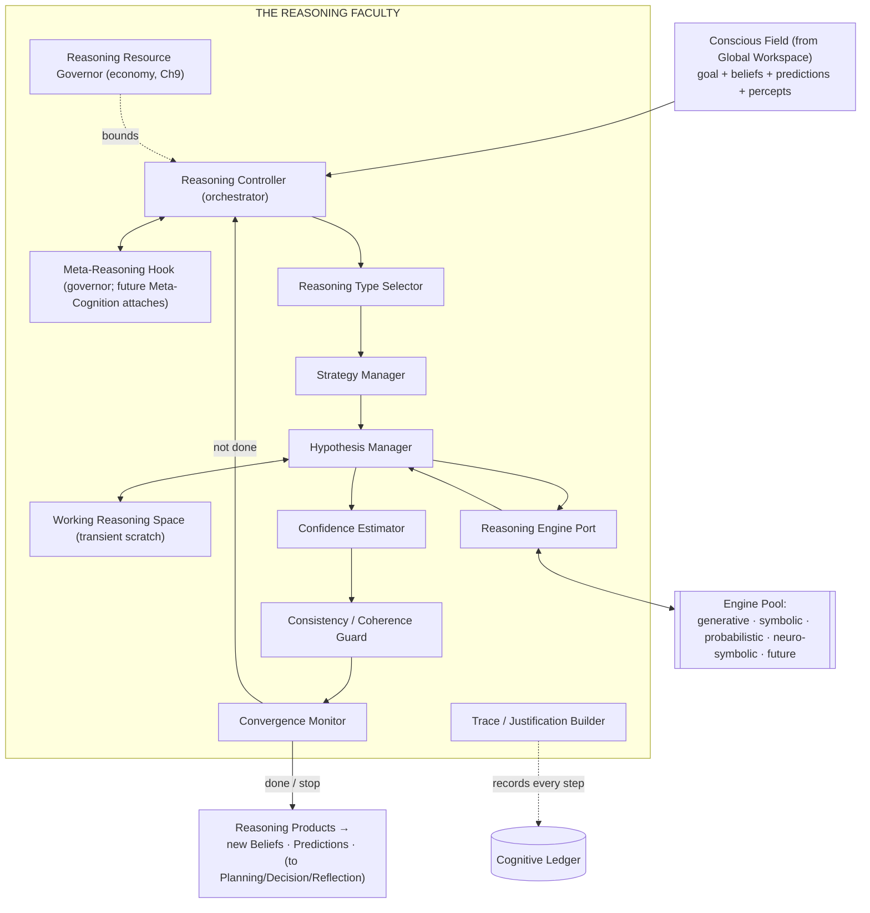
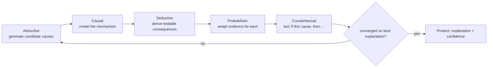
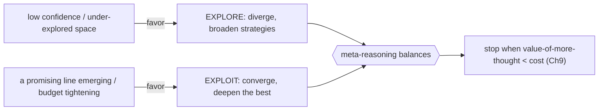
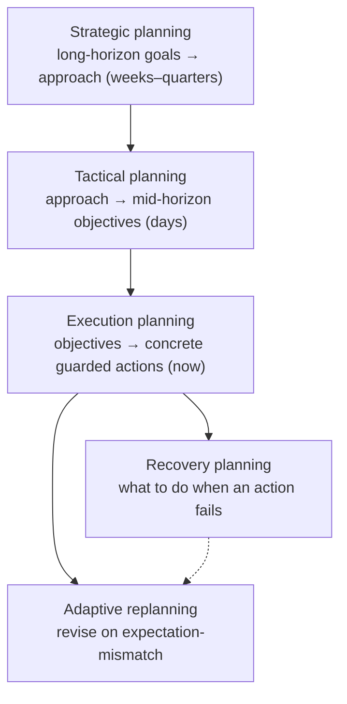
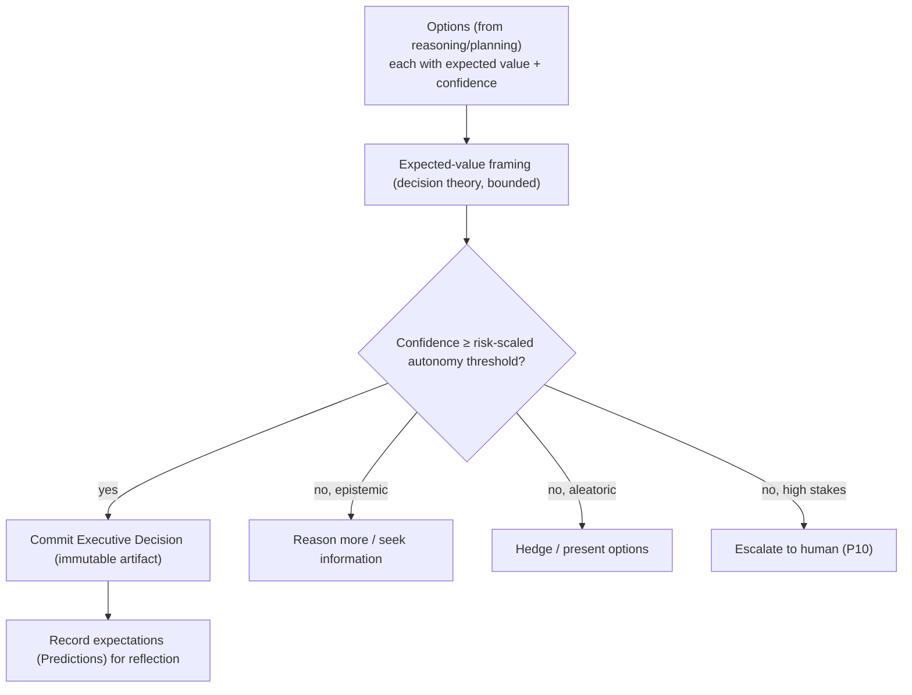
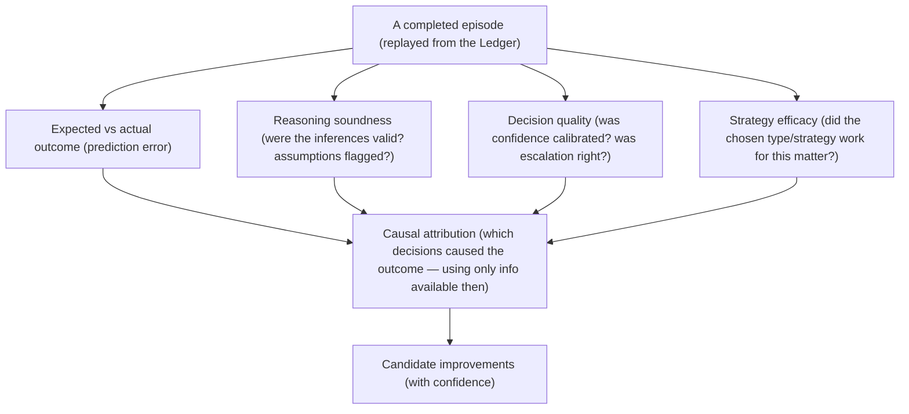
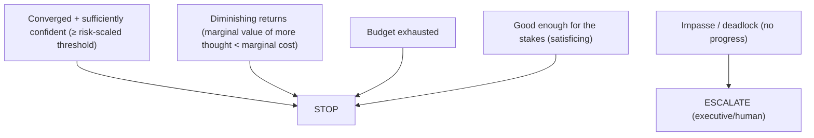

# UnityWorks Cognitive Intelligence Platform

## Phase 4 — The Cognitive Reasoning Architecture

> **The Thinking Mind of UnityWorks**

| | |
|---|---|
| **Phase** | 4 — Reasoning Architecture |
| **Predecessors (frozen as law)** | Phase 0 (Philosophy) · Phase 1 (State) · Phase 1.5 (Object Model) · Phase 2 (Runtime) · Phase 2.5 (Global Workspace) · Phase 3 (Attention) |
| **Status** | Research-grade architectural specification. No code, no APIs, no classes, no schemas, no implementation. |
| **Independence mandate** | Model-independent, engine-independent, implementation-independent. Future LLMs, symbolic solvers, probabilistic engines, and neuro-symbolic systems must all fit **without redesign**. |
| **Register** | Doctoral dissertation. Every decision states *why it exists, what the science says, the alternatives, why UnityWorks adopts/adapts/rejects them, the engineering implication, and the decade-scale evolution.* |
| **Foundational role** | This document is the permanent reasoning blueprint and the substrate on which **Executive Cognition** and **Meta-Cognition** (later phases) are built. |

This document inherits, without restatement: **P1–P12** (Phase 0); the ten **Regions** and the
**confidence currency** (Phase 1); the twelve object kinds, **OL1–OL9**, and the eleven relationship types
(Phase 1.5); the runtime services, the **cognitive cycle**, **cognitive transactions**, the **Cognitive
Clock**, and **RL1–RL8** (Phase 2); the **Conscious Field**, **ignition/broadcast**, and **CL1–CL27**
(Phase 2.5); and the attention subsystem, the **salience economy**, and **AL1–AL17** (Phase 3).

### The single most important commitment of this phase

> **Reasoning is a cognitive *faculty that governs substitutable reasoning engines* — never a wrapper
> around a language model.**

The Generation Platform (Phase 0) — an LLM today, something else tomorrow — is *one reasoning engine among
several*. The **Reasoning Faculty** decides *whether* to invoke an engine, *which* engine, in *what mode*,
*checks and verifies* its output, assigns *calibrated confidence* that overrides the engine's fluency,
*records the trace*, *maintains consistency*, and *integrates* the result coherently into the mind.
A wrapper has none of these; it merely relays a prompt. UnityWorks builds the faculty, so that any future
engine plugs in behind a port (Chapter 2) and the mind's *way of thinking* survives a decade of changing
engines. This commitment is the reason the phase exists and is enforced as a law (Appendix B, ReL1).

### Relationship to prior phases — where reasoning has appeared

| Prior reference | What it was | Phase 4's relation |
|---|---|---|
| **Phase 0, C9 Reasoning Supervisor; C10 Planner; C13 Reflection** | Named components of the mind | Phase 4 is their **complete specification and unification** |
| **Phase 1, R6 Deliberative Region** | *State* fields (strategy, plan, mode, confidence) | Phase 4 specifies the *process* that writes them |
| **Phase 1.5, Plan (Ch6), Reflection (Ch7), Executive Decision (Ch9)** | The *objects* reasoning produces | Phase 4 specifies the *faculties* that produce them |
| **Phase 2, cycle stages Reason→Plan→Decide→Reflect; graph traversal (Ch10)** | Where reasoning runs in the cycle | Phase 4 specifies *how* those stages think |
| **Phase 2.5, conscious consumers** | Reasoning reads the broadcast | Phase 4 specifies what it does with it |
| **Phase 3, §1.5** | "Reasoning operates on what attention delivers" | Phase 4 is that downstream faculty |

Phase 4 neither repeats nor contradicts these; it **completes** them into the definitive Reasoning
Architecture.

---

## Table of Contents

- **Chapter 0** — Scientific Foundations of Reasoning
- **Chapter 1** — The Philosophy of Reasoning
- **Chapter 2** — The Reasoning Architecture (the subsystem)
- **Chapter 3** — The Taxonomy of Reasoning Types
- **Chapter 4** — Reasoning Dynamics
- **Chapter 5** — Cognitive Strategies
- **Chapter 6** — The Planning Architecture
- **Chapter 7** — The Decision Architecture
- **Chapter 8** — The Reflection Architecture
- **Chapter 9** — The Reasoning Resource Economy
- **Chapter 10** — Integration
- **Appendix A** — Consistency map to prior phases
- **Appendix B** — The Reasoning Invariants (ReL1–ReL14)

---
---

# CHAPTER 0 — SCIENTIFIC FOUNDATIONS OF REASONING

> Per the mission, we survey the major theories of reasoning and *use them to justify architecture*. For
> each: what it proposes · strengths · weaknesses · engineering implication · **UnityWorks decision**. The
> chapter closes with the complete UnityWorks reasoning philosophy.

## 0.1 Why no single theory suffices

Reasoning, like attention, has no unified theory — it has a *family*, each capturing one mode (fast vs
slow, model-building vs rule-following, probabilistic vs logical, forward vs counterfactual). Human
reasoning is demonstrably *plural*: people deduce, guess, analogize, simulate, and satisfice, switching
fluidly. An architecture that commits to one mode (e.g., pure logic, or pure probability, or "just prompt
the LLM") inherits that mode's blind spot and fails on the others. UnityWorks therefore designs reasoning
as an **orchestrator of many reasoning modes**, each grounded in a theory below, selected by
meta-reasoning. This chapter is the justification for that pluralism.

## 0.2 The foundations, compared

| # | Theory | What it proposes | Strengths | Weaknesses | Decision |
|---|---|---|---|---|---|
| 1 | **Dual Process Theory** (Kahneman; Evans; Stanovich) | Fast, automatic *System 1* vs slow, deliberate *System 2* | Explains speed/effort trade-offs and error patterns | The two-system dichotomy is a simplification (a continuum) | **Adopt** — the master control axis: proportional deliberation (P5) |
| 2 | **Mental Models Theory** (Johnson-Laird) | Reasoning builds and manipulates *models/simulations*, not formal proofs | Explains spatial/temporal/counterfactual reasoning and systematic errors | Under-specifies model construction | **Adopt/Adapt** — reasoning as *model construction & simulation* over Working Memory |
| 3 | **Bayesian Reasoning** | Beliefs are probabilities updated by evidence (Bayes' rule) | Normatively optimal belief revision | Humans deviate; exact inference is intractable | **Adapt** — the *normative ideal* for confidence/belief revision; approximated in practice |
| 4 | **Predictive Processing** (Clark; Friston) | Cognition = generate predictions, minimize error | Unifies perception + reasoning + action | Abstract; heavy if literal | **Adopt** — reasoning as *generate-hypothesis → predict → check error* |
| 5 | **Symbolic Reasoning** (GOFAI; logic; rule systems) | Explicit symbol manipulation, provable and transparent | Verifiable, exact, explainable | Brittle in open, ambiguous worlds; knowledge-acquisition bottleneck | **Adapt** — a *reasoning engine* behind the port, for verification/deduction/constraints; rejected as the *sole* mode |
| 6 | **Analogical Reasoning** (Gentner structure-mapping) | Transfer relational structure from a known to a novel domain | Powerful for transfer, creativity, learning | Mapping is hard; superficial similarity misleads | **Adopt** — a first-class reasoning type (Ch3) |
| 7 | **Abductive Reasoning** (Peirce) | Inference to the *best explanation* | The mind's default under incomplete information; core of diagnosis | Non-monotonic; can be wrong | **Adopt** — the *default* reasoning mode under uncertainty |
| 8 | **Deductive Logic** | Truth-preserving inference from premises | Certainty when premises hold | Rarely applicable alone in the open world; garbage-in-garbage-out | **Adapt** — used for *verification and consequence-derivation* via a symbolic engine |
| 9 | **Inductive Learning** | Generalize from instances to rules | Enables learning and prediction | The problem of induction — never certain | **Adopt** — a reasoning type feeding Learning (Ch8), always confidence-qualified |
| 10 | **Counterfactual Thinking** (Byrne; Pearl) | Reason about "what would have happened if…" | Essential for planning, credit/blame, learning | Combinatorial; can be misused (hindsight) | **Adopt** — realized via Checkpoint *branching* (Phase 1.5, Ch10) |
| 11 | **Causal Inference** (Pearl's ladder: seeing/doing/imagining) | Reason about cause, intervention, and counterfactuals — not mere correlation | Distinguishes cause from correlation; supports intervention | Requires a causal model; hard to learn | **Adopt** — a first-class capability; the causal graph as a reasoning target |
| 12 | **Decision Theory** (expected utility; vNM) | Choose the option maximizing expected utility | Normative, principled | Assumes known utilities/probabilities; humans violate it | **Adapt** — the *framing* for the Decision faculty (Ch7), *bounded* by resource limits |
| 13 | **Bounded Rationality** (Simon) | Real minds *satisfice* under limited time/resource — "good enough" | Realistic; explains stopping | Less crisp than optimality | **Adopt** — the master constraint on all reasoning (Ch9) |
| 14 | **Heuristics** (Tversky–Kahneman biases; Gigerenzer fast-and-frugal) | Mental shortcuts — adaptive when calibrated, biasing when misapplied | Fast, robust, low-cost | Systematic biases | **Adapt** — heuristics as calibrated *System-1 strategies*; biases guarded by reflection/meta-reasoning |
| 15 | **Meta-Reasoning** (Russell & Wefald; Ackerman & Thompson) | Reasoning *about* reasoning — deciding how much to think and which strategy | Governs the whole; value-of-computation stopping | Adds overhead | **Adopt** — the governor and the hook for future Meta-Cognition |
| 16 | **Argumentation / Dialectic** (Mercier & Sperber; Toulmin) | Reasoning as constructing and weighing arguments and counter-arguments | Explains reason-giving, self-debate, robustness | Can rationalize | **Adopt** — a reasoning *strategy* (self-debate, Ch5) |
| 17 | **Case-Based Reasoning** | Solve new problems by adapting past solved cases | Reuses episodic experience | Requires good case retrieval | **Adapt** — a specialization of analogical reasoning over episodic memory |

## 0.3 Deep dives on the pillars

**Dual Process (adopt) — the control axis.** UnityWorks makes the System-1/System-2 distinction the
*primary control decision* of reasoning: for each matter, meta-reasoning chooses fast/cheap/intuitive
processing or slow/deliberate/verified processing, scaled by stakes and uncertainty (P5). We *reject* a
literal two-box model in favor of a *continuum of deliberation depth* (Ch9), because the dichotomy is a
useful simplification, not a mechanism. This axis is what prevents both reckless haste and wasteful
over-thinking.

**Mental Models (adopt/adapt) — reasoning as simulation.** UnityWorks treats a great deal of reasoning as
*building a model in Working Memory and running it* — a simulation over coalitions of objects (Phase 2.5)
— rather than as formal proof. This grounds counterfactual, temporal, spatial, and causal reasoning, and
it explains why the mind can reason about situations it cannot formalize. The mental model *is* a bound
coalition the reasoning faculty manipulates and "runs forward."

**Bayesian + Predictive Processing (adapt/adopt) — the epistemic substrate.** We adopt the *normative
ideal* that beliefs are confidence-weighted and revised by evidence (the confidence currency, Phase 1,
Ch6), and the *mechanism* that reasoning generates hypotheses, predicts their consequences, and learns
from error. We *reject* the claim that the mind must perform exact Bayesian inference (intractable) or
literal free-energy minimization; these are the *targets* the practical, bounded reasoner approximates.

**Bounded Rationality + Meta-Reasoning (adopt) — the governor.** The deepest commitment: reasoning is
*bounded*, and *knowing when to stop is itself a reasoning act*. Meta-reasoning applies the
*value-of-computation* principle (Russell & Wefald) — continue thinking only while the expected value of
further thought exceeds its cost (Ch9). This is what makes UnityWorks *decisive* rather than paralyzed,
and it is the seat where the future Meta-Cognition phase attaches.

**Symbolic + Heuristics (adapt) — the two tools UnityWorks refuses to worship or discard.** Pure symbolic
AI is brittle in the open world; pure heuristics bias systematically; pure LLM generation is fluent but
uncalibrated and unverified. UnityWorks uses *each as an instrument in its proper place*: symbolic engines
for verification and constraint-derivation, calibrated heuristics for cheap System-1 moves, generative
engines for hypothesis and analogy — all orchestrated, checked, and confidence-qualified by the faculty.
The refusal to elevate any single tool to "the reasoner" is the core of the model-independence mandate.

## 0.4 The complete UnityWorks reasoning philosophy

> UnityWorks reasoning is a **bounded, dual-process, model-building, abduction-first, causally-aware,
> metacognitively-governed transformation** of conscious content into justified conclusions. It treats
> **formal logic and probability as normative ideals and as substitutable engines**, **heuristics as
> calibrated fast strategies guarded against bias**, and **generation as one engine among several**. It
> selects among many reasoning *types* (Ch3) via many *strategies* (Ch5), governs its own *dynamics*
> (Ch4) and *economy* (Ch9), and produces *observable, explainable, auditable, confidence-qualified
> traces* — never committing durable change itself, but proposing candidates for decision and learning.
> It is, above all, **a faculty, not a wrapper**: engines change; the way UnityWorks thinks does not.

---
---

# CHAPTER 1 — THE PHILOSOPHY OF REASONING

## 1.1 Why reasoning exists

Attention (Phase 3) delivers a few conscious contents to the stage (Phase 2.5). But conscious content is
*inert* until something *does something with it* — draws an inference, forms a hypothesis, weighs an
option, constructs a plan. **Reasoning is the faculty that transforms conscious content into new
content.** It exists to answer the questions consciousness poses: *what does this mean? what follows from
it? what explains it? what should I do about it? what will happen if I do?* Without reasoning, a mind
could perceive, attend, and remember — but never *understand*, *decide*, or *plan*. Reasoning is the
engine of understanding; everything else in the cognitive architecture exists to *feed* it or to *act on*
its products.

## 1.2 Reasoning is a transformation, not a store

This is the defining claim of the chapter and it dictates the entire architecture. **Reasoning holds no
durable content of its own.** It is a *process* — a function from conscious inputs to new cognitive
objects (beliefs, predictions, plans, decisions) — that leaves a *trace* (in the Ledger, for
explainability and audit) but is itself *stateless between episodes*. Contrast the neighboring faculties:

| Faculty | Character | Owns durable content? |
|---|---|---|
| **Knowledge** | Storage of objective facts | Yes (system of record) |
| **Memory (the graph)** | Storage/retrieval of the mind's objects | Yes |
| **Working Memory** | Bounded active *maintenance* | No (activation of references) |
| **Attention** | *Selection* of what is conscious | No |
| **Reasoning** | *Transformation* of conscious content into new content | **No — it is a pure process** |

Because reasoning owns no durable state, it can be *interrupted and resumed* (its transient episode state
checkpointed, Ch4), *replaced engine-by-engine* (nothing durable is bound to an engine), and *composed*
(one reasoning episode's output is another's input) — the architectural payoffs of statelessness. A
reasoning faculty that *stored* content would violate OL7 (no duplication), couple to its engine, and
resist substitution. **Reasoning is a verb, not a noun.**

## 1.3 The nine neighbors — reasoning distinguished

| Concept | What it is | How it differs from reasoning |
|---|---|---|
| **Reasoning** | Transformation of conscious content into new inferences | *is the transformation itself* |
| **Knowledge** | Objective, durable facts | Reasoning *consumes* knowledge; it does not store it |
| **Memory** | Storage/retrieval over time | Reasoning *operates in the present*; memory persists |
| **Attention** | Selection of the conscious few | Reasoning acts *on what attention selected*; it does not select |
| **Planning** | Reasoning *about future action* | A *specialization* of reasoning (Ch6), not a separate kind |
| **Decision Making** | *Committing* to one option | The *terminal transformation* of a reasoning episode (Ch7) |
| **Reflection** | Reasoning *about a completed reasoning episode* | *Higher-order* reasoning, run after the fact (Ch8) |
| **Learning** | Making durable, validated change | Reasoning *proposes*; learning *commits* (Phase 1.5, Ch8) |
| **Prediction** | A forecast about a future/unobserved state | A *product* of reasoning, not the process |

The clarifying insight: **planning, decision, and reflection are not separate faculties competing with
reasoning; they are reasoning *pointed at different targets*** — planning at future action, decision at
commitment, reflection at past cognition. UnityWorks specifies them as *specializations* of one reasoning
architecture (Chapters 6–8), sharing its engines, economy, and trace discipline. This unification is why
the mind's thinking is coherent across all of them.

## 1.4 Why reasoning must be its own faculty (and not the LLM)

If reasoning were *the LLM*, then: the mind's way of thinking would change every time the model changed
(no decade-stability); there would be no calibrated confidence (LLMs are fluent but miscalibrated); no
verification (an LLM's assertion would be trusted at face value); no explicit strategy or type selection;
no bounded economy; no interruptibility; and no auditable trace beyond a token stream. Every one of these
is a capability UnityWorks requires and an LLM-wrapper structurally lacks. Therefore reasoning is a
*faculty above the engines* — the enduring cognitive architecture within which any engine, present or
future, is a replaceable instrument. This is the philosophical foundation of the model-independence
mandate and of every design in Chapter 2.

---
---

# CHAPTER 2 — THE REASONING ARCHITECTURE (THE SUBSYSTEM)

## 2.1 The subsystem



## 2.2 The components

For each: **purpose · responsibilities · inputs · outputs · boundaries · lifecycle · failure modes ·
justification (why independent).**

**1. Reasoning Controller (Orchestrator).**
- *Purpose:* run a reasoning episode from initiation to termination (Ch4).
- *Responsibilities:* sequence type-selection → strategy → hypothesis generation → engine invocation →
  confidence → consistency → convergence; obey the economy; consult meta-reasoning.
- *Inputs:* the conscious field (goal + content); resource budget; meta-reasoning directives.
- *Outputs:* reasoning products (candidate beliefs/predictions) + a trace.
- *Boundaries:* it orchestrates; it neither computes inferences itself (engines do) nor commits durable
  change (learning/decision do).
- *Lifecycle:* per reasoning episode; stateless between episodes (its transient state is the Working
  Reasoning Space, checkpointed on interruption).
- *Failure modes:* orchestration deadlock (→ escalate); runaway loop (→ economy forces stop).
- *Why independent:* the *policy* of thinking must be separable from the *mechanisms* (types, engines) so
  either can change without the other. Merging it into an engine would re-create the wrapper.

**2. Meta-Reasoning Hook (the governor).**
- *Purpose:* decide *how much* to reason and *which* strategy/type — and expose control to the future
  Meta-Cognition phase.
- *Responsibilities:* apply value-of-computation (Ch9); set deliberation depth; may override type/strategy
  selection; expose observation/intervention hooks (as Phase 2, Ch11).
- *Inputs:* stakes, uncertainty, budget, the episode's progress.
- *Outputs:* deliberation directives (depth, mode, stop).
- *Boundaries:* it governs reasoning; it does not perform inference. Per mandate, the *supervisor* is a
  later phase — here we define the **hook and its authority**.
- *Failure modes:* mis-estimated value-of-computation (→ reflection recalibrates).
- *Why independent:* "thinking about thinking" is a distinct altitude; embedding it in the Controller
  would prevent the future Meta-Cognition from attaching cleanly.

**3. Reasoning Type Selector.**
- *Purpose:* choose which reasoning *type(s)* (Ch3) the matter calls for.
- *Responsibilities:* map the goal + content pattern to appropriate types (e.g., a "why did X fail?" →
  abductive + causal; a "what if?" → counterfactual).
- *Inputs:* goal, content, meta directives.
- *Outputs:* a selected type or ordered type-sequence.
- *Boundaries:* it selects *what kind* of reasoning; the Strategy Manager selects *how*.
- *Failure modes:* mis-selection (→ Convergence Monitor detects non-progress → re-select).
- *Why independent:* type (kind of inference) and strategy (method of executing it) vary orthogonally;
  the same type can be pursued by many strategies.

**4. Strategy Manager.**
- *Purpose:* select, switch, and compose reasoning *strategies* (Ch5) — chain, tree/search, self-debate,
  decomposition, simulation, verify-then-trust, ensemble.
- *Responsibilities:* pick a strategy for the selected type; switch on impasse/low-confidence; compose
  strategies into pipelines.
- *Inputs:* type, stakes, uncertainty, cost, engine availability.
- *Outputs:* an active strategy (possibly a composition).
- *Boundaries:* method only; it neither chooses the type nor runs the engine.
- *Failure modes:* strategy thrash (→ stabilization, mirroring Phase 3); no viable strategy (→ escalate).
- *Why independent:* strategy is the *how* and must be swappable independently of type and engine.

**5. Hypothesis Manager.**
- *Purpose:* generate, track, and prune the *hypotheses* (candidate conclusions/beliefs under test) of the
  episode.
- *Responsibilities:* maintain the live hypothesis set; spawn alternatives (divergence); prune the
  dominated (convergence); bind hypotheses to their supporting evidence.
- *Inputs:* engine products; evidence; the goal.
- *Outputs:* a ranked hypothesis set → products.
- *Boundaries:* it manages candidates; it does not decide belief (the Consistency Guard + Confidence
  Estimator qualify them; the mind's belief truth-maintenance, Phase 1.5 Ch4, ultimately holds them).
- *Failure modes:* hypothesis explosion (→ economy prunes); premature pruning (→ divergence strategy
  re-expands).
- *Why independent:* the *space of candidates* is a distinct concern from the *method* that fills it and
  the *checks* that filter it.

**6. Working Reasoning Space (transient scratch).**
- *Purpose:* hold the episode's intermediate steps, partial inferences, and the mental model being
  simulated.
- *Responsibilities:* a bounded, reasoning-local scratch drawn from Working Memory; the "mental model"
  workspace (Johnson-Laird).
- *Inputs:* conscious references; engine intermediate outputs.
- *Outputs:* the maintained reasoning state (checkpointed on interruption).
- *Boundaries:* transient and reasoning-local; it is a *use* of Working Memory (Phase 2.5, Ch5), not a new
  store; references only (OL7).
- *Failure modes:* overflow (→ chunk/prune; bounded like WM); loss on crash (→ reconstruct from trace +
  goal).
- *Why independent:* reasoning needs scratch space distinct from the conscious field's maintained focus.

**7. Confidence Estimator.**
- *Purpose:* assign and *propagate* calibrated confidence over reasoning steps and products (Phase 1, Ch6).
- *Responsibilities:* apply the monotonicity law (a conclusion no more confident than its weakest
  necessary premise); discount by engine calibration (an LLM's fluent certainty is *not* trusted at face
  value); type uncertainty as epistemic vs aleatoric.
- *Inputs:* step confidences; engine-reported confidence + its calibration record; evidence.
- *Outputs:* calibrated confidence per product.
- *Boundaries:* it estimates confidence; it does not decide action (that is the economy/decision).
- *Failure modes:* miscalibration (→ reflection recalibrates the estimator over time).
- *Why independent:* confidence is cross-cutting and must override any single engine's self-assessment —
  it cannot live *inside* an engine (that is the wrapper's fatal flaw).

**8. Consistency / Coherence Guard.**
- *Purpose:* ensure the episode stays self-consistent and coherent with existing beliefs.
- *Responsibilities:* detect contradictions among hypotheses and against the belief graph; route conflicts
  to arbitration (Phase 2, Ch7) or truth-maintenance (Phase 1.5, Ch4) rather than silently accepting both.
- *Inputs:* hypotheses; the active belief set.
- *Outputs:* consistency verdicts; conflict signals.
- *Boundaries:* it guards coherence; it does not itself revise beliefs (that is a transaction).
- *Failure modes:* undetected subtle contradiction (→ reflection catches it later).
- *Why independent:* self-consistency (an architectural principle) needs a dedicated guardian; no engine
  can be trusted to police its own coherence.

**9. Convergence Monitor.**
- *Purpose:* detect convergence, divergence, loops, and non-progress; decide (with the economy) when the
  episode is "done enough."
- *Responsibilities:* track progress toward a stable, sufficiently-confident conclusion; detect
  oscillation; signal termination or continuation.
- *Inputs:* the hypothesis set over steps; confidence trajectory; budget.
- *Outputs:* continue/stop/escalate signals.
- *Boundaries:* it monitors; the economy (Ch9) sets the thresholds it applies.
- *Failure modes:* premature convergence (→ divergence strategy); non-termination (→ economy forces stop).
- *Why independent:* *when to stop thinking* is a first-class concern (bounded rationality); it must not be
  left to an engine that will happily generate forever.

**10. Reasoning Resource Governor (economy, Ch9).**
- *Purpose:* bound the episode — depth, budget, stopping.
- *(Full treatment in Chapter 9.)* *Why independent:* the economy must constrain the Controller from the
  outside, or the mind reasons without limit (irrational, Phase 3, Ch7).

**11. Trace / Justification Builder.**
- *Purpose:* record every step — premise, type, strategy, engine, product, confidence — as the reasoning
  trace.
- *Responsibilities:* produce the explainable, auditable justification for every conclusion; write it to
  the Ledger as events.
- *Inputs:* every component's step.
- *Outputs:* the reasoning trace (the answer to "why did the mind conclude this?").
- *Boundaries:* it records; it never influences the reasoning.
- *Failure modes:* trace gap (→ treated as a defect; a conclusion without a trace is not admissible —
  ReL5).
- *Why independent:* observability/explainability/auditability must be structurally guaranteed and
  independent of the reasoning mechanism (P4).

**12. Reasoning Engine Port + Engine Pool.**
- *Purpose:* the model-independence boundary — abstract, substitutable access to reasoning engines.
- *Responsibilities:* accept a *reasoning request* (a typed step: premises + goal + strategy hint) and
  return a *reasoning product* (candidate conclusion + engine-confidence + justification fragment); route
  a step to the appropriate engine (generative for hypothesis/analogy, symbolic for
  deduction/verification, probabilistic for inference); support *ensembles* (multiple engines on one step).
- *Inputs:* reasoning requests.
- *Outputs:* reasoning products.
- *Boundaries:* it exposes engines *as instruments*; the faculty never depends on any engine's internals
  (P1/P6). The Generation Platform is *one engine behind this port* — never "the reasoner."
- *Failure modes:* engine failure/timeout (→ fall back to another engine or a cheaper strategy; the
  faculty degrades gracefully, never crashes — mirroring Phase 0's tool-failure tolerance).
- *Why independent:* this port *is* the decade-proofing. It is the seam that lets every future engine plug
  in without redesign, and it is what makes reasoning a faculty rather than a wrapper (ReL1).

## 2.3 Why this decomposition and not a monolith

A monolithic "reasoner" (in practice, an LLM prompt-loop) collapses type-selection, strategy, hypothesis
management, confidence, consistency, convergence, economy, trace, and engine into one opaque box — and
thereby forfeits every architectural principle: it is not model-independent (bound to the engine), not
observable/explainable/auditable (opaque), not interruptible/resumable (no separable state), not
composable (no clean products), and not self-consistent (no guard). The twelve-component decomposition
exists precisely so that *each principle has an owner* and *each concern can evolve independently*. This
is the OL1 discipline applied to thought.

---
---

# CHAPTER 3 — THE TAXONOMY OF REASONING TYPES

## 3.1 Why an explicit taxonomy

Different problems demand different *kinds* of inference; a mind that applies one kind to all problems
reasons badly (deduction on an under-determined problem yields nothing; abduction on a solved one wastes
effort). UnityWorks makes the *type of reasoning an explicit, selected variable* (the Type Selector, Ch2),
so the right kind is applied to each matter, and so the choice is observable and auditable. The taxonomy
below is the closed vocabulary of reasoning types; composition (§3.3) yields the open-ended richness.

## 3.2 The types and their activation

| Type | What it does | Activated when… |
|---|---|---|
| **Deductive** | Derive necessary consequences from premises | Premises are firm and consequences must be certain (verification, constraint-derivation) |
| **Inductive** | Generalize a rule from instances | Patterns recur and a general rule would help (feeds Learning) |
| **Abductive** | Infer the best explanation | Something is observed that needs explaining (diagnosis, root-cause) — *the default under uncertainty* |
| **Analogical** | Transfer relational structure from a known case | A novel problem resembles a solved one (transfer, creativity) |
| **Strategic** | Reason about long-horizon goals and trade-offs | A strategic goal must be advanced against constraints (feeds Planning, Ch6) |
| **Creative** | Generate novel combinations/hypotheses | The known options are inadequate; divergence is needed |
| **Diagnostic** | Localize a fault/cause in a system | A malfunction/failure must be traced (abduction + causal, specialized) |
| **Scientific** | Hypothesize → predict → test → revise | A belief must be established empirically (predictive processing loop) |
| **Temporal** | Reason about sequence, duration, before/after | Ordering, deadlines, or timing matter (uses the Temporal model, Phase 1 Ch5) |
| **Spatial** | Reason about layout, containment, geometry | Spatial structure matters (future Vision/Repository/Embodied) |
| **Probabilistic** | Reason under uncertainty with likelihoods | Evidence is uncertain and must be weighed (Bayesian engine) |
| **Ethical** | Reason about permissibility, values, harms | An action bears on values/safety/policy — *gated by safety dominance* (Phase 3, Ch3.4) |
| **Counterfactual** | Reason about alternatives to what is/was | Planning ("what if I do X?"), credit/blame, learning (via Checkpoint branching) |
| **Recursive** | Reason about reasoning about… (nested) | A problem contains sub-problems of the same kind (bounded depth, P8) |
| **Reflective** | Reason about a completed reasoning episode | After an outcome, to evaluate cognition (Ch8) |
| **Meta-reasoning (hooks)** | Reason about *how* to reason | Continuously — to select type/strategy and to stop (Ch2, Ch9) |

## 3.3 Composition — how types chain into real thought

Real reasoning episodes chain types. A canonical diagnostic episode:



Composition is governed by the Strategy Manager and Meta-Reasoning: the *type sequence* is chosen for the
matter, and each type may run on a different engine (abduction on a generative engine, deduction on a
symbolic one, probabilistic weighing on an inference engine) — the composition is *engine-agnostic*,
which is the taxonomy's contribution to model-independence.

## 3.4 Why a closed type-vocabulary with open composition

- **Rejected: no taxonomy ("just reason").** *Disadvantage:* unobservable, unauditable, and prone to
  applying the wrong kind of inference; nothing to select or explain. *Violates:* explainability.
- **Rejected: an open, ever-growing list of ad-hoc types.** *Disadvantage:* incoherent; every capability
  invents its own — the reasoning analogue of the object-ontology problem (Phase 1.5, P.5).
- **Adopted: a closed vocabulary + open composition.** A fixed, explainable set of inference *kinds*,
  combined freely into episodes — bounded vocabulary, unbounded expressiveness. This is the same
  fixed-structure/free-content discipline the whole constitution follows.

---
---

# CHAPTER 4 — REASONING DYNAMICS

## 4.1 Reasoning as a living, governed process

Like attention (Phase 3), reasoning is a *dynamical process*, not a one-shot call. It initiates,
continues, can be interrupted and resumed, converges or diverges, terminates, and its abandoned lines
decay. This chapter specifies that lifecycle, which is what makes reasoning *interruptible* and
*resumable* (architectural principles).

```mermaid
stateDiagram-v2
    [*] --> Initiated : goal/question/impasse enters the conscious field
    Initiated --> Continuing : type + strategy selected; engine invoked
    Continuing --> Diverging : generate/expand hypotheses (exploration)
    Continuing --> Converging : prune toward a conclusion (exploitation)
    Diverging --> Converging
    Converging --> Continuing : not yet done
    Continuing --> Interrupted : preempted (higher-salience matter)
    Interrupted --> Resumed : reconstruct Working Reasoning Space from checkpoint
    Resumed --> Continuing
    Converging --> Terminated_Success : converged + sufficiently confident (economy stop)
    Continuing --> Terminated_Budget : budget exhausted / diminishing returns
    Continuing --> Terminated_Escalate : impasse / deadlock → escalate (executive/human)
    Terminated_Success --> [*]
    Terminated_Budget --> [*]
    Terminated_Escalate --> [*]
    Interrupted --> Decayed : never resumed; line fades
    Decayed --> [*]
```



## 4.2 The transitions

- **Initiation.** Triggered by a conscious goal, an open question, or a *reasoning impasse* (a point where
  cognition cannot proceed without more thought — SOAR's impasse, Phase 1.5 §3.5). Initiation opens a
  reasoning episode and its Working Reasoning Space.
- **Continuation.** The Controller cycles: invoke engine → new hypotheses → confidence → consistency →
  convergence check → repeat. Each cycle is bounded by the economy.
- **Divergence (exploration).** The Hypothesis Manager *expands* — generating alternatives, branching
  (often via Checkpoint branches for counterfactuals). Divergence dominates early, or when confidence is
  low and the space is under-explored.
- **Convergence (exploitation).** Pruning dominated hypotheses, deepening the best line, tightening
  confidence. Convergence dominates late, or when a promising line emerges.
- **Interruption.** A higher-salience matter preempts (Phase 3). The Working Reasoning Space is
  checkpointed (Phase 1.5, Ch10) so the episode is *resumable*, not lost.
- **Resumption.** The episode is *reconstructed* from its checkpoint + goal (as Working Memory is, Phase
  2.5, Ch5.6) — the mind picks up the thread rather than restarting.
- **Termination.** Three principled exits: **success** (converged + sufficiently confident), **budget**
  (diminishing returns / exhausted — a *good-enough* stop, bounded rationality), **escalation** (impasse
  or high-stakes low-confidence → hand to executive/human, P10). Reasoning *never* spins forever (P8).
- **Decay & persistence.** An interrupted line that is never resumed *decays* (its transient state fades);
  but a line worth resuming *persists* via its checkpoint. This mirrors attention's decay/refresh (Phase
  3): reasoning lines, like foci, are kept alive only while relevant.

## 4.3 Why reasoning must be interruptible and resumable

A mind that cannot interrupt its reasoning cannot respond to a surprise or an emergency mid-thought
(unsafe); a mind that cannot *resume* loses all partial progress on every interruption (wasteful and
incoherent). The checkpointed episode — enabled by reasoning's statelessness (§1.2) and the Checkpoint
object — gives UnityWorks both: it can drop a train of thought to handle the urgent and pick it up
faithfully afterward, exactly as a person interrupted mid-analysis returns to where they were.

---
---

# CHAPTER 5 — COGNITIVE STRATEGIES

## 5.1 Strategy vs type

A *type* (Ch3) is *what kind* of inference; a *strategy* is *how* to carry it out. The same type —
abduction, say — can be pursued by a single fast pass, by a broad search over many candidates, or by a
structured self-debate. Strategy is the method; making it explicit and selectable is what lets the mind
spend method proportional to stakes (P5) and switch method when one fails.

## 5.2 The strategy repertoire

| Strategy | Method | Best for |
|---|---|---|
| **Linear (chain)** | One deliberate sequence of steps | Well-structured problems; System-2 default |
| **Search (tree/graph)** | Explore and evaluate many branches | Large hypothesis spaces; planning; high uncertainty |
| **Self-debate (dialectic)** | Argue for and against; weigh the arguments | High-stakes, contestable conclusions (Mercier–Sperber) |
| **Decomposition** | Split into sub-problems, solve, recombine | Complex, decomposable goals (feeds Planning, Ch6) |
| **Analogical transfer** | Map a solved case onto the new problem | Novel problems resembling known ones |
| **Simulation (mental model)** | Build a model and run it forward | Temporal/spatial/counterfactual reasoning |
| **Verify-then-trust** | Generate with one engine, verify with another (e.g., symbolic check) | Correctness-critical conclusions |
| **Ensemble** | Run multiple engines/strategies; reconcile | High-stakes; where engine disagreement is informative |
| **Fast heuristic (System-1)** | A single calibrated shortcut | Low-stakes, familiar, time-critical matters |

## 5.3 Strategy selection, switching, composition

- **Selection** is a meta-reasoning decision (Ch2, Ch9): map (type × stakes × uncertainty × cost × engine
  availability) → strategy. Low stakes + high familiarity → fast heuristic; high stakes + high uncertainty
  → search or self-debate or ensemble; correctness-critical → verify-then-trust.
- **Switching** occurs on *impasse* (the Convergence Monitor detects non-progress), *low confidence* (the
  Estimator flags it), or *divergence stall* — the Strategy Manager switches to a stronger (costlier)
  strategy, escalating deliberation until it converges or the economy stops it. Switching is
  *stabilized* (hysteresis, minimum dwell — as attention, Phase 3, Ch5) to prevent strategy thrash.
- **Composition** chains strategies: decompose → solve sub-problems with linear/heuristic → recombine;
  or generate by search → verify by symbolic check. Composition is where the taxonomy (Ch3) and the
  repertoire (§5.2) combine into arbitrarily rich reasoning, all engine-agnostic.

## 5.4 Exploration vs exploitation during reasoning

Within an episode, the mind trades *exploration* (diverge — generate diverse hypotheses/branches, try
novel strategies) against *exploitation* (converge — deepen the best line). The trade-off is governed by
the economy (Ch9) and confidence:



Early/low-confidence phases explore; late/high-confidence or budget-pressured phases exploit; over-
exploration wastes budget (a mind that never commits), over-exploitation misses the better answer (a mind
that fixates on its first idea). Meta-reasoning tunes the balance to the matter — the reasoning-internal
mirror of Phase 3's explore/exploit budgets.

---
---

# CHAPTER 6 — THE PLANNING ARCHITECTURE

## 6.1 Planning is reasoning about future action

Planning is *not a separate faculty*; it is **reasoning specialized to the domain of future action** — it
takes a goal and produces a Plan Object (Phase 1.5, Ch6). It reuses the reasoning subsystem (types,
strategies, engines, economy, trace) and adds the structure specific to action-over-time: levels,
decomposition, dependency, and adaptation. Unifying planning with reasoning is what keeps the mind's
thinking-about-doing coherent with its thinking-in-general.

## 6.2 The planning levels



| Level | Reasoning types used | Output |
|---|---|---|
| **Strategic** | Strategic, causal, counterfactual | The chosen approach to a strategic goal |
| **Tactical** | Decomposition, deductive, probabilistic | Mid-horizon objectives (sub-goals) |
| **Execution** | Deductive (guards), temporal, spatial | Concrete guarded actions with expectations |
| **Recovery** | Abductive (why it failed), counterfactual | Fallback/recovery branches |
| **Adaptive replanning** | Diagnostic, counterfactual | A revised plan version on mismatch |

## 6.3 Goal decomposition and dependency reasoning

- **Goal decomposition** (the Decomposition strategy applied to Goals, Phase 1.5, Ch2) breaks a goal into
  sub-goals — triggered by impasse or size, budget-bounded (no runaway decomposition, P8).
- **Dependency reasoning** derives the prerequisite/support/conflict edges among sub-goals (the Goal
  Graph) — a causal/temporal reasoning task: *what must be true before what?* This produces the
  dependency DAG the scheduler uses (Phase 2, Ch4).
- Both are *reasoning products*: planning does not invent goals (that is the Goal faculty); it *structures*
  the pursuit of an existing goal.

## 6.4 Adaptive replanning — plans as living scaffolds

Following Phase 1.5, Ch6, a plan is a *living scaffold*, not a script: each action carries an expectation
(a bound Prediction); on **expectation-mismatch** (Observe, Phase 2), planning *adapts* (recovery path) or
*replans* (a new plan version). This closes the perceive→plan→act→observe→replan loop and is why UnityWorks
plans survive contact with a changing world — the planning-specific expression of reasoning's dynamics
(Ch4).

## 6.5 Why planning is a specialization, not a separate faculty

- **Rejected: a standalone planner (a separate planning engine).** *Disadvantage:* it would duplicate
  reasoning's type-selection, strategy, confidence, trace, and economy — and could drift out of coherence
  with the mind's general reasoning. *Violates:* OL1/no-duplication.
- **Adopted: planning as reasoning specialized to action.** One reasoning faculty, pointed at the future;
  one economy, one trace discipline, one set of engines. Coherent and non-duplicative.

---
---

# CHAPTER 7 — THE DECISION ARCHITECTURE

## 7.1 Decision is the terminal transformation

A decision is where reasoning *stops deliberating and commits* — the causal hinge (Phase 1.5, Ch9). It is
the terminal transformation of a reasoning/planning episode: from a ranked set of options-with-confidence
to a single committed Executive Decision (with its alternatives, rationale, confidence, and authorizing
identity recorded immutably). Decision is *not* a separate faculty either; it is reasoning's *commitment
operator*.

## 7.2 How decisions emerge



## 7.3 The decision properties

| Property | Specification |
|---|---|
| **Decision confidence** | The calibrated confidence in the chosen option (Confidence Estimator); gates autonomy |
| **Decision uncertainty** | Typed epistemic (→ seek more) vs aleatoric (→ hedge); determines the *response* to low confidence |
| **Decision revision** | A decision is immutable, but a *new* linked decision may supersede it (Phase 1.5, Ch9) — the mind changes its mind by deciding again, on the record |
| **Decision conflicts** | Contradictory options/goals → the arbitration ladder (Phase 2, Ch7): priority → confidence → authority → coalition → meta → human |
| **Decision arbitration** | The fixed ladder above; ends in human escalation when authority is contested or stakes are high under uncertainty (P10) |
| **Decision reversibility** | Actions route through the Effect Boundary; irreversible ones demand higher confidence and often human approval; the mind prefers reversible/canary actions |
| **Decision consequences** | Every decision records *expectations* (Predictions) so the outcome can be measured and reflected upon — the decision is the seed of learning |

## 7.4 Risk-scaled autonomy — the safety spine of decision

The autonomy threshold is **scaled by stakes and reversibility**: the higher the risk and the harder to
undo, the higher the confidence required to act autonomously — else escalate (P10). This is the
decision-level expression of Phase 3's safety-dominant salience (Ch3.4): *the mind is bold where cheap and
reversible, cautious where costly and irreversible, and never autonomously commits an irreversible
high-stakes act under low confidence.* This threshold is architectural, not learned — a safety guarantee.

## 7.5 Why decision is reasoning's commitment operator, not a separate faculty

Making decision the *terminus* of reasoning (rather than a separate module) guarantees that every decision
is *grounded in* the reasoning trace that produced it (explainability), *carries* the calibrated confidence
reasoning computed (honesty), and *records* the alternatives reasoning considered (auditability). A
separate decision module fed only a final answer would sever the decision from its justification — exactly
the accountability failure the Executive Decision object exists to prevent.

---
---

# CHAPTER 8 — THE REFLECTION ARCHITECTURE

## 8.1 Reflection as an independent, higher-order faculty

Reflection is **reasoning about a completed reasoning episode** — a distinct altitude (higher-order) and a
distinct time (after the fact). It is specified as an *independent faculty* because evaluation must be
*separated from action*: a faculty that both reasons and judges its own reasoning in the same breath cannot
be trusted to catch its own errors. Reflection is the mind's capacity to *learn from how it thought*, and
it is the foundation on which the future Meta-Cognition phase is built.

## 8.2 Why reflection exists

Without reflection, the mind repeats its mistakes: it has no mechanism to notice that a reasoning strategy
failed, a prediction was wrong, a decision was miscalibrated, or an assumption was unvalidated. Reflection
is the *only* faculty whose job is to evaluate cognition *as cognition* — the precondition of improvement
(learning) and of self-regulation (meta-cognition).

## 8.3 When reflection runs

- **After an outcome** (episode close): the standard trigger — evaluate the just-completed episode.
- **On surprise** (large prediction error): high-priority reflection — "why was I wrong?"
- **In idle time**: the mind uses quiet cycles to reflect on queued episodes (Phase 2, Ch4.5; Phase 3
  recovery).
- **On executive demand**: the future supervisor may trigger reflection on a chosen episode (a hook).

## 8.4 What reflection evaluates



## 8.5 How reflection improves future cognition — and its inviolable boundary

Reflection produces **candidate improvements** — proposals to adjust a strategy's selection weight, to
flag a recurring assumption, to recalibrate the Confidence Estimator, to promote a belief. But:

> **Reflection MUST NEVER directly modify cognition.** It produces *candidates* for **Learning** (which
> validates, gates, commits reversibly — Phase 1.5, Ch8) and for **executive review**. It has no authority
> to change beliefs, strategies, identity, or any durable state.

This boundary (stated explicitly in the mandate and enforced as ReL9) is the safety spine of
self-improvement: a faculty that could *both* judge its cognition *and* rewrite it could corrupt the mind
on a single mistaken evaluation. By separating *proposing* (reflection) from *disposing* (learning, with
validation and reversibility), UnityWorks guarantees that no reflection — however wrong — can silently
degrade the mind. Reflection is the mind's conscience, not its surgeon.

## 8.6 Reflection vs the ReviewAgent faculty

As established (Phase 1, §11.4): the Generation Platform's adversarial review evaluates the *artifact*
(is this code/output correct?); Reflection evaluates the *cognition that produced it* (was my reasoning,
confidence, and decision sound?). The ReviewAgent is an *engine* reasoning may invoke; Reflection is a
*higher-order faculty about* such invocations. They are complementary, on opposite sides of the
mind/faculty boundary.

---
---

# CHAPTER 9 — THE REASONING RESOURCE ECONOMY

## 9.1 Bounded reasoning is rational reasoning

Reasoning inherits the economy principle established in Phase 3, Ch7: *intelligence without resource
limits is irrational* (Simon). Applied to reasoning, this means the mind must decide **how much to think**
before it thinks too long — the value-of-computation problem (Russell & Wefald). This chapter specifies
that economy for reasoning; it is the concrete realization of P5 (proportional deliberation) and P8
(bounded thought).

## 9.2 The economic controls

| Control | What it governs | Principle |
|---|---|---|
| **Reasoning budget** | Total cognitive resource an episode may consume (engine calls, depth, time) | Scarcity forces commitment |
| **Deliberation depth** | System-1 (shallow) ↔ System-2 (deep) — the dual-process dial | Depth scaled to stakes × uncertainty |
| **Stopping conditions** | When the episode terminates | Value-of-computation < cost |
| **Opportunity cost** | The best foregone alternative use of this reasoning resource | Reasoning here means not reasoning there |
| **Reasoning fatigue** | Depletion under sustained hard reasoning | Husbanding effort (as attention, Phase 3) |
| **Reasoning prioritization** | Which competing matter gets reasoning resource now | Salience-driven (Phase 3), fairness-protected |

## 9.3 The stopping conditions — when to stop thinking

The Convergence Monitor + economy terminate an episode when *any* holds:



The **value-of-computation** criterion (S2) is the principled core: the mind continues reasoning only while
the expected improvement in its conclusion justifies the cost of continuing. This is what makes UnityWorks
*decisive* — it stops when more thought won't pay — and *proportional* — it thinks hard on the important
and stops fast on the clear. A mind without this criterion either stops too soon (reckless) or never stops
(paralyzed).

## 9.4 Reasoning fatigue and prioritization

Sustained hard reasoning depletes budget (fatigue, as attention, Phase 3, Ch5); the mind must then narrow,
rest (recover in idle), or escalate — it cannot deliberate at maximum depth indefinitely. And when
multiple matters demand reasoning, prioritization is *salience-driven* (Phase 3) and *fairness-protected*
(no important matter starves). Reasoning resource is allocated by the same economic discipline as
attention, because they draw on the same finite cognitive energy.

---
---

# CHAPTER 10 — INTEGRATION

## 10.1 The integration principle

Reasoning integrates with the rest of the mind by **consuming conscious content, invoking engines behind a
port, and writing products back as objects** — coupling to nothing (P1/P6/OL8). It reads the broadcast,
reasons, and returns candidates; it never reaches into another system's internals and never duplicates
another system's content.

```mermaid
flowchart TB
    GW["Global Workspace / Working Memory"] -->|conscious content (broadcast)| RF{{"REASONING FACULTY"}}
    ATT["Attention"] -->|delivers the focus reasoning acts on| GW
    KN["Knowledge Platform"] -->|recalled facts (references)| RF
    CONV["Conversation Platform"] -->|interpreted user meaning/signals| RF
    RF <-->|engine requests/products| GEN["Generation Platform<br/>(one engine behind the port)"]
    RF <-->|engine requests/products| SYM["Symbolic / probabilistic / neuro-symbolic engines"]
    RF -->|new Beliefs, Predictions, Plans, candidate Decisions| CS["Cognitive State (objects)"]
    RF -.->|hooks| META["Future Meta-Cognition"]
    RF -.->|trace| LEDGER[("Cognitive Ledger")]
```

## 10.2 Integration, system by system — without coupling or duplication

| System | What reasoning consumes / produces | Coupling avoided |
|---|---|---|
| **Cognitive State** | Reads active objects; *writes new objects* (beliefs, predictions, plans, candidate decisions) as products | Reasoning holds no durable state of its own (§1.2); it writes objects, doesn't own a store |
| **Working Memory** | Draws conscious references into the Working Reasoning Space; returns products | The reasoning space is a *use* of WM (Phase 2.5, Ch5), not a new store; references only |
| **Global Workspace** | Consumes the broadcast (conscious content) | Reasoning is a *consumer* of the broadcast (Phase 2.5, Ch3), not the workspace |
| **Attention** | Receives the focus attention selected; may *request* attention (e.g., "consider this hypothesis") — a salience signal | Reasoning does not select consciousness; it *acts on* and *signals* attention (Phase 3, Ch10) |
| **Knowledge Platform** | Recalled facts as *references* (evidence/premises) | Consumes recall *signals*/references, never the vector index (P1) |
| **Conversation Platform** | Interpreted user meaning as premises/goals | Reads interpreted signals, not raw transcripts |
| **Generation Platform** | **One engine behind the Reasoning Engine Port** | The LLM is an *instrument*, never "the reasoner" (ReL1) — the crux of model-independence |
| **Future Meta-Cognition** | Exposes the Meta-Reasoning Hook (govern depth/strategy; observe the trace; intervene) | Hooks now; the supervisor is a later phase (Phase 2, Ch11 pattern) |

## 10.3 The decade guarantee

Because reasoning consumes *conscious content* (any modality), invokes *engines behind a port* (any
engine), and produces *objects* (the fixed ontology), a decade of change — new LLMs, symbolic and
neuro-symbolic engines, new modalities, a future Meta-Cognition supervisor, multi-agent reasoning — enters
as **new engines in the pool and new content on the stage**, never as a change to the reasoning
architecture. Multi-agent reasoning is *many reasoning faculties* over a shared Knowledge substrate,
exchanging conscious content by broadcast; embodied reasoning adds spatial/sensorimotor types and engines;
a future symbolic breakthrough is simply a new, better engine behind the same port. **The engines change;
the way UnityWorks thinks does not** — which is the success criterion of this document and the foundation
on which Executive Cognition and Meta-Cognition will be built.

---
---

# APPENDIX A — Consistency Map to Prior Phases

| Phase 4 concept | Prior-phase anchor |
|---|---|
| Reasoning Faculty (the subsystem) | Phase 0 C9 Reasoning Supervisor — now fully specified |
| Reasoning Engine Port | Phase 0 GenerationPort — generalized to *all* reasoning engines |
| Planning Architecture (Ch6) | Phase 0 C10 Planner; Phase 1.5 Plan Object (Ch6) |
| Decision Architecture (Ch7) | Phase 1.5 Executive Decision Object (Ch9); Phase 2 Ch7 arbitration |
| Reflection Architecture (Ch8) | Phase 0 C13; Phase 1.5 Reflection Object (Ch7) |
| Reasoning products (beliefs/predictions) | Phase 1.5 Belief (Ch4), Prediction (Ch5) |
| Confidence estimation | Phase 1 Ch6 (confidence currency), monotonicity law |
| Reasoning economy (Ch9) | Phase 3 Ch7 (resource economy); P5, P8 |
| Meta-Reasoning Hook | Phase 2 Ch11 (metacognitive hooks); future Meta-Cognition phase |
| Reasoning Invariants ReL1–ReL14 | Extend P1–P12, OL1–OL9, RL1–RL8, CL1–CL27, AL1–AL17 |

# APPENDIX B — The Reasoning Invariants (ReL1–ReL14)

Immutable architectural laws for reasoning, embodying the mandated principles (model-independent,
observable, explainable, auditable, interruptible, resumable, composable, self-consistent, future-proof).

| # | Invariant | Principle served |
|---|---|---|
| **ReL1** | **Reasoning is a faculty above substitutable engines; no engine is "the reasoner."** | Model-independent |
| **ReL2** | **Reasoning holds no durable state; it is a transformation, not a store.** | Composable, future-proof |
| **ReL3** | **Every conclusion carries calibrated confidence that overrides any engine's self-assessment.** | Self-consistent, honest |
| **ReL4** | **A conclusion is no more confident than its weakest necessary premise (monotonicity).** | Self-consistent |
| **ReL5** | **No conclusion is admissible without a trace; reasoning without a justification record is invalid.** | Observable, explainable, auditable |
| **ReL6** | **Reasoning type and strategy are explicit, selected, and recorded — never implicit.** | Explainable |
| **ReL7** | **Reasoning is bounded; every episode has a principled stop (converge / good-enough / budget / escalate).** | Bounded rationality (P5, P8) |
| **ReL8** | **Reasoning is interruptible and resumable; its episode state is checkpointed, never lost.** | Interruptible, resumable |
| **ReL9** | **Reasoning and reflection PROPOSE; they never COMMIT durable change (learning/decision do).** | Safe self-improvement (P9) |
| **ReL10** | **Reasoning is self-consistent; contradictions are detected and arbitrated, never silently accepted.** | Self-consistent |
| **ReL11** | **Reasoning is composable; one episode's products are another's premises, engine-agnostically.** | Composable |
| **ReL12** | **Reasoning never bypasses attention/consciousness; it acts only on conscious content.** | Coherence (CL4/CL5) |
| **ReL13** | **Irreversible high-stakes decisions require confidence above a risk-scaled threshold or human escalation.** | Safety (P10) |
| **ReL14** | **Reasoning degrades gracefully on engine failure; it falls back, never crashes.** | Future-proof, robust |

---

### Reasoning closing

Once attention has placed a few contents on the conscious stage, **reasoning transforms them into
understanding, plans, decisions, and insight** — as a *faculty*, not a wrapper: it selects the kind of
inference, chooses and composes strategies, invokes substitutable engines behind a port, estimates
calibrated confidence, guards its own consistency, knows when to stop, and records an explainable,
auditable trace — while committing nothing itself, only proposing candidates for decision and learning.
Planning is reasoning about the future; decision is reasoning's moment of commitment; reflection is
reasoning about reasoning past. All share one economy, one trace discipline, one set of engines, and one
architecture — so the mind's thinking is coherent across every mode. The engines will change many times
over the coming decade; the way UnityWorks thinks will not. This document is the permanent reasoning
blueprint, and the foundation upon which Executive Cognition and Meta-Cognition will be built.
