# UnityWorks Cognitive Intelligence Platform

## Phase 2 — The Cognitive Runtime Architecture

> **The Operating System of the Cognitive Mind**

| | |
|---|---|
| **Phase** | 2 — Cognitive Runtime |
| **Predecessors** | Phase 0 (Cognitive Philosophy) · Phase 1 (Cognitive State) · Phase 1.5 (Cognitive Object Model) |
| **Status** | Research-grade architectural specification. No code, no APIs, no schemas, no tables, no implementation. |
| **Independence mandate** | Nothing herein may depend on any language, framework, datastore, queue, container, or model vendor. Every mechanism is defined by its *cognitive role*, never its implementation. |
| **Governs** | The permanent execution engine of UnityWorks cognition. Every present and future capability executes through this runtime. |

This document inherits, without restatement: the twelve principles **P1–P12**, the six faculties, the
ports, the **Cognitive Ledger**, and the components **C0–C15** (Phase 0); the ten **Regions R1–R10**, the
**confidence currency**, and **event-sourcing** (Phase 1); and the twelve object kinds, the **Universal
Object Substrate**, the nine **Object Laws OL1–OL9**, the eleven **relationship types**, and the **ACID
cognitive transaction** and **object graph** (Phase 1.5). Where Phase 1.5 *defined* transactions and the
graph as structure, this phase specifies them as a *running engine* — the difference between a blueprint
of an organism and the organism metabolizing.

---

## Table of Contents

- **Chapter 1** — The Cognitive Runtime Philosophy
- **Chapter 2** — The Universal Cognitive Execution Cycle
- **Chapter 3** — The Object Activation Model
- **Chapter 4** — The Cognitive Scheduler
- **Chapter 5** — The Object Communication Protocol
- **Chapter 6** — Cognitive Cooperation
- **Chapter 7** — Cognitive Competition
- **Chapter 8** — The Cognitive Clock
- **Chapter 9** — Cognitive Transactions (the runtime engine)
- **Chapter 10** — The Cognitive Graph (at runtime)
- **Chapter 11** — The Meta-Cognitive Runtime (hooks only)
- **Chapter 12** — Future Evolution
- **Chapter 13** — Engineering Trade-offs
- **Chapter 14** — Complete Cognitive Walkthrough
- **Appendix A** — Runtime Services → Prior-Phase Component map
- **Appendix B** — The Runtime Laws (RL1–RL8)

---
---

# CHAPTER 1 — THE COGNITIVE RUNTIME PHILOSOPHY

## 1.1 The fundamental question, answered directly

> *If every Cognitive Object suddenly became alive, what happens next?*

Consider the thought experiment literally. Phase 1.5 gave us a graph of thousands of living-capable
objects — every Goal the mind has ever held, every Belief, every Prediction, every archived Plan and
Decision. Suppose all of them activated at once.

The result would be **not a mind but a seizure**: every belief firing, every dormant goal clamoring,
every prediction demanding reconciliation, every contradiction screaming simultaneously. There would be
total mutual interference, unbounded cost, no coherent line of thought, and no decision — the cognitive
equivalent of every neuron in a brain firing at once. Universal aliveness is not maximal intelligence;
it is a coma with the lights on.

The entire purpose of the Cognitive Runtime is to **prevent that catastrophe and produce coherent
thought in its place**. The runtime answers the question by imposing four disciplines on aliveness:

1. **Only a bounded, relevant coalition is alive at any instant** (attention + activation), never the
   whole graph.
2. **That coalition is advanced through a governed cycle** (perceive → … → learn), not a free-for-all.
3. **Each advance commits as one coherent state transition** (a transaction), never a partial mind.
4. **Aliveness decays**: objects return to dormancy unless re-activated, so the active set stays bounded
   forever.

So the answer to "what happens next?" is: *the runtime chooses a small coalition to bring to life, walks
it around the cognitive cycle, commits a coherent new state, lets it fall back to dormancy, and does it
again — continuously, for the life of the mind.* This document specifies exactly that process.

## 1.2 Why a runtime exists — why objects alone are insufficient

Phase 1.5's objects are *structure*. Structure is necessary but inert. A Goal Object that no process ever
activates never biases attention; a Belief no process ever challenges never revises; a Plan no process
ever executes never touches the world. **Objects define what *can* happen; the runtime defines what
*does* happen, in what order, under what resource limits, with what guarantees.** Without a runtime you
have an anatomy textbook, not a living body.

Three insufficiencies of objects-alone make the runtime mandatory:

| Insufficiency | Why objects can't solve it | What the runtime provides |
|---|---|---|
| **Resource boundedness** | Objects have no notion of scarce cognition; each would "want" to run | Attention/activation + a scheduler that allocates the scarce coalition |
| **Ordering & coherence** | Objects mutate independently; nothing sequences them | A cycle + transactions + a logical clock |
| **Continuity** | Objects are static between mutations; nothing "keeps the mind on" | A continuous loop that runs even in silence |

## 1.3 Why cognition is not simply object mutation

It is tempting to define cognition as "objects being mutated." That is like defining music as "air
pressure changing." Both are true and both miss everything. Cognition is *the governed process by which a
bounded coalition of objects competes, cooperates, and transforms into a new coherent state.* The verbs
— *competes, cooperates, transforms, coheres* — are properties of a **process**, not of a mutation.
Mutation is the trace cognition leaves in the Ledger; cognition is the living process that produced it.
The runtime is that process made explicit and governable.

## 1.4 Why cognition is continuous, not request-based

A request-based system is *dead between requests*. It has no goals when no one is asking, no ongoing
predictions, no reflection, no learning-in-the-background. That is a faculty (Phase 0: reactive,
request-scoped) — and it is exactly what the CIP must *not* be.

A mind is **continuous** (Runtime Law RL1). Even in silence it:

- *maintains* goals (a deadline still approaches while no one speaks),
- *predicts* (it anticipates what the user will do next),
- *reflects and consolidates* (it uses idle time to review and learn — Phase 1, §8.8; Phase 1.5, Ch7–8),
- *decays and forgets* (activation fades; working memory clears),
- *watches* (a scheduled trigger or an external event can wake it).

The runtime is therefore an **always-on loop**, not a handler invoked per request. A user turn is merely
a high-salience perception that the ever-running loop attends to. "Silence" is not "off"; it is *low-power
cognition* — fewer, cheaper cycles dominated by maintenance, reflection, and watchfulness.

## 1.5 The three altitudes: Static Data → Object Model → Living Runtime

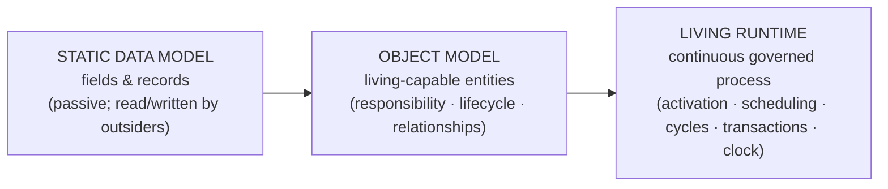

| Altitude | What it answers | Analogy | CIP phase |
|---|---|---|---|
| **Static Data Model** | *What is stored?* | A filled-in form | (pre-CIP faculties) |
| **Object Model** | *What entities exist and how are they related?* | Anatomy | Phase 1 + 1.5 |
| **Living Runtime** | *How does the organism metabolize — moment to moment, forever?* | Physiology | **Phase 2** |

The leap from Object Model to Living Runtime is the leap from *a mind that could exist* to *a mind that
is happening*. Everything below specifies the physiology.

## 1.6 The runtime as a cognitive operating system

The governing metaphor (extending Phase 1's "Cognitive State is the kernel"): **the runtime is the
operating system that schedules and executes on that kernel.** Its services:

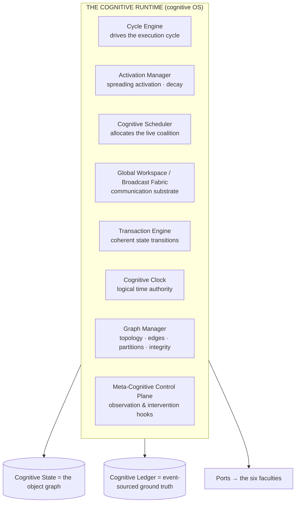

Each service is defined by its cognitive role and is independently replaceable (P6/OL8). The rest of this
document specifies each in turn, then shows them running together (Chapter 14).

---
---

# CHAPTER 2 — THE UNIVERSAL COGNITIVE EXECUTION CYCLE

## 2.1 Purpose and status

The execution cycle is the runtime's **metabolic loop** — the canonical sequence every cognitive act
follows, and the sequence every future capability (Vision, Voice, Automation, Multi-Agent) executes
through unchanged (RL1, P11). Phase 0 §2 named the cycle; Phase 1 Ch8 bound it to the Regions; this
chapter specifies it as an *engine* — the inputs, outputs, and object interactions of each stage as the
runtime actually runs it.

A single lap is a **cognitive cycle**. A bounded run of cycles toward one operational goal is a
**cognitive episode**. The Metacognitive Control Plane (Chapter 11) runs orthogonally and may reshape any
cycle.

## 2.2 The canonical cycle

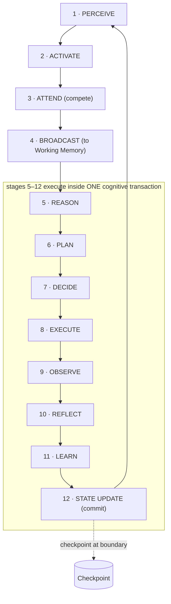

**Crucial runtime fact:** the *deliberative* stages (Reason → State Update) execute **inside a single
cognitive transaction** (Chapter 9), so a cycle either advances the mind to a new coherent state or
leaves it exactly as it was — never half-thought. Perception/activation/attention (stages 1–4) run
*before* the transaction opens (they decide *what* the transaction will be about). Reflection and Learning
(10–11) may also spin off *asynchronous* follow-on cycles (they are often deferred to idle cycles).

## 2.3 Stage-by-stage specification

For each stage: **why it exists · responsibility · inputs · outputs · object interactions.**

### Stage 1 — Perceive
- **Why:** cognition must ingest change from the world in a modality-agnostic form (P11).
- **Responsibility:** convert a stimulus (a user turn, a document upload, a scheduled trigger, an external
  event) into normalized **Percepts**.
- **Inputs:** raw signals via the Perception port (Conversation today; Vision/Voice/etc. later).
- **Outputs:** Percept sub-objects with initial salience features and provenance.
- **Objects:** creates **Percepts**; each Percept is a candidate to become a **Belief** (Phase 1.5, Ch4).

### Stage 2 — Activate
- **Why:** the relevant part of the dormant graph must come alive (Chapter 3).
- **Responsibility:** spread activation from the new Percepts and the active Goals into related objects
  (beliefs, prior goals, predictions) along graph edges.
- **Inputs:** Percepts; the current active Goal set; the object graph.
- **Outputs:** an *activated candidate set* — objects now above the activation threshold.
- **Objects:** **Activation Manager** touches **Beliefs, Goals, Predictions, Plans** via edges.

### Stage 3 — Attend (compete)
- **Why:** the activated set is still too large; a bounded mind must choose (P3).
- **Responsibility:** run the attention competition (Phase 1.5, Ch3) over the activated candidates,
  weighted by goal-relevance, surprise, urgency, risk, user-signal, minus cost.
- **Inputs:** activated candidate set; Goals (top-down bias); Prediction errors (bottom-up surprise);
  the Attention Object's budget.
- **Outputs:** a **focus coalition** (winners) + an **inhibition set** (explicitly ignored, with reasons).
- **Objects:** the **Attention Object** produces the coalition; losers recorded as deferred/inhibited.

### Stage 4 — Broadcast (to Working Memory)
- **Why:** Global Workspace Theory — the winning coalition must be made *globally available* so any
  deliberative object can use it.
- **Responsibility:** place references to the focus coalition into **Working Memory** (the bounded active
  view) and broadcast their availability on the Global Workspace fabric (Chapter 5).
- **Inputs:** the focus coalition.
- **Outputs:** a populated Working Memory; a broadcast signal.
- **Objects:** **Working Memory** now references the live coalition; this *ends* the pre-deliberative
  phase.

### Stage 5 — Reason
- **Why:** the mind must transform beliefs + goal into hypotheses, interpretations, and candidate answers
  (proportional to stakes, P5).
- **Responsibility:** the Reasoning Supervisor selects a reasoning mode and invokes the Generation faculty
  as an instrument; comprehends percepts into beliefs; forms/updates predictions.
- **Inputs:** Working Memory coalition (goal + beliefs + activated knowledge).
- **Outputs:** new/updated **Beliefs**, new **Predictions**, hypotheses with confidence.
- **Objects:** reads **Goals/Beliefs**, writes **Beliefs/Predictions** (staged in the transaction).

### Stage 6 — Plan
- **Why:** intent must become executable, guarded structure.
- **Responsibility:** construct or adapt a **Plan Object** (task tree, guards, expectations, fallbacks).
- **Inputs:** the active Goal; beliefs (guards); predictions (expectations).
- **Outputs:** a **Plan** (staged), each action bound to an expectation.
- **Objects:** writes a **Plan**; binds **Predictions** as expectations.

### Stage 7 — Decide
- **Why:** nothing acts on the world without an accountable choice (the causal hinge).
- **Responsibility:** generate/score alternatives; commit an **Executive Decision** (winner +
  alternatives + rationale + confidence + authorizing Identity).
- **Inputs:** the Plan; confidence; Identity authority; risk.
- **Outputs:** an immutable **Executive Decision**; possibly a **Checkpoint** trigger; possibly a
  human-escalation decision (P10).
- **Objects:** writes an **Executive Decision**; may seal a **Checkpoint**.

### Stage 8 — Execute
- **Why:** intentions must touch the world through a controlled boundary.
- **Responsibility:** dispatch the Plan's execution units through the **Effect Boundary** to the
  Workspace/Generation faculties (dry-run/approval/reversibility as required).
- **Inputs:** the committed Plan + Decision.
- **Outputs:** world effects; raw outcomes.
- **Objects:** the **Plan** executes; **faculties** act; nothing about the mind's *facts* is owned here
  (P1).

### Stage 9 — Observe
- **Why:** the mind must sense what its action actually did, to compare against expectation.
- **Responsibility:** capture outcomes; reconcile each expectation-bound **Prediction** into a
  prediction **error** and, if large, a **surprise**.
- **Inputs:** raw outcomes; the expectations set at Plan/Decide.
- **Outputs:** resolved **Predictions** (error + attribution); surprise signals to Attention.
- **Objects:** resolves **Predictions**; may spawn **Beliefs** (what happened); surprise re-enters
  Attention next cycle.

### Stage 10 — Reflect
- **Why:** decisions must be evaluated to enable improvement (often deferred to idle cycles).
- **Responsibility:** enqueue/produce a **Reflection Object** — replay the episode, compare
  expected-vs-actual, attribute cause, emit candidate improvements.
- **Inputs:** the episode's Ledger events; Predictions; Decisions.
- **Outputs:** a **Reflection** with candidate improvements (it *proposes*, never mutates).
- **Objects:** creates **Reflection**; references (never mutates) its subjects.

### Stage 11 — Learn
- **Why:** validated experience must become durable, reversible improvement (P9).
- **Responsibility:** validate → shadow → (approve) → commit → monitor candidate improvements as
  **Learning Objects**.
- **Inputs:** Reflection candidates; the Knowledge faculty (for validation).
- **Outputs:** committed, versioned, reversible changes to Beliefs (promotion), Strategy/Policy, Goal
  priorities, calibration, rarely Identity.
- **Objects:** creates **Learning Objects**; writes *through* Knowledge (never a local store).

### Stage 12 — State Update (commit)
- **Why:** the cycle's staged mutations must become the mind's new coherent state — atomically.
- **Responsibility:** the **Transaction Engine** validates cognitive invariants and commits the event
  batch to the Ledger; the live graph advances to the new projection; a **Checkpoint** may seal at this
  boundary; activation begins to decay.
- **Inputs:** all staged mutations from stages 5–11.
- **Outputs:** a new coherent Cognitive State; committed events; optional Checkpoint.
- **Objects:** every touched object gets a new version (OL4); **Checkpoint** may be sealed; **Attention**
  budget updated.

## 2.4 Why this is the canonical cycle for every capability

Because the cycle is defined over *abstract* stages and *abstract* objects (never modalities or
mechanisms), every future capability is simply a new *source* for Perceive, a new *instrument* for Reason
or Execute, or a new *trigger* for a cycle — the twelve stages never change (P11, RL1). This is what lets
Vision, Voice, Automation, and Multi-Agent all "execute through this runtime" without redesign
(Chapter 12).

---
---

# CHAPTER 3 — THE OBJECT ACTIVATION MODEL

## 3.1 Purpose

Activation is the runtime's answer to *aliveness*: the mechanism by which a dormant object in the vast
graph becomes a live participant in cognition — and, just as importantly, returns to dormancy. It is the
gate that keeps the active set **bounded** (RL2, P3) while ensuring the *right* objects wake at the *right*
time. Without activation, either everything is alive (the Chapter 1 seizure) or nothing is (a dead
graph).

## 3.2 Cognitive philosophy

Drawn from **spreading activation** (ACT-R; semantic-network models): activating one concept partially
activates its neighbors, so thinking of "fire" primes "smoke." From connectionism: activation is a
graded energy, not a binary switch, and it *decays*. From working-memory research: only a few items can
be highly active at once, with long-term memory as the dormant backing store. Activation is therefore a
*continuous energy that flows along relationships and fades over time* — the cognitive analogue of
priming.

## 3.3 The activation states

```mermaid
stateDiagram-v2
    [*] --> Dormant : object exists in the graph, not participating
    Dormant --> Activating : receives activation (spread / goal-relevance / surprise / trigger)
    Activating --> Active : activation crosses the participation threshold
    Active --> Sustained : re-activated each cycle (still relevant)
    Sustained --> Decaying : activation not refreshed
    Active --> Decaying : relevance passes
    Decaying --> Dormant : falls below threshold
    Active --> Suspended : deliberately parked (dependency/preemption) with resumption state
    Suspended --> Activating : woken (dependency cleared / preemptor done)
    Decaying --> Expired : archived object; activation no longer meaningful
    Expired --> [*]
```

- **Dormant:** present in the graph, invisible to the current cycle.
- **Active:** above threshold — can emit signals, compete for attention, be read by reasoning, be mutated.
- **Suspended:** an *intentional* park (distinct from decay) with a resumption state (e.g., an interrupted
  Goal — Phase 1.5, Ch2).
- **Decaying → Dormant:** the default fate of everything (RL5) — nothing stays alive without being
  re-earned.

## 3.4 The activation properties (how much, why, from whom)

| Property | Meaning | Why it exists |
|---|---|---|
| **Activation level** | Graded energy [dormant … fully active] | Aliveness is graded, not binary |
| **Activation priority** | How strongly this object *demands* to be active | Feeds the scheduler & attention |
| **Activation source / propagation** | Where activation came from and where it spreads next | Spreading activation along edges |
| **Activation decay** | The rate energy fades without refresh | Keeps the active set bounded (RL2/RL5) |
| **Activation confidence** | How *sure* the runtime is this object *should* be active | Low-confidence activation is cheap/tentative |
| **Activation inheritance** | Children/dependents inherit a fraction of a parent's activation | A hot Goal warms its sub-goals and premises |
| **Activation ownership** | Which principal's authority the activation carries | Multi-agent & accountability (an agent can't force-activate another's private objects) |

## 3.5 How activation flows through the graph

Activation propagates along the *typed relationships* of Phase 1.5, Ch11, with edge-type-specific
conductance:

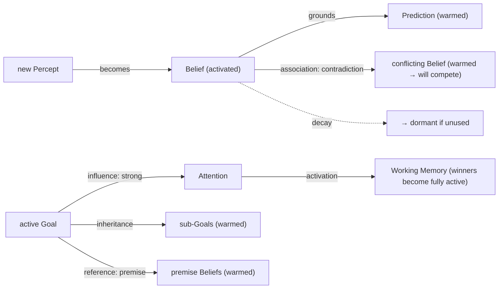

Rules of flow:
- **Goals radiate top-down** (a hot goal warms its sub-goals, premises, and relevant plans).
- **Percepts and surprise radiate bottom-up** (a surprising observation warms related beliefs and the
  goals they threaten).
- **Contradiction edges pre-warm rivals** so competition (Chapter 7) has both sides live.
- **Conductance is weighted by edge confidence** (Chapter 10): a strong, trusted edge conducts more
  activation than a weak, decaying one.
- **Everything decays** unless a cycle refreshes it — so the active set self-prunes (RL5).

## 3.6 Interaction with attention and scheduling

Activation and attention are distinct but coupled: **activation decides what is *eligible* to compete;
attention decides what *wins* and enters Working Memory** (Chapter 2, stages 2–4). Activation is broad
and cheap (priming many objects); attention is narrow and decisive (selecting the coalition). The
scheduler (Chapter 4) uses activation *priority* to decide which coalition gets the next cycle.

## 3.7 Edge cases

Activation storm (a flood of percepts warms too much → attention's cost term and the decay rate bound it;
the scheduler still admits only one coalition); stuck-active object (a hard decay floor guarantees
eventual dormancy — no object is immortally alive); premature decay of a still-relevant object
(re-activation on next reference restores it cheaply from the graph — it was never deleted); activation
without authority (rejected — ownership gates cross-principal activation); orphaned activation (energy
with no valid source decays immediately).

---
---

# CHAPTER 4 — THE COGNITIVE SCHEDULER

## 4.1 Why cognition requires scheduling

At any moment, multiple coalitions may be eligible (a user's new question, a background reflection, an
approaching deadline, a surprising observation). Only one line of deliberate thought can hold the Global
Workspace at a time (coherence requires it — two simultaneous broadcasts interfere). Therefore something
must **decide which coalition gets the next cognitive cycle**, when to interrupt the current one, and how
to prevent important-but-quiet goals from being starved by loud-but-trivial stimuli. That is the
Cognitive Scheduler — the runtime's allocator of the scarcest resource in the system: *coherent
attention*.

## 4.2 What the scheduler allocates (and why it is not CPU)

An OS scheduler allocates **CPU time to isolated processes**. The cognitive scheduler allocates
**cognitive cycles to coalitions of shared objects**. The differences are foundational:

| Dimension | OS scheduler | Cognitive scheduler |
|---|---|---|
| Unit scheduled | An isolated process | A coalition of *shared* objects in one workspace |
| Isolation | Processes are isolated | Coalitions share the same object graph (they can interfere) |
| Goal of fairness | Equal CPU / throughput | *No important goal is neglected* — relevance-fairness, not equal-time |
| Priority basis | Static/nice values, deadlines | Salience: goal-relevance + surprise + urgency + risk (evolving every cycle) |
| Preemption trigger | Timer tick, higher-priority ready | **Surprise** (prediction error) and **risk** (bottom-up), or a higher-salience goal |
| Correctness | Liveness + throughput | **Coherence** — the mind must remain a single coherent self across switches |

## 4.3 How competing coalitions receive cognition

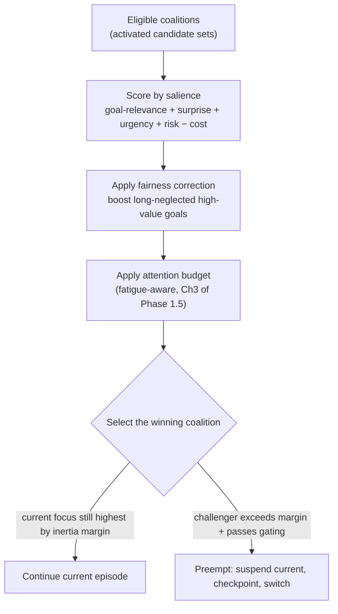

- **Priorities evolve** every cycle because salience is recomputed as goals progress, deadlines approach,
  and surprises arrive (Phase 1.5, §2.8). Nothing is statically prioritized.
- **Starvation prevention:** a fairness correction periodically boosts high-value goals that have gone
  long without cognition — the runtime *notices neglect* and repays it. This is the cognitive form of
  aging.
- **Interruption/preemption:** a challenger coalition preempts only if it exceeds the current focus by an
  **inertia margin** (thrash-guard) *and* passes metacognitive gating. On preemption, the current episode
  is **suspended with a resumption checkpoint** (Chapter 9/10), so it resumes faithfully.
- **Urgent interrupts:** high-risk or high-surprise bottom-up coalitions (a security alert, a
  reproduction failure) carry a salience premium that lets them cut the line — but still through the same
  gated mechanism, never as an ungoverned exception.

## 4.4 Cognitive fairness — a different objective than OS fairness

OS fairness means "each process gets its share." Cognitive fairness means **"no goal the mind has
committed to is silently abandoned by neglect."** A background reflection may wait indefinitely if
nothing important needs it; but a committed high-value Goal that keeps losing the competition triggers
the fairness correction, is escalated, or is explicitly and auditably deprioritized — it is never *lost
by accident* (Phase 1.5, §2.9: "the goal set narrows under stress but is never lost"). Fairness here
protects *intentions*, not *time slices*.

## 4.5 Idle scheduling — cognition in silence

When no external stimulus is eligible, the scheduler does **not** idle the CPU-analogue; it schedules
*maintenance cognition*: dequeue the Reflection queue, run Learning consolidation, refresh predictions,
recover attention budget (Phase 1.5, Ch3), decay stale activation, and perform goal-maintenance. This is
the runtime realization of RL1 (cognition is continuous) — the mind *uses* its quiet to get better, and a
new stimulus simply preempts maintenance.

## 4.6 Edge cases

Two equally-salient coalitions (tie broken by owner authority, then by lower switching cost, then by
metacognitive arbitration); preemption thrash (inertia margin + minimum dwell time); a runaway episode
that never yields (cycle budget, P8 → forced yield + reflection on why); scheduler starved by a
high-frequency surprise source (surprise habituation — repeated identical surprises lose their premium,
mirroring neural habituation); no eligible coalition and empty maintenance queues (deepest low-power
state — the mind "rests," watching only for triggers).

---
---

# CHAPTER 5 — THE OBJECT COMMUNICATION PROTOCOL

## 5.1 Purpose and stance

Objects must exchange information without duplicating each other's content (OL7) and without depending on
any transport mechanism (RL6). This chapter defines communication in **cognitive terms** — signals,
salience, influence, broadcast — deliberately *not* in software terms (no queues, no RPC, no events-as-
messages). The Cognitive Ledger's events (Phase 1.5, Ch7) are the *record* of communication; this chapter
is about the *cognitive semantics* of it.

## 5.2 The four modes of cognitive communication

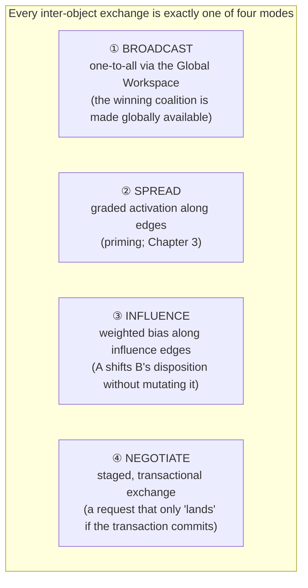

| Mode | Cognitive meaning | Example | Cardinality |
|---|---|---|---|
| **Broadcast** | Making content globally available so *any* object may use it (Global Workspace Theory) | The focus coalition is broadcast to Working Memory | one → all |
| **Spread** | Priming: activating a neighbor by proximity/relation | A hot Goal warms its premises | one → neighbors |
| **Influence** | Biasing another's behavior without changing its state | Identity biases Reasoning's caution | one → one/many, weighted |
| **Negotiate** | A proposal whose effect is atomic: it commits or it doesn't | A Plan requests authorization from a Decision | pairwise, transactional |

## 5.3 How requests and responses flow

There is no "call and return" in the software sense. Instead:

1. An object raises a **need** as a signal on the Global Workspace (e.g., Reasoning needs a belief
   activated).
2. The signal **spreads/broadcasts**; eligible objects that can satisfy the need **respond** by raising
   their availability (e.g., the Recall Orchestrator activates matching beliefs from Knowledge — as
   references, not copies).
3. If the exchange would *change* the mind (a mutation), it is staged inside the current **transaction**
   and only "lands" on commit (Chapter 9). If the transaction aborts, the response never happened.

This makes every consequential communication **atomic and reversible** — a request that fails leaves no
residue, because the mutation was staged, not applied.

## 5.4 How influence propagates (and why it is not mutation)

Influence is the mind's most pervasive communication and its most subtle: an object *biases* another
without owning or mutating it. Identity biases Reasoning's standards; a Goal biases Attention's salience;
a Prediction's surprise biases what Attention selects next. Influence carries a **weight** and a
**direction** but never a write — the influenced object still changes *itself* (via a transaction) if it
so decides. This preserves OL3 (each object owns its own state) while allowing the rich, graded
interdependence that makes cognition more than a pile of independent modules.

## 5.5 How objects negotiate and resolve conflict

When two objects' needs conflict (a Plan wants to act; a Constraint forbids it; two Beliefs contradict),
they **negotiate** through the transaction's consistency check: the proposed joint state is validated
against cognitive invariants (Chapter 9). If it violates one (e.g., belief coherence), the transaction
fails and routes to arbitration (Chapter 7). Negotiation is thus not a bespoke protocol per object pair;
it is the *uniform* discipline that no communication may leave the mind incoherent. Relationships evolve
as an outcome: repeated successful cooperation *strengthens* an edge (raises its confidence/conductance);
repeated conflict *weakens or rewires* it (Chapter 10).

## 5.6 Edge cases

Signal flood (salience-gated broadcast — routine signals reach only subscribers, high-salience reach all;
mirrors attention, prevents a communication seizure); lost signal (event-sourcing + idempotent
consumers + replay guarantee eventual delivery — Phase 1.5, Ch7); influence loop (weighted influence
converges or is damped; it cannot force runaway because it never directly mutates); cross-principal
communication (gated by ownership — one agent cannot silently influence another's protected objects).

---
---

# CHAPTER 6 — COGNITIVE COOPERATION

## 6.1 What cooperation is, and how it differs from communication

Communication is the *exchange of signals*; cooperation is *multiple objects jointly producing a single
coherent outcome*. Two objects can communicate and still work at cross-purposes; cooperation means they
**converge on a shared, consistent contribution to the same cognitive act**. The canonical cooperative
chain is the deliberative spine of a cycle:

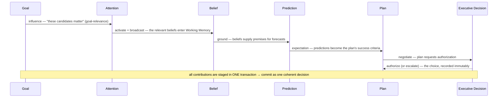

Each object contributes what only it can: the Goal contributes *purpose*, Attention contributes *focus*,
Beliefs contribute *premises*, Predictions contribute *expectations*, the Plan contributes *structure*,
the Decision contributes *commitment and accountability*. None does the others' job (OL1); together they
produce something none could alone — a *justified, focused, accountable action*.

## 6.2 The dimensions of cooperation

| Dimension | Meaning | Mechanism |
|---|---|---|
| **Collaboration** | Objects contribute complementary parts | The deliberative spine (above) |
| **Negotiation** | Objects reconcile partially-conflicting needs | Transactional consistency (Chapter 5.5) |
| **Dependency** | One object needs another's output first | Graph dependency edges + activation inheritance |
| **Consensus** | Objects converge on a joint state | Invariant-satisfying transaction commit |
| **Conflict** | Objects cannot both be satisfied | Escalates to competition (Chapter 7) |
| **Influence** | Objects bias each other's dispositions | Weighted influence edges (Chapter 5.4) |
| **Authority** | Whose contribution dominates on conflict | Identity precedence + Goal ownership |
| **Trust** | How much one object weights another | Confidence + calibration (Phase 1, Ch6) |

## 6.3 Authority and trust — the difference

**Authority** is *structural*: the Identity Core outranks a Task overlay; a Goal's owner outranks a
delegate. Authority decides *who wins when they must*. **Trust** is *epistemic and graded*: a
well-calibrated belief source is weighted more than a chronically-overconfident one (Phase 1, §6.7).
Authority is about legitimacy; trust is about reliability. Cooperation uses both: contributions are
*weighted by trust* and, on irreconcilable conflict, *resolved by authority*.

## 6.4 Consensus as invariant satisfaction

Crucially, cooperative "consensus" in this runtime is not a vote or a negotiation protocol — it is simply
**a transaction that satisfies all cognitive invariants**. If the joint contribution of Goal + Belief +
Prediction + Plan + Decision forms a coherent state (no contradiction, acyclic, authority respected,
confidence monotone), the transaction commits and *that is consensus*. If not, cooperation has failed and
the runtime falls through to competition/arbitration. This unifies cooperation and correctness: **the
mind cooperates successfully exactly when it can remain coherent.**

## 6.5 Edge cases

A cooperative chain where a premise Belief is retracted mid-deliberation (the transaction's guard
re-evaluates; the Plan adapts or the cycle aborts — no incoherent commit); a delegate contributing beyond
its authority (rejected by the authority rule); a low-trust contribution that would dominate by volume
(down-weighted by calibration so loudness ≠ influence); circular dependency in the cooperative chain
(rejected at edge creation — the spine is a DAG).

---
---

# CHAPTER 7 — COGNITIVE COMPETITION

## 7.1 Why competition is necessary

Cooperation produces coherence *when objects can agree*. Competition is what happens **when they
cannot** — when two Goals demand the same attention, two Beliefs contradict, two Plans propose
incompatible actions, two Learning candidates propose opposite changes. A mind that cannot resolve such
rivalries either freezes (indecision) or fractures (incoherence). Competition is the runtime's principled
resolution of rivalry into a single coherent line.

## 7.2 The competitors and their arenas

| Rivalry | Arena | Stake |
|---|---|---|
| Two Goals | The scheduler / attention | Which gets cognition now |
| Two Beliefs | Belief graph (contradiction edge) | Which the mind holds |
| Two Plans | Deliberation | Which action is taken |
| Two Predictions | Future model | Which future is expected |
| Competing Attention pulls | The salience field | Where focus goes |
| Competing Reflections | The reflection queue | Which episode is reviewed first |
| Competing Learning candidates | The learning pipeline | Which durable change is committed |

## 7.3 The arbitration ladder

Competition is resolved by a **fixed ladder** — the runtime always tries the cheapest, most local
mechanism first and escalates only on failure. This ordering is invariant (it is the unification of the
goal-arbitration order in Phase 1.5 §2.8, belief arbitration §4.8, and transaction conflict §12.6):

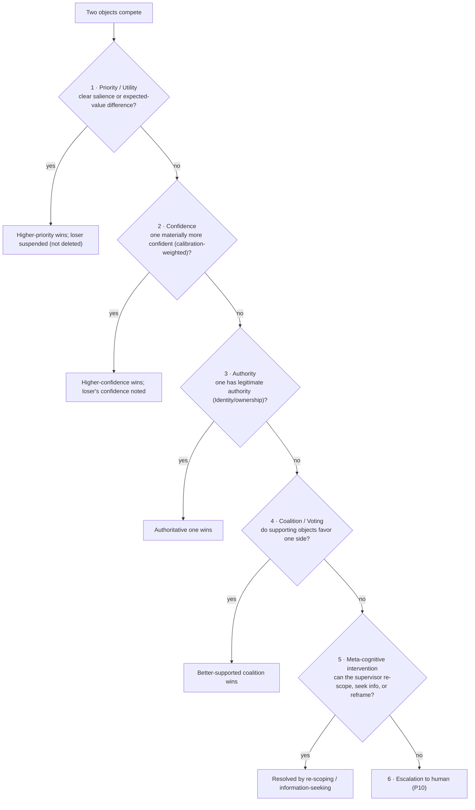

Each rung explained:

1. **Priority / Utility.** The object with higher salience (goals) or higher expected value (plans) wins.
   Cheapest and most common.
2. **Confidence.** When priority ties, the more *confident* option wins — but confidence is
   **calibration-weighted** (a chronically overconfident source's certainty is discounted; Phase 1, §6.7),
   so loudness does not win.
3. **Authority.** When confidence ties, *legitimate authority* decides — Identity precedence (Core >
   overlay) and Goal ownership. Authority breaks ties that merit cannot.
4. **Coalition / Voting.** When authority is equal or absent, the runtime weighs the *supporting
   objects*: the belief with more (independent, trusted) evidence, the plan whose predictions are better
   grounded. This is a weighted "vote" of the graph, not a naive headcount.
5. **Meta-cognitive intervention.** If the object level cannot resolve it, the supervisor (Chapter 11) may
   *re-scope* (split/merge goals to remove the conflict), *seek information* (spend a cycle to raise a
   confidence), or *reframe* the problem.
6. **Escalation.** If genuine and unresolved — especially contested *authority* or high stakes under
   irreducible uncertainty — the mind escalates to a human. Escalation is never skipped when it is
   warranted (P10).

## 7.4 Why "never delete the loser"

A losing competitor is **suspended, down-weighted, or archived — never silently destroyed** (OL4/OL6).
The losing goal may become relevant again; the losing belief may be vindicated by later evidence; the
rejected plan is exactly the counterfactual Reflection needs. Preserving losers is what makes the mind
*revisable* and its decisions *auditable* — and it is what lets Checkpoints branch to explore the path not
taken (Chapter 10).

## 7.5 Edge cases

Perpetual oscillation between two near-equal competitors (dampening + minimum dwell + eventual forced
escalation — the mind must not dither forever); a competitor that wins by fabricated support
(evidence provenance/calibration checks; adversarial support is discounted and flagged); mass belief
retraction from one competition (bounded and logged so the mind notices a large epistemic shift — Phase
1.5, §4.9); competition among learning candidates that would each individually pass validation but
conflict jointly (the transaction's consistency check catches the joint incoherence).

---
---

# CHAPTER 8 — THE COGNITIVE CLOCK

## 8.1 Why cognition cannot rely on wall-clock time

Wall-clock time is unreliable and insufficient for a mind, for four reasons:

1. **Non-determinism:** two runs at different speeds would order events differently, breaking replay
   (Phase 1.5, Ch10) — the mind could not faithfully reconstruct its past.
2. **Distribution:** across faculties, agents, and future distributed minds, clocks skew; wall-clock
   cannot define a consistent "before/after."
3. **Subjectivity:** cognition has a *felt* pace — a hard problem "takes longer" in cognitive effort even
   if milliseconds are equal. Wall-clock cannot represent this.
4. **Pausability:** a mind can be paused, checkpointed, and resumed hours later; its *internal* sense of
   sequence must be unbroken across that gap, which wall-clock cannot provide.

The runtime therefore defines a **layered clock**, of which wall-clock is only the least authoritative
layer.

## 8.2 The layers of cognitive time

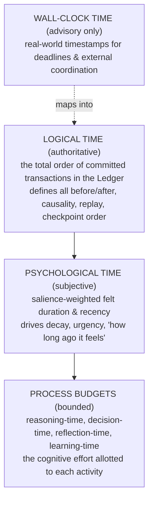

| Layer | What it orders/measures | Authority | Used for |
|---|---|---|---|
| **Logical time** | Total order of committed transactions (the Ledger sequence) | **Definitive** | Causality, event ordering, replay, checkpoint & branch ordering, temporal consistency |
| **Psychological time** | Subjective, salience-weighted duration & recency | Derived | Activation decay, urgency, recency-weighting of the past (Phase 1, Ch5) |
| **Process budgets** | Effort allotted to reasoning / decision / reflection / learning | Governed by scheduler | Proportional deliberation (P5); bounding runaway thought (P8) |
| **Wall-clock** | Real-world instants | Advisory | Deadlines, human coordination, external triggers |

## 8.3 The named "times" of cognition

- **Reasoning time:** the effort budget for a reason-stage (a hard problem earns more logical steps, not
  more milliseconds).
- **Decision time:** how long the mind deliberates before committing an Executive Decision; a fast
  decision is *recorded as fast* so Reflection can weigh haste (Phase 1.5, §9.9).
- **Reflection time / Learning time:** budgets for the (usually idle-scheduled) evaluation and
  consolidation activities — deliberately elastic, expanding in quiet and contracting under load.
- **Event / Checkpoint / Replay ordering:** all defined by *logical* time, so a checkpoint always seals a
  well-defined "moment," a replay reproduces the exact sequence, and branches have unambiguous ancestry.

## 8.4 Temporal consistency — the master guarantee

Because logical time is the total order of *committed transactions*, and every mutation is a committed
transaction (RL3), the mind possesses a single, unambiguous, replayable timeline. This is what makes
possible: faithful **replay** (reconstruct any past self), consistent **checkpoints** (seal a real
moment), sound **causal attribution** in Reflection (Phase 1.5, Ch7), and — critically for the future —
**distributed consistency** across many minds (a global order derivable from the shared Ledger, the
classical distributed-snapshot problem solved by construction, Chapter 12).

## 8.5 Edge cases

Wall-clock skew / out-of-order external events (ordered by logical time on ingestion, not arrival);
a deadline in wall-clock that must influence logical cognition (mapped into psychological urgency, which
biases salience); a mind resumed after a long real-world gap (logical time is unbroken; psychological
time registers the gap as "stale," triggering re-verification of decayed beliefs); two transactions
racing for the next logical position (the clock assigns a single total order deterministically — no ties).

---
---

# CHAPTER 9 — COGNITIVE TRANSACTIONS (THE RUNTIME ENGINE)

## 9.1 Relationship to Phase 1.5

Phase 1.5, Ch12 *defined* the cognitive transaction (its ACID semantics, invariants, and conflict rules).
This chapter specifies the **engine that runs it** — how the runtime actually opens, stages, validates,
commits, aborts, recovers, branches, and parallelizes transactions during live cognition. The definitions
are inherited unchanged; here they *execute*.

## 9.2 A cycle is a transaction

The runtime's core discipline (Chapter 2.2): the deliberative arc of every cognitive cycle (Reason →
State Update) runs inside **one** transaction. This is why "a cognitive decision never partially updates
the mind" (the Phase 1.5 mandate) is *operationally* true: there is no moment at which some of a cycle's
mutations are applied and others are not.

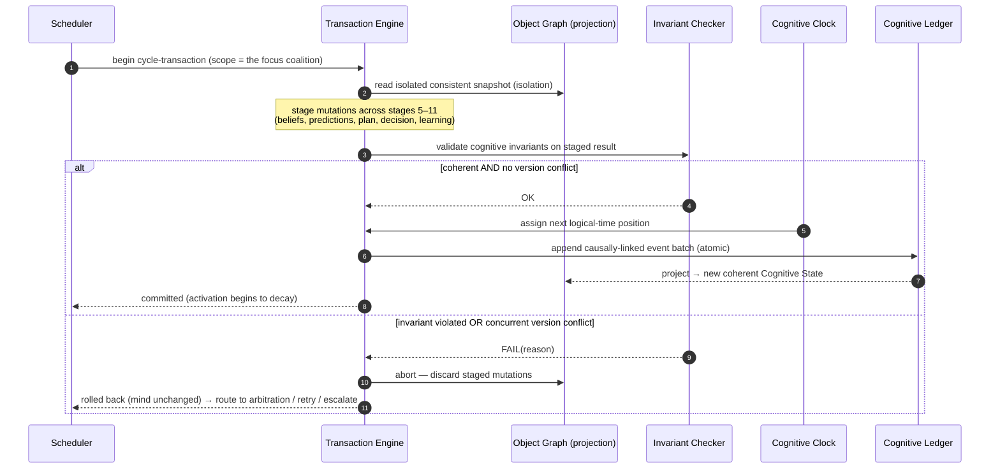

## 9.3 The invariants the engine enforces (consistency)

On every commit the engine verifies, at minimum: **belief coherence** (no accepted contradiction),
**goal-graph acyclicity**, **identity precedence** (no overlay violates a Core constraint),
**confidence monotonicity** (a conclusion no more certain than its weakest necessary premise), and
**authority validity** (the authorizing Identity has scope for the decision). A staged state failing any
invariant cannot become the mind's state. *Consistency is not checked after the fact; it is a
precondition of existing.*

## 9.4 Partial failure and recovery

- **Mind-side partial failure:** impossible by construction — the mind's mutations are atomic.
- **World-side partial failure:** an Execute stage may have *partially affected the world* before an abort
  (a file written, an email half-sent). The runtime handles this via the **Effect Boundary**: world
  effects prefer dry-run/reversible operations; irreversible ones are **checkpointed before** and either
  compensated (undo) on abort or, if truly irreversible, **escalated for approval before** execution
  (P10). The mind's state and the world's state are reconciled through Observe (the mind *learns* what
  actually happened, even on failure).
- **Crash recovery:** because commit is an atomic append to the Ledger, recovery replays only committed
  batches into a fresh projection (Phase 1.5, Ch10) — the mind wakes at its last coherent self, never in a
  half-committed limbo.

## 9.5 Branching and parallel cognition

- **Branching:** the engine can fork a transaction line from a **Checkpoint** (Chapter 10) into an
  isolated branch, run speculative cycles there (counterfactual reasoning — "what if I planned
  differently?"), and later **merge** the winning branch back as a transaction with conflict resolution.
  Branches never touch the main line until merged.
- **Parallel cognition:** multiple transaction lines may run concurrently (multi-focus attention;
  multi-agent minds). They read isolated snapshots and are reconciled at commit by **optimistic
  version-conflict detection** (the second committer on a shared object re-validates and retries) — never
  by blind overwrite (Phase 1.5, §12.6). This is what lets the runtime scale to many concurrent lines and
  many minds without corruption.

## 9.6 Edge cases

Long transaction that cannot commit promptly (decomposed into smaller cycle-transactions); repeatedly-
conflicting transaction (bounded retries → escalate); invariant checker itself uncertain (fails safe:
abort, never commit a possibly-incoherent mind); merge conflict between divergent branches (resolved by
the Chapter 7 arbitration ladder, possibly escalated); a world effect that cannot be compensated (the
pre-execution checkpoint + approval gate is the only safe path — the runtime refuses silent irreversible
action).

---
---

# CHAPTER 10 — THE COGNITIVE GRAPH (AT RUNTIME)

## 10.1 Relationship to Phase 1.5

Phase 1.5, Ch11 defined the graph's *vocabulary* (eleven relationship types) and its *static topology*.
This chapter specifies the graph as a **living, changing structure at runtime** — how edges are born,
strengthen, decay, and rewire; how reasoning *traverses* it; how it is *partitioned* for boundedness and
multi-agent use; and how its *integrity* is preserved under constant mutation.

## 10.2 Topology — a small hot core in a vast cold field

At any instant the graph has two zones:

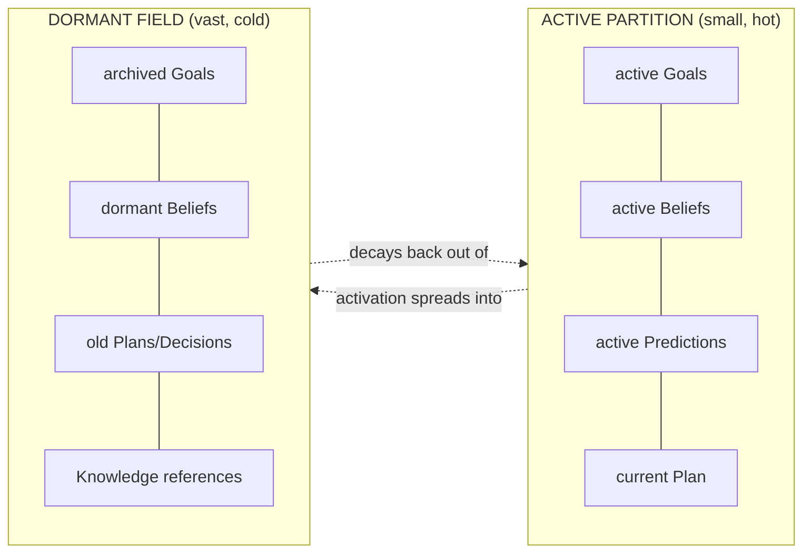

The **active partition** is what the runtime keeps alive (bounded by attention/activation, RL2); the
**dormant field** is the mind's entire history, cheap to hold because it is inert and reconstructable
from the Ledger. Cognition is the continual movement of objects between these zones.

## 10.3 Dynamic edges — creation, confidence, decay, rewiring

Edges are not fixed; they are *learned and maintained*:

| Edge dynamic | Meaning | Trigger |
|---|---|---|
| **Dynamic creation** | A new relationship is formed | Reasoning discovers a dependency; a contradiction is detected; a plan binds a prediction |
| **Edge confidence** | How trustworthy/strong a relationship is | Rises with corroboration, falls with disconfirmation |
| **Edge decay** | Unused relationships weaken | No traversal/reinforcement over logical time |
| **Rewiring** | A relationship is redirected | Learning finds a better dependency; arbitration re-scopes a goal |

Edge confidence governs **conductance** (Chapter 3): strong edges conduct more activation and are
preferred in traversal; decayed edges fade until pruned. This is how the graph *self-optimizes* — the
mind's most-used, most-reliable connections become its fastest paths (the cognitive analogue of Hebbian
strengthening and synaptic pruning), while stale structure quietly disappears.

## 10.4 Reasoning as graph traversal

Reasoning is, mechanically, **guided traversal of the active partition**:

- **Spreading activation** first illuminates a neighborhood (Chapter 3) — the candidate region to think
  in.
- **Goal-directed pathfinding** then traverses from premises (Beliefs) toward a conclusion or a plan,
  preferring high-confidence edges, pruning low-value branches under the reasoning-time budget
  (Chapter 8).
- **Contradiction edges** force the traversal to confront rivals (triggering competition, Chapter 7).
- The traversal's result — new beliefs, predictions, a plan — is *staged in the cycle-transaction* and
  becomes graph mutation on commit.

Thus "reasoning" is not a monolithic black box; it is *the runtime walking the graph under a goal, a
budget, and the invariants* — with the Generation faculty invoked as the instrument that proposes the
next step, and the runtime governing which steps are taken and kept.

## 10.5 Graph partitioning

Partitioning serves three purposes:
- **Boundedness:** the active/dormant partition keeps cognition tractable (RL2).
- **Scope:** partitions by workspace, goal-tree, or episode let the mind reason about one context without
  dragging in everything (a per-workspace subgraph).
- **Multi-agent / distributed:** each mind owns a partition; shared ground (the Knowledge faculty, shared
  goals) is a *shared partition*; coordination happens by exchanging broadcasts across partition
  boundaries (Chapter 12). Partitioning is the structural precondition for a society of minds.

## 10.6 Graph integrity

Under constant mutation, integrity is preserved by: the **acyclicity invariants** (goal-dependency,
belief-justification, causal edges are DAGs); **reference validity** (an edge to an archived object
resolves to the versioned object it referenced — OL4, so no dangling edges); **transaction-gated
mutation** (every edge change is a committed transaction — no edge appears outside the record); and
**checkpoint sealing** (a checkpoint captures a graph in a consistent, integrity-verified state). A graph
that fails an integrity check cannot be committed (Chapter 9).

## 10.7 Edge cases

Combinatorial explosion of edges (decay + pruning bound the live edge set; dormant edges cost nothing);
a discovered edge that would create a cycle (rejected; re-scoped — Phase 1.5, §2.9/§4.9); conflicting
edge-confidence updates from concurrent cycles (optimistic reconciliation, Chapter 9); traversal that
wanders without progress (reasoning-time budget forces a decision or an escalation, P8); partition that
grows unbounded (attention narrows and the fairness/consolidation machinery archives cold sub-regions).

---
---

# CHAPTER 11 — THE META-COGNITIVE RUNTIME (HOOKS ONLY)

> **Status per mandate:** this chapter does **not** implement metacognition. It specifies the *hooks* the
> runtime must expose so a future Metacognitive Supervisor (Phase 0, C12; Phase 1, Ch10) can observe and
> control cognition **without redesign**. Building the supervisor is a later phase.

## 11.1 Why the runtime must expose hooks now

If supervisory control were retrofitted later by reaching into the runtime's internals, it would violate
P6/OL8 and couple the supervisor to mechanism. Instead, the runtime is built from day one with two
clean surfaces — an **observation surface** and an **intervention surface** — through which *any* future
supervisor attaches. This is the operational form of "metacognition can preempt" (P8) and "design now,
implement later" (Phase 1, Ch10).

## 11.2 The observation surface (read-only)

The runtime continuously exposes, without the supervisor having to instrument anything:

| Observation hook | What it surfaces | Enables the supervisor to detect |
|---|---|---|
| **Cycle trace** | Each stage's inputs/outputs as events | Loops, wasted cycles, drift |
| **Coalition & salience feed** | What is active/attended/inhibited and why | Distraction, neglected goals |
| **Confidence & uncertainty stream** | Live confidence across objects | Overconfidence, low-confidence risk |
| **Invariant & conflict feed** | Near-violations, arbitrations, escalations | Incoherence pressure, contested authority |
| **Prediction-error stream** | Surprise magnitude over time | Model failure, regime change |
| **Budget/fatigue telemetry** | Attention budget, process budgets | Overload, thrash |

All observation is *read-only* and flows from the Ledger + live graph — the supervisor never needs to
pause cognition merely to watch it.

## 11.3 The intervention surface (control)

The runtime honors a fixed set of **control signals** that a supervisor may raise (P8). Each is defined
here as a *capability the runtime guarantees*, not as an implementation:

| Intervention hook | Effect on the runtime | Guarantee |
|---|---|---|
| **Pause cognition** | Freeze the active line at the next transaction boundary | Never mid-transaction — the paused mind is always coherent |
| **Resume cognition** | Continue from the paused boundary | Faithful resumption (Chapter 9) |
| **Abort cognition** | Discard the current cycle-transaction | Mind reverts to the last committed self (no residue) |
| **Reprioritize / retarget** | Adjust salience or switch the scheduled coalition | Governed by the scheduler (Chapter 4) |
| **Replay cognition** | Reconstruct and re-run a past episode from the Ledger | Deterministic (logical time, Chapter 8) |
| **Branch cognition** | Fork a Checkpoint into a speculative line | Isolated until merged (Chapter 10) |
| **Evaluate cognition** | Trigger a Reflection over a chosen episode | Produces candidates, never mutates (Phase 1.5, Ch7) |
| **Escalate** | Route a decision to a human | First-class control path (P10) |

## 11.4 Why hooks, not a built-in supervisor

Separating the *hooks* (now) from the *supervisor* (later) means the supervisor can be replaced, upgraded,
or even multiplied (a hierarchy of supervisors) without touching the runtime — and the runtime is fully
functional and safe (bounded, transactional, escalating) *before* any sophisticated supervisor exists.
The hooks are the permanent contract; the intelligence behind them is free to evolve.

---
---

# CHAPTER 12 — FUTURE EVOLUTION

The runtime supports every future capability **by construction**, because it is defined over abstract
stages (Chapter 2), abstract objects (Phase 1.5), and abstract communication (Chapter 5) — never over
modalities or mechanisms (P11, RL6). Each future capability enters as *new instances and relationships in
the existing runtime*, never as new runtime machinery. The uniform extension pattern:

| Capability | Enters the runtime as… | Runtime changes required |
|---|---|---|
| **Vision Intelligence** | New Perceive source (image Percepts) → Beliefs; visual salience feeds Attention | none |
| **Repository Intelligence** | Long-horizon Goals; repo events as Percepts; repo effects via Execute | none |
| **Voice Intelligence** | New Perceive (speech Percepts) + Execute (speech out); real-time budgets | none |
| **Meeting Intelligence** | Multi-speaker Percepts; decisions → Goals with owners/deadlines | none |
| **Automation** | Scheduled/threshold cycle *triggers*; unattended Execute with strict checkpointing & approval | none |
| **Embodied AI** | Sensorimotor Percepts + physically-irreversible Execute (mandatory pre-action checkpoints) | none |
| **Email Intelligence** | Inbound Percepts + guarded outbound Execute; temporal (follow-ups) | none |
| **Multi-Agent Systems** | Multiple concurrent transaction lines over partitioned graphs sharing the Knowledge faculty; cross-partition broadcast | none |
| **Distributed Minds** | Multiple runtimes sharing a global logical order derivable from a shared Ledger; consistent distributed snapshots via Checkpoints | none |

Two evolution guarantees deserve emphasis:

- **Automation & Embodied AI** stress the *safety* substrate: because every world-effect is
  transaction-gated, checkpointed, and (if irreversible) approval-gated, unattended and physical action
  inherit the runtime's coherence and reversibility guarantees *for free*. The permanence of Executive
  Decisions (Phase 1.5, Ch9) becomes essential precisely when no human witnesses the act.
- **Multi-Agent & Distributed Minds** stress the *time and transaction* substrate: logical time
  (Chapter 8) provides a shared order; optimistic transactions (Chapter 9) provide corruption-free
  concurrency; graph partitioning (Chapter 10) provides per-mind scope; broadcast (Chapter 5) provides
  inter-mind communication. The society of minds is the *same runtime* run many times over a shared
  Ledger — the classical distributed-systems problems (consistent snapshot, total order, conflict
  resolution) are solved by the very mechanisms already specified for a single mind.

This is the decade guarantee: **the runtime's vocabulary is fixed; the capabilities expressed through it
are unbounded.**

---
---

# CHAPTER 13 — ENGINEERING TRADE-OFFS

For each major runtime decision: the choice, the rejected alternatives, their advantages, their fatal
disadvantages, and the cognitive principle they would violate.

## 13.1 Continuous loop vs request-driven

- **Chosen:** an always-on continuous loop (RL1).
- **Rejected — request/response handler.** *Advantage:* trivially cheap; scales like a stateless service.
  *Disadvantage:* dead between requests — no persistent goals, no background prediction, no idle
  reflection/learning, no watchfulness. *Violates:* the definition of a mind (Phase 0/1) — it is a
  faculty, not cognition.

## 13.2 Bounded live coalition vs "activate everything"

- **Chosen:** attention/activation gate a small live coalition (RL2, P3).
- **Rejected — keep the whole graph active (let the model sort it out).** *Advantage:* no need to choose;
  maximal information available. *Disadvantage:* the Chapter 1 seizure — interference, unbounded cost,
  incoherence, trivial denial-of-service by noise. *Violates:* bounded rationality (P3).

## 13.3 Transactional cycles vs direct mutation

- **Chosen:** the deliberative arc of each cycle is one ACID transaction (RL3).
- **Rejected — mutate objects directly as reasoning proceeds.** *Advantage:* simpler; lower latency per
  step. *Disadvantage:* any mid-cycle failure leaves a half-thought, self-contradictory mind that cannot
  be recovered or reasoned about. *Violates:* coherence and durability (Phase 1.5, Ch12).

## 13.4 Logical time vs wall-clock

- **Chosen:** logical time (Ledger order) is authoritative; wall-clock advisory (RL4).
- **Rejected — order cognition by wall-clock.** *Advantage:* intuitive; free from the system. *Disadvantage:*
  non-deterministic replay, skew across faculties/agents, no subjective pacing, broken across pauses.
  *Violates:* replayability, auditability, distributed consistency (Chapter 8).

## 13.5 Salience/relevance scheduler vs OS-style time-slicing

- **Chosen:** a salience-and-coherence scheduler that protects *intentions* (Chapter 4).
- **Rejected — round-robin / equal-time scheduling.** *Advantage:* simple fairness; no starvation of
  processes. *Disadvantage:* cognition is not isolated processes; equal time to trivial and vital thoughts
  is *itself* irrational, and it cannot express goal-directed preemption by surprise. *Violates:*
  proportional deliberation and goal-directedness (P5, P7).

## 13.6 Decaying activation vs persistent activation

- **Chosen:** all aliveness decays unless re-earned (RL5).
- **Rejected — objects stay active until explicitly deactivated.** *Advantage:* no re-activation cost.
  *Disadvantage:* the active set grows monotonically; the mind cannot forget or refocus; cost is
  unbounded. *Violates:* boundedness (P3).

## 13.7 Metacognition-as-hooks vs metacognition-built-in

- **Chosen:** expose observation/intervention hooks now; build the supervisor later (Chapter 11).
- **Rejected — bake a fixed supervisor into the runtime.** *Advantage:* immediate control logic.
  *Disadvantage:* couples the supervisor to mechanism; cannot be replaced, upgraded, or layered; freezes
  metacognitive policy prematurely. *Violates:* replaceability and clean layering (P6, OL8).

## 13.8 Communication as cognitive modes vs software messaging

- **Chosen:** broadcast/spread/influence/negotiate, defined cognitively (Chapter 5).
- **Rejected — define communication as message queues / RPC.** *Advantage:* familiar; directly
  implementable. *Disadvantage:* binds the architecture to a transport, obscures the cognitive semantics
  (priming, global availability, weighted bias), and cannot express influence-without-mutation.
  *Violates:* implementation independence (RL6, OL8).

---
---

# CHAPTER 14 — COMPLETE COGNITIVE WALKTHROUGH

## 14.0 The scenario

A UnityWorks user, in one working session:

1. uploads three documents,
2. asks a difficult analytical question,
3. changes their goal halfway through,
4. uploads a fourth document,
5. requests a generated report,
6. corrects an earlier assumption,
7. ends the conversation.

Below, the runtime is traced across ~24 cognitive cycles grouped by scenario phase. Each cycle notes:
**trigger · activation · attention/scheduling · cooperation/competition · transaction & state change ·
predictions · reflection/learning.** (Cycles are logical, not wall-clock; idle cycles between user
actions are compressed and labeled.)

Legend for object shorthand: **G**=Goal, **B**=Belief, **PR**=Prediction, **PL**=Plan, **D**=Executive
Decision, **RF**=Reflection, **LE**=Learning, **CP**=Checkpoint, **WM**=Working Memory, **AT**=Attention.

---

### Phase A — Three documents uploaded (Cycles 1–4)

**Cycle 1 — First upload.**
- *Trigger:* Perceive — three document-upload Percepts arrive (via the Document Intelligence port).
- *Activation:* the Percepts spread activation into any dormant Goals about "the user's project" and warm
  the Knowledge references for this workspace.
- *Attention/scheduling:* no urgent competitor; the scheduler grants the cycle to the "understand new
  input" coalition. AT focus = the uploads.
- *Cooperation:* Reason interprets the Percepts into provisional **B1** "user is assembling a dossier on
  topic X" (confidence 0.5, provenance: upload pattern). A dormant **G0** "assist with the user's project"
  is warmed and a new operational **G1** "understand these documents" is *proposed*.
- *Transaction:* commits B1 (hypothetical), G1 (active). New logical-time position. Activation of the raw
  Percepts begins to decay (their *meaning* now lives in B1).
- *Predictions:* **PR1** "the user will ask a question about these documents soon" (confidence 0.6,
  horizon: near).
- *Reflection/Learning:* none yet.

**Cycle 2 — Ingestion cooperation.**
- *Trigger:* internal continuation of G1.
- *Cooperation:* G1 drives a **PL0** "index and skim the documents" whose execution units call the
  Document + Semantic faculties (Execute). Observe returns document structure; **B2, B3, B4** form (one
  per document: topic, type, key claims), each with provenance pointers (not copies — OL7).
- *Competition:* B3 (from doc 2) mildly contradicts B1's "single topic X" — a contradiction edge is
  created; both stay warm for later.
- *Transaction:* commits B2–B4 and PL0-complete. WM now holds {G1, B1..B4}.
- *Predictions:* PR1 confidence rises to 0.75 (documents are analytical → a question is likely).

**Cycles 3–4 — Idle consolidation (compressed).**
- *Scheduling:* no user input; the scheduler runs **maintenance cognition** (Chapter 4.5). Activation of
  B2–B4 partially decays into the dormant field (they remain, cheaply, as workspace knowledge).
- *Reflection/Learning:* a light **RF** notes "three docs ingested cleanly; B1's single-topic assumption
  is unvalidated (contradicted by B3)." No durable learning yet. AT budget recovers.
- *State:* the mind is now *quietly holding* G1, four beliefs, and PR1 — even though no one is speaking
  (RL1).

---

### Phase B — A difficult question (Cycles 5–10)

**Cycle 5 — The question arrives.**
- *Trigger:* Perceive — a high-salience user turn: "Which of these approaches best fits our constraints,
  and why?"
- *Activation:* strong bottom-up (user signal) + top-down (G0/G1) activation; the question spreads into
  B1–B4 and warms Knowledge references about "our constraints."
- *Attention/scheduling:* the question's salience (user-signal + goal-relevance) dominates; it *preempts*
  maintenance. PR1 is **confirmed** (a question came) — a small positive prediction-confirmation
  reinforces the "analytical docs → question" pattern.
- *Cooperation:* a new operational **G2** "answer the comparative question" is proposed and admitted
  (Identity gate: legitimate for the assistant role). G2 depends on G1 (must understand docs first —
  already largely satisfied).
- *Transaction:* commits G2; PR1 resolved (confirmed). WM = {G2, B1..B4, constraint-beliefs}.

**Cycle 6 — Deliberation strategy.**
- *Competition:* the question is hard (multiple approaches, implicit constraints). The Reasoning
  Supervisor competes two reasoning modes — fast single-pass vs deliberate tree — and, because stakes and
  uncertainty are high, **deliberate** wins (P5). Reasoning-time budget is enlarged (Chapter 8).
- *Cooperation:* Recall (via Semantic + Knowledge faculties) activates the user's stored constraints as
  **B5** "constraints: low latency, on-prem, small team" (confidence 0.8, provenance: Knowledge).
- *Transaction:* commits B5; sets reasoning mode = deliberate.

**Cycles 7–9 — Graph traversal (reasoning).**
- *Behavior:* reasoning **traverses the graph** (Chapter 10.4): from B5 (constraints) and B2–B4 (each
  approach) toward a comparative conclusion, preferring high-confidence edges.
- *Competition:* three candidate answer-Beliefs form — **B6** "approach A best," **B7** "approach B best,"
  **B8** "it depends on X." They compete on the arbitration ladder: priority tie → **confidence**
  (B6:0.55, B7:0.4, B8:0.7) → B8 leads, but its "it depends" is only useful if X is known. Meta-cognitive
  intervention (Chapter 7 rung 5) spends a cycle **seeking information**: is constraint X (team size)
  binding? B5 says "small team," which resolves X → B6 "approach A" gains support (its low-ops-overhead
  fits a small team) and wins with confidence 0.75.
- *Predictions:* **PR2** "the user will accept A but ask about migration cost" (confidence 0.5).
- *Transaction(s):* each traversal step is a staged sub-result; the cycle commits B6 (accepted, 0.75), B7
  (retained, lower confidence — *not deleted*, Chapter 7.4), B8 (subsumed).

**Cycle 10 — Decision & answer.**
- *Cooperation:* B6 + B5 ground **PL1** "explain A wins, justify against each constraint, flag migration
  cost proactively." **D1** (Executive Decision) commits: chosen = "answer now autonomously"; alternatives
  = {answer, ask a clarifying question first}; rationale = "confidence 0.75 ≥ threshold 0.6 for a
  low-stakes explanatory answer"; authority = assistant Identity.
- *Execute:* the Generation faculty produces the answer (grounded in B6/B5); it is delivered.
- *Predictions:* PR2 stands (awaiting the user's reaction).
- *State:* WM peak this phase = {G2, B5, B6, PL1, D1}; losing beliefs (B7) cool into the dormant field.

---

### Phase C — The user changes their goal (Cycles 11–14)

**Cycle 11 — Goal change (surprise).**
- *Trigger:* Perceive — "Actually, forget choosing — I need to understand the *risks* of all three."
- *Observe/Prediction:* this **violates PR2** (expected acceptance/migration question). Large prediction
  **error → surprise** (Chapter 2, stage 9). Surprise spikes salience and *preempts* the current line.
- *Competition (goals):* G2 "answer the comparative question" now conflicts with the user's new intent.
  Arbitration: the user has **authority** over goal scope (ownership, Chapter 7 rung 3) → G2 is
  **suspended** (not deleted; it may return), and **G3** "assess risks of all three approaches" is admitted.
- *Transaction:* commits G2→Suspended (with resumption checkpoint), G3 active; resolves PR2 (error,
  attributed to "user goals are less stable than assumed").
- *Reflection trigger:* the surprise enqueues an **RF** (high priority) — "why did I mispredict the user's
  goal?"

**Cycle 12 — Re-scoping cooperation.**
- *Activation:* G3 warms B2–B4 (the three approaches) again and warms *risk*-related Knowledge references.
- *Cooperation:* G3 **splits** into {G3a risk-of-A, G3b risk-of-B, G3c risk-of-C} (dependency: parallelizable).
- *Scheduling:* the scheduler now interleaves the three sub-goals; none starves (fairness).
- *Transaction:* commits the split.

**Cycles 13–14 — Risk reasoning.**
- *Behavior:* reasoning traverses each approach's beliefs toward risk-beliefs **B9, B10, B11**. B7 (the
  earlier "approach B best," dormant, not deleted) is *re-activated* and usefully informs B10 — a concrete
  payoff of Chapter 7.4's "never delete the loser."
- *Predictions:* **PR3** "the user will want this as a written artifact" (confidence 0.65) — the runtime
  begins anticipating Phase E.
- *Transaction:* commits B9–B11 with provenance and confidences.

---

### Phase D — A fourth document (Cycles 15–17)

**Cycle 15 — Fourth upload.**
- *Trigger:* Perceive — a fourth document uploads.
- *Activation:* it spreads into G3 (current) and B1's "single topic" assumption.
- *Attention:* moderate salience; it does not preempt urgent risk-reasoning but is scheduled next.
- *Cooperation:* ingestion (as Cycle 2) yields **B12** "doc 4 introduces a new constraint: regulatory
  audit." This is **surprising** relative to B5 (constraints) → small surprise → attention boost.
- *Competition:* B12 partially **contradicts** the completeness of B5; a contradiction edge forms; B5 is
  *challenged* (Phase 1.5, §4.5), its confidence dips, and G3's risk-beliefs (B9–B11) are flagged as
  possibly-stale (they didn't account for the audit constraint).
- *Transaction:* commits B12; challenges B5; flags B9–B11 for re-verification.

**Cycles 16–17 — Belief revision cascade (bounded).**
- *Behavior:* the truth-maintenance behavior revises: B5 → B5′ "constraints include regulatory audit"
  (higher-coverage, re-grounded); B9–B11 are re-derived to include audit risk (B9′–B11′). The cascade is
  **bounded and logged** (Chapter 7.5) so the runtime *notices* a meaningful epistemic shift.
- *Reflection:* enqueues "my constraint model was incomplete after 3 docs — I generalized too early"
  (links to the Phase-A RF about B1's unvalidated single-topic assumption).
- *Transaction:* commits the revised beliefs; older versions retained (OL4).

---

### Phase E — Generate a report (Cycles 18–21)

**Cycle 18 — Report request.**
- *Trigger:* Perceive — "Give me a written risk report on all four, noting the audit constraint."
- *Prediction:* **PR3 confirmed** (a written artifact was requested) — reinforces the anticipation
  pattern; the runtime had *already warmed* the relevant beliefs, so it responds fast.
- *Cooperation:* **G4** "produce the risk report" admitted; depends on G3 (risk assessment — largely done,
  now audit-aware).
- *Transaction:* commits G4; resolves PR3 (confirmed).

**Cycle 19 — Plan the artifact.**
- *Cooperation:* B9′–B11′ + B12 + B5′ ground **PL2** "structured report: per-approach risk, cross-cutting
  audit risk, recommendation." Guards: "every risk claim must cite a source belief with provenance."
- *Decision:* **D2** commits "generate the report autonomously"; alternatives include "ask for preferred
  format"; rationale = confidence high, stakes moderate (a document, reversible), format inferable.
- *Checkpoint:* since the report is a substantive artifact, D2 seals **CP1** at the transaction boundary
  (so a bad draft can be rolled back).

**Cycles 20–21 — Generate & self-check.**
- *Execute:* the Generation faculty drafts the report, grounded strictly in the cited beliefs (the guard
  enforces provenance — no ungrounded claims).
- *Observe/Competition:* an in-line metacognitive check (the ReviewAgent faculty, invoked *by* the
  runtime) competes "draft is complete" vs "audit section under-supported." The latter wins on evidence;
  a recovery path (Plan adaptation → PL2 v2) strengthens the audit section.
- *Transaction:* commits PL2 v2 and the finalized report; delivers it.

---

### Phase F — The user corrects an earlier assumption (Cycles 22–23)

**Cycle 22 — Correction (high-salience surprise).**
- *Trigger:* Perceive — "One correction: our team isn't small anymore, we're 40 engineers now."
- *Observe:* this **refutes B5/B5′'s "small team"** — a direct disconfirmation with high-trust provenance
  (the user). Large surprise; strong preemption.
- *Competition/Revision:* B5′ "small team" is **retracted**; B5″ "team is ~40 engineers" is accepted
  (confidence 0.95, provenance: user correction). Because B6 "approach A best" was **grounded** partly on
  "small team → low-ops-overhead fits," retracting that justification **weakens B6** (truth maintenance):
  approach A's advantage was team-size-dependent. B7 (dormant "approach B best," repeatedly preserved!) is
  re-activated and may now be favored.
- *Transaction:* commits the retraction + B5″ + weakened B6 + re-activated B7; the cascade is bounded and
  logged.

**Cycle 23 — Consequence propagation & offer.**
- *Cooperation:* the runtime recognizes the correction invalidates part of the delivered comparative
  answer (Phase B) *and* possibly the report's recommendation. A **G5** "proactively flag that the earlier
  recommendation may change with the corrected team size" is admitted.
- *Decision:* **D3** — chosen: "proactively inform the user and offer to revise the report"; alternatives:
  {silently revise, wait to be asked}; rationale: honesty + relationship trust (P10-adjacent); authority:
  assistant Identity. The runtime does *not* silently rewrite history — it surfaces the change.
- *Reflection trigger:* a high-priority **RF** — "I twice built conclusions on an unvalidated user-provided
  constraint (single-topic in Phase A; small-team here)."

---

### Phase G — Conversation ends; idle reflection & learning (Cycle 24 and beyond)

**Cycle 24 — Closure and consolidation (idle).**
- *Trigger:* the user ends the conversation; no external stimulus. The Conversation handle closes; **but
  the mind does not stop** (RL1). The scheduler switches to maintenance cognition.
- *Reflection:* the queued RFs are dequeued and deepened. Replay of the episode (via the Ledger, Chapter
  8) attributes the two mispredictions and the belief cascade to a single root cause: **"the mind accepted
  user-provided constraints as stable, high-confidence beliefs without flagging them as assumptions to
  re-verify."** Attribution is done using only information available at each decision time (hindsight
  guard, Phase 1.5, §7.9).
- *Learning candidates:* Reflection emits two **LE** candidates:
  1. *Calibration channel:* "treat user-stated constraints as **assumptions** (revisable, flagged), not
     high-confidence beliefs, until corroborated."
  2. *Procedural channel:* "in comparative/recommendation goals, surface which conclusions are
     constraint-dependent, so a later correction has a bounded blast radius."
- *Learning pipeline:* candidate 1 is validated (consistent with Knowledge), low-impact, shadowed briefly,
  auto-approved, committed with a rollback reference; candidate 2 is a strategy change — validated,
  shadow-evaluated over future episodes, and (being higher-impact on behavior) queued for a light human
  review before global commit (P9/P10).
- *Checkpoint:* a full-mind **CP2** seals the end-of-episode state.
- *State:* the mind is now durably *better* — it will, in future sessions, treat user constraints more
  cautiously and make constraint-dependence explicit — and every step of this improvement is versioned,
  reversible, and auditable.

## 14.1 What the walkthrough demonstrates

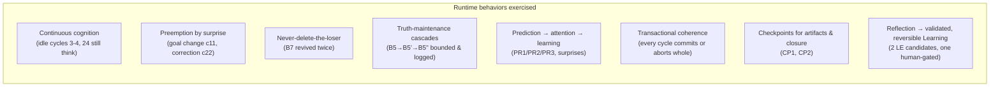

Every mechanism specified in Chapters 1–13 appears in the trace: the cycle (Ch2), activation (Ch3),
scheduling and preemption (Ch4), the four communication modes (Ch5), cooperative deliberation (Ch6),
the arbitration ladder (Ch7), logical time and prediction (Ch8), transactional commits and a rollback-
guarded artifact (Ch9), a live graph with dynamic edges and revived dormant nodes (Ch10), and the
observation/intervention surfaces that a future supervisor would have watched throughout (Ch11). A reader
can follow the mind, cycle by cycle, from three uploads to a durably improved self.

---
---

# APPENDIX A — Runtime Services → Prior-Phase Component Map

| Runtime service (Phase 2) | Phase 0 component | Phase 1 / 1.5 anchor |
|---|---|---|
| Cycle Engine | C0 Cognitive Kernel | Phase 1 Ch8 (Cognitive Lifecycle) |
| Activation Manager | (new; works with C5 Attention) | Phase 1.5 Ch3 (Attention Object) |
| Cognitive Scheduler | C0/C5 | Phase 1.5 Ch2 (Goal scheduling) |
| Global Workspace / Broadcast Fabric | C1 Cognitive Bus | Phase 1.5 Ch5 (broadcast, forthcoming) |
| Transaction Engine | C0 | Phase 1.5 Ch12 (Cognitive Transactions) |
| Cognitive Clock | (new; backed by C2) | Phase 1 Ch5 (Temporal), Phase 1.5 Ch7 (logical order) |
| Graph Manager | C0 | Phase 1.5 Ch11 (Relationship Model) |
| Meta-Cognitive Control Plane | C12 (supervisor attaches here) | Phase 1 Ch10 (Executive/Metacognition) |
| Cognitive Ledger | C2 | Phase 1 Ch7, Phase 1.5 Ch7 |

---

# APPENDIX B — The Runtime Laws (RL1–RL8)

These extend P1–P12 (Phase 0) and OL1–OL9 (Phase 1.5). Every runtime service obeys all eight.

| # | Law | Statement |
|---|---|---|
| **RL1** | **Cognition is continuous** | The loop never halts; silence is low-power maintenance cognition, not "off." |
| **RL2** | **Bounded aliveness** | Only a small, relevant, coherent coalition is alive at any instant; never the whole graph. |
| **RL3** | **Transactional transitions** | Every state transition is a committed cognitive transaction; no partial minds. |
| **RL4** | **Logical time is authoritative** | Order, causality, replay, and checkpoints are defined by the Ledger's logical order; wall-clock is advisory. |
| **RL5** | **Aliveness decays** | Activation fades unless re-earned; nothing is immortally active. |
| **RL6** | **Technology independence** | Every mechanism is defined by its cognitive role, never by any language, framework, datastore, or vendor. |
| **RL7** | **Metacognition can observe and preempt** | The runtime exposes observation and intervention hooks; the supervisor may pause/abort/replay/branch/escalate at defined boundaries. |
| **RL8** | **Replayability** | Given the committed event stream, any past state and any cycle is deterministically reconstructable. |

---

### Runtime closing

Phase 1 gave UnityWorks a mind; Phase 1.5 gave that mind an anatomy of living-capable objects; **Phase 2
gives it a physiology** — the continuous, bounded, transactional, logically-timed process by which a
small coalition of objects is brought to life, walked around the cognitive cycle, committed as a coherent
new self, and returned to rest, forever. The runtime is the permanent execution engine: every future
reasoning system, planning system, faculty, agent, and automation executes through *this* loop, *these*
transactions, *this* clock, and *these* hooks. The vocabulary is fixed for the decade; the intelligence
that runs within it is unbounded.
