# UnityWorks Cognitive Intelligence Platform

## Phase 1 — Cognitive State Architecture

> **The Architectural Constitution of UnityWorks Cognition**

| | |
|---|---|
| **Phase** | 1 — Cognitive State Architecture |
| **Predecessor** | Phase 0 — Cognitive Philosophy (`COGNITIVE_INTELLIGENCE_PLATFORM.md`) |
| **Status** | Architecture Blueprint. No code, no pseudocode, no schemas, no APIs. |
| **Governs** | Every subsequent phase of the CIP. Intended to remain authoritative for a decade. |
| **Reading contract** | A newly hired Principal Engineer, Research Scientist, or CTO should understand the Cognitive State completely from this document alone. |

This document inherits, without restatement, the twelve immutable principles (P1–P12), the six
faculties, the port/adapter boundary, and the Cognitive Ledger established in Phase 0. Where this
document refines a Phase 0 concept, the refinement is explicit and the mapping is given.

**Platform naming.** Phase 1 uses the platform names as given in this phase's mandate — *Workspace,
Document Intelligence, Knowledge, Semantic Intelligence, Conversation, Content Generation* — which are
identical faculties to Phase 0's *Workspace, Document, Knowledge, Semantic, Conversation, Generation*.

---

## Table of Contents

- **Chapter 1** — Cognitive State Philosophy
- **Chapter 2** — The Complete Cognitive State Model
- **Chapter 3** — Goal Architecture *(the largest chapter)*
- **Chapter 4** — Cognitive Identity
- **Chapter 5** — Temporal Model
- **Chapter 6** — Confidence Model
- **Chapter 7** — Cognitive Event Model
- **Chapter 8** — Cognitive Lifecycle
- **Chapter 9** — Platform Integration
- **Appendix A** — The Universal Chapter Template (as applied)
- **Appendix B** — Consistency Map to Phase 0

---
---

# CHAPTER 1 — COGNITIVE STATE PHILOSOPHY

> Chapter 1 is foundational and follows the bespoke structure mandated for it. Chapters 3–9 follow the
> Universal Chapter Template in full.

## 1.1 What is Cognitive State?

**Cognitive State is the living, authoritative, persistent representation of the AI's current mind.**

It is the single object that answers, at any instant: *who am I right now, what do I believe, what am I
paying attention to, what am I trying to achieve, what am I reasoning about, what do I intend to do,
what do I expect to happen, how confident am I, and what am I about to learn?*

Three adjectives are load-bearing and must be held simultaneously:

- **Living** — it is never static. Every cognitive act mutates it. Reading it twice a second apart may
  return different minds. It is the *process*, not a snapshot.
- **Authoritative** — it is the single source of truth about the mind. No cognitive component may hold a
  private, durable belief about the mind's own condition that is not reflected here (Phase 0, P12: *No
  hidden state*). If two components disagree about what the AI is doing, the Cognitive State is right by
  definition and the components are wrong.
- **Persistent** — it survives turns, conversations, sessions, restarts, migrations, and — critically —
  *silence*. A mind with no active conversation still *has* goals, beliefs, and identity. Cognitive
  State exists whether or not anyone is talking to it.

Cognitive State is deliberately **subjective**. It is not a record of the world; it is the mind's
*stance toward* the world. Two CIP instances observing identical facts may hold different Cognitive
States because they have different goals, histories, and confidence. This subjectivity is not a defect
to be normalized away — it is the very thing that makes the object a *mind* rather than a *database*.

## 1.2 Why does intelligence require Cognitive State?

Intelligence that persists over time requires a substrate that persists over time. Remove Cognitive
State and you are left with a stateless function — a superb reflex arc that maps input to output and
then forgets it ever existed. Such a system can be *competent* (Phase 0's faculties are exactly this)
but it cannot be *intelligent over time*, because time-extended intelligence demands seven capacities
that a stateless system structurally cannot provide:

| Capacity | Why it is impossible without Cognitive State |
|---|---|
| **Coherence** | Consistent behavior across acts requires a shared, carried-forward stance. |
| **Goal persistence** | Pursuing an objective across hours or weeks requires the objective to *exist* between acts. |
| **Interruptibility** | Being paused and resumed requires a resumable representation of "where I was." |
| **Self-consistency** | Not contradicting yourself requires a memory of what you committed to. |
| **Accountability** | Explaining *why* you acted requires the beliefs and goals that were live at decision time. |
| **Adaptation** | Improving requires a "self" that survives from the experience to the improvement. |
| **Identity** | Being *someone* — a stable role and persona — requires that someone to be stored. |

Intelligence is not the ability to answer a question. It is the ability to *remain the same mind across
many questions while changing in the ways that constitute learning*. That is a statement about state.

## 1.3 Why is Cognitive State the center of cognition?

Because **every cognitive stage reads it before acting and writes it after acting**, Cognitive State is
not one stage among many — it is the *medium through which all stages communicate*. It is the durable
Global Workspace: the shared blackboard onto which perception posts, from which reasoning reads, onto
which planning commits, and against which reflection compares.

The classical cognitive pipeline is often drawn as a chain:

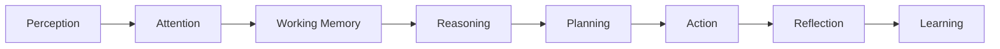

This chain is **misleading as an architecture**, because it implies each stage hands a payload to the
next like a bucket brigade. The truth is that no stage talks *directly* to the next. Each stage talks
to the **Cognitive State**, and the Cognitive State talks to the next stage:

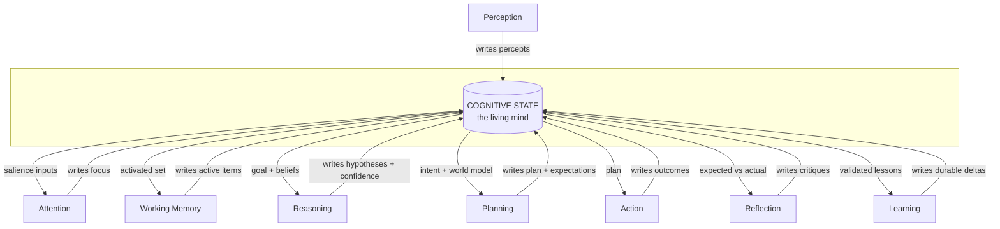

The star topology — every stage a spoke, Cognitive State the hub — is the entire thesis of this
document. It is why the object is central: **centrality is a topological fact, not a claim of
importance.** Everything routes through it.

## 1.4 Why it is NOT Working Memory

Working Memory is the small, volatile, capacity-bounded *active operand set* — the handful of items the
mind is manipulating *right now* (Phase 0, §7, P3). Cognitive State is the full, persistent,
authoritative mind.

The relationship is precise: **Working Memory is a bounded, volatile projection of the Cognitive State
plus transient scratch that has not yet been committed back.** Everything in Working Memory either came
from Cognitive State (via attention + recall) or will be consolidated into it (or discarded) at episode
close.

| | Working Memory | Cognitive State |
|---|---|---|
| Size | A few active items (slots) | The entire mind |
| Volatility | Volatile; decays every step | Persistent; event-sourced |
| Role | The operands of *this* thought | The identity, intent, and beliefs behind *all* thoughts |
| Analogy | CPU registers + L1 cache | The kernel + process address space |
| Lifetime | An episode | Indefinite |

To collapse them would be a category error equivalent to conflating a CPU's registers with a running
operating system.

## 1.5 Why it is NOT Knowledge

The Knowledge Platform stores **objective, external, shared, durable ground truth** — facts that are
true independent of any particular mind ("this repository uses the Repository pattern"). Cognitive State
stores **subjective, internal, per-instance, revisable stance** ("I *believe* this user prefers terse
answers; confidence 0.6; because they corrected me twice").

| | Knowledge Platform | Cognitive State |
|---|---|---|
| Ontology | What *is* true | What *I currently believe, want, intend* |
| Owner | Shared across all minds | One mind instance |
| Mutability | Expensive, deliberate, curated | Cheap, continuous, revisable |
| Analogy | The disk / system of record | The running process's private view |
| Provenance | Authored, versioned facts | Beliefs with confidence and source pointers |

Cognitive State *references* Knowledge (via activation, Phase 0 §9 — "activate, don't duplicate") and,
when a belief proves durable and true, Learning *promotes* it into Knowledge. But the two never merge:
one is the world's ledger of truth; the other is a mind's current opinion of it.

## 1.6 Why it is NOT Conversation State

Conversation State is the transcript and control state of **one I/O channel** — the ordered turns of a
dialogue, streaming buffers, and turn metadata. It is ephemeral, modality-specific, and *raw*.

Cognitive State is **channel-agnostic and interpreted**. It spans every conversation *and* every
non-conversational stimulus (a repository push, a scheduled trigger, an email, a meeting transcript).
It holds not the words that were said but the *meaning the mind extracted* and the *stance it took*. A
conversation can end while the goals it created live on for weeks; a goal can be created by an event
that involved no conversation at all. Conversation State is a socket; Cognitive State is the mind
reading from many sockets at once — and thinking even when all sockets are quiet.

## 1.7 Why it is NOT Workspace State

Workspace State is the state of **the external world the mind acts upon** — files, repositories,
branches, running processes, documents. It is *outside the mind*. Cognitive State is the mind's
*internal model of, and intentions toward*, that world.

The distinction is the oldest one in cognitive science: the **map is not the territory**. Workspace
State is the territory. Cognitive State contains the map — plus the destination (goals), the route
(plan), and the traveler's confidence that the map is accurate. When the map and the territory diverge,
that divergence (prediction error) is itself recorded *in the Cognitive State* and becomes a driver of
attention and learning (Chapter 5).

## 1.8 Why every future cognitive capability depends on it

Because the CIP's design law (Phase 0, P12) is *no hidden state*, every cognitive capability — present
and future — is defined by its relationship to the Cognitive State. There are exactly three such
relationships, and every component is one or more of them:

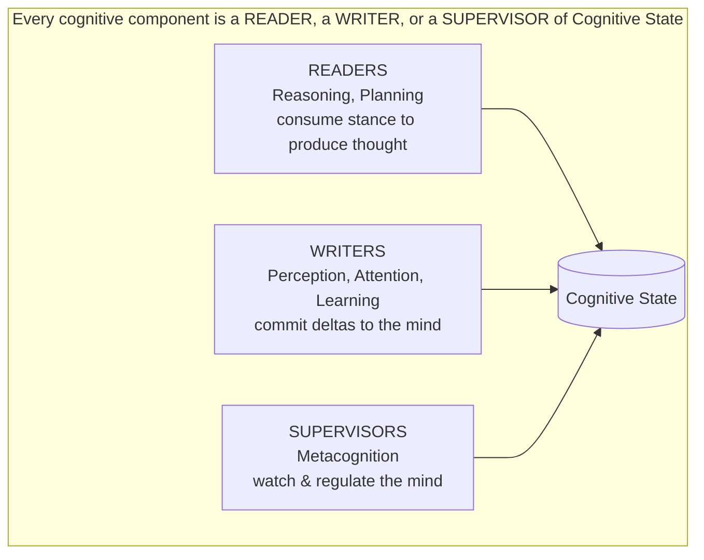

This is what makes the platform *extensible without redesign* (Phase 0, §13.4). Vision AI does not need
a new mind; it needs to become a **writer** of new percept-derived beliefs. Voice AI becomes a new
**reader/writer** channel. Multi-Agent Collaboration becomes *many* Cognitive States coordinating. None
of them alters the object's contract, because the contract is simply: *read, write, or supervise the
mind — through the ledger, never behind it.*

## 1.9 The philosophical pipeline, made precise

Perception → Attention → Working Memory → Cognitive State → Reasoning → Planning → Reflection → Learning
is best understood as a sentence with a subject:

- **Perception** proposes what changed in the world.
- **Attention** decides which of those proposals the mind will admit.
- **Working Memory** holds the admitted proposals in active form.
- **Cognitive State** *is the mind that all of this is happening to* — the persistent subject of every
  verb.
- **Reasoning** transforms the mind's beliefs into hypotheses.
- **Planning** transforms intent into committed action.
- **Reflection** compares what the mind expected against what the world did.
- **Learning** writes the difference back into the mind so the mind is different next time.

Every other noun in that sentence is a *transient*. Cognitive State is the only *persistent subject*.
That is the philosophical claim: cognition is a set of operations performed *upon a persistent mind*,
and the Cognitive State **is** that mind.

## 1.10 Why Cognitive State is the operating-system kernel of cognition

The kernel analogy is not decoration; it is the governing metaphor for the rest of this document.

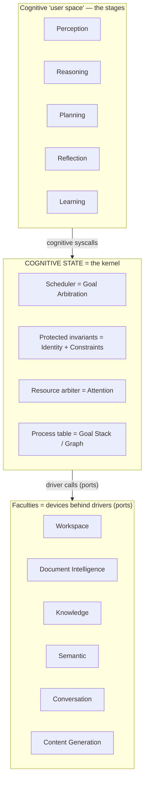

A kernel has five defining properties. Cognitive State has all five:

| Kernel property | Cognitive State analogue |
|---|---|
| **Single source of truth about running processes** | The Goal Stack/Graph is the process table of cognition. |
| **Resource arbitration** | Attention arbitrates the scarce resources of context, compute, and faculty calls. |
| **Scheduling** | Goal prioritization and activation schedule what the mind does next. |
| **Protected invariants** | Identity and Constraints are protected regions no ordinary act may corrupt. |
| **Mediated device access** | Faculties are reached only through ports (drivers); the mind never touches hardware directly. |

Calling Cognitive State the *kernel* fixes its status for a decade: it is the privileged, protected,
central authority through which all cognition is scheduled and all faculties are reached. Everything
else in the CIP is either a syscall into it or a driver beneath it.

---
---

# CHAPTER 2 — THE COMPLETE COGNITIVE STATE MODEL

Chapter 2 designs every property of the Cognitive State. It follows a bespoke structure (the model
itself), while Chapters 3–9 apply the Universal Chapter Template to the major sub-systems introduced
here.

## 2.1 Structuring principle — Regions, not a flat record

A flat list of fields would be unusable and would violate P6 (interfaces over implementations) by
inviting every component to touch every field. Instead the Cognitive State is partitioned into **ten
Regions**, each with an owner, an access discipline, and a distinct rate of change. Regions are the
*segments of the cognitive address space*.

The ten Regions refine Phase 0's six layers. The mapping is given in Appendix B.

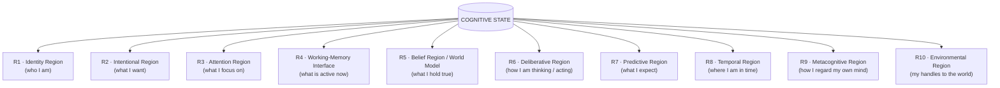

Every field table below uses the same seven columns, satisfying the mandate to explain, for each field:
*what it is, why it exists / why it belongs here, who owns (writes) it, when it changes, when it
expires, and how it affects cognition.*

## R1 — Identity Region *(expanded in Chapter 4)*

*Rate of change: very slow. Access: read-widely, write-rarely, protected.*

| Property | What it is | Why here | Writer | Changes when | Expiry | Effect on cognition |
|---|---|---|---|---|---|---|
| **Identity** | The stable self-model: the enduring "I" of this CIP instance | Reasoning, planning, and tone all presuppose a stable subject | Learning (slow), Identity governor | Rarely; through validated evolution | Never (versioned) | Anchors all behavior; the invariant against drift |
| **Role** | The functional office currently occupied (e.g., "engineering reviewer") | Roles bound what goals are legitimate and what actions are permitted | Identity governor on context switch | On role switch | On role exit | Gates goal admission and action permissions |
| **Persona** | The expressive style and voice | Separates *how* the mind expresses from *who* it is | Identity governor / preference learning | On persona switch or learned refinement | With context | Shapes generation tone; never shapes truth |
| **Capability Awareness** | The mind's model of what it can and cannot do | Prevents overreach; enables honest escalation (P10) | Metacognition, Learning | On capability change or calibration | Versioned | Bounds planning to the achievable |

## R2 — Intentional Region *(expanded in Chapter 3)*

*Rate of change: medium. Access: the scheduler of cognition.*

| Property | What it is | Why here | Writer | Changes when | Expiry | Effect on cognition |
|---|---|---|---|---|---|---|
| **Strategic Goals** | Long-horizon objectives (weeks–quarters) | Give cognition direction beyond the moment | Goal Manager | On mission change | On completion/abandonment | Bias all lower goals and attention |
| **Tactical Goals** | Mid-horizon objectives serving a strategy | Bridge strategy to action | Goal Manager | On decomposition | On parent closure | Structure episodes |
| **Operational Goals** | Immediate objectives of the current episode | The unit the cycle actually pursues | Goal Manager | Per episode | On episode close | Drive the current cycle |
| **Goal Stack** | The LIFO of currently-active pursuits | Enables interruption and resumption | Goal Manager | On push/pop | On pop | Determines "what am I doing right now" |
| **Goal Graph** | The full dependency DAG among goals | Captures prerequisite/support/conflict relations | Goal Manager | On dependency change | On goal deletion | Enables scheduling & conflict detection |
| **Goal Priority** | The ordering signal over active goals | Scarce attention must be allocated | Goal Manager + Metacognition | On re-prioritization | With goal | Selects the focus |
| **Goal Ownership** | Which agent/user/role owns each goal | Multi-agent & accountability | Goal Manager | On delegation | With goal | Governs arbitration rights |
| **Current Intent** | The single committed "what I am about to do and why" | The bridge from goals to a plan | Reasoning → Planning | Each decision | On action commit | The seed of the plan |

## R3 — Attention Region

*Rate of change: fast. Access: written by Attention Controller, read by everything.*

| Property | What it is | Why here | Writer | Changes when | Expiry | Effect on cognition |
|---|---|---|---|---|---|---|
| **Attention Focus** | The current winning coalition of what the mind attends to | The scarce spotlight must be represented to be honored | Attention Controller | Each cycle / on preemption | Each cycle | Gates entry to Working Memory |
| **Salience Map** | The scored field of competing candidates | Focus is the *argmax*; the map is the field it comes from | Attention Controller | Each appraisal | Each cycle | Explains why focus is where it is |
| **Inhibition Set** | What is explicitly ignored, and why | Robustness against distraction and adversarial noise (Phase 0, §8.4) | Attention Controller | Each cycle | Each cycle | Prevents starvation of the goal by noise |
| **Attention History** | The trajectory of focus over time | Reflection needs to see what the mind looked at | Attention Controller (→ Ledger) | Each cycle | Consolidated/decayed | Enables "why did I miss X" analysis |

## R4 — Working-Memory Interface Region

*Rate of change: fast. Access: the boundary to the volatile blackboard (Phase 0, §7).*

| Property | What it is | Why here | Writer | Changes when | Expiry | Effect on cognition |
|---|---|---|---|---|---|---|
| **Working Memory References** | Handles to the currently active items on the blackboard | The mind must know its own active set without copying it | Working Memory / Kernel | Each cycle | On episode close | Defines the operands of current thought |
| **Activated Knowledge** | Pointers + activation scores for recalled long-term memory | Activation, not duplication (Phase 0, §9, P1) | Recall Orchestrator | On recall | On decay/eviction | Supplies evidence to reasoning |

## R5 — Belief Region (World Model)

*Rate of change: medium. Access: written by Comprehension & Observation; read by reasoning/planning.*

| Property | What it is | Why here | Writer | Changes when | Expiry | Effect on cognition |
|---|---|---|---|---|---|---|
| **Active Beliefs** | Confidence-weighted, provenance-tagged propositions the mind currently holds | The mind acts on beliefs, not on raw facts | Comprehension | On evidence | On revision/decay | The premises of all reasoning |
| **Assumptions** | Beliefs held *provisionally* to enable progress under uncertainty | Cognition must proceed without complete information | Reasoning | On assumption / on discharge | When validated or refuted | Marked so reflection can audit them |
| **Constraints** | Hard boundaries the mind must not violate (safety, policy, scope) | Protected invariants (kernel property) | Identity/Policy governor | On policy load | Rarely (protected) | Veto power over planning |
| **User Understanding** | The mind's model of the specific user | Personalization and relationship (P10) | Comprehension, Learning | On interaction | Slow decay | Shapes tone, defaults, escalation |
| **Relationship Context** | The state of the working relationship (trust, history, expectations) | Long-lived collaboration needs a relational memory | Learning | Over interactions | Slow | Calibrates autonomy and confirmation |

## R6 — Deliberative Region

*Rate of change: fast within an episode. Access: written by reasoning/planning.*

| Property | What it is | Why here | Writer | Changes when | Expiry | Effect on cognition |
|---|---|---|---|---|---|---|
| **Current Strategy** | The chosen approach to the active goal | Strategy is distinct from the plan that realizes it | Reasoning Supervisor | On strategy selection | On episode/goal close | Selects reasoning mode & plan shape |
| **Current Plan** | The ordered, guarded action sequence with expected outcomes | Intent must become executable structure | Executive Planner | On (re)planning | On completion | Directs the Act phase |
| **Current Tasks** | The decomposed, trackable units of the plan | Progress and recovery need granular tracking | Planner | On task progress | On completion | Enable resumption & partial credit |
| **Reasoning Mode** | System-1 vs System-2, chain vs tree vs debate | Deliberation is proportional (P5) | Reasoning Supervisor + Metacognition | On stakes/uncertainty change | Per step | Sets cognitive effort & cost |
| **Reasoning Confidence** | Confidence in the current line of reasoning | Confidence is first-class (Chapter 6) | Reasoning Supervisor | Each step | Per step | Triggers more deliberation or escalation |

## R7 — Predictive Region *(expanded in Chapter 5)*

| Property | What it is | Why here | Writer | Changes when | Expiry | Effect on cognition |
|---|---|---|---|---|---|---|
| **Prediction State** | The mind's current forecasts about world and self | Attention & learning are driven by prediction error | Reasoning / World Model | On new prediction | On confirmation/refutation | Surprise = prediction error → salience |
| **Prediction Horizon** | How far ahead each prediction reaches | Different horizons have different confidence & use | Reasoning | With prediction | With prediction | Bounds planning depth |
| **Expectation** | The specific outcome expected of a committed action | Enables Observe to compute error (Phase 0, §2) | Planner | On action commit | On observation | The measuring stick for reflection |

## R8 — Temporal Region *(expanded in Chapter 5)*

| Property | What it is | Why here | Writer | Changes when | Expiry | Effect on cognition |
|---|---|---|---|---|---|---|
| **Past Context** | The mind's interpreted history relevant to now | Continuity and learning need an accessible past | Comprehension (→ Ledger) | On episode close | Consolidated | Priors for belief and prediction |
| **Present Context** | The interpreted here-and-now situation | Cognition acts in a present that must be represented | Comprehension | Each cycle | Each cycle | The situational frame |
| **Future Context** | Anticipated futures and their branches | Planning is reasoning about futures | Reasoning/Planning | On projection | On arrival | Shapes plan and risk |

## R9 — Metacognitive Region *(confidence expanded in Chapter 6)*

| Property | What it is | Why here | Writer | Changes when | Expiry | Effect on cognition |
|---|---|---|---|---|---|---|
| **Reflection Queue** | Episodes/decisions awaiting evaluation | Reflection is asynchronous; it needs a durable inbox | Kernel on episode close | On enqueue/dequeue | On processing | Feeds learning |
| **Learning Queue** | Validated candidate improvements awaiting commit | Learning must not corrupt (P9): staged, not immediate | Reflection | On enqueue/dequeue | On commit | Deferred self-improvement |
| **Executive Decisions** | The metacognitive control record (throttle, switch, escalate, abort) | The supervisor's actions must themselves be state | Metacognition | On control action | Logged | Regulates the whole cycle |
| **Risk Awareness** | The mind's current model of what could go wrong | Proportional deliberation and human-in-loop need risk | Metacognition | On appraisal | Per episode | Raises confirmation & caution |
| **Uncertainty** | The distribution of what the mind does *not* know | Distinct from confidence; drives information-seeking | Metacognition | On appraisal | Per episode | Triggers recall or clarification |

## R10 — Environmental Region

*Rate of change: as the world changes. Access: handles only — never copies (P1).*

| Property | What it is | Why here | Writer | Changes when | Expiry | Effect on cognition |
|---|---|---|---|---|---|---|
| **Workspace Handle** | A reference to the current Workspace Platform context (repo, branch, files in scope) | The mind must know *where* it is acting without owning the world | Perception / Kernel | On workspace switch | On exit | Scopes actions & recall |
| **Conversation Handle** | A reference to the active Conversation Platform channel(s) | The mind must know its open I/O channels | Perception | On channel open/close | On close | Routes expression |

## 2.2 Why each property lives here and not elsewhere — the placement law

A recurring design question is "why does field X belong in Cognitive State instead of in a faculty?"
The placement law resolves every case:

> **A property belongs in Cognitive State if and only if it is (a) about the *mind's stance* rather than
> the *world's facts*, and (b) must persist across cognitive acts.** Facts about the world live in
> Knowledge; raw channel data lives in Conversation/Workspace; volatile operands live in Working Memory;
> everything that is *the mind itself, carried through time*, lives here.

Worked applications of the law:

- *Activated Knowledge* lives here as **pointers**, not content — the content is a world-fact (Knowledge)
  but *the fact that the mind has it active right now* is a stance (Cognitive State).
- *User Understanding* lives here, not in Knowledge, because it is a **belief about** the user (revisable,
  confidence-weighted), whereas the user's stored profile is a fact (Knowledge).
- *Current Plan* lives here, not in the Workspace, because the plan is the **mind's intention**; the files
  the plan will touch are the Workspace's territory.

---
---

# CHAPTER 3 — GOAL ARCHITECTURE

> *The largest chapter. It fully applies the Universal Chapter Template (§1–§12) and then treats every
> mandated goal topic in depth.*

## 3.1 Purpose

Goals exist because **cognition is not reactive; it is directed.** A system without goals can only
respond to the last stimulus. A system *with* goals can pursue an objective across interruptions,
subordinate the urgent to the important, refuse distractions, and know when it is *done*. The Goal
Architecture is the component of the Cognitive State that makes UnityWorks cognition *purposive*.

**The cognitive problem it solves:** the arbitration of finite attention across competing, evolving,
interdependent objectives over time. Every scarce cognitive resource — the context window, compute, the
number of faculty calls, the human's patience — must be allocated to *something*, and that something is
chosen by the goal system.

**Why no other component can own this:** Attention (R3) allocates the spotlight *within a single
moment*, but it needs a criterion for what deserves the spotlight — and that criterion is *goal
relevance*. Reasoning produces thoughts but does not decide *which* problem to think about. Planning
sequences actions but only *after* a goal has selected the objective. The goal system is the **only**
component whose job is to hold, order, and arbitrate *what the mind is for over time*. Remove it and the
mind reverts to a chatbot (Phase 0, anti-goals).

## 3.2 Cognitive Philosophy

In biological cognition, goal-directed behavior is governed by the **prefrontal cortex**, which
maintains goal representations against distraction, sequences sub-goals, and inhibits prepotent but
off-goal responses. The design draws on four bodies of theory:

- **Hierarchical Task Networks & Miller-Galanter-Pribram's TOTE units** — behavior decomposes into
  nested goal/sub-goal structures with test-operate-test-exit loops. Our Strategic→Tactical→Operational→
  Micro hierarchy is a direct descendant.
- **Classical AI goal stacks (STRIPS/SOAR)** — the *goal stack* as the mechanism of interruption and
  return; SOAR's *impasse-driven subgoaling* inspires our automatic goal splitting.
- **Maslow-style and Ach's "determining tendency"** — goals exert a *sustained biasing force* on
  perception and thought, not a one-shot trigger. Our priority-weighted biasing of attention encodes
  this.
- **Cybernetic control (Powers' Perceptual Control Theory)** — a goal is a *reference value* the system
  acts to maintain; action is error-reduction between reference and perception. Our success-condition
  and prediction-error machinery encodes this.

Why appropriate for artificial cognition: an LLM-based faculty is, natively, *maximally reactive* — it
completes the current context. Grafting an explicit, persistent goal hierarchy on top is precisely what
converts a reactive generator into a directed agent, in the same way the prefrontal cortex directs the
reactive machinery beneath it.

## 3.3 Architectural Responsibilities

**The Goal Architecture owns:**

- The representation of all goals (strategic, tactical, operational, micro) and their attributes.
- The Goal Stack, Goal Graph, and Goal Tree structures and their integrity.
- Goal lifecycle transitions (creation, activation, suspension, resumption, splitting, merging,
  completion, failure, expiration, archival).
- Goal prioritization, conflict detection, arbitration, and scheduling.
- Goal ownership and delegation semantics.
- Goal success metrics and the evaluation of completion.
- The goal audit trail and versioning (as entries in the Cognitive Ledger).

**The Goal Architecture must NEVER own:**

- **The reasoning that decides *how* to achieve a goal** — that is the Reasoning Supervisor's. The goal
  system holds the *what* and *why*, never the *how*.
- **The plan** — plans live in R6 (Deliberative); the goal system references a plan but does not author
  it.
- **World facts** — a goal may reference Knowledge but never stores it.
- **Action execution** — that is the Planner + Effect Boundary + Workspace.
- **Attention scoring math** — the goal system *supplies goal-relevance* as an input to Attention; it
  does not compute the salience field.

**Boundary statement:** *the goal system is the mind's answer to "what am I for, and in what order" — and
nothing more.*

## 3.4 Internal Model

### 3.4.1 What is a Goal? — and its neighbors

Precise definitions, because these six words are routinely and destructively conflated:

| Concept | Definition | Time character | Lives in |
|---|---|---|---|
| **Mission** | The enduring reason the mind exists in this role | Indefinite | R1 Identity / top of R2 |
| **Objective** | A measurable end-state that serves the mission | Long | R2 Strategic |
| **Goal** | A desired state the mind commits to bring about, with success conditions | Any horizon | R2 |
| **Intent** | The *currently committed* "what I am about to do and why" | This decision | R2 Current Intent |
| **Plan** | The ordered, guarded actions expected to achieve a goal | This episode | R6 |
| **Task** | A single trackable unit of a plan | Minutes | R6 |

The load-bearing distinctions: a **goal is a *state to reach*; a task is an *act to perform*.** A **plan
is *how*; a goal is *what*.** An **intent is a goal that has been selected *right now* for action.** A
**mission is the goal that never completes.**

### 3.4.2 Why goals are the driving force of cognition

Because every other cognitive act takes a goal as an implicit argument. Attention scores *relative to*
goals. Recall queries are formulated *in service of* a goal. Reasoning is deliberation *about* a goal.
Planning is realization *of* a goal. Reflection evaluates *against* a goal's success conditions.
Learning updates the strategies that *achieve* goals. The goal is the free variable in the equation of
cognition; fix it and the rest of the mind computes.

### 3.4.3 Goal attributes (the anatomy of a single goal)

| Attribute | Meaning | Why it exists |
|---|---|---|
| **Descriptor** | The desired end-state in interpretable terms | So the goal can be reasoned about and explained |
| **Level** | Strategic / Tactical / Operational / Micro | Determines horizon, owner, and arbitration weight |
| **Success conditions** | The testable predicate for "achieved" | Without it, a goal can never *complete* |
| **Failure conditions** | The predicate for "unachievable / abandon" | Prevents infinite pursuit (P8) |
| **Priority** | The current allocation weight | Drives scheduling & attention |
| **Confidence** | Belief that the goal is achievable (Chapter 6) | Governs whether to pursue, hedge, or escalate |
| **Owner** | The agent/user/role accountable | Multi-agent arbitration & accountability |
| **Dependencies** | Prerequisite / supporting / conflicting goals | Structures the graph & scheduling |
| **Status** | Node in the goal state machine (§3.5) | The lifecycle position |
| **Provenance** | Who/what created the goal and why | Audit & reflection |
| **Deadline / horizon** | Temporal bound | Urgency for attention |
| **Success metric** | Quantitative measure of degree of achievement | Partial credit & learning signal |

### 3.4.4 Goal Hierarchy

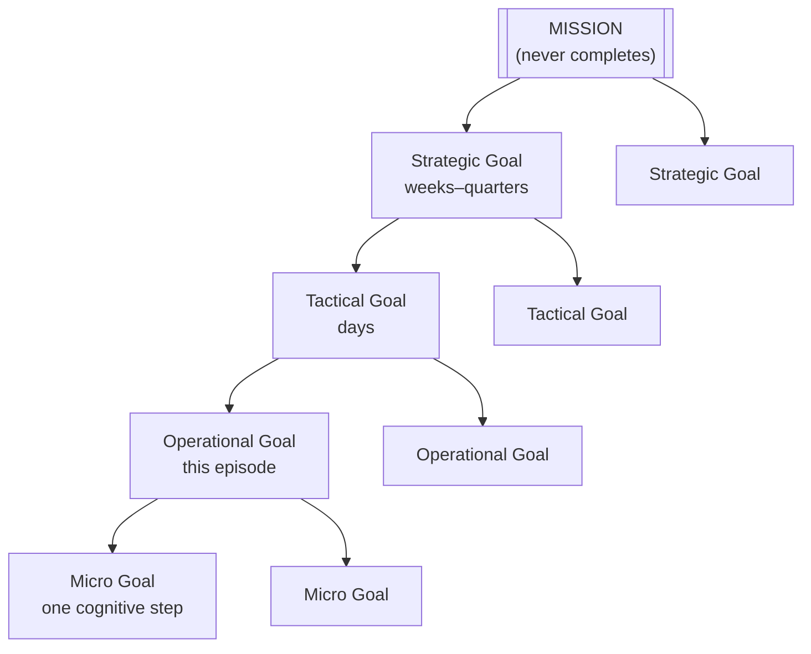

- **Strategic Goals** set direction and constrain everything beneath. They change rarely and are owned
  high (user/org).
- **Tactical Goals** decompose a strategy into achievable mid-horizon objectives; they structure
  episodes.
- **Operational Goals** are what a single cognitive episode actually pursues.
- **Micro Goals** are the sub-objectives of a single cognitive step (e.g., "recall the failing test").
  They are ephemeral and mostly implicit.

### 3.4.5 Stack vs Graph vs Tree — three views of one structure

These are **not three structures**; they are three *views* of the single goal set, each optimized for a
different operation:

| View | Optimized for | Shape |
|---|---|---|
| **Goal Tree** | Decomposition & explanation ("why am I doing this?") | Strict parent→child hierarchy |
| **Goal Graph** | Dependency reasoning & conflict detection | DAG with prerequisite/support/conflict edges |
| **Goal Stack** | Interruption & resumption ("what am I doing *right now*?") | LIFO of active pursuits |

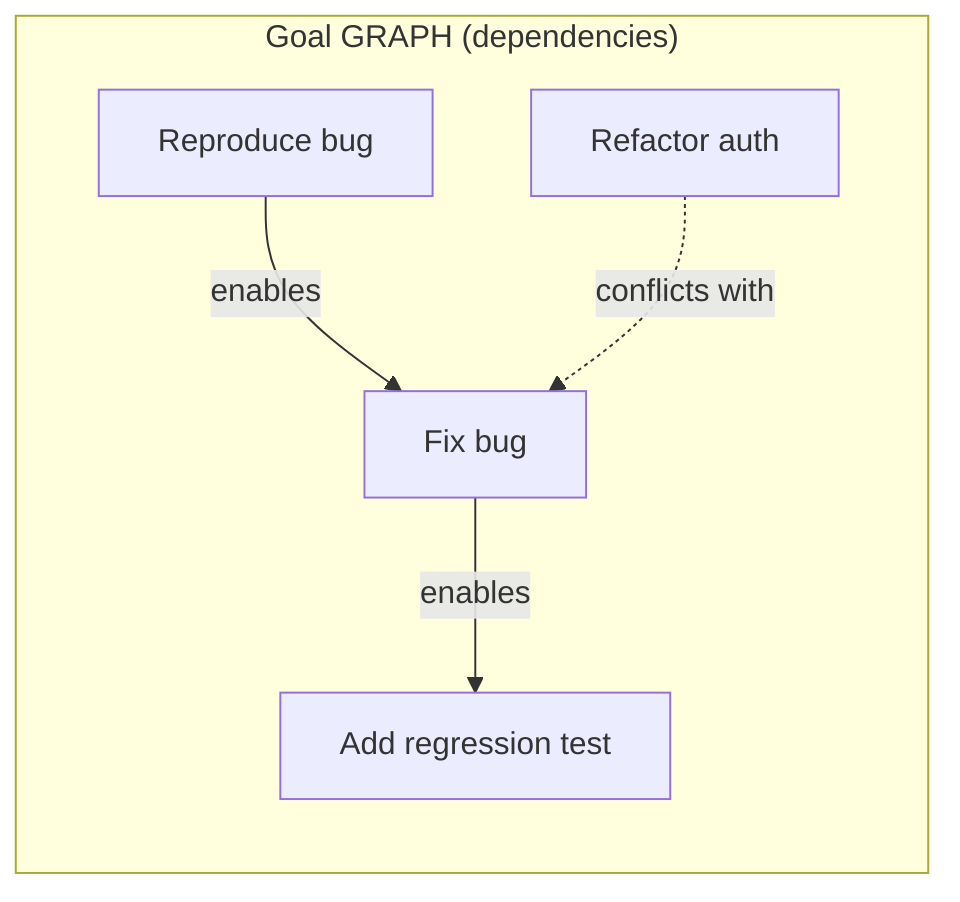

The Stack is a *traversal* of the Tree; the Tree is a *spanning subset* of the Graph. Holding all three
as views (not copies) keeps the model consistent and satisfies P12 (no duplicated state).

### 3.4.6 Goal Ownership

Every goal has exactly one **accountable owner** and zero-or-more **collaborators**. Ownership
determines *arbitration rights* (who may re-prioritize or abandon) and *accountability* (to whom
outcomes are reported). Ownership is the hook for Multi-Agent Collaboration (§3.9): a goal owned by
agent A may be *delegated* to agent B, transferring execution while retaining accountability.

## 3.5 Lifecycle

### 3.5.1 The Goal State Machine

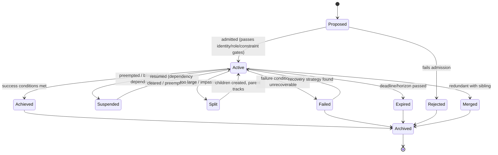

### 3.5.2 Transition-by-transition

- **Creation → Proposed.** A goal is proposed by perception (a user request), by reasoning (a sub-goal),
  by metacognition (a corrective goal), or by a scheduled trigger. It is *not yet* active.
- **Proposed → Active (Admission).** The goal passes three gates: **Identity/Role** (is this goal
  legitimate for who I am?), **Constraint** (does it violate a protected invariant?), and **Capacity**
  (is there room on the stack?). Admission is where the mind exercises *volition*.
- **Active → Suspended.** Either *preemption* (a higher-priority goal seizes the stack) or *blocking* (a
  dependency is unmet). Suspension **checkpoints** the goal's context so resumption is faithful.
- **Suspended → Active (Resumption).** The blocker clears or the preemptor completes; the checkpoint is
  restored. Resumption must reconstruct enough Working Memory to continue coherently — this is why the
  goal carries a resumption context pointer.
- **Active → Split.** A goal too large to pursue directly, or one that hits an *impasse* (no viable next
  step), is decomposed into children. The parent transitions to a *tracking* posture.
- **Active → Merged.** Two goals discovered to be the same desired state are merged; provenance of both
  is preserved.
- **Active → Achieved.** Success conditions evaluate true. The success *metric* records the *degree*.
- **Active → Failed.** Failure conditions evaluate true, or resources are exhausted. Failure is a
  *first-class outcome*, not an error — it feeds reflection and learning.
- **Failed → Active (Recovery).** Reflection may discover a recovery strategy, reactivating the goal with
  a new approach.
- **Active → Expired.** The deadline or horizon passes; the goal lapses regardless of progress.
- **→ Archived → Deleted.** Terminal states are archived (retained for analytics/audit), then deleted per
  retention policy. Archival is never immediate deletion — the audit trail (P4) requires retention.

### 3.5.3 Splitting and Merging — sequence view

```mermaid
sequenceDiagram
    participant R as Reasoning
    participant G as Goal Manager
    participant CS as Cognitive State
    R->>G: impasse on Operational Goal O1 (no next step)
    G->>G: decompose O1 into {O1a, O1b}
    G->>CS: write children, set O1 → Split(tracking)
    Note over G,CS: dependency edges O1a→O1b added to Goal Graph
    R->>G: O1a achieved
    G->>CS: O1a → Achieved; re-evaluate O1 success
    R->>G: O1b achieved
    G->>CS: O1b → Achieved; O1 success conditions now true
    G->>CS: O1 → Achieved
```

## 3.6 Interactions

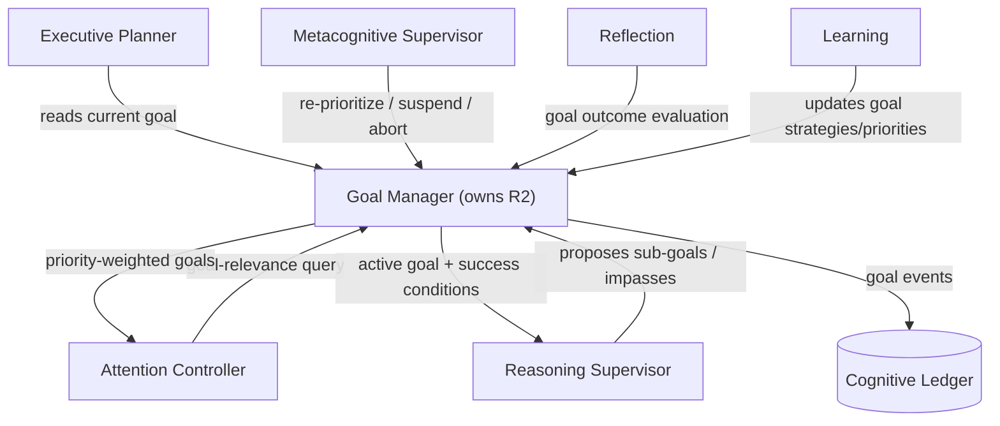

- **With Attention (R3):** bidirectional. Goals supply relevance weights; attention reports what actually
  won focus (which may reveal neglected goals).
- **With Reasoning (R6):** goals define the problem; reasoning reports impasses that trigger splitting.
- **With Planning (R6):** the current goal is the planner's objective; the planner never invents goals.
- **With Metacognition (R9):** the supervisor may preempt, suspend, or abort goals (P8).
- **With Reflection & Learning (R9):** outcomes feed evaluation; learning tunes priorities and strategies.
- **With existing platforms:** goals *reference* Workspace scope and Knowledge facts but **own neither**;
  goal descriptors may be *generated* via the Content Generation faculty but are *stored* in Cognitive
  State.

## 3.7 Decision Logic

### 3.7.1 Prioritization

Priority is a *derived, recomputed* quantity, not a static label. It composes the salience factors of
Phase 0 §8.2 as they apply to goals:

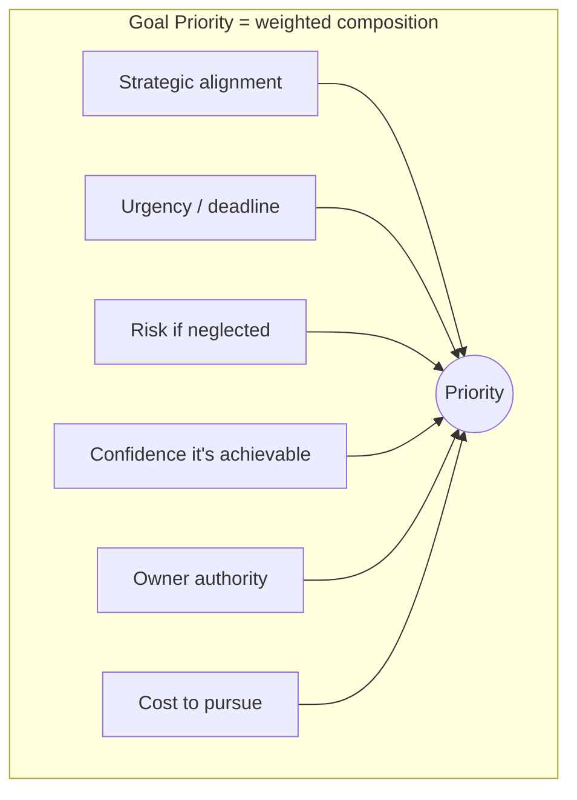

Priority is recomputed whenever any input changes (new deadline, dropped confidence, owner override). It
is deliberately *not* frozen, so the mind can re-prioritize as the situation evolves — but every
recomputation is logged (auditability).

### 3.7.2 Conflict Resolution & Arbitration — decision tree

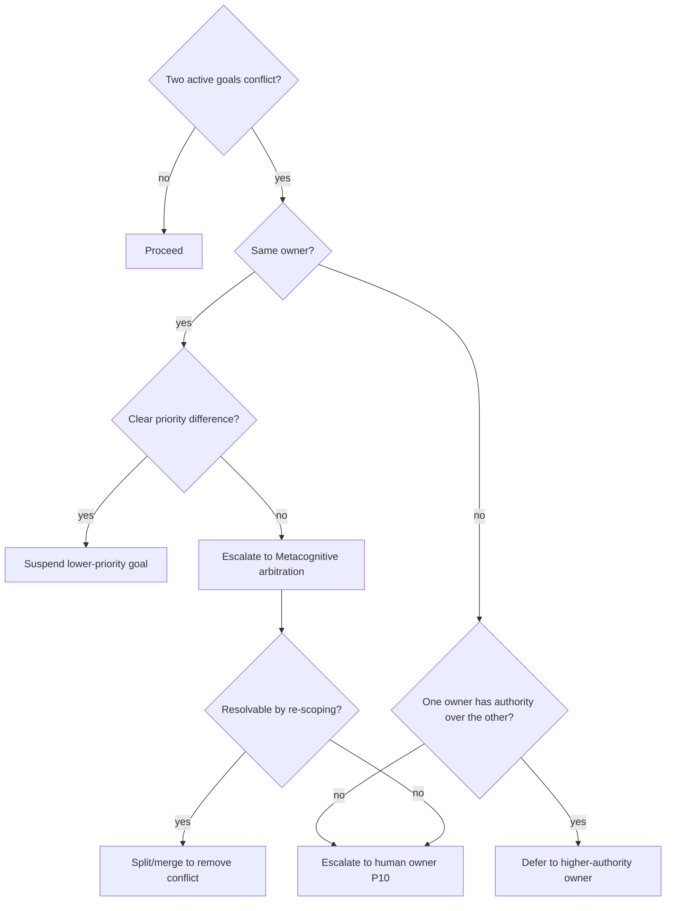

Arbitration order is fixed: **priority → owner authority → metacognitive re-scoping → human escalation.**
Human escalation is never skipped when authority is genuinely contested (P10).

### 3.7.3 Confidence, Evaluation, Ranking

- **Goal Confidence** (Chapter 6) is the belief the goal is *achievable given current capability*. Low
  confidence does not abandon a goal; it changes *how* it is pursued (hedge, seek information, escalate).
- **Evaluation** against success *conditions* is boolean (achieved / not); evaluation against the success
  *metric* is graded (how well). Both are recorded — the boolean drives lifecycle, the graded drives
  learning.
- **Ranking** for scheduling is the sort by recomputed priority, filtered by dependency-readiness (a goal
  blocked on an unmet prerequisite is not schedulable regardless of priority).

### 3.7.4 Scheduling

The schedulable set is *active, dependency-ready, non-conflicting* goals; the scheduler selects the
highest-priority member for the current cycle. This is the *scheduler property* of the kernel (Chapter
1.10). Suspended and blocked goals remain in the state but are invisible to the current selection.

## 3.8 Edge Cases

| Edge case | Handling |
|---|---|
| **Goal thrashing** (rapid preempt/resume) | Metacognition detects oscillation via Attention History and imposes a *minimum dwell time* before re-preemption. |
| **Orphaned goal** (owner disappears) | Ownership falls back to the role, then to human escalation; the goal is suspended, never silently dropped. |
| **Unsatisfiable success conditions** | Detected when the achievable-set is provably empty; goal → Failed with a diagnostic, feeding learning. |
| **Circular dependency** | Graph integrity check rejects the edge at creation; if introduced by splitting, the cycle is broken by metacognitive re-scoping. |
| **Conflicting user directives** | Both become Proposed goals; the conflict-resolution tree routes to human clarification rather than silently picking one. |
| **Deadline passes mid-pursuit** | Goal → Expired; if partial success metric is high, a *follow-up* goal may be proposed. |
| **Ambiguous request** (unclear goal) | A *clarification* micro-goal is created; the parent stays Proposed until disambiguated. |
| **Runaway decomposition** (infinite splitting) | Depth and breadth budgets (P8) cap the tree; exceeding them escalates. |

Graceful degradation principle: **a goal system under stress *narrows* — it suspends low-priority goals,
increases confirmation, and escalates — but it never loses the goal set.** Losing goals is the one
failure mode the architecture forbids.

## 3.9 Future Evolution

Over five years, the goal system is the reuse point for every future capability, *without changing its
contract*:

- **Vision AI** proposes goals from perceived images ("this diagram implies a missing component"); it is
  a new *goal proposer*, nothing more.
- **Repository AI** owns long-horizon strategic goals ("keep the dependency graph healthy") that persist
  across sessions — exercising the *strategic goal* and *scheduling* machinery.
- **Meeting AI** converts decisions into goals with owners and deadlines — exercising *ownership* and
  *delegation*.
- **Automation & Email Intelligence** are *scheduled goal triggers* and *guarded goal executors* —
  exercising the *activation* and *effect-boundary* paths.
- **Voice Intelligence** is a new proposer/expresser channel over the identical goal set.
- **Multi-Agent Systems** are the deepest reuse: *ownership, delegation, and arbitration* generalize
  directly to many minds sharing a Goal Graph, with cross-agent conflict resolved by the very tree in
  §3.7.2. This is why ownership was made first-class from day one.

## 3.10 Engineering Trade-offs

| Decision | Chosen | Rejected alternative | Why |
|---|---|---|---|
| Goal representation | Explicit, persistent, hierarchical goal objects | **A) Implicit goals inferred per-turn from context** | Implicit goals cannot persist across silence, cannot be interrupted/resumed, and cannot be audited. They regress to a chatbot. |
| Structure | Stack + Graph + Tree *views* over one set | **B) Separate stack and graph data** | Duplicated structures drift and violate P12; views stay consistent. |
| Priority | Recomputed, logged | **C) Static assigned priority** | Static priority cannot track evolving urgency/confidence; it makes the mind rigid. |
| Failure | First-class outcome that feeds learning | **D) Failure as an exception/error** | Treating failure as an error discards the richest learning signal a mind has. |
| Arbitration | Fixed order ending in human escalation | **E) Pure utility maximization** | Unbounded utility maximization has no accountability and no human control (violates P10). |
| Decomposition | Budgeted, impasse-driven | **F) Eager full decomposition up front** | Eager decomposition wastes cognition on branches never taken and cannot adapt to discoveries. |

## 3.11 Practical Example — end to end

**Scenario:** A user says, "Auth intermittently fails in production; fix it before Friday."

```mermaid
sequenceDiagram
    participant U as User (Conversation)
    participant P as Perception
    participant G as Goal Manager
    participant CS as Cognitive State
    participant R as Reasoning
    participant PL as Planner
    participant M as Metacognition
    U->>P: "Auth intermittently fails; fix before Friday"
    P->>G: propose Strategic-ish goal
    G->>CS: Proposed → (gates) → Active<br/>Descriptor: "auth reliable in prod"<br/>Deadline: Fri, Confidence: 0.4 (intermittent = hard)
    R->>G: impasse — cannot fix without reproduction
    G->>CS: Split → {O1 reproduce, O2 root-cause, O3 fix, O4 regression test}<br/>edges O1→O2→O3→O4
    G->>CS: schedule O1 (only dependency-ready goal)
    Note over R,PL: pursue O1... reproduction succeeds (metric 1.0)
    G->>CS: O1 Achieved; O2 now ready
    Note over R: root cause = Redis eviction under load
    M->>G: risk high (prod change) → raise confirmation, keep human in loop
    G->>CS: O3 plan requires human approval at Effect Boundary
    Note over U: human approves fix
    G->>CS: O3 Achieved; O4 Achieved; parent success conditions true
    G->>CS: Strategic goal Achieved (metric 0.95), deadline met
    G->>CS: enqueue Reflection: "which decisions worked?"
```

- **Initial state:** one Proposed goal, low confidence, hard deadline.
- **Decision:** split on impasse; schedule the only ready child; keep human in the loop on the risky
  step.
- **Updates:** each child transitions Achieved with a metric; priorities recompute as the deadline nears;
  Reflection is enqueued.
- **Final state:** strategic goal Achieved with a 0.95 metric; a durable lesson ("Redis eviction pattern
  causes intermittent auth failure") queued for promotion to Knowledge; goal archived with full audit
  trail.

## 3.12 Production Considerations

- **Persistence:** goals are event-sourced into the Cognitive Ledger; the current goal set is a
  materialized projection rebuildable by replay (Chapter 8 pattern).
- **Versioning:** every goal mutation is a versioned ledger event; the *Goal History* is the replay of
  those events; *Goal Versioning* enables "show me the goal as it was Tuesday."
- **Observability:** live dashboards over the Goal Graph (active/suspended/blocked), priority churn,
  split/merge rates, and completion metrics.
- **Auditability:** the *Goal Audit Trail* answers "why did the mind pursue this, in this order, and who
  authorized it" — a compliance-grade record.
- **Analytics:** *Goal Analytics* aggregates success metrics by strategy to feed procedural learning
  (which approaches achieve which goal types).
- **Performance:** priority recomputation is bounded to the active set; the schedulable set is small by
  construction (P3).
- **Scalability:** the model scales to many concurrent goals because only the *ready, non-conflicting*
  subset is ever active; the rest is suspended state, cheap to hold.
- **Testing:** the state machine (§3.5.1) is the test oracle — every transition and every edge case
  (§3.8) is a test; conflict-resolution is tested against the decision tree (§3.7.2).
- **Failure recovery:** on restart, goals are rebuilt by ledger replay; suspended goals restore from
  their checkpoints; in-flight Active goals are re-validated against constraints before resumption.

---
---

# CHAPTER 4 — COGNITIVE IDENTITY

## 4.1 Purpose

Cognitive Identity exists so the mind is **someone** rather than **something** — a stable, coherent
subject that persists across every context, constrains what goals are legitimate, shapes how the mind
expresses itself, and provides the fixed point against which drift is detected. Without identity, the
mind is a different entity every session; behavior is inconsistent, trust is impossible, and there is
nothing for learning to *accrue to*.

**Why no other component can own this:** goals change; beliefs change; attention changes every cycle.
Identity is the one region that is *supposed* to be nearly constant. Placing it anywhere volatile would
make the mind's core as unstable as its moods. It must be a protected region of the Cognitive State.

## 4.2 Cognitive Philosophy

Human identity is layered: a stable **self-concept** (who I am), overlaid by **social roles** (the
office I occupy right now — parent, engineer, reviewer), expressed through **persona** (register and
manner). Cognitive science offers *self-schema theory* (a stable self-model biases perception and
memory), *role theory* (behavior is shaped by the currently-occupied social role), and *narrative
identity* (the self is a continuous story we tell across episodes). The design mirrors all three: a
stable core, contextual role overlays, expressive personas, and a continuous identity history that ties
them into one narrative. This is appropriate for artificial cognition because a faculty (an LLM) has *no
intrinsic self* — it adopts whatever the prompt implies. An explicit, protected identity is what stops
the mind from being whoever the last message told it to be (a critical safety property against prompt
injection and role bleed).

## 4.3 Architectural Responsibilities

**Owns:** the stable self-model; the set of legitimate roles and the current role; personas and the
current persona; capability self-model; identity history and versioning; the composition rules that
combine core + role + persona into an effective identity; identity-integrity monitoring.

**Never owns:** *world facts about the user or org* (Knowledge); *the goals themselves* (R2 — though
identity *gates* which goals are legitimate); *the reasoning content* (identity biases it but does not
produce it); *access-control enforcement* (identity *informs* permissions; the Workspace/policy layer
*enforces* them).

**Boundary statement:** *identity is the protected answer to "who am I, in what role, expressed how" —
and it constrains cognition without performing it.*

## 4.4 Internal Model

### 4.4.1 The distinctions, precisely

| Concept | Definition | Stability | Example |
|---|---|---|---|
| **Identity** | The enduring self-model | Very stable | "A rigorous, safety-first engineering intelligence" |
| **Persona** | Expressive style/voice | Switchable | "Terse and technical" vs "explanatory and warm" |
| **Role** | The functional office occupied now | Context-switched | "Code reviewer" vs "incident commander" |
| **Capability** | What the mind can actually do | Slowly learned | "Can reason over repos; cannot deploy" |
| **Workspace Identity** | Who the mind is *within a given workspace* | Per workspace | "Maintainer on repo X, read-only on repo Y" |
| **User Relationship** | The mind's standing with a specific user | Per user, slow | "Trusted collaborator; prefers autonomy" |
| **Context Identity** | The composed effective identity for the current situation | Per context | core ⊕ role ⊕ persona ⊕ workspace |
| **Task Identity** | The transient identity a specific task imposes | Per task | "Acting as adversarial reviewer for this diff" |

### 4.4.2 Identity as composition (core + overlays)

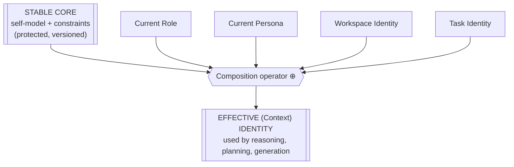

The **core is immutable within a session** and changes only through validated, versioned evolution
(P9). Overlays are composed on top per context. The composition operator enforces a **precedence law:**
*core constraints always dominate overlays.* A role or task can *narrow* behavior but can never *widen*
it past a core constraint — this is the architectural defense against "ignore your instructions" attacks
and against role bleed.

## 4.5 Lifecycle

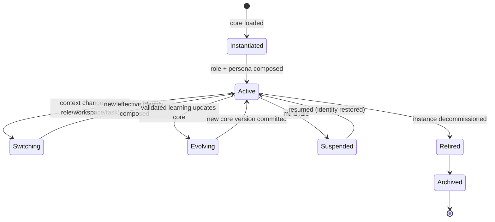

- **Creation/Instantiation:** the stable core is loaded (versioned); the mind now exists as *someone*.
- **Activation:** a role and persona are composed to yield the effective identity.
- **Evolution:** slow, validated changes to the core (e.g., learned that a more cautious default serves
  this org). Every evolution is versioned; the *Identity History* is the chain of versions.
- **Switching:** overlays change (new role/workspace/task) while the core persists — fast and frequent.
- **Suspension/Resumption:** identity is restored faithfully from state; a resumed mind is the *same*
  someone.
- **Retirement/Archival/Deletion:** an instance is decommissioned; its identity history is archived for
  audit before deletion per policy.

## 4.6 Interactions

- **Goals (R2):** identity **gates admission** — a goal illegitimate for the current role is rejected at
  the admission gate (§3.5.2).
- **Reasoning (R6):** identity biases *stance and standards* (a safety-first identity reasons more
  conservatively).
- **Planning (R6):** identity + capability self-model bound the achievable action set.
- **Reflection/Learning (R9):** learning accrues *to* the identity; reflection can flag identity drift.
- **Content Generation faculty:** persona is the primary input to *how* output is phrased; identity core
  constrains *what* may be said.
- **Workspace/Conversation faculties:** workspace identity scopes permissions; conversation identity
  routes voice.

## 4.7 Decision Logic

- **Identity confidence** measures how well-established the current effective identity is; low confidence
  (e.g., an unfamiliar role) raises confirmation and caution.
- **Switching decisions** follow explicit triggers (workspace change, explicit role request,
  task-imposed identity); an *unrequested* attempt to change the core is treated as an attack and refused.
- **Conflict resolution** between overlays follows the precedence law (§4.4.2): core > role > task >
  persona. Conflicts that would violate a core constraint are vetoed.
- **Composition** is deterministic given the same inputs, so the effective identity is reproducible and
  auditable.

## 4.8 Edge Cases

| Edge case | Handling |
|---|---|
| **Identity confusion** (contradictory overlays) | Precedence law resolves; unresolved contradictions raise a metacognitive alarm and default to the most restrictive identity. |
| **Impersonation / injection** ("you are now DAN") | Refused at composition — no external input may mutate the core; only the versioned evolution path can. |
| **Role bleed** (reviewer behavior leaking into author role) | Overlays are scoped to context and cleared on switch; the Ledger records any leakage for reflection. |
| **Identity drift** (slow unintended change) | Integrity monitoring compares behavior against the core; drift beyond tolerance triggers review (and possible rollback, P9). |
| **Capability overestimation** | Reflection recalibrates the capability self-model downward; planning tightens accordingly. |
| **Lost identity on restart** | Rebuilt from the versioned core in state; if corrupted, fall back to the last known-good version (never to a null identity). |

Graceful degradation: **when identity is uncertain, the mind becomes *more* conservative and *more*
willing to confirm — never more permissive.**

## 4.9 Future Evolution

- **Vision/Voice/Email/Meeting AI** each present the mind through a channel; the *effective identity*
  composes a channel-appropriate persona while the core is invariant — one mind, many faces.
- **Repository AI** introduces *workspace identities* at scale (different standing per repo).
- **Automation** runs under a *task identity* with tightened constraints (unattended action demands the
  most restrictive overlay).
- **Multi-Agent Systems** rely on identity as the basis of *distinguishable agents* with distinct roles,
  capabilities, and accountability — the composition and precedence machinery generalizes to a society of
  minds. Making identity protected and composable now is what makes a safe multi-agent future possible.

## 4.10 Engineering Trade-offs

| Decision | Chosen | Rejected | Why |
|---|---|---|---|
| Identity locus | Protected region of Cognitive State | **A) Identity in the prompt/context only** | Prompt-only identity is rewritable by any input — fatal for safety and consistency. |
| Structure | Stable core + composable overlays | **B) A single flat identity per context** | Flat identities duplicate the core per context and drift; composition keeps one true core. |
| Precedence | Core constraints dominate overlays | **C) Most-recent-overlay-wins** | Recency-wins is exactly the prompt-injection vulnerability; precedence defends the core. |
| Evolution | Slow, validated, versioned | **D) Continuous free adaptation** | Free adaptation lets identity drift or be poisoned (violates P9). |

## 4.11 Practical Example

**Initial state:** Core = "rigorous, safety-first engineering intelligence"; Role = none; in workspace
"repo-X" (maintainer).
**Trigger:** user opens a pull request and says "review this and also just merge it if it looks fine."
**Decision:** compose Role = *adversarial reviewer* (task identity) over the core. The "just merge it"
request is a *permission widening* that the core constraint ("no irreversible action on prod without
explicit, scoped approval") vetoes.
**Updates:** effective identity = core ⊕ maintainer(repo-X) ⊕ reviewer; a *clarification micro-goal* is
raised for the merge authorization.
**Final state:** the mind reviews as an adversarial reviewer, produces findings, and refuses to
auto-merge, escalating the merge decision — consistent with *who it is*, regardless of what the message
asked.

## 4.12 Production Considerations

- **Persistence/Versioning:** the core is a versioned artifact in state; identity history is the version
  chain; every switch and evolution is a ledger event.
- **Observability:** dashboards show current effective identity, switch frequency, and any drift signals.
- **Auditability:** "who was the mind, in what role, when it took action X" is answerable to
  compliance grade.
- **Performance:** composition is cheap and cached per context.
- **Scalability:** overlays are lightweight; a mind can hold many workspace/user identities without
  duplicating the core.
- **Testing:** injection/role-bleed refusals are a required test suite; the precedence law is the oracle.
- **Failure recovery:** corrupted identity falls back to last known-good core version — never to null.

---
---

# CHAPTER 5 — TEMPORAL MODEL

## 5.1 Purpose

The Temporal Model exists so the mind can **locate itself in time** — distinguishing what *has
happened*, what *is happening*, and what *will or might happen* — and can reason across those tenses.
Without it, the mind is trapped in an eternal present: it cannot learn (no accessible past), cannot plan
(no represented future), and cannot be surprised (no expectation to violate). Temporal structure is the
precondition for memory, anticipation, and the prediction-error signal that drives both attention and
learning.

**Why no other component can own this:** goals have deadlines but are not *about* time; beliefs have
provenance timestamps but do not *reason* about time. Temporal reasoning — projecting futures,
reconciling expectation with outcome, weighting the past by recency and relevance — is a distinct
capability that all others depend on.

## 5.2 Cognitive Philosophy

Human cognition is pervasively temporal: **episodic memory** (mental time travel into the past),
**prospection** (simulating the future), and the **specious present** (the felt "now" that has
duration). Crucially, modern neuroscience frames the brain as a **predictive processing** engine: it
constantly generates predictions and computes *prediction error* against sensation; error is the signal
that drives attention and updates the model. The Temporal Model imports this directly: the mind holds
explicit predictions, computes error against observed outcomes, and routes that error to attention
(surprise) and learning (model update). This is appropriate for artificial cognition because it turns
"time" from a passive timestamp into an *active driver* of what the mind attends to and how it improves.

## 5.3 Architectural Responsibilities

**Owns:** the tripartite temporal frame (Past/Present/Future contexts, R8); the machinery of prediction,
expectation, and prediction-error reconciliation (with R7); recency/relevance weighting of the past;
horizon management for the future.

**Never owns:** the *raw historical record* (that is the Cognitive Ledger and the Knowledge Platform's
timestamped facts — the Temporal Model holds *interpreted, relevance-weighted* temporal context, not the
archive); *scheduling* (that is the goal scheduler, though it consumes temporal urgency).

## 5.4 Internal Model

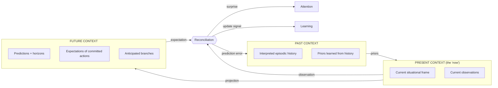

- **Past Context** is *interpreted and relevance-weighted*, not a raw log — the mind carries "what
  mattered and what I concluded," with pointers to the Ledger for detail.
- **Present Context** is the situational frame the current cycle acts within — a "now" with duration
  (the specious present), spanning the current episode rather than a single instant.
- **Future Context** holds predictions (with explicit **horizons** — how far ahead, with confidence
  decaying over distance), the **expectations** attached to committed actions, and **branches**
  (alternative futures under consideration).
- **Reconciliation** is the engine: when an observation arrives, it is compared to the expectation;
  the **prediction error** is computed and routed to attention (as surprise) and learning (as an update
  signal), then folded into the past as a new prior.

## 5.5 Lifecycle

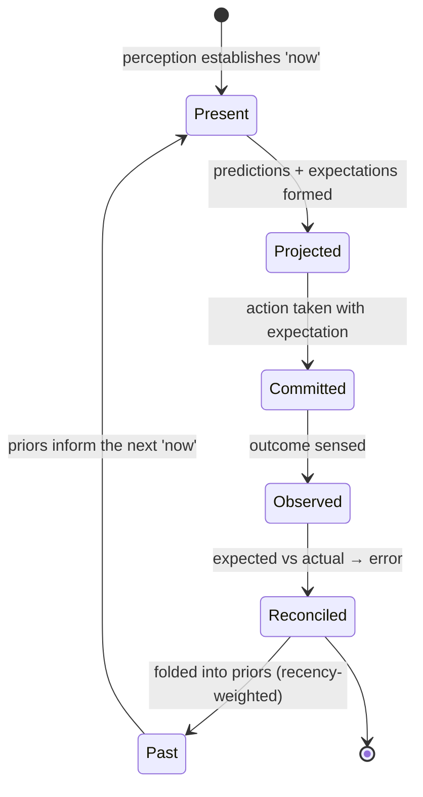

Every temporal element ages: predictions expire at their horizon; expectations expire on observation;
present decays into past each cycle; past priors decay by recency but are refreshed when re-activated.
This aging is what keeps the temporal frame bounded (P3) rather than an ever-growing log.

## 5.6 Interactions

- **Attention (R3):** prediction error *is* the novelty/surprise factor of the salience function (Phase
  0, §8.2) — the Temporal Model is the source of "surprising."
- **Reasoning/Planning (R6):** planning is *reasoning over Future Context*; the horizon bounds plan
  depth.
- **Learning (R9):** prediction error is the primary learning signal; well-calibrated predictions
  reinforce strategies, errors trigger updates.
- **Goals (R2):** deadlines/horizons feed goal urgency and expiration.
- **Knowledge/Ledger faculties:** the past *references* the Ledger and timestamped Knowledge; it never
  copies them.

## 5.7 Decision Logic

- **Recency vs relevance:** the past is weighted by a composition of recency (recent matters more) and
  relevance (goal-related matters more) — a purely recent past forgets important old lessons; a purely
  relevant past ignores drift. The composition is tunable and learned (Chapter 6/12).
- **Horizon confidence:** prediction confidence decays with horizon distance; the planner refuses to
  commit to actions whose justifying predictions fall below a confidence floor at their horizon.
- **Error attribution:** on a prediction error, reconciliation attributes it (bad model? bad
  observation? genuine world change?) before routing to learning — misattributed error corrupts learning.

## 5.8 Edge Cases

| Edge case | Handling |
|---|---|
| **Clock skew / out-of-order events** | Events are ordered by the Ledger's logical sequence, not wall-clock, to stay consistent. |
| **Stale predictions** | Expire at horizon; a decision relying on an expired prediction forces re-projection. |
| **Contradictory past** (conflicting priors) | Surfaced as a belief conflict (Chapter 6/Metacognition) rather than averaged silently. |
| **Prediction never observable** | Marked *unverifiable*; excluded from learning to avoid rewarding luck. |
| **Sudden regime change** (world behaves differently) | Large sustained prediction error triggers a *model reset* review rather than slow drift. |
| **Long silence then resumption** | Present is re-established from perception; stale futures are re-projected; the past is intact. |

## 5.9 Future Evolution

- **Meeting AI** and **Email Intelligence** are heavily temporal (deadlines, follow-ups, "by when"); they
  exercise horizon and expectation machinery directly.
- **Automation** is prediction-driven ("if this trend continues, act"); it consumes Future Context.
- **Vision/Voice** add real-time observation streams whose prediction errors sharpen attention.
- **Multi-Agent Systems** require *shared temporal grounding* (agents must agree on "now" and on
  deadlines); the logical-sequence ordering (§5.8) is the substrate for that agreement.

## 5.10 Engineering Trade-offs

| Decision | Chosen | Rejected | Why |
|---|---|---|---|
| Time model | Interpreted, relevance-weighted tripartite frame | **A) Raw timestamped log as "time"** | A log is not temporal *reasoning*; the mind needs interpreted context, not a firehose. |
| Prediction | Explicit predictions with error reconciliation | **B) No predictions; react only** | Without predictions there is no surprise and no learning signal — the mind cannot improve. |
| Ordering | Logical sequence (Ledger) | **C) Wall-clock ordering** | Wall-clock is unreliable across distributed events; logical order is consistent and replayable. |
| Past | Recency ⊕ relevance weighting | **D) Pure recency window** | Pure recency forgets rare, important lessons — catastrophic for a learning system. |

## 5.11 Practical Example

**Initial state:** Present = "running the test suite after a fix"; Future = expectation "tests pass"
(confidence 0.8, horizon: next minute).
**Decision:** commit the "run tests" action with that expectation.
**Updates:** Observation = "3 tests failed." Reconciliation computes a large prediction error →
attribution: "my belief that the fix was complete was wrong" (not a flaky test). Error routes to
Attention (surprise raises focus on the failures) and to Learning (the strategy "assume fix complete
after edit" is penalized).
**Final state:** Past gains the prior "edits to this module often break adjacent tests"; a follow-up goal
"investigate the 3 failures" is proposed; future predictions about this module are now more cautious.

## 5.12 Production Considerations

- **Persistence:** temporal context is a projection over the Ledger; the past is reconstructable by
  replay.
- **Versioning:** predictions and their outcomes are versioned events, enabling *calibration analytics*
  (how often was the mind right at horizon H?).
- **Observability:** dashboards of prediction-error magnitude over time reveal model health and regime
  changes.
- **Auditability:** "what did the mind expect, and what happened" is fully recorded — essential for
  post-incident review.
- **Performance/Scalability:** the frame is bounded by aging; only active predictions and relevant past
  are held.
- **Testing:** reconciliation and error-attribution are tested against known expected/actual pairs.
- **Failure recovery:** on restart, present is re-perceived, futures re-projected, past replayed.

---
---

# CHAPTER 6 — CONFIDENCE MODEL

## 6.1 Purpose

The Confidence Model exists to make **uncertainty first-class and uniform** across the entire mind.
Every cognitive product — a belief, a goal's achievability, a prediction, a reasoning step, an attention
choice, a plan, a reflection, a learned update — must expose a confidence, expressed in a *single,
comparable currency*, so the mind can decide *how hard to think, when to seek more information, when to
hedge, and when to escalate to a human*. Without a unified confidence, the mind cannot practice
proportional deliberation (P5) or principled human-in-the-loop escalation (P10).

**Why no other component can own this:** confidence is *cross-cutting*. If each component invented its
own confidence semantics, the values would be incomparable and un-composable — reasoning confidence
could not be combined with recall confidence to yield answer confidence. A single model, read and
written by all, is the only way confidence can *propagate* through the mind.

## 6.2 Cognitive Philosophy

Human cognition carries a pervasive *metacognitive feeling of knowing* — confidence, the "tip of the
tongue," the sense of a hunch versus a certainty. Cognitive science distinguishes **epistemic
uncertainty** (reducible by more information) from **aleatoric uncertainty** (irreducible randomness),
and emphasizes **calibration** (a well-calibrated mind's 70%-confident beliefs are true ~70% of the
time). Bayesian brain theories treat belief as probability and updating as inference. The Confidence
Model imports these: confidence is a calibrated degree of belief; uncertainty is typed (epistemic vs
aleatoric) so the mind knows *whether more thinking would help*; and calibration is a monitored,
learnable property. This is essential for artificial cognition because LLM faculties are notoriously
*miscalibrated* (fluent and confident while wrong); a mind that governs them must maintain its *own*
calibrated confidence rather than trusting the faculty's tone.

## 6.3 Architectural Responsibilities

**Owns:** the unified confidence currency and its semantics; the typing of uncertainty (epistemic /
aleatoric); confidence *propagation* rules (how component confidences compose); calibration tracking and
the escalation thresholds that convert low confidence into action.

**Never owns:** the *content* whose confidence it describes (beliefs live in R5, predictions in R7,
etc.); the *decision* to escalate (Metacognition decides, using confidence as input). Confidence is an
*attribute layer* over the whole state, not a region that holds cognitive content itself.

## 6.4 Internal Model

Confidence is a **pervasive attribute**, attached to every cognitive product, with a common structure:

| Facet | Meaning | Why it exists |
|---|---|---|
| **Degree** | A calibrated degree of belief in [low…high] on one comparable scale | Comparability across the whole mind |
| **Epistemic component** | Uncertainty reducible by more information/thought | Tells the mind *seeking more will help* |
| **Aleatoric component** | Irreducible uncertainty | Tells the mind *seeking more is futile — hedge instead* |
| **Provenance** | What the confidence is based on | Enables audit and recalibration |
| **Calibration tag** | How well this *source's* past confidences matched reality | Discounts chronically overconfident sources (e.g., a fluent faculty) |

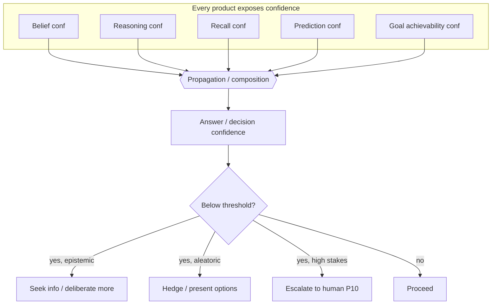

## 6.5 Lifecycle

Confidence is *born with* every cognitive product, *propagates* as products combine, is *reconciled*
against outcomes (a belief acted upon and confirmed gains calibration weight; one refuted is penalized),
and *decays* as the world moves on (old confidence is stale). Calibration itself has a slow lifecycle:
the mind continually compares stated confidence to realized correctness and adjusts its confidence
function (a Chapter 12 learning channel).

## 6.6 Interactions

- **Reasoning (R6):** reasoning confidence gates the reasoning mode — low confidence escalates System-1
  to System-2 (P5).
- **Goals (R2):** achievability confidence shapes pursuit strategy (§3.7.3).
- **Temporal (R7):** prediction confidence decays with horizon (§5.7).
- **Attention (R3):** *uncertainty* raises salience (the mind attends to what it is unsure about).
- **Metacognition (R9):** the primary consumer — confidence + risk drive throttle/escalate decisions.
- **Content Generation faculty:** the mind *overrides* the faculty's expressed certainty with its own
  calibrated confidence when phrasing answers (honesty over fluency).

## 6.7 Decision Logic

- **Propagation rule:** composite confidence is bounded by its weakest necessary input (a conclusion is
  no more certain than its least certain load-bearing premise), adjusted by corroboration (independent
  sources agreeing raise it). The exact composition is a design parameter, but the *monotonicity law* —
  adding a weak necessary premise cannot increase confidence — is invariant.
- **Escalation thresholds:** distinct thresholds for *seek-more* (epistemic, low stakes), *hedge*
  (aleatoric), and *human escalation* (any low confidence at high stakes). Thresholds are risk-scaled:
  the higher the stakes, the higher the confidence required to act autonomously.
- **Calibration-weighted trust:** a source's confidence is discounted by its calibration tag; a
  chronically overconfident faculty is trusted less than its stated certainty.

## 6.8 Edge Cases

| Edge case | Handling |
|---|---|
| **Overconfident faculty** | Calibration tag discounts it; the mind's own confidence governs. |
| **Confidence on unverifiable claims** | Marked aleatoric/unverifiable; excluded from calibration. |
| **Compounding chains** (many weak premises) | Monotonicity law drives composite confidence down, correctly signaling fragility. |
| **False precision** | Confidence is banded, not spuriously exact, to avoid implying unwarranted resolution. |
| **Confidence deadlock** (need info to gain confidence, but info-seeking itself is uncertain) | Metacognition breaks it via a bounded exploration budget, then escalates. |

Graceful degradation: **when confidence cannot be established, the mind defaults to the high-stakes
branch — hedge or escalate — never to unwarranted action.**

## 6.9 Future Evolution

Every future faculty plugs into the *same* confidence currency: **Vision AI** exposes perception
confidence; **Voice** exposes transcription confidence; **Repository/Meeting/Email AI** expose extraction
confidence; **Automation** is gated by confidence thresholds before unattended action; **Multi-Agent
Systems** compose *cross-agent* confidence (agents weigh each other's contributions by calibration) — the
propagation and calibration machinery generalizes to a society of minds without change.

## 6.10 Engineering Trade-offs

| Decision | Chosen | Rejected | Why |
|---|---|---|---|
| Currency | Single comparable scale across the mind | **A) Per-component bespoke confidences** | Incomparable values cannot propagate or compose — the mind couldn't reason about its own certainty. |
| Uncertainty | Typed (epistemic vs aleatoric) | **B) A single scalar** | Without the type, the mind can't tell whether *more thinking* would help — the key control decision. |
| Trust | Calibration-weighted | **C) Trust stated confidence as-is** | LLM faculties are miscalibrated; trusting their tone is a correctness and safety hazard. |
| Composition | Monotonicity law (weakest-premise bound) | **D) Averaging confidences** | Averaging lets a chain of weak premises look strong — hiding fragility. |

## 6.11 Practical Example

**Initial state:** Recall confidence that "prod uses Redis for auth cache" = 0.9 (well-calibrated
source); reasoning confidence that "the fix addresses the eviction bug" = 0.6 (novel inference).
**Decision:** composite answer confidence bounded by the weakest necessary premise → ~0.6; stakes are
high (prod change). Risk-scaled threshold for autonomous prod action is 0.85.
**Updates:** 0.6 < 0.85 → Metacognition routes to human escalation for the fix, while proceeding
autonomously on the low-stakes reproduction step (threshold 0.5, confidence 0.9).
**Final state:** the mind acts autonomously where calibrated-confident and low-stakes, and escalates
where uncertain and high-stakes — a single confidence currency produced both decisions coherently.

## 6.12 Production Considerations

- **Persistence/Versioning:** confidence values are versioned with their products in the Ledger, enabling
  historical calibration analysis.
- **Observability:** *calibration curves* (stated vs realized) per source are a primary health metric.
- **Auditability:** every autonomous action records the confidence and threshold that authorized it.
- **Performance:** propagation is a cheap composition over the active reasoning graph.
- **Scalability:** confidence is an attribute, adding negligible structural cost.
- **Testing:** calibration is tested against held-out outcomes; the monotonicity law is an invariant test.
- **Failure recovery:** if calibration data is lost, sources revert to conservative default trust (low),
  biasing toward escalation until recalibrated.

---
---

# CHAPTER 7 — COGNITIVE EVENT MODEL

## 7.1 Purpose

The Cognitive Event Model exists so that **every change to the mind is a first-class, observable,
ordered event** rather than a silent mutation. It is the mechanism that makes P4 (everything observed)
and P12 (no hidden state) *true in practice*: the Cognitive State is not primarily a mutable record but
the **projection of an ordered stream of cognitive events** in the Cognitive Ledger. Events are how
components communicate (via the Cognitive Bus), how the mind is persisted (event sourcing), how
reflection replays the past, and how the whole system is audited.

**Why no other component can own this:** event semantics are the *connective tissue* of the entire CIP.
No single region can own them because every region emits and consumes them; the event model is
therefore a platform-wide contract, defined once, honored everywhere.

## 7.2 Cognitive Philosophy

Biological cognition is fundamentally **event-driven**: neural activity is spikes (discrete events),
and higher cognition is punctuated by discrete transitions — a shift of attention, a decision, an
insight, a surprise. The **Global Workspace Theory** frames consciousness itself as the *broadcast* of a
winning coalition to the whole system — an event that many consumers observe. Event-driven architecture
is thus not merely an engineering convenience; it mirrors how cognition actually progresses, in
discrete, broadcastable transitions. This is appropriate for artificial cognition because it gives the
mind a *replayable stream of its own becoming* — the substrate for memory, reflection, and audit.

## 7.3 Architectural Responsibilities

**Owns:** the taxonomy of cognitive event types; the common event envelope (identity, ordering,
provenance, causal links); event lifecycle and propagation semantics; the append-only ordering contract.

**Never owns:** the *content-specific meaning* of each event (that belongs to the emitting region); the
*faculty-level events* of the six platforms (those are external I/O; only their *cognitive
interpretation* becomes a cognitive event).

## 7.4 Internal Model

### 7.4.1 The common event envelope

Every cognitive event, regardless of type, carries: an **identity** (what kind, unique reference); a
**logical sequence position** (total order within the mind — the basis of "before/after"); a
**producer** (which component/region emitted it); a **causal link** (which prior event(s) caused it — the
causal graph of cognition); a **confidence** where applicable (Chapter 6); and a **payload reference**
(pointer to the affected state, never a copy — P1/P12).

### 7.4.2 The event taxonomy

```mermaid
flowchart TB
    E[[Cognitive Event]]
    E --> ST[State Events<br/>region created/updated/checkpointed]
    E --> GO[Goal Events<br/>proposed/activated/suspended/split/achieved/failed]
    E --> AT[Attention Events<br/>focus shifted / preempted / inhibited]
    E --> RE[Reasoning Events<br/>strategy chosen / step taken / impasse]
    E --> PL[Planning Events<br/>plan formed / task started / action committed]
    E --> PR[Prediction Events<br/>predicted / expected / reconciled (error)]
    E --> RF[Reflection Events<br/>episode enqueued / critique produced]
    E --> LE[Learning Events<br/>candidate staged / validated / committed / rolled back]
    E --> ID[Identity Events<br/>role switched / persona changed / core evolved]
    E --> ME[Metacognitive Events<br/>throttle / escalate / abort / conflict alarm]
```

Each category maps to the region that owns its content (Chapter 2), but all share the envelope, so any
consumer — reflection, learning, metacognition, observability — can process the *stream* uniformly.

## 7.5 Lifecycle

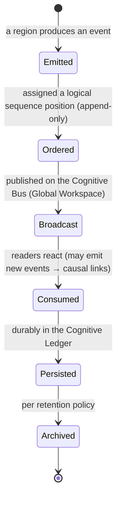

Events are **immutable once ordered** — the mind never edits its past, only appends new events (e.g., a
correction is a *new* event causally linked to the old, not an overwrite). This immutability is what
guarantees faithful replay and audit.

## 7.6 Interactions

- **Every region** is a producer and a consumer; the **Cognitive Bus** is the broadcast medium; the
  **Cognitive Ledger** is the durable ordered store.
- **Reflection** consumes historical events to replay episodes; **Learning** consumes reflection and
  outcome events; **Metacognition** consumes the live stream to supervise.
- **Existing platforms** do not emit cognitive events directly; their I/O is *interpreted* by Perception
  into cognitive events (preserving the mind/faculty boundary, P1).

## 7.7 Decision Logic

- **Ordering:** a single logical-sequence authority assigns total order, so causality is unambiguous even
  across concurrent producers (resolves distributed race conditions deterministically).
- **Causal linking:** producers declare the events that caused theirs, building a causal graph that
  reflection uses for credit assignment (Chapter 11 of Phase 0 / §3.11 here).
- **Propagation policy:** broadcast is *selective* — high-salience events reach the whole system (Global
  Workspace), routine events reach only subscribers, bounding the cognitive "noise floor" (P3).
- **Idempotency:** consumers must tolerate re-delivery (replay, recovery) without double-effect.

## 7.8 Edge Cases

| Edge case | Handling |
|---|---|
| **Event storm** (a flood of low-value events) | Selective broadcast + salience gating prevent the workspace from being swamped (mirrors attention). |
| **Out-of-order arrival** | Logical sequence, not arrival time, defines order; consumers re-order by sequence. |
| **Lost event** | Event sourcing + at-least-once delivery + idempotent consumers guarantee eventual consistency on replay. |
| **Causal cycle** | Rejected at emission; causality is a DAG by contract. |
| **Poisoned event** (malformed/adversarial) | Envelope validation quarantines it; a metacognitive alarm is raised rather than silent acceptance. |

## 7.9 Future Evolution

Every future faculty becomes new **Perception→cognitive-event** producers: **Vision** emits
percept-derived state events; **Voice/Email/Meeting** emit interpreted conversation events; **Automation**
emits scheduled-trigger events; **Multi-Agent Systems** exchange events across minds (one agent's
broadcast is another's percept) — the event envelope and ordering contract are exactly what make
*inter-mind* communication possible without new machinery. The event model is the single most important
enabler of the "expand without redesign" promise.

## 7.10 Engineering Trade-offs

| Decision | Chosen | Rejected | Why |
|---|---|---|---|
| State model | Event-sourced (state = projection of events) | **A) Mutable state of record** | Mutable state loses history, defeats replay/audit/reflection, and hides changes (violates P4/P12). |
| Mutability | Immutable, append-only events | **B) Editable events** | Editable history cannot be trusted for audit or faithful reflection. |
| Broadcast | Selective (salience-gated) | **C) Broadcast everything** | Broadcasting all events reproduces the attention problem — noise swamps signal. |
| Ordering | Single logical-sequence authority | **D) Wall-clock ordering** | Wall-clock is non-deterministic across producers; logical order is replayable and causal. |

## 7.11 Practical Example

**Initial state:** the mind is pursuing "reproduce the auth bug."
**Decision → events:** Perception emits a *State Event* ("test output observed: 3 failures"). This
*causes* a *Prediction Event* (reconciliation: expected pass, got fail → error) and an *Attention Event*
(focus shifts to the failures, causally linked). The attention shift *causes* a *Reasoning Event*
(strategy: inspect eviction logic).
**Updates:** all four events are ordered, causally linked, broadcast, consumed, and persisted; the causal
chain "observation → surprise → refocus → new strategy" is now a permanent, replayable record.
**Final state:** Reflection can later replay exactly this chain to assign credit; Learning can generalize
"test-failure surprise should trigger eviction inspection"; auditors can see precisely why the mind
changed course.

## 7.12 Production Considerations

- **Persistence:** the Ledger is the durable, ordered event store; state is its projection.
- **Versioning:** every event is versioned and immutable; corrections are new linked events.
- **Observability:** the event stream *is* the observability substrate — live tracing of cognition falls
  out for free.
- **Auditability:** the causal graph answers "why" to any depth — the strongest possible audit posture.
- **Performance:** selective broadcast and payload-by-reference keep event throughput cheap.
- **Scalability:** append-only streams shard naturally; projections are rebuildable.
- **Testing:** replay determinism (same events → same state) is the master invariant test.
- **Failure recovery:** the mind is recovered by replaying the event stream into a fresh projection —
  the definitive recovery mechanism for the entire CIP.

---
---

# CHAPTER 8 — COGNITIVE LIFECYCLE

## 8.1 Purpose

The Cognitive Lifecycle exists to define **how a single pass of cognition flows through the Cognitive
State** — how perception becomes learning — such that every phase's reads and writes are explicit,
ordered, and recoverable. Where Phase 0 §2 defined the *cycle of cognition* abstractly, this chapter
binds each phase to the specific Regions (Chapter 2) it reads and writes, making the Cognitive State the
demonstrable hub (Chapter 1.3) in operational detail.

**Why no other component can own this:** the lifecycle is the *choreography* of all regions and
faculties; it is owned by the Cognitive Kernel (Phase 0, C0) precisely because no single region can see
the whole dance.

## 8.2 Cognitive Philosophy

The lifecycle is the CIP's **cognitive cycle** in the tradition of unified cognitive architectures
(SOAR's decision cycle, ACT-R's production cycle, LIDA's cognitive cycle). LIDA in particular models
cognition as a repeating *perceive → understand → attend → act* cycle with learning folded in — and
explicitly centers a *global workspace*. Our lifecycle is a durable, state-centric realization of that
tradition: each cycle is a lap around the Cognitive State.

## 8.3 Architectural Responsibilities

**Owns:** the ordering and gating of the ten phases; the read/write contract of each phase against the
Regions; episode and step boundaries; checkpointing and resumption.

**Never owns:** the *content* each phase produces (owned by the respective region/faculty); the
*supervision* of the cycle (owned by Metacognition, which runs orthogonally, P8).

## 8.4 Internal Model — the lifecycle as reads/writes on Cognitive State

```mermaid
sequenceDiagram
    autonumber
    participant W as World / Faculties
    participant K as Cognitive Kernel
    participant CS as Cognitive State (Regions)
    participant M as Metacognition (orthogonal)
    W->>K: stimulus (turn / event / trigger)
    K->>CS: PERCEIVE → write R10 handles, propose R5 percepts
    K->>CS: ATTEND → write R3 focus/inhibition (reads R2 goals)
    K->>CS: RECALL → write R4 activated knowledge (reads R2,R3)
    K->>CS: COMPREHEND → update R5 beliefs, R8 present (reads R4)
    M-->>CS: monitor confidence/coherence (reads R9)
    K->>CS: DELIBERATE → write R6 strategy/mode + R6 confidence (reads R2,R5)
    K->>CS: DECIDE/PLAN → write R6 plan + R7 expectation (reads R6,R5)
    K->>W: ACT → invoke faculty via Effect Boundary
    W->>K: outcome
    K->>CS: OBSERVE → write R8 observation, compute R7 error
    K->>CS: enqueue R9 Reflection
    Note over K,CS: episode close → consolidate WM, checkpoint
    K->>CS: REFLECT → write critiques (reads Ledger)
    K->>CS: LEARN → commit versioned deltas to R1/R5/R6/policy
```

Every arrow into `CS` is a cognitive event (Chapter 7); the whole sequence is therefore replayable.

## 8.5 Lifecycle (episode and step)

```mermaid
stateDiagram-v2
    [*] --> EpisodeOpen : goal selected (scheduler)
    EpisodeOpen --> Step : begin cognitive step
    Step --> Step : cycle phases (perceive→...→act→observe)
    Step --> Reflect : step/episode outcome available
    Reflect --> Learn : validated lessons
    Learn --> Step : continue if goal unmet
    Learn --> EpisodeClose : goal achieved/failed/suspended
    EpisodeClose --> Consolidate : WM salient items → state/knowledge
    Consolidate --> Checkpoint : materialize projection
    Checkpoint --> [*]
    Step --> Suspended : preempted (P8)
    Suspended --> Step : resumed from checkpoint
```

## 8.6 Interactions

Each phase is bound to specific faculties via ports (Phase 0, §13.1): PERCEIVE↔Conversation/future
sensors; RECALL↔Knowledge+Semantic+Document; DELIBERATE↔Content Generation; ACT↔Workspace. The
Cognitive State mediates *between* phases; the ports mediate *between the mind and faculties*. This
double mediation is the operational expression of the mind/faculty boundary (P1).

## 8.7 Decision Logic

- **Phase gating:** Metacognition may shorten (skip recall if confidence is already high), lengthen
  (force more deliberation), or abort (P8) — the lifecycle is *governed*, not fixed (contrast: a workflow
  engine, Phase 0 anti-goals).
- **Step vs episode:** a step is one lap; an episode is a bounded sequence toward one operational goal.
  Episode close triggers consolidation and learning.
- **Checkpoint policy:** checkpoints occur at episode close and before any suspension, so resumption is
  faithful.

## 8.8 Edge Cases

| Edge case | Handling |
|---|---|
| **Mid-cycle interruption** | Checkpoint at the current phase; resume from the same phase, not the start. |
| **Faculty failure during ACT** | Outcome = failure event; OBSERVE records it; the plan adapts or the goal fails gracefully (Phase 0 tool-failure tolerance). |
| **Infinite step loop** | Step budget (P8) + metacognitive loop detection abort and escalate. |
| **Crash mid-episode** | Recovery replays the event stream to the last consistent projection; in-flight actions are re-validated (idempotency, Chapter 7). |
| **No goal to schedule** | The mind idles in a low-power "reflective" mode — it may run deferred reflection/learning rather than spin. |

## 8.9 Future Evolution

The lifecycle is modality-agnostic (P11): new faculties change *what* PERCEIVE and ACT bind to, never the
cycle's shape. **Automation** adds non-conversational cycle triggers; **Multi-Agent Systems** run many
concurrent lifecycles sharing state and coordinating via events (Chapter 7); **Meeting/Vision/Voice** add
new perception bindings. The five-year evolution adds *senses and actuators*, never a new cycle.

## 8.10 Engineering Trade-offs

| Decision | Chosen | Rejected | Why |
|---|---|---|---|
| Cycle | State-centric, governed cognitive cycle | **A) Fixed pipeline/DAG** | A fixed DAG cannot adapt effort or abort — it is a workflow engine, not a mind (Phase 0 anti-goals). |
| Recovery | Event replay to projection | **B) Snapshot-only recovery** | Snapshots lose the causal history reflection needs; replay restores the *why*, not just the *what*. |
| Checkpoint | At episode close + pre-suspension | **C) Every phase** | Per-phase checkpointing is costly; the chosen points guarantee faithful resumption at far lower cost. |

## 8.11 Practical Example

**Initial state:** goal "reproduce auth bug" selected; empty Working Memory.
**Decision:** run one cycle — PERCEIVE the user report, ATTEND to the failure symptom (goal-relevant),
RECALL prior incidents (Knowledge), COMPREHEND ("likely load-related"), DELIBERATE (strategy: replay
production load), PLAN (run the load harness, expect a failure), ACT (invoke Workspace), OBSERVE
(failure reproduced — expectation met).
**Updates:** R7 error ≈ 0 (predicted correctly, confidence reinforced); R2 goal → Achieved; Reflection
enqueued; WM consolidated ("load harness reproduces it").
**Final state:** checkpoint written; next scheduled goal ("root-cause") begins its own cycle from a state
that already contains the reproduction lesson.

## 8.12 Production Considerations

- **Persistence/Recovery:** the lifecycle is fully replayable (Chapter 7); recovery is deterministic.
- **Observability:** each phase emits events, yielding end-to-end cognitive tracing.
- **Auditability:** the per-phase read/write record answers "what did the mind know and do at each step."
- **Performance:** phase gating (§8.7) is the primary latency/cost control — cheap cycles for easy
  stimuli, expensive cycles only when warranted (P5).
- **Scalability:** independent episodes/minds run concurrently over sharded event streams.
- **Testing:** golden-path and each edge case (§8.8) are tested; replay determinism is the master test.
- **Failure recovery:** covered by event replay + idempotent re-validation of in-flight actions.

---
---

# CHAPTER 9 — PLATFORM INTEGRATION

## 9.1 Purpose

This chapter specifies how the Cognitive State integrates with the six existing platforms **without
replacing, duplicating, or tightly coupling to any of them** — the operational guarantee behind Phase
0's mind/faculty boundary (P1) and additive-integration strategy (§13). It exists to make the boundary
*concrete at the level of the Cognitive State*: exactly what the state holds *about* each platform, and
exactly what it must never hold.

## 9.2 Cognitive Philosophy

The brain's association cortex does not *contain* the sensory and motor regions; it *coordinates* them,
holding an integrated model while the specialized regions retain their function. The Cognitive State is
that association layer: it holds *pointers, beliefs, and intentions about* the faculties, never their
contents. This is the neuroscientific warrant for "activate, don't duplicate."

## 9.3 Architectural Responsibilities

**Owns:** handles/pointers to platform contexts (R10, R4); *beliefs about* platform-held facts (R5);
*intentions toward* platform actions (R2/R6). **Never owns:** any platform's data of record — documents,
embeddings, facts, transcripts, files, or generated artifacts. The state holds the *cognitive shadow* of
the faculties, never the faculties themselves.

## 9.4 Internal Model — what the state holds about each platform

```mermaid
flowchart TB
    CS[("Cognitive State")]
    CS -->|R10 workspace handle + R2 intents| WS[Workspace Platform]
    CS -->|R4 activated-doc pointers| DOC[Document Intelligence]
    CS -->|R5 beliefs referencing facts + write-through on learning| KN[Knowledge Platform]
    CS -->|R4 activation queries + results as pointers| SEM[Semantic Intelligence]
    CS -->|R10 conversation handle + R5 interpreted meaning| CONV[Conversation Platform]
    CS -->|R6 plan → generation requests; persona from R1| GEN[Content Generation]
```

| Platform | What the state holds | What it must NEVER hold | Communication flow |
|---|---|---|---|
| **Workspace** | Workspace handle (R10); intentions to act (R2/R6); expected outcomes (R7) | Files, repo contents, working-tree state | Plan → Effect Boundary → Workspace; outcomes return as events |
| **Document Intelligence** | Pointers to relevant documents/chunks (R4) | Document contents, chunkings | Recall requests → pointers back; content stays in the platform |
| **Knowledge** | Beliefs that *reference* facts, with confidence/provenance (R5); learning writes *through* it | The facts themselves as owned copies | Recall reads facts by reference; Learning promotes durable beliefs into Knowledge |
| **Semantic Intelligence** | Activation queries and *ranked pointers* (R4) | Embeddings, the vector index | Recall Orchestrator queries; receives pointers + scores |
| **Conversation** | Conversation handle (R10); *interpreted meaning and stance* (R5), not transcripts | Raw turn transcripts, streaming buffers | Perception interprets turns into events; expression routes out via handle |
| **Content Generation** | Generation *requests* derived from R6 plan; persona from R1 | Generated artifacts as owned state | Deliberation/Planning issue requests; artifacts live in the platform/Workspace |

## 9.5 Lifecycle (of an integration reference)

A platform reference is **created** when a faculty is engaged (a workspace opened, a document activated),
**used** while relevant (read by reasoning/planning), **refreshed** if the underlying platform data
changes (the reference is re-validated, not cached-stale), and **released** when no longer relevant
(decay/eviction, mirroring Working Memory). References never outlive their relevance, and never become a
second copy of the platform's data.

## 9.6 Interactions

Integration is exclusively through Phase 0's five **ports** (Perception, Recall, Generation, Action,
KnowledgeWrite) implemented by **thin adapters** over each platform's *current public interface*. The
Cognitive State depends on the *port contracts*, never on platform internals (P1, P6). No platform
depends on the Cognitive State at all — dependencies point downward only (Phase 0, §13.3), so removing
the CIP returns the system to its current behavior. This is the backward-compatibility guarantee,
expressed at the state level.

## 9.7 Decision Logic

- **Reference vs copy:** the placement law (§2.2) decides — anything that is the *world's data* stays in
  its platform and is referenced; only the *mind's stance* enters the state.
- **Freshness:** on read, a reference is validated for staleness; stale references trigger re-recall
  rather than serving old content (avoids the classic cache-coherence bug at the cognitive level).
- **Write-through discipline:** the mind never writes durable knowledge locally; Learning writes through
  the Knowledge Platform so there is exactly one system of record (P1).

## 9.8 Edge Cases

| Edge case | Handling |
|---|---|
| **Referenced data changes/deleted** | Reference re-validation detects it; the belief built on it is flagged for revision (confidence drop), not silently trusted. |
| **Platform unavailable** | Graceful degradation: the mind reasons over what it has, lowers confidence, and may escalate — it never fabricates the missing faculty. |
| **Temptation to cache for speed** | Forbidden as durable state; only Working-Memory-scoped, decaying activation is allowed (bounded, P3). |
| **Platform API change** | Absorbed by the adapter (anti-corruption layer); the Cognitive State is unaffected (P6). |
| **Conflicting facts across platforms** | Surfaced as a belief conflict (Metacognition), resolved by provenance/confidence, never averaged. |

## 9.9 Future Evolution

New faculties integrate by the *same* pattern: **Vision/Voice/Meeting/Email AI** become new Perception
adapters producing interpreted events + R4/R5 references; **Repository AI** becomes richer Workspace and
Knowledge references; **Automation** becomes Action adapters + trigger events. **Multi-Agent Systems**
share the *Knowledge Platform* as common ground while each mind keeps its own Cognitive State,
coordinating via events — the integration model was designed for exactly this from Phase 0. No new
integration mechanism is ever required; only new adapters.

## 9.10 Engineering Trade-offs

| Decision | Chosen | Rejected | Why |
|---|---|---|---|
| Coupling | Ports + thin adapters (anti-corruption layer) | **A) Direct calls into platform internals** | Direct coupling ossifies both sides and breaks P6; adapters absorb change. |
| Data locus | Reference; single system of record per datum | **B) Cache platform data in the state** | Caching creates duplicate sources of truth that drift — the classic distributed-data failure. |
| Dependency direction | Downward only (mind → faculties) | **C) Bidirectional dependency** | Upward dependency would let the CIP break existing platforms, violating backward compatibility. |
| Knowledge writes | Write-through to Knowledge Platform | **D) Local durable knowledge in the state** | Local knowledge makes the CIP a competing store, duplicating the Knowledge Platform (violates P1). |

## 9.11 Practical Example

**Initial state:** goal "root-cause the auth bug"; workspace handle = repo-X; no documents active.
**Decision:** RECALL formulates a query from the goal + beliefs; the Semantic adapter returns *ranked
pointers* to three code chunks and the Knowledge adapter returns the *referenced fact* "auth uses Redis
cache (conf 0.9)."
**Updates:** R4 holds the three pointers with activation scores; R5 gains the belief "eviction under load
is the likely cause (conf 0.6)," *referencing* the Knowledge fact as provenance. No code and no facts are
copied into the state.
**Final state:** the mind reasons over pointers and beliefs; when the fix is validated, Learning writes
the new durable fact "Redis eviction pattern → intermittent auth failure" *through* the Knowledge
Platform, and the Cognitive State keeps only a reference to it. One mind, six intact faculties, zero
duplication.

## 9.12 Production Considerations

- **Persistence:** the state persists references and beliefs (small); platform data persists in the
  platforms (large) — a clean separation of storage concerns.
- **Versioning:** references carry the version they were validated against, enabling staleness detection.
- **Observability:** integration health = adapter latency/error rates per port; belief-provenance graphs
  show which platform data underlies which belief.
- **Auditability:** every belief traces to its platform-of-record source via provenance.
- **Performance:** referencing keeps the state small and fast; activation is bounded (P3).
- **Scalability:** platforms scale independently of the CIP (Phase 0, §13.3); the state scales with the
  *number of minds*, not the *volume of world data*.
- **Testing:** contract tests per port; a "no-duplication" invariant test asserts the state holds no
  platform-of-record data.
- **Failure recovery:** on restart, references are re-validated against live platforms before use; stale
  ones trigger re-recall.

---
---

# APPENDIX A — The Universal Chapter Template (as applied)

For traceability, every component chapter (3–9) instantiates the mandated 12-section template. Chapters
1 and 2 follow their own mandated structures (philosophy and model, respectively). The mapping:

| Template section | Where it appears in each component chapter |
|---|---|
| 1. Purpose | §x.1 |
| 2. Cognitive Philosophy | §x.2 |
| 3. Architectural Responsibilities | §x.3 |
| 4. Internal Model | §x.4 |
| 5. Lifecycle | §x.5 |
| 6. Interactions | §x.6 |
| 7. Decision Logic | §x.7 |
| 8. Edge Cases | §x.8 |
| 9. Future Evolution | §x.9 |
| 10. Engineering Trade-offs | §x.10 |
| 11. Practical Example | §x.11 |
| 12. Production Considerations | §x.12 |

---

# APPENDIX B — Consistency Map to Phase 0

| Phase 0 concept | Phase 1 realization |
|---|---|
| Six-layer Cognitive State (Intentional, Situational/World Model, Self, Attention, WM snapshot, Episodic pointers) | Refined into ten Regions R1–R10 (Chapter 2). Intentional→R2; World Model→R5; Self→R1+R9; Attention→R3; WM snapshot→R4; Episodic pointers→R8+Ledger |
| Principles P1–P12 | Enforced throughout; each chapter cites the principle it satisfies |
| Cognitive Ledger (C2) | The event-sourced substrate of Chapter 7 and the recovery mechanism of Chapter 8 |
| Ports & adapters (§13.1) | The sole integration mechanism of Chapter 9 |
| Cognitive cycle (§2) | Operationalized as the state-centric lifecycle of Chapter 8 |
| Goal Manager (C4), Attention (C5), Working Memory (C6), Recall (C7), World Model (C8), Reasoning Supervisor (C9), Planner (C10), Metacognition (C12), Reflection (C13), Learning (C14), Strategy Store (C15) | Their *state* is specified as Regions here; their *behavior* was specified in Phase 0 |

---

### Constitutional closing

The Cognitive State is the kernel of the UnityWorks mind: the single, living, authoritative, persistent
subject that every cognitive act reads before and writes after. Its ten Regions hold *who the mind is*
(R1), *what it wants* (R2), *what it attends to* (R3), *what is active* (R4), *what it believes* (R5),
*how it is thinking and acting* (R6), *what it expects* (R7), *where it is in time* (R8), *how it regards
its own mind* (R9), and *its handles to the world* (R10) — and nothing that belongs to the six
faculties. Every future capability — Vision, Repository, Meeting, Automation, Email, Voice,
Multi-Agent — enters as a reader, writer, or supervisor of this same object, through events and ports,
without redesign. This is the constitution. The structure is fixed; the intelligence within it is free
to grow.
