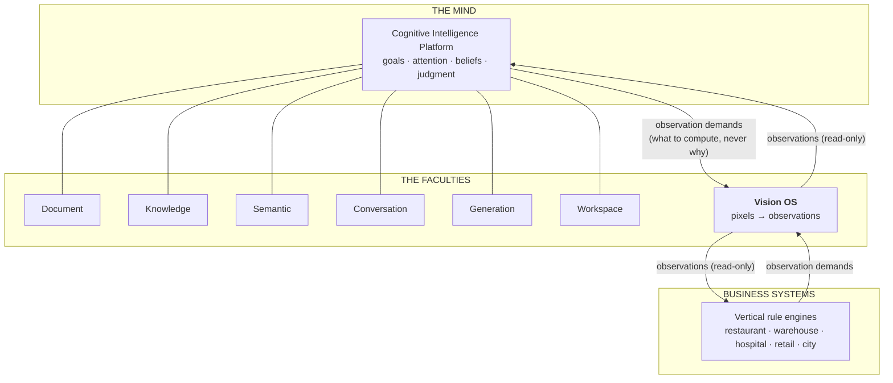
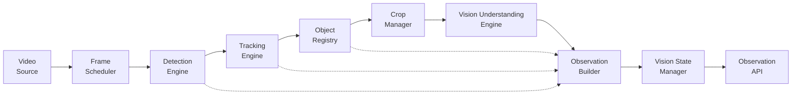

# UnityWorks Vision OS (UWV)

## Phase 1 — The Platform Charter

| | |
|---|---|
| **Status** | Architecture Blueprint — Phase 1 (Design Only) |
| **Scope** | Architecture only. No implementation. No modification of existing platforms. |
| **Audience** | Computer-vision researchers, principal engineers, platform architects, CTOs |
| **Intent** | Permanent architectural foundation for every future visual capability in UnityWorks |
| **Version** | 1.0 (foundational) |
| **Sibling** | Cognitive Intelligence Platform (`docs/architecture/COGNITIVE_*.md`) |

> This document specifies *what the UnityWorks Vision OS is, why it exists, and the invariants it must
> never violate.* It deliberately does not specify implementation. Where it references existing
> UnityWorks systems, it does so to define **boundaries**, never to redesign them.

---

## Table of Contents

- [1. Executive Summary](#1-executive-summary)
- [2. Position in UnityWorks](#2-position-in-unityworks)
- [3. Architecture Vision](#3-architecture-vision)
- [4. The Semantic Ceiling](#4-the-semantic-ceiling)
- [5. Platform Invariants](#5-platform-invariants)
- [6. Anti-Goals](#6-anti-goals)
- [7. The Perception Cycle](#7-the-perception-cycle)
- [8. Vertical Neutrality](#8-vertical-neutrality)
- [9. The Longevity Argument](#9-the-longevity-argument)

---

# 1. Executive Summary

The UnityWorks Vision OS (UWV) is a **perception platform**. It converts video into structured,
explainable, domain-neutral **observations** of the visual world — and it does nothing else.

It has exactly one product: a stream of observations, each of which is a *statement about what was
visible*, anchored in normalized time and space, carrying the evidence that justifies it and the
identity of the model that produced it. It has exactly one durable asset: the **Vision State**, a
continuously-maintained projection of "what is currently visible, where, and since when."

Everything the platform refuses to do is as important as what it does. It does not know what a
restaurant is. It does not know that a person standing near a counter for four minutes is a problem.
It does not know that a missing helmet is a violation, that an empty shelf is lost revenue, or that a
patient out of bed is a fall risk. Those are *judgments*, and judgments belong to the business systems
and to the Cognitive Intelligence Platform. UWV supplies the facts those judgments are made from.

This separation is not fastidiousness. It is the entire reason the platform can serve restaurants,
warehouses, factories, hospitals, retail floors, and city streets from one codebase, and the entire
reason it can survive a decade in which every model inside it will be replaced several times.

**Three structural commitments define the architecture:**

1. **Ports and adapters everywhere that a model touches the system.** Detectors, trackers, re-identifiers,
   vision-language models, decoders, and stores sit behind contracts with published conformance kits.
   Replacing YOLO with RT-DETR, ByteTrack with a transformer tracker, or Qwen2.5-VL with a
   frontier vision model is an adapter change plus a conformance run — never a platform change.
2. **A two-plane execution model.** The *data plane* (frames, tensors, crops) is high-volume, local,
   and ephemeral. The *control plane* (observations, state, events, health) is low-volume, durable,
   and distributable. Pixels stay where they are decoded; only observations travel. This is what makes
   one camera and one hundred cameras the same architecture at different scales.
3. **An immutable observation log with a materialized state projection.** Observations are facts and
   are never edited. Vision State is a derived, single-writer projection that can be rebuilt from the
   log. Business systems read it and subscribe to it; they never write to it.

**Phase 1 delivers the platform only.** No restaurant rules, no dashboards, no POS integration, no
notifications, no analytics, no business intelligence, no learning pipeline. Those consume UWV; they
are not part of it.

---

# 2. Position in UnityWorks

The Cognitive Intelligence Platform charter defines six stable faculties that the mind orchestrates,
and describes its own *Perceive* phase as "modality-agnostic intake … the CIP itself does not parse
raw modalities." UWV is the platform that parses one of those modalities.

| UnityWorks Platform | Faculty | Relationship to UWV |
|---|---|---|
| **Document Platform** | Ingest and represent source material | Sibling. Parses documents as UWV parses pixels. |
| **Knowledge Platform** | Durable structured facts | Consumer. May persist selected observations as long-lived facts. |
| **Semantic Intelligence Platform** | Embeddings, similarity, ranking | Peer service. UWV may *offer* visual embeddings; it does not own vector search. |
| **Conversation Platform** | Turns, sessions, streaming | Unrelated to UWV. |
| **Generation Platform** | LLM inference, prompt assembly | Peer service. UWV's VLM calls may route through it, or through its own model runners. |
| **Workspace Platform** | Effects on the world | Unrelated. UWV has **no** effects on the world. |
| **Cognitive Intelligence Platform** | Judgment: what, when, why, how much | **Primary consumer.** UWV observations become CIP percepts. |
| **Vision OS (this platform)** | **Perception: what is visible** | The seventh faculty. |

**The boundary, in one sentence.**
*UWV knows how to see. It never knows what seeing implies.*

Two arrows cross the boundary and only two:

- **Outbound: observations.** Domain-neutral visual facts, pushed or pulled, read-only.
- **Inbound: observation demands.** Declarative statements of *which attributes a consumer needs, on
  which object classes, in which regions, at what freshness, within what budget*. A demand never
  carries a reason, a threshold, or a business meaning. It says "I need `headwear_present` on `person`
  in region `R7` refreshed every 30 s." It never says "because uncovered hair near food is a
  violation." This is how business drives cost without leaking semantics into the platform (see
  [§4](#4-the-semantic-ceiling) and `09_API_CONTRACTS.md`).

---

# 3. Architecture Vision

### 3.1 What the platform is

A **layered perception pipeline** with a shared-nothing per-camera data plane, a shared batched
inference tier, and a partitioned, event-sourced state plane, all assembled at runtime from
plugins by a dependency-injecting kernel.

### 3.2 The three altitudes

The platform is understood at three altitudes, each stable for different reasons.

| Altitude | What lives here | Rate of change | Stability guarantee |
|---|---|---|---|
| **The Contracts** | Observation schema, port interfaces, taxonomy, coordinate & time model, API | Years | Versioned, backward-compatible; breaking change requires a major version and a migration window |
| **The Platform** | Modules, layers, runtime, state machine, scheduling, plugin kernel | Multi-year | Changes only when a *structural* need appears, never when a model changes |
| **The Adapters** | YOLO, RT-DETR, ByteTrack, Qwen2.5-VL, RTSP, S3, Prometheus | Months | Expected to churn continuously; churn is absorbed entirely here |

The health of this architecture is measurable by a single ratio: **how much adapter churn occurs
without platform change.** A decade from now, if every adapter has been replaced twice and the
contracts have had two additive revisions, the architecture succeeded.

### 3.3 The pipeline, at a glance

Note the dotted edges. Detection, tracking, and registry results become observations *directly*;
understanding is an **optional enrichment**, not a mandatory stage. A platform that required a VLM
call per object per frame would be economically absurd at 100 cameras. Understanding is invoked when
a policy trigger fires and a demand exists — never by default. This is the *perceptual economy* the
platform is built around ([V7](#5-platform-invariants)).

### 3.4 Detect first, track second, understand third

The ordering is not merely a pipeline; it is a **cost and certainty gradient**.

| Stage | Question answered | Cost | Certainty | Frequency |
|---|---|---|---|---|
| **Detect** | *Is something there, and where?* | Low (batched GPU, whole frame) | High, well-calibrated | Every scheduled frame |
| **Track** | *Is it the same something as before?* | Very low (CPU, geometric) | Medium, degrades under occlusion | Every detected frame |
| **Understand** | *What is true about it?* | Very high (VLM, crop) | Variable, needs evidence | Rare, triggered, crop-scoped |

Each stage narrows the input for the next. Detection reduces a 4 MP frame to a handful of boxes.
Tracking reduces boxes to persistent identities, which lets understanding run *once per object* rather
than once per frame. Cropping reduces a frame to the few thousand pixels that matter. By the time the
most expensive component in the system runs, it is looking at 0.5% of the pixels, on 2% of the frames,
for objects that a policy said were worth the money.

---

# 4. The Semantic Ceiling

The single most important design constraint in this platform is the **ceiling on meaning**. Everything
else follows from getting this line right, and every failed vision platform in the industry failed by
letting it drift.

### 4.1 The rule

> **UWV may state what a competent human observer could state from the pixels alone, without knowing
> the industry, the customer, or the policy. It may state nothing else.**

### 4.2 The Naive Observer Test

For any proposed output, ask: *could a person from any industry, shown only this frame or crop and
given no domain training, produce this statement?*

| Proposed output | Test | Verdict |
|---|---|---|
| "person, track 14, bbox [.31,.44,.38,.71], confidence 0.93" | Anyone can see a person | ✅ Vision |
| "person is holding an object; object class `tray`, confidence 0.71" | Anyone can see this | ✅ Vision |
| "person posture = `standing`; motion = `stationary` for 45 s" | Anyone can see and time this | ✅ Vision |
| "person present in region `R3` for 45 s" | Geometry + clock, no domain knowledge | ✅ Vision |
| "person head region: no headwear detected, confidence 0.88" | Anyone can see this | ✅ Vision |
| "waiter is serving table 4" | Requires knowing roles and furniture semantics | ❌ Business |
| "customer has been waiting too long" | Requires a threshold and a notion of *waiting* | ❌ Business |
| "PPE violation" | Requires a policy | ❌ Business |
| "shelf is understocked" | Requires a target stock level | ❌ Business |
| "patient at fall risk" | Requires clinical judgment | ❌ Business |

Note the pattern in every rejection: the business statement is the vision statement **plus a threshold,
a role, a policy, or a goal**. The platform supplies the left operand; the consumer supplies the rest.
This is why the interface is stable across verticals — *the visual substrate of "PPE violation" in a
factory and "hygiene lapse" in a kitchen is the same observation.*

### 4.3 Where the ceiling is enforced

The ceiling is not a guideline; it has three enforcement points in the architecture.

1. **The Attribute Schema Registry** (`02_VISION_OBJECT_MODEL.md`). Every attribute key must be
   registered with a type, a value domain, and a *neutrality justification* naming the observable
   evidence. `headwear_present: bool` registers; `hygiene_compliant: bool` is rejected at registration
   because no crop can evidence a policy.
2. **The Prompt Manager** (`04_MODULES_UNDERSTANDING_AND_STATE.md`). Prompts are versioned assets
   that must declare their output schema. A prompt whose declared output is an unregistered or
   judgment-bearing attribute fails validation and cannot be loaded.
3. **The Observation Builder** (`04_MODULES_UNDERSTANDING_AND_STATE.md`). It refuses to emit an
   observation containing an attribute absent from the registry. Free-text model output that does not
   coerce to a registered schema is preserved as `unstructured_note` **evidence** — inspectable,
   never promoted to a typed attribute, never queryable as fact.

### 4.4 The pressure that will be applied

Every vertical team will, within a month of onboarding, ask for "just one small rule" inside the
platform because it would be five lines there and a service elsewhere. This is the mechanism by which
every general vision platform becomes a restaurant product. The refusal is not negotiable, and the
correct response is always the same: *express it as an attribute demand plus a rule in your own layer.*
The Region primitive ([§8](#8-vertical-neutrality)) exists precisely so this answer is almost always
easy to give.

---

# 5. Platform Invariants

These are architectural laws. Every future UWV component **must** satisfy all of them; a design that
violates one is rejected regardless of how capable it is.

| # | Invariant | Statement | Consequence if violated |
|---|---|---|---|
| **V1** | **Semantic Ceiling** | The platform reports what is visible, never what it means. No thresholds with business intent, no roles, no policies, no goals. | The platform becomes a vertical product; every new industry is a rewrite. |
| **V2** | **Vertical Neutrality** | No module contains domain knowledge. Verticals enter *only* as data: taxonomy mappings, region geometry, prompt packs, demand contracts. The **Relabel Test** must pass — redeploying from a restaurant to a hospital changes configuration, never code. | Domain logic metastasizes; modules fork per industry. |
| **V3** | **Ports over implementations** | Every model, source, and store sits behind a port with a published conformance kit. No module references a concrete model, library, or vendor. | Model churn becomes platform churn; the system ossifies around one vendor. |
| **V4** | **Every observation is explainable** | No observation exists without evidence: producing model and version, prompt and version, input crop reference, input hash, trigger reason, timing. | Nothing is auditable, debuggable, or admissible; regressions become unfindable. |
| **V5** | **Observations are immutable** | An observation is a fact about a moment and is never edited or deleted for correction. Corrections are *new* observations that supersede via lineage. | History becomes unreproducible; the audit trail lies. |
| **V6** | **State is a single-writer projection** | Vision State is derived from the observation log, written by exactly one owner per partition, and read-only to every consumer. Business systems never mutate it. | Concurrent corruption; the platform loses authority over its own world model. |
| **V7** | **Perceptual economy** | Compute is proportional to informational value. Never process a full frame where a crop suffices; never re-infer what has not changed; never compute an attribute nobody demanded. | Cost scales with pixels instead of with information; 100 cameras becomes unaffordable. |
| **V8** | **Blindness is explicit** | Absence of observation is never observation of absence. Coverage, staleness, occlusion, and outage are first-class published state. | Consumers silently infer "nothing happened" from "we were not looking" — the most dangerous failure in surveillance. |
| **V9** | **Degrade, never die** | Every stage has a declared degradation ladder. A failing camera, model, or GPU reduces capability and says so; it never halts the platform or corrupts state. | A single bad stream takes down a site. |
| **V10** | **Identity is layered and revisable** | Detection ≠ track ≠ object. Identity is an *assertion* with confidence and provenance, revisable by later evidence, never an assumed truth. | Track fragmentation and ID switches propagate as false facts forever. |
| **V11** | **Time and space are normalized** | Every observation is anchored in platform-normalized time (with stated uncertainty) and a declared frame of reference (with calibration id). | Multi-camera and multi-site fusion becomes impossible; timestamps silently disagree. |
| **V12** | **Pixels stay local** | The data plane does not cross the network by default. Only observations, and explicitly-retained evidence crops, travel. | Bandwidth, not compute, becomes the scaling limit; edge deployment becomes impossible. |
| **V13** | **Deterministic replay** | In deterministic mode, the same input + config + model versions yields byte-identical observations (modulo declared non-deterministic kernels). | Regression testing, incident forensics, and model comparison all become guesswork. |

---

# 6. Anti-Goals

| UWV is not a… | Because… |
|---|---|
| **Video Management System (VMS)** | A VMS exists to record, store, and replay video for humans. UWV holds pixels only as long as perception requires, retains crops only as evidence under policy, and has no notion of a human scrubbing a timeline. UWV *integrates with* a VMS as a source; it never becomes one. |
| **Rule engine** | The moment a threshold with business meaning enters the platform, V1 is dead. UWV computes dwell *duration*; it never owns the number that makes a duration "too long." |
| **Model training or learning pipeline** | Phase 1 consumes models; it does not produce them. It emits the evidence a future training loop would need (V4), which is precisely how a learning pipeline is enabled later *without* being built now. |
| **Analytics or BI system** | Aggregation over time for business insight is a consumer concern. UWV keeps bounded operational history for perception (re-identification, state continuity), not for reporting. |
| **Vertical monitoring product** | Restaurant Monitoring is an application built *on* UWV, in a different repository, owned by a different team, shipping on a different cadence. |
| **Generic ML serving platform** | UWV serves *vision perception*, with opinions about frames, tracks, crops, and observations. A generic inference server is something UWV *uses* behind a port (Triton, vLLM, a cloud endpoint), not something it reimplements. |

---

# 7. The Perception Cycle

Perception in UWV is a continuous, per-camera cycle. One pass is a **perception step**; the
lifetime of a stream between reconnects is a **stream epoch**.

```mermaid
flowchart LR
    ACQ["<b>1 ACQUIRE</b><br/>decode, timestamp,<br/>privacy-mask"] --> SCH["<b>2 SCHEDULE</b><br/>admit or drop<br/>under budget"]
    SCH --> DET["<b>3 DETECT</b><br/>what and where"]
    DET --> ASC["<b>4 ASSOCIATE</b><br/>same as before?"]
    ASC --> IDN["<b>5 IDENTIFY</b><br/>stable object id,<br/>lifecycle"]
    IDN --> TRG["<b>6 TRIGGER</b><br/>is understanding<br/>worth it?"]
    TRG -->|yes| EXT["<b>7 EXTRACT</b><br/>crop, quality-gate"]
    EXT --> UND["<b>8 UNDERSTAND</b><br/>VLM / attribute model"]
    UND --> SYN["<b>9 SYNTHESIZE</b><br/>observation +<br/>evidence"]
    TRG -->|no| SYN
    SYN --> CMT["<b>10 COMMIT</b><br/>append log,<br/>project state"]
    CMT --> PUB["<b>11 PUBLISH</b><br/>subscribers,<br/>API, events"]
    PUB --> ACQ
```

**The eleven phases.**

1. **Acquire.** A source adapter yields a decoded frame with source timestamps. Privacy masking is
   applied *here*, before any component sees the pixels — the earliest possible point (`12_SECURITY`).
2. **Schedule.** The Frame Scheduler decides whether this frame is processed, at what resolution, by
   which pipeline profile, under the current compute budget. Most frames from most cameras are not
   processed. Every drop is counted and attributed (V8).
3. **Detect.** A detector adapter returns detections in normalized coordinates against the platform
   taxonomy. Model-native label spaces never escape the adapter.
4. **Associate.** A tracker adapter links detections to camera-local tracks, producing track
   continuity, motion state, and association confidence.
5. **Identify.** The Object Registry maps tracks to stable object identities, handling fragmentation,
   occlusion, re-entry, and (later) cross-camera re-identification. Track ID ≠ Object ID (V10).
6. **Trigger.** Understanding policy evaluates whether any registered demand is unsatisfied, stale, or
   invalidated by change, and whether budget permits. This is the economic heart of the platform (V7).
7. **Extract.** The Crop Manager produces a quality-gated crop: padded, rectified, resolution-normalized,
   content-addressed, and rejected outright if too blurred, too small, too occluded, or too truncated
   to support a defensible answer.
8. **Understand.** An understander adapter (VLM or specialized attribute model) returns structured
   output against a declared schema, with raw output retained as evidence.
9. **Synthesize.** The Observation Builder assembles the observation envelope: identity, space, time,
   attributes, confidence, producer, timing, evidence, lineage. Schema and ceiling are enforced here.
10. **Commit.** The observation is appended to the immutable log; the Vision State projection is
    updated by its single writer.
11. **Publish.** Subscribers, the query API, and the event bus are notified. Nothing outside the
    platform has written anything (V6).

The cycle is *per camera and asynchronous*: phases 3 and 8 execute on shared, batched inference tiers
serving many cameras at once, so a camera's logical cycle is a sequence of awaits, not a thread.

---

# 8. Vertical Neutrality

The claim "supports restaurants, warehouses, factories, hospitals, retail, and cities without
redesign" is only credible if we can say exactly *what differs* between those deployments. Here it is,
exhaustively.

| Deployment axis | Restaurant | Warehouse | Hospital | Smart City | Where it lives |
|---|---|---|---|---|---|
| **Object classes of interest** | person, tray, plate, food container | person, pallet, forklift, carton | person, bed, wheelchair, IV pole | person, vehicle, bicycle | Taxonomy profile (config) |
| **Attributes demanded** | `carrying`, `headwear_present` | `carrying`, `hi_vis_present` | `posture`, `mobility_aid` | `vehicle_type`, `direction` | Demand contracts (API) |
| **Regions** | polygons labeled `Z1..Zn` | polygons | polygons | polygons | Region geometry (config) |
| **Prompts** | prompt pack v3 | prompt pack v3 | prompt pack v4 | prompt pack v2 | Prompt packs (assets) |
| **Detector weights** | COCO-family + tray fine-tune | + pallet/forklift | + clinical equipment | + traffic | Model registry (artifacts) |
| **Cadence & budget** | 5 fps, 8 cameras | 2 fps, 40 cameras | 1 fps, 60 cameras | 10 fps, 400 cameras | Camera profiles (config) |
| **Privacy policy** | face blur off-site | none | face blur mandatory, on-prem only | plate handling per jurisdiction | Privacy policy (config) |
| **Platform modules** | — | — | — | — | **Identical. Zero change.** |

**On regions and the naming trap.** A region is *named geometry with an opaque label*. UWV computes
membership, entry, exit, and dwell as pure geometry, and publishes them against label `Z3`. The fact
that `Z3` is "the pass" in a kitchen, "the loading dock" in a warehouse, and "the crosswalk" in a city
is knowledge the platform does not hold and must not hold. Region labels are strings the platform never
interprets — the mapping from `Z3` to meaning lives in the consumer's configuration. Every temptation
to put `zone_type: "kitchen_pass"` into UWV config is a V2 violation wearing a helpful disguise.

**The Relabel Test.** Before merging any change, ask: *if this deployment were relabeled from a
restaurant to a hospital tomorrow, would this code need to change?* If yes, the change has leaked
domain knowledge and belongs in a consumer.

---

# 9. The Longevity Argument

Why should this survive 5–10 years when the field reinvents itself every 18 months?

**Because the volatile and the stable have been separated along the correct seam.** What changes fast
in computer vision is *how well a model performs a task*. What changes slowly is *what tasks exist*.
There will be better detectors; there will still be detection. There will be better trackers; there
will still be the problem of asserting that this thing is that thing. There will be vision models that
make today's look primitive; there will still be the need to know what is true about a region of
pixels, with evidence, at a price. UWV's modules are drawn around the *problems*, and its adapters
around the *solutions*.

**Because the contracts are the product.** An observation with identity, normalized space, normalized
time, calibrated confidence, typed attributes, and evidence is a description of a visual fact that
would have been correct in 2015 and will be correct in 2035. It commits to no architecture, no model
family, no framework. Consumers integrate against it once.

**Because the economics are architectural, not incidental.** Perceptual economy (V7) and pixel
locality (V12) are invariants, not optimizations. A platform that treats cost as a late-stage tuning
exercise cannot reach 100 cameras without a redesign; one that treats it as a law reaches 400.

**Because the platform is allowed to be ignorant.** The most durable thing about UWV is the size of the
set of things it refuses to know. Every judgment kept outside is a coupling that never forms, a
vertical fork that never happens, and a reason the same platform is still running when the fourth
generation of vision models arrives.

---

## Where to go next

| Question | Document |
|---|---|
| How do the layers fit together? | `01_LAYERED_ARCHITECTURE.md` |
| What exactly is an observation? | `02_VISION_OBJECT_MODEL.md` |
| What does each module do? | `03`, `04`, `05` module specifications |
| How is a model swapped? | `06_PORTS_AND_ADAPTERS.md` |
| What is the Vision State? | `07_STATE_ARCHITECTURE.md` |
| How does it run and scale? | `08_RUNTIME_AND_THREADING.md`, `11_PERFORMANCE_AND_SCALING.md` |
| How do I integrate with it? | `09_API_CONTRACTS.md` |
