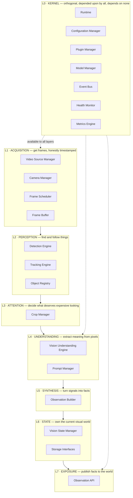
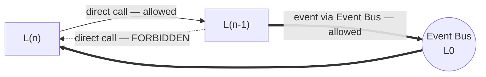
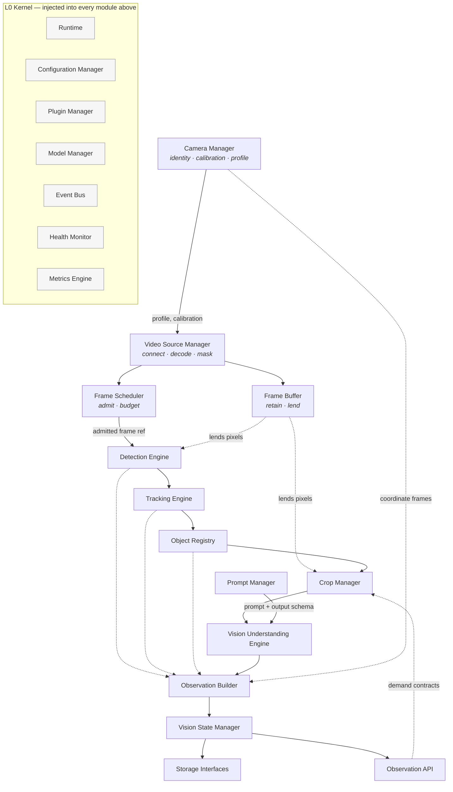
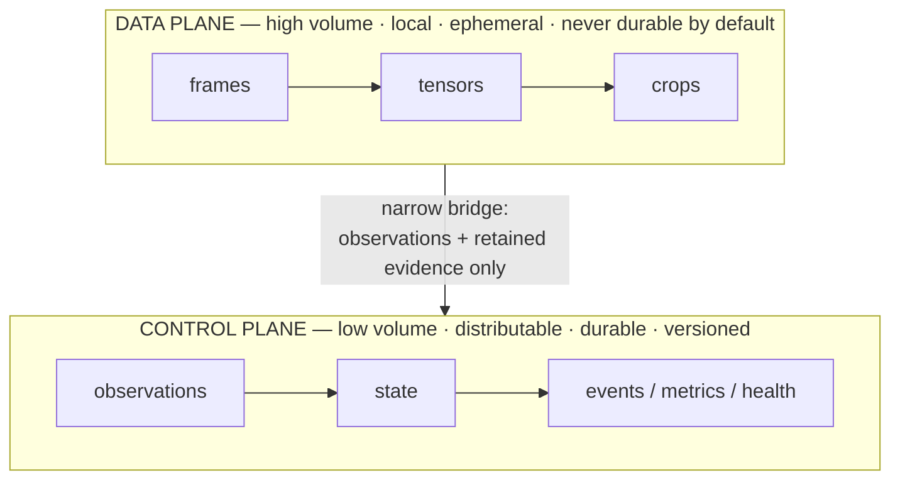
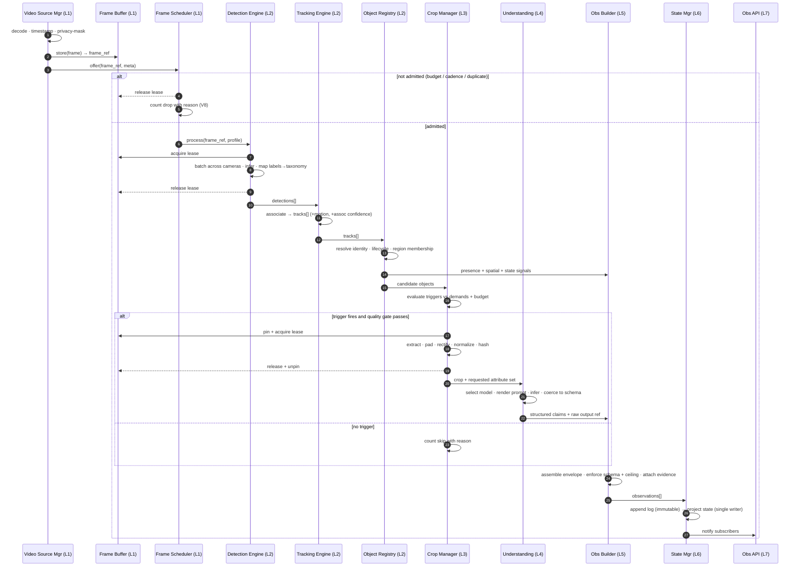
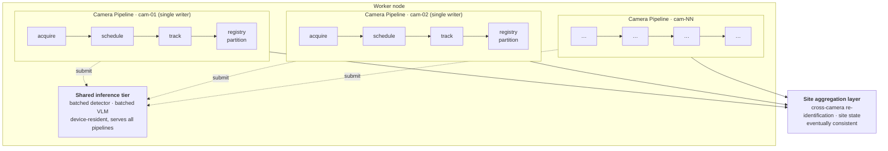

# UnityWorks Vision OS (UWV)

## Phase 1 — Layered Architecture, Dependency Graph & Data Flow

| | |
|---|---|
| **Status** | Architecture Blueprint — Phase 1 (Design Only) |
| **Prerequisite** | `00_PLATFORM_CHARTER.md` |
| **Defines** | Layer stack, dependency law, data/control plane split, end-to-end data flow, sharding model |

---

## Table of Contents

- [1. The Layer Stack](#1-the-layer-stack)
- [2. The Dependency Law](#2-the-dependency-law)
- [3. Module-Level Dependency Graph](#3-module-level-dependency-graph)
- [4. The Two-Plane Model](#4-the-two-plane-model)
- [5. End-to-End Data Flow](#5-end-to-end-data-flow)
- [6. The Sharding Model](#6-the-sharding-model)
- [7. Communication Modes](#7-communication-modes)
- [8. Cross-Cutting Concerns Placement](#8-cross-cutting-concerns-placement)

---

# 1. The Layer Stack

UWV is organized as **seven flow layers** over **one orthogonal kernel**. The flow layers describe the
journey from photons to published facts. The kernel is available to every layer and depends on none.



### 1.1 Layer responsibilities and the one-sentence test

Every layer must survive a one-sentence responsibility statement. If a layer needs "and" to describe
itself, it is two layers.

| Layer | Single responsibility | Owns | Explicitly not responsible for |
|---|---|---|---|
| **L0 Kernel** | Assemble, configure, observe, and keep alive everything else. | Process lifecycle, config, plugins, model artifacts, events, health, metrics | Any knowledge of vision |
| **L1 Acquisition** | Produce a correctly-identified, correctly-timestamped, policy-masked frame stream. | Connections, decode, timestamps, admission, buffers | What is in the frame |
| **L2 Perception** | Establish *what things exist and which are the same thing over time*. | Detections, tracks, object identity & lifecycle | What those things are like |
| **L3 Attention** | Decide what is worth expensive analysis and prepare defensible input for it. | Trigger policy, crop extraction, quality gating, budget | Performing the analysis |
| **L4 Understanding** | Convert a region of pixels into structured, schema-conformant claims. | Model invocation, prompts, output coercion | Whether the claim was worth making |
| **L5 Synthesis** | Assemble complete, explainable, ceiling-compliant observations. | Envelope assembly, schema & ceiling enforcement, lineage | Storing or publishing them |
| **L6 State** | Own and durably project the current visual world. | Vision State, observation log, retention | Interpreting the world |
| **L7 Exposure** | Serve state and observations to consumers, safely and under contract. | Query, subscription, demand intake, authz | Producing anything |

### 1.2 Why these seven and not fewer

Three boundaries in this stack are frequently collapsed by other systems, always with the same
consequences.

- **L2 / L3 (perception vs attention).** Systems that fuse these end up invoking heavy models from
  inside the tracker, which makes cost proportional to frame rate and makes both components
  untestable. Separating them makes "when to spend money" a policy with its own tests.
- **L4 / L5 (understanding vs synthesis).** Systems that let the model output *become* the output
  publish whatever the VLM said, including hallucinated fields and business-flavored prose. A
  synthesis layer that owns schema and ceiling enforcement is the only durable defense of V1 and V4.
- **L6 / L7 (state vs exposure).** Systems that serve state directly from their working structures
  cannot change those structures, cannot version their API, and cannot enforce tenant scoping. The
  split lets internal representation evolve while the contract holds.

---

# 2. The Dependency Law

> **Flow layers may depend downward only. No flow layer may call upward. The kernel may be called by
> all and calls none. Everything that must travel upward travels as an event.**



### 2.1 The four permitted dependency forms

| Form | Direction | Mechanism | Example |
|---|---|---|---|
| **Downward call** | L(n) → L(n−1) | Direct, synchronous or async, via port interface | L3 Crop Manager asks L1 Frame Buffer for a retained frame |
| **Kernel call** | any → L0 | Direct, via injected kernel service | L4 asks the Model Manager for a loaded handle |
| **Upward notification** | L(n) → L(n+k) | Event Bus publish/subscribe | L1 publishes `StreamLost`; L6 marks partition blind |
| **Sideways within layer** | L(n) → L(n) | Direct, but only along the declared intra-layer order | L2 Tracking consumes L2 Detection output |

### 2.2 Forbidden by construction

- **No upward call.** The Detection Engine cannot ask the Vision State Manager anything. If detection
  needs context (e.g. "which regions are active"), that context is *injected as configuration* or
  *carried on the frame envelope*, never fetched upward.
- **No lateral reach into internals.** Modules interact through published interfaces only. A module
  that needs another module's private structure is a design error, not an access problem.
- **No kernel knowledge of vision.** The Event Bus does not know what a detection is. The Model
  Manager does not know what a detector is — it knows *artifacts, devices, and handles*. This keeps L0
  reusable by future UnityWorks platforms (Audio OS, Sensor OS) unchanged.

### 2.3 The consequence that matters

Because dependencies point one way, **every layer can be tested with the layer below replaced by a
fake**, and **every layer can be run without the layers above existing at all**. L1+L2 alone is a
working detection-and-tracking system. L1–L5 alone is a working observation producer with no state.
This is the practical meaning of "independently testable," and it falls out of the dependency law
rather than requiring separate effort.

---

# 3. Module-Level Dependency Graph



### 3.1 Reading the graph

- **Solid arrows** are the primary flow: each stage's output is the next stage's input.
- **Dotted arrows to the Observation Builder** are the critical structural point from
  `00_PLATFORM_CHARTER.md` §3.3: *detection, tracking, and registry results become observations
  without passing through understanding.* Understanding is enrichment, not a toll gate.
- **`Frame Buffer` lends pixels** rather than passing them. Detection and cropping receive a *reference
  plus a lease*, not a copy (see [§4.3](#43-the-lease-protocol)).
- **`Observation API → Crop Manager`** is the only "backward-looking" edge, and it is not a call: the
  API accepts demand contracts, which the Configuration/demand registry publishes as an event that the
  Crop Manager's trigger policy reads. Consumers influence *what is computed* without ever invoking a
  pipeline stage.

### 3.2 The acyclic guarantee

The graph is a DAG. There is exactly one place where a cycle could form — demand contracts flowing
back toward attention — and it is broken deliberately by making that path **asynchronous and
declarative**: the API writes a demand record; the Crop Manager reads demand state at trigger time.
No call ever returns through the pipeline it entered.

---

# 4. The Two-Plane Model

This is the decision that makes 1 → 100 → 1000 cameras a scaling exercise rather than a redesign.



### 4.1 Plane characteristics

| Property | Data plane | Control plane |
|---|---|---|
| **Volume** | 10²–10⁴ MB/s per node | 10⁰–10² KB/s per node |
| **Lifetime** | Milliseconds to seconds | Days to years |
| **Locality** | Node-local, ideally device-local | Cluster-wide, cross-region |
| **Durability** | None by default | Durable, replicated |
| **Serialization** | Zero-copy, no schema negotiation | Schema-versioned, wire-stable |
| **On failure** | Drop and count | Retry and persist |
| **Crosses the network?** | Only under explicit policy | Always |

### 4.2 The narrow bridge

The only things permitted to cross from data plane to control plane:

1. **Observations** — small, structured, schema-versioned.
2. **Retained evidence crops** — small images, content-addressed, retained under an explicit policy
   with a TTL and a privacy classification. Never whole frames by default.
3. **Aggregate signals** — metrics, health, quality statistics. Numbers, not pixels.

Everything else stays in the data plane and dies there. This is invariant **V12** made structural: a
100-camera site produces roughly 2 Gb/s of decoded video and roughly 200 Kb/s of observations. Only the
latter number determines what the network, the state store, and the API must handle.

### 4.3 The lease protocol

Because pixels are large and shared between stages, frames are governed by **leases** rather than
ownership.

```text
FrameBuffer.acquire(frame_ref, holder_id, reason) -> FrameLease | Unavailable
FrameLease.pixels()  -> read-only view (no copy)
FrameLease.release() -> returns capacity to the pool
FrameBuffer.pin(frame_ref, ttl, reason)   -> extends retention for late consumers
```

Rules:
- A frame's memory is reclaimable the moment its last lease is released and no pin is active.
- A lease is **read-only**; no stage may mutate shared pixels. Stages needing a transformed image
  (resize, colour convert, rectify) allocate their own output from a pooled allocator.
- A lease has a **deadline**. A stage that holds past its deadline is reported unhealthy and its lease
  is force-broken, because one slow consumer must not exhaust a shared pool (V9).
- `pin` is how the Crop Manager keeps a frame alive long enough to crop it after the detector has moved
  on, and how a debug/evidence path retains a frame past normal reclamation.

This protocol is why a 100-camera node does not need 100× the memory of a 1-camera node: buffer
capacity is a function of *pipeline depth and jitter*, not of camera count.

---

# 5. End-to-End Data Flow

### 5.1 The full path of one admitted frame



### 5.2 What flows on each edge

| Edge | Payload | Size | Plane |
|---|---|---|---|
| Source → Buffer | Decoded frame pixels | 1–12 MB | Data |
| Source → Scheduler | Frame reference + metadata | ~200 B | Control |
| Scheduler → Detection | Frame reference + pipeline profile | ~300 B | Control |
| Buffer ↔ Detection/Crop | Read-only pixel lease | 0 (no copy) | Data |
| Detection → Tracking | Detections (box, class, score, quality) | ~1 KB | Control |
| Tracking → Registry | Tracks (+ association metadata) | ~2 KB | Control |
| Registry → Crop | Candidate object references | ~1 KB | Control |
| Crop → Understanding | Crop tensor + attribute request | 50–500 KB | Data |
| Understanding → Builder | Structured claims + raw output reference | ~3 KB | Control |
| Builder → State | Observations | ~2–8 KB | Control |
| State → API | Observations / state deltas | ~2–8 KB | Control |

The table is the architecture's cost model in miniature: **every megabyte-scale edge is node-local and
every network-crossing edge is kilobyte-scale.**

### 5.3 The three flow variants

Not all inputs behave alike, and the platform declares this explicitly as **source semantics**.

| Variant | Source semantics | Scheduling | Backpressure | Determinism |
|---|---|---|---|---|
| **Live stream** (RTSP, camera, future drone/mobile) | `realtime` | Wall-clock cadence; frames dropped to meet budget | `drop_oldest` — latency is protected, completeness is not | Not reproducible |
| **Archival file** (video file, recorded export) | `archival` | Driven by frame PTS on a virtual clock | `block` — completeness is protected, latency is not | Fully reproducible |
| **Discrete image** (single image, image batch) | `discrete` | One-shot, immediate | `block` | Fully reproducible |

This single property changes the behaviour of the Scheduler, the Buffer, and the Runtime clock, and it
is the mechanism by which the same pipeline serves production streaming and deterministic replay
testing (V13). Nothing else in the platform branches on it.

---

# 6. The Sharding Model

### 6.1 The unit of parallelism

> **The unit of parallelism is the Camera Pipeline — one logical, shared-nothing flow per camera
> stream epoch.**

Everything per-camera is single-writer: its tracks, its object registry partition, its state
partition. This removes almost all locking from the hot path and makes reasoning about correctness
tractable. Cross-camera concerns are a *separate, explicitly eventually-consistent layer*.



### 6.2 The critical inversion

A naive design gives each camera its own model instance. That fails at 10 cameras: GPU memory is
consumed by duplicate weights and utilization collapses because each instance runs batch size 1.

UWV inverts this. **Camera pipelines are logical flows; models are shared physical services.** Frames
from many pipelines are gathered into a batch by the inference tier, executed once, and scattered back.
The pipeline code is identical whether the detector is in-process on the same GPU, in a sibling
process, or on a remote inference server — because it sits behind a port
(`06_PORTS_AND_ADAPTERS.md`).

This is the concrete mechanism behind "1, 10, or 100 cameras without redesign":

| Scale | Camera pipelines | Inference tier | State | Deployment |
|---|---|---|---|---|
| **1 camera** | 1 logical flow, in-process | In-process, batch 1 | In-memory | Single process |
| **10 cameras** | 10 logical flows, one process | In-process, batch 8–16, one GPU | In-memory + local durable | Single node |
| **100 cameras** | 100 flows over N worker processes | Dedicated inference processes/servers, batch 32–64, M GPUs | Partitioned, replicated store | Cluster |
| **1000 cameras** | Flows over K nodes, sharded by site | Inference clusters per zone | Sharded by site, federated query | Multi-node, multi-site |

No module's responsibilities change across these rows. What changes is the *adapter* behind three
ports (inference transport, state store, event bus) and the *placement* declared in configuration.

### 6.3 Cross-camera concerns

Anything requiring more than one camera is explicitly placed in the **site aggregation layer** and
explicitly declared eventually consistent:

- **Cross-camera re-identification** — the same person seen by cam-01 and cam-04. This produces
  *identity assertions with confidence* that link object IDs; it never rewrites history (V5, V10).
- **Site state** — the union of camera partitions, plus coverage and blindness maps (V8).
- **Global object identity** — object IDs are site-scoped; the registry partition that first admitted
  an object owns it.

Keeping this layer separate is what allows a 1-camera deployment to omit it entirely and a 400-camera
city deployment to scale it independently.

---

# 7. Communication Modes

Four modes exist. Choosing the wrong one is the most common way a layered architecture rots.

| Mode | Use when | Coupling | Backpressure | Example |
|---|---|---|---|---|
| **Direct call (downward)** | Caller needs the result to proceed | Compile-time on the *interface* | Natural (caller waits) | Crop Manager → Frame Buffer |
| **Bounded queue (stage handoff)** | Stages run at different rates | Runtime, decoupled | Explicit policy per queue | Detection → Tracking |
| **Event (upward / broadcast)** | Others may care, but the producer must not know who | None | Bounded fan-out buffers, drop-with-counter | `StreamLost`, `ModelSwapped`, `BudgetExceeded` |
| **Shared read-only projection** | Many readers need current truth cheaply | None (readers can't write) | N/A (immutable snapshots) | Vision State snapshot → API |

### 7.1 The queue discipline

Every inter-stage queue in the platform declares four properties in configuration, and none may be
implicit:

```text
queue:
  capacity          : bounded, never unbounded
  overflow_policy   : drop_oldest | drop_newest | block | conflate | spill
  overflow_signal   : event + counter, always emitted, never silent
  deadline          : per-item; expired items are dropped and counted
```

An unbounded queue is a memory leak with a delayed fuse and is forbidden by construction. A silent
drop is a V8 violation. These two rules eliminate the two most common causes of long-running vision
system failure.

---

# 8. Cross-Cutting Concerns Placement

Cross-cutting concerns are where layered architectures leak. Each is assigned exactly one home.

| Concern | Home | Why there, and nowhere else |
|---|---|---|
| **Configuration** | L0 Configuration Manager, injected | Modules receive validated, typed config objects. No module reads environment or files directly, so every module is constructible in a test with a literal config. |
| **Model artifacts & devices** | L0 Model Manager | Detection and Understanding *use* models; they never load, version, place, or evict them. This is what allows hot model swap and GPU arbitration to be solved once. |
| **Prompts** | L4 Prompt Manager | Prompts are versioned assets tightly coupled to output schemas, so they live beside the engine that renders them — but they are *assets*, deployable without a release. |
| **Identity of things** | L2 Object Registry | Exactly one module may mint or retire an object identity. Diffusing this is how ID chaos begins. |
| **Time normalization** | L1 Camera Manager (policy) + L1 Video Source Manager (application) | Timestamps must be normalized at the earliest possible point, before any downstream component can accidentally use wall-clock. |
| **Coordinate normalization** | L1 (to normalized image space) + L5 (to world space, using calibration) | Normalized image coordinates are cheap and must be universal; world projection requires calibration and belongs where evidence is assembled. |
| **Privacy masking** | L1 Video Source Manager, immediately post-decode | The earliest point at which pixels exist. Masking anywhere later means some component saw unmasked pixels, which is a compliance failure regardless of intent. |
| **Schema & ceiling enforcement** | L5 Observation Builder | One choke point through which every fact must pass. Enforcement distributed across producers is enforcement that will be bypassed. |
| **Authorization & tenancy** | L7 Observation API | The only place external identity exists. Lower layers operate on already-scoped data. |
| **Retention & erasure** | L6 Storage Interfaces | Retention is a property of durable things; nothing ephemeral needs a policy. |
| **Health & metrics** | L0, but *emitted* by every module | Modules report; the kernel aggregates. A module that computes its own health verdict cannot be composed. |
| **Backpressure** | The queue between stages, per [§7.1](#71-the-queue-discipline) | Backpressure is a property of a connection, not of a component. |

### 8.1 The injection rule

> **No module constructs its own dependencies.** Every module receives its ports, its configuration
> slice, its clock, its metric sink, and its event publisher through constructor injection.

Three consequences, all of them the point:

1. **Every module is testable in isolation** with fakes, without a GPU, camera, or network.
2. **Every module is replaceable in place**, because nothing downstream knows what it was given.
3. **The clock is injectable**, which is the single prerequisite for deterministic replay (V13) — a
   module that calls the system clock directly can never be replayed, and no amount of test
   infrastructure fixes it afterward.

---

## Where to go next

| Question | Document |
|---|---|
| What exactly flows on these edges? | `02_VISION_OBJECT_MODEL.md` |
| What does each module in the graph do? | `03`, `04`, `05` module specifications |
| How are the shared inference tiers abstracted? | `06_PORTS_AND_ADAPTERS.md` |
| How do threads, queues, and the virtual clock work? | `08_RUNTIME_AND_THREADING.md` |
| How does this deploy at each scale? | `13_DEPLOYMENT_ARCHITECTURE.md` |
