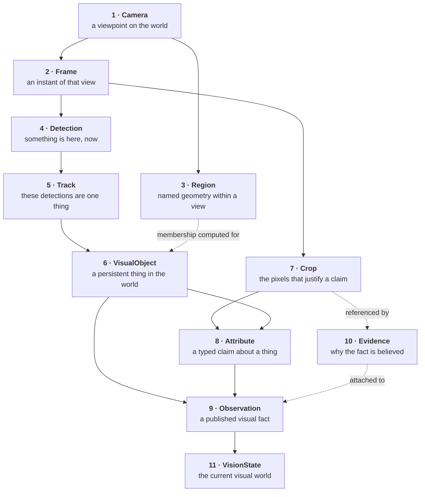
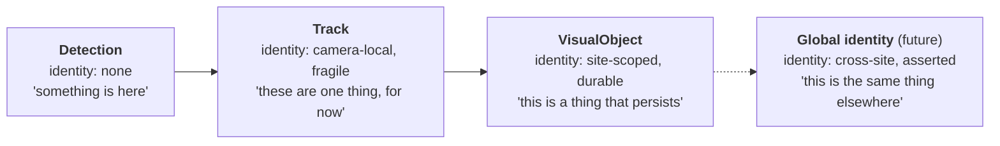
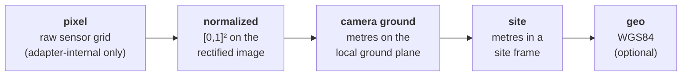
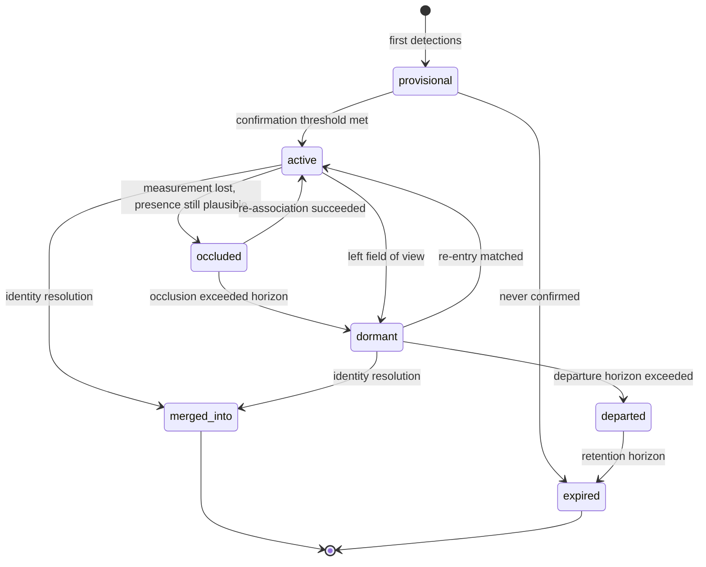

# UnityWorks Vision OS (UWV)

## Phase 1 — The Vision Object Model (VOM)

| | |
|---|---|
| **Status** | Architecture Blueprint — Phase 1 (Design Only) |
| **Prerequisite** | `00_PLATFORM_CHARTER.md`, `01_LAYERED_ARCHITECTURE.md` |
| **Defines** | The closed ontology, identity model, time model, space model, confidence model, observation envelope |
| **Stability** | **Highest in the platform.** These are the contracts the next decade integrates against. |

> Notation in this document is **contract notation**, not code. It describes shape and meaning. It is
> deliberately language-neutral and implies no serialization format, framework, or type system.

---

## Table of Contents

- [1. Why an Object Model](#1-why-an-object-model)
- [2. The Closed Ontology](#2-the-closed-ontology)
- [3. The Universal Substrate](#3-the-universal-substrate)
- [4. The Identity Model](#4-the-identity-model)
- [5. The Time Model](#5-the-time-model)
- [6. The Space Model](#6-the-space-model)
- [7. The Confidence Model](#7-the-confidence-model)
- [8. The Visual Taxonomy](#8-the-visual-taxonomy)
- [9. The Attribute Schema Registry](#9-the-attribute-schema-registry)
- [10. Object Specifications](#10-object-specifications)
- [11. The Observation Envelope](#11-the-observation-envelope)
- [12. Schema Evolution Rules](#12-schema-evolution-rules)

---

# 1. Why an Object Model

A vision platform's lifespan is determined by its vocabulary. Models change every few months;
*nouns* change every few decades. If the platform's nouns are drawn from the current model generation —
"YOLO detection," "ByteTrack track," "VLM response" — the platform dies with that generation. If the
nouns are drawn from the *problem* — a thing was seen here, at this moment, and here is why we believe
it — the platform outlives every model inside it.

This document fixes those nouns. Three properties are non-negotiable:

1. **Closed.** A fixed set of object kinds. New capabilities add *instances and attributes*, never new
   kinds. If a proposal seems to need a new kind, it is almost always a specialization of an existing
   one; each specification's *Future Evolution* section says how.
2. **Model-agnostic.** No field exists because a particular model family produces it. Anything
   model-specific lives in `Evidence` as opaque, inspectable payload.
3. **Explainable by construction.** Every assertion carries the provenance that justifies it. There is
   no field in this model that can be true "just because."

---

# 2. The Closed Ontology

Eleven object kinds. That is the complete vocabulary of the platform.



| # | Kind | One-line definition | Lifetime | Mutable? |
|---|---|---|---|---|
| 1 | **Camera** | A configured, calibrated viewpoint with a stable identity. | Deployment lifetime | Versioned config |
| 2 | **Frame** | One decoded instant from a source, with normalized time and provenance. | Milliseconds–seconds | Immutable |
| 3 | **Region** | Named geometry within a camera view or on a ground plane. | Deployment lifetime | Versioned config |
| 4 | **Detection** | An assertion that a taxonomy class occupies a location in one frame. | One frame | Immutable |
| 5 | **Track** | An assertion that a sequence of detections is one continuous thing, within one camera. | Seconds–minutes | Append-only |
| 6 | **VisualObject** | A persistent identity for a thing in the world, spanning tracks and (later) cameras. | Minutes–hours | State machine |
| 7 | **Crop** | A content-addressed, quality-graded region of pixels extracted to justify a claim. | Ephemeral or retained as evidence | Immutable |
| 8 | **Attribute** | A typed, schema-registered, evidenced claim about a VisualObject. | Has validity window | Superseded, never edited |
| 9 | **Observation** | The published unit of visual fact. | Permanent (subject to retention) | **Immutable (V5)** |
| 10 | **Evidence** | The provenance and raw material behind an Observation. | Bound to its Observation | Immutable |
| 11 | **VisionState** | The materialized projection of current visual truth. | Continuous | Single-writer projection |

### 2.1 The amendment rule

The ontology is closed. Adding a twelfth kind requires demonstrating that the candidate is not an
instance, specialization, or attribute of the existing eleven, and requires a major version of the
Vision Object Model with a migration window. In practice, the answer to "we need a new kind" has been,
in every case examined during design:

| Apparent new kind | Actually |
|---|---|
| "Event" (a door opened) | A change in an `Attribute` on a `VisualObject`, published as an `Observation` |
| "Zone occupancy" | A derived query over `VisualObject` × `Region` membership |
| "Interaction" (person holding tray) | A `relation`-typed `Attribute` on a `VisualObject` referencing another |
| "Face" / "License plate" | A `VisualObject` with a `part_of` relation, or an `Attribute` on its parent |
| "Anomaly" | Out of bounds — a judgment, rejected by the Semantic Ceiling (V1) |
| "Alert" | Out of bounds — business, rejected by V1 |
| "Scene" | A `Camera` plus the current `VisionState` partition for it |
| "Trajectory" | The spatial history of a `VisualObject`, already held in state history |

---

# 3. The Universal Substrate

Every object kind carries the same base. This uniformity is what allows the kernel, storage,
event bus, and API to handle all of them without knowing what any of them are.

```text
Substrate:
  id            : UID              # globally unique, time-sortable (see §4.1)
  kind          : ObjectKind       # one of the eleven
  schema_version: SemVer           # version of THIS object's schema
  tenant_id     : TenantId         # hard isolation boundary
  site_id       : SiteId           # deployment grouping
  created_at    : PlatformTime     # see §5
  provenance    : Provenance       # who asserted this
  confidence    : Confidence?      # see §7; absent where not meaningful
  lineage       : UID[]            # objects this was derived from
  labels        : Map<string,string>  # opaque operational tags, never interpreted
```

```text
Provenance:
  producer_module   : ModuleId          # e.g. "detection_engine"
  producer_version  : SemVer            # platform module version
  adapter_id        : AdapterId?        # e.g. "detector.yolo"
  adapter_version   : SemVer?
  model_id          : ModelId?          # registry identity, not a filename
  model_version     : SemVer?
  model_artifact_hash: Hash?            # exact weights that produced this
  prompt_id         : PromptId?
  prompt_version    : SemVer?
  config_revision   : Revision          # exact config that governed this
  deterministic     : bool              # was this produced in deterministic mode
```

**Why `model_artifact_hash` and `config_revision` are mandatory and not optional.** Six months after
deployment, someone will ask why the platform said what it said on a specific day. Without the exact
weights and the exact configuration, that question is unanswerable, and every regression investigation
becomes archaeology. These two fields are the difference between a platform that can be debugged and
one that can only be argued about (V4, V13).

**`labels` are opaque.** They exist for operations (`rack=A3`, `install_batch=2026Q1`). No platform
logic may branch on a label. This is the pressure valve that stops operational metadata from becoming
domain logic in disguise (V2).

---

# 4. The Identity Model

Identity is where vision systems most often accumulate permanent, invisible corruption. UWV addresses
it with **layered identity**: four distinct notions, never conflated (V10).



| Layer | Identifier | Scope | Stability | Who mints it |
|---|---|---|---|---|
| Detection | none (positional) | one frame | n/a | Detection Engine |
| Track | `TrackId` | one camera, one tracker epoch | **Fragile** — breaks on occlusion, ID-switches | Tracking Engine |
| Object | `ObjectId` | one site | **Durable** — survives track breaks, re-entry | Object Registry (sole authority) |
| Global | `GlobalIdentityAssertion` | cross-site / cross-time | Asserted with confidence, revisable | Site aggregation (Phase 2+) |

### 4.1 Identifier construction

```text
TenantId     : opaque string, assigned at provisioning
SiteId       : opaque string, unique within tenant
CameraId     : opaque string, unique within site — STABLE FOR LIFE
StreamEpoch  : monotonic integer per camera; +1 on every (re)connect or reconfigure
FrameSeq     : monotonic integer within a stream epoch, starting at 0

FrameRef     : (CameraId, StreamEpoch, FrameSeq)     # globally unique, totally ordered per camera
TrackId      : (CameraId, TrackerEpoch, LocalTrackId)
ObjectId     : ULID, site-scoped                      # time-sortable, no coordination needed
ObservationId: ULID                                   # time-sortable
CropId       : content hash of the normalized crop pixels
```

**Why `StreamEpoch` exists.** Every RTSP source eventually reconnects, and every naive implementation
restarts frame numbering at zero. Downstream, frame 100 from before the reconnect and frame 100 after
it are different instants that compare equal — producing time travel in state, corrupted tracks, and
observations that reference the wrong pixels. The epoch makes reconnection explicit and makes
`FrameRef` genuinely unique for the deployment's lifetime. This single field eliminates an entire class
of bug that is otherwise found in production, months later, by accident.

**Why `CropId` is a content hash.** The same pixels cropped twice must be one crop. Content addressing
gives free deduplication, free cache keys, free integrity checking, and a stable evidence reference
that survives storage migration.

**Why `ObjectId` is a ULID rather than a sequence.** Object identity must be mintable by any partition
on any node without coordination, and must sort by creation time for efficient range queries. A central
sequence would make the registry a distributed bottleneck at exactly the scale where it must not be.

### 4.2 The identity assertion principle

> **An identity link is an assertion with confidence and evidence, never an assumed truth.**

When the registry decides that track `T-88` continues object `O-14` after an eight-second occlusion,
that is a *claim*, and it is recorded as one — with the method that produced it (motion continuity,
appearance embedding distance, region entry/exit consistency), its confidence, and its evidence.

Two consequences:

- **Revision is normal, not exceptional.** If later evidence contradicts the link, a new assertion
  supersedes it. History is never rewritten (V5); the correction is a new fact with `lineage` pointing
  at what it supersedes.
- **Consumers can filter by identity confidence.** A consumer counting unique visitors can require
  high-confidence identity; one drawing a live overlay can accept low. The platform does not choose for
  them, because the right threshold is a business decision (V1).

---

# 5. The Time Model

Multi-camera perception is impossible without a rigorous, honest time model. Most systems have one
timestamp and quietly lie with it.

### 5.1 The four timestamps

```text
FrameTime:
  pts           : SourceTicks     # presentation timestamp from the source, monotonic within epoch
  t_capture     : UTCInstant      # best estimate of when photons arrived
  t_capture_unc : Duration        # +/- uncertainty on t_capture — MANDATORY
  t_ingest      : UTCInstant      # when the platform received the frame
  t_decoded     : UTCInstant      # when the frame became pixels
  clock_quality : ClockQuality    # how much to trust t_capture
```

```text
ClockQuality:
  PTP_LOCKED    # sub-millisecond; hardware-synchronized
  NTP_SYNCED    # single-digit milliseconds
  RTCP_DERIVED  # derived from RTSP sender reports; tens of milliseconds
  ESTIMATED     # inferred from arrival time minus modelled latency; hundreds of ms
  UNKNOWN       # no basis; t_capture equals t_ingest and MUST NOT be fused across cameras
```

### 5.2 The rules

1. **Every observation carries `t_capture` and its uncertainty.** A timestamp without uncertainty is a
   claim to precision the system does not have.
2. **Cross-camera fusion requires compatible clock quality.** The site layer refuses to fuse timelines
   whose combined uncertainty exceeds the phenomenon's timescale, and says so, rather than producing a
   confident wrong answer.
3. **Ordering within a camera uses `pts`; ordering across cameras uses `t_capture`.** These are
   different operations and are never mixed.
4. **Wall-clock time is never read by a module.** All time comes from an injected clock. In
   deterministic mode the clock is virtual and driven by frame PTS, which is what makes replay
   reproducible (V13) and what makes a 12-hour soak test runnable in 20 minutes.
5. **Duration is computed from `t_capture`, never from processing time.** A dwell of 45 s means the
   object was present for 45 s in the world, regardless of whether the platform was keeping up.

### 5.3 Why uncertainty is a first-class field

Consider a hospital deployment asking whether a person entered a room before or after an event on
another camera. With `t_capture_unc = ±20 ms`, the answer is sound. With `±800 ms` (a common reality
for cheap RTSP cameras over congested networks), the ordering is unknowable — and a platform that
returns an ordering anyway has manufactured a fact. UWV publishes the uncertainty so consumers can
distinguish "A then B" from "A and B, order unknown." This is invariant V11 applied to time, and it is
the difference between a platform trusted in regulated environments and one that is not.

---

# 6. The Space Model

### 6.1 The coordinate stack



| Frame of reference | Units | Requires | Always available? | Purpose |
|---|---|---|---|---|
| `pixel` | pixels | nothing | adapter-internal | Never leaves an adapter |
| `normalized` | [0,1] on rectified image | lens model (optional) | **Yes — universal** | The one coordinate every observation carries |
| `camera_ground` | metres | homography calibration | If calibrated | Real distances, speeds, dwell areas |
| `site` | metres | site transform per camera | If site-calibrated | Multi-camera fusion, floor plans |
| `geo` | lat/lon/alt | geo-referencing | Rarely | Smart city, drone |

### 6.2 The rules

1. **Normalized image coordinates are mandatory and universal.** Every spatial value in every
   observation carries them. They are resolution-independent, which means changing a camera's
   resolution or a pipeline's inference scale does not invalidate historical data.
2. **Pixel coordinates never escape an adapter.** A detector adapter receives whatever tensor layout it
   wants and returns normalized coordinates. This is what makes detectors interchangeable when they
   disagree about letterboxing, stride, and origin conventions — a notorious source of silent, subtle
   box misalignment.
3. **Every spatial value declares its `frame_of_reference` and `calibration_id`.** A metre measurement
   without the calibration that produced it is unverifiable and unreproducible when the camera is
   later re-calibrated or physically nudged.
4. **Calibration is versioned; observations pin the version.** When a camera is re-calibrated, old
   observations remain interpretable under their original calibration. Re-projecting history is an
   explicit, offline operation that produces *new* observations with lineage (V5).

```text
SpatialInfo:
  frame_of_reference : normalized | camera_ground | site | geo
  calibration_id     : CalibrationId?      # required for non-normalized frames
  bbox               : Box?                # axis-aligned, normalized
  rotated_bbox       : OrientedBox?        # when the adapter supports it
  mask_ref           : MaskRef?            # reference, never inline pixels
  keypoints          : Keypoint[]?         # taxonomy-defined skeleton, if any
  ground_point       : Point?              # projected contact point with the ground
  ground_uncertainty : Ellipse?            # projection error — MANDATORY when ground_point present
  region_membership  : RegionMembership[]  # see §10.3
  image_quality      : QualityGrades       # occlusion, truncation, blur, exposure, scale
```

**`ground_uncertainty` is mandatory whenever `ground_point` is present.** Homography projection error
grows sharply with distance and with the object's deviation from the ground plane. A projected position
without its error ellipse invites consumers to compute distances and speeds that are confidently wrong
at the far end of the view — the single most common failure of "analytics" built on uncalibrated
projection.

---

# 7. The Confidence Model

Confidence is the most abused field in computer vision. A YOLO objectness score, a tracker association
cost, and a VLM's self-reported certainty are three incomparable quantities that every system stuffs
into one float named `confidence` and then compares.

### 7.1 The structure

```text
Confidence:
  value        : float[0,1]
  semantics    : ConfidenceSemantics    # what the number means
  calibrated   : bool                   # has it been mapped to a probability?
  calibration_id: CalibrationId?        # which calibration mapping was applied
  raw_score    : float?                 # the model's original output, always preserved
```

```text
ConfidenceSemantics:
  DETECTION_PRESENCE     # P(an object of this class is present here)
  CLASSIFICATION         # P(class | object present)
  ASSOCIATION            # P(this detection continues this track)
  IDENTITY               # P(this track is this object)
  ATTRIBUTE              # P(this attribute claim is true)
  SELF_REPORTED          # the model said so about itself — WEAKEST, never comparable
```

### 7.2 The rules

1. **Uncalibrated scores are never compared across models.** The platform marks `calibrated: false` and
   downstream ranking across heterogeneous producers is a contract violation. This is enforced in
   documentation and in the Observation API's query semantics, which refuse cross-model confidence
   ordering unless calibration is present.
2. **`raw_score` is always preserved.** Calibration mappings improve over time; retaining the raw score
   means historical observations can be re-calibrated without re-running inference.
3. **`SELF_REPORTED` confidence from a VLM is recorded but structurally distrusted.** It is a language
   model's opinion about itself and is not a probability. It may be surfaced; it may never be the sole
   basis for a platform decision such as a trigger or a quality gate.
4. **Calibration is a platform capability, not a model capability.** The Model Manager holds calibration
   profiles (e.g. temperature scaling or isotonic mappings fitted on a validation set per model, per
   site). A new detector gains calibrated confidence by fitting a profile, not by being trusted.

**Why this matters over ten years.** A consumer that wrote `if confidence > 0.7` against a 2026
detector will silently change behaviour when a 2029 detector with different score distribution is
swapped in — unless confidence means the same thing across both. Calibration semantics are what make
the *contract* stable while the *models* churn, and they are the reason a model swap does not require
every consumer to re-tune.

---

# 8. The Visual Taxonomy

### 8.1 The problem

Detector A emits COCO's 80 classes. Detector B emits Open Images' 600. Detector C is a custom
fine-tune emitting `pallet`, `forklift`, `carton`. If those label spaces reach the pipeline, every
downstream component and every consumer is coupled to the current model choice, and swapping detectors
becomes a data migration.

### 8.2 The solution

> **The platform owns a versioned Visual Taxonomy. Model-native label spaces are an adapter concern
> and never escape the adapter.**

```text
TaxonomyClass:
  class_id        : ClassId          # stable, e.g. "person", "vehicle.forklift"
  parent          : ClassId?         # hierarchical: vehicle.forklift ISA vehicle
  taxonomy_version: SemVer
  geometry_kinds  : [box, mask, keypoints, oriented_box]   # what may be asserted about it
  keypoint_schema : KeypointSchema?  # if the class supports keypoints
  status          : active | deprecated | superseded_by(ClassId)
```

```text
TaxonomyMapping:                       # owned by the adapter, validated by the platform
  adapter_id      : AdapterId
  model_id        : ModelId
  entries         : [ (native_label, ClassId, mapping_confidence, notes) ]
  unmapped_policy : drop | emit_as_unknown
  coverage_report : which platform classes this model can and cannot produce
```

### 8.3 The rules

1. **Hierarchical, so specificity can vary by model.** A generic detector emits `vehicle`; a
   specialized one emits `vehicle.forklift`. A consumer asking for `vehicle` matches both. This is what
   allows a model upgrade to *increase* specificity without breaking existing queries.
2. **Mappings declare coverage explicitly.** The platform knows, and publishes, which taxonomy classes
   the currently loaded models can produce. A consumer demanding `person.child` from a site whose
   detector cannot distinguish it gets an explicit *capability gap*, not silence (V8). Silence
   interpreted as absence is the failure mode this rule exists to prevent.
3. **Classes are deprecated, never deleted.** Historical observations must remain interpretable.
   `superseded_by` allows queries to follow renames forward.
4. **The taxonomy is domain-neutral.** `person`, `vehicle.forklift`, `container.tray` are visual kinds
   any observer would name. `staff_member`, `patient`, `customer` are *roles* — rejected under V1,
   because no crop evidences a role. A consumer assigns roles from observations plus its own knowledge.

### 8.4 Extension without redesign

Adding a vertical means adding taxonomy *entries and mappings* — configuration and model artifacts. The
warehouse profile adds `vehicle.forklift`, `container.pallet`, `container.carton`. The hospital profile
adds `furniture.bed`, `equipment.iv_pole`, `equipment.wheelchair`. No module changes. This is invariant
V2 made concrete, and it is the specific mechanism behind the charter's claim of six verticals from one
platform.

---

# 9. The Attribute Schema Registry

Attributes are where a VLM's unbounded output meets the platform's need for typed, queryable, ceiling-
compliant facts. The registry is the enforcement point.

```text
AttributeSchema:
  key                : AttributeKey        # e.g. "posture", "carrying", "headwear_present"
  value_type         : enum | bool | scalar | vector | text | relation | count
  domain             : allowed values / range / unit / referent class
  applies_to         : ClassId[]           # which taxonomy classes may carry it
  cardinality        : single | multi
  validity           : Duration?           # default staleness horizon
  neutrality_justification : text          # REQUIRED — what visible evidence supports this
  evidence_requirement: crop | frame | sequence
  version            : SemVer
  status             : active | deprecated
```

### 9.1 The neutrality gate

`neutrality_justification` is not documentation. It is the registration gate that operationalizes the
Semantic Ceiling (V1). A proposed attribute must name the *visible evidence* that supports it.

| Proposed | Justification offered | Verdict |
|---|---|---|
| `headwear_present: bool` | "Head region shows a covering" | ✅ Registered |
| `posture: enum{standing,sitting,lying,crouching}` | "Body configuration is directly visible" | ✅ Registered |
| `carrying: relation → ClassId` | "An object is visibly supported by the person" | ✅ Registered |
| `hi_vis_present: bool` | "Torso region shows high-visibility colouring/retroreflection" | ✅ Registered |
| `queue_position: count` | "Ordinal position along a region's principal axis" | ✅ Registered (pure geometry) |
| `is_employee: bool` | "…uniform implies employment" | ❌ Rejected — role, not appearance. Register `uniform_present` instead. |
| `is_compliant: bool` | "…missing helmet is a violation" | ❌ Rejected — policy. Register `helmet_present`. |
| `needs_assistance: bool` | "…they look confused" | ❌ Rejected — judgment with no visual referent. |
| `wait_time_excessive: bool` | "…dwell exceeds threshold" | ❌ Rejected — threshold is business. Platform publishes `dwell_duration`. |

Note the pattern in every rejection and its repair: **the rejected attribute is the accepted one plus a
business premise.** The registry always has a neutral counterpart to offer, which is why enforcing this
gate does not block delivery — it relocates a line of logic to where it belongs.

### 9.2 The attribute instance

```text
Attribute:
  key            : AttributeKey
  schema_version : SemVer
  value          : typed per schema
  confidence     : Confidence               # semantics = ATTRIBUTE or SELF_REPORTED
  observed_at    : PlatformTime
  valid_until    : PlatformTime?            # staleness horizon (V8)
  evidence_ref   : EvidenceRef              # what pixels justify this
  producer       : Provenance
  superseded_by  : ObservationId?           # set when a later observation revises it
```

### 9.3 Unstructured output handling

A VLM asked for `posture` may return prose. The Understanding Engine coerces to schema; what does not
coerce is preserved:

```text
Evidence.unstructured_note : text (bounded)
```

This text is **inspectable but never promoted**. It is not queryable as fact, never enters Vision
State as an attribute, and cannot be filtered on by the API. It exists so that a human debugging an
odd result can see exactly what the model said — which is the practical difference between a
diagnosable platform and one where model behaviour is a black box. It also becomes the raw material a
future learning pipeline would mine, which is how Phase 1 enables Phase N without building it.

---

# 10. Object Specifications

## 10.1 Camera

**Purpose.** Represent a stable viewpoint so that everything observed through it is interpretable
years later.

```text
Camera:
  <substrate>
  camera_id        : CameraId              # stable for life
  source_spec      : SourceSpec            # URI + transport + credentials ref (never inline secrets)
  source_semantics : realtime | archival | discrete
  intrinsics       : LensModel?            # focal, principal point, distortion
  extrinsics       : Pose?                 # position/orientation in the site frame
  homography       : Homography?           # image → camera ground plane
  calibration_id   : CalibrationId         # versioned; observations pin this
  native_profile   : resolution, fps, codec, colour space
  pipeline_profile : PipelineProfileId     # cadence, models, budget class
  privacy_policy   : PrivacyPolicyId       # masking, retention, residency
  regions          : RegionId[]
  status           : provisioned | connecting | streaming | degraded | blind | retired
```

**Notes.** Credentials are *references* into a secret store, never values — a Camera object is written
to config repositories, logs, and diagnostics, and must be safe in all of them. `camera_id` stability
is a hard rule: it is the partition key for state, the prefix of every `FrameRef`, and the join key for
years of history. Physically replacing a camera keeps the id; moving it to a new viewpoint mints a new
one and a new calibration, because the old history no longer describes the same view.

## 10.2 Frame

```text
Frame:
  <substrate>
  frame_ref     : FrameRef                # (camera_id, stream_epoch, frame_seq)
  time          : FrameTime               # §5.1
  dimensions    : width, height, colour_space
  pixels        : PixelHandle             # data-plane handle — NEVER serialized to control plane
  decode_quality: keyframe | delta | recovered_from_error
  privacy_state : masked | unmasked_permitted | mask_failed
  source_meta   : codec, bitrate, packet_loss, jitter
```

**Notes.** `privacy_state` travels with the frame so any component can assert that masking happened;
`mask_failed` frames are dropped rather than processed, because a masking failure that proceeds is a
compliance incident. `decode_quality` matters because attributes inferred from a corrupted delta frame
deserve lower trust, and the quality gate uses it.

## 10.3 Region

```text
Region:
  <substrate>
  region_id      : RegionId
  camera_id      : CameraId?              # image-space region
  site_frame     : bool                   # or a site-ground-plane region
  geometry       : Polygon | Polyline | Volume
  frame_of_reference : normalized | camera_ground | site
  label          : string                 # OPAQUE — the platform never interprets it
  version        : SemVer
```

```text
RegionMembership:
  region_id     : RegionId
  state         : inside | outside | boundary
  entered_at    : PlatformTime?
  dwell         : Duration?               # computed from t_capture, not processing time
  containment   : float[0,1]              # fraction of the object's ground footprint inside
  method        : ground_point | bbox_bottom_centre | mask_overlap
```

**Notes.** `method` is recorded because containment computed from a bounding box's bottom edge and from
a projected ground point disagree substantially at range — and a consumer comparing dwell across
cameras deserves to know which was used. `label` is a string the platform never branches on; this is
the single most important line in the object model for preserving V2.

## 10.4 Detection

```text
Detection:
  <substrate>                              # confidence.semantics = DETECTION_PRESENCE
  frame_ref     : FrameRef
  class_id      : ClassId                  # PLATFORM taxonomy, never model-native
  taxonomy_version : SemVer
  spatial       : SpatialInfo              # normalized coordinates, mandatory
  class_scores  : Map<ClassId, float>?     # full distribution when the adapter provides it
  quality       : QualityGrades
```

**Notes.** Retaining `class_scores` rather than only the argmax lets the Object Registry resolve class
flapping (a tracked object detected as `person` then `person.child` then `person`) using the
distribution rather than a majority vote over discarded information.

## 10.5 Track

```text
Track:
  <substrate>                              # confidence.semantics = ASSOCIATION
  track_id       : TrackId
  camera_id      : CameraId
  tracker_epoch  : int
  state          : tentative | confirmed | coasting | lost | terminated
  detections     : FrameRef[]              # references, never copies
  motion         : velocity, acceleration, heading (in declared frame_of_reference)
  motion_state   : stationary | moving | erratic | unknown
  first_seen     : PlatformTime
  last_seen      : PlatformTime
  age_frames     : int
  coast_frames   : int                     # consecutive frames predicted without detection
  break_reason   : occlusion | exit | detector_miss | association_failure | none
```

**Notes.** `coasting` is a first-class state, not an implementation detail: a coasted position is a
*prediction*, and observations derived from it must be marked as such so consumers never treat inferred
position as measured position (V8 applied at object scale). `break_reason` is the diagnostic that makes
tracker regressions findable — "we lost 40% more tracks this week, all with `detector_miss`" points at
the detector, not the tracker.

## 10.6 VisualObject

The central persistent entity.

```text
VisualObject:
  <substrate>                              # confidence.semantics = IDENTITY
  object_id      : ObjectId                # site-scoped, durable
  class_id       : ClassId                 # current best class
  class_history  : [(ClassId, PlatformTime, Confidence)]
  lifecycle      : LifecycleState
  track_bindings : [(TrackId, from, to, binding_confidence, binding_method)]
  current_spatial: SpatialInfo
  spatial_history: bounded ring of (PlatformTime, SpatialInfo)
  attributes     : Map<AttributeKey, Attribute>       # current values only
  first_seen     : PlatformTime
  last_seen      : PlatformTime
  last_confirmed : PlatformTime            # last MEASURED (not predicted) sighting
  observation_count : int
```

```text
LifecycleState:
  provisional   # seen, not yet confirmed as a real object
  active        # currently observed
  occluded      # believed present, not currently measurable
  dormant       # not observed recently, retained for possible re-entry
  departed      # believed to have left the observable area
  merged_into(ObjectId)    # identity resolution merged this into another
  expired       # retention horizon reached
```



**Notes.** `last_confirmed` versus `last_seen` is the distinction between *measured* and *believed*, and
it is what allows a consumer to ask "is this still true, or are we just assuming?" — the object-level
expression of V8. `merged_into` rather than deletion preserves history: observations that referenced
the old id remain valid and resolvable, which is required by V5.

## 10.7 Crop

```text
Crop:
  <substrate>
  crop_id        : CropId                  # content hash of normalized pixels
  source_frame   : FrameRef
  object_id      : ObjectId?
  source_box     : Box                     # normalized, in the source frame
  padding_applied: float                   # context ratio added around the box
  output_size    : width, height
  transform      : resize/rectify/letterbox parameters actually applied
  quality        : QualityGrades
  gate_result    : passed | rejected(reason)
  retention      : ephemeral | evidence(ttl) | never_persist
  privacy_class  : PrivacyClass
```

**Notes.** Recording `transform` is what makes a crop reproducible and a model comparison fair — two
models evaluated on differently-letterboxed crops are not comparable, and without this field nobody
finds out. `gate_result` with a reason means rejected crops are counted and explicable, so "the VLM
never answers for far-away people" becomes a visible statistic rather than a mystery.

## 10.8 QualityGrades

```text
QualityGrades:
  occlusion    : float[0,1]     # estimated fraction hidden
  truncation   : float[0,1]     # fraction outside the frame
  blur         : float[0,1]     # normalized sharpness deficit
  exposure     : under | ok | over
  scale        : pixel height of the object — the strongest predictor of attribute reliability
  crowding     : neighbour density
  overall      : excellent | good | marginal | insufficient
```

**Notes.** Quality is computed once, in the Crop Manager, and travels with everything derived from it.
It drives the gate, it is retained on the observation, and it is the field that lets a consumer
distinguish "the model said no headwear" from "the model said no headwear about 14 blurry pixels."
Without it, low-quality inputs produce confident outputs and the platform's error budget is spent
invisibly.

## 10.9 Evidence

```text
Evidence:
  evidence_id     : UID
  observation_id  : ObservationId
  trigger_reason  : TriggerReason          # WHY this was computed at all
  input_hash      : Hash                   # hash of the exact model input
  crop_ref        : CropId?
  frame_ref       : FrameRef
  raw_output_ref  : BlobRef?               # verbatim model output, retained per policy
  unstructured_note : text?                # §9.3 — inspectable, never promoted
  decision_path   : [DecisionStep]         # gates passed, fallbacks taken, retries
  timing          : Timing
  retention       : RetentionPolicyId
```

```text
Timing:
  queued_ms, preprocess_ms, inference_ms, postprocess_ms, total_ms
  batch_size, device_id, model_load_state: warm | cold
```

**Notes.** `decision_path` is what makes an observation genuinely explainable rather than merely
attributed. It records that the primary model timed out, the fallback ran, the quality gate passed at
marginal, and the result was accepted with reduced confidence. Six months later, that is the difference
between explaining a result and guessing at it (V4).

---

# 11. The Observation Envelope

The single published unit of the platform. Everything above exists to produce this, and every consumer
integrates against this.

```text
Observation:
  # ---- identity ----
  observation_id   : ObservationId          # ULID, time-sortable
  schema_version   : SemVer
  tenant_id, site_id, camera_id
  observation_type : presence | spatial | attribute | identity | lifecycle | quality | coverage

  # ---- temporal anchor ----
  frame_ref        : FrameRef
  t_capture        : UTCInstant
  t_capture_unc    : Duration
  clock_quality    : ClockQuality
  t_published      : UTCInstant

  # ---- subject ----
  object_id        : ObjectId
  track_id         : TrackId?
  class_id         : ClassId
  taxonomy_version : SemVer
  lifecycle_state  : LifecycleState

  # ---- content ----
  confidence       : Confidence
  spatial          : SpatialInfo?
  attributes       : Attribute[]
  measurement_basis: measured | predicted | interpolated    # V8 at field level

  # ---- explainability ----
  provenance       : Provenance             # model, version, hash, prompt, config revision
  timing           : Timing
  evidence_ref     : EvidenceRef
  quality          : QualityGrades

  # ---- relationships ----
  lineage          : ObservationId[]        # what this was derived from
  supersedes       : ObservationId?         # what this corrects
  demand_ids       : DemandId[]             # which consumer demands this satisfies
```

### 11.1 A worked example

The charter's example — "Person #14" — rendered completely, and deliberately containing no business
meaning whatsoever:

```text
observation_id    : 01JQ8F3K2P7XN4V9WBHZ3TDCE1
schema_version    : 1.0.0
observation_type  : attribute
tenant_id/site_id/camera_id : acme / site-sg-01 / cam-07

frame_ref         : (cam-07, epoch=42, seq=918_336)
t_capture         : 2026-07-31T09:14:22.184Z
t_capture_unc     : 12ms
clock_quality     : NTP_SYNCED

object_id         : 01JQ8EZ9WYQ0R6M2K4T7A3B5CD
track_id          : (cam-07, tracker_epoch=3, local=88)
class_id          : person          (taxonomy 2.3.0)
lifecycle_state   : active

confidence        : { value: 0.91, semantics: IDENTITY, calibrated: true,
                      calibration_id: cal-person-2026Q2, raw_score: 0.87 }

spatial:
  frame_of_reference : normalized
  bbox               : [0.312, 0.441, 0.386, 0.712]
  ground_point       : (4.21m, 7.85m)  [camera_ground, cal-cam07-v4]
  ground_uncertainty : ellipse(0.31m, 0.18m, 12°)
  region_membership  : [ { region_id: "Z3", state: inside,
                           entered_at: 2026-07-31T09:13:37.061Z,
                           dwell: 45.12s, containment: 0.94,
                           method: ground_point } ]
  image_quality      : { occlusion: 0.08, truncation: 0.0, blur: 0.11,
                         exposure: ok, scale: 218px, overall: good }

attributes:
  - key: posture        value: standing   conf: {0.94, ATTRIBUTE, calibrated: true}
  - key: motion_state   value: stationary conf: {0.88, ATTRIBUTE, calibrated: true}
  - key: carrying       value: container.tray  conf: {0.76, ATTRIBUTE, calibrated: false}
  - key: headwear_present value: false    conf: {0.83, ATTRIBUTE, calibrated: false}

measurement_basis : measured

provenance:
  producer_module  : observation_builder @ 1.0.0
  detector         : detector.rtdetr @ 2.1.0, model rtdetr-l-2026a,
                     artifact_hash: blake3:9f2c…d41a
  tracker          : tracker.bytetrack @ 1.4.0
  understander     : vlm.qwen2_5vl @ 0.9.3, model qwen2.5-vl-7b-int8,
                     artifact_hash: blake3:71ab…3c08
  prompt           : prompt.person_attributes @ 3.2.0
  config_revision  : cfg-2026-07-28-004
  deterministic    : false

timing            : queued 14ms · preprocess 6ms · inference 214ms ·
                    postprocess 3ms · total 237ms · batch 8 · device gpu-1 · warm

evidence_ref      : ev-01JQ8F3K2Q…
  trigger_reason  : ATTRIBUTE_STALE (demand dm-114, freshness 30s, age 31.4s)
  crop_ref        : blake3:4d7e…9a12  (336×336, pad 0.15, retention: evidence 72h)
  raw_output_ref  : blob://evidence/2026/07/31/…
  decision_path   : [ quality_gate: passed(good),
                      model_select: primary,
                      schema_coerce: ok(4/4 fields) ]

lineage           : [ obs of detection, obs of track association ]
demand_ids        : [ dm-114 ]
```

Everything here is a visual fact. `Z3` is an opaque label. `dwell: 45.12s` is a duration, not a
verdict. `headwear_present: false` is an appearance, not a violation. A restaurant consumer, a hospital
consumer, and a factory consumer would each read this same observation and reach entirely different
conclusions — which is precisely the design goal.

### 11.2 Observation types

| Type | Emitted when | Carries |
|---|---|---|
| `presence` | An object is detected in a frame | Class, spatial, detection confidence |
| `spatial` | Position/motion/region membership changes materially | Spatial, motion, region transitions |
| `attribute` | An attribute is computed or revised | Attributes with evidence |
| `identity` | An identity assertion is made or revised | Binding, method, confidence |
| `lifecycle` | A VisualObject changes lifecycle state | Old state, new state, reason |
| `quality` | Input quality changes materially | Quality grades |
| `coverage` | Observability changes — outage, occlusion, degradation | Affected scope, reason, duration |

**`coverage` is the invariant V8 object.** It is how the platform says "between 09:14 and 09:21, camera
7 was blind." Without an explicit coverage observation, a consumer querying that window sees no
observations and concludes nothing happened. This type is the difference between a platform that is
honest about its limits and one that is dangerously silent — and it is not optional.

---

# 12. Schema Evolution Rules

The object model will change over ten years. These rules make change safe.

| Change | Classification | Allowed in |
|---|---|---|
| Add an optional field | Additive | Minor version |
| Add an enum value | Additive (consumers must tolerate unknown values) | Minor version |
| Add a taxonomy class | Additive | Taxonomy minor version |
| Add an attribute schema | Additive | Registry minor version |
| Deprecate a field (retain, mark) | Additive | Minor version |
| Tighten a value domain | **Breaking** | Major version + migration window |
| Remove or rename a field | **Breaking** | Major version + migration window |
| Change a field's meaning | **Breaking, worst kind** | Major version; requires a new field name instead |
| Change confidence semantics | **Breaking** | Major version |

### 12.1 The five evolution laws

1. **Consumers must tolerate unknown fields and unknown enum values.** This is a contract requirement
   on consumers, published with v1, and it is what makes every future additive change free.
2. **Never repurpose a field.** A field whose meaning changed is a bug that only manifests in
   historical data, months later, silently. Add a new field and deprecate the old.
3. **Every persisted object carries its `schema_version`.** Historical data is read under the schema
   that wrote it, never reinterpreted under the current one.
4. **Two major versions are served concurrently during a migration window.** The Observation API
   negotiates version per consumer, so consumers migrate independently.
5. **The taxonomy and the attribute registry version independently of the envelope.** Adding
   `vehicle.forklift` must not require an envelope version bump; these are the fastest-moving parts of
   the model and coupling them to the slowest would force either constant churn or stagnation.

---

## Where to go next

| Question | Document |
|---|---|
| Which module produces each of these objects? | `03`, `04`, `05` module specifications |
| How are taxonomy mappings validated at load? | `06_PORTS_AND_ADAPTERS.md` |
| How is VisionState projected from observations? | `07_STATE_ARCHITECTURE.md` |
| How do consumers query these? | `09_API_CONTRACTS.md` |
