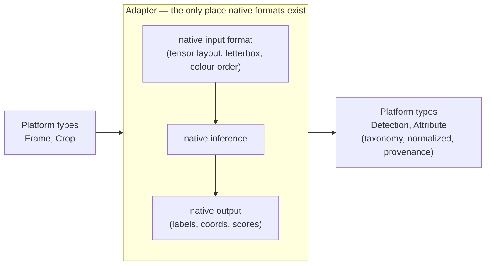
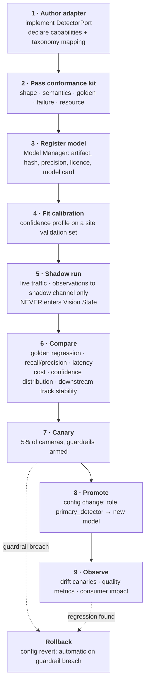

# UnityWorks Vision OS (UWV)

## Phase 1 — Ports & Adapters Design

| | |
|---|---|
| **Status** | Architecture Blueprint — Phase 1 (Design Only) |
| **Prerequisite** | `00`–`05` |
| **Defines** | The complete port catalogue, adapter obligations, conformance kits, versioning, swap procedures |
| **Enforces** | Invariant **V3** — ports over implementations |

---

## Table of Contents

- [1. Why Ports Alone Are Not Enough](#1-why-ports-alone-are-not-enough)
- [2. The Port Catalogue](#2-the-port-catalogue)
- [3. The Adapter Contract](#3-the-adapter-contract)
- [4. Core Port Specifications](#4-core-port-specifications)
- [5. Conformance Kits](#5-conformance-kits)
- [6. Port Versioning](#6-port-versioning)
- [7. The Model Swap Procedure](#7-the-model-swap-procedure)
- [8. Anti-Patterns](#8-anti-patterns)

---

# 1. Why Ports Alone Are Not Enough

Every architecture document claims its models are replaceable behind interfaces. Most are wrong, and
they are wrong for a specific, predictable reason: **an interface constrains the shape of a call, not
the meaning of its result.**

Two detectors can implement the same interface perfectly and still break the platform when swapped:

| Hidden divergence | Symptom after swap |
|---|---|
| One returns boxes in letterboxed coordinates, the other in original-image coordinates | Every box is subtly offset; tracking degrades; nobody notices for weeks |
| One returns `[x, y, w, h]`, the other `[x1, y1, x2, y2]` | Grossly wrong boxes, or — worse — plausible ones for square objects |
| Confidence distributions differ | Every downstream threshold silently changes meaning |
| One emits `person`, the other `Person`, a third `human` | Taxonomy fractures |
| One suppresses overlapping boxes, the other does not | Object counts double |
| One is deterministic, the other is not | Replay tests break, and nobody knows which result was "right" |
| One returns an empty list for "nothing found", the other errors | Error rate spikes, or absence is silently misread |

**So UWV defines a port as three things, not one:**

```text
Port = Interface  +  Semantic Contract  +  Conformance Kit
       (shape)       (meaning & obligations)  (executable proof)
```

The **conformance kit** is the innovation that makes V3 real. It is an executable test suite that every
adapter must pass before the Plugin Manager will activate it (`05_KERNEL` §M17). "Replaceable" stops
being a claim in a document and becomes a gate in the loader.

---

# 2. The Port Catalogue

Every replaceable boundary in the platform. Adding a port is a deliberate, reviewed act — the catalogue
is closed in the same spirit as the object ontology.

| # | Port | Owner module | Replaces | Conformance kit |
|---|---|---|---|---|
| **P1** | `SourcePort` | M2 | RTSP, file, WebRTC, ONVIF, drone, mobile | `kit.source` |
| **P2** | `DecoderPort` | M2 | NVDEC, QSV, VAAPI, software | `kit.decoder` |
| **P3** | `PrivacyMaskPort` | M2 | Static mask, face/plate blur, encryption | `kit.privacy` |
| **P4** | `ClockSyncPort` | M2 | PTP, NTP+RTCP, arrival estimation | `kit.clocksync` |
| **P5** | `AdmissionPolicyPort` | M3 | Cadence, fair-share, adaptive | `kit.admission` |
| **P6** | `ChangeDetectorPort` | M3, M8 | Frame diff, codec motion vectors, learned | `kit.change` |
| **P7** | `AllocatorPort` | M4 | Host pinned, CUDA, shared memory | `kit.allocator` |
| **P8** | **`DetectorPort`** | M5 | **YOLO, RT-DETR, DINO, open-vocab, segmentation** | `kit.detector` |
| **P9** | **`TrackerPort`** | M6 | **ByteTrack, DeepSORT, BoT-SORT, MOTR** | `kit.tracker` |
| **P10** | `EmbeddingPort` | M6, M7 | Re-ID models, CLIP-family | `kit.embedding` |
| **P11** | `IdentityResolverPort` | M7 | Spatio-temporal, appearance, hybrid, cross-camera | `kit.identity` |
| **P12** | `TriggerPolicyPort` | M8 | Default policy, novelty, learned salience | `kit.trigger` |
| **P13** | `QualityEstimatorPort` | M8 | Heuristic, learned | `kit.quality` |
| **P14** | `CropStrategyPort` | M8 | Tight, padded, multi-scale, part-focused, temporal | `kit.crop` |
| **P15** | **`UnderstanderPort`** | M9 | **Qwen2.5-VL, Gemma Vision, GPT-4.1V, Claude Vision, specialized heads** | `kit.understander` |
| **P16** | `OutputCoercionPort` | M9 | Constrained decoding, grammar, regex | `kit.coercion` |
| **P17** | `PromptSourcePort` | M10 | File, git, object store, service | `kit.promptsource` |
| **P18** | `SuppressionPolicyPort` | M11 | Exact, threshold, semantic | `kit.suppression` |
| **P19** | `ObservationSinkPort` | M11 | State, message bus, data lake, learning pipeline | `kit.sink` |
| **P20** | `ObservationLogPort` | M13 | File, Kafka, cloud log | `kit.log` |
| **P21** | `StateStorePort` | M13 | Memory, embedded KV, distributed DB | `kit.statestore` |
| **P22** | `EvidenceStorePort` | M13 | Local disk, S3-compatible, encrypted | `kit.evidence` |
| **P23** | `ConfigSourcePort` | M16 | File, git, config service, K8s | `kit.configsource` |
| **P24** | `SecretProviderPort` | M16 | Env, file, vault, cloud | `kit.secret` |
| **P25** | `ArtifactStorePort` | M18 | Object storage, OCI registry, local | `kit.artifact` |
| **P26** | `ModelRuntimePort` | M18 | ONNX, TensorRT, OpenVINO, Triton, vLLM, cloud | `kit.runtime` |
| **P27** | `DevicePort` | M18 | CUDA, ROCm, Metal, Jetson, Hailo, CPU | `kit.device` |
| **P28** | `CalibrationPort` | M1, M18 | Manual, checkerboard, auto, SLAM | `kit.calibration` |
| **P29** | `EventTransportPort` | M19 | In-process, NATS, Kafka, cloud pub/sub | `kit.transport` |
| **P30** | `MetricsExportPort` | M21 | Prometheus, OTel, StatsD, file | `kit.metrics` |
| **P31** | `AuthorizationPort` | M14 | RBAC, ABAC, per-camera scoping | `kit.authz` |
| **P32** | `ApiTransportPort` | M14 | Request/response, streaming, message bus, webhook | `kit.apitransport` |

**The four bolded ports** — `DetectorPort`, `TrackerPort`, `UnderstanderPort`, and (with them)
`EmbeddingPort` — are where the field's churn actually lands. They receive the most rigorous
conformance kits and are specified in full in [§4](#4-core-port-specifications).

---

# 3. The Adapter Contract

Every adapter, regardless of port, owes the platform the same seven obligations.

| # | Obligation | Why it exists |
|---|---|---|
| **A1** | **Declare capabilities honestly** — what it can and cannot produce | Enables V8 capability-gap reporting; a consumer learns immediately that its demand is unsatisfiable rather than waiting forever |
| **A2** | **Translate to platform vocabulary** — taxonomy classes, registered attributes, normalized coordinates | Model-native vocabularies must never escape (`02_VOM` §8) |
| **A3** | **Report provenance** — model id, version, artifact hash | V4; without this no observation is explainable |
| **A4** | **Fail explicitly** — typed errors, never silent degradation or fabricated output | A model returning plausible garbage on error is more dangerous than one that fails |
| **A5** | **Declare determinism** | V13 replay must know what to expect |
| **A6** | **Declare resource needs and thread-safety** | The Runtime honours them; `05_KERNEL` §M17 |
| **A7** | **Pass the conformance kit** | The gate that makes all of the above enforceable |

### 3.1 The translation obligation in detail

A2 is where most of an adapter's real work lives, and it is deliberately pushed **into the adapter** so
that the platform stays clean.



The adapter absorbs: tensor layout, letterboxing and its exact inverse, colour space, normalization
constants, label mapping, coordinate convention, NMS behaviour, score semantics, and batch shape. **The
platform sees none of it.** Every one of the divergences listed in [§1](#1-why-ports-alone-are-not-enough)
is an adapter responsibility, and every one is checked by the conformance kit.

---

# 4. Core Port Specifications

## P8 · DetectorPort

### Interface

```text
detect(frames: FrameView[], request: DetectionRequest) → DetectionResult[] !DetectorError
capabilities() → DetectorCapabilities
warm() → void
health() → ComponentHealth
```

```text
DetectionRequest:
  target_classes  : ClassId[]?      # hint; adapter may return more
  min_confidence  : float?          # adapter-side pre-filter
  max_detections  : int?
  fidelity        : FidelityLevel   # resolution tier from M3

DetectionResult:
  frame_ref   : FrameRef
  detections  : Detection[]         # PLATFORM taxonomy, NORMALIZED coordinates
  model_meta  : ModelMeta           # id, version, artifact_hash, precision, device
  timing      : Timing
```

### Semantic contract

| # | Obligation |
|---|---|
| **D1** | Coordinates are normalized `[0,1]` against the **rectified source image**, with all letterboxing/scaling exactly inverted. Origin top-left, `[x1,y1,x2,y2]`, `x1<x2`, `y1<y2`. |
| **D2** | Classes are **platform taxonomy** `ClassId`s. Unmapped native labels follow `unmapped_policy`; a native label must never appear in output. |
| **D3** | Confidence carries `DETECTION_PRESENCE` semantics with `raw_score` preserved. If uncalibrated, say so. |
| **D4** | NMS behaviour is **declared** in capabilities (applied / not applied / threshold), because a platform cannot correct for what it does not know. |
| **D5** | Empty result is a **valid, non-error** outcome. "Nothing detected" and "detection failed" are different results and are never conflated. |
| **D6** | Batch results map **1:1 and in order** to input frames. |
| **D7** | The adapter is **stateless across calls**. Frame N's result must not depend on frame N−1. (A joint detect-track model implements `TrackerPort` too and declares statefulness there.) |
| **D8** | Quality contributions (scale, truncation) are populated where derivable. |

### Capability declaration

```text
DetectorCapabilities:
  producible_classes  : ClassId[]
  geometry_kinds      : [box | oriented_box | mask | keypoints]
  keypoint_schemas    : Map<ClassId, KeypointSchema>
  input_constraints   : { min/max resolution, aspect handling, colour space }
  batch               : { supported, max_size, optimal_size }
  nms                 : { applied: bool, iou_threshold?: float }
  precision           : fp32 | fp16 | int8 | int4
  deterministic       : bool
  calibration_profile : CalibrationId?
  cost_class          : relative unit
```

### Adapter examples

| Adapter | Notes on what it must absorb |
|---|---|
| `detector.yolo` | Letterbox inverse, COCO→taxonomy map, built-in NMS declaration |
| `detector.rtdetr` | No NMS (declare `applied: false`), different normalization, query-based output |
| `detector.grounding_dino` | **Open-vocabulary**: maps taxonomy classes → text prompts on input, prompts → classes on output. New classes with no retraining |
| `detector.segmentation` | Emits masks; declares `mask` geometry; mask stored by reference, never inline |
| `detector.pose` | Emits keypoints against a declared schema |
| `detector.cloud_api` | Remote isolation; rate limits; higher latency declared in `cost_class` |
| `detector.cascade` | A *composite* adapter: cheap model, then expensive model on ambiguity. **The platform sees one detector** — which is why cascades need no platform support |

---

## P9 · TrackerPort

### Interface

```text
update(camera_id, frame_ref, timestamp, detections, embeddings?) → TrackUpdate !TrackerError
reset(camera_id, reason) → TrackerEpoch
capabilities() → TrackerCapabilities
```

### Semantic contract

| # | Obligation |
|---|---|
| **T1** | **Strictly sequential per camera.** Frames arrive in order; the adapter may assume it and must reject violations rather than degrade silently. |
| **T2** | **Non-uniform time gaps are normal**, not exceptional. The scheduler drops frames by design (V7), so motion models must integrate over actual elapsed time, never over frame count. This is the single most common way an off-the-shelf tracker misbehaves inside UWV. |
| **T3** | Track IDs are unique within `(camera_id, tracker_epoch)` and are **never reused** within an epoch. |
| **T4** | Association confidence carries `ASSOCIATION` semantics and is honest — a low-confidence association must be reported as such (`03_MODULES` §M6). |
| **T5** | Coasting is **explicitly marked**; predicted positions are never presented as measured. |
| **T6** | Termination carries a `break_reason`. |
| **T7** | State is per-camera and fully reset by `reset()`. No cross-camera state exists in this port; cross-camera identity is P11. |
| **T8** | Memory is bounded regardless of scene duration or object count. |

```text
TrackerCapabilities:
  requires_embeddings : bool
  handles_occlusion   : none | short | long
  max_objects         : int
  supports_ground_plane_tracking : bool
  deterministic       : bool
  state_per_camera_bytes : estimate      # used for capacity planning
```

### Adapter examples

| Adapter | Notes |
|---|---|
| `tracker.iou` | Trivial, always available, **the universal fallback** (`03_MODULES` §M6 failure handling) |
| `tracker.bytetrack` | Two-stage association using low-confidence detections |
| `tracker.botsort` | Adds camera-motion compensation and appearance |
| `tracker.deepsort` | Requires `EmbeddingPort`; declares `requires_embeddings: true` |
| `tracker.ground_plane` | Tracks in metric ground coordinates via homography; markedly better under perspective |
| `tracker.transformer` | End-to-end learned association |

---

## P15 · UnderstanderPort

The most volatile port in the platform, and therefore the most carefully bounded.

### Interface

```text
understand(request: UnderstandingRequest) → UnderstandingResponse !UnderstanderError
understand_batch(requests) → Map<RequestId, UnderstandingResponse>
capabilities() → UnderstanderCapabilities
estimate_cost(request) → CostEstimate
```

```text
UnderstandingRequest:
  crops           : CropView[]        # 1 for single-frame, N for temporal
  prompt          : RenderedPrompt    # from M10, with declared output schema
  output_schema   : OutputSchema      # what the platform will accept
  context         : { class_id, prior_attributes?, quality }
  constraints     : { max_tokens, timeout, temperature }

UnderstandingResponse:
  structured      : Map<field, value>   # parsed against output_schema
  unparsed        : text?               # what did not fit — preserved as evidence
  field_confidence: Map<field, float>?  # if the model provides it
  raw_output      : bytes               # verbatim, for evidence
  model_meta      : ModelMeta
  timing          : Timing
```

### Semantic contract

| # | Obligation |
|---|---|
| **U1** | The adapter returns **fields declared in `output_schema` and nothing else**. Extra fields go to `unparsed`. The adapter never invents a schema. |
| **U2** | The adapter **never fabricates on failure.** If the model refuses, times out, or is unparseable, that is an explicit result — not a plausible default value. This is the single most dangerous failure mode for a VLM-based system, because fabricated output is indistinguishable from real output downstream. |
| **U3** | `raw_output` is preserved verbatim (V4). |
| **U4** | Self-reported confidence is labelled `SELF_REPORTED` and never presented as a calibrated probability (`02_VOM` §7.2). |
| **U5** | The adapter is **stateless across requests** — no conversation history, no accumulated context. Two identical requests must be independently answerable, or caching and replay both break. |
| **U6** | The adapter **never applies business interpretation.** It answers the prompt it was given. (A model that volunteers "this appears to be a safety violation" has its field rejected at M11 — see [§8](#8-anti-patterns).) |
| **U7** | Cost is estimable before invocation, so M8's budget policy can decide. |

```text
UnderstanderCapabilities:
  producible_attributes  : AttributeKey[]
  input                  : { resolution, aspect, colour, max_crops_per_request }
  supports_structured_output : bool     # constrained decoding available
  supports_temporal      : bool         # crop sequences
  supports_batching      : bool
  max_output_tokens      : int
  cost_class             : relative unit
  latency_profile        : { p50, p95, p99 }
  deterministic          : bool
  data_residency         : local | remote(region)    # gates use in regulated sites
```

### Adapter examples

| Adapter | Notes |
|---|---|
| `vlm.qwen2_5vl` | Local, quantizable, batches well, good structured output |
| `vlm.gemma_vision` | Local alternative; different prompt phrasing via M10 model-family variants |
| `vlm.gpt41_vision` | Remote; `data_residency: remote`; rate-limited; no batching; higher cost class |
| `vlm.claude_vision` | Remote; strong instruction-following; same treatment |
| `attr.headwear_classifier` | **A specialized 2 MB model, not a VLM.** Produces exactly one attribute at ~100× lower cost. Same port |
| `attr.pose_estimator` | Produces `posture` from keypoints, deterministically |
| `attr.ocr` | Produces text-bearing attributes |
| `understander.router` | **Composite**: routes each attribute to the cheapest capable adapter. The platform sees one understander |

> **The `attr.*` adapters are the point of this port's design.** They are not VLMs at all, and they
> prove the abstraction is at the right altitude: the platform asks for *registered attributes with
> evidence*, and is genuinely indifferent to whether a 7-billion-parameter generalist or a 2-megabyte
> specialist answered. The `understander.router` composite means that migration can happen attribute by
> attribute, in production, with no consumer impact.

---

## P11 · IdentityResolverPort

The port that carries the platform's largest future capability.

```text
resolve(candidates: IdentityCandidate[], context) → IdentityAssertion[] 
gallery_add(object_id, descriptor) → void
capabilities() → ResolverCapabilities
```

| # | Obligation |
|---|---|
| **I1** | Returns **assertions with confidence and method**, never assumed truth (`02_VOM` §4.2). |
| **I2** | Never mutates registry state — it advises; M7 decides. |
| **I3** | Declares its scope: within-camera re-entry, cross-camera, cross-time. |
| **I4** | Declares privacy classification of any descriptor it retains — biometric descriptors are governed by `12_SECURITY_AND_PRIVACY.md` and may be forbidden outright at a given site. |

Adapters: `identity.spatiotemporal` (no biometrics, always permitted), `identity.appearance`,
`identity.hybrid`, `identity.cross_camera` (Phase 2), `identity.longterm_gallery` (Phase 3, heavily
policy-gated).

---

# 5. Conformance Kits

> **A conformance kit is an executable test suite that an adapter must pass before the Plugin Manager
> will activate it.** This is what converts V3 from an aspiration into a gate.

### 5.1 Kit structure

Every kit has five sections.

| Section | Verifies | Example (detector) |
|---|---|---|
| **1 · Shape** | Interface compliance, types, batch mapping | Batch of 4 returns 4 results in order |
| **2 · Semantics** | The port's numbered obligations | D1: a known object at a known position returns the expected normalized box within tolerance |
| **3 · Golden data** | Correctness against a fixed reference corpus | 200 annotated frames; recall/precision above declared floor |
| **4 · Failure** | Error behaviour under injected faults | Corrupt input → typed error, never a crash, never fabricated output |
| **5 · Resource** | Declared resources are truthful | Memory and VRAM stay within manifest declaration over 10⁴ calls |

### 5.2 The detector kit in detail

```text
kit.detector
├── shape/
│   ├── batch_order_preserved
│   ├── empty_result_is_not_error            (D5)
│   └── capabilities_are_complete
├── semantics/
│   ├── coordinate_normalization             (D1)
│   │   ├── synthetic target at known position, 5 aspect ratios
│   │   ├── letterbox inverse exactness       ← catches the #1 swap bug
│   │   └── extreme aspect ratios (16:9, 1:1, 9:16, 32:9)
│   ├── taxonomy_mapping_complete             (D2)
│   │   └── no native label may appear in any output
│   ├── confidence_semantics                  (D3)
│   ├── nms_declaration_matches_behaviour     (D4)
│   │   └── overlapping targets: count matches the declaration
│   └── statelessness                         (D7)
│       └── same frame 100× → identical results (if deterministic)
├── golden/
│   ├── reference_corpus_recall  >= declared floor
│   ├── reference_corpus_precision >= declared floor
│   ├── scale_sweep              (objects 16px → 512px)
│   ├── occlusion_sweep
│   └── lighting_sweep           (bright / dim / backlit / IR)
├── failure/
│   ├── corrupt_frame            → typed error, no crash
│   ├── zero_size_frame          → typed error
│   ├── extreme_resolution       → typed error or graceful handling
│   ├── oom_injection            → typed error, recoverable
│   └── timeout                  → typed error, resources released
└── resource/
    ├── memory_stable_over_10k_calls          ← catches leaks before production
    ├── vram_within_declaration
    └── latency_within_declared_profile
```

**The `letterbox inverse exactness` test alone justifies the entire mechanism.** It is the highest-
frequency, lowest-visibility adapter bug in computer vision: boxes drift by a few percent, detection
still "works," tracking quietly degrades, and the cause is found months later — if ever.

### 5.3 The understander kit

```text
kit.understander
├── shape/          schema conformance, batch mapping, cost estimation present
├── semantics/
│   ├── schema_adherence                     (U1) — extra fields land in `unparsed`
│   ├── NO_FABRICATION_ON_FAILURE            (U2) ← the critical test
│   │   ├── unreadable crop  → explicit failure, NOT a guessed value
│   │   ├── blank crop       → explicit failure or honest "cannot determine"
│   │   └── timeout          → explicit failure
│   ├── raw_output_preserved                 (U3)
│   ├── confidence_labelled_self_reported    (U4)
│   ├── statelessness                        (U5)
│   │   └── request A then B ≡ B then A
│   └── no_business_interpretation           (U6)
│       └── adversarial prompts attempting to elicit judgment are refused/rejected
├── golden/
│   ├── attribute_accuracy per registered attribute
│   ├── quality_sensitivity  (accuracy vs crop quality — informs M8's gate thresholds)
│   └── consistency          (same crop, N runs, agreement rate)
├── failure/        refusal handling, malformed output, rate limits, partial responses
└── resource/       VRAM, latency profile, token accounting
```

**`NO_FABRICATION_ON_FAILURE` is the most important test in the platform.** A VLM handed 14 blurry
pixels will confidently answer the question asked. An adapter that passes that answer through as a
normal result poisons state with fabrication that carries full provenance and looks entirely
legitimate. The test injects unreadable inputs and requires either explicit failure or an honest
inability — and an adapter that cannot pass it is not admissible at any accuracy level.

### 5.4 Running kits

| When | What runs | Consequence of failure |
|---|---|---|
| Adapter development | Full kit locally | Not publishable |
| Plugin registration | Full kit in CI | Not registerable |
| **Plugin load** | Shape + semantics + failure (fast subset, seconds) | **Not activatable** |
| Nightly | Full kit including golden corpus against all registered adapters | Alarm and quarantine |
| Model version bump | Full kit + golden regression diff vs incumbent | Blocked promotion |

The fast subset at load time is deliberate: it costs seconds and catches the catastrophic class
(coordinate convention, taxonomy leakage, fabrication) before a single real frame is processed.

---

# 6. Port Versioning

Ports are contracts and follow the same discipline as the object model (`02_VOM` §12).

| Change | Version | Adapter impact |
|---|---|---|
| Add an optional request field | Minor | None — adapters ignore unknown optional fields |
| Add an optional response field | Minor | None — the platform tolerates absence |
| Add a capability declaration field | Minor | Adapters default it |
| Add a new method with a default | Minor | None |
| **Change a field's meaning** | **Major** | All adapters must be revised — avoid by adding a new field |
| **Make an optional field required** | **Major** | All adapters |
| **Remove a method or field** | **Major** | All adapters |
| **Tighten a semantic obligation** | **Major** | Kits change; adapters re-verify |

### 6.1 Compatibility declaration and coexistence

An adapter declares `implements: [(DetectorPort, ">=1.2 <2.0")]`. The Plugin Manager refuses
incompatible loads (`05_KERNEL` §M17).

The platform supports **two adjacent major versions of a port concurrently** during a migration window,
with an internal bridge where the adaptation is mechanical. This means a major port revision does not
require a flag-day upgrade of every adapter — which, in a platform expected to run for a decade with
third-party plugins, is the difference between a migration and a standstill.

---

# 7. The Model Swap Procedure

The concrete, end-to-end answer to *"what actually happens when we replace YOLO with RT-DETR?"* — and
the proof that the answer involves no platform change.



### 7.1 What changed, by category

| Category | Changed? |
|---|---|
| **Adapter code** | ✅ New adapter authored |
| **Model artifact** | ✅ New weights registered |
| **Taxonomy mapping** | ✅ New mapping declared |
| **Calibration profile** | ✅ Refitted |
| **Configuration** | ✅ One role binding changed |
| **Platform modules (all 21)** | ❌ **Zero change** |
| **Object model / observation schema** | ❌ Zero change |
| **Vision State** | ❌ Zero change |
| **Observation API** | ❌ Zero change |
| **Consumer integrations** | ❌ **Zero change** |
| **Historical observations** | ❌ Remain valid and interpretable under their recorded provenance |

**Rollback is a configuration revert**, because the previous model artifact is still registered and
cached and the previous calibration profile is still stored. Mean time to recovery is a config push,
not a redeploy.

### 7.2 The same procedure, other ports

| Swap | Additional considerations |
|---|---|
| ByteTrack → transformer tracker | Compare track fragmentation and ID-switch rates, not just per-frame accuracy. Shadow mode must run long enough to see occlusion events |
| Qwen2.5-VL → a frontier vision model | Compare cost per attribute and `data_residency` implications; a remote model may be forbidden at some sites by policy |
| VLM → specialized attribute head | Compare accuracy on that attribute only; expect a large cost reduction. Can be rolled out **per attribute** via `understander.router` |
| RTSP source → WebRTC source | Verify timestamp quality does not regress — `ClockQuality` is part of the kit |
| Local state store → distributed | Verify consistency semantics and snapshot behaviour under partition |

---

# 8. Anti-Patterns

Failures of this design, named so they can be recognized in review.

| Anti-pattern | Why it is fatal | Correct approach |
|---|---|---|
| **Leaky port** — the interface exposes a model-specific concept (`conf_threshold`, `nms_iou`, `anchor_size`) | The port now describes one model family; the next generation does not fit | Keep model-specific settings in **adapter configuration**, invisible to the platform |
| **Semantic drift** — two adapters implement the interface with different meanings | Silent corruption on swap; the worst kind of bug | Conformance kit section 2 |
| **God port** — one port for "any AI model" | An interface general enough for everything constrains nothing, and conformance becomes untestable | Separate ports per *responsibility*, as in the catalogue |
| **Bypass** — a module calls a concrete adapter directly for "just this one case" | The first crack; every subsequent exception cites it as precedent | Architectural review; the dependency law is checked in CI |
| **Business logic in an adapter** | Vertical knowledge sneaks in below the ceiling, where nobody is looking for it | Adapters translate; conformance test U6 probes for it explicitly |
| **Untested adapter** — "it works, ship it" | The claim of replaceability quietly becomes false, and nobody discovers this until a swap fails | The Plugin Manager refuses to activate without a conformance pass |
| **Version-pinned platform** — platform code branches on adapter version | Reintroduces exactly the coupling ports removed | Capability declarations, never version checks |
| **Fabricating adapter** — returns a plausible default on failure | Poisons state with fully-provenanced fiction | Test U2 / `NO_FABRICATION_ON_FAILURE` |

---

## Where to go next

| Question | Document |
|---|---|
| How is state structured and projected? | `07_STATE_ARCHITECTURE.md` |
| How do adapters run concurrently? | `08_RUNTIME_AND_THREADING.md` |
| How are conformance kits run in CI? | `14_TESTING_STRATEGY.md` |
| How are plugin signatures trusted? | `12_SECURITY_AND_PRIVACY.md` |
