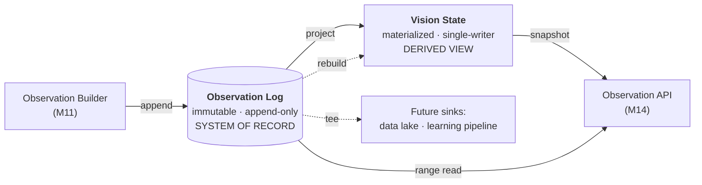
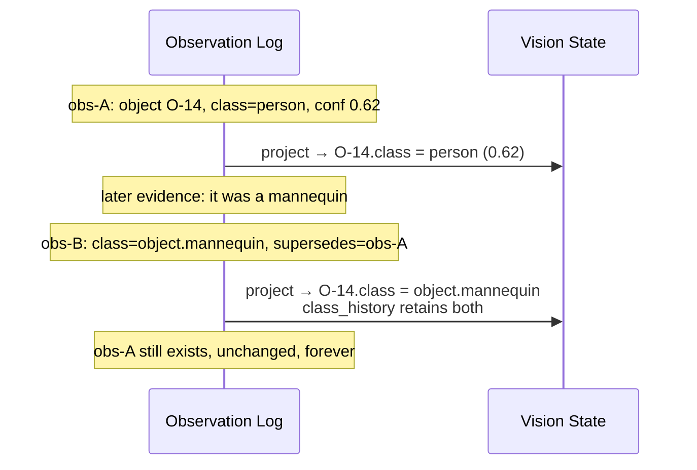
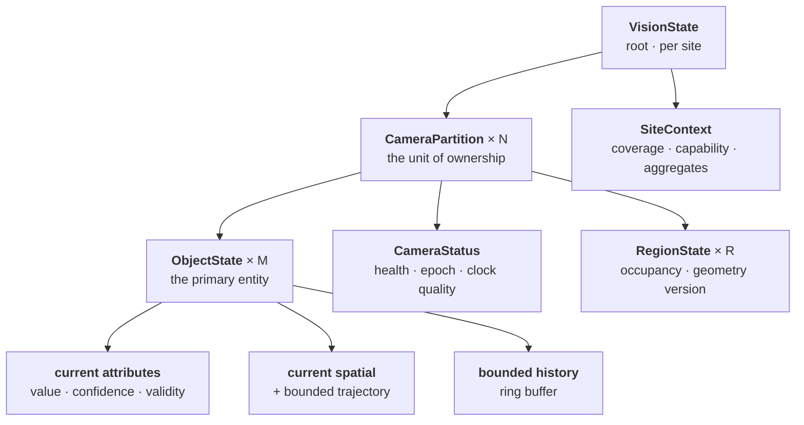
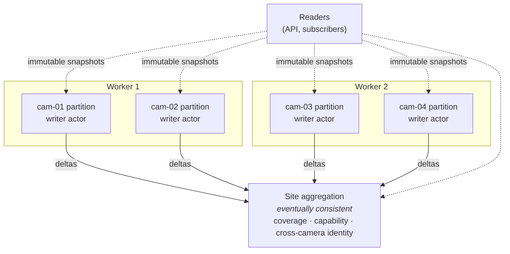

# UnityWorks Vision OS (UWV)

## Phase 1 — Vision State Architecture

| | |
|---|---|
| **Status** | Architecture Blueprint — Phase 1 (Design Only) |
| **Prerequisite** | `00`–`06` |
| **Defines** | Vision State structure, event sourcing model, partitioning, snapshots, history, coverage, retention, recovery |
| **Enforces** | Invariants **V5** (immutable observations), **V6** (single-writer projection), **V8** (explicit blindness) |

---

## Table of Contents

- [1. What the Vision State Is](#1-what-the-vision-state-is)
- [2. The Log-and-Projection Model](#2-the-log-and-projection-model)
- [3. State Structure](#3-state-structure)
- [4. Partitioning](#4-partitioning)
- [5. Snapshots and Consistency](#5-snapshots-and-consistency)
- [6. History](#6-history)
- [7. The Coverage Model](#7-the-coverage-model)
- [8. Retention and Erasure](#8-retention-and-erasure)
- [9. Recovery and Rebuild](#9-recovery-and-rebuild)
- [10. What the State Deliberately Excludes](#10-what-the-state-deliberately-excludes)

---

# 1. What the Vision State Is

> **The Vision State is the platform's answer to one question: *what is visible right now, where, since
> when, and how confident are we?*** — plus the honest admission of where it cannot see.

It is a **materialized projection**, not a database of record. The system of record is the immutable
observation log. State is what the log means at this instant, kept continuously up to date because
recomputing it per query would be absurd.

### 1.1 The three properties that define it

| Property | Statement | Consequence |
|---|---|---|
| **Owned** | The platform is the sole writer. Business systems read; they never write, and there is no write path to offer them (V6). | The platform can guarantee its own consistency, because nothing else can violate it. |
| **Derived** | Every element traces to observations in the log. Nothing is in state that was not first a published fact. | State can always be rebuilt; divergence is detectable and correctable. |
| **Honest** | State represents uncertainty, staleness, and blindness explicitly (V8). | A consumer can always distinguish "nothing there" from "we cannot see." |

### 1.2 Why business systems cannot write

The pressure to allow it will come, and it will sound reasonable: *"the POS knows table 4 is occupied,
so let us set that on the object."* Allowing it destroys four properties simultaneously:

1. **Derivability** — state no longer reconstructs from the log, so rebuild produces a different world.
2. **Explainability** — an element exists with no evidence and no producer (V4).
3. **The Semantic Ceiling** — externally-written state is business meaning living inside the platform,
   and every consumer now inherits one consumer's interpretation (V1).
4. **Single-writer concurrency** — the entire lock-free design of §4 collapses.

The correct pattern is that the consumer joins UWV observations with its own data **in its own store**.
UWV supplies the visual half of the join and never sees the other half.

---

# 2. The Log-and-Projection Model



### 2.1 Why event sourcing here specifically

Event sourcing is often over-applied. It is genuinely correct for this platform, for four concrete
reasons:

| Reason | Detail |
|---|---|
| **Observations are already immutable facts** | V5 is not a constraint imposed to enable event sourcing; it is the natural nature of the data. An observation is a statement about a moment that has passed and cannot become untrue. |
| **Auditability is a deployment requirement** | Hospital and city deployments must answer "what did the system report at 09:14 and why," years later. Only an immutable log answers this. |
| **State schema will change** | Over a decade the projection will be restructured several times. With a log, that is a rebuild. Without one, it is a migration with irrecoverable loss of fidelity. |
| **Reprocessing enables the future** | A better model applied to historical evidence, a new derived signal, a learning pipeline — all require the raw record. The log is what makes Phase N possible without building it in Phase 1. |

### 2.2 Correction without mutation

An observation is never edited. Corrections are new observations that reference what they supersede.



The state reflects the current best understanding; the log retains how that understanding was reached.
A consumer that acted on `obs-A` at the time acted correctly on the information then available — and
can prove it, which matters enormously in regulated contexts.

---

# 3. State Structure



### 3.1 ObjectState — the primary entity

```text
ObjectState:
  object_id        : ObjectId
  class_id         : ClassId
  class_confidence : Confidence
  class_history    : bounded [(ClassId, Time, Confidence)]

  lifecycle        : LifecycleState             # 02_VOM §10.6
  first_seen       : PlatformTime
  last_seen        : PlatformTime
  last_confirmed   : PlatformTime               # last MEASURED sighting
  staleness        : Duration                   # now - last_confirmed (derived)

  spatial          : SpatialInfo
  measurement_basis: measured | predicted | interpolated
  trajectory       : bounded ring<(Time, Point, basis)>
  motion           : { velocity, heading, motion_state }

  regions          : Map<RegionId, RegionMembership>    # with dwell accumulators

  attributes       : Map<AttributeKey, AttributeState>
  identity         : { bindings, assertion_confidence, method }

  provenance_summary : { last_detector, last_tracker, last_understander }
  observation_count  : int
  last_observation   : ObservationId
```

```text
AttributeState:
  value          : typed
  confidence     : Confidence
  observed_at    : PlatformTime
  valid_until    : PlatformTime?
  is_stale       : bool                # derived: now > valid_until
  evidence_ref   : EvidenceRef
  producer       : Provenance
  previous       : bounded ring<(value, Time)>    # short attribute history
```

**`is_stale` and `staleness` are the object-level expression of V8.** A consumer reading
`headwear_present: false` observed 40 minutes ago on an object last confirmed 12 minutes ago is
reading something quite different from a fresh measurement, and the state says so without being asked.
Systems that omit this force every consumer to reimplement staleness reasoning, and most get it wrong.

### 3.2 CameraPartition

```text
CameraPartition:
  camera_id        : CameraId
  stream_epoch     : StreamEpoch
  tracker_epoch    : TrackerEpoch
  objects          : Map<ObjectId, ObjectState>
  regions          : Map<RegionId, RegionState>
  status           : CameraStatus
  observability    : ObservabilityState          # §7
  calibration_id   : CalibrationId
  log_position     : LogPosition                 # projection watermark
  version          : PartitionVersion            # monotonic, for snapshots
```

`log_position` is the projection watermark — the exact point in the log this partition reflects. It
makes "is the projection caught up?" answerable, makes rebuild resumable, and makes snapshot
consistency expressible (§5).

### 3.3 RegionState

```text
RegionState:
  region_id        : RegionId
  geometry_version : SemVer
  occupancy        : Map<ClassId, count>          # pure counting, no interpretation
  present_objects  : ObjectId[]
  dwell_stats      : { current_max, current_mean }   # descriptive only
  last_transition  : PlatformTime
```

**This is exactly where the Semantic Ceiling is most tempting to breach.** `occupancy` is a count.
`dwell_stats` are descriptive statistics over durations. There is no `is_crowded`, no
`exceeds_capacity`, no `queue_forming` — each of those requires a threshold or a definition that only
a consumer possesses (V1).

### 3.4 SiteContext

```text
SiteContext:
  site_id          : SiteId
  cameras          : Map<CameraId, CameraSummary>
  coverage         : CoverageMap                  # §7
  capabilities     : CapabilityReport             # which classes/attributes are producible now
  cross_camera     : { identity_assertions, topology }    # Phase 2+
  aggregate_health : SiteHealth
```

`capabilities` is state, not documentation: it reports what the *currently loaded* models and prompts
can actually produce at this site right now. When a model is evicted under memory pressure, or a prompt
pack fails to load, the capability report changes — and a consumer discovers the gap instead of waiting
indefinitely for an attribute that will never arrive (V8).

---

# 4. Partitioning

### 4.1 The rule

> **The camera is the partition. Each partition has exactly one writer. Cross-partition operations are
> explicitly eventually consistent.**



### 4.2 Why the camera and not something else

| Candidate | Verdict |
|---|---|
| **Camera** ✅ | Matches the natural data boundary — a camera's objects are almost always independent of another's. Matches the pipeline's shared-nothing flow (`01_LAYERED` §6). Scales linearly. Fails independently. |
| Object | Too fine — object identity changes, and objects would migrate between partitions constantly |
| Site | Too coarse — a 400-camera city site becomes one write bottleneck, defeating the purpose |
| Tenant | Far too coarse |
| Time window | Breaks object continuity across boundaries; the worst option for a stateful perception system |

### 4.3 The consequences

- **No locks on the write path.** One writer per partition means lifecycle transitions, dwell
  accumulation, and attribute updates are all race-free by construction.
- **Independent failure.** A stuck partition affects one camera. Its state is marked stale and its
  coverage marked unavailable; every other camera is untouched.
- **Linear scaling.** Adding cameras adds partitions, which distribute across workers and nodes.
- **Bounded rebuild.** Rebuilding one camera's projection is seconds, not hours.

### 4.4 Cross-partition operations

Only two exist, and both are deliberately asynchronous rather than transactional:

| Operation | Mechanism | Consistency |
|---|---|---|
| **Object merge** (cross-camera identity resolution) | Two-phase: assertion published as an observation → both partitions project it independently → the site layer maintains the link | Eventual, typically sub-second |
| **Site coverage aggregation** | Partitions publish observability deltas; the site layer folds them | Eventual, with per-partition timestamps |

**Neither takes a cross-partition lock.** A distributed transaction across camera partitions would
reintroduce global coordination precisely where the architecture removed it — and at 400 cameras it
would be the system's defining bottleneck. Eventual consistency here is not a compromise; it is the
correct model, because the underlying physical reality (a person walking between camera views) is
itself only eventually knowable.

---

# 5. Snapshots and Consistency

### 5.1 Snapshot mechanics

State uses **persistent (structurally shared) data structures**. A snapshot is a pointer to an
immutable root.

```text
snapshot(scope) → StateSnapshot        # O(1), no copying
```

- Readers hold a snapshot as long as they need; the writer continues producing new versions.
- No reader blocks a writer; no writer blocks a reader; no reader blocks another reader.
- Memory cost is proportional to *change since the snapshot*, not to state size, because unchanged
  subtrees are shared.
- Old versions are reclaimed when no snapshot references them.

This is the mechanism behind M14's claim that heavy query load cannot slow perception
(`04_MODULES` §M14) — the read path and the write path never touch the same mutable memory.

### 5.2 The honest consistency model

| Scope | Guarantee |
|---|---|
| **Single object** | Strongly consistent — one writer, atomic version |
| **Single camera partition** | Strongly consistent — one writer, one version |
| **Multiple partitions, one node** | Snapshot set with per-partition versions; **not a global instant** |
| **Multiple partitions, multiple nodes** | Eventually consistent; per-partition versions and timestamps reported |
| **Site aggregates** | Eventually consistent, with a stated lag bound |

```text
StateSnapshot:
  partitions   : Map<CameraId, (PartitionVersion, LogPosition, Time)>
  consistency  : strong | snapshot_set | eventual
  max_lag      : Duration          # worst staleness across included partitions
  incomplete   : CameraId[]        # partitions that could not be included, and why
```

**The platform never fabricates a global instant.** In a distributed deployment there is no such
moment, and pretending otherwise produces answers that are wrong in ways nobody can detect. Instead,
every multi-partition read reports what it actually is: a set of per-partition views with stated
versions and a stated lag bound. A consumer needing tighter guarantees is told exactly what it got
(V11's spirit applied to state).

`incomplete` is the V8 property of snapshots: a query spanning 40 cameras that could only reach 37
returns 37 **and says which three are missing** — never a silently smaller answer.

---

# 6. History

### 6.1 The purpose limit

> **History exists for perception, not for analytics.**

The platform retains history to support re-identification, continuity across occlusion, staleness
reasoning, and short-horizon motion. It does **not** retain history so consumers can compute weekly
footfall — that is a consumer's data warehouse concern, fed by the observation log or a tee'd sink
(`06_PORTS` P19).

This limit is what stops the Vision State from growing into a time-series database, which is the most
common way a perception platform's memory footprint becomes unbounded.

### 6.2 The three horizons

| Horizon | Contents | Default | Lives in |
|---|---|---|---|
| **Working history** | Trajectory ring, attribute previous-values, class history | ~5 minutes / bounded count | In-memory state |
| **Operational history** | Full observations for active and dormant objects | Hours to days | Observation log, indexed |
| **Archival history** | Complete observation log | Retention policy (days to years) | Log storage, cold-tiered |

**All in-memory history is bounded by both count and time**, and the bound is a structural property of
the ring buffers rather than a tunable that might be misconfigured to infinity. This is the platform's
principal defence against the classic 30-day soak-test failure, where memory grows imperceptibly until
a node dies at 3 a.m. on day 26.

### 6.3 Growth model

| Quantity | Bound |
|---|---|
| Objects per camera partition | Capped; `provisional` objects shed first under pressure |
| Trajectory points per object | Fixed ring size |
| Attribute history per attribute | Fixed ring size |
| Partitions per node | Configured camera assignment |
| **Total in-memory state per camera** | **Bounded and computable at configuration time** |

Because every dimension is bounded, a node's steady-state memory is *calculable before deployment*
rather than discovered in production — which is what makes capacity planning in
`13_DEPLOYMENT_ARCHITECTURE.md` meaningful.

---

# 7. The Coverage Model

The structural implementation of invariant V8, and the part of the state most systems omit entirely.

### 7.1 The problem it solves

A consumer queries "objects in region Z3 between 09:14 and 09:21" and receives an empty result. Two
utterly different realities produce that same empty result:

1. The region was observed continuously and was genuinely empty.
2. The camera was disconnected, or blinded by a parked truck, or the scheduler dropped 95% of frames
   under load, or the detector was evicted under GPU pressure.

Without coverage, these are indistinguishable — and a consumer will act on the wrong one. In a hospital
or a factory that is a safety issue, not a data-quality issue.

### 7.2 The structure

```text
ObservabilityState:
  camera_id        : CameraId
  status           : observing | degraded | blind | disconnected
  since            : PlatformTime
  reason           : ObservabilityReason
  effective_rate   : float          # frames actually processed / expected
  regions_affected : RegionId[]     # partial blindness (e.g. occluded area)
  capability_gaps  : [(ClassId | AttributeKey, reason)]
```

```text
ObservabilityReason:
  NORMAL
  STREAM_DISCONNECTED        # M2
  DECODE_FAILING             # M2
  PRIVACY_MASK_FAILED        # M2 — fails closed
  SCHEDULER_SHEDDING         # M3, budget pressure
  DETECTOR_UNAVAILABLE       # M5 / M18
  UNDERSTANDING_BUDGET_EXHAUSTED   # M8 — attributes thinned, presence unaffected
  SCENE_OBSCURED             # M20 silent-failure detection
  CALIBRATION_SUSPECT        # M1 viewpoint drift
  MODEL_CAPABILITY_GAP       # no loaded model can produce a demanded class/attribute
  PARTITION_UNAVAILABLE      # M12
```

### 7.3 How coverage is published

Coverage is both **live state** and **historical observations**:

- **Live**: `SiteContext.coverage` answers "can we see right now?"
- **Historical**: `coverage`-type observations (`02_VOM` §11.2) are appended to the log on every
  transition, so a query over any past window can reconstruct exactly what was observable then.

```text
coverage(scope, window) → CoverageReport
  observable_fraction : float        # fraction of the window that was actually observed
  gaps                : [(from, to, reason, affected_scope)]
  effective_rate      : float
  capability_gaps     : [...]
```

**A consumer querying a historical window should always request coverage alongside results.** The API
makes this ergonomic and the contract documents it as expected practice (`09_API_CONTRACTS.md`),
because an empty result without its coverage context is not an answer — it is half of one.

---

# 8. Retention and Erasure

### 8.1 Retention tiers

| Data | Default | Driven by |
|---|---|---|
| Vision State (in-memory) | Bounded by §6.3 | Capacity |
| Observation log — hot | 7–30 days | Operational need |
| Observation log — archive | 90 days to years | Compliance, contract |
| Evidence crops | 24–72 hours default | **Privacy policy — the shortest tier by design** |
| Raw model output | 7 days | Debugging |
| Metrics | 30–90 days | Operations |

Evidence has the shortest default retention deliberately: it is the only tier containing imagery, and
therefore the only tier where retention is primarily a privacy decision rather than an engineering one
(`12_SECURITY_AND_PRIVACY.md`).

### 8.2 Erasure

Regulated deployments require targeted erasure. The design makes this tractable:

| Erasure scope | Mechanism |
|---|---|
| **By object** | Observations are indexed by `object_id`; evidence is indexed by object and time |
| **By time window** | Log is time-partitioned; evidence keys carry time |
| **By camera** | Partition-scoped |
| **By subject** (a specific person) | Only possible where identity linkage exists; **by default UWV holds no persistent biometric identity**, which is a deliberate privacy posture, not a limitation |

**The tension, stated plainly.** V5 says observations are immutable; regulation says a subject may
demand erasure. UWV resolves this by distinguishing *tombstoning* from *rewriting*: erasure removes
evidence blobs and redacts identifying content, while retaining an immutable tombstone record that an
observation existed and was erased, by whom and under what authority. The audit trail survives; the
content does not. Rewriting history to pretend an observation never existed would destroy the property
that makes the log trustworthy in the first place.

---

# 9. Recovery and Rebuild

### 9.1 Recovery scenarios

| Scenario | Recovery | Data loss |
|---|---|---|
| **Partition writer crash** | Restart, replay log from `log_position`; idempotent by `observation_id` | None |
| **Node crash** | Reassign partitions; each replays from its watermark | In-flight observations not yet appended (bounded by batch interval) |
| **State store corruption** | Rebuild from log — the log is authoritative | None |
| **Log corruption (partial)** | Restore from replicated copy; rebuild affected partitions | Bounded by replication lag |
| **Log loss (total)** | State survives in memory but is no longer rebuildable; alarm as a **critical incident**. Log replication is mandatory in any deployment claiming durability | Historical record |
| **Projection bug** | Fix, rebuild into a shadow projection, atomic swap | None — this is the strongest argument for event sourcing here |
| **Schema change** | Rebuild under the new projection code | None |

### 9.2 Rebuild

```text
rebuild(scope, from_log_position) → RebuildHandle
```

Rebuild runs into a **shadow projection** while the live projection continues serving. On completion,
the shadow catches up to the live log tail and the two are swapped atomically. Consumers see a version
change, never an outage.

This capability is what makes projection schema evolution routine. Over ten years, the state structure
in §3 will be revised repeatedly; each revision is a rebuild rather than a migration, and no historical
fidelity is lost in the process.

### 9.3 Restart behaviour, stated honestly

After a restart, the platform is not instantly in the same condition it was:

| Element | Behaviour |
|---|---|
| Object identity | **Preserved** — durable in the registry |
| Tracks | **Lost** — new `TrackerEpoch`; re-binding to objects happens with explicitly reduced confidence |
| Attributes | Preserved with their staleness intact |
| Trigger state | Lost — causes one round of `FIRST_SIGHT` re-analysis |
| Coverage | A gap is recorded for the restart window (V8) |
| In-flight frames | Lost — these are `realtime` data and are gone by definition |

The restart gap is **recorded as a coverage observation**, so consumers see the discontinuity as data
rather than inferring it from a suspicious silence. Deployments are thereby visible in the record,
which is exactly what an operator investigating an anomaly needs.

---

# 10. What the State Deliberately Excludes

Naming the exclusions is as important as specifying the inclusions, because each one is a boundary that
will be probed.

| Excluded | Why | Where it belongs |
|---|---|---|
| **Business entities** (tables, orders, staff, patients, SKUs) | V1 — the platform has no such concepts | Consumer systems |
| **Thresholds with business meaning** | V1 — "too long," "too many," "unauthorized" are judgments | Consumer rule engines |
| **Alerts, incidents, violations** | V1 — these are conclusions | Consumer |
| **Business aggregations** (hourly counts, conversion rates) | Anti-goal — this is analytics | Consumer data warehouse, fed from the log |
| **Raw video** | V12 and anti-goal — UWV is not a VMS | VMS, if the deployment needs one |
| **Model training data** | Phase 1 scope — but the evidence and log needed to build it are retained | Future learning pipeline via a sink |
| **Cross-tenant anything** | Hard isolation boundary | Nothing — this never exists |
| **Persistent biometric identity** (by default) | Privacy posture; enabled only under explicit policy | Governed by `12_SECURITY_AND_PRIVACY.md` |
| **User-specific views or preferences** | Presentation concern | Consumer applications |

> **The test for any proposed state field:** *would this field mean the same thing in a hospital, a
> warehouse, and a city street?* If not, it does not belong in Vision State.

---

## Where to go next

| Question | Document |
|---|---|
| How do writers, readers, and actors execute? | `08_RUNTIME_AND_THREADING.md` |
| How do consumers query state and coverage? | `09_API_CONTRACTS.md` |
| How does state behave under failure? | `10_RELIABILITY_AND_FAILURE.md` |
| How is erasure enforced technically? | `12_SECURITY_AND_PRIVACY.md` |
