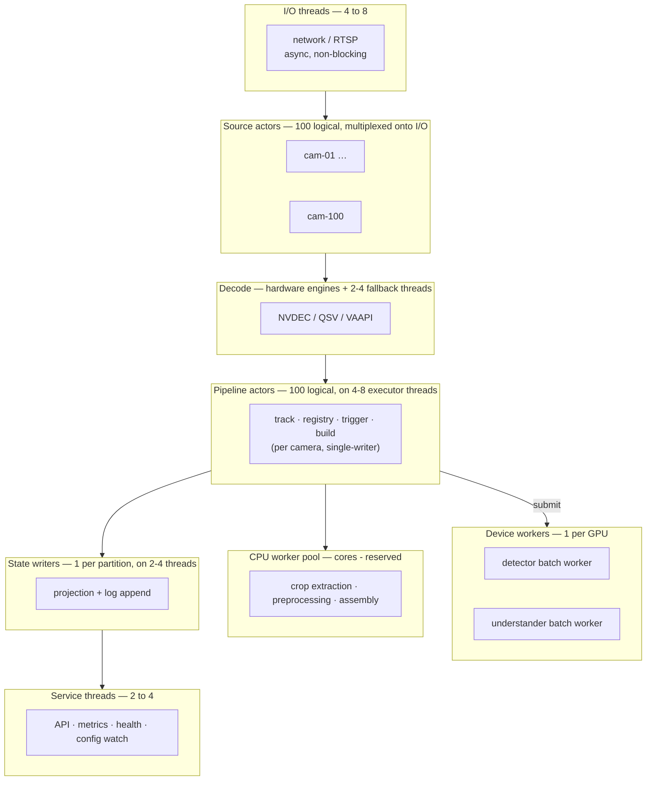
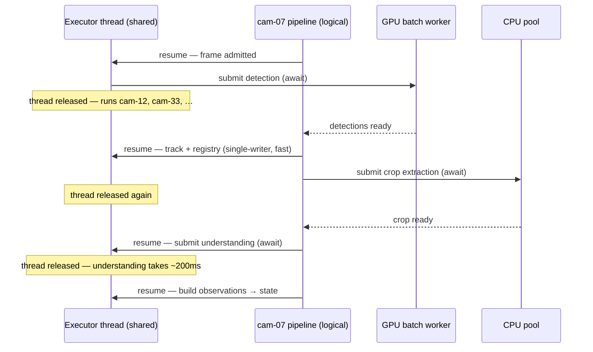
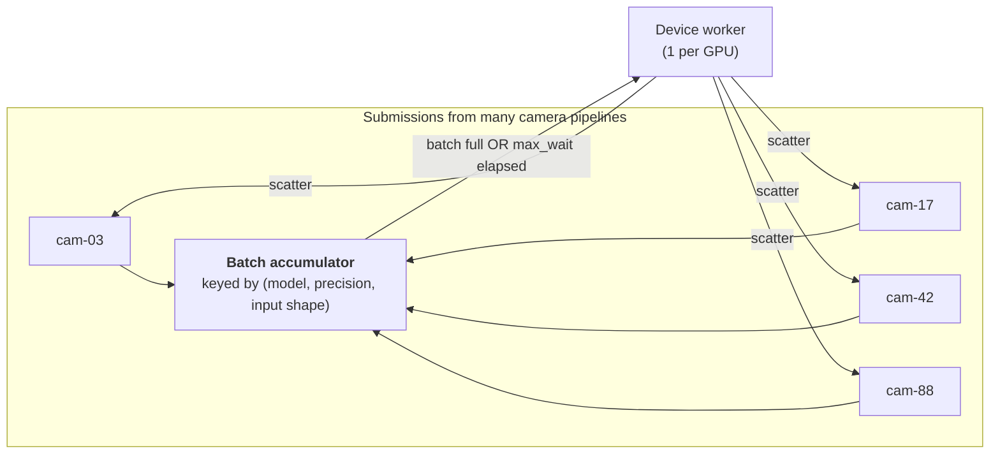
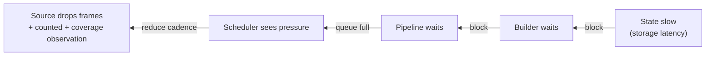
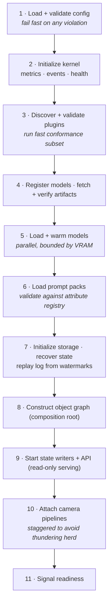
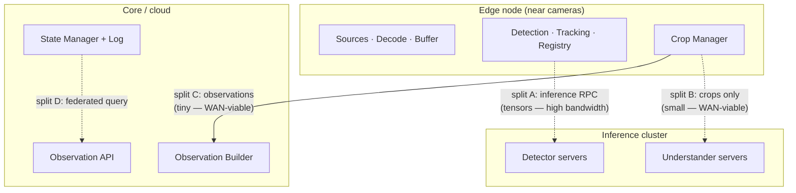

# UnityWorks Vision OS (UWV)

## Phase 1 — Runtime, Threading & Distributed Execution

| | |
|---|---|
| **Status** | Architecture Blueprint — Phase 1 (Design Only) |
| **Prerequisite** | `00`–`07` |
| **Defines** | Concurrency model, thread topology, queues and backpressure, the clock, determinism, distributed execution |
| **Enforces** | Invariants **V9** (degrade never die), **V12** (pixels stay local), **V13** (deterministic replay) |

---

## Table of Contents

- [1. The Concurrency Model](#1-the-concurrency-model)
- [2. Thread Topology](#2-thread-topology)
- [3. The Camera Pipeline as a Logical Flow](#3-the-camera-pipeline-as-a-logical-flow)
- [4. The Shared Inference Tier](#4-the-shared-inference-tier)
- [5. Queues and Backpressure](#5-queues-and-backpressure)
- [6. The Clock and Determinism](#6-the-clock-and-determinism)
- [7. Lifecycle: Boot, Reconfigure, Drain](#7-lifecycle-boot-reconfigure-drain)
- [8. Distributed Execution](#8-distributed-execution)
- [9. Concurrency Hazards and Their Structural Answers](#9-concurrency-hazards-and-their-structural-answers)

---

# 1. The Concurrency Model

> **Actors for state. Pools for work. Batches for devices. Immutability for reads.**

Four mechanisms, each applied where it is genuinely correct. Mixing them arbitrarily is how vision
systems acquire race conditions that reproduce once a fortnight.

| Mechanism | Applied to | Why | Modules |
|---|---|---|---|
| **Actor (single-threaded owner)** | Anything with mutable, order-dependent state | Eliminates locks by eliminating sharing. Order dependence is intrinsic to tracking and state projection, so serializing is not a cost — it is the requirement | M2, M6, M7, M11, M12, M15 supervisor |
| **Worker pool** | Stateless, parallelizable transforms | Pure functions scale linearly with cores and need no coordination | M8 crop extraction, M11 assembly, decode offload |
| **Batch coordinator + device worker** | GPU-bound inference | Device efficiency requires batching; one worker per device avoids contention | M5, M9 |
| **Immutable snapshot** | All read paths | Readers never block and never see torn state | M12, M14, M1, M16, M10 |

### 1.1 The single rule that removes most concurrency bugs

> **Mutable state is owned by exactly one actor. Everything crossing an actor boundary is immutable or
> a lease.**

Tracks are owned by one tracker actor. A camera's objects are owned by one registry actor. A partition's
state is owned by one writer. Frames are shared only as read-only leases (`01_LAYERED` §4.3).

The result is that the platform has **no lock hierarchy**, and therefore no lock-ordering deadlocks —
the failure class that is hardest to test for and most likely to appear first in a customer's
400-camera deployment rather than in CI.

---

# 2. Thread Topology

### 2.1 A 100-camera node



**Total OS threads: roughly 20–30 for 100 cameras.** Not 100+. This is the direct consequence of
pipelines being *logical flows* rather than threads (`01_LAYERED` §6.2). A thread-per-camera design
collapses at this scale under context-switch overhead and stack memory long before the GPU saturates.

### 2.2 Thread budget by deployment

| Deployment | Cameras | I/O | Pipeline executors | Device workers | CPU pool | State | Service | Total |
|---|---|---|---|---|---|---|---|---|
| Development | 1 | 1 | 1 | 1 | 2 | 1 | 2 | ~8 |
| Edge box | 8 | 2 | 2 | 1–2 | 4 | 1 | 2 | ~12 |
| Node | 32 | 4 | 4 | 2 | 8 | 2 | 3 | ~23 |
| Dense node | 100 | 8 | 8 | 2–4 | 16 | 4 | 4 | ~40 |

The single-process, single-camera development configuration runs the **identical code path** as the
100-camera node — the same actors, the same queues, the same batching (with batch size 1). This is
essential: a platform whose development configuration differs structurally from production is a
platform whose bugs are found by customers.

---

# 3. The Camera Pipeline as a Logical Flow

### 3.1 What a "pipeline" actually is

Not a thread. Not a process. **A sequence of asynchronous steps with an identity and a state
partition**, executed cooperatively on shared executor threads.



The pipeline spends most of its wall-clock time **awaiting** device or pool work. During those awaits
it consumes no thread. This is why 100 pipelines fit on 8 executor threads: at any instant, the
overwhelming majority are suspended waiting on a GPU.

### 3.2 The ordering guarantee

> **Within one camera, frames are processed in `FrameSeq` order through the order-dependent stages.**

Tracking and registry updates are strictly sequential per camera (`06_PORTS` T1). Enforced by:

1. The source actor assigns `FrameSeq` monotonically.
2. The pipeline processes one frame's order-dependent stages before starting the next frame's.
3. Detection may be *submitted* concurrently for pipelining, but **results are reordered** before
   tracking.
4. The tracker asserts monotonicity and rejects violations loudly rather than degrading quietly.

**Across cameras there is no ordering guarantee and none is needed** — cameras are independent, and any
cross-camera temporal reasoning uses `t_capture` with declared uncertainty (`02_VOM` §5.2), never
arrival order.

### 3.3 Pipeline depth

A camera may have several frames in flight at different stages (frame N in understanding, N+1 in
detection, N+2 decoding). Depth is bounded by configuration and is what determines buffer pool sizing
(`03_MODULES` §M4). Deeper pipelines raise throughput and latency together; the trade is explicit and
per-deployment, since a live-monitoring site and a forensic-processing site want opposite answers.

---

# 4. The Shared Inference Tier

The mechanism that makes GPU economics work.

### 4.1 Batch formation



```text
BatchPolicy:
  max_batch_size   : device- and model-specific
  max_wait         : latency budget (typically 5-20 ms)
  key              : (model_id, version, precision, input_shape)
  priority         : higher-priority submissions may form a batch sooner
```

**The dual trigger is essential.** Batch-full alone starves a 3-camera deployment that will never fill
a batch of 16. Timeout alone wastes throughput at 100 cameras. Both together mean the *same
configuration* behaves correctly at 1 camera and at 100 — which is one of the concrete requirements
this platform was asked to meet.

### 4.2 Why batching is a platform concern, not an adapter concern

An adapter *may* support batching (`06_PORTS` P8), but the **decision of what to batch together** spans
cameras and therefore cannot live in a per-camera component. Placing batch formation in the platform
gives three properties an adapter cannot provide:

1. Cross-camera batching (the entire point).
2. Priority-aware batch composition.
3. Uniform behaviour across adapters that batch and adapters that do not.

### 4.3 Determinism and batching

Batch composition is non-deterministic in live operation — it depends on arrival timing. Since some
inference kernels produce marginally different results at different batch sizes, **deterministic mode
fixes batch composition** (§6.3). This is a real effect that surprises teams who assume identical input
implies identical output; UWV surfaces it rather than letting it silently undermine replay tests.

### 4.4 Device arbitration

A detector and a VLM sharing one GPU compete for memory and compute. The Model Manager's device broker
(`05_KERNEL` §M18) arbitrates:

| Resource | Policy |
|---|---|
| **VRAM** | Reserved allocations per model, declared at registration; the broker refuses overcommit rather than discovering it via OOM mid-inference |
| **Compute** | Priority classes; detection is latency-critical (it gates the whole pipeline), understanding is throughput-tolerant |
| **Streams** | Separate device streams per model to overlap execution |
| **Preemption** | None. Long VLM calls are not preempted; instead concurrency is capped so that the detector's latency budget is protected |

---

# 5. Queues and Backpressure

### 5.1 The universal queue contract

Every inter-stage queue declares four properties, and none may be implicit (`01_LAYERED` §7.1):

```text
capacity        : bounded — ALWAYS
overflow_policy : drop_oldest | drop_newest | block | conflate | spill
overflow_signal : counter + event — ALWAYS, NEVER silent
deadline        : per item; expired items dropped and counted
```

### 5.2 Policy by connection

| Connection | Capacity | Policy | Rationale |
|---|---|---|---|
| Source → Scheduler | Small (2–4) | `drop_oldest` (realtime) / `block` (archival) | Latency vs completeness, per source semantics |
| Scheduler → Detection | Medium (2× batch) | `block` | Admission already limited the rate; blocking propagates true backpressure to the scheduler |
| Detection → Tracking | Small | `block` | Ordering matters; dropping here corrupts tracks |
| Registry → Crop | Medium | `drop_oldest` | Understanding is best-effort by design |
| Crop → Understanding | Bounded by budget | `drop_oldest` + priority | Cost-controlled (V7) |
| Builder → State | Large | `block` | **Observations must not be lost** — this is the system of record (V5) |
| State → Subscribers | Per-subscriber | `conflate` / `drop_with_gap` | One slow consumer must not stall the platform |

**Two entries carry the design's values.** `Builder → State` blocks because losing a fact is
unacceptable. `Crop → Understanding` drops because losing an enrichment is acceptable. That asymmetry is
the whole philosophy of the platform expressed as queue configuration.

### 5.3 Backpressure propagation



Backpressure travels **backward to the scheduler**, which is the only component authorized to shed
load (`03_MODULES` §M3). It sheds at the cheapest possible point — before decode where possible —
rather than deep in the pipeline after expensive work has already been done.

Every shed frame is counted with a reason, and sustained shedding produces `coverage` observations
(V8). **The platform never quietly does less work than it appears to.**

---

# 6. The Clock and Determinism

### 6.1 The injected clock

> **No module reads the system clock. Every module receives a `Clock`.**

```text
Clock:
  now()                    → UTCInstant
  monotonic()              → MonotonicInstant
  sleep(duration)          → awaitable
  timer(duration)          → awaitable
```

| Implementation | Used in | Behaviour |
|---|---|---|
| `SystemClock` | Production | Real time |
| `VirtualClock` | Replay, testing | Advances on demand, driven by frame PTS |
| `ScaledClock` | Soak testing | Real time × N — a 30-day soak in 6 hours |

This single injection is the prerequisite for V13. A module that calls the system clock directly can
never be replayed deterministically, and there is no test infrastructure that repairs it afterward —
which is why this is an architectural rule rather than a testing convenience.

### 6.2 Deterministic mode

```text
deterministic_mode:
  clock            : VirtualClock driven by frame PTS
  source_semantics : archival (no drops — completeness guaranteed)
  scheduling       : PTS-ordered, single-threaded per pipeline
  batch_composition: fixed by configuration, not by arrival timing
  model_seeds      : pinned
  model_precision  : pinned (as declared)
  concurrency      : reduced to eliminate ordering non-determinism
```

Under these conditions, the same video + config + model versions yields **byte-identical
observations** (modulo observation IDs and wall-clock fields, which are excluded from comparison).

### 6.3 The honest limits of determinism

Stating these plainly is more useful than claiming perfect reproducibility:

| Source of non-determinism | Handling |
|---|---|
| GPU kernel non-determinism (atomics, TF32, cuDNN autotuning) | Adapters **declare** `deterministic: bool`. Where false, replay compares within tolerance rather than exactly |
| Batch-size-dependent numerics | Fixed batch composition in deterministic mode (§4.3) |
| Remote model APIs | **Never deterministic.** Replay uses recorded responses (a fixture adapter), which is also how CI runs without network access or cost |
| Floating-point across hardware generations | Replay is guaranteed on *matching hardware*; cross-hardware comparison uses tolerance |
| Thread interleaving | Eliminated by single-threaded-per-pipeline execution in deterministic mode |

Determinism is therefore **specified rather than assumed**, and every adapter's conformance kit records
which category it falls into (`06_PORTS` §5).

---

# 7. Lifecycle: Boot, Reconfigure, Drain

### 7.1 Boot sequence



Three details that matter more than they appear:

- **Step 3 runs conformance before a single frame is processed**, catching catastrophic adapter bugs at
  boot rather than in production data.
- **Step 9 precedes step 10**: the API serves recovered state before cameras attach, so consumers
  reconnecting after a deployment get valid (if briefly stale) answers rather than errors.
- **Step 10 is staggered.** One hundred cameras connecting simultaneously creates a network and decode
  spike that can cause the boot itself to fail — a self-inflicted thundering herd.

### 7.2 Reconfiguration

| Change | Applied how |
|---|---|
| Cadence, budget, thresholds | **Hot** — next config snapshot |
| Region geometry | **Hot** — new version; open dwell accumulators are closed and reopened against the new version |
| Prompt packs | **Hot** — atomic catalogue swap |
| Model version (same port) | **Hot** — drain-and-swap via Model Manager |
| Adapter/plugin swap | **Hot** — drain the port binding, swap, resume |
| Camera add/remove | **Hot** — attach/detach pipeline |
| Port major version | **Restart** |
| Thread topology, pool sizing | **Restart** |
| Storage adapter | **Restart** |

Hot changes are applied at **snapshot boundaries**, never mid-frame, so no frame is ever processed
under a mixture of two revisions. Every observation records the `config_revision` that governed it
(`02_VOM` §3), making the effect of any change traceable in the data afterward.

### 7.3 Graceful drain

```text
1. Stop admitting new frames (scheduler closes)
2. Await in-flight inference, bounded by timeout
3. Flush the Observation Builder
4. Commit all observations to the log
5. Checkpoint state projections + log positions
6. Emit coverage observations for the shutdown window   ← V8
7. Close sources, release devices, unload models
8. Exit
```

Step 6 is easy to omit and important to keep: without it, a deployment looks in the record exactly like
an unexplained blind period. With it, an operator investigating a gap sees "planned shutdown" instead of
a mystery.

---

# 8. Distributed Execution

### 8.1 The split points

Distribution is achieved by moving **existing boundaries** across a network, not by adding new
abstractions. Four boundaries are already suitable because each carries control-plane-sized payloads.



| Split | Crosses | Payload | Suitable for |
|---|---|---|---|
| **A** · Pipeline ↔ Detector | `ModelRuntimePort` | Frames/tensors — **high bandwidth** | LAN only |
| **B** · Crop ↔ Understander | `UnderstanderPort` | Crops — 50–500 KB, **infrequent** | LAN or **WAN** |
| **C** · Builder ↔ State | `ObservationSinkPort` | Observations — ~2 KB | LAN or **WAN** |
| **D** · State ↔ API | Query interface | Query results | Anywhere |

**Splits B, C, and D are WAN-viable; split A is not.** That asymmetry is invariant V12 expressed as a
deployment constraint, and it dictates the canonical edge/cloud topology: detection and tracking run
where the cameras are, understanding and state may run centrally.

### 8.2 The canonical edge-cloud deployment

```text
EDGE  (per site, near cameras)
  sources · decode · buffer · detection · tracking · registry · crop
  ── uplink: crops (occasional) + observations (continuous) ──
CLOUD (regional)
  understanding (optional) · builder · state · log · API
```

Bandwidth for a 40-camera site: roughly **200–500 Kb/s of observations** plus occasional crops — well
within an ordinary business connection. The same site shipping raw video would need ~800 Mb/s. That
1000× difference is the entire practical argument for V12 and the reason the two-plane model was chosen
first (`01_LAYERED` §4).

### 8.3 Partition placement and rebalancing

```text
PlacementPolicy:
  static           # explicit camera → node assignment; simple, predictable
  load_balanced    # by measured compute cost per camera
  affinity         # cameras sharing a model tier co-located
  locality         # cameras assigned to the nearest edge node
```

Rebalancing moves a camera pipeline between nodes:

```text
1. Target node prepares the partition (replays state from log)
2. Source node drains the pipeline (stops admission, finishes in-flight)
3. Source commits final observations and its log watermark
4. Ownership transfers atomically (single-writer invariant preserved)
5. Target attaches the source and resumes
6. A coverage observation records the handover gap
```

The handover produces a brief, **recorded** gap. Attempting a zero-gap handover would require two
writers on one partition momentarily, violating V6 — a trade the architecture deliberately refuses,
because a recorded one-second gap is honest and a silent double-write is corruption.

### 8.4 What distribution does not change

| Unchanged | Why |
|---|---|
| Module responsibilities | Distribution is a placement concern |
| Port contracts | Same contracts, different transport adapters |
| Object model | Identifiers are already globally unique (`02_VOM` §4.1) |
| Single-writer invariant | Preserved per partition, wherever it runs |
| Consistency model | Already honest about per-partition versions (`07_STATE` §5.2) |
| Observation schema | Already wire-stable and versioned |

**The architecture was distributed-ready from the first document, not retrofitted.** Every choice that
made it so — camera-scoped partitions, globally unique identifiers, honest consistency, control-plane
payloads, ports for transport — was made for local correctness first and pays for distribution second.

---

# 9. Concurrency Hazards and Their Structural Answers

The specific failure modes this model is designed to make impossible, rather than merely unlikely.

| Hazard | Structural answer |
|---|---|
| **Data race on track state** | Single-threaded actor per camera; no sharing |
| **Lock-ordering deadlock** | **No locks exist** on the hot path — actors and immutable snapshots only |
| **Out-of-order frames corrupting tracks** | Sequential ordering per camera + monotonicity assertion that fails loudly |
| **Unbounded queue growth → OOM** | All queues bounded by contract; unbounded is structurally forbidden |
| **Slow consumer stalls the platform** | Per-subscriber policies; conflate or drop with an explicit `Gap` |
| **Thread explosion at 100 cameras** | Logical pipelines on shared executors — ~30 threads, not 100+ |
| **GPU OOM from competing models** | Device broker with reserved allocations; refuses overcommit rather than discovering it |
| **Priority inversion (slow VLM starves detection)** | Separate device workers, separate concurrency budgets, capped VLM concurrency |
| **Torn config read mid-frame** | Immutable snapshots applied at frame boundaries |
| **Lost observations on shutdown** | Graceful drain with commit before exit |
| **Buffer exhaustion from a leaked lease** | Lease deadlines with forced break and holder attribution |
| **Thundering herd on boot** | Staggered camera attach |
| **Clock jump breaking cadence** | Monotonic-time phase accumulators, immune to wall-clock steps |
| **Non-reproducible test failures** | Injected clock + deterministic mode + declared adapter determinism |

---

## Where to go next

| Question | Document |
|---|---|
| How do consumers connect to all this? | `09_API_CONTRACTS.md` |
| What happens when parts of it fail? | `10_RELIABILITY_AND_FAILURE.md` |
| How is capacity sized? | `11_PERFORMANCE_AND_SCALING.md` |
| How is concurrency tested? | `14_TESTING_STRATEGY.md` |
