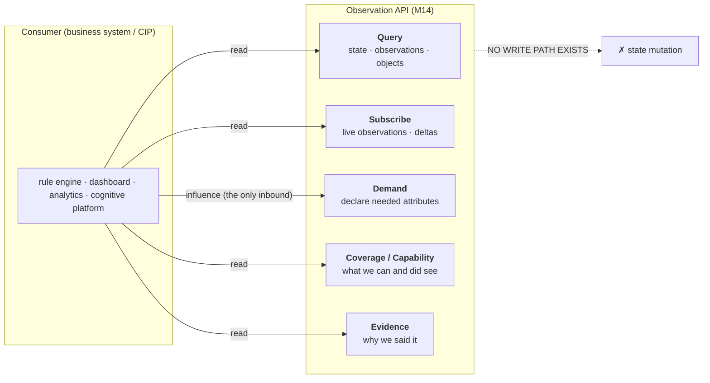
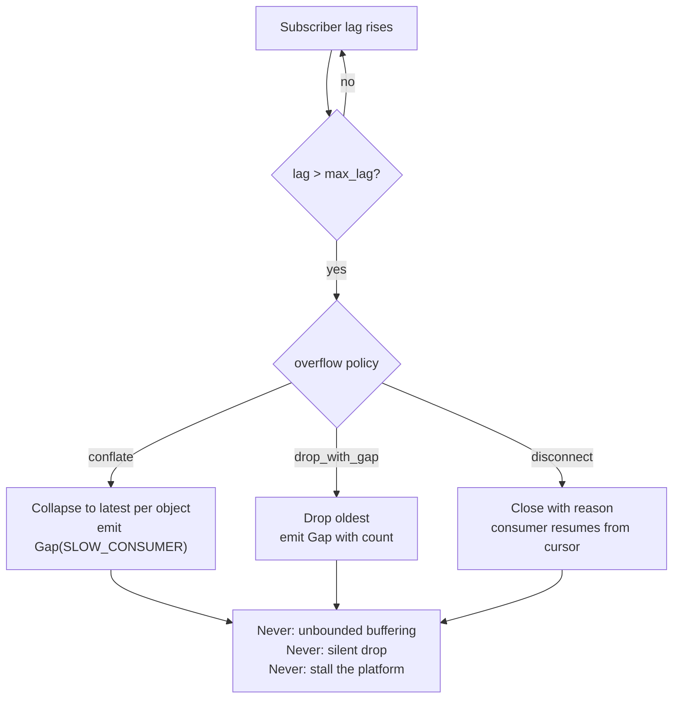
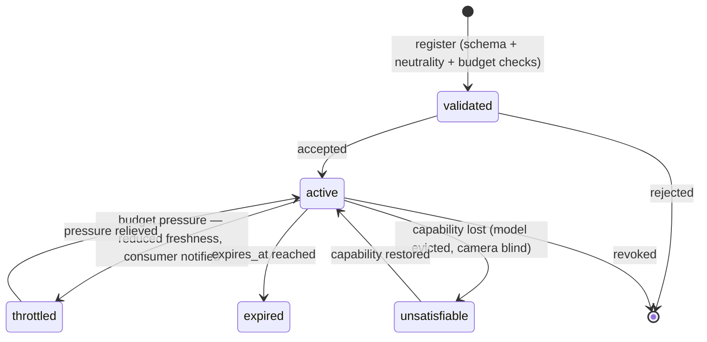

# UnityWorks Vision OS (UWV)

## Phase 1 — API Contracts

| | |
|---|---|
| **Status** | Architecture Blueprint — Phase 1 (Design Only) |
| **Prerequisite** | `00`–`08` |
| **Defines** | Query, subscription, and demand contracts; delivery semantics; versioning; the consumer's obligations |
| **Transport** | **Deliberately unspecified.** Contracts are semantic; transports are adapters (`06_PORTS` P32) |

> **Why no wire protocol is specified here.** A protocol chosen in 2026 will be dated by 2032. The
> *semantics* — what a query means, what a gap marker guarantees, how versions negotiate — must outlive
> several transports. Every contract below is expressible over request/response, streaming, message
> bus, or webhook delivery without change.

---

## Table of Contents

- [1. The Contract Surface](#1-the-contract-surface)
- [2. Query Contracts](#2-query-contracts)
- [3. Subscription Contracts](#3-subscription-contracts)
- [4. Demand Contracts](#4-demand-contracts)
- [5. Coverage and Capability Contracts](#5-coverage-and-capability-contracts)
- [6. Evidence Contract](#6-evidence-contract)
- [7. Versioning and Compatibility](#7-versioning-and-compatibility)
- [8. Error Model](#8-error-model)
- [9. The Consumer's Obligations](#9-the-consumers-obligations)
- [10. A Worked Integration](#10-a-worked-integration)

---

# 1. The Contract Surface



### 1.1 The five contracts, and the one that is absent

| Contract | Direction | Purpose |
|---|---|---|
| **Query** | Consumer → Platform → Consumer | Pull current state or historical observations |
| **Subscribe** | Platform → Consumer (continuous) | Push observations and state deltas as they occur |
| **Demand** | Consumer → Platform | Declare which attributes are needed, where, how fresh |
| **Coverage / Capability** | Consumer → Platform → Consumer | Learn what the platform could see and can produce |
| **Evidence** | Consumer → Platform → Consumer | Retrieve the justification behind an observation |
| ~~**Mutate**~~ | — | **Does not exist** (V6). There is no endpoint, no field, no admin override |

### 1.2 The demand contract is the architecturally interesting one

Consumers must be able to influence *what the platform spends money computing* without telling it
*why*. Demand contracts are how (`00_CHARTER` §2):

```text
"I need headwear_present on person in region Z3, refreshed every 30s"     ✅ Demand
"because uncovered hair near food is a hygiene violation"                  ❌ Never crosses
```

The platform schedules work to satisfy demands within budget. It never learns what any demand is for,
which is precisely why the same platform serves a kitchen and an operating theatre.

---

# 2. Query Contracts

## 2.1 Query current state

```text
query_state(scope, filter, options) → StateResult
```

```text
scope:
  tenant_id       : required
  site_ids        : [SiteId]?
  camera_ids      : [CameraId]?
  region_ids      : [RegionId]?

filter:
  class_ids       : [ClassId]?           # hierarchical: "vehicle" matches "vehicle.forklift"
  lifecycle       : [LifecycleState]?     # default: [active, occluded]
  min_confidence  : float?                # applies only to calibrated confidence
  attributes      : [AttributePredicate]? # e.g. posture == "standing"
  max_staleness   : Duration?             # exclude objects not confirmed recently
  object_ids      : [ObjectId]?

options:
  include_attributes  : all | [AttributeKey] | none
  include_spatial     : bool
  include_trajectory  : bool
  include_provenance  : bool              # default true — explainability is not opt-out by accident
  limit / cursor
```

```text
StateResult:
  objects      : ObjectView[]
  snapshot     : { partitions, consistency, max_lag, incomplete }   # 07_STATE §5.2
  coverage     : CoverageSummary          # ALWAYS included — never optional
  capabilities : CapabilitySummary
  cursor       : Cursor?
```

**`coverage` is returned on every state query, unconditionally.** A consumer must not be able to
receive an empty or thin result without simultaneously receiving the information required to interpret
it (V8). Making it optional would guarantee that most consumers omit it, and the ones who omit it are
exactly the ones who will misread the result.

## 2.2 Query historical observations

```text
query_observations(scope, window, filter, cursor) → Page<Observation>
```

```text
window:
  from, to        : UTCInstant           # against t_capture, not ingest time
  max_span        : enforced by policy

filter:
  observation_types : [ObservationType]?
  object_ids        : [ObjectId]?
  class_ids         : [ClassId]?
  attribute_keys    : [AttributeKey]?
  min_confidence    : float?
  producer          : ModelId?            # e.g. "everything the old detector produced"
  include_superseded: bool                # default false
```

| Semantic | Guarantee |
|---|---|
| **Ordering** | By `t_capture`, then `observation_id` — total and stable |
| **Pagination** | Opaque cursor; **stable under concurrent writes** because the log is immutable (V5) |
| **Time basis** | `t_capture` always; each result carries its `t_capture_unc` |
| **Superseded** | Excluded by default; retrievable for audit |
| **Completeness** | The page reports whether the window was fully observable |

**Cursor stability is a direct dividend of immutability.** In a mutable store, paginating through a
changing dataset either repeats or skips records. Here, a historical window is a fixed set of immutable
facts, so a consumer can page through a million observations across an hour of wall-clock time and get
exactly the right set.

## 2.3 Query a single object

```text
get_object(object_id, options) → ObjectView !NotFound !Forbidden
```

Returns current state plus, on request, full history, identity binding chain, and attribute evolution —
the "tell me everything about object O-14" call used by debugging and audit tools.

---

# 3. Subscription Contracts

## 3.1 Subscribe

```text
subscribe(scope, filter, delivery) ⇢ Message
```

```text
Message = Observation | StateDelta | Gap | Heartbeat | CoverageChange | Control
```

```text
delivery:
  mode          : all | conflated | sampled
  overflow      : conflate | drop_with_gap | disconnect
  max_lag       : Duration
  batch_window  : Duration?      # coalesce messages to reduce chattiness
  heartbeat     : Duration       # liveness signal; default 10s
  resume_from   : Cursor?        # reconnect without loss
```

## 3.2 Delivery semantics

| Mode | Guarantee | Use for |
|---|---|---|
| `all` | Every matching observation, at-least-once | Rule engines, audit, anything that must not miss an event |
| `conflated` | Latest per object; intermediate states may be skipped | Live dashboards, overlays |
| `sampled` | Rate-limited sample | Monitoring, spot checks |

- **At-least-once with dedupe by `observation_id`.** Consumers must deduplicate; this is stated in
  their obligations (§9).
- **Ordering** is guaranteed per object, not globally. Cross-object ordering uses `t_capture`.
- **Resumption**: a consumer reconnecting with `resume_from` receives everything since that cursor,
  bounded by log retention.

## 3.3 The Gap message

The most important message type in the subscription contract.

```text
Gap:
  from, to        : UTCInstant
  scope           : affected cameras / regions
  reason          : SLOW_CONSUMER | PLATFORM_BLIND | BUDGET_SHED
                  | PARTITION_UNAVAILABLE | RETENTION_EXPIRED
  observations_missed : int?      # count where known
  recoverable     : bool          # can it be fetched via query_observations?
```

> **A subscriber is never silently skipped.** If the platform drops messages for any reason —
> the consumer was slow, the camera was blind, the budget was exhausted — an explicit `Gap` is
> delivered. This is V8 applied to delivery, and it is what allows a consumer to distinguish "nothing
> happened" from "you were not told what happened."

`recoverable: true` means the consumer can backfill via `query_observations` over the gap window. A
well-built consumer does exactly that.

## 3.4 Slow consumer handling



---

# 4. Demand Contracts

## 4.1 The contract

```text
register_demand(demand) → DemandId !Rejected
```

```text
Demand:
  demand_id        : assigned
  subscriber       : SubscriberId
  scope            : { site_ids, camera_ids?, region_ids? }
  subject_filter   : { class_ids, lifecycle?, min_confidence? }
  required_attributes : [AttributeKey]        # MUST be registry-registered
  freshness        : Duration                 # max acceptable staleness
  trigger_hints    : [on_first_sight | on_change | on_region_entry | periodic]
  priority_class   : opaque string            # platform orders by it; never interprets it
  budget           : { max_calls_per_hour?, max_cost_per_hour? }
  expires_at       : UTCInstant?
```

## 4.2 What a demand may and may not contain

| May contain | May not contain |
|---|---|
| Which registered attributes are needed | Why they are needed |
| Which classes and regions | What the regions mean |
| How fresh they must be | What "too old" implies |
| A priority class label | A business justification for the priority |
| A cost ceiling | A rule, threshold, or conclusion |

A demand referencing an unregistered attribute is **rejected at registration** with a pointer to the
registration process (`02_VOM` §9) — the fourth and outermost ring of Semantic Ceiling enforcement.

## 4.3 Demand resolution and honest refusal

```text
DemandAcknowledgement:
  demand_id       : DemandId
  status          : accepted | partially_accepted | rejected
  satisfiable     : [AttributeKey]
  unsatisfiable   : [(AttributeKey, reason)]
  estimated_cost  : CostEstimate
  effective_freshness : Duration     # what the platform can ACTUALLY deliver
```

**`effective_freshness` is where the platform tells the truth about its limits.** A consumer asking for
1-second freshness on 200 objects across 40 cameras is asking for something the budget will not buy.
Rather than accepting and silently under-delivering, the platform responds with what it can actually
sustain — say 12 seconds — and the consumer decides whether to narrow scope, raise budget, or accept.

Similarly, `unsatisfiable` reports capability gaps: *no loaded model can produce `mobility_aid` at this
site.* The consumer learns this at registration, in seconds, instead of discovering it as a permanent
absence of data weeks later. This is V8 applied at integration time, and it eliminates the single most
common integration failure in vision platforms.

## 4.4 Demand lifecycle



Every transition notifies the subscriber. A demand that quietly stops being satisfied is the failure
mode this lifecycle exists to prevent.

---

# 5. Coverage and Capability Contracts

## 5.1 Coverage

```text
coverage(scope, window) → CoverageReport
```

```text
CoverageReport:
  observable_fraction : float          # 0.0 - 1.0 of the window actually observed
  per_camera          : Map<CameraId, CameraCoverage>
  gaps                : [(from, to, reason, scope)]
  effective_rate      : float          # actual vs configured processing rate
  degradations        : [(from, to, what_was_reduced)]
```

**The contract's most important sentence, stated for consumers:**

> *An empty result over a window with `observable_fraction < 1.0` does not mean nothing happened. It
> means nothing was observed. These are different claims and the platform will never conflate them.*

## 5.2 Capability

```text
capabilities(scope) → CapabilityReport
```

```text
CapabilityReport:
  taxonomy_version    : SemVer
  producible_classes  : [(ClassId, camera_ids where producible)]
  producible_attributes : [(AttributeKey, applicable classes, typical latency, cost class)]
  gaps                : [(requested_thing, reason)]
  models_in_use       : [(role, ModelId, version)]      # for reproducibility
  effective_since     : UTCInstant
```

Capability is **live state, not documentation** (`07_STATE` §3.4). When a model is evicted under memory
pressure or a prompt pack fails to reload, the report changes and subscribers are notified. A consumer
polling this can react to capability loss rather than silently degrading.

---

# 6. Evidence Contract

```text
get_evidence(evidence_ref, options) → EvidenceView !Expired !Forbidden !NotFound
```

```text
EvidenceView:
  observation_id    : ObservationId
  trigger_reason    : TriggerReason
  crop              : ImageRef?          # subject to retention + privacy authorization
  raw_model_output  : text | bytes?
  unstructured_note : text?
  decision_path     : DecisionStep[]
  provenance        : full Provenance    # model, version, artifact hash, prompt, config revision
  timing            : Timing
  quality           : QualityGrades
```

| Property | Rule |
|---|---|
| **Authorization** | Separate from observation access. Reading a fact and viewing the image behind it are different privileges (`12_SECURITY_AND_PRIVACY.md`) |
| **Retention** | Evidence expires before observations. `Expired` is a **normal, distinct** outcome from `NotFound` |
| **Audit** | Every evidence access is audited with actor, purpose, and timestamp |
| **Rate limiting** | Separate, tighter budget — evidence payloads are large and sensitive |

This contract is what makes V4 usable rather than theoretical. An observation that is explainable in
principle but whose explanation cannot be retrieved is not explainable in practice.

---

# 7. Versioning and Compatibility

### 7.1 Negotiation

Consumers declare an accepted major version and receive payloads in that version. The platform serves
**two adjacent majors concurrently** during a migration window, so consumers migrate independently
rather than in a coordinated flag day (`02_VOM` §12).

### 7.2 The compatibility matrix

| Change | Version | Consumer action |
|---|---|---|
| New optional field on an observation | Minor | **None** — ignore unknown fields (§9) |
| New enum value (e.g. a new `DropReason`) | Minor | **None** — tolerate unknown values (§9) |
| New taxonomy class | Taxonomy minor | None; hierarchical matching keeps existing queries working |
| New attribute schema | Registry minor | None; opt in via demand |
| New observation type | Minor | None; filter selects what you want |
| New query parameter | Minor | None |
| Field removed or renamed | **Major** | Migrate within the window |
| Field meaning changed | **Major** | Migrate — but the platform prefers adding a new field instead |
| Confidence semantics changed | **Major** | Re-evaluate every threshold |

### 7.3 The deprecation timeline

```text
T+0     New major published; both majors served
T+0     Deprecation announced with a migration guide and per-consumer usage telemetry
T+90d   Deprecation warnings surfaced in responses
T+180d  Old major read-only / rate-limited
T+270d  Old major retired
```

Nine months is deliberate: consumers of a perception platform include long-lived operational systems on
annual release cycles, and a shorter window would force either rushed migrations or permanent version
sprawl.

---

# 8. Error Model

```text
Error:
  code        : ErrorCode          # stable, machine-readable, never reworded
  message     : text               # human-readable, may change
  retryable   : bool               # unambiguous — no guessing
  retry_after : Duration?
  details     : structured context
  request_id  : for correlation with platform logs
```

| Category | Codes | Retryable |
|---|---|---|
| **Authentication** | `UNAUTHENTICATED`, `TOKEN_EXPIRED` | After re-auth |
| **Authorization** | `FORBIDDEN`, `TENANT_SCOPE_VIOLATION` | No |
| **Validation** | `INVALID_SCOPE`, `UNKNOWN_ATTRIBUTE`, `UNKNOWN_CLASS`, `WINDOW_TOO_LARGE` | No |
| **Demand** | `DEMAND_REJECTED`, `BUDGET_EXCEEDED`, `CAPABILITY_UNAVAILABLE` | Depends |
| **Availability** | `PARTITION_UNAVAILABLE`, `OVERLOADED`, `DEGRADED` | **Yes** |
| **Data** | `NOT_FOUND`, `EXPIRED`, `SUPERSEDED` | No |
| **Version** | `UNSUPPORTED_VERSION`, `VERSION_RETIRED` | No |

**Two rules that matter more than the taxonomy:**

1. **`retryable` is explicit.** Consumers must never infer retryability from a status code or a message
   string. Inferring it is how retry storms begin.
2. **Partial results are explicit, never implicit.** A query touching an unavailable partition returns
   the data it has *plus* an explicit statement of what is missing — never a quietly smaller result set
   (V8).

---

# 9. The Consumer's Obligations

Integration is a two-way contract. These obligations are published with v1 and are what make a decade
of additive evolution possible without breaking anyone.

| # | Obligation | Why |
|---|---|---|
| **C1** | **Ignore unknown fields** | Every additive change depends on this. A consumer that rejects unknown fields makes every minor version a breaking change |
| **C2** | **Tolerate unknown enum values** | New drop reasons, lifecycle states, and observation types will appear. Map unknowns to a sensible default; never crash |
| **C3** | **Deduplicate by `observation_id`** | Delivery is at-least-once |
| **C4** | **Handle `Gap` messages** | Otherwise silence is misread as absence — the failure V8 exists to prevent |
| **C5** | **Check `coverage` before concluding absence** | An empty result is not evidence of an empty scene |
| **C6** | **Respect `measurement_basis`** | Do not treat a `predicted` position as a measured one |
| **C7** | **Respect confidence semantics** | Never compare uncalibrated scores across models (`02_VOM` §7.2) |
| **C8** | **Check `is_stale` / `staleness`** | A 40-minute-old attribute is not a current fact |
| **C9** | **Own your thresholds** | The platform supplies durations, counts, and confidences. Every threshold is yours, by design (V1) |
| **C10** | **Never assume a write path exists** | It does not, and it will not |
| **C11** | **Register demands for what you need** | Attributes nobody demands are not computed (V7). Silence is often a missing demand |
| **C12** | **Handle capability gaps** | Some attributes are unavailable at some sites; design for degradation |

---

# 10. A Worked Integration

A restaurant monitoring application integrating with UWV. **Every business concept lives on the
consumer's side of the line; the platform sees only the neutral half.**

### Step 1 — Discover capability

```text
capabilities(site: "site-sg-01")
→ producible_classes: [person, container.tray, container.plate, furniture.table, ...]
  producible_attributes: [posture, motion_state, carrying, headwear_present, ...]
  gaps: []
```

### Step 2 — Register demands

```text
register_demand({
  scope: { site: "site-sg-01", regions: ["Z3", "Z7"] },
  subject_filter: { class_ids: ["person"] },
  required_attributes: ["posture", "carrying", "headwear_present"],
  freshness: 30s,
  trigger_hints: [on_first_sight, on_change, on_region_entry],
  priority_class: "A",
  budget: { max_calls_per_hour: 4000 }
})
→ status: accepted
  effective_freshness: 30s
  estimated_cost: 3200 calls/hour
```

### Step 3 — Subscribe

```text
subscribe(
  scope: { site: "site-sg-01" },
  filter: { class_ids: ["person"], observation_types: [attribute, spatial, lifecycle, coverage] },
  delivery: { mode: all, overflow: drop_with_gap, heartbeat: 10s, resume_from: <cursor> }
)
```

### Step 4 — Receive neutral facts

```text
Observation:
  object_id : O-14
  class_id  : person
  region_membership: [{ region_id: "Z3", dwell: 45.12s, containment: 0.94 }]
  attributes: [ posture=standing (0.94), carrying=container.tray (0.76),
                headwear_present=false (0.83) ]
  measurement_basis: measured
  quality   : { scale: 218px, occlusion: 0.08, overall: good }
```

### Step 5 — Apply business logic (entirely consumer-side)

```text
CONSUMER-SIDE — the platform never sees any of this:

  Z3            → "kitchen pass"                       (consumer's mapping)
  dwell > 60s   → "station unattended" candidate       (consumer's threshold)
  headwear_present == false AND region is food-prep
                → "hygiene policy exception"           (consumer's policy)
  carrying == container.tray AND Z3 → Z7 transition
                → "service event"                      (consumer's model)
  correlate with POS ticket times                      (consumer's data)
  → raise alert, update dashboard, notify manager      (consumer's actions)
```

### The same platform, a different vertical — with zero platform change

| | Restaurant | Hospital |
|---|---|---|
| Demand | `headwear_present`, `carrying` | `posture`, `mobility_aid` |
| Region `Z3` means | "kitchen pass" | "bed 12 bay" |
| Rule | dwell > 60s → station unattended | `posture=lying` outside bed region → review |
| Consumer | Restaurant ops app | Clinical safety app |
| **Platform config** | Taxonomy profile, prompt pack, regions, demands | Taxonomy profile, prompt pack, regions, demands |
| **Platform code** | **Identical** | **Identical** |

This table is the charter's central claim, reduced to an integration diff. Everything that differs is
data; nothing that differs is code.

---

## Where to go next

| Question | Document |
|---|---|
| What happens when things fail? | `10_RELIABILITY_AND_FAILURE.md` |
| How is the API secured? | `12_SECURITY_AND_PRIVACY.md` |
| How are contracts tested? | `14_TESTING_STRATEGY.md` |
