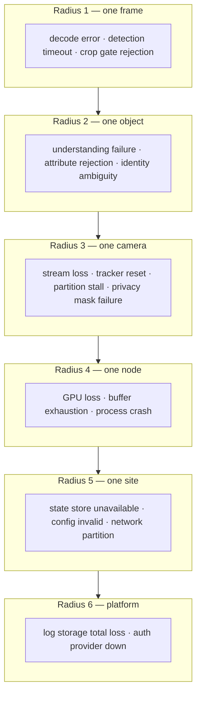
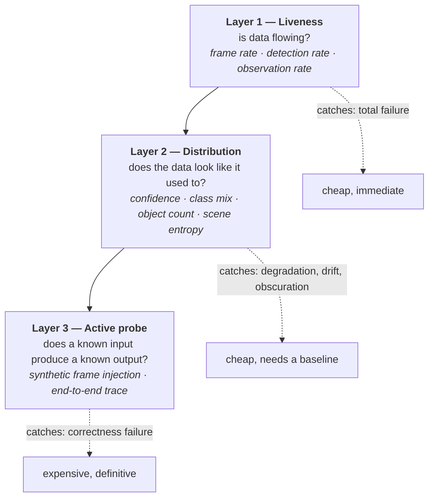

# UnityWorks Vision OS (UWV)

## Phase 1 — Reliability & Failure Recovery

| | |
|---|---|
| **Status** | Architecture Blueprint — Phase 1 (Design Only) |
| **Prerequisite** | `00`–`09` |
| **Defines** | Failure taxonomy, degradation ladders, blast radius, recovery procedures, the silent-failure problem |
| **Enforces** | Invariants **V8** (blindness is explicit), **V9** (degrade never die) |

---

## Table of Contents

- [1. The Reliability Philosophy](#1-the-reliability-philosophy)
- [2. Failure Taxonomy](#2-failure-taxonomy)
- [3. Blast Radius](#3-blast-radius)
- [4. Degradation Ladders](#4-degradation-ladders)
- [5. The Silent Failure Problem](#5-the-silent-failure-problem)
- [6. Recovery Procedures](#6-recovery-procedures)
- [7. Circuit Breakers and Fallbacks](#7-circuit-breakers-and-fallbacks)
- [8. Failure Injection Catalogue](#8-failure-injection-catalogue)
- [9. Reliability Targets](#9-reliability-targets)

---

# 1. The Reliability Philosophy

> **A vision platform's job when things go wrong is to keep perceiving what it still can, and to say
> precisely what it no longer can.**

Three principles, in priority order. When they conflict, the earlier wins.

| # | Principle | Meaning |
|---|---|---|
| **R1** | **Honesty over availability** | It is better to report blindness than to serve stale or fabricated data. A confidently wrong observation is worse than an admitted gap, because a consumer can handle a gap and cannot detect a lie |
| **R2** | **Partial over total** | 97 working cameras beat 100 failed ones. Every failure is contained to the smallest possible scope |
| **R3** | **Degradation over termination** | Reduce capability, reduce cadence, drop enrichment — but keep the core loop running |

### 1.1 The failure that must never happen

Everything in this document is arranged against one specific outcome:

> **A consumer receives no observations, concludes nothing happened, and acts on that conclusion —
> while the platform was in fact blind.**

Every other failure is recoverable. This one produces confident wrong action in the physical world,
which in a hospital or factory context is a safety event rather than an outage. The coverage model
(`07_STATE` §7), the `Gap` message (`09_API` §3.3), and silent-failure detection (§5 below) exist as
three independent defences against this single outcome.

---

# 2. Failure Taxonomy

Every failure in UWV is classified, because the classification determines the response. An unclassified
failure gets a guessed response, and guessed responses are how retry storms and crash loops begin.

| Class | Definition | Response pattern | Example |
|---|---|---|---|
| **Transient** | Self-resolving; retry is likely to succeed | Retry with backoff, bounded | Network blip, momentary GPU contention, decode error on one frame |
| **Persistent** | Will not self-resolve; retry is futile | Stop retrying, fall back, alarm | Bad credentials, unsupported codec, corrupt model artifact |
| **Poison** | A specific input reliably causes failure | Quarantine the input, continue the stream | A malformed frame that crashes the decoder |
| **Systemic** | Affects a shared resource; retry makes it worse | Shed load, circuit-break, escalate | GPU OOM, storage saturation, thread pool exhaustion |
| **Silent** | No error is raised, but output is wrong or absent | **Active detection required** (§5) | Camera showing a frozen frame; detector returning empty forever |
| **Byzantine** | A component returns confident, plausible, wrong output | Cross-checks, calibration monitoring, evidence | A VLM hallucinating an attribute on an unreadable crop |

### 2.1 Why the last two dominate the design

Transient, persistent, poison, and systemic failures are well-understood and handled with standard
patterns. **Silent and Byzantine failures are what actually hurt vision systems**, because both produce
a system that appears healthy on every conventional metric while being useless or actively misleading.

The architectural responses are distributed throughout the platform rather than concentrated in an
error handler:

| Failure | Defence | Where |
|---|---|---|
| Silent | Coverage model, silent-failure detectors, heartbeats, active probes | `05_KERNEL` §M20, `07_STATE` §7 |
| Byzantine | Quality gating before inference, `NO_FABRICATION_ON_FAILURE` conformance test, confidence calibration, evidence retention, distribution drift canaries | `03_MODULES` §M8, `06_PORTS` §5.3, `05_KERNEL` §M21 |

---

# 3. Blast Radius

The single most important reliability property: **what else breaks when this breaks?**



### 3.1 Containment by design

| Failure | Radius | Contained by |
|---|---|---|
| Decode error | Frame | Frame-level error handling; next frame proceeds |
| Detection timeout | Frame | Batch retry, then drop with coverage |
| Understanding failure | Object | Enrichment is optional; presence/spatial observations continue (`01_LAYERED` §3.1) |
| Attribute schema rejection | Object attribute | Other attributes in the same observation survive |
| Stream loss | Camera | **Source actor isolation** (`03_MODULES` §M2) |
| Tracker corruption | Camera | Per-camera tracker state + epoch reset |
| Partition stall | Camera | **Single-writer partitioning** (`07_STATE` §4) |
| Plugin crash (in-process) | Node | Circuit breaker; recommend subprocess isolation |
| Plugin crash (subprocess) | Plugin | Process isolation; restart |
| GPU loss | Node | Migrate to remaining devices at reduced cadence |
| State store unavailable | Site | Bounded local buffering, then explicit degradation |
| Log storage total loss | Platform | **Replication is mandatory**; this is a declared critical incident |

**The two structural decisions that produce most of this containment** are actor isolation per source
and single-writer partitioning per camera. Neither was chosen primarily for reliability — they were
chosen for lock-free concurrency (`08_RUNTIME` §1) — but they deliver fault containment as a
consequence. That coincidence is not accidental: designs that isolate mutable state also isolate
failure.

---

# 4. Degradation Ladders

Every stage declares an ordered ladder. Degradation proceeds down the ladder; recovery climbs back up.

### 4.1 Acquisition ladder (M2)

```text
1. Full rate, hardware decode, all frames available
2. Hardware decode fails → software decode          [degraded, higher CPU]
3. Packet loss high → keyframe-only decode          [degraded, lower temporal resolution]
4. Stream stalls → reconnect with backoff           [blind during reconnect + coverage observation]
5. Persistent failure → camera marked failed        [blind, alarmed]

EXCEPTION — privacy mask failure jumps straight to blind. It never degrades.
```

### 4.2 Detection ladder (M5)

```text
1. Primary model, full resolution, optimal batch
2. Device pressure → reduce batch size              [degraded, lower throughput]
3. Continued pressure → reduce input resolution     [degraded, small objects lost — REPORTED as a
                                                     capability change, not hidden]
4. Model unavailable → fallback model               [degraded, different accuracy profile]
5. No model available → detection stops             [blind, coverage observations]
```

Step 3 is subtle and important: lowering resolution silently changes *what the platform can see*.
Small or distant objects disappear. Reporting this as a capability change means a consumer relying on
distant-object detection learns that it no longer works — rather than concluding the objects are gone.

### 4.3 Understanding ladder (M9)

```text
1. Primary model, full attribute set, target freshness
2. Budget pressure → reduce freshness               [degraded, demands notified of new effective_freshness]
3. More pressure → priority classes only            [degraded, low-priority demands unsatisfied + notified]
4. Model unavailable → fallback model               [degraded]
5. No understanding available → attributes stop     [presence/spatial CONTINUE — the core loop is intact]
```

Step 5 is the ladder's most valuable property: total loss of the most expensive, most fragile component
in the platform costs enrichment only. Detection, tracking, identity, position, and dwell all keep
working.

### 4.4 State ladder (M12)

```text
1. Normal — append to log, project, serve
2. Storage slow → increase batch, buffer locally     [degraded, higher commit latency]
3. Storage unavailable → bounded local buffer        [degraded, durability at risk, alarmed]
4. Buffer full → STOP ACCEPTING OBSERVATIONS         [partition degraded — explicit, never silent]
5. Recovery → drain buffer, resume, emit coverage for the gap
```

**Step 4 refuses to drop observations silently.** Losing facts invisibly would break the guarantee that
state is derivable from the log (`07_STATE` §1.1) and would leave a permanent, undetectable hole in the
record. Halting a partition loudly is the correct trade under R1.

### 4.5 The ladder invariant

> **Every step down the ladder emits a coverage observation and a health transition. No degradation is
> silent, ever.**

Without this, degradation ladders create the exact silent-failure condition they were meant to
mitigate: a platform that is quietly doing 30% of its job while every dashboard reads green.

---

# 5. The Silent Failure Problem

The hardest reliability problem in computer vision, and the one most platforms fail to address at all.

### 5.1 The catalogue

| Silent failure | Why conventional monitoring misses it | Detection strategy |
|---|---|---|
| **Camera shows a frozen frame** | Frames arrive at full rate; decode succeeds; everything is "healthy" | Frame-content hashing — identical consecutive frames beyond a threshold |
| **Lens obscured** (truck, dirt, spray paint) | Perfectly valid frames, just of nothing | Scene-stability + histogram analysis; detection-rate collapse vs baseline |
| **Camera moved** | Everything works; regions and calibration now describe the wrong space | Scene-registration drift vs a reference (`03_MODULES` §M1) |
| **IR mode stuck / night mode failure** | Valid frames, badly degraded for the model | Colour histogram anomaly |
| **Detector returns empty forever** (bad weights, wrong preprocessing) | No errors; zero detections looks like an empty scene | Detection-rate anomaly vs learned baseline |
| **Model silently downgraded** (fallback engaged, never recovered) | Everything works, accuracy quietly lower | Provenance monitoring — alarm when the active model ≠ pinned model |
| **VLM hallucinating on unreadable crops** | Confident, well-formed, entirely fabricated output | Quality gate before inference; `NO_FABRICATION_ON_FAILURE` conformance; confidence distribution drift |
| **Clock drift** | Timestamps look plausible, ordering is wrong | `ClockQuality` monitoring; cross-camera consistency checks |
| **Scheduler shedding 90%** | Observations still flow, just far fewer | Effective-rate metric vs configured rate |
| **Prompt pack reverted** | Attributes still produced, subtly different | Prompt version in provenance; alarm on unexpected version |

### 5.2 The three detection layers



**Layer 2 is the highest-value and most commonly omitted.** Baselines are learned per camera over a
rolling window — a camera's normal detection rate, confidence distribution, class mix, and scene
entropy vary enormously by viewpoint, so a global threshold is useless while a per-camera baseline is
sharp. Deviation beyond tolerance raises `SilentFailureSuspected` (`05_KERNEL` §M20), which is a
*suspicion*, not a verdict: it degrades coverage confidence and alerts an operator rather than blinding
a camera automatically. A false positive that blinds a working camera would itself be an outage.

### 5.3 Baseline seasonality

A naive baseline alarms every evening when the lights change and every Monday when occupancy rises.
Baselines therefore carry time-of-day and day-of-week structure, and are learned over weeks. Until a
baseline matures, Layer 2 reports low confidence rather than firing — a new camera should not generate
a week of false alarms while the platform learns what normal looks like.

---

# 6. Recovery Procedures

### 6.1 Recovery matrix

| Failure | Detection | Automatic recovery | Time to recover | Data impact |
|---|---|---|---|---|
| Frame decode error | Immediate | Skip frame | <1 frame | One frame |
| Stream disconnect | Watchdog, 2–10 s | Reconnect, new epoch | 5–30 s | Gap recorded |
| Stream stall (frozen) | Content hash, 10–30 s | Force reconnect | 15–60 s | Gap recorded |
| Detector timeout | Immediate | Retry smaller batch | <1 s | Possibly one frame |
| Detector crash | Immediate | Circuit-break, fall back | 1–5 s | Degraded interval |
| GPU OOM | Immediate | Reduce batch, evict, retry | 1–10 s | Degraded interval |
| GPU lost | Device probe | Migrate to remaining devices | 10–60 s | Reduced cadence |
| Understanding failure | Immediate | Retry, fall back, skip | <1 s | Attribute missing |
| Tracker corruption | Assertion / bounds | Epoch reset | <1 s | Track discontinuity; **objects preserved** |
| Partition writer crash | Supervisor | Restart, replay from watermark | 1–10 s | None (idempotent replay) |
| Node crash | Health timeout | Reassign partitions | 30–120 s | Gap recorded |
| State store unavailable | Write failure | Buffer, then halt partition | Until restored | None if within buffer |
| Config invalid at reload | Validation | Keep current revision | Immediate | None |
| Model artifact corrupt | Hash check | Fall back to last known good | 5–30 s | Degraded interval |
| **Log storage lost** | Write failure | **None — manual incident** | Manual | **Historical record** |

### 6.2 The recovery invariants

Four properties every recovery path must satisfy:

| # | Invariant | Consequence |
|---|---|---|
| **Idempotent** | Replaying observations by `observation_id` produces the same state | Retry after uncertain failure is always safe |
| **Resumable** | Every durable consumer has a watermark | Recovery never restarts from zero |
| **Bounded** | Recovery has a timeout and an escalation | A recovery that hangs is a failure that hides |
| **Recorded** | Every recovery emits coverage and health observations | The record explains itself later |

### 6.3 Restart behaviour, stated honestly

`07_STATE` §9.3 specifies exactly what survives a restart: **object identity survives, tracks do not,
attributes survive with their staleness, trigger state is lost, and the restart window is recorded as a
coverage gap.**

The property worth restating here is that this is *specified*, not emergent. A consumer can build
against it. Systems where restart behaviour is emergent produce a different result every time, and no
consumer can be written correctly against them.

---

# 7. Circuit Breakers and Fallbacks

### 7.1 Circuit breaker placement

Breakers guard every **external or expensive** dependency:

| Guarded | Opens on | Half-open probe | Fallback |
|---|---|---|---|
| Detector adapter | Error rate / timeout rate | Single request | Secondary model → stage blind |
| Understander adapter | Error rate / timeout rate | Single request | Fallback model → attributes stop |
| Remote model endpoint | HTTP errors, rate limits | Backoff probe | Local model if available |
| State store | Write failures | Single write | Local buffer |
| Evidence store | Write failures | Single write | Mark evidence pending |
| Event transport | Delivery failures | Reconnect | Local-only delivery |

### 7.2 The fallback chain

```text
primary → secondary → tertiary → explicit unavailability
```

Two rules govern chains:

1. **A fallback is never silent.** Every observation records the model that produced it, so a
   consumer can see the change in `provenance` and a drift canary alarms on the shift. A fallback that
   is never noticed becomes permanent, and the platform quietly runs on its worst model forever — one
   of the silent failures in §5.1.
2. **The last link is always explicit unavailability, never a guess.** No chain terminates in a
   fabricated default (V4, and `06_PORTS` U2).

### 7.3 Always-available fallbacks

Two components have fallbacks that require no model and can therefore never be unavailable:

| Component | Ultimate fallback |
|---|---|
| Tracker | `tracker.iou` — pure geometry, no weights, no device |
| Quality estimator | Heuristic sharpness/scale — pure arithmetic |

These exist so that tracking and quality gating degrade in accuracy but never in availability. Detection
and understanding have no such fallback, because there is no model-free way to find or describe objects
— which is precisely why their unavailability must produce coverage observations rather than silence.

---

# 8. Failure Injection Catalogue

Every failure in this document must be **injectable in test** (`14_TESTING_STRATEGY.md`). A failure
mode that cannot be injected has never been tested and should be assumed broken.

| Category | Injections |
|---|---|
| **Source** | Disconnect, stall, frozen frames, packet loss, corrupt stream, credential rejection, codec change mid-stream, clock jump, epoch collision attempt |
| **Compute** | GPU OOM, device removal, inference timeout, adapter crash, adapter hang, slow inference, non-deterministic output |
| **Model** | Corrupt artifact, hash mismatch, unmapped labels, out-of-range coordinates, empty results forever, fabricated output on unreadable input |
| **Storage** | Unavailable, slow, partial write, corruption, disk full, retention misfire |
| **Memory** | Pool exhaustion, lease leak, unbounded queue attempt, state growth |
| **Network** | Partition, high latency, packet loss, transport unavailable |
| **Concurrency** | Out-of-order frames, slow subscriber, thundering herd on boot, rebalance during load |
| **Config** | Invalid at boot, invalid at reload, conflicting overrides, non-reloadable change |
| **Silent** | Frozen camera, obscured lens, moved camera, detector returning empty, silent model downgrade, prompt reversion |

The last row is the most important and the most often missing from test suites — precisely because
silent failures produce no error to assert against. Testing them requires asserting on *detection*
(did `SilentFailureSuspected` fire?) rather than on error handling.

---

# 9. Reliability Targets

Targets are stated per deployment tier; a single-camera development setup and a 400-camera city
deployment have different economics and different obligations.

| Metric | Edge (≤16 cams) | Node (≤100 cams) | Cluster (100+) |
|---|---|---|---|
| Platform availability | 99.5% | 99.9% | 99.95% |
| Per-camera observability | 99% | 99.5% | 99.5% |
| Observation durability | 99.99% | 99.999% | 99.999% |
| Mean time to detect stream loss | 30 s | 10 s | 10 s |
| Mean time to detect silent failure | 5 min | 2 min | 2 min |
| Mean time to recover (automatic) | 60 s | 30 s | 30 s |
| Max coverage gap without notification | **0 — always notified** | **0** | **0** |

### 9.1 The two targets that carry the philosophy

**Observation durability exceeds platform availability** by orders of magnitude. The platform may be
unavailable; observations it produced must not be lost. This asymmetry follows from R1 — the record is
worth more than the uptime, because an outage is recoverable and a hole in the historical record is
not.

**Max coverage gap without notification is zero, at every tier.** This is not a percentage that can be
traded against cost. Every gap is reported, always, on every deployment size. It is the one number in
this document that is not negotiable, because the failure it prevents (§1.1) is the one failure that
produces confident wrong action in the physical world.

---

## Where to go next

| Question | Document |
|---|---|
| How is capacity sized and cost controlled? | `11_PERFORMANCE_AND_SCALING.md` |
| How are failures injected and verified? | `14_TESTING_STRATEGY.md` |
| How does deployment topology affect blast radius? | `13_DEPLOYMENT_ARCHITECTURE.md` |
