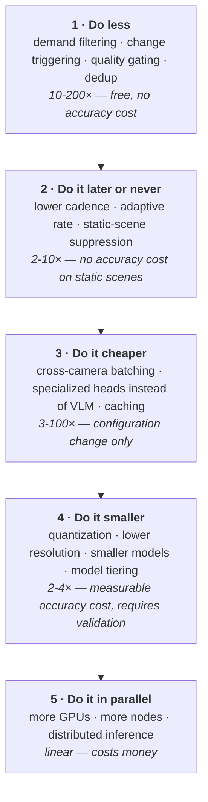

# UnityWorks Vision OS (UWV)

## Phase 1 — Performance & Scaling Strategy

| | |
|---|---|
| **Status** | Architecture Blueprint — Phase 1 (Design Only) |
| **Prerequisite** | `00`–`10` |
| **Defines** | Cost model, scaling from 1 to 1000 cameras, capacity planning, latency budgets, optimization ladder |
| **Enforces** | Invariants **V7** (perceptual economy), **V12** (pixels stay local) |

---

## Table of Contents

- [1. The Cost Model](#1-the-cost-model)
- [2. The Scaling Ladder](#2-the-scaling-ladder)
- [3. Capacity Planning](#3-capacity-planning)
- [4. Latency Budgets](#4-latency-budgets)
- [5. The Optimization Ladder](#5-the-optimization-ladder)
- [6. Bottleneck Progression](#6-bottleneck-progression)
- [7. Cost Attribution](#7-cost-attribution)
- [8. Performance Anti-Patterns](#8-performance-anti-patterns)

---

# 1. The Cost Model

Everything in this document derives from one observation about where the money goes.

### 1.1 Cost per stage, per camera-hour

Indicative figures for a 1080p camera at 5 fps processing rate, used for *relative reasoning*, not
procurement.

| Stage | Unit cost | Frequency | Relative cost | Scales with |
|---|---|---|---|---|
| **Decode** | ~1 ms/frame (HW) | Every source frame (25–30 fps) | **10** | Source frame rate × resolution |
| **Scheduling** | ~1 µs/frame | Every source frame | ~0 | Source frame rate |
| **Detection** | ~3 ms/frame amortized (batched) | Processing rate (5 fps) | **15** | Processing rate × resolution |
| **Tracking** | ~0.3 ms/frame | Processing rate | **1.5** | Processing rate × object count |
| **Registry** | ~0.1 ms/frame | Processing rate | 0.5 | Object count |
| **Crop extraction** | ~2 ms/crop | Triggered only | **1** | Trigger rate |
| **Understanding** | **~200 ms/call** | Triggered only | **20–2000** | **Trigger rate** |
| **Observation build** | ~0.1 ms | Per published observation | 0.5 | Publish rate |
| **State + log** | ~0.05 ms | Per observation | 0.3 | Publish rate |

### 1.2 The two facts that determine the architecture

**Fact 1 — decode is not free and is reached first.** At 100 cameras, source decode is ~2500–3000
frames/second regardless of how few frames are processed. Software decode alone saturates a server CPU
before a single inference runs. This is why hardware decode is a default rather than an optimization
(`03_MODULES` §M2).

**Fact 2 — understanding dominates or is negligible, with nothing in between.** A single VLM call costs
roughly as much as 70 detections. If understanding runs per object per frame, it is ~99% of platform
cost and the deployment is unaffordable. If it runs only when triggered by an unsatisfied demand, it is
~20% of cost and the deployment is routine.

```text
Naive:      100 cameras × 5 objects × 5 fps          = 2500 VLM calls/sec   → absurd
UWV (V7):   demand-filtered × change-triggered
            × quality-gated × deduplicated           = 10-15 VLM calls/sec  → one GPU
```

**That ~200× reduction is the architecture, not a tuning exercise.** It is why the Crop Manager exists
as a separate attention layer (`03_MODULES` §M8), why understanding is an optional enrichment rather
than a pipeline stage (`01_LAYERED` §3.3), and why demand contracts are the only inbound API
(`09_API` §4).

### 1.3 The bandwidth model

| Path | Per camera | 100 cameras | Crosses network? |
|---|---|---|---|
| Raw stream (H.264 1080p) | ~4 Mb/s | 400 Mb/s | Camera → node only |
| Decoded frames | ~750 Mb/s | 75 Gb/s | **Never — node-local** |
| Crops | ~0.2 Mb/s | 20 Mb/s | Only if understanding is remote |
| **Observations** | **~2 Kb/s** | **200 Kb/s** | **Yes — always** |

The ratio between decoded frames and observations is roughly **375,000:1**. Invariant V12 exists to
keep the system on the right side of that ratio, and it is what makes edge deployment, WAN uplinks, and
cloud state all viable simultaneously (`08_RUNTIME` §8.2).

---

# 2. The Scaling Ladder

The requirement is 1, 10, and 100 cameras **without redesign**. Here is what actually changes at each
step — and what does not.

| | **1 camera** | **10 cameras** | **100 cameras** | **1000 cameras** |
|---|---|---|---|---|
| **Topology** | Single process | Single node | Node + inference tier | Multi-node cluster, multi-site |
| **Camera pipelines** | 1 logical | 10 logical | 100 logical, 1–4 processes | 1000 across K nodes |
| **OS threads** | ~8 | ~12 | ~40 | ~40/node |
| **Detection** | In-process, batch 1 | In-process, batch 8 | Dedicated worker, batch 32 | Inference cluster |
| **Understanding** | In-process or none | In-process, 1 GPU | Dedicated, 1–2 GPUs | Understanding cluster |
| **GPUs** | 0–1 | 1 | 2–4 | 20–40 |
| **State** | In-memory | In-memory + local durable | Partitioned, replicated | Sharded by site, federated |
| **Log** | Local file | Local file | Local + replicated | Distributed log |
| **Event bus** | In-process | In-process | In-process + node transport | Distributed transport |
| **Observation rate** | ~5/s | ~50/s | ~500/s | ~5000/s |
| **Uplink (if split)** | negligible | ~20 Kb/s | ~200 Kb/s | ~2 Mb/s |
| **Module code** | — | — | — | **Identical at every column** |
| **Ports changed** | — | — | inference transport, state store, event transport | + placement policy |

### 2.1 What actually changes

Exactly three things, and all three are adapters or configuration:

1. **Transport adapters** — `ModelRuntimePort` (in-process → remote), `StateStorePort` (memory →
   distributed), `EventTransportPort` (in-process → distributed).
2. **Placement configuration** — which pipelines run where.
3. **Resource configuration** — batch sizes, pool depths, budgets.

**No module's responsibilities, interfaces, or state ownership change at any step.** This is the
concrete meaning of "without redesign," and it is a direct consequence of decisions made for other
reasons: camera-scoped partitions (`07_STATE` §4), logical pipelines (`08_RUNTIME` §3), the two-plane
split (`01_LAYERED` §4), and ports for every transport (`06_PORTS` §2).

### 2.2 The scaling limits, stated honestly

| Limit | Bound | Mitigation |
|---|---|---|
| Decode throughput per node | ~8–16 HW decode engines | More nodes; lower source resolution |
| GPU inference per node | Device count × batch efficiency | More GPUs; smaller models; lower cadence |
| Memory per node | Buffer pools + state | Bounded by design (`07_STATE` §6.3); more nodes |
| State write rate per partition | Single writer | Camera partitions are naturally small; not a practical limit |
| Log write rate | Storage throughput | Partitioned log; batching |
| Subscription fan-out | Filter evaluation × subscribers | Indexed filters; conflation |
| **Cross-camera re-identification** | **O(n²) candidate matching** | **Topology-constrained matching; the real limit at 1000+ cameras** |

The last row is the honest ceiling of this design. Cross-camera identity is deferred to Phase 2
precisely because it is the one component whose cost grows super-linearly with camera count, and it
therefore requires a topology model (which cameras can plausibly see the same object) rather than
brute-force matching. The architecture keeps it isolated in `IdentityResolverPort` (`06_PORTS` P11) so
that solving it later does not disturb anything else.

---

# 3. Capacity Planning

### 3.1 The sizing formulas

```text
DECODE
  decode_load = Σ_cameras (source_fps × resolution_factor)
  hw_engines_needed = decode_load / engine_capacity
  → the FIRST limit reached on a dense node

DETECTION
  detection_rate = Σ_cameras processing_fps
  gpu_seconds/sec = detection_rate × batched_inference_ms / 1000
  gpus_needed = gpu_seconds/sec / utilization_target (≈0.7)

UNDERSTANDING
  trigger_rate = objects × demand_factor × change_rate × gate_pass_rate
  vlm_gpu_seconds/sec = trigger_rate × inference_ms / 1000

MEMORY
  buffer_pool = cameras × pipeline_depth × frame_bytes × jitter_factor(≈1.5)
  state_memory = cameras × objects_per_camera × object_state_bytes
  model_vram   = Σ resident models (detector + understander + embeddings)
  → ALL bounded and computable BEFORE deployment (07_STATE §6.3)

STORAGE
  observations/day = observation_rate × 86400
  log_bytes/day    = observations/day × ~2KB
  evidence_bytes/day = vlm_calls/day × crop_bytes × retention_fraction
```

### 3.2 Worked example — a 100-camera site

```text
GIVEN
  100 cameras, 1080p @ 25 fps source, 5 fps processing
  ~5 objects/camera average
  3 demanded attributes on person class
  freshness 30s

DECODE
  100 × 25 = 2500 frames/s
  → hardware decode mandatory; ~4-8 engines; 2 nodes comfortable

DETECTION
  100 × 5 = 500 inferences/s
  500 × 3ms = 1.5 GPU-s/s ÷ 0.7 utilization → 2.1 GPUs

UNDERSTANDING
  candidates: 100 × 5 × 5 = 2500/s
  × demand_factor 0.30   = 750/s
  × change_rate 0.05     = 37.5/s
  × gate_pass 0.80       = 30/s
  × dedup 0.5            = 15/s          ← the V7 reduction, ~166×
  15 × 200ms = 3.0 GPU-s/s ÷ 0.7 → 4.3 GPUs
  (→ or ~0.5 GPU if high-volume attributes move to specialized heads — see §5)

MEMORY
  buffers: 100 × 4 depth × 6MB × 1.5      ≈ 3.6 GB
  state:   100 × 50 objects × 8KB         ≈ 40 MB
  models:  detector 4GB + VLM 8GB          ≈ 12 GB VRAM

STORAGE
  observations ≈ 500/s → 43M/day → ~86 GB/day raw, ~20 GB compressed
  evidence: 15/s × 86400 × 60KB × 0.3 retained ≈ 23 GB/day at 72h TTL

VERDICT
  2 nodes × (1 detection GPU + 2 understanding GPUs) + shared state tier
  → or 2 nodes × 2 GPUs if specialized attribute heads replace the VLM for
    the three high-volume attributes
```

**The last line is the point.** The difference between 6 GPUs and 4 is one configuration decision about
which adapter answers three attributes — enabled by `UnderstanderPort` treating a 2 MB classifier and a
7B VLM identically (`06_PORTS` §4).

---

# 4. Latency Budgets

### 4.1 End-to-end budget

```text
Photon → published observation

  capture + encode (camera)         30-100 ms   [outside platform control]
  network transport                  5-50 ms    [outside platform control]
  decode                              2-10 ms
  buffer + schedule                   1-5 ms
  detection (queue + batch + infer)  10-40 ms
  tracking + registry                 1-3 ms
  observation build + commit          1-5 ms
  ─────────────────────────────────────────────
  PRESENCE PATH TOTAL                20-65 ms   (platform-internal)
                                     55-215 ms  (end-to-end from photon)

  + crop extraction                   2-5 ms
  + understanding (queue + infer)   100-2000 ms
  ─────────────────────────────────────────────
  ATTRIBUTE PATH TOTAL              120-2070 ms
```

### 4.2 The two-path design

| Path | Latency | Carries | Consumer use |
|---|---|---|---|
| **Presence path** | 20–65 ms | Existence, class, position, motion, region, dwell | Real-time overlay, live counting, immediate spatial reasoning |
| **Attribute path** | 120–2000 ms | Enriched attributes | Non-latency-critical enrichment |

**Attributes arriving late do not delay presence.** This is why understanding is an asynchronous
enrichment rather than a pipeline stage (`01_LAYERED` §3.3) — a design choice that pays in three
different currencies: latency (here), cost (§1.2), and reliability (`10_RELIABILITY` §4.3).

Consumers see this as separate observations for the same object: a `presence`/`spatial` observation
immediately, an `attribute` observation when enrichment completes. Both reference the same `object_id`,
and each carries its own `t_capture`, so a consumer always knows which instant an attribute describes.

### 4.3 Latency targets by deployment

| Deployment | Presence p95 | Attribute p95 | Notes |
|---|---|---|---|
| Edge, live monitoring | 50 ms | 500 ms | Local models, small batches, low `max_wait` |
| Node, standard | 80 ms | 1 s | Larger batches trade latency for throughput |
| Cloud understanding | 80 ms | 3 s | Presence stays local; attributes cross the WAN |
| Archival processing | n/a | n/a | Throughput-optimized; latency irrelevant |

The archival row matters: when processing recorded video, **latency stops being a constraint entirely**
and batch sizes, `max_wait`, and pipeline depth can all be raised dramatically. The `source_semantics`
property (`01_LAYERED` §5.3) is what lets one platform behave correctly in both regimes.

---

# 5. The Optimization Ladder

Applied in order. Each step is cheaper and less risky than the one below it, and most deployments never
need to descend past step 4.



### 5.1 Why the order matters

Teams instinctively start at step 5 (buy GPUs) or step 4 (quantize). Both are the wrong first move:

- **Step 5 scales the waste.** Doubling GPUs to run computations nobody asked for doubles the cost of
  computations nobody asked for.
- **Step 4 costs accuracy** — the only step that does — and is frequently unnecessary once steps 1–3 are
  applied.

Steps 1–3 are **free in accuracy terms** and together typically yield 100–1000×. Step 1 alone is the
difference between the naive and UWV figures in §1.2.

### 5.2 Step 3's highest-value move

Replacing a general VLM with a specialized head for a high-volume attribute:

| | VLM | Specialized head |
|---|---|---|
| Model size | 7B params (~8 GB) | ~2 MB |
| Latency | ~200 ms | ~2 ms |
| Cost per call | 1.0 | ~0.01 |
| Flexibility | Any attribute, no training | One attribute, needs training data |
| **Interface** | **`UnderstanderPort`** | **`UnderstanderPort` — identical** |

The strategy this enables: **use the VLM to discover and validate an attribute, use its evidence to
train a specialized head, then migrate that attribute** via `understander.router` — per attribute, in
production, with zero consumer impact (`06_PORTS` §4, P15). The VLM remains for rare, novel, and
long-tail attributes where its flexibility is worth its cost.

This is the platform's long-term cost trajectory, and Phase 1 enables it purely by choosing the right
port abstraction.

---

# 6. Bottleneck Progression

Bottlenecks move as scale increases. Knowing the order prevents optimizing the wrong thing.

| Scale | Primary bottleneck | Symptom | Response |
|---|---|---|---|
| 1 camera | **Model load time** | Slow startup, cold first inference | Warmup, residency |
| 5–10 cameras | **GPU utilization (poor batching)** | GPU at 30%, latency fine | Increase batch, tune `max_wait` |
| 10–30 cameras | **Understanding cost** | GPU saturated by VLM | Trigger tuning, specialized heads |
| 30–60 cameras | **Decode (CPU)** | CPU saturated before GPU | Hardware decode, lower source fps |
| 60–100 cameras | **GPU capacity** | Both saturated | More GPUs, quantization, cadence |
| 100–300 cameras | **Memory bandwidth / PCIe** | Utilization high, throughput sub-linear | Device-resident buffers, fewer copies |
| 300–1000 cameras | **State write + fan-out** | Commit latency rising | Partition, replicate, index filters |
| 1000+ cameras | **Cross-camera identity (O(n²))** | Site layer lagging | Topology-constrained matching |

**The two most commonly misdiagnosed transitions:**

- **10 → 30 cameras.** Teams add GPUs when the real problem is that understanding is triggering far too
  often. Check the trigger rate before buying hardware.
- **30 → 60 cameras.** Teams add GPUs when the CPU is the constraint. Decode is invisible on most
  dashboards because it is not "AI work," yet it is the first hard wall on a dense node.

---

# 7. Cost Attribution

The platform accounts for cost per camera, per model, per tenant, **and per demand**
(`05_KERNEL` §M21).

```text
cost_report(scope, window) →
  by_camera : { decode_ms, detection_calls, vlm_calls, gpu_seconds, storage_bytes }
  by_model  : { calls, gpu_seconds, currency (for remote models) }
  by_tenant : { total, per-capability breakdown }
  by_demand : { demand_id, calls, gpu_seconds, cost, satisfaction_rate }
```

### 7.1 Why per-demand attribution matters

It answers, with numbers: *"demand `dm-114` costs 3200 VLM calls/hour to satisfy at 30-second
freshness."* The consumer that registered it can then decide whether that freshness is worth the cost,
narrow the scope, or accept a longer interval.

Without per-demand attribution, cost is a single opaque number and every conversation about reducing it
is guesswork. With it, the conversation is a list sorted by cost — and, notably, **the platform
supports that conversation without ever knowing what any demand is for** (V1). It reports what things
cost; the consumer knows what they are worth.

---

# 8. Performance Anti-Patterns

| Anti-pattern | Why it fails | Correct approach |
|---|---|---|
| **VLM per object per frame** | 100–1000× over budget | Demand + change triggering (V7) |
| **Model instance per camera** | VRAM duplication, batch size 1, collapsed utilization | Shared batched inference tier (`01_LAYERED` §6.2) |
| **Thread per camera** | Context-switch overhead and stack memory at 100+ | Logical pipelines on shared executors |
| **Unbounded queues** | Delayed-fuse OOM | Bounded with declared policy (`08_RUNTIME` §5) |
| **Full-frame VLM** | 100× the pixels for the same answer | Crop, quality-gate, normalize to model input size |
| **Software decode at scale** | CPU saturates before any inference runs | Hardware decode by default |
| **Copying frames between stages** | Memory bandwidth becomes the wall | Read-only leases (`01_LAYERED` §4.3) |
| **Synchronous understanding in the main path** | Presence latency becomes VLM latency | Asynchronous enrichment (§4.2) |
| **Unbounded state history** | Slow memory growth; failure on day 26 | Bounded rings by count and time (`07_STATE` §6.3) |
| **Publishing unchanged observations** | Floods storage and subscribers with zero information | Change suppression + heartbeat (`04_MODULES` §M11) |
| **Per-object metric labels** | Cardinality explosion takes down monitoring, then the platform | Bounded label sets (`05_KERNEL` §M21) |
| **Optimizing before measuring** | Effort spent on the wrong stage | Cost attribution first (§7), then the ladder (§5) |

---

## Where to go next

| Question | Document |
|---|---|
| How is privacy and security handled at this scale? | `12_SECURITY_AND_PRIVACY.md` |
| What are the concrete deployment topologies? | `13_DEPLOYMENT_ARCHITECTURE.md` |
| How is performance verified and regression-tested? | `14_TESTING_STRATEGY.md` |
