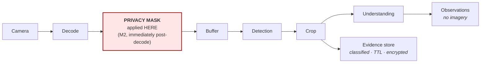

# UnityWorks Vision OS (UWV)

## Phase 1 — Security & Privacy Architecture

| | |
|---|---|
| **Status** | Architecture Blueprint — Phase 1 (Design Only) |
| **Prerequisite** | `00`–`11` |
| **Defines** | Threat model, privacy architecture, tenant isolation, supply chain, data governance, audit |

> **Why this is an architecture document and not a policy appendix.** A vision platform watches people
> in kitchens, wards, factories, and streets. Privacy properties that are added later are properties
> that can be bypassed; the ones that hold are structural. Every control below is placed at a specific
> module boundary for a specific reason.

---

## Table of Contents

- [1. Threat Model](#1-threat-model)
- [2. The Privacy Architecture](#2-the-privacy-architecture)
- [3. Data Classification](#3-data-classification)
- [4. Tenant Isolation](#4-tenant-isolation)
- [5. Authentication and Authorization](#5-authentication-and-authorization)
- [6. Supply Chain Security](#6-supply-chain-security)
- [7. Data Governance](#7-data-governance)
- [8. Audit](#8-audit)
- [9. Deployment Security](#9-deployment-security)
- [10. Regulatory Posture](#10-regulatory-posture)

---

# 1. Threat Model

### 1.1 Assets, in priority order

| # | Asset | Why it matters |
|---|---|---|
| **1** | **Live and recorded imagery of people** | The highest-sensitivity data in the system. Faces, bodies, movements, and behaviour of identifiable individuals |
| **2** | **Evidence crops** | Persisted imagery — smaller than video but retained, indexed, and retrievable |
| **3** | **Observation stream and state** | Behavioural data. Even without imagery, movement traces are identifying |
| **4** | **Identity linkage** | Any persistent mapping that links sightings across time or cameras |
| **5** | **Camera credentials** | Compromise grants direct access to live imagery, bypassing the platform entirely |
| **6** | **Model artifacts** | Intellectual property; also an execution vector |
| **7** | **Configuration** | Controls what is watched, retained, and masked |

### 1.2 Threats

| Threat | Vector | Primary control |
|---|---|---|
| **Unauthorized imagery access** | API abuse, evidence store access, stream interception | Separate evidence authorization; encryption in transit and at rest; audit |
| **Cross-tenant leakage** | Query scoping bug, shared cache, shared model state | Scope applied at query construction; per-tenant partitions; cache keys include tenant |
| **Surveillance overreach** | The platform is used beyond its authorized purpose | Privacy zones enforced at decode; capability gating; audit of what is watched |
| **Re-identification** | Correlating observations to identify individuals | No persistent biometric identity by default; identity linkage is policy-gated |
| **Model supply-chain compromise** | Malicious weights or plugin | Signature verification; hash pinning; isolation levels |
| **Credential theft** | Config leakage, log exposure | Secret references never values (`02_VOM` §10.1); redaction in logs and diagnostics |
| **Evidence tampering** | Altering the record to hide or fabricate | Immutable log; content-addressed evidence; append-only audit |
| **Denial of service** | Stream flooding, expensive query abuse, demand abuse | Bounded queues; rate limits; per-tenant quotas; demand budgets |
| **Insider misuse** | Operator retrieving imagery without cause | Purpose-bound evidence access; audit with actor and stated purpose |

### 1.3 Explicit non-goals

UWV does not defend against a compromised camera (it trusts what the sensor sends), does not perform
video forensics or tamper detection on the source, and does not provide physical security. It assumes
the network between camera and node is protected by deployment-level controls.

---

# 2. The Privacy Architecture

### 2.1 The earliest-point principle

> **Privacy controls are applied at the earliest point where the data exists. Every later point is a
> point at which something already saw the unprotected data.**



Masking sits in the Video Source Manager, immediately after decode and before the frame enters the
buffer (`03_MODULES` §M2). Consequences:

- **No component ever sees unmasked pixels** — not detection, not cropping, not the VLM, not evidence.
- **A masking failure fails closed**: the frame is dropped, the camera degrades, and if sustained it is
  marked blind. This is the platform's only fail-closed path, and it is deliberate — every other
  failure degrades, this one stops.
- Masking is verifiable: `Frame.privacy_state` travels with the frame so any component can assert it.

### 2.2 The privacy control ladder

| Control | What it does | Cost | Applied |
|---|---|---|---|
| **Privacy zones** | Static regions permanently blacked out (a neighbour's window, a residential street) | Free | At decode |
| **Selective blur** | Faces or plates detected and blurred | One extra detector pass | At decode |
| **Full anonymization** | Bodies replaced by silhouettes or skeletons | Higher | At decode |
| **No-evidence mode** | Crops never persisted; understanding runs on ephemeral pixels | Free | Evidence policy |
| **Observation-only export** | Nothing leaves the site but structured facts | Free | Deployment topology |
| **On-premise-only** | No remote models, no cloud state | Deployment cost | Configuration + adapter gating |

**`data_residency` on `UnderstanderCapabilities`** (`06_PORTS` §4, P15) is what makes the last row
enforceable rather than procedural: a site configured as on-premise-only will refuse to bind a remote
model adapter, so "no imagery leaves the building" is a load-time guarantee, not a promise someone has
to remember.

### 2.3 The default privacy posture

| Property | Default | Rationale |
|---|---|---|
| Persistent biometric identity | **Disabled** | Cross-time re-identification is the most invasive capability the platform could have. It is off unless explicitly enabled under policy |
| Evidence retention | **24–72 hours** | The shortest tier in the system; imagery is the most sensitive artifact retained (`07_STATE` §8.1) |
| Face/plate blur | **Off, but one config line away** | Jurisdiction-dependent; defaults must not silently degrade a lawful deployment, but must be trivially enabled |
| Cross-site identity | **Disabled** | Requires explicit federation authorization |
| Raw video retention | **Never** | UWV is not a VMS (`00_CHARTER` §6) |

**The important structural fact:** UWV holds no persistent biometric identity by default, so in a
default deployment there is *no stored artifact that identifies a person across time*. Object IDs are
site-scoped, expire on retention horizons, and link sightings only within their lifetime. Enabling
long-term identity is a deliberate, auditable configuration act — not a side effect of using the
platform.

---

# 3. Data Classification

Every artifact carries a classification that determines encryption, retention, residency, and access.

| Class | Contains | Encryption | Default retention | Access |
|---|---|---|---|---|
| **C1 · Imagery** | Frames, crops, evidence | At rest + in transit, per-tenant keys | 24–72 h | Separate evidence privilege + purpose |
| **C2 · Biometric** | Appearance embeddings, identity galleries | At rest + in transit | **Disabled by default**; session-scoped when enabled | Restricted; policy-gated |
| **C3 · Behavioural** | Observations, trajectories, dwell, attributes | In transit; at rest per policy | Days to years | Standard API authorization |
| **C4 · Operational** | Metrics, health, logs | In transit | 30–90 d | Operations |
| **C5 · Configuration** | Camera config, regions, taxonomy | In transit; secrets separately | Versioned indefinitely | Admin |
| **C6 · Secrets** | Credentials, keys | Always, in a secret store | Rotated | Never exposed; referenced only |

### 3.1 The C3 subtlety

Behavioural data is routinely treated as harmless because it contains no imagery. It is not harmless:
a trajectory through a building, with timestamps, over weeks, is identifying even without a face. UWV
therefore treats C3 as personal data for governance purposes — subject to retention limits, erasure,
and audit — rather than as anonymous telemetry. Deployments that assume otherwise have a compliance
problem waiting.

---

# 4. Tenant Isolation

### 4.1 The isolation boundary

`tenant_id` is present on every object in the universal substrate (`02_VOM` §3) — not as a filter
applied at the end, but as part of identity from creation.

| Layer | Isolation mechanism |
|---|---|
| **Storage** | Separate partitions/namespaces per tenant; per-tenant encryption keys |
| **State** | Partitions are tenant-scoped; a snapshot never spans tenants |
| **Query** | **Tenant scope is applied at query construction, never as a post-filter** |
| **Cache** | Every cache key includes `tenant_id` — including crop and understanding caches |
| **Models** | Shared weights are permitted (they carry no tenant data); **shared inference state is not** |
| **Metrics** | Tenant-labelled; cross-tenant aggregates only for platform operators |
| **Events** | Subscriptions are tenant-scoped at the bus |

### 4.2 Why post-filtering is prohibited

A query that fetches broadly and filters afterwards leaks whenever the filter has a bug, whenever an
error path returns unfiltered data, whenever pagination interacts badly, and whenever a new code path
forgets to apply it. Constructing the query already scoped means **there is no moment at which
cross-tenant data exists in memory to leak**. This distinction is the difference between isolation that
holds and isolation that mostly holds.

### 4.3 Isolation levels by deployment

| Level | Mechanism | Use for |
|---|---|---|
| **Logical** | Shared process, scoped data | Same-organization sites |
| **Process** | Separate processes per tenant | Multi-customer platforms |
| **Node** | Separate hardware | High-sensitivity tenants |
| **Deployment** | Entirely separate installations | Regulated, air-gapped, sovereign |

The architecture supports all four **without code change**, because tenancy is a data property and
placement is configuration (`08_RUNTIME` §8.3).

---

# 5. Authentication and Authorization

### 5.1 Where identity exists

External identity exists **only at the Observation API** (`04_MODULES` §M14). Every layer beneath
operates on data already scoped. There is no ambient user context inside the pipeline, which means no
pipeline component can accidentally make an authorization decision.

### 5.2 The permission model

```text
Permission = (action, resource_scope, conditions)

actions:  read_state | read_observations | read_evidence | subscribe
          | register_demand | read_capability | read_coverage
          | admin_config | admin_models | admin_plugins

resource_scope: tenant / site / camera / region

conditions: time window · purpose declaration · attribute restriction
```

### 5.3 The privilege separations that matter

| Separation | Why |
|---|---|
| **`read_observations` ≠ `read_evidence`** | Reading "a person was here" and viewing their image are categorically different acts. Most consumers need the first and must never have the second |
| **`read_state` ≠ `subscribe`** | Continuous surveillance is a stronger capability than point-in-time query |
| **Per-camera and per-region scoping** | A ward-safety consumer should not read the staff room; region scoping enforces it |
| **`register_demand` is privileged** | Demands spend money and cause computation; they are not a read |
| **Admin actions are wholly separate** | Configuration, model, and plugin administration are operator functions, never consumer functions |

### 5.4 Purpose binding for evidence

Evidence access requires a **declared purpose**, recorded in the audit trail with the actor and the
observation. This does not technically prevent misuse — nothing at this layer can — but it converts
imagery access from an invisible act into an attributable one, which is the control that actually
changes behaviour and the one regulators ask for.

---

# 6. Supply Chain Security

Models and plugins are executable code and trained artifacts from outside the platform. They are
treated accordingly.

### 6.1 The controls

| Artifact | Control |
|---|---|
| **Plugin code** | Cryptographic signature verified against a trust root; **unsigned plugins never load** (`05_KERNEL` §M17) |
| **Model weights** | Content hash pinned in the registry; verified on every fetch; `ArtifactStore.fetch` **fails closed** on mismatch (`04_MODULES` §M13) |
| **Provenance** | Model card, licence, training-data provenance recorded at registration |
| **Licence compliance** | Checked at registration against the deployment context; a licence forbidding commercial or on-premise use blocks the load rather than being discovered in an audit |
| **Isolation** | Untrusted plugins run in subprocess or sandbox (`05_KERNEL` §M17 isolation levels) |
| **Conformance** | Every adapter passes its kit before activation — which also catches artifacts that are not what they claim to be (`06_PORTS` §5) |

### 6.2 The pinning discipline

Every observation records `model_artifact_hash` and `config_revision` (`02_VOM` §3). This is a security
property as much as an explainability one: if a compromised artifact is later discovered, the exact set
of observations it produced is **queryable** (`09_API` §2.2, `producer` filter), so the blast radius of
a supply-chain incident is precisely determinable rather than assumed total.

---

# 7. Data Governance

### 7.1 Residency

```text
DataResidencyPolicy:
  imagery_may_leave_site   : bool
  observations_may_leave_site : bool
  permitted_regions        : [Region]
  remote_models_permitted  : bool
  evidence_storage_location: local | regional | global
```

Enforced structurally: a site with `remote_models_permitted: false` will not bind an adapter declaring
`data_residency: remote`. The policy is a load-time gate, not a runtime hope.

### 7.2 Erasure

`07_STATE` §8.2 specifies the mechanism. The security-relevant properties:

| Property | Behaviour |
|---|---|
| **Evidence erasure** | Blobs deleted; content-addressed references become `Expired` |
| **Observation erasure** | **Tombstoned, not rewritten** — content redacted, the record that an observation existed and was erased survives |
| **Audit survives erasure** | Who erased what, when, and under what authority is itself immutable |
| **Verification** | An erasure report enumerates exactly what was removed |

**The rationale for tombstoning rather than deleting.** Rewriting history to make an observation appear
never to have existed destroys the property that makes the log evidentiary. A regulator asking "did
this system observe anything at 09:14?" must get a truthful answer even after erasure — "yes, and the
content was erased on this date under this authority" — rather than a silence indistinguishable from
never having looked.

### 7.3 The data minimization posture

| Practice | Effect |
|---|---|
| Compute only demanded attributes (V7) | The platform holds less because it computes less |
| Retain evidence for hours, not months | The most sensitive tier expires fastest |
| No raw video retention | The largest sensitive artifact never exists |
| No persistent biometric identity by default | The most invasive linkage is absent unless chosen |
| Observations carry no business meaning (V1) | Even a full breach yields visual facts without interpretation |

The final row is an underappreciated security property of the Semantic Ceiling. A leaked UWV
observation stream says "a person stood in region Z3 for 45 seconds." It does not say who they were,
what role they held, what rule they broke, or what happened next — because the platform never knew.
**Architectural ignorance is a form of data minimization**, and it was chosen for other reasons first.

---

# 8. Audit

### 8.1 What is audited

| Category | Recorded |
|---|---|
| **Data access** | Actor, action, scope, purpose (for evidence), timestamp, result size |
| **Configuration change** | Actor, before/after, revision, approval |
| **Model change** | Registration, promotion, rollback, actor |
| **Plugin lifecycle** | Load, activate, swap, conformance result |
| **Demand lifecycle** | Registration, modification, revocation |
| **Erasure** | Scope, authority, verification report |
| **Security events** | Auth failures, cross-tenant attempts, signature failures |
| **Privacy events** | Mask failures, residency policy denials |

### 8.2 Audit properties

- **Append-only and immutable**, held separately from operational logs.
- **Tamper-evident** (hash-chained), so alteration is detectable.
- **Retained longer than the data it describes** — the record of an evidence access must outlive the
  evidence, or the audit is useless exactly when it is needed.
- **Queryable** for compliance reporting without touching production state.

---

# 9. Deployment Security

| Surface | Control |
|---|---|
| **Camera → node** | Isolated VLAN; TLS/SRTP where supported; credentials from secret store, rotated |
| **Node → node** | mTLS; authenticated event transport |
| **Node → cloud** | mTLS; observations only unless imagery residency permits otherwise |
| **API** | TLS; token-based auth; rate limits; per-tenant quotas |
| **At rest** | Encrypted volumes; per-tenant keys for C1/C2 |
| **Process** | Least privilege; no root; read-only filesystem except designated paths |
| **Secrets** | Never in config files, logs, diagnostics, or error messages — references only |
| **Model artifacts** | Signed, hash-verified, cached read-only |
| **Admin surface** | Separate network path from the consumer API |

### 9.1 The log redaction rule

Camera credentials, tokens, and keys are **references** throughout the platform (`02_VOM` §10.1). This
matters because `Camera` records appear in configuration repositories, diagnostic dumps, support
bundles, and error messages. A design where credentials are values guarantees they will eventually
appear in a log file that gets emailed to a vendor.

---

# 10. Regulatory Posture

The platform is designed to be *deployable* under common regimes; a specific deployment's compliance
remains a deployment concern with legal review.

| Regime | Relevant capability |
|---|---|
| **GDPR / similar** | Purpose limitation via demands; data minimization (§7.3); erasure with verification; audit; residency controls; no default biometric processing |
| **Biometric-specific law** (e.g. BIPA-style) | Biometric identity disabled by default; when enabled, explicit configuration, C2 classification, restricted access, separate retention |
| **Healthcare (HIPAA-style)** | On-premise deployment; encryption; audit; role-scoped access; no imagery egress |
| **Workplace surveillance rules** | Privacy zones; region-scoped access; observation-only export; audit of what is watched |
| **Public-space regulation** | Residency; retention limits; privacy zones for private property within view |
| **AI transparency regimes** | **Every observation is explainable by construction** (V4): model, version, prompt, evidence, decision path — retrievable via the evidence contract (`09_API` §6) |

### 10.1 The explainability dividend

Invariant V4 was adopted for engineering reasons — debuggability, regression analysis, model
comparison. It turns out to satisfy the core requirement of emerging AI transparency regulation almost
exactly: for any automated output, the system can produce the model that generated it, its version, its
exact inputs, the reason it was invoked, and the raw output it produced.

This is worth noting explicitly, because it illustrates a pattern that recurs throughout this
architecture: **the properties adopted for long-term engineering health — explainability, immutability,
honest uncertainty, architectural ignorance — turn out to be the same properties that make the platform
deployable in regulated environments.** Good architecture and good governance converge here rather than
competing, which is why neither was traded against the other.

---

## Where to go next

| Question | Document |
|---|---|
| How do these controls appear in each topology? | `13_DEPLOYMENT_ARCHITECTURE.md` |
| How are security properties tested? | `14_TESTING_STRATEGY.md` |
| What is the roadmap for identity and federation? | `15_ROADMAP.md` |
