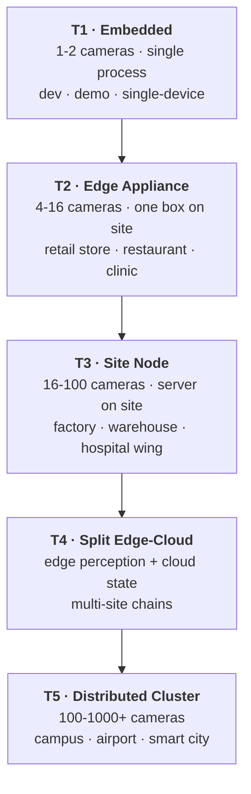
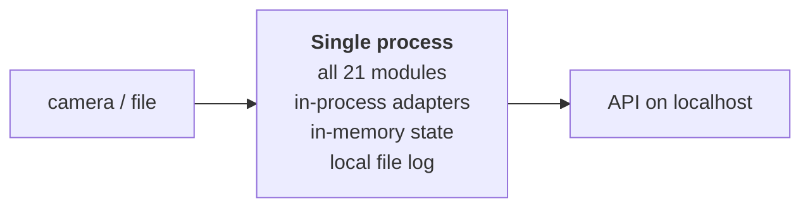
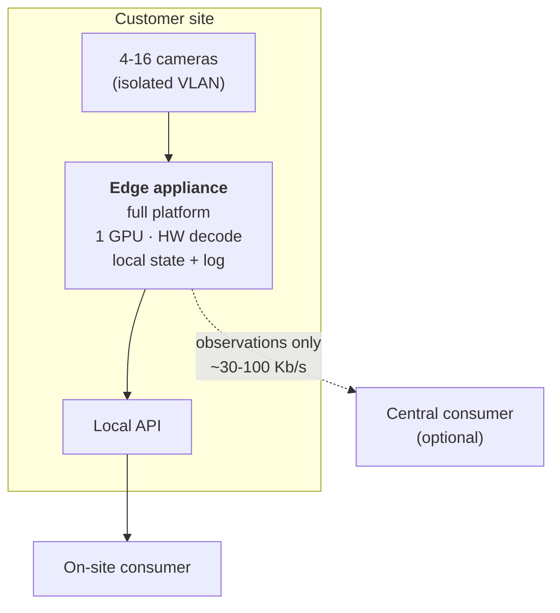
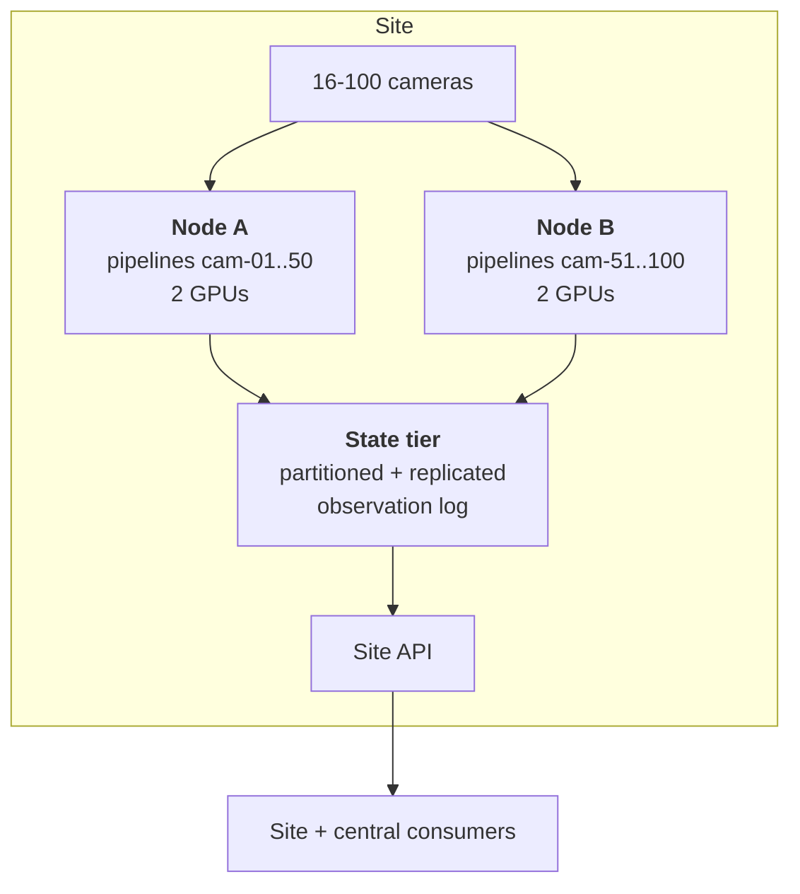
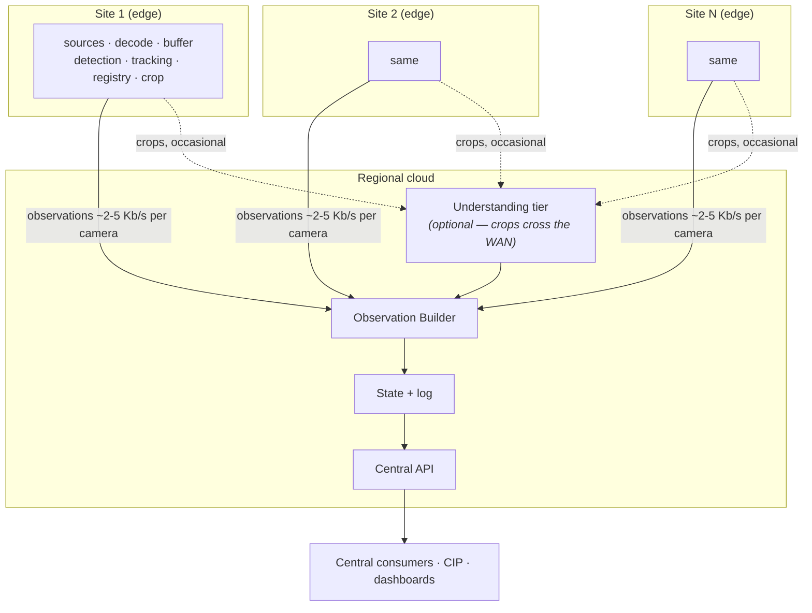
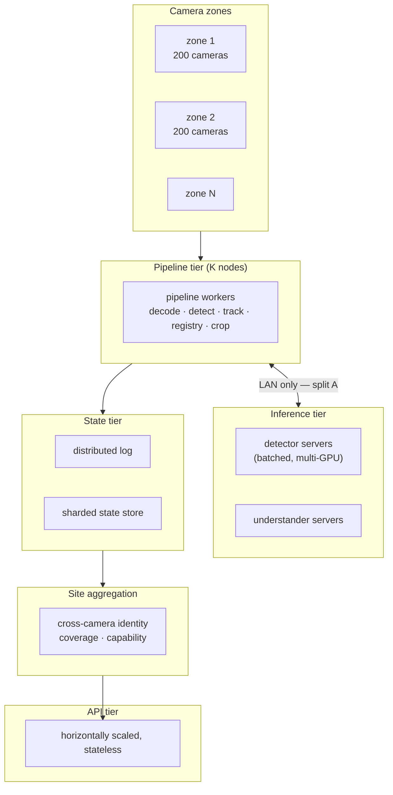

# UnityWorks Vision OS (UWV)

## Phase 1 — Deployment Architecture

| | |
|---|---|
| **Status** | Architecture Blueprint — Phase 1 (Design Only) |
| **Prerequisite** | `00`–`12` |
| **Defines** | Deployment topologies, sizing, edge/cloud split, operational procedures, upgrade strategy |

---

## Table of Contents

- [1. The Topology Family](#1-the-topology-family)
- [2. T1 · Embedded](#2-t1--embedded)
- [3. T2 · Edge Appliance](#3-t2--edge-appliance)
- [4. T3 · Site Node](#4-t3--site-node)
- [5. T4 · Split Edge-Cloud](#5-t4--split-edge-cloud)
- [6. T5 · Distributed Cluster](#6-t5--distributed-cluster)
- [7. Choosing a Topology](#7-choosing-a-topology)
- [8. Upgrade Strategy](#8-upgrade-strategy)
- [9. Operational Runbook Surface](#9-operational-runbook-surface)

---

# 1. The Topology Family

Five topologies. **One codebase, one set of modules, one set of contracts.** What differs is adapter
selection and placement configuration — nothing else (`11_PERFORMANCE` §2.1).



### 1.1 The invariant across all five

| Element | Varies? |
|---|---|
| Module set and responsibilities | **No** |
| Port contracts | **No** |
| Object model and observation schema | **No** |
| API contracts | **No** |
| State semantics and single-writer rule | **No** |
| Adapter selection (transport, storage, runtime) | Yes |
| Placement configuration | Yes |
| Resource configuration | Yes |

---

# 2. T1 · Embedded

**1–2 cameras · single process · development, demonstration, single-device products**



| | |
|---|---|
| **Hardware** | Laptop, Jetson-class device, or a small VM. GPU optional |
| **Adapters** | In-process everything; memory state store; local file log; file config |
| **Models** | One small detector; understanding optional or a small quantized VLM |
| **Threads** | ~8 (`08_RUNTIME` §2.2) |
| **State** | In-memory with a local durable log |
| **Availability** | None expected |

### Why this topology is architecturally load-bearing

T1 is not a toy configuration; it is the **development and test environment**, and it runs the identical
code path as T5 — same actors, same queues, same batching (at batch size 1), same state semantics. A
platform whose development configuration differs structurally from production is one whose bugs are
discovered by customers (`08_RUNTIME` §2.2).

T1 is also where deterministic replay lives: file sources, virtual clock, fixed batch composition
(`08_RUNTIME` §6.2).

---

# 3. T2 · Edge Appliance

**4–16 cameras · one box on site · retail store, restaurant, clinic, small facility**



| | |
|---|---|
| **Hardware** | Small server or industrial PC. 1 GPU (or an integrated accelerator), hardware decode, 32–64 GB RAM, local SSD |
| **Adapters** | In-process inference; embedded KV state store; local log with optional cloud replication; local evidence store |
| **Models** | One detector; one quantized VLM or specialized attribute heads |
| **Uplink** | Observations only — tens of kilobits per second |
| **Availability** | Operates fully offline; buffers observations for later replication |

### Design notes

- **Autonomy is the defining property.** A restaurant's internet connection is not a dependency. The
  site perceives, stores, and serves locally; replication is opportunistic.
- **All imagery stays on site by default** — a strong and easily-explained privacy position
  (`12_SECURITY` §2.2), enforced by `data_residency` gating rather than by policy alone.
- **Understanding is the sizing constraint**, not detection. Sixteen cameras produce ~80 detections/s
  (trivial), but an untuned trigger policy can demand more VLM calls than the box can serve. This is
  where the optimization ladder's first three steps matter most (`11_PERFORMANCE` §5).
- Specialized attribute heads often remove the GPU requirement entirely for well-understood verticals.

---

# 4. T3 · Site Node

**16–100 cameras · server on site · factory, warehouse, hospital wing, large retail**



| | |
|---|---|
| **Hardware** | 1–2 servers, 2–4 GPUs each, 8+ hardware decode engines, 128–256 GB RAM, NVMe |
| **Adapters** | In-process or sibling-process inference; replicated state store; partitioned log; node-local event transport |
| **Models** | Primary + fallback detector; VLM tier; specialized heads for high-volume attributes |
| **Availability** | 99.9%; node failure moves partitions to the surviving node at reduced cadence |
| **Sizing** | Per the worked example in `11_PERFORMANCE` §3.2 |

### Design notes

- **Decode is the first wall** (`11_PERFORMANCE` §6). Verify hardware decode engine count before GPU
  count; teams routinely over-provision GPUs while the CPU saturates.
- **Partition placement** should co-locate cameras that share a model tier (affinity policy), improving
  batch density.
- **Node failure is a rebalance**, not an outage: partitions replay from their watermarks on the
  surviving node, with the handover recorded as a coverage gap (`08_RUNTIME` §8.3).

---

# 5. T4 · Split Edge-Cloud

**Edge perception, cloud state and understanding · multi-site chains**



| | |
|---|---|
| **Edge** | Small appliance per site; detection + tracking + registry; no GPU needed for understanding |
| **Cloud** | Understanding tier, state, log, API |
| **Uplink** | 200–500 Kb/s per 40-camera site (`11_PERFORMANCE` §1.3) |
| **Split points** | B (crops), C (observations) from `08_RUNTIME` §8.1 — both WAN-viable |

### Design notes

- **Split A is never used here.** Frames and tensors do not cross the WAN; that is invariant V12, and
  it is what makes this topology work at all.
- **Understanding may be edge or cloud, per site, by configuration.** A site with a privacy policy
  forbidding imagery egress keeps understanding local; another sends crops to a shared cloud tier. The
  `data_residency` gate enforces this at adapter binding (`12_SECURITY` §7.1).
- **Edge autonomy during disconnection**: the edge continues perceiving and buffers observations. On
  reconnection it drains, and the disconnection window is published as a coverage gap — so a chain
  operator sees "site 12 was disconnected 14:02–14:41" rather than "site 12 was quiet."
- This is the natural topology for **multi-site chains** — restaurant groups, retail chains, hospital
  networks — where per-site hardware must be cheap and central analysis must be unified.

---

# 6. T5 · Distributed Cluster

**100–1000+ cameras · campus, airport, smart city**



| | |
|---|---|
| **Pipeline tier** | K nodes, ~100 cameras each, hardware decode, local GPUs for detection |
| **Inference tier** | Dedicated servers behind `ModelRuntimePort` remote adapters (Triton-class), **LAN-attached** |
| **State tier** | Distributed log; state sharded by camera partition, replicated |
| **Site aggregation** | Cross-camera identity, coverage, capability — eventually consistent |
| **API tier** | Stateless, horizontally scaled, reads snapshots |
| **Orchestration** | Container platform; partitions placed by a cluster scheduler |

### Design notes

- **The inference tier must be LAN-attached** (split A, `08_RUNTIME` §8.1). Sending tensors across a
  WAN is the one thing this architecture forbids at scale.
- **Cross-camera identity is the super-linear component** (`11_PERFORMANCE` §2.2). It is topology-
  constrained — only cameras that could plausibly see the same object are candidates — and it is
  isolated behind `IdentityResolverPort` so it can be scaled, replaced, or disabled independently.
- **Zone-based sharding**: cameras are grouped into zones matching physical topology, so cross-camera
  matching stays within a zone and the O(n²) term stays small.
- **Rolling upgrade by partition** — see §8.

---

# 7. Choosing a Topology

| If… | Choose |
|---|---|
| Developing, testing, or demonstrating | **T1** |
| One site, ≤16 cameras, offline autonomy matters, imagery must stay local | **T2** |
| One site, 16–100 cameras, on-premise requirement | **T3** |
| Many sites, central analysis, cheap per-site hardware | **T4** |
| One very large site, 100+ cameras | **T5** |

### 7.1 The decision drivers

| Driver | Pushes toward |
|---|---|
| **Imagery must not leave the site** | T2, T3 (or T4 with edge understanding) |
| **Unreliable connectivity** | T2, T3 (edge autonomy) |
| **Many small sites** | T4 |
| **Very high camera density** | T5 |
| **Minimal per-site hardware cost** | T4 |
| **Regulatory air-gap** | T2, T3 |
| **Central multi-site correlation** | T4, T5 |

### 7.2 Migration between topologies

Migration is a **configuration and adapter change**, not a re-architecture. Because observations are
schema-versioned and identifiers are globally unique (`02_VOM` §4.1), historical data from a T2
deployment remains valid and queryable after migrating that site to T4 — the log simply continues.

The common progression is T2 → T4 (a chain outgrows per-site analysis and centralizes) and T3 → T5 (a
site outgrows a single node). Both are supported without data migration.

---

# 8. Upgrade Strategy

### 8.1 Upgrade classes

| Class | Method | Downtime | Rollback |
|---|---|---|---|
| **Configuration** | Hot reload | None | Revision revert |
| **Prompt pack** | Hot swap | None | Version revert |
| **Model version** | Drain-and-swap via Model Manager | None | Config revert (artifact still cached) |
| **Adapter/plugin** | Drain port binding, swap | None | Previous plugin still loaded |
| **Platform minor** | Rolling by partition | None (per-camera gaps) | Redeploy previous |
| **Platform major (schema)** | Dual-version window | None | Requires forward planning |
| **Storage adapter** | Planned maintenance | Brief | Restore |

### 8.2 Rolling upgrade (T3–T5)

```text
1. Deploy the new version alongside the old
2. For each partition group:
   a. Drain pipelines on old nodes (stop admission, finish in-flight, commit)
   b. Emit coverage observations for the handover window
   c. Attach partitions on new nodes (replay state from log watermarks)
   d. Verify: observation rate, confidence distribution, error rate
   e. Proceed or roll back
3. Retire old nodes
```

Each partition experiences a brief, **recorded** gap. The alternative — two writers on one partition
during handover — would violate V6, and a silent double-write is worse than an honest one-second gap
(`08_RUNTIME` §8.3).

### 8.3 Model upgrades

The full procedure is in `06_PORTS` §7: conformance → registration → calibration → **shadow** → compare
→ canary → promote, with automatic rollback on guardrail breach. The properties that make it safe are
shadow mode (observations never enter state) and rollback as a config revert.

### 8.4 Schema (major) upgrades

```text
T+0     New major deployed; both majors served concurrently (09_API §7.3)
T+0     Consumers notified with per-consumer usage telemetry
T+0-180 Consumers migrate independently at their own pace
T+180   Old major read-only / rate-limited
T+270   Old major retired
```

Historical observations are **never rewritten**. They are read under the schema version that wrote them
(`02_VOM` §12), so a decade-old observation remains interpretable without a migration having ever
touched it.

---

# 9. Operational Runbook Surface

The architecture defines the operational surface; specific runbooks are a deployment concern.

### 9.1 Signals an operator watches

| Signal | Source | Means |
|---|---|---|
| Camera health / coverage | M20 | What we can and cannot see right now |
| Effective processing rate vs configured | M3, M21 | Whether the platform is shedding |
| Observation rate | M12, M21 | Whether facts are flowing |
| Confidence distribution drift | M21 | **Early warning of model or scene degradation** |
| Class-mix drift | M21 | Scene change, camera moved, model swapped |
| Understanding budget utilization | M8 | Cost pressure |
| Demand satisfaction rate | M14 | Whether consumers are getting what they asked for |
| Queue depths / pool occupancy | M21 | Saturation |
| Device utilization and VRAM | M18 | Capacity headroom |
| Active model vs pinned model | M18, provenance | **Silent fallback detection** (`10_RELIABILITY` §5.1) |
| Log lag / projection watermark | M12 | Durability and freshness |

### 9.2 The three questions an operator must always be able to answer

1. **"Can we see?"** → coverage map, per camera, right now (`07_STATE` §7).
2. **"Are we telling the truth?"** → confidence distributions, drift canaries, active-vs-pinned model.
3. **"What is it costing?"** → cost attribution by camera, model, tenant, and demand
   (`11_PERFORMANCE` §7).

All three are answerable from published state and metrics without attaching a debugger, reading logs,
or asking an engineer — which is the practical test of whether an observability design is adequate.

### 9.3 Standard operational actions

| Action | Mechanism | Risk |
|---|---|---|
| Add/remove a camera | Config change, hot | Low |
| Change cadence or budget | Config change, hot | Low |
| Update regions | Config change, hot (dwell accumulators re-versioned) | Low |
| Update prompts | Prompt pack swap, hot | Medium — validate first |
| Swap a model | `06_PORTS` §7 procedure | Medium — shadow first |
| Rebalance partitions | Placement change | Low — brief recorded gaps |
| Rebuild a projection | `rebuild()` into shadow, atomic swap | Low |
| Erase data | Erasure with verification report | High — audited, authorized |
| Recalibrate a camera | New calibration version | Medium — historical data unaffected |

---

## Where to go next

| Question | Document |
|---|---|
| How is all of this verified? | `14_TESTING_STRATEGY.md` |
| What comes after Phase 1? | `15_ROADMAP.md` |
