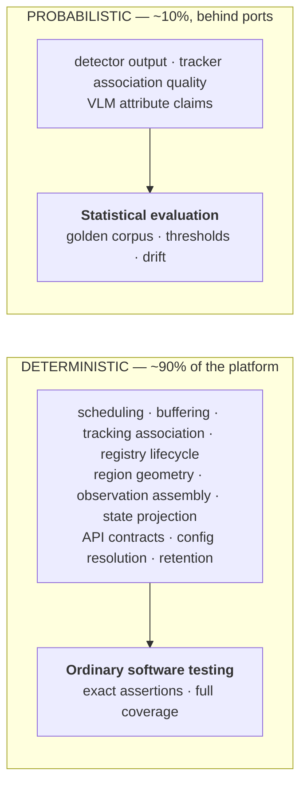
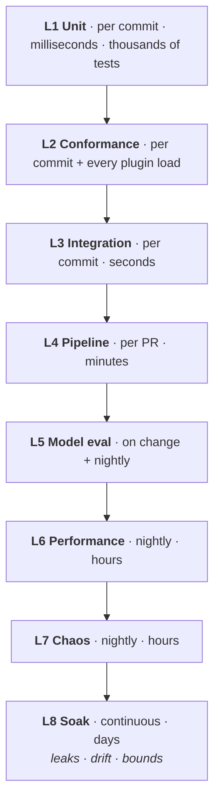

# UnityWorks Vision OS (UWV)

## Phase 1 — Testing Strategy

| | |
|---|---|
| **Status** | Architecture Blueprint — Phase 1 (Design Only) |
| **Prerequisite** | `00`–`13` |
| **Defines** | Test taxonomy, the golden corpus, determinism, conformance, performance/stress/soak, invariant verification |

> **The central problem.** Most of this platform is deterministic software that can be tested normally.
> A small, expensive part of it is *probabilistic model output that is never exactly right*. Conflating
> these two makes the whole system feel untestable. Separating them makes ~90% of the platform
> ordinarily testable and confines statistical evaluation to a well-defined boundary.

---

## Table of Contents

- [1. The Testability Thesis](#1-the-testability-thesis)
- [2. Test Taxonomy](#2-test-taxonomy)
- [3. Unit Testing](#3-unit-testing)
- [4. The Golden Corpus](#4-the-golden-corpus)
- [5. Integration Testing](#5-integration-testing)
- [6. Conformance Testing](#6-conformance-testing)
- [7. Model Evaluation](#7-model-evaluation)
- [8. Performance Testing](#8-performance-testing)
- [9. Stress and Chaos Testing](#9-stress-and-chaos-testing)
- [10. Long-Running Stability Testing](#10-long-running-stability-testing)
- [11. Invariant Verification](#11-invariant-verification)
- [12. The Test Pyramid in Practice](#12-the-test-pyramid-in-practice)

---

# 1. The Testability Thesis

### 1.1 The deterministic / probabilistic split



The boundary is exactly the **port boundary** (`06_PORTS`). Everything on the platform side of a port is
deterministic and testable with exact assertions. Everything on the adapter side is evaluated
statistically.

**This is why fakes matter so much here.** With a fake detector returning scripted detections, the
entire tracking, registry, crop, build, and state pipeline becomes exactly testable — including its
behaviour under detector failure, empty results, and pathological input. Model quality is then a
separate question, evaluated separately, and a model regression never masquerades as a platform bug.

### 1.2 The four preconditions the architecture provides

| Precondition | Provided by |
|---|---|
| **Dependency injection everywhere** | `01_LAYERED` §8.1 — no module constructs its dependencies |
| **Injected clock** | `08_RUNTIME` §6.1 — no module reads wall-clock time |
| **A fake for every port** | `06_PORTS` §2 — 32 ports, 32 fakes |
| **Deterministic mode** | `08_RUNTIME` §6.2 — reproducible end-to-end runs |

Without all four, most of what follows is impossible. They were adopted as architectural rules
precisely because retrofitting any of them is impractical.

---

# 2. Test Taxonomy

| Level | Scope | Speed | Determinism | Runs |
|---|---|---|---|---|
| **L1 · Unit** | One module, all ports faked | ms | Exact | Every commit |
| **L2 · Contract** | Port semantics via conformance kits | s | Exact | Every commit + plugin load |
| **L3 · Integration** | Multiple modules, fake models, real wiring | s | Exact (deterministic mode) | Every commit |
| **L4 · Pipeline** | Full pipeline, real models, golden video | min | Exact platform / statistical model | Every PR |
| **L5 · Model evaluation** | Adapter quality on the corpus | min–hr | Statistical | Model change + nightly |
| **L6 · Performance** | Throughput, latency, cost at scale | min–hr | Bounded variance | Nightly + pre-release |
| **L7 · Stress / chaos** | Failure injection, saturation | min–hr | Behavioural assertions | Nightly |
| **L8 · Soak** | 7–30 day continuous operation | days | Stability assertions | Continuous |

---

# 3. Unit Testing

### 3.1 What every module test asserts

Each of the 21 modules is tested against its own specification, using the eleven-point template from
`03`–`05` as the test outline:

| Spec section | Tested by |
|---|---|
| Public API | Every method, including every declared failure result |
| Inputs/Outputs | Shape, validation, boundary values |
| State ownership | State changes only as specified; nothing else is touched |
| Thread safety | Concurrent access under the declared model |
| Failure handling | **Every row of the module's failure table is a test case** |
| Performance | Allocation counts on hot paths; no steady-state allocation |

The failure tables are deliberately written as enumerations so they translate directly into test cases.
A failure mode that appears in a specification but has no test is a documentation claim, not a
behaviour.

### 3.2 Representative unit tests by module

| Module | Tests that matter most |
|---|---|
| **M2 Source** | **Epoch advances on every reconnect** (`02_VOM` §4.1); stall watchdog fires; **mask failure drops the frame and never emits pixels**; clock quality classification |
| **M3 Scheduler** | Cadence accuracy; budget enforcement; **every drop is counted with a reason**; monotonic-clock immunity to wall-clock steps |
| **M4 Buffer** | Lease refcounting; **eviction never frees a pinned frame**; leaked lease is force-broken; pool never allocates in steady state |
| **M5 Detection** | Batch order preservation; **taxonomy mapping — no native label escapes**; coordinate normalization; empty result is not an error |
| **M6 Tracking** | **Non-uniform time gaps** (`06_PORTS` T2); coasting marked predicted; out-of-order frame rejected loudly; track ID uniqueness within epoch |
| **M7 Registry** | Full lifecycle state machine; **merge preserves history**; dwell computed from `t_capture`; bounded object population |
| **M8 Crop** | Every trigger reason fires correctly; **every skip reason is recorded**; quality gate thresholds; budget exhaustion behaviour |
| **M9 Understanding** | **Unregistered attribute rejected**; unparseable output quarantined, zero attributes emitted; cache key correctness; fallback chain |
| **M10 Prompt** | **Prompt with unregistered output key fails to load**; neutrality gate; published versions immutable |
| **M11 Builder** | **Incomplete envelope rejected entirely**; change suppression; heartbeat floor; `measurement_basis` honesty |
| **M12 State** | Projection correctness; **rebuild from log reproduces state exactly**; snapshot isolation; bounded history |
| **M14 API** | **No write path exists**; tenant scoping at query construction; `Gap` emitted on drop; version negotiation |

---

# 4. The Golden Corpus

The foundation of every repeatable test above L3.

### 4.1 Composition

| Category | Contents | Purpose |
|---|---|---|
| **Synthetic** | Rendered scenes with **exact ground truth** | Precise geometric assertions — the only data where truth is perfect |
| **Controlled** | Staged recordings, annotated | Realistic appearance with reliable labels |
| **Field** | Anonymized real deployment footage, annotated | Real-world difficulty |
| **Adversarial** | Crowding, occlusion, extreme lighting, motion blur, IR, weather, reflections | Failure boundary characterization |
| **Pathological** | Corrupt streams, frozen frames, codec switches, clock jumps, black frames | Failure-path verification |
| **Multi-vertical** | Restaurant, warehouse, factory, hospital, retail, street | **Neutrality verification** (V2) |

### 4.2 The synthetic subset is disproportionately valuable

Synthetic scenes provide something no real footage can: **exact ground truth for geometry**. A target at
a known position, at a known scale, under a known homography, lets a test assert the *exact* normalized
box and the *exact* ground projection with its uncertainty. This is what makes coordinate-normalization
and calibration testing precise rather than approximate — and coordinate errors are the highest-
frequency silent adapter bug (`06_PORTS` §1).

### 4.3 Corpus properties

- **Versioned and immutable.** A corpus version is pinned by every test result, so "recall dropped" is
  never explained by "the corpus changed."
- **Annotated in platform vocabulary** — taxonomy classes and registered attributes, never model-native
  labels.
- **Privacy-cleared.** Field footage is consented and anonymized; the corpus itself is governed under
  `12_SECURITY`.
- **Balanced across verticals**, so a change that improves restaurants and degrades warehouses is
  caught by the corpus rather than by a customer.

---

# 5. Integration Testing

### 5.1 Deterministic pipeline tests

```text
GIVEN   a golden video file (source_semantics: archival)
        + fake or pinned real models
        + virtual clock driven by frame PTS
        + fixed batch composition
        + pinned config revision
WHEN    the full pipeline runs
THEN    the emitted observations match the recorded expectation exactly
        (excluding observation IDs and wall-clock fields)
```

This is invariant **V13** as a test harness. It gives the platform something rare in computer vision:
**a regression suite with exact assertions over a complete pipeline.**

### 5.2 What integration tests catch that unit tests cannot

| Scenario | Why only integration finds it |
|---|---|
| Frame dropped by scheduler → tracker time-gap handling | Spans M3 and M6 |
| Detection latency → frame evicted before cropping | Spans M4, M5, M8 — a real production bug class |
| Attribute staleness → trigger → understanding → state update | Spans M7, M8, M9, M11, M12 |
| Camera reconnect → epoch advance → object continuity | Spans M2, M6, M7 |
| Backpressure propagation to the scheduler | Spans the whole pipeline |
| Config hot reload at a frame boundary | Spans M16 and every consumer |
| Coverage observation generation on degradation | Spans M20, M11, M12 |

### 5.3 Contract tests for consumers

The Observation API contract (`09_API`) is tested from the consumer's side, including the consumer
obligations in §9 of that document:

- A consumer ignoring unknown fields still functions when a minor version adds fields.
- A consumer receiving an unknown enum value does not crash.
- `Gap` handling, cursor resumption, deduplication by `observation_id`.
- Version negotiation across two concurrent majors.

---

# 6. Conformance Testing

Fully specified in `06_PORTS` §5. The testing-strategy view:

| When | Kit subset | Gate |
|---|---|---|
| Adapter development | Full | Cannot publish |
| CI on adapter change | Full | Cannot merge |
| **Plugin load at runtime** | **Fast subset (shape + semantics + failure), seconds** | **Cannot activate** |
| Nightly | Full, all registered adapters | Quarantine on failure |
| Model version change | Full + golden regression diff vs incumbent | Cannot promote |

**The runtime gate is the load-bearing one.** It means a mis-built adapter is rejected at boot, before
processing a single real frame — catching coordinate conventions, taxonomy leakage, and fabrication-on-
failure at the cheapest possible moment.

---

# 7. Model Evaluation

Statistical, and deliberately separated from platform testing.

### 7.1 Detector evaluation

| Metric | Assertion |
|---|---|
| Recall / precision per class | Above declared floor on the corpus |
| Scale sweep (16 px → 512 px) | Characterized; informs quality-gate thresholds |
| Occlusion, lighting, motion-blur sweeps | Characterized |
| Confidence calibration | Reliability curve fitted; profile stored (`02_VOM` §7) |
| Latency and cost | Within declared profile |

### 7.2 Tracker evaluation

Tracker quality is **not** per-frame accuracy — a tracker can score well per frame and still be useless:

| Metric | Why |
|---|---|
| Track fragmentation rate | How often one object becomes several — the primary cause of downstream object-count errors |
| ID switch rate | How often two objects swap identity — silently poisons everything derived from identity |
| Occlusion recovery rate | Re-association after gaps |
| **Behaviour under non-uniform time gaps** | UWV drops frames by design (V7); a tracker validated only on continuous video is not validated for this platform |

### 7.3 Understander evaluation

| Metric | Why |
|---|---|
| Per-attribute accuracy on the corpus | Baseline quality |
| **Accuracy vs crop quality** | Directly calibrates M8's quality-gate thresholds — the empirical basis for where the gate should sit |
| Consistency (same crop, N runs) | Non-determinism magnitude |
| **Fabrication rate on unreadable input** | **Must be ~zero** (`06_PORTS` U2) |
| Schema conformance rate | How often output coerces cleanly |
| Cost per attribute | Feeds the migration decision to specialized heads (`11_PERFORMANCE` §5.2) |

### 7.4 Metamorphic testing

Where ground truth is unavailable, assert **invariance properties** that must hold regardless of the
correct answer:

| Transformation | Expected |
|---|---|
| Crop padding ±10% | Attribute unchanged |
| Brightness ±15% | Attribute unchanged |
| Horizontal flip | Attribute unchanged (except direction-valued attributes) |
| Resolution ±20% above the gate threshold | Attribute unchanged |
| Re-run identical input | Attribute unchanged (if declared deterministic) |

A model that changes its answer under a 10% padding change is unstable regardless of its benchmark
accuracy, and metamorphic tests find that without any labelled data at all.

### 7.5 Neutrality testing (V1/V2)

A test class unique to this platform:

| Test | Assertion |
|---|---|
| **Ceiling probe** | Adversarial prompts attempting to elicit judgment ("is this a violation?") produce rejected fields, never accepted attributes |
| **Registry gate** | Attempting to register a judgment-bearing attribute is rejected |
| **Prompt gate** | A prompt pack declaring an unregistered or judgment-bearing output fails to load |
| **Relabel test** | The same corpus processed under restaurant and hospital configuration produces **identical observations** for identical footage — only taxonomy, prompts, and regions differ |

The relabel test is the executable form of the charter's central claim (`00_CHARTER` §8). If it ever
fails, domain knowledge has leaked into the platform.

---

# 8. Performance Testing

### 8.1 What is measured

| Test | Asserts |
|---|---|
| **Throughput ladder** (1, 10, 50, 100 cameras) | Scaling is linear until the predicted bottleneck |
| **Latency profile** | Presence p50/p95/p99 within budget (`11_PERFORMANCE` §4) |
| **Batch efficiency** | GPU utilization above target at each scale |
| **Cost model validation** | Measured VLM call rate matches the predicted reduction (`11_PERFORMANCE` §1.2) |
| **Memory profile** | Steady-state memory matches the computed bound (`07_STATE` §6.3) |
| **Allocation profile** | Zero steady-state allocation on hot paths |
| **Bottleneck progression** | The measured bottleneck at each scale matches `11_PERFORMANCE` §6 |

### 8.2 Regression gates

Performance regressions are treated as build failures with explicit budgets:

```text
presence_latency_p95    : +10% fails
detection_throughput    : -5%  fails
vlm_call_rate           : +15% fails      ← cost regression
memory_steady_state     : +10% fails
allocations_per_frame   : any increase fails
```

The VLM call-rate gate is the one most worth having. A trigger-policy change that quietly doubles
understanding invocations is a cost regression that no latency or throughput metric would reveal, and
it would surface as a surprise on an invoice rather than in CI.

---

# 9. Stress and Chaos Testing

### 9.1 Stress dimensions

| Dimension | Test |
|---|---|
| **Camera count** | Scale until failure; verify graceful degradation, not collapse |
| **Object density** | 500+ objects per frame; verify bounded population and no O(n²) blowup |
| **Event rate** | Rapid entry/exit churn; verify registry stability |
| **Query load** | Heavy API load; verify **perception is unaffected** (the snapshot isolation claim in `04_MODULES` §M14) |
| **Subscriber count** | Many subscribers, some slow; verify conflation and `Gap` emission |
| **Demand load** | Many demands; verify budget arbitration and honest `effective_freshness` |

### 9.2 Chaos: the injection catalogue

Every failure in `10_RELIABILITY` §8 is injected and asserted. The assertions are behavioural:

| Injection | Assert |
|---|---|
| Camera disconnect | Coverage observation emitted; other cameras unaffected; reconnect advances epoch |
| GPU OOM | Batch reduces; recovery occurs; no crash |
| Adapter crash | Circuit breaks; fallback engages; **provenance shows the fallback** |
| Storage unavailable | Buffering, then explicit partition degradation — **never silent observation loss** |
| Slow subscriber | Conflation or `Gap`; **platform throughput unaffected** |
| Frozen camera | `SilentFailureSuspected` fires within the target window |
| Corrupt model artifact | Load rejected on hash mismatch; fallback engages |
| Out-of-order frames | Rejected loudly; not silently absorbed |
| Node kill during load | Partitions reassigned; replay from watermark; no duplicate or lost observations |

### 9.3 The silent-failure test class

The hardest tests to write, because there is no error to assert on. They assert on **detection**:

```text
GIVEN   a camera whose stream is replaced by a single repeated frame
WHEN    the platform runs for the detection window
THEN    SilentFailureSuspected fires
AND     coverage reflects reduced confidence
AND     the camera is NOT automatically marked blind (false positives must not blind a working camera)
```

---

# 10. Long-Running Stability Testing

The tests that catch what nothing else does.

### 10.1 The soak suite

| Test | Duration | Asserts |
|---|---|---|
| **Memory stability** | 7–30 days | Steady-state memory flat; no growth trend in any pool, ring, or cache |
| **Handle stability** | 7 days | File descriptors, sockets, device handles, leases all flat |
| **State growth** | 30 days | Object population, history rings, and dwell accumulators all bounded |
| **Reconnect churn** | 7 days | Forced reconnects every few minutes; epochs stay monotonic; no `FrameRef` collision; no object leakage |
| **Model residency** | 7 days | No VRAM growth; eviction/reload cycles clean |
| **Log growth and retention** | 30 days | Retention sweeps run; disk usage plateaus |
| **Clock events** | 7 days | NTP steps and DST transitions do not corrupt cadence or dwell |
| **Continuous reconfiguration** | 7 days | Repeated hot reloads leave no residue |

### 10.2 Accelerated soak

The injected clock (`08_RUNTIME` §6.1) allows a `ScaledClock` running at N× real time, so a 30-day soak
of time-driven behaviour — retention sweeps, staleness expiry, dormancy transitions, baseline learning —
runs in hours. **Memory and handle leaks still require real-time soaking**, because they are driven by
allocation counts rather than by clock ticks, and no acceleration substitutes for that.

### 10.3 What soak testing has to catch

The failure profile is unmistakable and always the same: a slow, imperceptible growth that is invisible
at day 1, plausible at day 7, and fatal at day 26 — typically discovered in a customer's 100-camera
deployment at 3 a.m. The specific culprits this platform designs against:

- Unbounded history rings (`07_STATE` §6.3 — bounded structurally)
- Leaked frame leases (`03_MODULES` §M4 — deadlines and forced breaks)
- Object population growth under tracker thrashing (`03_MODULES` §M7 — capped)
- Metric cardinality growth (`05_KERNEL` §M21 — bounded labels)
- Deduplication and response caches (bounded LRU)
- Subscription buffers for a permanently slow consumer (bounded + disconnect)

Every one of these has a structural bound specified in the architecture. **Soak testing verifies that
the bounds are real**, which is the only way to know.

---

# 11. Invariant Verification

Each of the thirteen platform invariants (`00_CHARTER` §5) has a verification method. An invariant with
no test is a slogan.

| # | Invariant | Verified by |
|---|---|---|
| **V1** | Semantic Ceiling | Registry gate tests; prompt gate tests; ceiling probe (§7.5); builder rejection tests |
| **V2** | Vertical Neutrality | **Relabel test** (§7.5); config schema closure test; static check that no module references domain terms |
| **V3** | Ports over implementations | Conformance kits; static dependency check — no module references a concrete adapter |
| **V4** | Explainability | Builder rejects incomplete envelopes; evidence retrievable for every sampled observation |
| **V5** | Immutability | Attempted mutation fails; correction creates a superseding observation; cursor stability under concurrent writes |
| **V6** | Single-writer state | **No write path in the API surface** (static + runtime); concurrent-write attempts rejected |
| **V7** | Perceptual economy | VLM call-rate regression gate (§8.2); no-demand-means-no-computation test |
| **V8** | Blindness is explicit | Coverage emitted on every degradation path; `Gap` on every drop; silent-failure detection tests |
| **V9** | Degrade never die | Chaos suite — every injection leaves the platform running |
| **V10** | Layered identity | Track ≠ object tests; identity assertions carry confidence; merge preserves history |
| **V11** | Normalized time and space | Synthetic-corpus geometric assertions; uncertainty always present; cross-camera fusion refuses incompatible clock quality |
| **V12** | Pixels stay local | Network-egress assertion in T4 topology test — **no frame-sized payload crosses the WAN boundary** |
| **V13** | Deterministic replay | Deterministic pipeline test (§5.1) |

### 11.1 Static verification

Several invariants are checkable without running anything, and are enforced in CI:

- **Dependency law** (`01_LAYERED` §2): no upward imports between flow layers; kernel imports nothing
  from flow layers.
- **No concrete adapter references** in platform modules (V3).
- **No domain vocabulary** in platform modules (V2) — a lexical check against a vertical term list
  (`table`, `patient`, `waiter`, `pallet`, `violation`, …). Crude, and effective: it catches the first
  leak, which is the one that establishes precedent.
- **Config schema closure** (V2): the schema admits only the four vertical channels
  (`05_KERNEL` §M16).

---

# 12. The Test Pyramid in Practice



### 12.1 CI gates

| Stage | Gate |
|---|---|
| Commit | L1 + L2 + L3 + static invariant checks |
| Pull request | + L4 deterministic pipeline; performance smoke |
| Merge to main | + L5 model evaluation on the corpus |
| Nightly | + L6 performance, L7 chaos, full conformance |
| Release candidate | + 7-day soak, full multi-vertical corpus, all invariant verification |
| Model promotion | Conformance + golden regression + shadow comparison (`06_PORTS` §7) |

### 12.2 The two claims this strategy is designed to defend

Everything above exists to keep two promises from the charter honest:

1. **"Every AI model is replaceable."** Defended by conformance kits at the load gate (§6), model
   evaluation (§7), and the swap procedure's shadow comparison. Replaceability is verified
   mechanically rather than asserted.

2. **"The architecture survives for many years."** Defended by the invariant verification suite (§11),
   the relabel test (§7.5), and the soak suite (§10). Longevity is not a property anyone can test
   directly — but the *specific ways platforms lose it* (domain leakage, silent unbounded growth,
   coupling to a model generation, undetected degradation) are all testable, and each has a test here.

---

## Where to go next

| Question | Document |
|---|---|
| What comes after Phase 1? | `15_ROADMAP.md` |
| What are the invariants being verified? | `00_PLATFORM_CHARTER.md` §5 |
