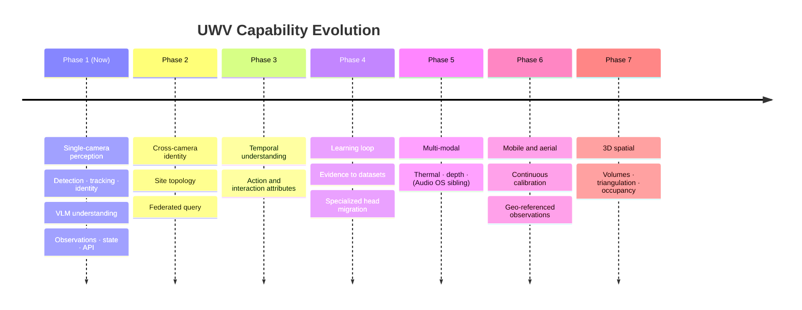

# UnityWorks Vision OS (UWV)

## Phase 1 — Future Expansion Roadmap

| | |
|---|---|
| **Status** | Architecture Blueprint — Phase 1 (Design Only) |
| **Prerequisite** | `00`–`14` |
| **Defines** | What Phase 1 deliberately omits, how each future capability attaches, and what must never change |

> **The purpose of this document is restraint.** Every capability below is *enabled* by Phase 1 and
> *not built* in Phase 1. Naming them, and naming the exact seam each attaches to, is what stops them
> from being pre-built badly — and what proves the Phase 1 boundaries were drawn in the right places.

---

## Table of Contents

- [1. The Extension Principle](#1-the-extension-principle)
- [2. What Phase 1 Deliberately Omits](#2-what-phase-1-deliberately-omits)
- [3. Phase 2 — Multi-Camera Perception](#3-phase-2--multi-camera-perception)
- [4. Phase 3 — Temporal Understanding](#4-phase-3--temporal-understanding)
- [5. Phase 4 — Learning Loop](#5-phase-4--learning-loop)
- [6. Phase 5 — Multi-Modal Perception](#6-phase-5--multi-modal-perception)
- [7. Phase 6 — Mobile and Aerial Platforms](#7-phase-6--mobile-and-aerial-platforms)
- [8. Phase 7 — 3D and Spatial Reasoning](#8-phase-7--3d-and-spatial-reasoning)
- [9. The Ten-Year View](#9-the-ten-year-view)
- [10. What Must Never Change](#10-what-must-never-change)

---

# 1. The Extension Principle

> **Every future capability must attach at an existing seam. A capability requiring a new seam is a
> signal that the seam was missing, not that the architecture should be bypassed.**

Five seams exist, and every roadmap item below lands on one of them:

| Seam | Mechanism | Absorbs |
|---|---|---|
| **A new adapter** | An existing port, new implementation | New models, sources, stores, transports |
| **A new port** | Reviewed addition to the catalogue | A genuinely new *kind* of replaceable capability |
| **A new taxonomy class or attribute** | Registry addition | New things to see, new things to say |
| **A new observation type** | Additive schema change | A new *kind* of visual fact |
| **A new sink** | `ObservationSinkPort` | New consumers of the observation stream |

If a proposed capability fits none of these, the correct response is architectural review — not an
exception.

---

# 2. What Phase 1 Deliberately Omits

| Omitted | Why it is out of scope | How Phase 1 enables it anyway |
|---|---|---|
| **Business rules, alerts, dashboards, POS integration** | V1 — permanently out of scope, in every phase | Observation API + demand contracts |
| **Analytics and BI** | Anti-goal (`00_CHARTER` §6) | Observation log; `ObservationSinkPort` to a warehouse |
| **Learning pipeline** | Phase 4 | **Evidence retention (V4) is exactly the training data** |
| **Cross-camera identity** | Phase 2 | `IdentityResolverPort` (P11) already defined and unused |
| **Temporal/action understanding** | Phase 3 | `UnderstanderPort` already accepts crop *sequences* |
| **Audio, depth, thermal** | Phase 5 | Kernel is modality-agnostic; substrate is shared |
| **Drone and mobile sources** | Phase 6 | `SourcePort`; `get_calibration(at: Time)` already time-varying |
| **3D reconstruction** | Phase 7 | `SpatialInfo` already admits volumes and ground points |
| **Model training and fine-tuning** | Not a platform function | Model registry consumes what a training system produces |
| **Federated multi-site identity** | Phase 2+, policy-gated | Identifiers already globally unique |

### 2.1 The pattern worth noticing

Every "how Phase 1 enables it" column names something that already exists — a port with no
implementations, a schema field with no current producer, a contract shape that admits a degenerate
case. **None of these cost anything to include and all of them cost enormously to retrofit.** That
asymmetry is the entire justification for designing Phase 1 against a ten-year horizon rather than a
one-year one.

---

# 3. Phase 2 — Multi-Camera Perception

**Goal:** the same object recognized across camera views.

| Aspect | Detail |
|---|---|
| **Seam** | `IdentityResolverPort` (P11) — already specified, no implementations in Phase 1 |
| **New components** | Cross-camera resolver adapter; camera topology model; site identity index |
| **New data** | Camera adjacency graph with transit-time priors |
| **Object model change** | **None.** `ObjectId` is already site-scoped; identity assertions already carry confidence, method, and evidence (`02_VOM` §4.2) |
| **Module change** | **None.** M7 already accepts identity assertions from a resolver |
| **New observation type** | None — `identity` observations already exist |

### The hard part, named

Cross-camera matching is **O(n²)** in candidate pairs and is the platform's first super-linear cost
(`11_PERFORMANCE` §2.2). The topology model is the mitigation: only cameras that could plausibly see
the same object within a plausible transit time are candidates, which reduces the practical cost to
near-linear in most physical layouts.

### The privacy dimension

Cross-camera identity is a materially more invasive capability than single-camera tracking, and
persistent cross-time identity more so again. Both are **disabled by default**, are classified C2, and
require explicit policy authorization (`12_SECURITY` §2.3). Phase 2 must ship the policy gate with the
capability, not after it.

---

# 4. Phase 3 — Temporal Understanding

**Goal:** describe what is happening over time, not only what is present in an instant.

| Aspect | Detail |
|---|---|
| **Seam** | `UnderstanderPort` (P15) — `crops: CropView[]` already accepts sequences; single-frame is the degenerate case |
| **New components** | Temporal crop strategy (`CropStrategyPort`); video-understanding adapters |
| **New attributes** | Motion-dependent, registered normally: `gait`, `activity_class`, `interaction_type` |
| **Object model change** | **None** |
| **Module change** | **None** — M8 gains a crop strategy, M9 gains adapters |

### The ceiling applies with full force

Temporal understanding is where V1 will be tested hardest, because the outputs *sound* like judgments.

| Proposed | Verdict |
|---|---|
| `activity_class: walking / running / lifting / reaching` | ✅ Visible physical actions any observer would name |
| `interaction_type: object_transfer` | ✅ Visually evident |
| `activity_class: working / loitering / shoplifting` | ❌ Roles, intents, and crimes — not visible, only inferred |
| `anomalous_behaviour: true` | ❌ Requires a norm; the norm is business |

The registry's neutrality gate (`02_VOM` §9.1) handles this exactly as it handles Phase 1 attributes.
No new mechanism is needed — which is itself evidence that the gate was designed at the right level of
generality.

---

# 5. Phase 4 — Learning Loop

**Goal:** the platform's own evidence improves the models it runs.

| Aspect | Detail |
|---|---|
| **Seam** | `ObservationSinkPort` (P19) → dataset builder; Model Manager consumes the resulting artifacts |
| **New components** | Dataset builder; annotation workflow; training orchestration; evaluation harness |
| **Platform change** | **None.** The learning system is a *consumer* of UWV, not a part of it |

### Why Phase 1 already contains the hard part

A learning loop needs, above all, **well-provenanced training data**. Phase 1 produces it as a
by-product of invariant V4:

| Learning need | Phase 1 artifact |
|---|---|
| Input imagery | Evidence crops, content-addressed |
| Model prediction | Observation attributes with confidence |
| Exact model + prompt version | `Provenance` on every observation |
| Raw model output | Evidence `raw_output_ref` |
| Difficulty signal | Quality grades, low confidence, gate rejections |
| Disagreement signal | **Shadow-mode comparisons** (`05_KERNEL` §M18) |
| Correction signal | Superseding observations (V5) |

The most valuable of these is shadow mode: it produces, continuously and for free, a labelled set of
cases where two models disagree — which is precisely where annotation effort is worth spending.

**The strategic arc this completes** is the one described in `11_PERFORMANCE` §5.2: use a general VLM
to discover an attribute, harvest its evidence, train a specialized head, migrate the attribute via
`understander.router`, and reduce that attribute's cost by two orders of magnitude — per attribute, in
production, with zero consumer impact. Phase 1 makes this possible by choosing one port abstraction
correctly.

---

# 6. Phase 5 — Multi-Modal Perception

**Goal:** perception beyond the visible spectrum and beyond vision.

| Modality | Attaches via | Notes |
|---|---|---|
| **Thermal** | `SourcePort` + `DetectorPort` adapters | Frames are frames; taxonomy gains thermal-specific classes |
| **Depth / stereo / LiDAR** | `SourcePort` + `SpatialInfo.ground_point` | Removes homography dependence; improves ground projection dramatically |
| **Audio** | New port, or a sibling **UnityWorks Audio OS** | See below |
| **Environmental sensors** | Sink into observations as context | Low complexity |

### The audio decision, stated now

Audio is the one roadmap item that may warrant a **separate platform** rather than an extension. The
question is whether audio's temporal structure (continuous, no frame concept, different latency
profile, different privacy regime) fits the frame-and-crop model. The likely answer is that it does
not, and that the correct outcome is a **UnityWorks Audio OS** sharing L0 kernel modules
(`05_KERNEL` — none of which know what a frame is) and producing observations against the same
substrate, fused by a consumer or by the Cognitive Platform.

This is exactly why the kernel law was written as it was: **the seven L0 modules were kept ignorant of
vision so a sibling platform could reuse them unchanged.** That constraint cost nothing in Phase 1 and
determines whether Phase 5 is a reuse or a rewrite.

---

# 7. Phase 6 — Mobile and Aerial Platforms

**Goal:** cameras that move — drones, robots, body-worn, vehicle-mounted.

| Aspect | Detail |
|---|---|
| **Seam** | `SourcePort` adapters + `CalibrationPort` |
| **The key enabler** | `get_calibration(camera_id, at?: Time)` — **already time-varying in Phase 1** (`03_MODULES` §M1) |
| **New data** | Telemetry (GPS, IMU, gimbal) as frame metadata feeding continuous calibration |
| **Object model change** | **None** — `geo` frame of reference already exists in the coordinate stack (`02_VOM` §6.1) |

### What genuinely changes

| Assumption | Static camera | Moving camera |
|---|---|---|
| Calibration | Fixed, versioned | Continuous, per-frame |
| Regions | Fixed image geometry | Only meaningful in world coordinates |
| Background | Stable | Always changing |
| Tracking | Image-space viable | Requires ego-motion compensation |
| Viewpoint drift detection | A failure signal | Normal operation |

**Regions are the interesting consequence.** For a moving camera, an image-space region is meaningless;
only site-frame or geo-frame regions make sense. Phase 1's space model already supports both
(`02_VOM` §6.1), and `RegionMembership.method` already records how membership was computed — so the
contract absorbs this without change.

---

# 8. Phase 7 — 3D and Spatial Reasoning

**Goal:** perceive volume, not just image plane.

| Aspect | Detail |
|---|---|
| **Seam** | `DetectorPort` geometry kinds; `SpatialInfo` volumes; `CalibrationPort` |
| **New capability** | 3D bounding volumes; multi-camera triangulation; occupancy grids |
| **Object model change** | Additive — `SpatialInfo` already declares `frame_of_reference` and admits volumes |

Multi-camera triangulation depends on Phase 2 (knowing that two views show the same object) and on
high-quality time synchronization (`02_VOM` §5) — which is precisely why `t_capture_unc` and
`ClockQuality` were made mandatory fields in Phase 1 rather than optional ones. Triangulating from two
cameras whose timestamps disagree by 300 ms produces confident nonsense, and only an explicit
uncertainty model prevents it.

---

# 9. The Ten-Year View

### 9.1 What the platform looks like in 2036, if this works

- **Every model has been replaced two or three times.** Detectors, trackers, and understanders from
  2026 are museum pieces. The ports they implemented are on version 1.4, 1.2, and 2.1.
- **Most attributes are served by specialized heads** trained on the platform's own evidence. The
  general VLM handles the long tail and novel requests.
- **The observation schema is at version 1.9** — nine additive revisions, no breaking change, and 2026
  observations are still queryable and interpretable.
- **The module set is recognizably the same twenty-one modules**, with a handful added at the site and
  multi-modal layers.
- **The invariants are unchanged.** Particularly V1: the platform still does not know what a restaurant
  is.

### 9.2 The failure mode to watch for

The most likely way this architecture dies is not technical. It is **a series of individually
reasonable exceptions to V1 and V2**, each one small, each one urgent, each one citing the previous as
precedent. Five years later the platform has a `restaurant` module, a `hospital` fork, and a
configuration schema with 400 vertical-specific keys.

The defences are deliberately structural rather than cultural, because culture does not survive
deadlines:

| Defence | Mechanism |
|---|---|
| Attribute registry neutrality gate | Rejects judgment attributes at registration (`02_VOM` §9.1) |
| Prompt validation | Rejects packs declaring judgment outputs (`04_MODULES` §M10) |
| Builder enforcement | Drops unregistered attributes (`04_MODULES` §M11) |
| Closed config schema | No slot exists for a business rule (`05_KERNEL` §M16) |
| Relabel test in CI | Restaurant and hospital configs must produce identical observations (`14_TESTING` §7.5) |
| Static domain-vocabulary check | Catches the first leak, which is the one that sets precedent |

**Four independent gates, plus two automated checks.** Any one can be argued around in a meeting; all
six cannot be argued around quietly.

---

# 10. What Must Never Change

The commitments that make everything above possible. Changing any of these is not an evolution of this
architecture — it is a different architecture wearing its name.

| # | Commitment | Consequence of breaking it |
|---|---|---|
| **1** | **The Semantic Ceiling (V1).** The platform reports what is visible, never what it means. | It becomes a vertical product; every industry is a rewrite |
| **2** | **Vertical neutrality (V2).** Domain knowledge enters only as taxonomy, regions, prompts, and demands. | Modules fork per industry |
| **3** | **Ports for every model (V3).** | Model churn becomes platform churn |
| **4** | **Explainability (V4).** No observation without evidence and provenance. | Nothing is auditable, debuggable, or admissible; the learning loop loses its input |
| **5** | **Immutability (V5).** Observations are never edited. | History becomes unreproducible; the audit lies |
| **6** | **Single-writer state (V6).** Business systems never write. | Corruption; the platform loses authority over its own world model |
| **7** | **Blindness is explicit (V8).** Absence of observation is never observation of absence. | **The most dangerous failure in the system** — confident wrong action in the physical world |
| **8** | **The observation envelope.** Additive evolution only. | A decade of consumer integrations breaks at once |

### 10.1 The one-sentence summary of this entire document set

> **UWV converts pixels into explainable, domain-neutral observations — and its most valuable property
> is the size of the set of things it refuses to know.**

Everything else in these fifteen documents is machinery in service of that sentence: the layering that
keeps meaning out, the ports that keep models replaceable, the ceiling gates that keep judgment out,
the coverage model that keeps the platform honest about its limits, and the invariants that keep all of
it true after the people who wrote it have moved on.

---

## The document set

| # | Document |
|---|---|
| 00 | `00_PLATFORM_CHARTER.md` |
| 01 | `01_LAYERED_ARCHITECTURE.md` |
| 02 | `02_VISION_OBJECT_MODEL.md` |
| 03 | `03_MODULES_ACQUISITION_AND_PERCEPTION.md` |
| 04 | `04_MODULES_UNDERSTANDING_AND_STATE.md` |
| 05 | `05_MODULES_PLATFORM_KERNEL.md` |
| 06 | `06_PORTS_AND_ADAPTERS.md` |
| 07 | `07_STATE_ARCHITECTURE.md` |
| 08 | `08_RUNTIME_AND_THREADING.md` |
| 09 | `09_API_CONTRACTS.md` |
| 10 | `10_RELIABILITY_AND_FAILURE.md` |
| 11 | `11_PERFORMANCE_AND_SCALING.md` |
| 12 | `12_SECURITY_AND_PRIVACY.md` |
| 13 | `13_DEPLOYMENT_ARCHITECTURE.md` |
| 14 | `14_TESTING_STRATEGY.md` |
| 15 | `15_ROADMAP.md` |
