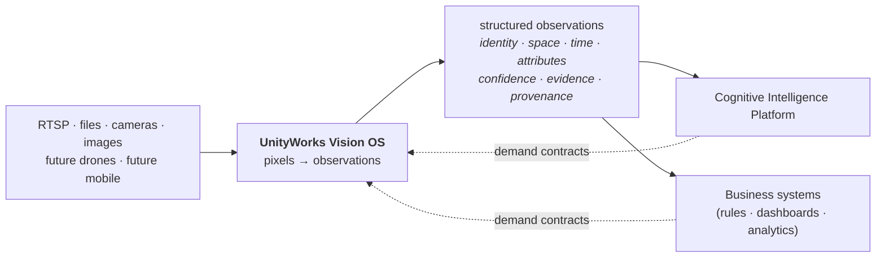

# UnityWorks Vision OS (UWV)

### The Perception Platform of UnityWorks AI

| | |
|---|---|
| **Architecture** | Frozen at v1.0 (foundational). 16 documents — this index + 15 specifications. |
| **Implementation** | **Phase 1 complete** — all 8 flows, L0 through L7. See [implementation status](#implementation-status). |
| **Sibling** | Cognitive Intelligence Platform — `docs/architecture/COGNITIVE_*.md` |

---

## What this is

A **reusable computer vision platform** that converts video streams into structured, explainable,
domain-neutral **observations** — and does nothing else.

It is designed to serve Restaurant Monitoring, Warehouse Monitoring, Factory Monitoring, Hospital
Monitoring, Retail Analytics, and Smart City Surveillance **from one codebase, without redesigning the
core architecture** — and to remain stable for 5–10 years while every AI model inside it is replaced
several times.

### What it explicitly does not do

No business reasoning. No restaurant knowledge. No alerts. No POS integration. No dashboards. No
analytics. No learning pipeline. Those consume UWV; they are not part of it.

> **The one-sentence summary:** *UWV converts pixels into explainable, domain-neutral observations —
> and its most valuable property is the size of the set of things it refuses to know.*

---

## Reading order

### Start here (≈30 minutes)

| # | Document | Why |
|---|---|---|
| **00** | [Platform Charter](./00_PLATFORM_CHARTER.md) | Executive summary, architecture vision, the **Semantic Ceiling**, the 13 invariants, position in UnityWorks |
| **01** | [Layered Architecture](./01_LAYERED_ARCHITECTURE.md) | The 7 layers + kernel, dependency law, **two-plane model**, data flow, sharding |
| **02** | [Vision Object Model](./02_VISION_OBJECT_MODEL.md) | The closed ontology, identity/time/space/confidence models, **the observation envelope** |

### The module specifications (≈60 minutes)

Every one of the 21 required modules, specified against an identical eleven-point template: Purpose ·
Responsibilities · Public API · Inputs · Outputs · Dependencies · State Ownership · Thread Safety ·
Failure Handling · Performance · Extension Points.

| # | Document | Modules |
|---|---|---|
| **03** | [Acquisition & Perception](./03_MODULES_ACQUISITION_AND_PERCEPTION.md) | Camera Manager · Video Source Manager · Frame Scheduler · Frame Buffer · Detection Engine · Tracking Engine · Object Registry · Crop Manager |
| **04** | [Understanding & State](./04_MODULES_UNDERSTANDING_AND_STATE.md) | Vision Understanding Engine · Prompt Manager · Observation Builder · Vision State Manager · Storage Interfaces · Observation API |
| **05** | [Platform Kernel](./05_MODULES_PLATFORM_KERNEL.md) | Runtime · Configuration Manager · Plugin Manager · Model Manager · Event Bus · Health Monitor · Metrics Engine |

### The design deep-dives

| # | Document | Covers |
|---|---|---|
| **06** | [Ports & Adapters](./06_PORTS_AND_ADAPTERS.md) | 32-port catalogue, **conformance kits**, the model swap procedure, anti-patterns |
| **07** | [State Architecture](./07_STATE_ARCHITECTURE.md) | Log-and-projection, partitioning, snapshots, history, **the coverage model**, retention, recovery |
| **08** | [Runtime & Threading](./08_RUNTIME_AND_THREADING.md) | Concurrency model, thread topology, queues & backpressure, **the clock and determinism**, distribution |
| **09** | [API Contracts](./09_API_CONTRACTS.md) | Query · subscribe · **demand contracts** · coverage · evidence; versioning; consumer obligations |

### Operations and assurance

| # | Document | Covers |
|---|---|---|
| **10** | [Reliability & Failure](./10_RELIABILITY_AND_FAILURE.md) | Failure taxonomy, blast radius, degradation ladders, **the silent failure problem**, recovery |
| **11** | [Performance & Scaling](./11_PERFORMANCE_AND_SCALING.md) | Cost model, 1→1000 cameras, capacity planning, latency budgets, **the optimization ladder** |
| **12** | [Security & Privacy](./12_SECURITY_AND_PRIVACY.md) | Threat model, **privacy at the earliest point**, tenant isolation, supply chain, governance, audit |
| **13** | [Deployment Architecture](./13_DEPLOYMENT_ARCHITECTURE.md) | Five topologies from embedded to distributed cluster, upgrades, operational surface |
| **14** | [Testing Strategy](./14_TESTING_STRATEGY.md) | Unit · integration · conformance · performance · stress · **soak** · invariant verification |
| **15** | [Roadmap](./15_ROADMAP.md) | What Phase 1 omits and how each future capability attaches; **what must never change** |

---

## Implementation status

The architecture above is **frozen**. Implementation proceeds one flow at a time,
in a fixed order, and each flow produces a report against the headings its brief
names. Code lives in `backend/app/vision_os/`.

| Flow | Scope | Status | Report |
|---|---|---|---|
| **1** | Infrastructure & Acquisition | ✅ complete | [Flow 1 report](./IMPLEMENTATION_FLOW_1.md) |
| **2** | Detection | ✅ complete | [Flow 2 report](./IMPLEMENTATION_FLOW_2.md) |
| **3** | Tracking | ✅ complete | [Flow 3 report](./IMPLEMENTATION_FLOW_3.md) · [compliance review](./FLOW_3_COMPLIANCE_REVIEW.md) |
| **4** | Object Registry (M7) | ✅ complete | [Flow 4 report](./IMPLEMENTATION_FLOW_4.md) · [compliance review](./FLOW_4_COMPLIANCE_REVIEW.md) |
| **5** | Crop Manager (M8) | ✅ complete | [Flow 5 report](./IMPLEMENTATION_FLOW_5.md) · [compliance review](./FLOW_5_COMPLIANCE_REVIEW.md) |
| **6** | Vision Understanding (M9) | ✅ complete | [Flow 6 report](./IMPLEMENTATION_FLOW_6.md) · [compliance review](./FLOW_6_COMPLIANCE_REVIEW.md) |
| **7** | Observation Builder & Vision State (M11, M12) | ✅ complete | [Flow 7 report](./IMPLEMENTATION_FLOW_7.md) · [compliance review](./FLOW_7_COMPLIANCE_REVIEW.md) |
| **8** | Storage Interfaces & Observation API (M13, M14) | ✅ complete | [Flow 8 report](./IMPLEMENTATION_FLOW_8.md) · [compliance review](./FLOW_8_COMPLIANCE_REVIEW.md) |

**Phase 1 is complete.** Every layer L0–L7 is implemented, assembled and verified
end to end: a frame entering acquisition becomes a fact an authorized consumer can
query, and the log it was recorded in rebuilds Vision State identically.

**M10 remains unimplemented, deliberately.** M9 consumes prompts through a module
seam rather than a port it owns, so the Prompt Manager can arrive without
disturbing understanding — which is why P17 stayed unbound through eight flows
without anything breaking.

**Four ports remain unbindable**, and none is waiting for a flow: `EmbeddingPort`
(P10) and `IdentityResolverPort` (P11) are the biometric and cross-camera-identity
capabilities, disabled by default under 12_SECURITY §4.3 and deferred to Phase 2;
`PromptSourcePort` (P17) belongs to M10; `CalibrationPort` (P28) to M1 and M18.
28 of the catalogue's 32 ports are bound.

**Frontier discipline.** `BINDABLE_PORTS` names exactly the ports the implemented
flows may bind. Every unimplemented port is defined in the catalogue and
deliberately unbindable, and an architecture test fails if that changes. A port
becomes bindable when its owning module is implemented — never before. With Phase
1 complete the frontier has stopped moving, and the guards now police what Phase 1
*omits* rather than what a later flow will add.

---

## The 13 invariants

Architectural laws. A design violating one is rejected regardless of how capable it is.
Full statements in [Charter §5](./00_PLATFORM_CHARTER.md#5-platform-invariants).

| # | Invariant | In one line |
|---|---|---|
| **V1** | Semantic Ceiling | Report what is visible, never what it means |
| **V2** | Vertical Neutrality | Verticals enter as data, never as code |
| **V3** | Ports over implementations | Every model behind a contract with a conformance kit |
| **V4** | Explainability | No observation without evidence and provenance |
| **V5** | Immutability | Observations are facts; corrections supersede, never edit |
| **V6** | Single-writer state | Business systems read; they never write |
| **V7** | Perceptual economy | Never process a frame where a crop suffices |
| **V8** | Blindness is explicit | Absence of observation ≠ observation of absence |
| **V9** | Degrade, never die | Reduce capability and say so; never halt |
| **V10** | Layered identity | Detection ≠ track ≠ object; identity is a revisable assertion |
| **V11** | Normalized time and space | Everything anchored, with stated uncertainty |
| **V12** | Pixels stay local | Only observations travel |
| **V13** | Deterministic replay | Same input + config + models ⇒ same observations |

---

## Answers to the questions most often asked first

<table>
<tr><td width="34%"><b>"How do I swap YOLO for RT-DETR?"</b></td>
<td>Author an adapter, pass the conformance kit, register the model, fit calibration, shadow, canary, promote. <b>Zero platform modules change; zero consumers change.</b> → <a href="./06_PORTS_AND_ADAPTERS.md#7-the-model-swap-procedure">06 §7</a></td></tr>

<tr><td><b>"How does this serve a hospital and a restaurant?"</b></td>
<td>Four data channels differ — taxonomy profile, region geometry, prompt pack, demand contracts. Code is identical, and CI enforces it with the <b>relabel test</b>. → <a href="./00_PLATFORM_CHARTER.md#8-vertical-neutrality">00 §8</a></td></tr>

<tr><td><b>"How is 100 cameras not a redesign?"</b></td>
<td>Camera pipelines are <i>logical flows</i>; models are <i>shared batched services</i>; state is partitioned by camera. Scaling changes three adapters and placement config. → <a href="./01_LAYERED_ARCHITECTURE.md#6-the-sharding-model">01 §6</a>, <a href="./11_PERFORMANCE_AND_SCALING.md#2-the-scaling-ladder">11 §2</a></td></tr>

<tr><td><b>"Won't a VLM per object bankrupt us?"</b></td>
<td>Yes — which is why understanding is triggered, demand-filtered, quality-gated, and deduplicated. ~2500 calls/s naive becomes ~15/s. <b>That 166× is the architecture, not a tuning pass.</b> → <a href="./11_PERFORMANCE_AND_SCALING.md#1-the-cost-model">11 §1</a></td></tr>

<tr><td><b>"What stops business logic creeping in?"</b></td>
<td>Four independent gates (attribute registry · prompt validation · observation builder · closed config schema) plus two CI checks. → <a href="./00_PLATFORM_CHARTER.md#4-the-semantic-ceiling">00 §4</a>, <a href="./15_ROADMAP.md#92-the-failure-mode-to-watch-for">15 §9.2</a></td></tr>

<tr><td><b>"How do I know it actually saw anything?"</b></td>
<td>Coverage is first-class state and a first-class observation type. Empty results always arrive with the information needed to interpret them. → <a href="./07_STATE_ARCHITECTURE.md#7-the-coverage-model">07 §7</a></td></tr>
</table>

---

## Relationship to the Cognitive Intelligence Platform

The CIP charter describes its **Perceive** phase as "modality-agnostic intake … the CIP itself does not
parse raw modalities." UWV is the platform that parses one of those modalities — the **seventh
faculty** alongside Document, Knowledge, Semantic, Conversation, Generation, and Workspace.

| | Cognitive Platform | Vision OS |
|---|---|---|
| **Question answered** | What, when, why, how much, did it work? | What is visible? |
| **Temporal contract** | Stateful and continuous by definition | Stream-scoped, per-camera stateful |
| **Owns** | Judgment | Competence |
| **Never does** | Re-implement a faculty | Interpret what it sees |

Observations become CIP percepts. Demand contracts flow back. Nothing else crosses.
→ [Charter §2](./00_PLATFORM_CHARTER.md#2-position-in-unityworks)

---

## Document conventions

- **Contract notation, not code.** API signatures describe shape and meaning; they are language-neutral
  and imply no framework or serialization format. This is architecture — there is no production code,
  no FastAPI, no OpenCV, anywhere in this set.
- `→` returns · `⇢` asynchronous stream · `!` possible failure result.
- Cross-references use the form `07_STATE §4` or a relative link.
- Every module specification follows the identical eleven-point template.
- Every invariant reference is written `V1`–`V13`.
